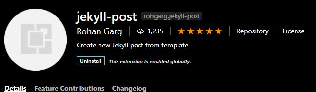

# PyWhy static website (Jekyll)

This repo holds the source code and content to pywhy.org. 

## Editing Content

For significant changes, follow [GitHub Flow](https://guides.github.com/introduction/flow/): create a new branch and submit a pull request to get review feedback from other team members. Once the PR is merged to main, the site will automatically rebuild and deploy.

The site is compiled using [Jekyll](https://jekyllrb.com/), so all of the content is written in [Markdown](https://daringfireball.net/projects/markdown/). In particular, Jekyll uses a superset of Markdown called Kramdown. [Syntax documentation here](https://kramdown.gettalong.org/syntax.html).

### Files you should edit

The content is structured to avoid needing HTML editing for the site content. There are a few places content resides in order to be as obvious as possible while also adhering to Jekyll requirements.

- Main pages (root): any *.md files in the root of the project directory are top-level pages (except this README!). Most are Markdown, except the main home page and the Stories page, because they need more advanced HTML layout. *.md files will be converted to HTML files automatically for the deployment.
- Content chunks [/content](./content): For fragmentary content such as sections or cards, use the [/content](./content) folder. This is to help distinguish *.md files that are used as _includes_ to other content and are not standalone. Notice that none of these have YAML front matter, because Jekyll does not process it when using Markdown for includes.
- Stories [/_posts](./_posts): For serial publication like blogs, Jekyll has a built-in convention for doing drafts, dating posts, etc. Therefore these files are required to be in the [_posts folder](./_posts). The filename should contain a "publication date" with yyyy-mm-dd. If it does not, Jekyll considers it a draft and will not process it (feel free to take advantage of this for actual drafts!).

### YAML Front Matter

Every page has YAML front matter that gives Jekyll some instructions on how to process it:
- layout: indicates what template should be used to render the page. Root pages should generally use "page". Stories should use "blog"
- title: displays a large-format title on the page
- description: display a subtitle on the page
- hero-image: optional large-format image to include in the layout beackground behind the title and description
- permalink: optional URL to force the output filename (handy for removing the date from blog post URLs)
- author: for blog posts

## Editing the Site

For deeper edits or site changes, you'll want to clone the repo and run Jekyll locally:

- Install [Docker](https://www.docker.com/get-started) for your platform and make sure it is running
- Install [Docker Compose](https://docs.docker.com/compose/install/) for your platform
- From a terminal, `cd` into the cloned repo directory and run `docker-compose up`

This will download the default Jekyll Docker container and spin up the Jekyll instance. Once it's ready (it might take a few minutes the first time), you can view the site at http://localhost:4000. The `docker-compose.yml` includes live reload config, so as you edit the site it will automatically refresh in your browser.

### Removing pages

If you need to remove a page, you'll want to redirect to preserve the links and prevent 404s for users that may have bookmarks.

Use the Jekyll [redirect plugin](https://github.com/jekyll/jekyll-redirect-from). If you choose a new page that the user should be directed to, you can add front matter to the new page that configures redirects, then delete the old page. It looks something like this:

```
redirect_from:
  - /data-collection.html
```

### Source files layout

We basically follow the [Jekyll convention](https://jekyllrb.com/docs/structure/) for the folder structure. In addition to the standard folders, we have a content folder for fragments.

### Adding Blog posts

#### VSCode Extension (easy mode)

On VSCode, install jekyll-post extension. After install, right click "\_post" directory and will be prompted to enter a name for post. The post will be created with the current date. Just insert your content as markdown and you're good to go!
<br />


#### File Insertion

To add blog posts without the VSCode extention, create a markdown file with the format YYYY-MM-DD-TITLE.md in the \_posts folder. Make sure to include the following in the header:

- layout: page
- author: your name
- permalink: html page of blog post
- excerpt: Summary of the article

It is important that if the date is in the future, the future:true flag is set or the post will not show up. The template for displaying blog posts is in .post-template file. The file [stories.html](./_includes/stories.html) takes care of iterating through all posts in \_posts directory and displaying. Basic information on setting up blog post with jekyll can be found [here](https://jekyllrb.com/docs/step-by-step/08-blogging/).
