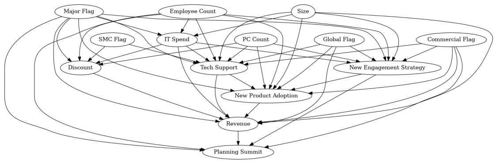

::: {.cell .markdown}

``{=html}

A software company would like to know whether its multiple outreach
efforts to their business customers are successful in boosting sales.
They would also like to learn how to better target different incentives
to different customers. In other words, they would like to learn the
**treatment effect** of each investment on customers\' total expenditure
on the company's products: particularly the **heterogeneous treatment
effect**.

In an ideal world, the company would run experiments where each customer
would receive a random assortment of investments. However, this approach
can be logistically prohibitive or strategically unsound: the company
might not have the resources to design such experiments or they might
not want to risk major revenue losses by randomizing their incentives to
top customers.

In this notebook, we show how tools from the
[Causica](https://github.com/microsoft/causica),
[EconML](https://aka.ms/econml) and
[DoWhy](https://github.com/py-why/dowhy) libraries can use historical
investment data to learn the effects of multiple investments.

For this exercise, we create simulated data that recreates some key
characteristics of real data from a software company facing this type of
decision. Simulating data protects the company's privacy. Because we
create the data, we are also in the unusual position of knowing the true
causal graph and true effects of each investments, so we can compare the
results of our estimation to this ground truth.

In the next section, we introduce this simulated data. We then use
Causica to discover the causal graph, the relationship between each
variable in the simulated data. With this generated graph, we use DoWhy
to identify an appropriate strategy to estimate the causal effect. We
pass this recommendation to EconML to estimate the personalized
treatment effects for each customer. We also show an alternative effect
estimation using Causica. Finally, we use EconML to map these estimated
effects into suggested investment strategies for each customer, and
DoWhy to test the assumptions underlying the causal estimation.
:::

::: {.cell .markdown}
### Outline

1.  [Data](#Data)
2.  [Using DECI from Causica to find causal graphs for this
    data](#Using-DECI-from-Causica-to-find-causal-graphs-for-this-data)
3.  [Treatment effect estimation](#Treatment-effect-estimation)
4.  [Make policy decisions with
    EconML](#Make-policy-decisions-with-EconML)
5.  [Appendix](#Appendix)
:::

::: {.cell .code execution_count="2"}
``` {.python}
# Some imports to get us started
import warnings
warnings.filterwarnings("ignore")
import os
os.environ['PYTHONWARNINGS'] = 'ignore::FutureWarning'
os.environ['TF_CPP_MIN_LOG_LEVEL'] = '2'

# Utilities
import os
import json
import urllib.request
import numpy as np
import pandas as pd
from difflib import get_close_matches
from scipy.special import expit 

# Generic ML imports
from sklearn.pipeline import make_pipeline, Pipeline
from sklearn.compose import ColumnTransformer
from sklearn.preprocessing import StandardScaler
from sklearn.linear_model import LogisticRegression, Lasso

# EconML imports
from econml.dml import LinearDML
from econml.cate_interpreter import SingleTreePolicyInterpreter

# DoWhy imports 
import dowhy
from dowhy import CausalModel 
import dowhy.gcm

# Causica imports
from causica.models.deci.deci import DECI
from causica.datasets.dataset import Dataset
from causica.datasets.variables import Variables

# Plots
import matplotlib.pyplot as plt
import seaborn as sns
import networkx as nx
from networkx.drawing.nx_pydot import to_pydot
from IPython.display import Image, display

%matplotlib inline
```
:::

::: {.cell .markdown}
# Data

The simulated dataset contains 10,000 customers.

We create one outcome of interest:

  -----------------------------------------------------------------------
  Feature Name            Type                    Details
  ----------------------- ----------------------- -----------------------
  **Revenue**             continuous              \\\$ Annual revenue
                                                  from customer given by
                                                  the amount of software
                                                  purchased
  -----------------------------------------------------------------------

We consider three possible treatments, the interventions whose impact we
wish to measure:

  -----------------------------------------------------------------------
  Feature Name            Type                    Details
  ----------------------- ----------------------- -----------------------
  **Tech Support**        binary                  whether the customer
                                                  received tech support
                                                  during the year

  **Discount**            binary                  whether the customer
                                                  was given a discount
                                                  during the year

  **New Strategy**        binary                  whether the customer
                                                  was targeted for a new
                                                  engagement strategy
                                                  with different outreach
                                                  behaviors
  -----------------------------------------------------------------------

Finally, we consider a variety of additional customer characteristics
that may affect revenue. Including these types of features is crucial
for causal analysis in order to map the full causal graph and separate
the true effects of treatments on outcomes from other correlation
generated by other influences.

  -----------------------------------------------------------------------
  Feature Name            Type                    Details
  ----------------------- ----------------------- -----------------------
  **Global Flag**         binary                  whether the customer
                                                  has global offices

  **Major Flag**          binary                  whether the customer is
                                                  a large consumer in
                                                  their industry (as
                                                  opposed to SMC - Small
                                                  Medium Corporation - or
                                                  SMB - Small Medium
                                                  Business)

  **SMC Flag**            binary                  whether the customer is
                                                  a Small Medium
                                                  Corporation (SMC, as
                                                  opposed to major and
                                                  SMB)

  **Commercial Flag**     binary                  whether the customer\'s
                                                  business is commercial
                                                  (as opposed to public
                                                  secor)

  **Planning Summit**     binary                  whether a sales team
                                                  member held an outreach
                                                  event with the customer
                                                  during the year

  **New Product           binary                  whether the customer
  Adoption**                                      signed a contract for
                                                  any new products during
                                                  the year

  **IT Spend**            continuous              \\\$ spent on
                                                  IT-related purchases

  **Employee Count**      continuous              number of employees

  **PC Count**            continuous              number of PCs used by
                                                  the customer

  **Size**                continuous              customer\'s total
                                                  revenue in the previous
                                                  calendar year
  -----------------------------------------------------------------------

In simulating the data, we maintain some key characteristics of the data
from the real company example, including some correlation patterns
between features and some potentially difficult data characteristics,
such as large outliers.
:::

::: {.cell .code execution_count="3"}
``` {.python}
# Import the sample multi-attribution data
file_url = "multi_attribution_data_20220819.csv"
multi_data = pd.read_csv(file_url)
```
:::

::: {.cell .code execution_count="4"}
``` {.python}
# Data sample
print('Data Shape:', multi_data.shape)
multi_data.head()
```

::: {.output .stream .stdout}
    Data Shape: (10000, 20)
:::

::: {.output .execute_result execution_count="4"}
```{=html}
<div>
<style scoped>
    .dataframe tbody tr th:only-of-type {
        vertical-align: middle;
    }

    .dataframe tbody tr th {
        vertical-align: top;
    }

    .dataframe thead th {
        text-align: right;
    }
</style>
<table border="1" class="dataframe">
  <thead>
    <tr style="text-align: right;">
      <th></th>
      <th>Global Flag</th>
      <th>Major Flag</th>
      <th>SMC Flag</th>
      <th>Commercial Flag</th>
      <th>IT Spend</th>
      <th>Employee Count</th>
      <th>PC Count</th>
      <th>Size</th>
      <th>Tech Support</th>
      <th>Discount</th>
      <th>New Engagement Strategy</th>
      <th>New Product Adoption</th>
      <th>Planning Summit</th>
      <th>Revenue</th>
      <th>Direct Treatment Effect: Tech Support</th>
      <th>Total Treatment Effect: Tech Support</th>
      <th>Direct Treatment Effect: Discount</th>
      <th>Total Treatment Effect: Discount</th>
      <th>Direct Treatment Effect: New Engagement Strategy</th>
      <th>Total Treatment Effect: New Engagement Strategy</th>
    </tr>
  </thead>
  <tbody>
    <tr>
      <th>0</th>
      <td>0</td>
      <td>0</td>
      <td>1</td>
      <td>1</td>
      <td>72490</td>
      <td>27</td>
      <td>25</td>
      <td>220417</td>
      <td>1</td>
      <td>0</td>
      <td>0</td>
      <td>1</td>
      <td>0</td>
      <td>39691.32</td>
      <td>9408.34</td>
      <td>10332.57</td>
      <td>11020.85</td>
      <td>11020.85</td>
      <td>0</td>
      <td>0</td>
    </tr>
    <tr>
      <th>1</th>
      <td>0</td>
      <td>0</td>
      <td>1</td>
      <td>0</td>
      <td>5985</td>
      <td>19</td>
      <td>12</td>
      <td>12510</td>
      <td>1</td>
      <td>0</td>
      <td>1</td>
      <td>1</td>
      <td>1</td>
      <td>14492.54</td>
      <td>5250.20</td>
      <td>6174.43</td>
      <td>625.50</td>
      <td>625.50</td>
      <td>0</td>
      <td>0</td>
    </tr>
    <tr>
      <th>2</th>
      <td>0</td>
      <td>0</td>
      <td>1</td>
      <td>0</td>
      <td>34399</td>
      <td>82</td>
      <td>55</td>
      <td>123530</td>
      <td>0</td>
      <td>0</td>
      <td>0</td>
      <td>0</td>
      <td>0</td>
      <td>16215.76</td>
      <td>7470.60</td>
      <td>8394.83</td>
      <td>6176.50</td>
      <td>6176.50</td>
      <td>0</td>
      <td>0</td>
    </tr>
    <tr>
      <th>3</th>
      <td>0</td>
      <td>1</td>
      <td>1</td>
      <td>1</td>
      <td>29705</td>
      <td>103</td>
      <td>58</td>
      <td>79297</td>
      <td>0</td>
      <td>1</td>
      <td>1</td>
      <td>1</td>
      <td>1</td>
      <td>25426.04</td>
      <td>6585.94</td>
      <td>7510.17</td>
      <td>3964.85</td>
      <td>3964.85</td>
      <td>0</td>
      <td>0</td>
    </tr>
    <tr>
      <th>4</th>
      <td>0</td>
      <td>0</td>
      <td>1</td>
      <td>1</td>
      <td>13498</td>
      <td>60</td>
      <td>26</td>
      <td>25472</td>
      <td>1</td>
      <td>0</td>
      <td>1</td>
      <td>1</td>
      <td>1</td>
      <td>21005.51</td>
      <td>5509.44</td>
      <td>6433.67</td>
      <td>1273.60</td>
      <td>1273.60</td>
      <td>0</td>
      <td>0</td>
    </tr>
  </tbody>
</table>
</div>
```
:::
:::

::: {.cell .code execution_count="5"}
``` {.python}
ground_truth_effects = multi_data.loc[:, 'Direct Treatment Effect: Tech Support':] # extract ground truth effects
multi_data = multi_data.loc[:, 'Global Flag': 'Revenue'] # remove ground truth from dataframe
```
:::

::: {.cell .code execution_count="6"}
``` {.python}
# Load metadata telling us the data type of each column
with open("multi_attribution_data_20220819_data_types.json") as f:
    variables = json.load(f)
```
:::

::: {.cell .markdown}
# Discover Causal Graph
:::

::: {.cell .code execution_count="5"}
``` {.python}
# Set up data in a suitable form for DECI to consume, using the loaded data types
numpy_data = multi_data.to_numpy()
data_mask = np.ones(numpy_data.shape)
variables = Variables.create_from_data_and_dict(numpy_data, data_mask, variables)
dataset = Dataset(train_data=numpy_data, train_mask=np.ones(numpy_data.shape), variables=variables)
```

::: {.output .stream .stdout}
    Minimum value of variable Global Flag inferred as 0. This can be changed manually in the dataset's variables.json file
    Max value of variable Global Flag inferred as 1. This can be changed manually in the dataset's variables.json file
    Variable Global Flag inferred to be a queriable variable. This can be changed manually in the dataset's variables.json file by updating the "query" field.
    Variable Global Flag inferred as not an active learning target variable. This can be changed manually in the dataset's variables.json file by updating the "target" field.
    Variable Global Flag inferred as an always observed target variable. This can be changed manually in the dataset's variables.json file by updating the "always_observed" field.
    Minimum value of variable Major Flag inferred as 0. This can be changed manually in the dataset's variables.json file
    Max value of variable Major Flag inferred as 1. This can be changed manually in the dataset's variables.json file
    Variable Major Flag inferred to be a queriable variable. This can be changed manually in the dataset's variables.json file by updating the "query" field.
    Variable Major Flag inferred as not an active learning target variable. This can be changed manually in the dataset's variables.json file by updating the "target" field.
    Variable Major Flag inferred as an always observed target variable. This can be changed manually in the dataset's variables.json file by updating the "always_observed" field.
    Minimum value of variable SMC Flag inferred as 0. This can be changed manually in the dataset's variables.json file
    Max value of variable SMC Flag inferred as 1. This can be changed manually in the dataset's variables.json file
    Variable SMC Flag inferred to be a queriable variable. This can be changed manually in the dataset's variables.json file by updating the "query" field.
    Variable SMC Flag inferred as not an active learning target variable. This can be changed manually in the dataset's variables.json file by updating the "target" field.
    Variable SMC Flag inferred as an always observed target variable. This can be changed manually in the dataset's variables.json file by updating the "always_observed" field.
    Minimum value of variable Commercial Flag inferred as 0. This can be changed manually in the dataset's variables.json file
    Max value of variable Commercial Flag inferred as 1. This can be changed manually in the dataset's variables.json file
    Variable Commercial Flag inferred to be a queriable variable. This can be changed manually in the dataset's variables.json file by updating the "query" field.
    Variable Commercial Flag inferred as not an active learning target variable. This can be changed manually in the dataset's variables.json file by updating the "target" field.
    Variable Commercial Flag inferred as an always observed target variable. This can be changed manually in the dataset's variables.json file by updating the "always_observed" field.
    Minimum value of variable IT Spend inferred as 1477.0. This can be changed manually in the dataset's variables.json file
    Max value of variable IT Spend inferred as 519145.0. This can be changed manually in the dataset's variables.json file
    Variable IT Spend inferred to be a queriable variable. This can be changed manually in the dataset's variables.json file by updating the "query" field.
    Variable IT Spend inferred as not an active learning target variable. This can be changed manually in the dataset's variables.json file by updating the "target" field.
    Variable IT Spend inferred as an always observed target variable. This can be changed manually in the dataset's variables.json file by updating the "always_observed" field.
    Minimum value of variable Employee Count inferred as 7.0. This can be changed manually in the dataset's variables.json file
    Max value of variable Employee Count inferred as 917.0. This can be changed manually in the dataset's variables.json file
    Variable Employee Count inferred to be a queriable variable. This can be changed manually in the dataset's variables.json file by updating the "query" field.
    Variable Employee Count inferred as not an active learning target variable. This can be changed manually in the dataset's variables.json file by updating the "target" field.
    Variable Employee Count inferred as an always observed target variable. This can be changed manually in the dataset's variables.json file by updating the "always_observed" field.
    Minimum value of variable PC Count inferred as 5.0. This can be changed manually in the dataset's variables.json file
    Max value of variable PC Count inferred as 517.0. This can be changed manually in the dataset's variables.json file
    Variable PC Count inferred to be a queriable variable. This can be changed manually in the dataset's variables.json file by updating the "query" field.
    Variable PC Count inferred as not an active learning target variable. This can be changed manually in the dataset's variables.json file by updating the "target" field.
    Variable PC Count inferred as an always observed target variable. This can be changed manually in the dataset's variables.json file by updating the "always_observed" field.
    Minimum value of variable Size inferred as 5078.0. This can be changed manually in the dataset's variables.json file
    Max value of variable Size inferred as 840628.0. This can be changed manually in the dataset's variables.json file
    Variable Size inferred to be a queriable variable. This can be changed manually in the dataset's variables.json file by updating the "query" field.
    Variable Size inferred as not an active learning target variable. This can be changed manually in the dataset's variables.json file by updating the "target" field.
    Variable Size inferred as an always observed target variable. This can be changed manually in the dataset's variables.json file by updating the "always_observed" field.
    Minimum value of variable Tech Support inferred as 0. This can be changed manually in the dataset's variables.json file
    Max value of variable Tech Support inferred as 1. This can be changed manually in the dataset's variables.json file
    Variable Tech Support inferred to be a queriable variable. This can be changed manually in the dataset's variables.json file by updating the "query" field.
    Variable Tech Support inferred as not an active learning target variable. This can be changed manually in the dataset's variables.json file by updating the "target" field.
    Variable Tech Support inferred as an always observed target variable. This can be changed manually in the dataset's variables.json file by updating the "always_observed" field.
    Minimum value of variable Discount inferred as 0. This can be changed manually in the dataset's variables.json file
    Max value of variable Discount inferred as 1. This can be changed manually in the dataset's variables.json file
    Variable Discount inferred to be a queriable variable. This can be changed manually in the dataset's variables.json file by updating the "query" field.
    Variable Discount inferred as not an active learning target variable. This can be changed manually in the dataset's variables.json file by updating the "target" field.
    Variable Discount inferred as an always observed target variable. This can be changed manually in the dataset's variables.json file by updating the "always_observed" field.
    Minimum value of variable New Engagement Strategy inferred as 0. This can be changed manually in the dataset's variables.json file
    Max value of variable New Engagement Strategy inferred as 1. This can be changed manually in the dataset's variables.json file
    Variable New Engagement Strategy inferred to be a queriable variable. This can be changed manually in the dataset's variables.json file by updating the "query" field.
    Variable New Engagement Strategy inferred as not an active learning target variable. This can be changed manually in the dataset's variables.json file by updating the "target" field.
    Variable New Engagement Strategy inferred as an always observed target variable. This can be changed manually in the dataset's variables.json file by updating the "always_observed" field.
    Minimum value of variable New Product Adoption inferred as 0. This can be changed manually in the dataset's variables.json file
    Max value of variable New Product Adoption inferred as 1. This can be changed manually in the dataset's variables.json file
    Variable New Product Adoption inferred to be a queriable variable. This can be changed manually in the dataset's variables.json file by updating the "query" field.
    Variable New Product Adoption inferred as not an active learning target variable. This can be changed manually in the dataset's variables.json file by updating the "target" field.
    Variable New Product Adoption inferred as an always observed target variable. This can be changed manually in the dataset's variables.json file by updating the "always_observed" field.
    Minimum value of variable Planning Summit inferred as 0. This can be changed manually in the dataset's variables.json file
    Max value of variable Planning Summit inferred as 1. This can be changed manually in the dataset's variables.json file
    Variable Planning Summit inferred to be a queriable variable. This can be changed manually in the dataset's variables.json file by updating the "query" field.
    Variable Planning Summit inferred as not an active learning target variable. This can be changed manually in the dataset's variables.json file by updating the "target" field.
    Variable Planning Summit inferred as an always observed target variable. This can be changed manually in the dataset's variables.json file by updating the "always_observed" field.
    Minimum value of variable Revenue inferred as 4125.25. This can be changed manually in the dataset's variables.json file
    Max value of variable Revenue inferred as 199371.22. This can be changed manually in the dataset's variables.json file
    Variable Revenue inferred to be a queriable variable. This can be changed manually in the dataset's variables.json file by updating the "query" field.
    Variable Revenue inferred as not an active learning target variable. This can be changed manually in the dataset's variables.json file by updating the "target" field.
    Variable Revenue inferred as an always observed target variable. This can be changed manually in the dataset's variables.json file by updating the "always_observed" field.
:::
:::

::: {.cell .markdown}
### Creating and training DECI model

The following snippets step through the process of:

-   configuring and creating a DECI model
-   training a model with no graph constraints
-   training a model with graph constraints

*Note*: if you have already trained a DECI model, you can reload the
model by skipping to the section below on \"Loading a saved DECI model\"
:::

::: {.cell .markdown}
#### DECI configuration

The DECI model has a number of hyperparameters, but attention need not
be paid to all of them. Here we highlight key hyperparameters that might
be changed to improve performance:

-   `learning_rate` is the step size for the Adam optimizer. Decrease
    the learning rate if training is unstable
-   `var_dist_A_learning_rate` is the learning rate for the causal graph
    distribution
-   `standardize_data_mean` and `standardize_data_std` tell DECI to
    standarize the data by subtracting the mean and dividing by the
    standard deviation of each column. *Note*: this improves training,
    but you need to take care because treatment effects will now be
    computed in this standardized space
-   `max_auglag_inner_epochs` is the number of gradient steps taken in
    each \"inner step\" of the DECI optimization. Decrease this to speed
    up training (at the risk of training not converging). Increase this
    to learn a more accurate model, or when the dataset is larger.
-   `max_steps_auglag` is the maximum number of \"inner steps\" taken.
    Decrease this to end training early (e.g. before a DAG has been
    found) to speed up training
-   `base_distribution_type` is the type of DECI model that is trained.
    It should be either `gaussian` or `spline`. Use `spline` for highly
    non-Gaussian data, or to fit a better density model of the
    observational data.

Other hyperparameters are less frequently changed.
:::

::: {.cell .code execution_count="6"}
``` {.python}
# DECI configurations
model_config = {
    "tau_gumbel": 0.25,
    "lambda_dag": 10.0,
    "lambda_sparse": 1.0,
    "lambda_prior": 0.0,
    # Choosing a Gaussian DECI model, alternative is "spline"
    "base_distribution_type": "gaussian",
    "imputation": False,
    "spline_bins": 8,
    "var_dist_A_mode": "enco",
    "mode_adjacency": "learn",
}

training_params = {
    # Setting higher learning rates can speed up training, but risks some instability
    "learning_rate": 1e-3,
    "var_dist_A_learning_rate": 1e-2,
    "batch_size": 512,
    # This standarizes the data before training. The DECI model operates in standardized space.
    "standardize_data_mean": True,
    "standardize_data_std": True,
    "rho": 1.0,
    "safety_rho": 1e18,
    "alpha": 0.0,
    "safety_alpha": 1e18,
    "tol_dag": 1e-9,
    "progress_rate": 0.65,
    # We are setting this large to wait until we find a DAG
    "max_steps_auglag": 200,
    # We are setting this large to learn a more accurate model.
    "max_auglag_inner_epochs": 2000,
    "max_p_train_dropout": 0.0,
    "reconstruction_loss_factor": 1.0,
    "anneal_entropy": "noanneal",
}
```
:::

::: {.cell .code execution_count="7"}
``` {.python}
deci_save_directory = "causica_deci_model"
# We recommend gpu training
device = "gpu"
model = DECI.create("mymodel", deci_save_directory, dataset.variables, model_config, device=device)
```
:::

::: {.cell .code execution_count="59"}
``` {.python}
model.run_train(dataset, training_params)
```

::: {.output .stream .stdout}
    Saving logs to causica_deci_model/train_output/summary
    Auglag Step: 0
    LR: 0.001
    Inner Step: 100, loss: 12.23, log p(x|A): -12.23, dag: 5.56881875, log p(A)_sp: -0.00, log q(A): -0.008, H filled: 0.000, rec: 0.000, penalty_dag_weighed: 0.00231, cts_mse_icgnn: 4.28
    Inner Step: 200, loss: 10.50, log p(x|A): -10.49, dag: 11.07477377, log p(A)_sp: -0.00, log q(A): -0.008, H filled: 0.000, rec: 0.000, penalty_dag_weighed: 0.00834, cts_mse_icgnn: 3.01
    Inner Step: 300, loss: 9.62, log p(x|A): -9.62, dag: 12.73339411, log p(A)_sp: -0.00, log q(A): -0.008, H filled: 0.000, rec: 0.000, penalty_dag_weighed: 0.0102, cts_mse_icgnn: 2.47
    Inner Step: 400, loss: 9.20, log p(x|A): -9.20, dag: 13.60129872, log p(A)_sp: -0.00, log q(A): -0.007, H filled: 0.000, rec: 0.000, penalty_dag_weighed: 0.0115, cts_mse_icgnn: 2.32
    Inner Step: 500, loss: 8.78, log p(x|A): -8.77, dag: 15.03115698, log p(A)_sp: -0.00, log q(A): -0.007, H filled: 0.000, rec: 0.000, penalty_dag_weighed: 0.0145, cts_mse_icgnn: 2.1
    Inner Step: 600, loss: 8.39, log p(x|A): -8.38, dag: 14.49006894, log p(A)_sp: -0.00, log q(A): -0.006, H filled: 0.000, rec: 0.000, penalty_dag_weighed: 0.0131, cts_mse_icgnn: 1.92
    Inner Step: 700, loss: 8.09, log p(x|A): -8.07, dag: 15.68251080, log p(A)_sp: -0.00, log q(A): -0.006, H filled: 0.000, rec: 0.000, penalty_dag_weighed: 0.0153, cts_mse_icgnn: 1.81
    Inner Step: 800, loss: 7.79, log p(x|A): -7.78, dag: 14.95844391, log p(A)_sp: -0.00, log q(A): -0.006, H filled: 0.000, rec: 0.000, penalty_dag_weighed: 0.0145, cts_mse_icgnn: 1.76
    Inner Step: 900, loss: 7.51, log p(x|A): -7.49, dag: 16.55328426, log p(A)_sp: -0.00, log q(A): -0.005, H filled: 0.000, rec: 0.000, penalty_dag_weighed: 0.0174, cts_mse_icgnn: 1.75
    Inner Step: 1000, loss: 7.30, log p(x|A): -7.29, dag: 13.99129623, log p(A)_sp: -0.00, log q(A): -0.005, H filled: 0.000, rec: 0.000, penalty_dag_weighed: 0.0124, cts_mse_icgnn: 1.75
    Inner Step: 1100, loss: 7.10, log p(x|A): -7.08, dag: 14.99320791, log p(A)_sp: -0.00, log q(A): -0.005, H filled: 0.000, rec: 0.000, penalty_dag_weighed: 0.0133, cts_mse_icgnn: 1.74
    Inner Step: 1200, loss: 6.80, log p(x|A): -6.79, dag: 14.12881081, log p(A)_sp: -0.00, log q(A): -0.005, H filled: 0.000, rec: 0.000, penalty_dag_weighed: 0.0116, cts_mse_icgnn: 1.63
    Inner Step: 1300, loss: 6.83, log p(x|A): -6.82, dag: 14.43983156, log p(A)_sp: -0.00, log q(A): -0.005, H filled: 0.000, rec: 0.000, penalty_dag_weighed: 0.0126, cts_mse_icgnn: 1.66
    Inner Step: 1400, loss: 6.58, log p(x|A): -6.57, dag: 15.48700609, log p(A)_sp: -0.00, log q(A): -0.004, H filled: 0.000, rec: 0.000, penalty_dag_weighed: 0.0143, cts_mse_icgnn: 1.58
    Inner Step: 1500, loss: 6.45, log p(x|A): -6.44, dag: 15.81871737, log p(A)_sp: -0.00, log q(A): -0.004, H filled: 0.000, rec: 0.000, penalty_dag_weighed: 0.0147, cts_mse_icgnn: 1.52
    Inner Step: 1600, loss: 6.24, log p(x|A): -6.23, dag: 15.70234673, log p(A)_sp: -0.00, log q(A): -0.004, H filled: 0.000, rec: 0.000, penalty_dag_weighed: 0.0141, cts_mse_icgnn: 1.46
    Inner Step: 1700, loss: 6.35, log p(x|A): -6.33, dag: 14.61306210, log p(A)_sp: -0.00, log q(A): -0.004, H filled: 0.000, rec: 0.000, penalty_dag_weighed: 0.0126, cts_mse_icgnn: 1.55
    Inner Step: 1800, loss: 6.37, log p(x|A): -6.36, dag: 14.07324327, log p(A)_sp: -0.00, log q(A): -0.004, H filled: 0.000, rec: 0.000, penalty_dag_weighed: 0.0116, cts_mse_icgnn: 1.56
    Inner Step: 1900, loss: 6.11, log p(x|A): -6.09, dag: 15.07769218, log p(A)_sp: -0.00, log q(A): -0.004, H filled: 0.000, rec: 0.000, penalty_dag_weighed: 0.0129, cts_mse_icgnn: 1.45
    Inner Step: 2000, loss: 5.89, log p(x|A): -5.88, dag: 16.71338051, log p(A)_sp: -0.00, log q(A): -0.003, H filled: 0.000, rec: 0.000, penalty_dag_weighed: 0.0164, cts_mse_icgnn: 1.39
    Best model found at innner step 1940, with Loss 5.77
    Dag penalty after inner: 14.2366172500
    Time taken for this step 16.65821075439453
    Unrounded adj matrix:
    [[[0.00000000e+00 4.97066975e-02 1.84190035e-01 1.49726629e-01
       1.45747662e-02 3.11185122e-02 3.69059443e-02 7.40197301e-02
       2.21623778e-01 5.24912477e-02 2.94848680e-02 3.97874713e-01
       1.27879381e-02 3.48324776e-02]
      [1.50473714e-02 0.00000000e+00 2.18797326e-02 9.86564696e-01
       1.11725926e-02 1.67627931e-02 2.01475620e-02 1.71174407e-02
       6.27000868e-01 4.23260331e-02 1.82181001e-02 3.28999758e-02
       9.06905055e-01 4.61818576e-02]
      [1.64011121e-02 1.36654973e-02 0.00000000e+00 8.31869066e-01
       5.90137243e-02 1.25771761e-02 1.14013553e-02 1.31241679e-02
       9.18517232e-01 1.76719427e-02 3.98421884e-02 6.81121945e-02
       2.71772146e-02 6.11859560e-03]
      [3.71706486e-03 3.87430191e-04 1.86645985e-03 0.00000000e+00
       3.66747379e-04 1.08832121e-03 2.22581625e-03 5.16116619e-04
       6.36219978e-04 2.35617161e-03 1.37031078e-03 5.04732132e-04
       4.02536750e-01 8.05020332e-04]
      [2.28615403e-02 7.82120228e-03 6.63709641e-03 9.83801007e-01
       0.00000000e+00 9.35071707e-03 4.35996056e-03 9.71302807e-01
       2.80296803e-03 1.20603442e-02 1.06616616e-01 3.99694562e-01
       9.75938141e-01 9.01645422e-01]
      [1.84917450e-02 7.33047724e-03 3.42771411e-02 5.52972257e-01
       1.64702535e-02 0.00000000e+00 9.79201913e-01 1.04823709e-02
       9.34994578e-01 3.47017944e-01 2.11645961e-02 1.91694438e-01
       2.75236368e-02 7.07626343e-04]
      [3.29915881e-02 1.53983235e-02 2.46655941e-02 2.15175748e-02
       1.38015747e-02 1.96745992e-02 0.00000000e+00 1.14112496e-02
       6.79608285e-01 9.48414445e-01 8.59770596e-01 7.58704901e-01
       9.81993198e-01 9.72753406e-01]
      [2.44087577e-02 4.06088829e-02 1.56804323e-02 9.80735481e-01
       2.58945823e-02 4.17971611e-02 6.22278452e-03 0.00000000e+00
       1.88673854e-01 4.99445081e-01 9.19646204e-01 8.62450361e-01
       4.68554497e-02 8.53388011e-01]
      [4.72491980e-03 3.42071056e-03 7.04509616e-02 9.86400545e-01
       9.80788171e-01 5.63685298e-02 2.89878309e-01 1.54643059e-02
       0.00000000e+00 9.35408950e-01 2.87658572e-02 9.28549647e-01
       3.72905135e-02 5.09369373e-03]
      [1.18875504e-02 2.00851560e-02 7.20506907e-03 6.44871593e-02
       9.70448911e-01 6.46703660e-01 4.26594615e-02 3.85676324e-01
       4.14488912e-02 0.00000000e+00 8.49963427e-02 5.46910942e-01
       9.20479536e-01 1.80354118e-02]
      [1.33031607e-02 8.54700863e-01 1.48221850e-02 9.44503784e-01
       8.87910187e-01 1.48754120e-01 2.10225582e-03 6.83850050e-02
       4.49457169e-02 4.14534807e-02 0.00000000e+00 1.67862177e-02
       6.05868101e-02 1.00763321e-01]
      [5.59514761e-03 4.53454256e-03 4.75406647e-03 9.78957176e-01
       2.30896473e-03 7.90085137e-01 1.03729725e-01 1.29044056e-03
       6.19064569e-02 7.32058287e-03 1.89191699e-02 0.00000000e+00
       3.04359198e-02 2.26579905e-02]
      [1.30437613e-02 7.73975849e-02 8.24826956e-03 5.55245221e-01
       1.55236125e-02 5.76633215e-03 5.96463680e-04 3.18535566e-02
       5.47520518e-02 3.94195318e-03 9.32552338e-01 8.99381459e-01
       0.00000000e+00 1.47719979e-02]
      [1.28324032e-02 9.14953470e-01 2.03820467e-02 9.82740343e-01
       9.57962275e-02 9.55784738e-01 2.36612558e-03 1.35694981e-01
       9.79065657e-01 9.73100126e-01 8.82236302e-01 9.57298219e-01
       9.82222617e-01 0.00000000e+00]]]
    Number of edges in adj matrix (unrounded) 47.74185359477997, (rounded) 46.0.
    Not done inner optimization.
    Dag penalty: 14.236617249965668
    Rho: 1.00, alpha: 0.00
    Auglag Step: 1
    LR: 0.001
    Inner Step: 100, loss: 5.97, log p(x|A): -5.95, dag: 14.83238024, log p(A)_sp: -0.00, log q(A): -0.003, H filled: 0.000, rec: 0.000, penalty_dag_weighed: 0.0129, cts_mse_icgnn: 1.44
    Inner Step: 200, loss: 5.85, log p(x|A): -5.84, dag: 14.64094801, log p(A)_sp: -0.00, log q(A): -0.003, H filled: 0.000, rec: 0.000, penalty_dag_weighed: 0.0125, cts_mse_icgnn: 1.37
    Inner Step: 300, loss: 5.99, log p(x|A): -5.98, dag: 15.14439550, log p(A)_sp: -0.00, log q(A): -0.003, H filled: 0.000, rec: 0.000, penalty_dag_weighed: 0.0131, cts_mse_icgnn: 1.43
    Inner Step: 400, loss: 5.83, log p(x|A): -5.81, dag: 15.43213943, log p(A)_sp: -0.00, log q(A): -0.003, H filled: 0.000, rec: 0.000, penalty_dag_weighed: 0.0133, cts_mse_icgnn: 1.32
    Inner Step: 500, loss: 5.85, log p(x|A): -5.83, dag: 16.02455063, log p(A)_sp: -0.00, log q(A): -0.003, H filled: 0.000, rec: 0.000, penalty_dag_weighed: 0.0144, cts_mse_icgnn: 1.36
    Inner Step: 600, loss: 5.77, log p(x|A): -5.76, dag: 15.23356096, log p(A)_sp: -0.00, log q(A): -0.003, H filled: 0.000, rec: 0.000, penalty_dag_weighed: 0.0129, cts_mse_icgnn: 1.35
:::

::: {.output .stream .stdout}
    Inner Step: 700, loss: 5.82, log p(x|A): -5.80, dag: 14.34944656, log p(A)_sp: -0.00, log q(A): -0.003, H filled: 0.000, rec: 0.000, penalty_dag_weighed: 0.0113, cts_mse_icgnn: 1.36
    Inner Step: 800, loss: 5.64, log p(x|A): -5.63, dag: 15.24197502, log p(A)_sp: -0.01, log q(A): -0.003, H filled: 0.000, rec: 0.000, penalty_dag_weighed: 0.0127, cts_mse_icgnn: 1.32
    Inner Step: 900, loss: 5.70, log p(x|A): -5.69, dag: 15.38411249, log p(A)_sp: -0.01, log q(A): -0.003, H filled: 0.000, rec: 0.000, penalty_dag_weighed: 0.0132, cts_mse_icgnn: 1.35
    Inner Step: 1000, loss: 5.64, log p(x|A): -5.63, dag: 15.21374117, log p(A)_sp: -0.01, log q(A): -0.003, H filled: 0.000, rec: 0.000, penalty_dag_weighed: 0.0124, cts_mse_icgnn: 1.34
    Inner Step: 1100, loss: 5.47, log p(x|A): -5.46, dag: 16.00282013, log p(A)_sp: -0.01, log q(A): -0.002, H filled: 0.000, rec: 0.000, penalty_dag_weighed: 0.0139, cts_mse_icgnn: 1.28
    Inner Step: 1200, loss: 5.67, log p(x|A): -5.65, dag: 15.45925512, log p(A)_sp: -0.01, log q(A): -0.002, H filled: 0.000, rec: 0.000, penalty_dag_weighed: 0.0129, cts_mse_icgnn: 1.3
    Inner Step: 1300, loss: 5.69, log p(x|A): -5.68, dag: 16.63770813, log p(A)_sp: -0.01, log q(A): -0.002, H filled: 0.000, rec: 0.000, penalty_dag_weighed: 0.015, cts_mse_icgnn: 1.32
    Inner Step: 1400, loss: 5.39, log p(x|A): -5.37, dag: 17.51111235, log p(A)_sp: -0.01, log q(A): -0.002, H filled: 0.000, rec: 0.000, penalty_dag_weighed: 0.0167, cts_mse_icgnn: 1.22
    Inner Step: 1500, loss: 5.65, log p(x|A): -5.64, dag: 17.06698223, log p(A)_sp: -0.01, log q(A): -0.002, H filled: 0.000, rec: 0.000, penalty_dag_weighed: 0.0157, cts_mse_icgnn: 1.33
    Inner Step: 1600, loss: 5.45, log p(x|A): -5.43, dag: 15.89164965, log p(A)_sp: -0.01, log q(A): -0.002, H filled: 0.000, rec: 0.000, penalty_dag_weighed: 0.0137, cts_mse_icgnn: 1.27
    Inner Step: 1700, loss: 5.36, log p(x|A): -5.34, dag: 17.12128942, log p(A)_sp: -0.01, log q(A): -0.002, H filled: 0.000, rec: 0.000, penalty_dag_weighed: 0.0157, cts_mse_icgnn: 1.25
    Inner Step: 1800, loss: 5.39, log p(x|A): -5.37, dag: 16.26193388, log p(A)_sp: -0.01, log q(A): -0.002, H filled: 0.000, rec: 0.000, penalty_dag_weighed: 0.0141, cts_mse_icgnn: 1.23
    Inner Step: 1900, loss: 5.47, log p(x|A): -5.45, dag: 15.25241995, log p(A)_sp: -0.01, log q(A): -0.002, H filled: 0.000, rec: 0.000, penalty_dag_weighed: 0.0124, cts_mse_icgnn: 1.26
    Inner Step: 2000, loss: 5.29, log p(x|A): -5.27, dag: 15.67932528, log p(A)_sp: -0.01, log q(A): -0.002, H filled: 0.000, rec: 0.000, penalty_dag_weighed: 0.013, cts_mse_icgnn: 1.22
    Best model found at innner step 2000, with Loss 5.07
    Dag penalty after inner: 15.7190873079
    Time taken for this step 16.997881412506104
    Unrounded adj matrix:
    [[[0.00000000e+00 2.24946141e-01 2.64222324e-01 1.61164343e-01
       1.72561407e-02 1.54835582e-02 1.97753310e-02 7.53491521e-02
       2.71419168e-01 1.26305521e-01 5.26278019e-02 9.85665321e-01
       7.00293779e-02 2.87902951e-02]
      [1.89965963e-03 0.00000000e+00 4.17554379e-03 9.96478081e-01
       2.75939703e-03 5.40739298e-03 3.99225950e-03 5.91897964e-03
       2.24968135e-01 9.50956941e-02 1.25694275e-03 9.93960679e-01
       9.82823491e-01 1.95352435e-02]
      [5.64202070e-02 3.26704383e-02 0.00000000e+00 8.11849117e-01
       2.97382295e-01 2.26942301e-02 1.30470991e-02 8.37939978e-03
       9.78496015e-01 1.65082812e-02 3.53847742e-02 4.31508005e-01
       3.19932103e-02 7.61306286e-03]
      [4.81605530e-04 1.12235546e-04 9.87887383e-04 0.00000000e+00
       9.87648964e-05 6.57439232e-05 4.48167324e-04 7.85589218e-05
       1.27255917e-04 3.34382057e-05 1.85310841e-04 1.18494034e-04
       9.25444126e-01 4.55141068e-04]
      [3.93795967e-03 5.37502766e-03 1.67977810e-03 9.94896352e-01
       0.00000000e+00 4.50462103e-03 1.72477961e-03 9.95632648e-01
       6.91950321e-04 3.37368250e-03 1.80341601e-02 9.83590364e-01
       9.86312866e-01 9.71576631e-01]
      [6.02924824e-03 3.07238102e-03 4.84532118e-03 9.82015908e-01
       3.53741646e-03 0.00000000e+00 9.94635880e-01 1.31273270e-03
       9.72283781e-01 6.49698973e-02 4.17709351e-04 4.56447005e-02
       1.71766281e-02 1.65462494e-04]
      [8.45682621e-03 1.02277398e-02 5.29158115e-03 2.24618316e-02
       8.85885954e-03 5.15800714e-03 0.00000000e+00 5.37455082e-03
       7.69464374e-01 9.85427558e-01 8.64562452e-01 6.89534724e-01
       9.95348692e-01 9.93701577e-01]
      [7.21955299e-03 3.64310741e-02 5.16188145e-03 9.95219171e-01
       4.05329466e-03 2.76582837e-02 3.49849463e-03 0.00000000e+00
       9.41029489e-01 2.18794882e-01 9.60022151e-01 9.93440866e-01
       2.75406837e-02 8.76427710e-01]
      [2.30598450e-03 4.83155251e-03 1.86458230e-02 9.95143831e-01
       9.92947996e-01 2.48697400e-02 2.16203630e-01 4.93943691e-04
       0.00000000e+00 9.82971549e-01 1.00330710e-02 9.78042126e-01
       7.76743889e-03 8.53359699e-04]
      [4.11736965e-03 6.01220131e-03 1.56903267e-03 9.77586627e-01
       9.90380287e-01 9.34036374e-01 1.20330453e-02 2.51512051e-01
       1.09778047e-02 0.00000000e+00 1.55860782e-02 9.81507719e-01
       9.70339835e-01 3.76546383e-03]
      [3.37439775e-03 9.88125920e-01 3.08322906e-03 9.86820281e-01
       9.81035173e-01 9.45108533e-01 1.28877163e-03 3.41081619e-02
       1.23269558e-02 1.03597045e-02 0.00000000e+00 4.17011976e-03
       1.74506307e-02 3.01125646e-02]
      [2.30967999e-04 3.65972519e-05 3.68237495e-04 9.95371461e-01
       1.22904778e-04 9.48842406e-01 1.09440684e-02 9.08970833e-05
       1.86430812e-02 2.04324722e-04 3.83740664e-03 0.00000000e+00
       1.25989318e-02 1.37861967e-02]
      [2.07608938e-03 6.55651093e-03 1.55973434e-03 6.32867813e-02
       1.20676160e-02 1.22183561e-03 7.71284103e-05 2.45153904e-03
       5.49894571e-03 5.63144684e-04 9.81617808e-01 5.93441725e-02
       0.00000000e+00 3.37171555e-03]
      [9.98079777e-03 9.73584473e-01 3.72534990e-03 9.90761280e-01
       2.80404687e-02 9.90809798e-01 4.79519367e-04 1.20886445e-01
       9.93378580e-01 9.94613171e-01 9.65211213e-01 9.83082652e-01
       9.96026397e-01 0.00000000e+00]]]
    Number of edges in adj matrix (unrounded) 52.45894205570221, (rounded) 50.0.
    Updating alpha.
    Dag penalty: 15.719087307929993
    Rho: 1.00, alpha: 15.72
    Auglag Step: 2
    LR: 0.001
    Inner Step: 100, loss: 5.26, log p(x|A): -5.22, dag: 15.62836018, log p(A)_sp: -0.01, log q(A): -0.002, H filled: 0.000, rec: 0.000, penalty_dag_weighed: 0.0374, cts_mse_icgnn: 1.22
    Inner Step: 200, loss: 5.34, log p(x|A): -5.30, dag: 14.86612318, log p(A)_sp: -0.01, log q(A): -0.002, H filled: 0.000, rec: 0.000, penalty_dag_weighed: 0.0352, cts_mse_icgnn: 1.26
    Inner Step: 300, loss: 5.32, log p(x|A): -5.29, dag: 14.32430294, log p(A)_sp: -0.01, log q(A): -0.002, H filled: 0.000, rec: 0.000, penalty_dag_weighed: 0.0333, cts_mse_icgnn: 1.21
    Inner Step: 400, loss: 5.27, log p(x|A): -5.24, dag: 13.44099905, log p(A)_sp: -0.01, log q(A): -0.002, H filled: 0.000, rec: 0.000, penalty_dag_weighed: 0.0305, cts_mse_icgnn: 1.23
    Inner Step: 500, loss: 5.41, log p(x|A): -5.38, dag: 13.37534433, log p(A)_sp: -0.01, log q(A): -0.002, H filled: 0.000, rec: 0.000, penalty_dag_weighed: 0.0303, cts_mse_icgnn: 1.26
    Inner Step: 600, loss: 5.21, log p(x|A): -5.17, dag: 13.93193089, log p(A)_sp: -0.01, log q(A): -0.002, H filled: 0.000, rec: 0.000, penalty_dag_weighed: 0.032, cts_mse_icgnn: 1.2
    Inner Step: 700, loss: 5.30, log p(x|A): -5.27, dag: 13.58394562, log p(A)_sp: -0.01, log q(A): -0.002, H filled: 0.000, rec: 0.000, penalty_dag_weighed: 0.031, cts_mse_icgnn: 1.22
    Inner Step: 800, loss: 5.24, log p(x|A): -5.21, dag: 13.45018473, log p(A)_sp: -0.01, log q(A): -0.002, H filled: 0.000, rec: 0.000, penalty_dag_weighed: 0.0305, cts_mse_icgnn: 1.22
    Inner Step: 900, loss: 5.22, log p(x|A): -5.18, dag: 13.69099186, log p(A)_sp: -0.01, log q(A): -0.002, H filled: 0.000, rec: 0.000, penalty_dag_weighed: 0.0313, cts_mse_icgnn: 1.24
    Inner Step: 1000, loss: 5.37, log p(x|A): -5.34, dag: 13.18748949, log p(A)_sp: -0.01, log q(A): -0.002, H filled: 0.000, rec: 0.000, penalty_dag_weighed: 0.0297, cts_mse_icgnn: 1.25
    Inner Step: 1100, loss: 5.21, log p(x|A): -5.18, dag: 12.27709597, log p(A)_sp: -0.01, log q(A): -0.001, H filled: 0.000, rec: 0.000, penalty_dag_weighed: 0.027, cts_mse_icgnn: 1.22
    Reducing lr to 0.00010
    Inner Step: 1200, loss: 5.27, log p(x|A): -5.23, dag: 12.91314764, log p(A)_sp: -0.01, log q(A): -0.001, H filled: 0.000, rec: 0.000, penalty_dag_weighed: 0.029, cts_mse_icgnn: 1.23
:::

::: {.output .stream .stdout}
    Inner Step: 1300, loss: 5.16, log p(x|A): -5.13, dag: 12.81269665, log p(A)_sp: -0.01, log q(A): -0.001, H filled: 0.000, rec: 0.000, penalty_dag_weighed: 0.0287, cts_mse_icgnn: 1.21
    Inner Step: 1400, loss: 5.14, log p(x|A): -5.11, dag: 13.27857042, log p(A)_sp: -0.01, log q(A): -0.001, H filled: 0.000, rec: 0.000, penalty_dag_weighed: 0.03, cts_mse_icgnn: 1.2
    Inner Step: 1500, loss: 5.12, log p(x|A): -5.08, dag: 12.94650284, log p(A)_sp: -0.01, log q(A): -0.001, H filled: 0.000, rec: 0.000, penalty_dag_weighed: 0.029, cts_mse_icgnn: 1.2
    Inner Step: 1600, loss: 5.12, log p(x|A): -5.08, dag: 12.75088198, log p(A)_sp: -0.01, log q(A): -0.001, H filled: 0.000, rec: 0.000, penalty_dag_weighed: 0.0285, cts_mse_icgnn: 1.21
    Inner Step: 1700, loss: 5.12, log p(x|A): -5.09, dag: 12.58752289, log p(A)_sp: -0.01, log q(A): -0.001, H filled: 0.000, rec: 0.000, penalty_dag_weighed: 0.0279, cts_mse_icgnn: 1.19
    Inner Step: 1800, loss: 5.21, log p(x|A): -5.18, dag: 12.75214642, log p(A)_sp: -0.01, log q(A): -0.001, H filled: 0.000, rec: 0.000, penalty_dag_weighed: 0.0284, cts_mse_icgnn: 1.2
    Inner Step: 1900, loss: 5.11, log p(x|A): -5.08, dag: 13.13831776, log p(A)_sp: -0.01, log q(A): -0.001, H filled: 0.000, rec: 0.000, penalty_dag_weighed: 0.0296, cts_mse_icgnn: 1.19
    Inner Step: 2000, loss: 5.11, log p(x|A): -5.08, dag: 13.02090799, log p(A)_sp: -0.01, log q(A): -0.001, H filled: 0.000, rec: 0.000, penalty_dag_weighed: 0.0293, cts_mse_icgnn: 1.19
    Best model found at innner step 1920, with Loss 4.93
    Dag penalty after inner: 13.3978731403
    Time taken for this step 17.30281639099121
    Unrounded adj matrix:
    [[[0.00000000e+00 2.76564837e-01 2.19105422e-01 2.33345389e-01
       2.07850933e-02 2.43076086e-02 8.68719816e-03 8.82666111e-02
       2.11343169e-01 1.86870158e-01 1.00716710e-01 9.96530592e-01
       8.94059539e-02 2.86760330e-02]
      [1.05929375e-03 0.00000000e+00 2.86775827e-03 9.98377502e-01
       1.18273497e-03 1.97887421e-03 1.85328722e-03 1.53142214e-03
       2.60627866e-02 1.82089925e-01 6.95347786e-04 9.96881902e-01
       9.93496418e-01 1.84898376e-02]
      [9.44161415e-03 8.04756880e-02 0.00000000e+00 6.14521742e-01
       8.80233586e-01 3.26976776e-02 9.90873575e-03 1.16987228e-02
       9.93283093e-01 9.69797373e-03 1.01025045e-01 3.21359515e-01
       2.21790671e-02 1.28653049e-02]
      [4.02927399e-04 5.42998314e-05 6.62803650e-04 0.00000000e+00
       7.28368759e-05 3.03387642e-05 2.23994255e-04 4.52995300e-05
       9.41753387e-05 9.17911530e-06 1.38878822e-04 8.82744789e-05
       9.75190639e-01 2.89261341e-04]
      [1.15102530e-03 6.86317682e-03 2.80022621e-04 9.96391535e-01
       0.00000000e+00 2.66134739e-03 7.62283802e-04 9.96586144e-01
       2.54511833e-04 1.49333477e-03 9.57906246e-03 9.94095564e-01
       9.92326200e-01 9.87469137e-01]
      [1.39689445e-03 1.15036964e-03 2.49820948e-03 9.92488325e-01
       1.76739693e-03 0.00000000e+00 9.96239245e-01 1.13856792e-03
       9.85325575e-01 3.52143645e-02 6.87837601e-05 2.12199092e-02
       2.94792652e-03 5.17964363e-05]
      [5.49387932e-03 1.30848289e-02 5.76049089e-03 1.04832649e-02
       7.19493628e-03 3.63034010e-03 0.00000000e+00 3.31962109e-03
       8.42500091e-01 9.89265859e-01 6.72004223e-02 2.42565870e-02
       9.97708678e-01 9.96818602e-01]
      [4.90814447e-03 1.30140781e-02 1.75368786e-03 9.97407973e-01
       3.17174196e-03 1.69802904e-02 1.66440010e-03 0.00000000e+00
       9.76091206e-01 3.42326760e-02 9.64810550e-01 9.96569812e-01
       1.70866847e-02 9.03588355e-01]
      [5.44965267e-04 5.34713268e-03 5.15705347e-03 9.96531963e-01
       9.94932830e-01 1.33961439e-02 1.49407506e-01 8.32676888e-05
       0.00000000e+00 9.90667343e-01 2.56323814e-03 9.88561392e-01
       4.61256504e-03 4.87506390e-04]
      [1.13326311e-03 3.66890430e-03 1.02216005e-03 9.95909274e-01
       9.94189441e-01 9.64322984e-01 9.23466682e-03 2.81871557e-02
       5.76674938e-03 0.00000000e+00 7.37118721e-03 9.95927513e-01
       9.83194470e-01 2.48372555e-03]
      [1.03431940e-03 9.92818296e-01 8.64326954e-04 9.89899278e-01
       9.89953101e-01 9.85177457e-01 1.90973282e-03 2.95149088e-02
       3.13752890e-03 3.68022919e-03 0.00000000e+00 1.68579817e-03
       1.11529231e-02 1.46459937e-02]
      [6.56247139e-05 2.08616257e-05 4.54664230e-04 9.96710420e-01
       5.40614128e-05 9.75776196e-01 4.24122810e-03 2.92062759e-05
       9.12916660e-03 3.48091125e-05 2.44665146e-03 0.00000000e+00
       4.67211008e-03 1.25015378e-02]
      [1.11109018e-03 1.26421452e-03 1.15674734e-03 1.88876987e-02
       6.94018602e-03 7.36117363e-04 4.05311584e-05 1.09714270e-03
       1.16819143e-03 3.20017338e-04 9.88452196e-01 4.75531816e-03
       0.00000000e+00 2.55358219e-03]
      [3.42661142e-03 9.78113592e-01 1.50805712e-03 9.94445741e-01
       1.24109387e-02 9.93368268e-01 2.42233276e-04 9.50172544e-02
       9.96275961e-01 9.96928811e-01 9.83124971e-01 9.85847950e-01
       9.96960878e-01 0.00000000e+00]]]
    Number of edges in adj matrix (unrounded) 50.95974957942963, (rounded) 49.0.
    Not done inner optimization.
    Dag penalty: 13.397873140335083
    Rho: 1.00, alpha: 15.72
    Auglag Step: 3
    LR: 0.001
    Inner Step: 100, loss: 5.21, log p(x|A): -5.18, dag: 12.91781046, log p(A)_sp: -0.01, log q(A): -0.001, H filled: 0.000, rec: 0.000, penalty_dag_weighed: 0.0289, cts_mse_icgnn: 1.2
    Inner Step: 200, loss: 5.26, log p(x|A): -5.23, dag: 13.11002247, log p(A)_sp: -0.01, log q(A): -0.001, H filled: 0.000, rec: 0.000, penalty_dag_weighed: 0.0295, cts_mse_icgnn: 1.23
    Inner Step: 300, loss: 5.27, log p(x|A): -5.24, dag: 12.84358202, log p(A)_sp: -0.01, log q(A): -0.001, H filled: 0.000, rec: 0.000, penalty_dag_weighed: 0.0287, cts_mse_icgnn: 1.22
    Inner Step: 400, loss: 5.19, log p(x|A): -5.16, dag: 13.08004873, log p(A)_sp: -0.01, log q(A): -0.001, H filled: 0.000, rec: 0.000, penalty_dag_weighed: 0.0294, cts_mse_icgnn: 1.21
    Inner Step: 500, loss: 5.15, log p(x|A): -5.12, dag: 12.75494503, log p(A)_sp: -0.01, log q(A): -0.001, H filled: 0.000, rec: 0.000, penalty_dag_weighed: 0.0284, cts_mse_icgnn: 1.21
    Inner Step: 600, loss: 5.12, log p(x|A): -5.09, dag: 12.71417948, log p(A)_sp: -0.01, log q(A): -0.001, H filled: 0.000, rec: 0.000, penalty_dag_weighed: 0.0282, cts_mse_icgnn: 1.2
    Inner Step: 700, loss: 5.15, log p(x|A): -5.12, dag: 13.10845900, log p(A)_sp: -0.01, log q(A): -0.001, H filled: 0.000, rec: 0.000, penalty_dag_weighed: 0.0294, cts_mse_icgnn: 1.22
    Inner Step: 800, loss: 5.35, log p(x|A): -5.31, dag: 13.04555914, log p(A)_sp: -0.01, log q(A): -0.001, H filled: 0.000, rec: 0.000, penalty_dag_weighed: 0.0293, cts_mse_icgnn: 1.22
    Inner Step: 900, loss: 5.18, log p(x|A): -5.15, dag: 13.12228327, log p(A)_sp: -0.01, log q(A): -0.001, H filled: 0.000, rec: 0.000, penalty_dag_weighed: 0.0297, cts_mse_icgnn: 1.21
    Reducing lr to 0.00010
    Inner Step: 1000, loss: 5.15, log p(x|A): -5.12, dag: 12.75640835, log p(A)_sp: -0.01, log q(A): -0.001, H filled: 0.000, rec: 0.000, penalty_dag_weighed: 0.0284, cts_mse_icgnn: 1.21
    Inner Step: 1100, loss: 5.08, log p(x|A): -5.05, dag: 12.84775154, log p(A)_sp: -0.01, log q(A): -0.001, H filled: 0.000, rec: 0.000, penalty_dag_weighed: 0.0287, cts_mse_icgnn: 1.19
    Inner Step: 1200, loss: 5.08, log p(x|A): -5.05, dag: 12.49910702, log p(A)_sp: -0.01, log q(A): -0.001, H filled: 0.000, rec: 0.000, penalty_dag_weighed: 0.0276, cts_mse_icgnn: 1.19
    Inner Step: 1300, loss: 5.04, log p(x|A): -5.01, dag: 12.95453629, log p(A)_sp: -0.01, log q(A): -0.001, H filled: 0.000, rec: 0.000, penalty_dag_weighed: 0.029, cts_mse_icgnn: 1.18
    Inner Step: 1400, loss: 5.07, log p(x|A): -5.04, dag: 12.72839079, log p(A)_sp: -0.01, log q(A): -0.001, H filled: 0.000, rec: 0.000, penalty_dag_weighed: 0.0283, cts_mse_icgnn: 1.19
    Inner Step: 1500, loss: 5.09, log p(x|A): -5.06, dag: 12.98901691, log p(A)_sp: -0.01, log q(A): -0.001, H filled: 0.000, rec: 0.000, penalty_dag_weighed: 0.0291, cts_mse_icgnn: 1.19
    Inner Step: 1600, loss: 5.12, log p(x|A): -5.08, dag: 12.40763109, log p(A)_sp: -0.01, log q(A): -0.001, H filled: 0.000, rec: 0.000, penalty_dag_weighed: 0.0274, cts_mse_icgnn: 1.21
    Inner Step: 1700, loss: 5.06, log p(x|A): -5.03, dag: 12.80583467, log p(A)_sp: -0.01, log q(A): -0.001, H filled: 0.000, rec: 0.000, penalty_dag_weighed: 0.0286, cts_mse_icgnn: 1.19
    Reducing lr to 0.00001
    Inner Step: 1800, loss: 5.07, log p(x|A): -5.04, dag: 12.54082684, log p(A)_sp: -0.01, log q(A): -0.001, H filled: 0.000, rec: 0.000, penalty_dag_weighed: 0.0278, cts_mse_icgnn: 1.2
:::

::: {.output .stream .stdout}
    Inner Step: 1900, loss: 5.07, log p(x|A): -5.04, dag: 12.72315535, log p(A)_sp: -0.01, log q(A): -0.001, H filled: 0.000, rec: 0.000, penalty_dag_weighed: 0.0284, cts_mse_icgnn: 1.19
    Inner Step: 2000, loss: 5.09, log p(x|A): -5.06, dag: 12.73644072, log p(A)_sp: -0.01, log q(A): -0.001, H filled: 0.000, rec: 0.000, penalty_dag_weighed: 0.0284, cts_mse_icgnn: 1.21
    Best model found at innner step 1220, with Loss 4.92
    Dag penalty after inner: 12.8342994576
    Time taken for this step 17.321857929229736
    Unrounded adj matrix:
    [[[0.00000000e+00 2.92786479e-01 3.42818499e-01 9.61994827e-01
       3.16479206e-02 9.75400209e-03 3.09407711e-03 1.30983770e-01
       2.24013448e-01 2.59464443e-01 1.79044843e-01 9.97440815e-01
       2.60198712e-02 2.45766640e-02]
      [3.86416912e-04 0.00000000e+00 3.50058079e-04 9.98595417e-01
       1.37156248e-03 1.29854679e-03 1.58751011e-03 1.11931562e-03
       8.94981623e-03 2.97531843e-01 4.31060791e-04 9.97709155e-01
       9.94414687e-01 3.64533663e-02]
      [8.44258070e-03 1.31605864e-01 0.00000000e+00 3.03154826e-01
       9.63429749e-01 2.19391584e-02 7.60793686e-03 4.17709351e-03
       9.96040881e-01 1.15326047e-02 1.99326992e-01 2.45207667e-01
       5.10404706e-02 6.08402491e-03]
      [3.73721123e-05 4.82201576e-05 3.84926796e-04 0.00000000e+00
       5.69820404e-05 2.21729279e-05 2.01940536e-04 3.15308571e-05
       7.24792480e-05 6.13927841e-06 1.45792961e-04 3.47495079e-05
       9.87133563e-01 1.83045864e-04]
      [1.06251240e-03 1.50841475e-03 8.89897346e-05 9.97161090e-01
       0.00000000e+00 1.03569031e-03 6.93500042e-04 9.97905791e-01
       8.95261765e-05 7.06553459e-04 8.29201937e-03 9.93990660e-01
       9.94888067e-01 9.91235435e-01]
      [8.05616379e-04 1.17194653e-03 7.86900520e-04 9.94843066e-01
       5.62548637e-04 0.00000000e+00 9.97148991e-01 5.36084175e-04
       9.86603975e-01 2.17583179e-02 4.52995300e-05 1.33888721e-02
       1.53094530e-03 3.55839729e-05]
      [2.45821476e-03 8.50641727e-03 2.63494253e-03 1.41456127e-02
       8.88031721e-03 2.76660919e-03 0.00000000e+00 1.69551373e-03
       8.58160615e-01 9.93874788e-01 1.41857862e-02 7.11375475e-03
       9.98393893e-01 9.97023821e-01]
      [2.22563744e-03 1.84866190e-02 1.25557184e-03 9.98286903e-01
       1.94424391e-03 7.58010149e-03 1.38413906e-03 0.00000000e+00
       9.86091256e-01 1.12864971e-02 9.71142232e-01 9.97632027e-01
       8.24320316e-03 8.90530527e-01]
      [5.45322895e-04 2.87520885e-03 1.82598829e-03 9.97395098e-01
       9.97153342e-01 1.25679374e-02 1.35228992e-01 4.53591347e-05
       0.00000000e+00 9.93443727e-01 1.99872255e-03 9.92193878e-01
       3.49694490e-03 4.07397747e-04]
      [9.78887081e-04 5.60480356e-03 7.05540180e-04 9.97567117e-01
       9.96423602e-01 9.78015065e-01 5.27900457e-03 5.76740503e-03
       3.85349989e-03 0.00000000e+00 5.04153967e-03 9.95465040e-01
       9.90961254e-01 2.04938650e-03]
      [2.36630440e-04 9.94697213e-01 5.66124916e-04 9.89137232e-01
       9.91312802e-01 9.90849137e-01 9.17732716e-04 2.31676698e-02
       1.53309107e-03 2.54964828e-03 0.00000000e+00 1.02287531e-03
       1.05026364e-02 9.22805071e-03]
      [5.16772270e-05 1.63316727e-05 5.88774681e-04 9.97757614e-01
       3.07559967e-05 9.84651625e-01 1.96015835e-03 2.12788582e-05
       5.80835342e-03 3.85642052e-05 1.19012594e-03 0.00000000e+00
       1.22177601e-03 1.08442903e-02]
      [6.81221485e-04 7.84099102e-04 4.30524349e-04 6.11126423e-03
       4.79984283e-03 5.02347946e-04 2.94446945e-05 7.45654106e-04
       7.19726086e-04 1.08897686e-04 9.89269435e-01 2.34162807e-03
       0.00000000e+00 1.30176544e-03]
      [2.27957964e-03 9.61517811e-01 1.09010935e-03 9.89719272e-01
       8.70251656e-03 9.95688081e-01 2.09152699e-04 1.08524203e-01
       9.96765792e-01 9.97472823e-01 9.89119709e-01 9.88241911e-01
       9.98455167e-01 0.00000000e+00]]]
    Number of edges in adj matrix (unrounded) 51.76799702644348, (rounded) 49.0.
    Updating rho, dag penalty prev:  15.7190873079
    Saved new best checkpoint with -5.108654975891113 instead of -inf
    Dag penalty: 12.834299457550049
    Rho: 10.00, alpha: 15.72
    Auglag Step: 4
    LR: 0.001
    Inner Step: 100, loss: 5.25, log p(x|A): -5.15, dag: 12.64975271, log p(A)_sp: -0.01, log q(A): -0.001, H filled: 0.000, rec: 0.000, penalty_dag_weighed: 0.102, cts_mse_icgnn: 1.21
    Inner Step: 200, loss: 5.21, log p(x|A): -5.11, dag: 12.20620207, log p(A)_sp: -0.01, log q(A): -0.001, H filled: 0.000, rec: 0.000, penalty_dag_weighed: 0.095, cts_mse_icgnn: 1.21
    Inner Step: 300, loss: 5.25, log p(x|A): -5.15, dag: 12.26894127, log p(A)_sp: -0.01, log q(A): -0.001, H filled: 0.000, rec: 0.000, penalty_dag_weighed: 0.0963, cts_mse_icgnn: 1.22
    Inner Step: 400, loss: 5.45, log p(x|A): -5.35, dag: 12.47766363, log p(A)_sp: -0.01, log q(A): -0.001, H filled: 0.000, rec: 0.000, penalty_dag_weighed: 0.0989, cts_mse_icgnn: 1.23
    Inner Step: 500, loss: 5.41, log p(x|A): -5.32, dag: 11.77542017, log p(A)_sp: -0.01, log q(A): -0.001, H filled: 0.000, rec: 0.000, penalty_dag_weighed: 0.0891, cts_mse_icgnn: 1.25
    Inner Step: 600, loss: 5.20, log p(x|A): -5.11, dag: 11.93889053, log p(A)_sp: -0.01, log q(A): -0.001, H filled: 0.000, rec: 0.000, penalty_dag_weighed: 0.0909, cts_mse_icgnn: 1.21
    Inner Step: 700, loss: 5.21, log p(x|A): -5.11, dag: 12.15667046, log p(A)_sp: -0.01, log q(A): -0.001, H filled: 0.000, rec: 0.000, penalty_dag_weighed: 0.094, cts_mse_icgnn: 1.19
    Inner Step: 800, loss: 5.19, log p(x|A): -5.09, dag: 11.97956427, log p(A)_sp: -0.01, log q(A): -0.001, H filled: 0.000, rec: 0.000, penalty_dag_weighed: 0.0915, cts_mse_icgnn: 1.21
    Inner Step: 900, loss: 5.16, log p(x|A): -5.06, dag: 12.01295904, log p(A)_sp: -0.01, log q(A): -0.001, H filled: 0.000, rec: 0.000, penalty_dag_weighed: 0.092, cts_mse_icgnn: 1.2
    Inner Step: 1000, loss: 5.16, log p(x|A): -5.07, dag: 12.00320229, log p(A)_sp: -0.01, log q(A): -0.001, H filled: 0.000, rec: 0.000, penalty_dag_weighed: 0.0916, cts_mse_icgnn: 1.19
    Inner Step: 1100, loss: 5.20, log p(x|A): -5.11, dag: 11.70052996, log p(A)_sp: -0.01, log q(A): -0.001, H filled: 0.000, rec: 0.000, penalty_dag_weighed: 0.0877, cts_mse_icgnn: 1.2
    Inner Step: 1200, loss: 5.13, log p(x|A): -5.04, dag: 11.87431519, log p(A)_sp: -0.01, log q(A): -0.001, H filled: 0.000, rec: 0.000, penalty_dag_weighed: 0.0901, cts_mse_icgnn: 1.19
    Inner Step: 1300, loss: 5.17, log p(x|A): -5.07, dag: 11.92129189, log p(A)_sp: -0.01, log q(A): -0.001, H filled: 0.000, rec: 0.000, penalty_dag_weighed: 0.0907, cts_mse_icgnn: 1.2
    Inner Step: 1400, loss: 5.18, log p(x|A): -5.09, dag: 11.84456173, log p(A)_sp: -0.01, log q(A): -0.001, H filled: 0.000, rec: 0.000, penalty_dag_weighed: 0.0896, cts_mse_icgnn: 1.2
    Inner Step: 1500, loss: 5.21, log p(x|A): -5.12, dag: 11.90103302, log p(A)_sp: -0.01, log q(A): -0.001, H filled: 0.000, rec: 0.000, penalty_dag_weighed: 0.0909, cts_mse_icgnn: 1.2
    Inner Step: 1600, loss: 5.15, log p(x|A): -5.06, dag: 11.67697897, log p(A)_sp: -0.01, log q(A): -0.001, H filled: 0.000, rec: 0.000, penalty_dag_weighed: 0.0877, cts_mse_icgnn: 1.2
    Inner Step: 1700, loss: 5.17, log p(x|A): -5.09, dag: 10.79654966, log p(A)_sp: -0.01, log q(A): -0.001, H filled: 0.000, rec: 0.000, penalty_dag_weighed: 0.0773, cts_mse_icgnn: 1.21
    Reducing lr to 0.00010
    Inner Step: 1800, loss: 5.17, log p(x|A): -5.10, dag: 10.12639437, log p(A)_sp: -0.01, log q(A): -0.001, H filled: 0.000, rec: 0.000, penalty_dag_weighed: 0.0683, cts_mse_icgnn: 1.22
    Inner Step: 1900, loss: 5.08, log p(x|A): -5.01, dag: 10.09179508, log p(A)_sp: -0.01, log q(A): -0.001, H filled: 0.000, rec: 0.000, penalty_dag_weighed: 0.0676, cts_mse_icgnn: 1.21
    Inner Step: 2000, loss: 5.13, log p(x|A): -5.07, dag: 9.67369432, log p(A)_sp: -0.01, log q(A): -0.001, H filled: 0.000, rec: 0.000, penalty_dag_weighed: 0.0627, cts_mse_icgnn: 1.22
    Best model found at innner step 1880, with Loss 4.97
    Dag penalty after inner: 11.6538205309
    Time taken for this step 17.397301197052002
    Unrounded adj matrix:
    [[[0.00000000e+00 2.58348703e-01 8.86680484e-02 9.96486306e-01
       1.52781725e-01 1.46017075e-02 1.51395798e-03 1.74527168e-01
       2.70285010e-01 2.22395301e-01 3.15196633e-01 9.98570919e-01
       5.25510311e-03 1.02788210e-02]
      [3.25262547e-04 0.00000000e+00 7.28964806e-05 9.98940408e-01
       3.24785709e-04 7.45177269e-04 3.78787518e-04 2.59459019e-04
       1.45274401e-03 3.14366817e-03 1.53362751e-04 9.98191476e-01
       9.97776508e-01 1.47541761e-02]
      [1.61379576e-03 2.17181027e-01 0.00000000e+00 3.08072984e-01
       9.87607419e-01 3.09730172e-02 1.33015513e-02 4.68277931e-03
       9.97789264e-01 4.16851044e-03 2.23910928e-01 2.07589924e-01
       8.18290710e-02 7.24005699e-03]
      [5.36441803e-06 2.19941139e-05 2.05576420e-04 0.00000000e+00
       4.04119492e-05 1.39474869e-05 1.42633915e-04 2.35438347e-05
       3.15308571e-05 3.21865082e-06 1.69098377e-04 2.18153000e-05
       9.84183550e-01 9.10162926e-05]
      [4.32074070e-04 6.93440437e-04 1.44839287e-05 9.98076797e-01
       0.00000000e+00 1.35064125e-04 3.47375870e-04 9.97962356e-01
       2.39610672e-05 2.93910503e-04 3.92162800e-03 9.94620085e-01
       9.95550632e-01 9.94059265e-01]
      [1.46627426e-04 1.12271309e-03 1.32441521e-04 9.97132599e-01
       3.99172306e-04 0.00000000e+00 9.98711288e-01 2.68518925e-04
       9.91496801e-01 8.45551491e-03 2.17556953e-05 1.80917978e-03
       4.63664532e-04 1.58548355e-05]
      [8.00609589e-04 2.00831890e-03 8.27550888e-04 3.63987684e-03
       1.43438578e-03 1.26284361e-03 0.00000000e+00 6.18278980e-04
       9.21364427e-01 9.97637570e-01 8.46922398e-04 2.66647339e-03
       9.98115063e-01 9.98433471e-01]
      [6.27458096e-04 1.27524734e-02 6.45041466e-04 9.98812258e-01
       1.79624557e-03 8.08954239e-04 5.03659248e-04 0.00000000e+00
       9.84379292e-01 1.21504068e-03 9.78743911e-01 9.98170376e-01
       9.52482224e-04 9.12668526e-01]
      [4.73320484e-04 8.19623470e-04 7.78913498e-04 9.98682022e-01
       9.98661280e-01 8.17394257e-03 2.48575211e-03 5.10811806e-05
       0.00000000e+00 9.96890783e-01 2.66790390e-04 9.97703433e-01
       6.27458096e-04 1.66714191e-04]
      [8.52346420e-05 4.12839651e-03 4.72486019e-04 9.98846233e-01
       9.98546898e-01 9.91480768e-01 1.42687559e-03 9.35316086e-04
       7.23838806e-04 0.00000000e+00 1.52814388e-03 9.97893870e-01
       9.94931698e-01 1.80768967e-03]
      [1.28924847e-04 9.97230709e-01 3.44097614e-04 9.88116622e-01
       9.95911181e-01 9.96023715e-01 5.10036945e-04 1.71345472e-03
       4.97341156e-04 1.56164169e-04 0.00000000e+00 4.70459461e-04
       1.06821060e-02 1.26159191e-03]
      [3.52859497e-05 1.42455101e-05 3.65555286e-04 9.98658657e-01
       2.76565552e-05 1.50434732e-01 3.68535519e-04 1.74641609e-05
       5.75006008e-04 1.98483467e-05 6.12974167e-04 0.00000000e+00
       3.07142735e-04 3.13740969e-03]
      [3.56614590e-04 3.09824944e-04 1.85728073e-04 1.24728680e-03
       4.20486927e-03 2.16007233e-04 3.51071358e-05 5.50985336e-04
       4.36663628e-04 1.71065331e-05 9.89223242e-01 3.33845615e-04
       0.00000000e+00 6.90996647e-04]
      [4.45425510e-04 9.83405232e-01 2.24053860e-04 9.83861148e-01
       5.91361523e-03 9.97193813e-01 6.31809235e-05 8.70237947e-02
       9.97534096e-01 9.97605503e-01 9.92354572e-01 9.95979726e-01
       9.99026299e-01 0.00000000e+00]]]
    Number of edges in adj matrix (unrounded) 50.58902907371521, (rounded) 48.0.
    Not done inner optimization.
:::

::: {.output .stream .stdout}
    Dag penalty: 11.653820530891419
    Rho: 10.00, alpha: 15.72
    Auglag Step: 5
    LR: 0.001
    Inner Step: 100, loss: 5.13, log p(x|A): -5.06, dag: 10.23920914, log p(A)_sp: -0.01, log q(A): -0.001, H filled: 0.000, rec: 0.000, penalty_dag_weighed: 0.0693, cts_mse_icgnn: 1.21
    Inner Step: 200, loss: 5.16, log p(x|A): -5.09, dag: 9.76510044, log p(A)_sp: -0.01, log q(A): -0.001, H filled: 0.000, rec: 0.000, penalty_dag_weighed: 0.0635, cts_mse_icgnn: 1.22
    Inner Step: 300, loss: 5.12, log p(x|A): -5.05, dag: 9.70983068, log p(A)_sp: -0.01, log q(A): -0.001, H filled: 0.000, rec: 0.000, penalty_dag_weighed: 0.0627, cts_mse_icgnn: 1.21
    Inner Step: 400, loss: 5.13, log p(x|A): -5.06, dag: 9.93090963, log p(A)_sp: -0.01, log q(A): -0.001, H filled: 0.000, rec: 0.000, penalty_dag_weighed: 0.0655, cts_mse_icgnn: 1.21
    Inner Step: 500, loss: 5.13, log p(x|A): -5.06, dag: 9.92588570, log p(A)_sp: -0.01, log q(A): -0.001, H filled: 0.000, rec: 0.000, penalty_dag_weighed: 0.0655, cts_mse_icgnn: 1.21
    Inner Step: 600, loss: 5.19, log p(x|A): -5.12, dag: 9.80483955, log p(A)_sp: -0.01, log q(A): -0.001, H filled: 0.000, rec: 0.000, penalty_dag_weighed: 0.0641, cts_mse_icgnn: 1.21
    Inner Step: 700, loss: 5.13, log p(x|A): -5.06, dag: 9.89247089, log p(A)_sp: -0.01, log q(A): -0.001, H filled: 0.000, rec: 0.000, penalty_dag_weighed: 0.0649, cts_mse_icgnn: 1.2
    Inner Step: 800, loss: 5.14, log p(x|A): -5.07, dag: 9.89787880, log p(A)_sp: -0.01, log q(A): -0.001, H filled: 0.000, rec: 0.000, penalty_dag_weighed: 0.0651, cts_mse_icgnn: 1.21
    Inner Step: 900, loss: 5.32, log p(x|A): -5.25, dag: 9.71030373, log p(A)_sp: -0.01, log q(A): -0.001, H filled: 0.000, rec: 0.000, penalty_dag_weighed: 0.0631, cts_mse_icgnn: 1.23
    Reducing lr to 0.00010
    Inner Step: 1000, loss: 5.07, log p(x|A): -5.00, dag: 9.89355263, log p(A)_sp: -0.01, log q(A): -0.001, H filled: 0.000, rec: 0.000, penalty_dag_weighed: 0.0651, cts_mse_icgnn: 1.2
    Inner Step: 1100, loss: 5.06, log p(x|A): -5.00, dag: 9.73730936, log p(A)_sp: -0.01, log q(A): -0.001, H filled: 0.000, rec: 0.000, penalty_dag_weighed: 0.0632, cts_mse_icgnn: 1.2
    Inner Step: 1200, loss: 5.08, log p(x|A): -5.01, dag: 9.62985388, log p(A)_sp: -0.01, log q(A): -0.001, H filled: 0.000, rec: 0.000, penalty_dag_weighed: 0.062, cts_mse_icgnn: 1.22
    Inner Step: 1300, loss: 5.04, log p(x|A): -4.97, dag: 9.85982012, log p(A)_sp: -0.01, log q(A): -0.001, H filled: 0.000, rec: 0.000, penalty_dag_weighed: 0.0648, cts_mse_icgnn: 1.19
    Inner Step: 1400, loss: 5.05, log p(x|A): -4.98, dag: 9.93751785, log p(A)_sp: -0.01, log q(A): -0.001, H filled: 0.000, rec: 0.000, penalty_dag_weighed: 0.0659, cts_mse_icgnn: 1.2
    Reducing lr to 0.00001
    Inner Step: 1500, loss: 5.06, log p(x|A): -4.99, dag: 9.90264490, log p(A)_sp: -0.01, log q(A): -0.001, H filled: 0.000, rec: 0.000, penalty_dag_weighed: 0.0655, cts_mse_icgnn: 1.2
    Inner Step: 1600, loss: 5.04, log p(x|A): -4.97, dag: 9.86851793, log p(A)_sp: -0.01, log q(A): -0.001, H filled: 0.000, rec: 0.000, penalty_dag_weighed: 0.0647, cts_mse_icgnn: 1.2
    Inner Step: 1700, loss: 5.03, log p(x|A): -4.96, dag: 9.77729675, log p(A)_sp: -0.01, log q(A): -0.001, H filled: 0.000, rec: 0.000, penalty_dag_weighed: 0.0635, cts_mse_icgnn: 1.19
    Inner Step: 1800, loss: 5.06, log p(x|A): -5.00, dag: 9.65048183, log p(A)_sp: -0.01, log q(A): -0.001, H filled: 0.000, rec: 0.000, penalty_dag_weighed: 0.0622, cts_mse_icgnn: 1.2
    Inner Step: 1900, loss: 5.13, log p(x|A): -5.06, dag: 9.97052443, log p(A)_sp: -0.01, log q(A): -0.001, H filled: 0.000, rec: 0.000, penalty_dag_weighed: 0.0665, cts_mse_icgnn: 1.22
    Inner Step: 2000, loss: 5.05, log p(x|A): -4.98, dag: 9.81731394, log p(A)_sp: -0.01, log q(A): -0.001, H filled: 0.000, rec: 0.000, penalty_dag_weighed: 0.0641, cts_mse_icgnn: 1.2
    Best model found at innner step 1740, with Loss 4.94
    Dag penalty after inner: 9.8460631094
    Time taken for this step 17.234834671020508
    Unrounded adj matrix:
    [[[0.00000000e+00 3.38703752e-01 1.27551675e-01 9.97953236e-01
       2.26292610e-01 3.08962464e-02 1.28966570e-03 1.95829213e-01
       3.53091359e-01 2.83235431e-01 3.06060076e-01 9.99021649e-01
       2.55662203e-03 1.46306157e-02]
      [2.83241272e-04 0.00000000e+00 7.13467598e-05 9.99228120e-01
       3.20374966e-04 3.63886356e-04 3.73065472e-04 1.26481056e-04
       5.99026680e-04 2.06243992e-03 5.93662262e-05 9.98254895e-01
       9.97886062e-01 7.85517693e-03]
      [1.60908699e-03 2.51828074e-01 0.00000000e+00 1.98840857e-01
       9.90975022e-01 9.86084938e-02 3.55899930e-02 5.58173656e-03
       9.98192906e-01 9.12624598e-03 1.62396073e-01 1.64943218e-01
       1.03762746e-01 8.99189711e-03]
      [3.33786011e-06 1.68681145e-05 2.28404999e-04 0.00000000e+00
       1.94907188e-05 1.80602074e-05 1.47461891e-04 2.43782997e-05
       3.27229500e-05 2.14576721e-06 1.39594078e-04 2.06828117e-05
       9.80282426e-01 7.40885735e-05]
      [3.27706337e-04 6.58392906e-04 1.09076500e-05 9.98276532e-01
       0.00000000e+00 1.36137009e-04 3.40998173e-04 9.97970879e-01
       2.39014626e-05 9.64403152e-05 3.88091803e-03 9.95176077e-01
       9.96807396e-01 9.95327890e-01]
      [1.21057034e-04 2.67267227e-04 1.22845173e-04 9.96111095e-01
       3.69966030e-04 0.00000000e+00 9.98799682e-01 1.17421150e-04
       9.95518744e-01 4.83882427e-03 1.97291374e-05 1.97750330e-03
       2.92181969e-04 8.34465027e-06]
      [3.68237495e-04 1.33162737e-03 7.06851482e-04 2.93689966e-03
       1.08605623e-03 1.18070841e-03 0.00000000e+00 4.33921814e-04
       9.28428352e-01 9.98276711e-01 6.94930553e-04 1.41483545e-03
       9.98475969e-01 9.98423636e-01]
      [2.38716602e-04 7.27126658e-01 3.56554985e-04 9.98811424e-01
       1.65599585e-03 6.77168369e-04 5.94913960e-04 0.00000000e+00
       9.80356455e-01 7.77781010e-04 9.66673553e-01 9.98639524e-01
       1.15990639e-03 9.13452625e-01]
      [5.93781471e-04 1.01786852e-03 6.57379627e-04 9.98676062e-01
       9.98666048e-01 4.34345007e-03 1.19066238e-03 6.29425049e-05
       0.00000000e+00 9.97862637e-01 2.74300575e-04 9.97855842e-01
       4.11510468e-04 1.22785568e-04]
      [8.52942467e-05 4.58085537e-03 2.71677971e-04 9.99282360e-01
       9.99229372e-01 9.95131850e-01 6.38127327e-04 8.09967518e-04
       3.43859196e-04 0.00000000e+00 6.77227974e-04 9.98261988e-01
       9.95057404e-01 1.05100870e-03]
      [1.41084194e-04 9.98203278e-01 1.49488449e-04 9.91303384e-01
       9.95935559e-01 9.96533811e-01 2.42173672e-04 2.02512741e-03
       1.59800053e-04 1.43885612e-04 0.00000000e+00 5.40733337e-04
       1.13121271e-02 7.97331333e-04]
      [2.98023224e-05 1.45435333e-05 1.66177750e-04 9.98744190e-01
       2.59876251e-05 2.41906047e-02 3.77774239e-04 1.36494637e-05
       4.13715839e-04 1.69873238e-05 2.91824341e-04 0.00000000e+00
       3.03864479e-04 1.62601471e-03]
      [3.67999077e-04 2.58803368e-04 1.19864941e-04 1.47837400e-03
       3.08042765e-03 1.11699104e-04 2.93850899e-05 4.93168831e-04
       2.22146511e-04 1.57356262e-05 9.88623977e-01 3.17394733e-04
       0.00000000e+00 6.94751740e-04]
      [3.11672688e-04 9.90720272e-01 2.24232674e-04 9.87289846e-01
       4.65351343e-03 9.97415364e-01 6.36577606e-05 8.63302946e-02
       9.98183846e-01 9.98642564e-01 9.93410289e-01 9.97696996e-01
       9.99026358e-01 0.00000000e+00]]]
    Number of edges in adj matrix (unrounded) 51.47857230901718, (rounded) 49.0.
    Updating alpha.
    Saved new best checkpoint with -5.0372796058654785 instead of -5.108655146121979
    Dag penalty: 9.846063109397889
    Rho: 10.00, alpha: 114.18
    Auglag Step: 6
    LR: 0.001
    Inner Step: 100, loss: 5.27, log p(x|A): -5.11, dag: 9.59061840, log p(A)_sp: -0.01, log q(A): -0.001, H filled: 0.000, rec: 0.000, penalty_dag_weighed: 0.156, cts_mse_icgnn: 1.22
    Inner Step: 200, loss: 5.21, log p(x|A): -5.05, dag: 9.73893982, log p(A)_sp: -0.01, log q(A): -0.001, H filled: 0.000, rec: 0.000, penalty_dag_weighed: 0.159, cts_mse_icgnn: 1.21
    Inner Step: 300, loss: 5.20, log p(x|A): -5.03, dag: 9.79260777, log p(A)_sp: -0.01, log q(A): -0.001, H filled: 0.000, rec: 0.000, penalty_dag_weighed: 0.161, cts_mse_icgnn: 1.21
    Inner Step: 400, loss: 5.27, log p(x|A): -5.11, dag: 9.78239946, log p(A)_sp: -0.01, log q(A): -0.001, H filled: 0.000, rec: 0.000, penalty_dag_weighed: 0.16, cts_mse_icgnn: 1.22
    Inner Step: 500, loss: 5.23, log p(x|A): -5.07, dag: 9.53006098, log p(A)_sp: -0.01, log q(A): -0.001, H filled: 0.000, rec: 0.000, penalty_dag_weighed: 0.155, cts_mse_icgnn: 1.21
    Inner Step: 600, loss: 5.21, log p(x|A): -5.05, dag: 9.70594074, log p(A)_sp: -0.01, log q(A): -0.001, H filled: 0.000, rec: 0.000, penalty_dag_weighed: 0.159, cts_mse_icgnn: 1.21
:::

::: {.output .stream .stdout}
    Inner Step: 700, loss: 5.19, log p(x|A): -5.03, dag: 9.52075619, log p(A)_sp: -0.01, log q(A): -0.001, H filled: 0.000, rec: 0.000, penalty_dag_weighed: 0.155, cts_mse_icgnn: 1.21
    Inner Step: 800, loss: 5.19, log p(x|A): -5.04, dag: 9.23850777, log p(A)_sp: -0.01, log q(A): -0.001, H filled: 0.000, rec: 0.000, penalty_dag_weighed: 0.149, cts_mse_icgnn: 1.2
    Inner Step: 900, loss: 5.18, log p(x|A): -5.03, dag: 9.01327545, log p(A)_sp: -0.01, log q(A): -0.001, H filled: 0.000, rec: 0.000, penalty_dag_weighed: 0.144, cts_mse_icgnn: 1.2
    Reducing lr to 0.00010
    Inner Step: 1000, loss: 5.18, log p(x|A): -5.03, dag: 9.03551422, log p(A)_sp: -0.01, log q(A): -0.001, H filled: 0.000, rec: 0.000, penalty_dag_weighed: 0.145, cts_mse_icgnn: 1.21
    Inner Step: 1100, loss: 5.12, log p(x|A): -4.97, dag: 8.97282940, log p(A)_sp: -0.01, log q(A): -0.001, H filled: 0.000, rec: 0.000, penalty_dag_weighed: 0.143, cts_mse_icgnn: 1.2
    Inner Step: 1200, loss: 5.13, log p(x|A): -4.99, dag: 8.86210745, log p(A)_sp: -0.00, log q(A): -0.001, H filled: 0.000, rec: 0.000, penalty_dag_weighed: 0.141, cts_mse_icgnn: 1.2
    Inner Step: 1300, loss: 5.12, log p(x|A): -4.97, dag: 8.93708317, log p(A)_sp: -0.00, log q(A): -0.001, H filled: 0.000, rec: 0.000, penalty_dag_weighed: 0.142, cts_mse_icgnn: 1.2
    Inner Step: 1400, loss: 5.14, log p(x|A): -4.99, dag: 8.74732674, log p(A)_sp: -0.00, log q(A): -0.001, H filled: 0.000, rec: 0.000, penalty_dag_weighed: 0.139, cts_mse_icgnn: 1.2
    Inner Step: 1500, loss: 5.15, log p(x|A): -5.01, dag: 8.74965906, log p(A)_sp: -0.00, log q(A): -0.001, H filled: 0.000, rec: 0.000, penalty_dag_weighed: 0.139, cts_mse_icgnn: 1.2
    Inner Step: 1600, loss: 5.10, log p(x|A): -4.96, dag: 8.73849665, log p(A)_sp: -0.01, log q(A): -0.001, H filled: 0.000, rec: 0.000, penalty_dag_weighed: 0.138, cts_mse_icgnn: 1.19
    Inner Step: 1700, loss: 5.11, log p(x|A): -4.97, dag: 8.82531046, log p(A)_sp: -0.01, log q(A): -0.001, H filled: 0.000, rec: 0.000, penalty_dag_weighed: 0.14, cts_mse_icgnn: 1.2
    Reducing lr to 0.00001
    Inner Step: 1800, loss: 5.11, log p(x|A): -4.97, dag: 8.77907463, log p(A)_sp: -0.00, log q(A): -0.001, H filled: 0.000, rec: 0.000, penalty_dag_weighed: 0.139, cts_mse_icgnn: 1.2
    Inner Step: 1900, loss: 5.13, log p(x|A): -4.99, dag: 8.75045044, log p(A)_sp: -0.01, log q(A): -0.001, H filled: 0.000, rec: 0.000, penalty_dag_weighed: 0.139, cts_mse_icgnn: 1.19
    Inner Step: 2000, loss: 5.13, log p(x|A): -4.99, dag: 8.70438351, log p(A)_sp: -0.00, log q(A): -0.001, H filled: 0.000, rec: 0.000, penalty_dag_weighed: 0.138, cts_mse_icgnn: 1.2
    Best model found at innner step 1280, with Loss 4.99
    Dag penalty after inner: 9.1507671146
    Time taken for this step 17.169685125350952
    Unrounded adj matrix:
    [[[0.00000000e+00 2.58550286e-01 1.58261478e-01 9.98022020e-01
       2.03962922e-01 2.29849815e-02 2.85565853e-03 1.34168327e-01
       2.61081278e-01 1.09022558e-01 3.12099993e-01 9.99355733e-01
       3.38691473e-03 1.04387999e-02]
      [1.41382217e-04 0.00000000e+00 6.41942024e-05 9.99224663e-01
       6.24060631e-05 2.50935555e-04 3.01480293e-04 5.89489937e-05
       4.83751297e-04 4.24325466e-04 3.37362289e-05 9.98356462e-01
       9.97151792e-01 2.13932991e-03]
      [2.13634968e-03 2.71415234e-01 0.00000000e+00 9.90474820e-02
       9.92857754e-01 1.04193807e-01 1.27133250e-01 4.35882807e-03
       9.98792589e-01 1.24953389e-02 1.99512541e-01 1.21610045e-01
       8.81163478e-02 6.98322058e-03]
      [3.27825546e-06 1.83582306e-05 8.99434090e-05 0.00000000e+00
       1.62124634e-05 1.34706497e-05 8.16583633e-05 1.93715096e-05
       2.72393227e-05 2.02655792e-06 6.77704811e-05 2.31862068e-05
       9.25409257e-01 6.24656677e-05]
      [1.45554543e-04 6.93321228e-04 9.00030136e-06 9.98596430e-01
       0.00000000e+00 1.40488148e-04 1.46031380e-04 9.98067796e-01
       2.34842300e-05 8.88109207e-05 2.00748444e-03 9.95743454e-01
       9.97391045e-01 9.96539772e-01]
      [1.34229660e-04 2.55525112e-04 1.23858452e-04 9.97289062e-01
       1.50680542e-04 0.00000000e+00 9.98958468e-01 1.18315220e-04
       9.97246087e-01 3.35204601e-03 3.26633453e-05 9.19699669e-04
       2.79068947e-04 6.07967377e-06]
      [2.16662884e-04 1.12110376e-03 4.75227833e-04 2.07298994e-03
       1.03080273e-03 1.02657080e-03 0.00000000e+00 5.21242619e-04
       9.37858582e-01 9.98324990e-01 2.20358372e-04 1.01178885e-03
       9.98888075e-01 9.99005318e-01]
      [1.99139118e-04 9.10064936e-01 8.74400139e-05 9.99156654e-01
       1.20639801e-03 6.11245632e-04 3.38375568e-04 0.00000000e+00
       6.43495798e-01 2.78055668e-04 5.53746223e-02 9.99179602e-01
       1.17331743e-03 9.01145160e-01]
      [1.07645988e-04 4.21106815e-04 2.73048878e-04 9.98999059e-01
       9.98703182e-01 2.68489122e-03 8.92162323e-04 2.37643719e-04
       0.00000000e+00 9.98366475e-01 2.45571136e-04 9.98553753e-01
       3.48746777e-04 1.00135803e-04]
      [3.31401825e-05 4.17333841e-03 2.37941742e-04 9.99343991e-01
       9.99296308e-01 9.96631742e-01 5.86092472e-04 4.38153744e-04
       2.57253647e-04 0.00000000e+00 2.05814838e-04 9.98192608e-01
       9.95493054e-01 8.44955444e-04]
      [1.69932842e-04 9.98537123e-01 1.27673149e-04 9.91447985e-01
       9.97455060e-01 9.94518340e-01 2.30550766e-04 8.48233700e-04
       1.22785568e-04 1.55329704e-04 0.00000000e+00 3.36825848e-04
       8.93872976e-03 2.60651112e-04]
      [1.39474869e-05 1.59144402e-05 6.89029694e-05 9.98645484e-01
       2.40802765e-05 5.64962626e-03 2.98202038e-04 9.00030136e-06
       1.75297260e-04 1.87754631e-05 3.30030918e-04 0.00000000e+00
       1.16348267e-04 8.23199749e-04]
      [3.32236290e-04 2.15590000e-04 1.26183033e-04 2.46208906e-03
       2.50941515e-03 1.10089779e-04 2.42590904e-05 1.35600567e-04
       9.12547112e-05 1.50799751e-05 9.91033852e-01 3.25977802e-04
       0.00000000e+00 6.58035278e-04]
      [1.78098679e-04 9.95956719e-01 2.33352184e-04 9.85127747e-01
       3.44991684e-03 9.98181880e-01 4.11868095e-05 9.87228155e-02
       9.98541355e-01 9.98699307e-01 9.96205449e-01 9.98446465e-01
       9.99081731e-01 0.00000000e+00]]]
    Number of edges in adj matrix (unrounded) 49.93582582473755, (rounded) 48.0.
    Updating rho, dag penalty prev:  9.8460631094
    Saved new best checkpoint with -5.017693519592285 instead of -5.0372797589302065
    Dag penalty: 9.150767114639283
    Rho: 100.00, alpha: 114.18
    Auglag Step: 7
    LR: 0.001
    Inner Step: 100, loss: 5.50, log p(x|A): -5.05, dag: 8.28305807, log p(A)_sp: -0.00, log q(A): -0.001, H filled: 0.000, rec: 0.000, penalty_dag_weighed: 0.444, cts_mse_icgnn: 1.2
    Inner Step: 200, loss: 5.44, log p(x|A): -5.09, dag: 7.15675253, log p(A)_sp: -0.00, log q(A): -0.001, H filled: 0.000, rec: 0.000, penalty_dag_weighed: 0.342, cts_mse_icgnn: 1.21
    Inner Step: 300, loss: 5.36, log p(x|A): -5.04, dag: 6.92399292, log p(A)_sp: -0.00, log q(A): -0.001, H filled: 0.000, rec: 0.000, penalty_dag_weighed: 0.321, cts_mse_icgnn: 1.2
    Inner Step: 400, loss: 5.56, log p(x|A): -5.27, dag: 6.57105469, log p(A)_sp: -0.00, log q(A): -0.001, H filled: 0.000, rec: 0.000, penalty_dag_weighed: 0.293, cts_mse_icgnn: 1.22
    Inner Step: 500, loss: 5.43, log p(x|A): -5.12, dag: 6.64156576, log p(A)_sp: -0.00, log q(A): -0.001, H filled: 0.000, rec: 0.000, penalty_dag_weighed: 0.298, cts_mse_icgnn: 1.22
    Inner Step: 600, loss: 5.42, log p(x|A): -5.11, dag: 6.63909937, log p(A)_sp: -0.00, log q(A): -0.001, H filled: 0.000, rec: 0.000, penalty_dag_weighed: 0.299, cts_mse_icgnn: 1.21
    Inner Step: 700, loss: 5.41, log p(x|A): -5.11, dag: 6.49055393, log p(A)_sp: -0.00, log q(A): -0.001, H filled: 0.000, rec: 0.000, penalty_dag_weighed: 0.287, cts_mse_icgnn: 1.22
    Reducing lr to 0.00010
    Inner Step: 800, loss: 5.35, log p(x|A): -5.05, dag: 6.53049898, log p(A)_sp: -0.00, log q(A): -0.001, H filled: 0.000, rec: 0.000, penalty_dag_weighed: 0.289, cts_mse_icgnn: 1.2
    Inner Step: 900, loss: 5.31, log p(x|A): -5.01, dag: 6.60954941, log p(A)_sp: -0.00, log q(A): -0.001, H filled: 0.000, rec: 0.000, penalty_dag_weighed: 0.295, cts_mse_icgnn: 1.21
    Inner Step: 1000, loss: 5.30, log p(x|A): -5.00, dag: 6.51121063, log p(A)_sp: -0.00, log q(A): -0.001, H filled: 0.000, rec: 0.000, penalty_dag_weighed: 0.287, cts_mse_icgnn: 1.2
    Inner Step: 1100, loss: 5.34, log p(x|A): -5.04, dag: 6.60466225, log p(A)_sp: -0.00, log q(A): -0.001, H filled: 0.000, rec: 0.000, penalty_dag_weighed: 0.296, cts_mse_icgnn: 1.21
    Inner Step: 1200, loss: 5.30, log p(x|A): -5.00, dag: 6.54407471, log p(A)_sp: -0.00, log q(A): -0.001, H filled: 0.000, rec: 0.000, penalty_dag_weighed: 0.29, cts_mse_icgnn: 1.2
:::

::: {.output .stream .stdout}
    Inner Step: 1300, loss: 5.29, log p(x|A): -4.99, dag: 6.55265770, log p(A)_sp: -0.00, log q(A): -0.001, H filled: 0.000, rec: 0.000, penalty_dag_weighed: 0.291, cts_mse_icgnn: 1.2
    Inner Step: 1400, loss: 5.30, log p(x|A): -5.01, dag: 6.57262966, log p(A)_sp: -0.00, log q(A): -0.001, H filled: 0.000, rec: 0.000, penalty_dag_weighed: 0.292, cts_mse_icgnn: 1.21
    Inner Step: 1500, loss: 5.30, log p(x|A): -5.00, dag: 6.65378092, log p(A)_sp: -0.00, log q(A): -0.001, H filled: 0.000, rec: 0.000, penalty_dag_weighed: 0.299, cts_mse_icgnn: 1.2
    Inner Step: 1600, loss: 5.29, log p(x|A): -5.00, dag: 6.59001984, log p(A)_sp: -0.00, log q(A): -0.001, H filled: 0.000, rec: 0.000, penalty_dag_weighed: 0.294, cts_mse_icgnn: 1.2
    Inner Step: 1700, loss: 5.27, log p(x|A): -4.98, dag: 6.59046301, log p(A)_sp: -0.00, log q(A): -0.001, H filled: 0.000, rec: 0.000, penalty_dag_weighed: 0.294, cts_mse_icgnn: 1.2
    Reducing lr to 0.00001
    Inner Step: 1800, loss: 5.29, log p(x|A): -4.99, dag: 6.61027723, log p(A)_sp: -0.00, log q(A): -0.001, H filled: 0.000, rec: 0.000, penalty_dag_weighed: 0.297, cts_mse_icgnn: 1.2
    Inner Step: 1900, loss: 5.30, log p(x|A): -5.00, dag: 6.55320498, log p(A)_sp: -0.00, log q(A): -0.001, H filled: 0.000, rec: 0.000, penalty_dag_weighed: 0.292, cts_mse_icgnn: 1.2
    Inner Step: 2000, loss: 5.27, log p(x|A): -4.97, dag: 6.61069048, log p(A)_sp: -0.00, log q(A): -0.001, H filled: 0.000, rec: 0.000, penalty_dag_weighed: 0.296, cts_mse_icgnn: 1.2
    Best model found at innner step 1240, with Loss 5.15
    Dag penalty after inner: 6.7119898529
    Time taken for this step 17.401941299438477
    Unrounded adj matrix:
    [[[0.00000000e+00 2.48260021e-01 1.68300629e-01 9.98494387e-01
       1.14716113e-01 1.39030814e-02 3.12840939e-03 1.54797435e-01
       1.97224975e-01 1.12929285e-01 2.15950668e-01 9.99381483e-01
       1.68484449e-03 1.14125013e-02]
      [1.26361847e-04 0.00000000e+00 6.39557838e-05 9.99241650e-01
       6.22272491e-05 1.57117844e-04 2.48074532e-04 5.22136688e-05
       3.78727913e-04 1.98841095e-04 4.33325768e-05 9.98414516e-01
       9.85031664e-01 5.65230846e-04]
      [1.36363506e-03 2.62902677e-01 0.00000000e+00 1.16225243e-01
       9.94519770e-01 1.91473365e-01 4.50439155e-01 2.92336941e-03
       9.99108136e-01 3.11781168e-02 1.79074049e-01 1.81891799e-01
       7.83363581e-02 8.03834200e-03]
      [2.68220901e-06 2.12788582e-05 6.89029694e-05 0.00000000e+00
       1.20401382e-05 1.49011612e-05 8.30888748e-05 1.46627426e-05
       2.79545784e-05 1.84774399e-06 5.93662262e-05 2.28285789e-05
       7.40301609e-03 5.90682030e-05]
      [1.56700611e-04 6.18457794e-04 7.33137131e-06 9.98983026e-01
       0.00000000e+00 1.31845474e-04 1.47104263e-04 9.98148561e-01
       2.21133232e-05 5.33461571e-05 1.05547905e-03 9.95540559e-01
       9.98264134e-01 9.97637153e-01]
      [1.68263912e-04 2.81035900e-04 9.81688499e-05 9.96993482e-01
       1.34229660e-04 0.00000000e+00 9.98815835e-01 1.11222267e-04
       9.97855306e-01 2.49785185e-03 1.48832798e-04 1.07157230e-03
       1.83939934e-04 5.06639481e-06]
      [2.25961208e-04 5.65886497e-04 1.32977962e-04 1.77991390e-03
       4.21583652e-04 1.17248297e-03 0.00000000e+00 2.31623650e-04
       1.25844479e-02 9.98869598e-01 2.13921070e-04 1.06316805e-03
       9.98955429e-01 9.99435842e-01]
      [1.41084194e-04 9.31002617e-01 9.42945480e-05 9.99251425e-01
       5.64396381e-04 3.18288803e-04 3.74615192e-04 0.00000000e+00
       1.01443529e-02 7.48634338e-05 9.20206308e-03 9.99256730e-01
       4.01377678e-04 9.15798187e-01]
      [8.47578049e-05 4.25338745e-04 1.10089779e-04 9.99127746e-01
       9.98603344e-01 2.09814310e-03 1.18440390e-03 2.92539597e-04
       0.00000000e+00 9.98709500e-01 1.08599663e-04 9.98674929e-01
       1.81674957e-04 7.52806664e-05]
      [3.37362289e-05 7.54594803e-04 1.05500221e-04 9.99424875e-01
       9.99259472e-01 9.97482896e-01 2.53975391e-04 2.99036503e-04
       1.74760818e-04 0.00000000e+00 1.00553036e-04 9.98103201e-01
       9.95173156e-01 6.03556633e-04]
      [1.95622444e-04 9.98012900e-01 1.30057335e-04 9.93085146e-01
       9.98029768e-01 8.81034553e-01 1.24216080e-04 3.57270241e-04
       1.50859356e-04 1.77919865e-04 0.00000000e+00 6.14106655e-04
       6.39605522e-03 2.09689140e-04]
      [1.34110451e-05 2.11000443e-05 6.66379929e-05 9.98698771e-01
       2.64048576e-05 1.74564123e-03 1.27375126e-04 8.76188278e-06
       9.51886177e-05 1.00731850e-05 2.33292580e-04 0.00000000e+00
       1.21951103e-04 5.21361828e-04]
      [1.58667564e-04 5.75959682e-04 1.22666359e-04 7.77161121e-03
       1.63882971e-03 1.09970570e-04 1.35302544e-05 5.72800636e-05
       9.55462456e-05 1.59740448e-05 9.93587315e-01 3.23712826e-04
       0.00000000e+00 5.03182411e-04]
      [1.78039074e-04 9.97531116e-01 1.12473965e-04 9.85270679e-01
       2.35790014e-03 9.98515964e-01 1.36494637e-05 8.41103792e-02
       9.98852432e-01 9.98792529e-01 9.96795952e-01 9.98527050e-01
       9.99199867e-01 0.00000000e+00]]]
    Number of edges in adj matrix (unrounded) 47.53832721710205, (rounded) 45.0.
    Updating rho, dag penalty prev:  9.8460631094
    Dag penalty: 6.711989852905274
    Rho: 1000.00, alpha: 114.18
    Auglag Step: 8
    LR: 0.001
    Inner Step: 100, loss: 7.10, log p(x|A): -5.08, dag: 6.20658710, log p(A)_sp: -0.00, log q(A): -0.001, H filled: 0.000, rec: 0.000, penalty_dag_weighed: 2.01, cts_mse_icgnn: 1.23
    Inner Step: 200, loss: 6.82, log p(x|A): -5.06, dag: 5.78143301, log p(A)_sp: -0.00, log q(A): -0.001, H filled: 0.000, rec: 0.000, penalty_dag_weighed: 1.76, cts_mse_icgnn: 1.23
    Inner Step: 300, loss: 6.65, log p(x|A): -5.16, dag: 5.31013079, log p(A)_sp: -0.00, log q(A): -0.001, H filled: 0.000, rec: 0.000, penalty_dag_weighed: 1.49, cts_mse_icgnn: 1.25
    Inner Step: 400, loss: 6.58, log p(x|A): -5.09, dag: 5.32706499, log p(A)_sp: -0.00, log q(A): -0.001, H filled: 0.000, rec: 0.000, penalty_dag_weighed: 1.49, cts_mse_icgnn: 1.23
    Inner Step: 500, loss: 6.52, log p(x|A): -5.12, dag: 5.14314451, log p(A)_sp: -0.00, log q(A): -0.001, H filled: 0.000, rec: 0.000, penalty_dag_weighed: 1.39, cts_mse_icgnn: 1.23
    Inner Step: 600, loss: 6.34, log p(x|A): -5.18, dag: 4.67613989, log p(A)_sp: -0.00, log q(A): -0.001, H filled: 0.000, rec: 0.000, penalty_dag_weighed: 1.15, cts_mse_icgnn: 1.24
    Inner Step: 700, loss: 6.49, log p(x|A): -5.34, dag: 4.66358461, log p(A)_sp: -0.00, log q(A): -0.001, H filled: 0.000, rec: 0.000, penalty_dag_weighed: 1.15, cts_mse_icgnn: 1.26
    Inner Step: 800, loss: 6.35, log p(x|A): -5.19, dag: 4.69041040, log p(A)_sp: -0.00, log q(A): -0.001, H filled: 0.000, rec: 0.000, penalty_dag_weighed: 1.16, cts_mse_icgnn: 1.24
    Inner Step: 900, loss: 6.34, log p(x|A): -5.22, dag: 4.59032455, log p(A)_sp: -0.00, log q(A): -0.001, H filled: 0.000, rec: 0.000, penalty_dag_weighed: 1.11, cts_mse_icgnn: 1.26
    Inner Step: 1000, loss: 6.34, log p(x|A): -5.20, dag: 4.61990322, log p(A)_sp: -0.00, log q(A): -0.001, H filled: 0.000, rec: 0.000, penalty_dag_weighed: 1.13, cts_mse_icgnn: 1.25
    Inner Step: 1100, loss: 6.38, log p(x|A): -5.26, dag: 4.61745214, log p(A)_sp: -0.00, log q(A): -0.001, H filled: 0.000, rec: 0.000, penalty_dag_weighed: 1.12, cts_mse_icgnn: 1.26
    Reducing lr to 0.00010
    Inner Step: 1200, loss: 6.30, log p(x|A): -5.18, dag: 4.60881609, log p(A)_sp: -0.00, log q(A): -0.001, H filled: 0.000, rec: 0.000, penalty_dag_weighed: 1.12, cts_mse_icgnn: 1.24
    Inner Step: 1300, loss: 6.23, log p(x|A): -5.13, dag: 4.57002104, log p(A)_sp: -0.00, log q(A): -0.001, H filled: 0.000, rec: 0.000, penalty_dag_weighed: 1.1, cts_mse_icgnn: 1.23
    Inner Step: 1400, loss: 6.22, log p(x|A): -5.10, dag: 4.59415062, log p(A)_sp: -0.00, log q(A): -0.001, H filled: 0.000, rec: 0.000, penalty_dag_weighed: 1.11, cts_mse_icgnn: 1.23
    Inner Step: 1500, loss: 6.25, log p(x|A): -5.12, dag: 4.63224327, log p(A)_sp: -0.00, log q(A): -0.001, H filled: 0.000, rec: 0.000, penalty_dag_weighed: 1.14, cts_mse_icgnn: 1.24
    Inner Step: 1600, loss: 6.25, log p(x|A): -5.13, dag: 4.59646692, log p(A)_sp: -0.00, log q(A): -0.001, H filled: 0.000, rec: 0.000, penalty_dag_weighed: 1.11, cts_mse_icgnn: 1.23
    Inner Step: 1700, loss: 6.24, log p(x|A): -5.13, dag: 4.57657211, log p(A)_sp: -0.00, log q(A): -0.001, H filled: 0.000, rec: 0.000, penalty_dag_weighed: 1.1, cts_mse_icgnn: 1.23
    Inner Step: 1800, loss: 6.23, log p(x|A): -5.13, dag: 4.57061449, log p(A)_sp: -0.00, log q(A): -0.001, H filled: 0.000, rec: 0.000, penalty_dag_weighed: 1.1, cts_mse_icgnn: 1.23
:::

::: {.output .stream .stdout}
    Inner Step: 1900, loss: 6.22, log p(x|A): -5.13, dag: 4.54988657, log p(A)_sp: -0.00, log q(A): -0.001, H filled: 0.000, rec: 0.000, penalty_dag_weighed: 1.09, cts_mse_icgnn: 1.23
    Inner Step: 2000, loss: 6.21, log p(x|A): -5.12, dag: 4.54201998, log p(A)_sp: -0.00, log q(A): -0.001, H filled: 0.000, rec: 0.000, penalty_dag_weighed: 1.08, cts_mse_icgnn: 1.23
    Best model found at innner step 1860, with Loss 6.11
    Dag penalty after inner: 4.8433483162
    Time taken for this step 17.43467664718628
    Unrounded adj matrix:
    [[[0.00000000e+00 1.89449728e-01 3.53536427e-01 9.98218238e-01
       2.47930765e-01 3.26253176e-02 2.45887041e-03 2.62493789e-01
       3.10388446e-01 3.16172659e-01 2.91561842e-01 9.99603987e-01
       1.78426504e-03 1.00809336e-02]
      [7.06911087e-05 0.00000000e+00 2.49743462e-05 9.99271154e-01
       6.89029694e-05 7.42077827e-05 2.41339207e-04 5.06639481e-05
       1.51276588e-04 1.04963779e-04 5.98430634e-05 9.98585403e-01
       6.76327944e-03 2.37107277e-04]
      [9.41395760e-04 4.62966204e-01 0.00000000e+00 2.24323988e-01
       9.96718466e-01 3.31397533e-01 2.95517087e-01 5.00375032e-03
       9.99274850e-01 1.47192061e-01 2.57508397e-01 1.82861626e-01
       7.81927705e-02 6.89399242e-03]
      [3.57627869e-06 4.60743904e-05 6.24060631e-05 0.00000000e+00
       1.02519989e-05 5.06639481e-06 3.46899033e-05 2.04443932e-05
       2.58684158e-05 2.08616257e-06 3.11136246e-05 1.59144402e-05
       6.55472279e-04 7.08699226e-05]
      [9.63807106e-05 3.42607498e-04 4.76837158e-06 9.99086320e-01
       0.00000000e+00 6.56247139e-05 1.33872032e-04 9.98249531e-01
       6.16908073e-05 3.12328339e-05 4.27842140e-04 9.95813549e-01
       9.98992741e-01 9.98161495e-01]
      [9.34600830e-05 6.95586205e-05 1.99079514e-05 9.98293161e-01
       1.34587288e-04 0.00000000e+00 9.98858988e-01 1.31070614e-04
       9.98480201e-01 1.42401457e-03 4.53412533e-04 3.17233801e-03
       1.20460987e-04 8.34465027e-06]
      [3.04818153e-04 1.20121241e-03 1.51693821e-04 1.36649609e-03
       1.65879726e-04 1.11675262e-03 0.00000000e+00 3.19957733e-04
       1.91438198e-03 9.98231888e-01 1.86800957e-04 1.59883499e-03
       9.98988509e-01 9.98979986e-01]
      [1.08897686e-04 9.01480019e-01 3.15904617e-05 9.99451876e-01
       4.74095345e-04 7.08103180e-05 1.23143196e-04 0.00000000e+00
       1.10465288e-03 7.80224800e-05 7.63118267e-04 9.99211729e-01
       2.59101391e-04 1.00759268e-02]
      [3.37362289e-05 4.71234322e-04 5.29885292e-05 9.99168217e-01
       9.95963991e-01 1.11889839e-03 4.54783440e-04 1.59680843e-04
       0.00000000e+00 9.95278299e-01 1.09851360e-04 9.99160945e-01
       1.86085701e-04 5.54323196e-05]
      [2.95042992e-05 7.97152519e-04 4.38094139e-05 9.99421895e-01
       9.98765111e-01 9.98408079e-01 3.64363194e-04 7.31348991e-05
       5.29289246e-04 0.00000000e+00 1.08122826e-04 9.98543561e-01
       9.47870612e-02 3.62873077e-04]
      [1.47581100e-04 9.96840239e-01 9.16719437e-05 9.95673597e-01
       9.97464716e-01 4.38427925e-03 1.30414963e-04 3.66628170e-04
       1.32381916e-04 6.66975975e-05 0.00000000e+00 4.57763672e-04
       5.73074818e-03 1.14560127e-04]
      [8.34465027e-06 8.88109207e-06 7.18832016e-05 9.99179542e-01
       1.39474869e-05 4.05013561e-04 6.65783882e-05 1.20997429e-05
       6.03199005e-05 7.92741776e-06 8.03470612e-05 0.00000000e+00
       5.14388084e-05 2.30133533e-04]
      [1.58429146e-04 1.64085627e-03 6.26444817e-05 1.09015107e-02
       8.62717628e-04 5.83529472e-05 9.29832458e-06 5.75780869e-05
       8.55922699e-05 6.45518303e-05 9.94148314e-01 3.39090824e-04
       0.00000000e+00 2.90036201e-04]
      [1.68502331e-04 9.98320937e-01 1.15036964e-04 9.80732918e-01
       1.83486938e-03 9.97614026e-01 2.39014626e-05 6.31928444e-02
       9.98676777e-01 9.99029577e-01 9.96947825e-01 9.99126792e-01
       9.99387145e-01 0.00000000e+00]]]
    Number of edges in adj matrix (unrounded) 45.052368342876434, (rounded) 41.0.
    Not done inner optimization.
    Dag penalty: 4.843348316192627
    Rho: 1000.00, alpha: 114.18
    Auglag Step: 9
    LR: 0.001
    Inner Step: 100, loss: 6.32, log p(x|A): -5.22, dag: 4.55981279, log p(A)_sp: -0.00, log q(A): -0.001, H filled: 0.000, rec: 0.000, penalty_dag_weighed: 1.1, cts_mse_icgnn: 1.24
    Inner Step: 200, loss: 6.29, log p(x|A): -5.18, dag: 4.57269693, log p(A)_sp: -0.00, log q(A): -0.001, H filled: 0.000, rec: 0.000, penalty_dag_weighed: 1.1, cts_mse_icgnn: 1.24
    Inner Step: 300, loss: 6.33, log p(x|A): -5.23, dag: 4.56795418, log p(A)_sp: -0.00, log q(A): -0.001, H filled: 0.000, rec: 0.000, penalty_dag_weighed: 1.1, cts_mse_icgnn: 1.24
    Inner Step: 400, loss: 6.28, log p(x|A): -5.18, dag: 4.54928257, log p(A)_sp: -0.00, log q(A): -0.001, H filled: 0.000, rec: 0.000, penalty_dag_weighed: 1.09, cts_mse_icgnn: 1.24
    Inner Step: 500, loss: 6.29, log p(x|A): -5.22, dag: 4.50199989, log p(A)_sp: -0.00, log q(A): -0.001, H filled: 0.000, rec: 0.000, penalty_dag_weighed: 1.07, cts_mse_icgnn: 1.24
    Inner Step: 600, loss: 6.30, log p(x|A): -5.20, dag: 4.56006958, log p(A)_sp: -0.00, log q(A): -0.001, H filled: 0.000, rec: 0.000, penalty_dag_weighed: 1.1, cts_mse_icgnn: 1.24
    Inner Step: 700, loss: 6.23, log p(x|A): -5.15, dag: 4.50903294, log p(A)_sp: -0.00, log q(A): -0.001, H filled: 0.000, rec: 0.000, penalty_dag_weighed: 1.07, cts_mse_icgnn: 1.23
    Inner Step: 800, loss: 6.21, log p(x|A): -5.13, dag: 4.52926167, log p(A)_sp: -0.00, log q(A): -0.001, H filled: 0.000, rec: 0.000, penalty_dag_weighed: 1.08, cts_mse_icgnn: 1.24
    Inner Step: 900, loss: 6.23, log p(x|A): -5.13, dag: 4.55202671, log p(A)_sp: -0.00, log q(A): -0.001, H filled: 0.000, rec: 0.000, penalty_dag_weighed: 1.09, cts_mse_icgnn: 1.22
    Inner Step: 1000, loss: 6.16, log p(x|A): -5.09, dag: 4.50428198, log p(A)_sp: -0.00, log q(A): -0.001, H filled: 0.000, rec: 0.000, penalty_dag_weighed: 1.07, cts_mse_icgnn: 1.22
    Inner Step: 1100, loss: 6.11, log p(x|A): -5.12, dag: 4.30511103, log p(A)_sp: -0.00, log q(A): -0.001, H filled: 0.000, rec: 0.000, penalty_dag_weighed: 0.988, cts_mse_icgnn: 1.23
    Inner Step: 1200, loss: 5.90, log p(x|A): -5.15, dag: 3.68934216, log p(A)_sp: -0.00, log q(A): -0.001, H filled: 0.000, rec: 0.000, penalty_dag_weighed: 0.74, cts_mse_icgnn: 1.25
    Inner Step: 1300, loss: 5.81, log p(x|A): -5.22, dag: 3.27230177, log p(A)_sp: -0.00, log q(A): -0.001, H filled: 0.000, rec: 0.000, penalty_dag_weighed: 0.587, cts_mse_icgnn: 1.3
    Inner Step: 1400, loss: 5.78, log p(x|A): -5.23, dag: 3.14894306, log p(A)_sp: -0.00, log q(A): -0.001, H filled: 0.000, rec: 0.000, penalty_dag_weighed: 0.541, cts_mse_icgnn: 1.3
    Inner Step: 1500, loss: 5.86, log p(x|A): -5.36, dag: 3.01859064, log p(A)_sp: -0.00, log q(A): -0.001, H filled: 0.000, rec: 0.000, penalty_dag_weighed: 0.496, cts_mse_icgnn: 1.33
    Inner Step: 1600, loss: 5.71, log p(x|A): -5.19, dag: 3.10076113, log p(A)_sp: -0.00, log q(A): -0.001, H filled: 0.000, rec: 0.000, penalty_dag_weighed: 0.523, cts_mse_icgnn: 1.3
    Inner Step: 1700, loss: 5.74, log p(x|A): -5.24, dag: 2.99387775, log p(A)_sp: -0.00, log q(A): -0.001, H filled: 0.000, rec: 0.000, penalty_dag_weighed: 0.487, cts_mse_icgnn: 1.32
    Inner Step: 1800, loss: 5.78, log p(x|A): -5.30, dag: 2.97219057, log p(A)_sp: -0.00, log q(A): -0.001, H filled: 0.000, rec: 0.000, penalty_dag_weighed: 0.478, cts_mse_icgnn: 1.32
    Inner Step: 1900, loss: 5.71, log p(x|A): -5.23, dag: 2.99690716, log p(A)_sp: -0.00, log q(A): -0.001, H filled: 0.000, rec: 0.000, penalty_dag_weighed: 0.485, cts_mse_icgnn: 1.31
    Inner Step: 2000, loss: 5.69, log p(x|A): -5.20, dag: 2.97929564, log p(A)_sp: -0.00, log q(A): -0.001, H filled: 0.000, rec: 0.000, penalty_dag_weighed: 0.479, cts_mse_icgnn: 1.31
    Best model found at innner step 1940, with Loss 5.58
    Dag penalty after inner: 3.8941870070
    Time taken for this step 17.162654638290405
    Unrounded adj matrix:
    [[[0.00000000e+00 2.59452522e-01 1.99717760e-01 9.99125302e-01
       1.53486013e-01 1.66750848e-01 4.70060110e-03 7.89219141e-02
       3.75005126e-01 1.60688460e-01 2.25649357e-01 9.99584019e-01
       2.27540731e-03 1.68552995e-02]
      [7.08103180e-05 0.00000000e+00 2.55107880e-05 9.99485254e-01
       7.41481781e-05 5.33461571e-05 7.51614571e-05 1.03712082e-05
       1.41501427e-04 5.75780869e-05 2.62260437e-05 9.98672962e-01
       1.05243921e-03 8.29100609e-05]
      [3.71217728e-04 3.22242618e-01 0.00000000e+00 2.15954304e-01
       9.97165680e-01 3.32326233e-01 2.04601288e-01 5.01513481e-03
       9.99210179e-01 8.15374255e-02 3.33439827e-01 3.67830336e-01
       8.21553469e-02 1.09140873e-02]
      [4.41074371e-06 2.47061253e-04 5.85913658e-05 0.00000000e+00
       6.73532486e-06 5.78165054e-06 3.43322754e-05 1.29342079e-05
       2.33054161e-05 3.75509262e-06 3.97562981e-05 9.83476639e-06
       4.00662422e-04 3.08156013e-05]
      [5.33461571e-05 3.15487385e-04 6.07967377e-06 9.99417126e-01
       0.00000000e+00 6.63399696e-05 1.10983849e-04 9.98995781e-01
       4.90546227e-05 4.73856926e-05 1.74522400e-04 9.96953726e-01
       9.99056041e-01 9.98768508e-01]
      [3.24845314e-05 7.27176666e-05 2.00867653e-05 9.98130441e-01
       1.35898590e-04 0.00000000e+00 9.98987257e-01 1.31368637e-04
       9.99019802e-01 7.59363174e-04 6.35385513e-04 4.18287516e-03
       1.19090080e-04 1.00851059e-04]
      [1.48534775e-04 1.38205290e-03 9.19699669e-05 3.02642584e-03
       9.05394554e-05 9.11176205e-04 0.00000000e+00 1.89721584e-04
       6.60002232e-04 9.98095214e-01 1.83641911e-04 1.90651417e-03
       9.99292254e-01 9.98288035e-01]
      [4.27961349e-05 9.87727046e-01 3.17096710e-05 9.99449849e-01
       1.38759613e-04 7.05718994e-05 1.00970268e-04 0.00000000e+00
       3.74019146e-04 5.82933426e-05 6.35445118e-04 9.99361277e-01
       4.72068787e-05 8.31484795e-05]
      [3.05771828e-05 3.21507454e-04 5.34653664e-05 9.99088824e-01
       3.06054950e-02 3.64303589e-04 3.18109989e-04 2.10225582e-04
       0.00000000e+00 1.09264255e-02 6.28232956e-05 9.99518991e-01
       1.37209892e-04 4.29153442e-05]
      [3.08156013e-05 4.86552715e-04 1.73449516e-05 9.99580264e-01
       9.97923911e-01 9.98425543e-01 2.14815140e-04 7.61151314e-05
       5.08069992e-04 0.00000000e+00 1.05082989e-04 9.98849988e-01
       4.92578745e-03 1.43706799e-04]
      [5.81145287e-05 9.97377753e-01 9.16719437e-05 9.97385144e-01
       9.98254895e-01 7.03454018e-04 5.60879707e-05 2.83896923e-04
       5.54323196e-05 6.65783882e-05 0.00000000e+00 2.07066536e-04
       1.14840269e-03 2.91466713e-05]
      [8.88109207e-06 1.75237656e-05 4.38690186e-05 9.99549687e-01
       7.74860382e-06 2.31623650e-04 3.56435776e-05 1.01923943e-05
       3.23057175e-05 6.37769699e-06 4.64916229e-05 0.00000000e+00
       8.26716423e-05 7.90357590e-05]
      [1.49965286e-04 2.07728148e-03 6.18100166e-05 4.81677055e-03
       7.26580620e-04 5.87701797e-05 1.04308128e-05 3.95178795e-05
       8.39829445e-05 8.76188278e-05 9.97067750e-01 4.49240208e-04
       0.00000000e+00 2.22444534e-04]
      [1.67012215e-04 9.99053419e-01 4.31537628e-05 9.66845155e-01
       1.22892857e-03 9.67891157e-01 1.25169754e-05 9.64024961e-01
       9.98083472e-01 9.99334037e-01 9.98342991e-01 9.99387741e-01
       9.99521255e-01 0.00000000e+00]]]
    Number of edges in adj matrix (unrounded) 43.52303820848465, (rounded) 40.0.
    Updating alpha.
:::

::: {.output .stream .stdout}
    Dag penalty: 3.894187006950379
    Rho: 1000.00, alpha: 4008.37
    Auglag Step: 10
    LR: 0.001
    Inner Step: 100, loss: 6.76, log p(x|A): -5.24, dag: 2.80105921, log p(A)_sp: -0.00, log q(A): -0.001, H filled: 0.000, rec: 0.000, penalty_dag_weighed: 1.52, cts_mse_icgnn: 1.34
    Inner Step: 200, loss: 6.59, log p(x|A): -5.27, dag: 2.49717316, log p(A)_sp: -0.00, log q(A): -0.001, H filled: 0.000, rec: 0.000, penalty_dag_weighed: 1.32, cts_mse_icgnn: 1.41
    Inner Step: 300, loss: 6.63, log p(x|A): -5.35, dag: 2.43074272, log p(A)_sp: -0.00, log q(A): -0.001, H filled: 0.000, rec: 0.000, penalty_dag_weighed: 1.27, cts_mse_icgnn: 1.42
    Inner Step: 400, loss: 6.61, log p(x|A): -5.33, dag: 2.43168365, log p(A)_sp: -0.00, log q(A): -0.001, H filled: 0.000, rec: 0.000, penalty_dag_weighed: 1.27, cts_mse_icgnn: 1.43
    Inner Step: 500, loss: 6.58, log p(x|A): -5.31, dag: 2.41526569, log p(A)_sp: -0.00, log q(A): -0.001, H filled: 0.000, rec: 0.000, penalty_dag_weighed: 1.26, cts_mse_icgnn: 1.42
    Inner Step: 600, loss: 6.56, log p(x|A): -5.29, dag: 2.41753509, log p(A)_sp: -0.00, log q(A): -0.001, H filled: 0.000, rec: 0.000, penalty_dag_weighed: 1.26, cts_mse_icgnn: 1.42
    Inner Step: 700, loss: 6.57, log p(x|A): -5.32, dag: 2.39010263, log p(A)_sp: -0.00, log q(A): -0.001, H filled: 0.000, rec: 0.000, penalty_dag_weighed: 1.25, cts_mse_icgnn: 1.44
    Reducing lr to 0.00010
    Inner Step: 800, loss: 6.57, log p(x|A): -5.23, dag: 2.49572021, log p(A)_sp: -0.00, log q(A): -0.001, H filled: 0.000, rec: 0.000, penalty_dag_weighed: 1.34, cts_mse_icgnn: 1.41
    Inner Step: 900, loss: 6.50, log p(x|A): -5.24, dag: 2.41743416, log p(A)_sp: -0.00, log q(A): -0.001, H filled: 0.000, rec: 0.000, penalty_dag_weighed: 1.26, cts_mse_icgnn: 1.41
    Inner Step: 1000, loss: 6.46, log p(x|A): -5.21, dag: 2.38480289, log p(A)_sp: -0.00, log q(A): -0.001, H filled: 0.000, rec: 0.000, penalty_dag_weighed: 1.24, cts_mse_icgnn: 1.42
    Inner Step: 1100, loss: 6.59, log p(x|A): -5.33, dag: 2.40088212, log p(A)_sp: -0.00, log q(A): -0.001, H filled: 0.000, rec: 0.000, penalty_dag_weighed: 1.25, cts_mse_icgnn: 1.43
    Inner Step: 1200, loss: 6.48, log p(x|A): -5.24, dag: 2.37055940, log p(A)_sp: -0.00, log q(A): -0.001, H filled: 0.000, rec: 0.000, penalty_dag_weighed: 1.23, cts_mse_icgnn: 1.42
    Inner Step: 1300, loss: 6.49, log p(x|A): -5.25, dag: 2.37856592, log p(A)_sp: -0.00, log q(A): -0.001, H filled: 0.000, rec: 0.000, penalty_dag_weighed: 1.24, cts_mse_icgnn: 1.42
    Inner Step: 1400, loss: 6.56, log p(x|A): -5.32, dag: 2.37020004, log p(A)_sp: -0.00, log q(A): -0.001, H filled: 0.000, rec: 0.000, penalty_dag_weighed: 1.23, cts_mse_icgnn: 1.43
    Reducing lr to 0.00001
    Inner Step: 1500, loss: 6.46, log p(x|A): -5.21, dag: 2.38845690, log p(A)_sp: -0.00, log q(A): -0.001, H filled: 0.000, rec: 0.000, penalty_dag_weighed: 1.25, cts_mse_icgnn: 1.42
    Inner Step: 1600, loss: 6.51, log p(x|A): -5.23, dag: 2.43016376, log p(A)_sp: -0.00, log q(A): -0.001, H filled: 0.000, rec: 0.000, penalty_dag_weighed: 1.27, cts_mse_icgnn: 1.42
    Inner Step: 1700, loss: 6.45, log p(x|A): -5.22, dag: 2.35598968, log p(A)_sp: -0.00, log q(A): -0.001, H filled: 0.000, rec: 0.000, penalty_dag_weighed: 1.22, cts_mse_icgnn: 1.42
    Inner Step: 1800, loss: 6.48, log p(x|A): -5.23, dag: 2.39428045, log p(A)_sp: -0.00, log q(A): -0.001, H filled: 0.000, rec: 0.000, penalty_dag_weighed: 1.25, cts_mse_icgnn: 1.42
    Inner Step: 1900, loss: 6.49, log p(x|A): -5.25, dag: 2.37964438, log p(A)_sp: -0.00, log q(A): -0.001, H filled: 0.000, rec: 0.000, penalty_dag_weighed: 1.24, cts_mse_icgnn: 1.43
    Inner Step: 2000, loss: 6.50, log p(x|A): -5.21, dag: 2.45283081, log p(A)_sp: -0.00, log q(A): -0.001, H filled: 0.000, rec: 0.000, penalty_dag_weighed: 1.29, cts_mse_icgnn: 1.41
    Best model found at innner step 1840, with Loss 6.33
    Dag penalty after inner: 2.4301546440
    Time taken for this step 16.70434045791626
    Unrounded adj matrix:
    [[[0.00000000e+00 3.68031144e-01 2.20418692e-01 9.99173641e-01
       1.68957472e-01 2.11555004e-01 5.56463003e-03 9.69743729e-02
       4.44813848e-01 1.41867220e-01 2.69734263e-01 9.99601603e-01
       7.13646412e-04 1.45581365e-02]
      [5.35249710e-05 0.00000000e+00 2.55703926e-05 9.99500751e-01
       6.42538071e-05 5.36441803e-05 7.37309456e-05 3.27825546e-06
       1.41799450e-04 5.85317612e-05 2.59280205e-05 9.98646379e-01
       5.25712967e-04 7.96318054e-05]
      [3.57687473e-04 3.15704644e-01 0.00000000e+00 2.26215780e-01
       9.96972144e-01 3.48482132e-01 2.24749088e-01 2.77245045e-03
       9.99375522e-01 8.73353481e-02 3.54965925e-01 5.89847147e-01
       1.00623548e-01 1.59978271e-02]
      [1.49011612e-05 1.98006630e-04 5.84721565e-05 0.00000000e+00
       8.34465027e-06 6.13927841e-06 3.20672989e-05 1.54376030e-05
       2.28285789e-05 1.19209290e-05 6.02602959e-05 1.22785568e-05
       1.94847584e-04 2.44975090e-05]
      [2.24709511e-05 3.23593616e-04 9.47713852e-06 9.99273300e-01
       0.00000000e+00 6.75916672e-05 5.93066216e-05 9.98971760e-01
       5.34653664e-05 1.11460686e-04 2.20060349e-04 9.98255968e-01
       9.99248803e-01 9.98791933e-01]
      [2.96831131e-05 7.34925270e-05 1.95503235e-05 9.97845590e-01
       1.37090683e-04 0.00000000e+00 9.99023557e-01 1.34766102e-04
       9.99044120e-01 9.41038132e-04 8.17835331e-04 2.77489424e-03
       7.89761543e-05 1.15096569e-03]
      [1.47700310e-04 1.93953514e-03 8.77976418e-05 3.99541855e-03
       9.54270363e-05 7.47978687e-04 0.00000000e+00 1.96099281e-04
       7.62403011e-04 9.97414351e-01 1.86145306e-04 1.50734186e-03
       9.99293685e-01 9.97601867e-01]
      [4.26769257e-05 9.92780864e-01 3.26037407e-05 9.99424756e-01
       1.39832497e-04 6.72340393e-05 1.01089478e-04 0.00000000e+00
       3.74734402e-04 5.82933426e-05 3.53574753e-04 9.99315500e-01
       4.72664833e-05 5.05447388e-05]
      [2.40206718e-05 3.24785709e-04 2.31862068e-05 9.99099672e-01
       3.98403406e-03 3.12387943e-04 1.49607658e-04 2.10225582e-04
       0.00000000e+00 3.35997343e-03 6.24060631e-05 9.99636650e-01
       1.47581100e-04 2.17556953e-05]
      [3.14712524e-05 4.85777855e-04 1.71661377e-05 9.99625564e-01
       9.65611517e-01 9.98001277e-01 2.53736973e-04 7.61747360e-05
       4.61697578e-04 0.00000000e+00 1.06394291e-04 9.98876393e-01
       3.81129980e-03 8.05258751e-05]
      [5.79953194e-05 9.97430921e-01 9.16123390e-05 9.97645676e-01
       9.97614086e-01 4.12821770e-04 5.23328781e-05 7.29322433e-04
       5.54919243e-05 6.66975975e-05 0.00000000e+00 1.65939331e-04
       7.91847706e-04 3.10540199e-05]
      [7.92741776e-06 1.30534172e-05 1.64508820e-05 9.99549687e-01
       2.38418579e-06 2.06828117e-04 3.88026237e-05 1.09076500e-05
       2.44975090e-05 5.90085983e-06 4.65512276e-05 0.00000000e+00
       1.06275082e-04 7.08103180e-05]
      [1.24633312e-04 2.44694948e-03 5.79357147e-05 9.37837362e-03
       5.74171543e-04 5.64455986e-05 1.63316727e-05 3.95774841e-05
       8.43405724e-05 3.48687172e-05 9.97069120e-01 9.35792923e-04
       0.00000000e+00 2.11179256e-04]
      [1.68979168e-04 9.99074817e-01 4.04119492e-05 9.72287178e-01
       1.20604038e-03 1.46246552e-02 1.57356262e-05 9.77795780e-01
       9.98349905e-01 9.99465942e-01 9.98222947e-01 9.99456346e-01
       9.99521255e-01 0.00000000e+00]]]
    Number of edges in adj matrix (unrounded) 43.14082199335098, (rounded) 40.0.
    Updating alpha.
    Dag penalty: 2.430154644012451
    Rho: 1000.00, alpha: 6438.52
    Auglag Step: 11
    LR: 0.001
    Inner Step: 100, loss: 7.09, log p(x|A): -5.31, dag: 2.33505817, log p(A)_sp: -0.00, log q(A): -0.001, H filled: 0.000, rec: 0.000, penalty_dag_weighed: 1.78, cts_mse_icgnn: 1.44
    Inner Step: 200, loss: 6.96, log p(x|A): -5.39, dag: 2.09774048, log p(A)_sp: -0.00, log q(A): -0.001, H filled: 0.000, rec: 0.000, penalty_dag_weighed: 1.58, cts_mse_icgnn: 1.5
    Inner Step: 300, loss: 6.81, log p(x|A): -5.39, dag: 1.91162407, log p(A)_sp: -0.00, log q(A): -0.001, H filled: 0.000, rec: 0.000, penalty_dag_weighed: 1.42, cts_mse_icgnn: 1.54
    Inner Step: 400, loss: 6.91, log p(x|A): -5.51, dag: 1.89278172, log p(A)_sp: -0.00, log q(A): -0.001, H filled: 0.000, rec: 0.000, penalty_dag_weighed: 1.4, cts_mse_icgnn: 1.55
    Inner Step: 500, loss: 6.77, log p(x|A): -5.38, dag: 1.87685123, log p(A)_sp: -0.00, log q(A): -0.001, H filled: 0.000, rec: 0.000, penalty_dag_weighed: 1.39, cts_mse_icgnn: 1.55
    Inner Step: 600, loss: 6.83, log p(x|A): -5.46, dag: 1.85163287, log p(A)_sp: -0.00, log q(A): -0.001, H filled: 0.000, rec: 0.000, penalty_dag_weighed: 1.36, cts_mse_icgnn: 1.56
:::

::: {.output .stream .stdout}
    Inner Step: 700, loss: 6.78, log p(x|A): -5.41, dag: 1.85003428, log p(A)_sp: -0.00, log q(A): -0.001, H filled: 0.000, rec: 0.000, penalty_dag_weighed: 1.36, cts_mse_icgnn: 1.55
    Reducing lr to 0.00010
    Inner Step: 800, loss: 6.74, log p(x|A): -5.37, dag: 1.85808429, log p(A)_sp: -0.00, log q(A): -0.001, H filled: 0.000, rec: 0.000, penalty_dag_weighed: 1.37, cts_mse_icgnn: 1.55
    Inner Step: 900, loss: 6.75, log p(x|A): -5.32, dag: 1.91405617, log p(A)_sp: -0.00, log q(A): -0.001, H filled: 0.000, rec: 0.000, penalty_dag_weighed: 1.43, cts_mse_icgnn: 1.54
    Inner Step: 1000, loss: 6.72, log p(x|A): -5.32, dag: 1.89435297, log p(A)_sp: -0.00, log q(A): -0.001, H filled: 0.000, rec: 0.000, penalty_dag_weighed: 1.4, cts_mse_icgnn: 1.53
    Inner Step: 1100, loss: 6.70, log p(x|A): -5.32, dag: 1.87287884, log p(A)_sp: -0.00, log q(A): -0.001, H filled: 0.000, rec: 0.000, penalty_dag_weighed: 1.38, cts_mse_icgnn: 1.55
    Inner Step: 1200, loss: 6.68, log p(x|A): -5.31, dag: 1.85569690, log p(A)_sp: -0.00, log q(A): -0.001, H filled: 0.000, rec: 0.000, penalty_dag_weighed: 1.37, cts_mse_icgnn: 1.54
    Inner Step: 1300, loss: 6.70, log p(x|A): -5.33, dag: 1.86296568, log p(A)_sp: -0.00, log q(A): -0.001, H filled: 0.000, rec: 0.000, penalty_dag_weighed: 1.37, cts_mse_icgnn: 1.54
    Inner Step: 1400, loss: 6.72, log p(x|A): -5.33, dag: 1.87816263, log p(A)_sp: -0.00, log q(A): -0.001, H filled: 0.000, rec: 0.000, penalty_dag_weighed: 1.39, cts_mse_icgnn: 1.54
    Inner Step: 1500, loss: 6.70, log p(x|A): -5.32, dag: 1.86703451, log p(A)_sp: -0.00, log q(A): -0.001, H filled: 0.000, rec: 0.000, penalty_dag_weighed: 1.38, cts_mse_icgnn: 1.54
    Inner Step: 1600, loss: 6.72, log p(x|A): -5.31, dag: 1.90309137, log p(A)_sp: -0.00, log q(A): -0.001, H filled: 0.000, rec: 0.000, penalty_dag_weighed: 1.41, cts_mse_icgnn: 1.53
    Inner Step: 1700, loss: 6.70, log p(x|A): -5.32, dag: 1.86693472, log p(A)_sp: -0.00, log q(A): -0.001, H filled: 0.000, rec: 0.000, penalty_dag_weighed: 1.38, cts_mse_icgnn: 1.54
    Reducing lr to 0.00001
    Inner Step: 1800, loss: 6.71, log p(x|A): -5.34, dag: 1.84722100, log p(A)_sp: -0.00, log q(A): -0.001, H filled: 0.000, rec: 0.000, penalty_dag_weighed: 1.36, cts_mse_icgnn: 1.54
    Inner Step: 1900, loss: 6.69, log p(x|A): -5.32, dag: 1.85935662, log p(A)_sp: -0.00, log q(A): -0.001, H filled: 0.000, rec: 0.000, penalty_dag_weighed: 1.37, cts_mse_icgnn: 1.54
    Inner Step: 2000, loss: 6.69, log p(x|A): -5.30, dag: 1.87907892, log p(A)_sp: -0.00, log q(A): -0.001, H filled: 0.000, rec: 0.000, penalty_dag_weighed: 1.39, cts_mse_icgnn: 1.54
    Best model found at innner step 1260, with Loss 6.52
    Dag penalty after inner: 1.9087318726
    Time taken for this step 17.446231603622437
    Unrounded adj matrix:
    [[[0.00000000e+00 3.10447454e-01 2.61293709e-01 9.99436736e-01
       1.69944286e-01 3.02911878e-01 3.80468369e-03 6.33704662e-02
       3.71618152e-01 3.21591020e-01 2.69762874e-01 9.99599576e-01
       5.29289246e-04 3.02174091e-02]
      [5.42402267e-05 0.00000000e+00 1.34110451e-05 9.99537051e-01
       2.58088112e-05 4.98294830e-05 6.80685043e-05 3.27825546e-06
       1.42872334e-04 5.45382500e-05 2.81929970e-05 9.98825133e-01
       2.43186951e-04 5.78165054e-05]
      [3.12030315e-04 2.96779752e-01 0.00000000e+00 2.68429279e-01
       9.96273935e-01 3.45303535e-01 2.97696054e-01 1.70576572e-03
       9.99325097e-01 1.39518082e-01 3.78210902e-01 5.14686525e-01
       7.43046403e-02 6.06002808e-02]
      [7.53402710e-05 1.66952610e-04 5.68032265e-05 0.00000000e+00
       9.47713852e-06 4.47034836e-06 3.52859497e-05 2.09808350e-05
       2.31862068e-05 4.70876694e-06 5.31673431e-05 2.99215317e-05
       1.00731850e-04 1.69277191e-05]
      [2.06828117e-05 4.01735306e-04 3.83973122e-04 9.99173939e-01
       0.00000000e+00 7.21216202e-05 5.95450401e-05 9.98966277e-01
       5.94854355e-05 2.26557255e-04 2.66134739e-04 9.97399211e-01
       9.99195457e-01 9.99188364e-01]
      [2.57492065e-05 7.69495964e-05 2.00271606e-05 9.98641789e-01
       1.28149986e-04 0.00000000e+00 9.99097526e-01 1.34170055e-04
       9.99297380e-01 4.11927700e-04 4.17709351e-04 3.64875793e-03
       8.04662704e-05 5.48601151e-04]
      [1.36077404e-04 4.41688299e-03 7.46250153e-05 3.00413370e-03
       9.68575478e-05 5.70058823e-04 0.00000000e+00 2.52068043e-04
       1.37275457e-03 9.96749938e-01 1.68144703e-04 1.34229660e-03
       9.99463201e-01 9.96630967e-01]
      [4.35113907e-05 9.92765844e-01 3.63588333e-05 9.99466062e-01
       1.40011311e-04 6.53862953e-05 4.65512276e-05 0.00000000e+00
       4.37438488e-04 5.84721565e-05 2.18451023e-04 9.99315381e-01
       4.73260880e-05 2.95042992e-05]
      [2.76565552e-05 3.13937664e-04 2.31266022e-05 9.99105752e-01
       1.30373240e-03 2.18808651e-04 1.46090984e-04 1.99913979e-04
       0.00000000e+00 2.20173597e-03 6.07967377e-05 9.99625564e-01
       7.47442245e-05 1.60336494e-05]
      [1.29938126e-05 5.47766685e-04 1.57952309e-05 9.99709547e-01
       1.63256526e-02 9.98512864e-01 2.82704830e-04 7.45654106e-05
       4.81903553e-04 0.00000000e+00 1.08480453e-04 9.98910904e-01
       1.09291077e-03 5.87105751e-05]
      [5.85913658e-05 9.97104287e-01 9.15527344e-05 9.97789443e-01
       9.96535659e-01 1.98543072e-04 4.47034836e-05 1.97178125e-03
       5.57899475e-05 6.36577606e-05 0.00000000e+00 1.82151794e-04
       9.39130783e-04 2.34842300e-05]
      [7.80820847e-06 2.74181366e-05 1.55568123e-05 9.99568403e-01
       3.33786011e-06 1.94251537e-04 3.88026237e-05 1.09076500e-05
       2.47359276e-05 5.72204590e-06 2.61664391e-05 0.00000000e+00
       1.14381313e-04 7.04526901e-05]
      [1.18196011e-04 3.09133530e-03 3.09348106e-05 1.10308528e-02
       5.76496124e-04 5.56707382e-05 4.14252281e-05 3.98159027e-05
       1.00731850e-04 3.47495079e-05 9.94759381e-01 2.08562613e-03
       0.00000000e+00 1.87873840e-04]
      [1.57594681e-04 9.99324679e-01 3.18288803e-05 9.82347131e-01
       8.10503960e-04 4.07403708e-03 1.91330910e-05 9.86361384e-01
       9.98808265e-01 9.99498963e-01 9.97706234e-01 9.99457896e-01
       9.99543965e-01 0.00000000e+00]]]
    Number of edges in adj matrix (unrounded) 42.46717989444733, (rounded) 39.0.
    Updating rho, dag penalty prev:  2.4301546440
    Dag penalty: 1.908731872558594
    Rho: 10000.00, alpha: 6438.52
    Auglag Step: 12
    LR: 0.001
    Inner Step: 100, loss: 8.40, log p(x|A): -5.42, dag: 1.87527396, log p(A)_sp: -0.00, log q(A): -0.001, H filled: 0.000, rec: 0.000, penalty_dag_weighed: 2.98, cts_mse_icgnn: 1.55
    Inner Step: 200, loss: 8.35, log p(x|A): -5.42, dag: 1.86203548, log p(A)_sp: -0.00, log q(A): -0.001, H filled: 0.000, rec: 0.000, penalty_dag_weighed: 2.93, cts_mse_icgnn: 1.55
    Inner Step: 300, loss: 8.36, log p(x|A): -5.38, dag: 1.87652857, log p(A)_sp: -0.00, log q(A): -0.001, H filled: 0.000, rec: 0.000, penalty_dag_weighed: 2.98, cts_mse_icgnn: 1.54
    Inner Step: 400, loss: 8.33, log p(x|A): -5.37, dag: 1.86924004, log p(A)_sp: -0.00, log q(A): -0.001, H filled: 0.000, rec: 0.000, penalty_dag_weighed: 2.96, cts_mse_icgnn: 1.54
    Inner Step: 500, loss: 8.35, log p(x|A): -5.40, dag: 1.86506577, log p(A)_sp: -0.00, log q(A): -0.001, H filled: 0.000, rec: 0.000, penalty_dag_weighed: 2.95, cts_mse_icgnn: 1.55
    Reducing lr to 0.00010
    Inner Step: 600, loss: 8.28, log p(x|A): -5.36, dag: 1.84990384, log p(A)_sp: -0.00, log q(A): -0.001, H filled: 0.000, rec: 0.000, penalty_dag_weighed: 2.91, cts_mse_icgnn: 1.55
    Inner Step: 700, loss: 8.31, log p(x|A): -5.30, dag: 1.88407541, log p(A)_sp: -0.00, log q(A): -0.001, H filled: 0.000, rec: 0.000, penalty_dag_weighed: 3, cts_mse_icgnn: 1.54
    Inner Step: 800, loss: 8.35, log p(x|A): -5.31, dag: 1.88827610, log p(A)_sp: -0.00, log q(A): -0.001, H filled: 0.000, rec: 0.000, penalty_dag_weighed: 3.04, cts_mse_icgnn: 1.54
    Inner Step: 900, loss: 8.25, log p(x|A): -5.31, dag: 1.86070505, log p(A)_sp: -0.00, log q(A): -0.001, H filled: 0.000, rec: 0.000, penalty_dag_weighed: 2.94, cts_mse_icgnn: 1.54
    Inner Step: 1000, loss: 8.29, log p(x|A): -5.34, dag: 1.86223024, log p(A)_sp: -0.00, log q(A): -0.001, H filled: 0.000, rec: 0.000, penalty_dag_weighed: 2.95, cts_mse_icgnn: 1.54
    Inner Step: 1100, loss: 8.23, log p(x|A): -5.32, dag: 1.84280789, log p(A)_sp: -0.00, log q(A): -0.001, H filled: 0.000, rec: 0.000, penalty_dag_weighed: 2.9, cts_mse_icgnn: 1.54
    Inner Step: 1200, loss: 8.26, log p(x|A): -5.34, dag: 1.84270294, log p(A)_sp: -0.00, log q(A): -0.001, H filled: 0.000, rec: 0.000, penalty_dag_weighed: 2.91, cts_mse_icgnn: 1.54
:::

::: {.output .stream .stdout}
    Inner Step: 1300, loss: 8.24, log p(x|A): -5.32, dag: 1.84969309, log p(A)_sp: -0.00, log q(A): -0.001, H filled: 0.000, rec: 0.000, penalty_dag_weighed: 2.92, cts_mse_icgnn: 1.54
    Inner Step: 1400, loss: 8.22, log p(x|A): -5.33, dag: 1.83940348, log p(A)_sp: -0.00, log q(A): -0.001, H filled: 0.000, rec: 0.000, penalty_dag_weighed: 2.88, cts_mse_icgnn: 1.54
    Inner Step: 1500, loss: 8.19, log p(x|A): -5.32, dag: 1.83274921, log p(A)_sp: -0.00, log q(A): -0.001, H filled: 0.000, rec: 0.000, penalty_dag_weighed: 2.87, cts_mse_icgnn: 1.54
    Inner Step: 1600, loss: 8.25, log p(x|A): -5.35, dag: 1.83866452, log p(A)_sp: -0.00, log q(A): -0.001, H filled: 0.000, rec: 0.000, penalty_dag_weighed: 2.89, cts_mse_icgnn: 1.55
    Inner Step: 1700, loss: 8.26, log p(x|A): -5.30, dag: 1.86603195, log p(A)_sp: -0.00, log q(A): -0.001, H filled: 0.000, rec: 0.000, penalty_dag_weighed: 2.96, cts_mse_icgnn: 1.54
    Reducing lr to 0.00001
    Inner Step: 1800, loss: 8.18, log p(x|A): -5.31, dag: 1.82937591, log p(A)_sp: -0.00, log q(A): -0.001, H filled: 0.000, rec: 0.000, penalty_dag_weighed: 2.86, cts_mse_icgnn: 1.55
    Inner Step: 1900, loss: 8.28, log p(x|A): -5.30, dag: 1.86240897, log p(A)_sp: -0.00, log q(A): -0.001, H filled: 0.000, rec: 0.000, penalty_dag_weighed: 2.98, cts_mse_icgnn: 1.54
    Inner Step: 2000, loss: 8.20, log p(x|A): -5.30, dag: 1.83686588, log p(A)_sp: -0.00, log q(A): -0.001, H filled: 0.000, rec: 0.000, penalty_dag_weighed: 2.89, cts_mse_icgnn: 1.54
    Best model found at innner step 1760, with Loss 7.93
    Dag penalty after inner: 1.8567019157
    Time taken for this step 17.602556943893433
    Unrounded adj matrix:
    [[[0.00000000e+00 2.28860617e-01 1.56735539e-01 9.99452353e-01
       1.72929525e-01 3.05293322e-01 3.78769636e-03 6.54489398e-02
       3.90478194e-01 2.80417621e-01 1.60921931e-01 9.99614358e-01
       3.54349613e-04 6.11846447e-02]
      [2.13980675e-05 0.00000000e+00 1.34110451e-05 9.99681830e-01
       2.35438347e-05 9.23871994e-06 6.46114349e-05 3.93390656e-06
       1.39594078e-04 5.56111336e-05 1.77621841e-05 9.99083459e-01
       2.01225281e-04 5.52535057e-05]
      [4.01675701e-04 2.51323462e-01 0.00000000e+00 2.90208697e-01
       9.95953321e-01 3.48775923e-01 3.48319232e-01 1.67834759e-03
       9.99080122e-01 4.02899742e-01 3.44378114e-01 3.99103522e-01
       5.03425002e-02 4.56840992e-02]
      [6.89029694e-05 7.36713409e-05 5.11407852e-05 0.00000000e+00
       7.21216202e-06 4.23192978e-06 1.46031380e-05 1.26361847e-05
       1.18613243e-05 4.70876694e-06 3.41534615e-05 2.62260437e-05
       9.83476639e-05 1.40666962e-05]
      [2.06232071e-05 5.66840172e-04 3.68535519e-04 9.99386311e-01
       0.00000000e+00 8.14795494e-05 5.99026680e-05 9.99048293e-01
       6.12139702e-05 2.40385532e-04 2.32040882e-04 9.98238564e-01
       9.99387264e-01 9.99222159e-01]
      [2.72989273e-05 7.90953636e-05 2.05039978e-05 9.98885393e-01
       5.33461571e-05 0.00000000e+00 9.98940349e-01 1.37209892e-04
       9.99486446e-01 2.37286091e-04 1.91390514e-04 2.04384327e-03
       8.70823860e-05 4.99427319e-04]
      [1.08301640e-04 5.52242994e-03 3.43918800e-05 3.12113762e-03
       9.85860825e-05 5.43832779e-04 0.00000000e+00 1.55985355e-04
       1.99335814e-03 9.94276822e-01 1.70886517e-04 1.60211325e-03
       9.99569476e-01 9.92819250e-01]
      [4.64916229e-05 9.90505159e-01 3.31997871e-05 9.99469161e-01
       1.22427940e-04 6.59823418e-05 4.61935997e-05 0.00000000e+00
       4.38094139e-04 5.46574593e-05 1.02698803e-04 9.99318600e-01
       4.70876694e-05 2.00867653e-05]
      [1.19805336e-05 2.35080719e-04 2.89678574e-05 9.99148905e-01
       1.10596418e-03 1.46687031e-04 1.24275684e-04 2.01165676e-04
       0.00000000e+00 9.43422318e-04 6.01410866e-05 9.99653697e-01
       5.69820404e-05 1.56760216e-05]
      [5.24520874e-06 1.10226870e-03 1.19209290e-05 9.99708831e-01
       3.28421593e-03 9.98395741e-01 3.27587128e-04 7.70688057e-05
       6.16788864e-04 0.00000000e+00 1.06930733e-04 9.98908401e-01
       4.08649445e-04 6.00814819e-05]
      [7.18235970e-05 9.98140991e-01 8.40425491e-05 9.98172343e-01
       9.94568825e-01 2.06172466e-04 4.44650650e-05 2.63839960e-03
       5.60283661e-05 6.40153885e-05 0.00000000e+00 1.95503235e-04
       6.82353973e-04 1.46031380e-05]
      [4.05311584e-06 2.97188759e-04 1.54972076e-05 9.99575555e-01
       2.38418579e-06 9.24468040e-05 3.88026237e-05 1.07288361e-05
       2.29477882e-05 5.72204590e-06 2.61068344e-05 0.00000000e+00
       4.48822975e-05 6.58035278e-05]
      [1.22725964e-04 4.33170795e-03 3.09944153e-05 1.99128985e-02
       3.38137150e-04 5.19752502e-05 1.81198120e-05 4.04715538e-05
       1.05023384e-04 3.50475311e-05 9.74572241e-01 2.43949890e-03
       0.00000000e+00 5.31077385e-05]
      [9.51886177e-05 9.99333203e-01 3.12328339e-05 9.85620499e-01
       7.75873661e-04 1.38247013e-03 2.59280205e-05 9.90677238e-01
       9.98842418e-01 9.99479055e-01 9.98060226e-01 9.99475718e-01
       9.99691665e-01 0.00000000e+00]]]
    Number of edges in adj matrix (unrounded) 42.26674020290375, (rounded) 38.0.
    Updating rho, dag penalty prev:  2.4301546440
    Dag penalty: 1.856701915740967
    Rho: 100000.00, alpha: 6438.52
    Auglag Step: 13
    LR: 0.001
    Inner Step: 100, loss: 22.70, log p(x|A): -5.43, dag: 1.77848337, log p(A)_sp: -0.00, log q(A): -0.001, H filled: 0.000, rec: 0.000, penalty_dag_weighed: 17.3, cts_mse_icgnn: 1.55
    Inner Step: 200, loss: 15.67, log p(x|A): -5.59, dag: 1.32016014, log p(A)_sp: -0.00, log q(A): -0.001, H filled: 0.000, rec: 0.000, penalty_dag_weighed: 10.1, cts_mse_icgnn: 1.55
    Inner Step: 300, loss: 13.87, log p(x|A): -5.64, dag: 1.20433339, log p(A)_sp: -0.00, log q(A): -0.001, H filled: 0.000, rec: 0.000, penalty_dag_weighed: 8.23, cts_mse_icgnn: 1.55
    Inner Step: 400, loss: 10.75, log p(x|A): -5.90, dag: 0.86984264, log p(A)_sp: -0.00, log q(A): -0.001, H filled: 0.000, rec: 0.000, penalty_dag_weighed: 4.84, cts_mse_icgnn: 1.55
    Inner Step: 500, loss: 8.54, log p(x|A): -6.12, dag: 0.60696798, log p(A)_sp: -0.00, log q(A): -0.001, H filled: 0.000, rec: 0.000, penalty_dag_weighed: 2.41, cts_mse_icgnn: 1.57
    Inner Step: 600, loss: 8.37, log p(x|A): -6.17, dag: 0.56939993, log p(A)_sp: -0.00, log q(A): -0.001, H filled: 0.000, rec: 0.000, penalty_dag_weighed: 2.2, cts_mse_icgnn: 1.56
    Inner Step: 700, loss: 7.97, log p(x|A): -6.17, dag: 0.52603972, log p(A)_sp: -0.00, log q(A): -0.001, H filled: 0.000, rec: 0.000, penalty_dag_weighed: 1.8, cts_mse_icgnn: 1.57
    Inner Step: 800, loss: 7.90, log p(x|A): -6.15, dag: 0.51434455, log p(A)_sp: -0.00, log q(A): -0.001, H filled: 0.000, rec: 0.000, penalty_dag_weighed: 1.75, cts_mse_icgnn: 1.57
    Inner Step: 900, loss: 7.93, log p(x|A): -6.16, dag: 0.52602576, log p(A)_sp: -0.00, log q(A): -0.001, H filled: 0.000, rec: 0.000, penalty_dag_weighed: 1.76, cts_mse_icgnn: 1.56
    Inner Step: 1000, loss: 8.18, log p(x|A): -6.16, dag: 0.53213667, log p(A)_sp: -0.00, log q(A): -0.001, H filled: 0.000, rec: 0.000, penalty_dag_weighed: 2.02, cts_mse_icgnn: 1.57
    Inner Step: 1100, loss: 7.79, log p(x|A): -6.17, dag: 0.50081407, log p(A)_sp: -0.00, log q(A): -0.001, H filled: 0.000, rec: 0.000, penalty_dag_weighed: 1.62, cts_mse_icgnn: 1.56
    Inner Step: 1200, loss: 7.66, log p(x|A): -6.21, dag: 0.44033006, log p(A)_sp: -0.00, log q(A): -0.001, H filled: 0.000, rec: 0.000, penalty_dag_weighed: 1.44, cts_mse_icgnn: 1.62
    Inner Step: 1300, loss: 7.08, log p(x|A): -6.36, dag: 0.22687840, log p(A)_sp: -0.00, log q(A): -0.001, H filled: 0.000, rec: 0.000, penalty_dag_weighed: 0.718, cts_mse_icgnn: 1.78
    Inner Step: 1400, loss: 6.86, log p(x|A): -6.39, dag: 0.14283642, log p(A)_sp: -0.00, log q(A): -0.001, H filled: 0.000, rec: 0.000, penalty_dag_weighed: 0.475, cts_mse_icgnn: 1.86
    Inner Step: 1500, loss: 6.73, log p(x|A): -6.55, dag: 0.04704331, log p(A)_sp: -0.00, log q(A): -0.001, H filled: 0.000, rec: 0.000, penalty_dag_weighed: 0.171, cts_mse_icgnn: 1.95
    Inner Step: 1600, loss: 6.60, log p(x|A): -6.41, dag: 0.05282438, log p(A)_sp: -0.00, log q(A): -0.001, H filled: 0.000, rec: 0.000, penalty_dag_weighed: 0.188, cts_mse_icgnn: 1.94
    Inner Step: 1700, loss: 6.47, log p(x|A): -6.41, dag: 0.02016696, log p(A)_sp: -0.00, log q(A): -0.001, H filled: 0.000, rec: 0.000, penalty_dag_weighed: 0.0638, cts_mse_icgnn: 1.95
    Inner Step: 1800, loss: 6.50, log p(x|A): -6.39, dag: 0.03695983, log p(A)_sp: -0.00, log q(A): -0.001, H filled: 0.000, rec: 0.000, penalty_dag_weighed: 0.114, cts_mse_icgnn: 1.94
:::

::: {.output .stream .stdout}
    Inner Step: 1900, loss: 6.51, log p(x|A): -6.43, dag: 0.02687634, log p(A)_sp: -0.00, log q(A): -0.001, H filled: 0.000, rec: 0.000, penalty_dag_weighed: 0.0822, cts_mse_icgnn: 1.96
    Inner Step: 2000, loss: 6.51, log p(x|A): -6.43, dag: 0.02520871, log p(A)_sp: -0.00, log q(A): -0.001, H filled: 0.000, rec: 0.000, penalty_dag_weighed: 0.0798, cts_mse_icgnn: 1.94
    Best model found at innner step 1940, with Loss 6.35
    Dag penalty after inner: 0.4983836322
    Time taken for this step 17.47637391090393
    Unrounded adj matrix:
    [[[0.00000000e+00 2.48245180e-01 1.70212209e-01 9.99627948e-01
       1.73667133e-01 3.30163479e-01 2.91562080e-03 1.52148604e-02
       3.42301250e-01 3.04729223e-01 1.64217174e-01 9.99767959e-01
       4.95731831e-04 2.46759176e-01]
      [2.14576721e-05 0.00000000e+00 5.24520874e-06 9.99696553e-01
       2.35438347e-05 9.23871994e-06 2.78353691e-05 2.68220901e-06
       1.59144402e-04 3.89814377e-05 1.43647194e-05 9.99293387e-01
       2.12788582e-04 1.56760216e-05]
      [1.41859055e-04 4.39247131e-01 0.00000000e+00 1.97839141e-01
       9.92732406e-01 3.89277339e-01 3.59527826e-01 1.38187408e-03
       9.99442220e-01 9.37524557e-01 3.68162513e-01 1.00809336e-01
       1.54593945e-01 3.56681466e-01]
      [3.07559967e-05 6.81877136e-05 3.98159027e-05 0.00000000e+00
       3.99351120e-06 1.92224979e-04 1.94311142e-05 8.22544098e-06
       9.29832458e-06 4.82797623e-06 3.31997871e-05 2.44379044e-05
       4.76837158e-05 6.25848770e-06]
      [2.06232071e-05 4.38034534e-04 8.37445259e-05 9.99381304e-01
       0.00000000e+00 1.81794167e-04 1.03712082e-04 9.99291062e-01
       1.05738640e-04 1.01864338e-04 6.76572323e-04 9.98711944e-01
       9.99368489e-01 9.99518275e-01]
      [5.42402267e-06 3.44991684e-04 1.14440918e-05 9.99311864e-01
       5.34057617e-05 0.00000000e+00 9.99220371e-01 7.54594803e-05
       9.99659300e-01 9.90033150e-05 8.59498978e-05 7.39991665e-04
       5.59091568e-05 2.03728676e-04]
      [6.06775284e-05 1.21835589e-01 3.34382057e-05 1.66559219e-03
       3.70740891e-05 2.72631645e-04 0.00000000e+00 1.67489052e-04
       6.43545389e-03 6.69199228e-03 7.74860382e-05 1.98447704e-03
       9.99685705e-01 1.13286376e-02]
      [4.40478325e-05 9.92176831e-01 1.46627426e-05 9.99607563e-01
       9.13143158e-05 3.39746475e-05 4.61339951e-05 0.00000000e+00
       3.92675400e-04 5.60879707e-05 1.01029873e-04 9.99148667e-01
       4.92930412e-05 8.28504562e-06]
      [1.30534172e-05 6.03258610e-04 1.00135803e-05 9.99306679e-01
       3.93331051e-04 3.43918800e-05 1.24096870e-04 2.10940838e-04
       0.00000000e+00 5.02467155e-04 6.07967377e-05 9.99813259e-01
       5.92470169e-05 6.37769699e-06]
      [5.66244125e-06 5.40912151e-04 2.44379044e-06 9.99687612e-01
       6.38723373e-04 9.98849213e-01 3.47256660e-04 8.15987587e-05
       2.02417374e-03 0.00000000e+00 5.36441803e-05 9.98784721e-01
       3.77297401e-04 9.80496407e-05]
      [7.00354576e-05 9.98386621e-01 5.26309013e-05 9.98259366e-01
       2.94008851e-02 4.81903553e-04 2.49147415e-05 1.46633387e-03
       5.76972961e-05 8.52346420e-05 0.00000000e+00 2.66909599e-04
       4.99188900e-04 4.99486923e-05]
      [2.62260437e-06 2.28464603e-04 1.51991844e-05 9.99602973e-01
       1.78813934e-06 8.50558281e-05 3.86238098e-05 1.32322311e-05
       1.28149986e-05 6.43730164e-06 1.16229057e-05 0.00000000e+00
       4.48822975e-05 3.17096710e-05]
      [5.25116920e-05 7.36176968e-03 2.63452530e-05 5.77713251e-02
       2.62260437e-04 5.20348549e-05 1.33514404e-05 4.75049019e-05
       1.26242638e-04 3.44514847e-05 8.70299339e-03 4.08738852e-03
       0.00000000e+00 5.31077385e-05]
      [6.28232956e-05 9.99667048e-01 5.96046448e-06 9.93861496e-01
       4.76002693e-04 9.29951668e-04 4.20212746e-05 9.92531598e-01
       9.99139190e-01 9.99109268e-01 9.92557883e-01 9.99549448e-01
       9.99691546e-01 0.00000000e+00]]]
    Number of edges in adj matrix (unrounded) 39.52362644672394, (rounded) 35.0.
    Not done inner optimization.
    Dag penalty: 0.498383632183075
    Rho: 100000.00, alpha: 6438.52
    Auglag Step: 14
    LR: 0.001
    Inner Step: 100, loss: 6.50, log p(x|A): -6.43, dag: 0.02350224, log p(A)_sp: -0.00, log q(A): -0.001, H filled: 0.000, rec: 0.000, penalty_dag_weighed: 0.0688, cts_mse_icgnn: 1.96
    Inner Step: 200, loss: 6.61, log p(x|A): -6.41, dag: 0.05119556, log p(A)_sp: -0.00, log q(A): -0.001, H filled: 0.000, rec: 0.000, penalty_dag_weighed: 0.194, cts_mse_icgnn: 1.94
    Inner Step: 300, loss: 6.42, log p(x|A): -6.41, dag: 0.00208458, log p(A)_sp: -0.00, log q(A): -0.001, H filled: 0.000, rec: 0.000, penalty_dag_weighed: 0.00351, cts_mse_icgnn: 1.96
    Inner Step: 400, loss: 6.63, log p(x|A): -6.39, dag: 0.02701589, log p(A)_sp: -0.00, log q(A): -0.001, H filled: 0.000, rec: 0.000, penalty_dag_weighed: 0.238, cts_mse_icgnn: 1.97
    Inner Step: 500, loss: 6.43, log p(x|A): -6.39, dag: 0.01508639, log p(A)_sp: -0.00, log q(A): -0.001, H filled: 0.000, rec: 0.000, penalty_dag_weighed: 0.0393, cts_mse_icgnn: 1.96
    Inner Step: 600, loss: 6.44, log p(x|A): -6.41, dag: 0.01008348, log p(A)_sp: -0.00, log q(A): -0.001, H filled: 0.000, rec: 0.000, penalty_dag_weighed: 0.0319, cts_mse_icgnn: 1.97
    Reducing lr to 0.00010
    Inner Step: 700, loss: 6.41, log p(x|A): -6.34, dag: 0.02179579, log p(A)_sp: -0.00, log q(A): -0.001, H filled: 0.000, rec: 0.000, penalty_dag_weighed: 0.0577, cts_mse_icgnn: 1.96
    Inner Step: 800, loss: 6.42, log p(x|A): -6.33, dag: 0.03187927, log p(A)_sp: -0.00, log q(A): -0.001, H filled: 0.000, rec: 0.000, penalty_dag_weighed: 0.0896, cts_mse_icgnn: 1.94
    Inner Step: 900, loss: 6.36, log p(x|A): -6.34, dag: 0.00504174, log p(A)_sp: -0.00, log q(A): -0.001, H filled: 0.000, rec: 0.000, penalty_dag_weighed: 0.016, cts_mse_icgnn: 1.95
    Inner Step: 1000, loss: 6.41, log p(x|A): -6.34, dag: 0.02183461, log p(A)_sp: -0.00, log q(A): -0.001, H filled: 0.000, rec: 0.000, penalty_dag_weighed: 0.0663, cts_mse_icgnn: 1.95
    Inner Step: 1100, loss: 6.36, log p(x|A): -6.32, dag: 0.01175113, log p(A)_sp: -0.00, log q(A): -0.001, H filled: 0.000, rec: 0.000, penalty_dag_weighed: 0.0344, cts_mse_icgnn: 1.95
    Inner Step: 1200, loss: 6.40, log p(x|A): -6.33, dag: 0.02350225, log p(A)_sp: -0.00, log q(A): -0.001, H filled: 0.000, rec: 0.000, penalty_dag_weighed: 0.0688, cts_mse_icgnn: 1.94
    Inner Step: 1300, loss: 6.38, log p(x|A): -6.34, dag: 0.01341876, log p(A)_sp: -0.00, log q(A): -0.001, H filled: 0.000, rec: 0.000, penalty_dag_weighed: 0.0368, cts_mse_icgnn: 1.95
    Inner Step: 1400, loss: 6.56, log p(x|A): -6.36, dag: 0.03312907, log p(A)_sp: -0.00, log q(A): -0.001, H filled: 0.000, rec: 0.000, penalty_dag_weighed: 0.194, cts_mse_icgnn: 1.96
    Reducing lr to 0.00001
    Inner Step: 1500, loss: 6.49, log p(x|A): -6.32, dag: 0.02146354, log p(A)_sp: -0.00, log q(A): -0.001, H filled: 0.000, rec: 0.000, penalty_dag_weighed: 0.161, cts_mse_icgnn: 1.95
    Inner Step: 1600, loss: 6.37, log p(x|A): -6.33, dag: 0.01008348, log p(A)_sp: -0.00, log q(A): -0.001, H filled: 0.000, rec: 0.000, penalty_dag_weighed: 0.0319, cts_mse_icgnn: 1.96
    Inner Step: 1700, loss: 6.36, log p(x|A): -6.33, dag: 0.01004467, log p(A)_sp: -0.00, log q(A): -0.001, H filled: 0.000, rec: 0.000, penalty_dag_weighed: 0.0233, cts_mse_icgnn: 1.96
    Inner Step: 1800, loss: 6.41, log p(x|A): -6.40, dag: 0.00333529, log p(A)_sp: -0.00, log q(A): -0.001, H filled: 0.000, rec: 0.000, penalty_dag_weighed: 0.00493, cts_mse_icgnn: 1.97
    Inner Step: 1900, loss: 6.41, log p(x|A): -6.32, dag: 0.01923865, log p(A)_sp: -0.00, log q(A): -0.001, H filled: 0.000, rec: 0.000, penalty_dag_weighed: 0.0869, cts_mse_icgnn: 1.94
    Inner Step: 2000, loss: 6.39, log p(x|A): -6.33, dag: 0.02012815, log p(A)_sp: -0.00, log q(A): -0.001, H filled: 0.000, rec: 0.000, penalty_dag_weighed: 0.0553, cts_mse_icgnn: 1.95
    Best model found at innner step 1880, with Loss 6.20
    Dag penalty after inner: 0.0187807269
    Time taken for this step 17.280846118927002
    Unrounded adj matrix:
    [[[0.00000000e+00 1.78150117e-01 1.73390388e-01 9.99627948e-01
       9.17541981e-02 2.29413569e-01 2.95525789e-03 1.50093436e-02
       3.97191286e-01 2.70008385e-01 1.69275403e-01 9.99769032e-01
       9.83178616e-04 2.19363689e-01]
      [2.13980675e-05 0.00000000e+00 5.12599945e-06 9.99705017e-01
       2.35438347e-05 9.29832458e-06 3.26037407e-05 1.84774399e-06
       1.87754631e-04 4.63128090e-05 1.46627426e-05 9.99464631e-01
       2.18629837e-04 1.29938126e-05]
      [1.41441822e-04 8.31470370e-01 0.00000000e+00 1.71091080e-01
       8.21059525e-01 3.75019073e-01 3.78288865e-01 1.37662888e-03
       9.99481797e-01 9.53956604e-01 3.77585411e-01 9.58884358e-02
       7.38338828e-02 8.98325741e-01]
      [3.05175781e-05 6.31213188e-05 4.05311584e-05 0.00000000e+00
       3.33786011e-06 6.37173653e-05 2.04443932e-05 8.28504562e-06
       9.53674316e-06 4.82797623e-06 3.36766243e-05 2.40206718e-05
       5.88297844e-05 4.82797623e-06]
      [2.67624855e-05 4.42683697e-04 8.37445259e-05 9.99480486e-01
       0.00000000e+00 2.58982182e-04 1.12771988e-04 9.99331057e-01
       1.27732754e-04 1.02162361e-04 6.90937042e-04 9.98711467e-01
       9.99379098e-01 9.99519944e-01]
      [5.48362732e-06 1.20699406e-04 8.82148743e-06 9.99455512e-01
       5.34653664e-05 0.00000000e+00 9.99297619e-01 5.69820404e-05
       9.99659300e-01 9.90033150e-05 8.51154327e-05 6.99639320e-04
       5.66840172e-05 1.26063824e-04]
      [6.04987144e-05 2.29098856e-01 1.81794167e-05 1.56474113e-03
       3.70740891e-05 1.92999840e-04 0.00000000e+00 1.79052353e-04
       6.03419542e-03 4.65816259e-03 7.92741776e-05 3.14301252e-03
       9.99766529e-01 8.89867544e-03]
      [4.45842743e-05 9.95531619e-01 1.46627426e-05 9.99605775e-01
       7.31348991e-05 3.46302986e-05 4.60743904e-05 0.00000000e+00
       4.07516956e-04 5.72204590e-05 1.00970268e-04 9.99188662e-01
       5.10215759e-05 7.56978989e-06]
      [1.20997429e-05 4.50134277e-04 9.05990601e-06 9.99288678e-01
       3.21388245e-04 3.43918800e-05 1.24275684e-04 2.11238861e-04
       0.00000000e+00 2.67326832e-04 6.15715981e-05 9.99813259e-01
       6.02602959e-05 4.94718552e-06]
      [7.92741776e-06 5.88595867e-04 1.90734863e-06 9.99686658e-01
       6.16371632e-04 9.98850167e-01 3.50117683e-04 4.38690186e-05
       1.71518326e-03 0.00000000e+00 5.35845757e-05 9.99004245e-01
       3.78370285e-04 9.62615013e-05]
      [6.31809235e-05 9.98353720e-01 5.19156456e-05 9.98221099e-01
       1.09077096e-02 5.21957874e-04 1.97291374e-05 1.77061558e-03
       5.88893890e-05 8.84532928e-05 0.00000000e+00 2.74240971e-04
       5.00202179e-04 3.76701355e-05]
      [2.50339508e-06 1.07765198e-04 1.43051147e-05 9.99605119e-01
       1.78813934e-06 8.51154327e-05 3.73125076e-05 1.26957893e-05
       1.14440918e-05 5.42402267e-06 1.16825104e-05 0.00000000e+00
       4.50611115e-05 3.16500664e-05]
      [4.07695770e-05 3.93164158e-03 2.75373459e-05 2.28961706e-02
       2.52366066e-04 5.13195992e-05 1.00731850e-05 5.40614128e-05
       1.39951706e-04 3.43918800e-05 9.51814651e-03 2.65985727e-03
       0.00000000e+00 5.31077385e-05]
      [6.81281090e-05 9.99724805e-01 1.49011612e-06 9.95299160e-01
       4.74333763e-04 9.40561295e-04 4.21404839e-05 9.93221700e-01
       9.99335468e-01 9.99119639e-01 9.94534969e-01 9.99554336e-01
       9.99691069e-01 0.00000000e+00]]]
    Number of edges in adj matrix (unrounded) 40.005977392196655, (rounded) 37.0.
    Updating alpha.
:::

::: {.output .stream .stdout}
    Dag penalty: 0.018780726909637
    Rho: 100000.00, alpha: 8316.59
    Auglag Step: 15
    LR: 0.001
    Inner Step: 100, loss: 6.41, log p(x|A): -6.40, dag: 0.00000000, log p(A)_sp: -0.00, log q(A): -0.001, H filled: 0.000, rec: 0.000, penalty_dag_weighed: 0, cts_mse_icgnn: 1.96
    Inner Step: 200, loss: 6.45, log p(x|A): -6.43, dag: 0.00670938, log p(A)_sp: -0.00, log q(A): -0.001, H filled: 0.000, rec: 0.000, penalty_dag_weighed: 0.0197, cts_mse_icgnn: 1.96
    Inner Step: 300, loss: 6.51, log p(x|A): -6.42, dag: 0.02090630, log p(A)_sp: -0.00, log q(A): -0.001, H filled: 0.000, rec: 0.000, penalty_dag_weighed: 0.0933, cts_mse_icgnn: 1.95
    Inner Step: 400, loss: 6.44, log p(x|A): -6.43, dag: 0.00166764, log p(A)_sp: -0.00, log q(A): -0.001, H filled: 0.000, rec: 0.000, penalty_dag_weighed: 0.00278, cts_mse_icgnn: 1.96
    Inner Step: 500, loss: 6.44, log p(x|A): -6.40, dag: 0.01008348, log p(A)_sp: -0.00, log q(A): -0.001, H filled: 0.000, rec: 0.000, penalty_dag_weighed: 0.0338, cts_mse_icgnn: 1.97
    Reducing lr to 0.00010
    Inner Step: 600, loss: 6.47, log p(x|A): -6.43, dag: 0.01175111, log p(A)_sp: -0.00, log q(A): -0.001, H filled: 0.000, rec: 0.000, penalty_dag_weighed: 0.0366, cts_mse_icgnn: 1.97
    Inner Step: 700, loss: 6.36, log p(x|A): -6.34, dag: 0.00504174, log p(A)_sp: -0.00, log q(A): -0.001, H filled: 0.000, rec: 0.000, penalty_dag_weighed: 0.0169, cts_mse_icgnn: 1.95
    Inner Step: 800, loss: 6.37, log p(x|A): -6.35, dag: 0.00670938, log p(A)_sp: -0.00, log q(A): -0.001, H filled: 0.000, rec: 0.000, penalty_dag_weighed: 0.0197, cts_mse_icgnn: 1.96
    Inner Step: 900, loss: 6.35, log p(x|A): -6.34, dag: 0.00166764, log p(A)_sp: -0.00, log q(A): -0.001, H filled: 0.000, rec: 0.000, penalty_dag_weighed: 0.00278, cts_mse_icgnn: 1.95
    Inner Step: 1000, loss: 6.38, log p(x|A): -6.34, dag: 0.01008348, log p(A)_sp: -0.00, log q(A): -0.001, H filled: 0.000, rec: 0.000, penalty_dag_weighed: 0.0338, cts_mse_icgnn: 1.95
    Inner Step: 1100, loss: 6.36, log p(x|A): -6.34, dag: 0.00504174, log p(A)_sp: -0.00, log q(A): -0.001, H filled: 0.000, rec: 0.000, penalty_dag_weighed: 0.0169, cts_mse_icgnn: 1.96
    Inner Step: 1200, loss: 7.04, log p(x|A): -6.34, dag: 0.05173566, log p(A)_sp: -0.00, log q(A): -0.001, H filled: 0.000, rec: 0.000, penalty_dag_weighed: 0.7, cts_mse_icgnn: 1.95
    Inner Step: 1300, loss: 6.37, log p(x|A): -6.34, dag: 0.00670938, log p(A)_sp: -0.00, log q(A): -0.001, H filled: 0.000, rec: 0.000, penalty_dag_weighed: 0.0197, cts_mse_icgnn: 1.95
    Inner Step: 1400, loss: 6.38, log p(x|A): -6.34, dag: 0.01008348, log p(A)_sp: -0.00, log q(A): -0.001, H filled: 0.000, rec: 0.000, penalty_dag_weighed: 0.0338, cts_mse_icgnn: 1.95
    Inner Step: 1500, loss: 6.34, log p(x|A): -6.34, dag: 0.00000000, log p(A)_sp: -0.00, log q(A): -0.001, H filled: 0.000, rec: 0.000, penalty_dag_weighed: 0, cts_mse_icgnn: 1.95
    Inner Step: 1600, loss: 7.33, log p(x|A): -6.35, dag: 0.06589192, log p(A)_sp: -0.00, log q(A): -0.001, H filled: 0.000, rec: 0.000, penalty_dag_weighed: 0.984, cts_mse_icgnn: 1.96
    Reducing lr to 0.00001
    Inner Step: 1700, loss: 6.34, log p(x|A): -6.33, dag: 0.00000000, log p(A)_sp: -0.00, log q(A): -0.001, H filled: 0.000, rec: 0.000, penalty_dag_weighed: 0, cts_mse_icgnn: 1.96
    Inner Step: 1800, loss: 6.38, log p(x|A): -6.33, dag: 0.01512523, log p(A)_sp: -0.00, log q(A): -0.001, H filled: 0.000, rec: 0.000, penalty_dag_weighed: 0.0507, cts_mse_icgnn: 1.94
    Inner Step: 1900, loss: 6.42, log p(x|A): -6.32, dag: 0.02261274, log p(A)_sp: -0.00, log q(A): -0.001, H filled: 0.000, rec: 0.000, penalty_dag_weighed: 0.105, cts_mse_icgnn: 1.95
    Inner Step: 2000, loss: 6.43, log p(x|A): -6.33, dag: 0.02094510, log p(A)_sp: -0.00, log q(A): -0.001, H filled: 0.000, rec: 0.000, penalty_dag_weighed: 0.102, cts_mse_icgnn: 1.96
    Best model found at innner step 1160, with Loss 6.25
    Dag penalty after inner: 0.0136382704
    Time taken for this step 17.555362462997437
    Unrounded adj matrix:
    [[[0.00000000e+00 1.86595440e-01 1.74908638e-01 9.99642611e-01
       8.74890685e-02 2.36784756e-01 2.23141909e-03 6.07746840e-03
       3.15598071e-01 2.30707407e-01 1.75719023e-01 9.99769866e-01
       5.36143780e-04 2.24718273e-01]
      [2.15172768e-05 0.00000000e+00 4.17232513e-06 9.99705374e-01
       2.35438347e-05 9.29832458e-06 3.21865082e-05 1.78813934e-06
       2.59041786e-04 6.06775284e-05 1.85966492e-05 9.99501348e-01
       2.17318535e-04 1.24573708e-05]
      [1.43468380e-04 9.19388473e-01 0.00000000e+00 1.96092904e-01
       6.22106552e-01 3.62706006e-01 4.22469616e-01 1.43235922e-03
       9.99524176e-01 9.78359759e-01 4.03315961e-01 6.30542636e-02
       1.35916352e-01 9.56348836e-01]
      [2.76565552e-05 6.31213188e-05 3.89218330e-05 0.00000000e+00
       2.44379044e-06 3.39746475e-05 1.99079514e-05 8.34465027e-06
       1.18017197e-05 4.70876694e-06 2.22921371e-05 2.34246254e-05
       5.96642494e-05 6.55651093e-06]
      [2.71797180e-05 4.47094440e-04 8.51154327e-05 9.99623775e-01
       0.00000000e+00 3.04818153e-04 1.13189220e-04 9.99319077e-01
       1.80363655e-04 1.02579594e-04 6.94155693e-04 9.98013794e-01
       9.99383390e-01 9.99639750e-01]
      [5.60283661e-06 1.18792057e-04 9.71555710e-06 9.99604225e-01
       2.19941139e-05 0.00000000e+00 9.99302149e-01 5.85317612e-05
       9.99659419e-01 9.79900360e-05 8.22544098e-05 1.10191107e-03
       5.48958778e-05 5.28693199e-05]
      [6.28232956e-05 2.36213684e-01 7.80820847e-06 1.63668394e-03
       3.70740891e-05 1.89900398e-04 0.00000000e+00 2.13861465e-04
       9.69153643e-03 3.25381756e-03 8.68439674e-05 2.46840715e-03
       9.99766052e-01 7.45475292e-03]
      [4.17232513e-05 9.95714426e-01 1.46627426e-05 9.99603271e-01
       7.35521317e-05 3.52263451e-05 4.60743904e-05 0.00000000e+00
       4.42683697e-04 5.73992729e-05 1.01208687e-04 9.99226213e-01
       5.60283661e-05 6.73532486e-06]
      [1.26361847e-05 6.12974167e-04 8.58306885e-06 9.99078333e-01
       3.12507153e-04 3.43918800e-05 1.24156475e-04 2.08318233e-04
       0.00000000e+00 2.66969204e-04 6.28829002e-05 9.99816000e-01
       6.24656677e-05 4.52995300e-06]
      [3.06963921e-05 1.07777119e-03 1.07288361e-06 9.99698222e-01
       5.94079494e-04 9.98853862e-01 3.53991985e-04 4.55379486e-05
       2.21168995e-03 0.00000000e+00 5.35845757e-05 9.99058247e-01
       3.78847122e-04 9.43541527e-05]
      [6.24656677e-05 9.97846305e-01 2.92062759e-05 9.98489738e-01
       9.65219736e-03 6.50823116e-04 1.97887421e-05 1.51020288e-03
       6.19292259e-05 9.81092453e-05 0.00000000e+00 2.74181366e-04
       5.00023365e-04 3.31401825e-05]
      [2.74181366e-06 8.35061073e-05 1.55568123e-05 9.99615431e-01
       2.68220901e-06 7.42077827e-05 3.74913216e-05 1.22189522e-05
       1.16825104e-05 5.24520874e-06 1.16825104e-05 0.00000000e+00
       4.62532043e-05 3.03387642e-05]
      [4.12464142e-05 6.25509024e-03 2.59280205e-05 2.19479203e-02
       2.37524509e-04 5.13195992e-05 9.95397568e-06 8.18967819e-05
       1.82390213e-04 3.46899033e-05 1.03657842e-02 7.54177570e-04
       0.00000000e+00 5.29885292e-05]
      [7.40289688e-05 9.99731481e-01 7.15255737e-07 9.93506551e-01
       3.53991985e-04 9.67681408e-04 4.22000885e-05 9.93961573e-01
       9.99395013e-01 9.99137938e-01 9.94879603e-01 9.99574721e-01
       9.99675214e-01 0.00000000e+00]]]
    Number of edges in adj matrix (unrounded) 39.99000960588455, (rounded) 37.0.
    Updating rho, dag penalty prev:  0.0187807269
    Dag penalty: 0.013638270378113
    Rho: 1000000.00, alpha: 8316.59
    Auglag Step: 16
    LR: 0.001
    Inner Step: 100, loss: 6.86, log p(x|A): -6.43, dag: 0.01846050, log p(A)_sp: -0.00, log q(A): -0.001, H filled: 0.000, rec: 0.000, penalty_dag_weighed: 0.424, cts_mse_icgnn: 1.96
    Inner Step: 200, loss: 6.56, log p(x|A): -6.43, dag: 0.00504173, log p(A)_sp: -0.00, log q(A): -0.001, H filled: 0.000, rec: 0.000, penalty_dag_weighed: 0.131, cts_mse_icgnn: 1.96
    Inner Step: 300, loss: 6.61, log p(x|A): -6.44, dag: 0.00837703, log p(A)_sp: -0.00, log q(A): -0.001, H filled: 0.000, rec: 0.000, penalty_dag_weighed: 0.162, cts_mse_icgnn: 1.98
    Inner Step: 400, loss: 6.71, log p(x|A): -6.43, dag: 0.01175113, log p(A)_sp: -0.00, log q(A): -0.001, H filled: 0.000, rec: 0.000, penalty_dag_weighed: 0.278, cts_mse_icgnn: 1.97
    Inner Step: 500, loss: 6.70, log p(x|A): -6.55, dag: 0.00670938, log p(A)_sp: -0.00, log q(A): -0.001, H filled: 0.000, rec: 0.000, penalty_dag_weighed: 0.147, cts_mse_icgnn: 1.98
    Reducing lr to 0.00010
    Inner Step: 600, loss: 6.41, log p(x|A): -6.40, dag: 0.00000000, log p(A)_sp: -0.00, log q(A): -0.001, H filled: 0.000, rec: 0.000, penalty_dag_weighed: 0, cts_mse_icgnn: 1.96
:::

::: {.output .stream .stdout}
    Inner Step: 700, loss: 6.48, log p(x|A): -6.35, dag: 0.00504174, log p(A)_sp: -0.00, log q(A): -0.001, H filled: 0.000, rec: 0.000, penalty_dag_weighed: 0.131, cts_mse_icgnn: 1.96
    Inner Step: 800, loss: 6.33, log p(x|A): -6.33, dag: 0.00000000, log p(A)_sp: -0.00, log q(A): -0.001, H filled: 0.000, rec: 0.000, penalty_dag_weighed: 0, cts_mse_icgnn: 1.95
    Inner Step: 900, loss: 6.49, log p(x|A): -6.36, dag: 0.00504174, log p(A)_sp: -0.00, log q(A): -0.001, H filled: 0.000, rec: 0.000, penalty_dag_weighed: 0.131, cts_mse_icgnn: 1.96
    Inner Step: 1000, loss: 6.35, log p(x|A): -6.33, dag: 0.00166764, log p(A)_sp: -0.00, log q(A): -0.001, H filled: 0.000, rec: 0.000, penalty_dag_weighed: 0.0153, cts_mse_icgnn: 1.96
    Inner Step: 1100, loss: 6.35, log p(x|A): -6.34, dag: 0.00000000, log p(A)_sp: -0.00, log q(A): -0.001, H filled: 0.000, rec: 0.000, penalty_dag_weighed: 0, cts_mse_icgnn: 1.96
    Inner Step: 1200, loss: 6.33, log p(x|A): -6.32, dag: 0.00000000, log p(A)_sp: -0.00, log q(A): -0.001, H filled: 0.000, rec: 0.000, penalty_dag_weighed: 0, cts_mse_icgnn: 1.96
    Inner Step: 1300, loss: 6.49, log p(x|A): -6.36, dag: 0.00504174, log p(A)_sp: -0.00, log q(A): -0.001, H filled: 0.000, rec: 0.000, penalty_dag_weighed: 0.131, cts_mse_icgnn: 1.96
    Inner Step: 1400, loss: 6.36, log p(x|A): -6.34, dag: 0.00166764, log p(A)_sp: -0.00, log q(A): -0.001, H filled: 0.000, rec: 0.000, penalty_dag_weighed: 0.0153, cts_mse_icgnn: 1.96
    Inner Step: 1500, loss: 6.35, log p(x|A): -6.35, dag: 0.00000000, log p(A)_sp: -0.00, log q(A): -0.001, H filled: 0.000, rec: 0.000, penalty_dag_weighed: 0, cts_mse_icgnn: 1.96
    Inner Step: 1600, loss: 6.93, log p(x|A): -6.33, dag: 0.01086163, log p(A)_sp: -0.00, log q(A): -0.001, H filled: 0.000, rec: 0.000, penalty_dag_weighed: 0.599, cts_mse_icgnn: 1.95
    Inner Step: 1700, loss: 6.34, log p(x|A): -6.33, dag: 0.00000000, log p(A)_sp: -0.00, log q(A): -0.001, H filled: 0.000, rec: 0.000, penalty_dag_weighed: 0, cts_mse_icgnn: 1.96
    Inner Step: 1800, loss: 7.07, log p(x|A): -6.34, dag: 0.01590336, log p(A)_sp: -0.00, log q(A): -0.001, H filled: 0.000, rec: 0.000, penalty_dag_weighed: 0.73, cts_mse_icgnn: 1.96
    Inner Step: 1900, loss: 6.74, log p(x|A): -6.34, dag: 0.01218398, log p(A)_sp: -0.00, log q(A): -0.001, H filled: 0.000, rec: 0.000, penalty_dag_weighed: 0.392, cts_mse_icgnn: 1.95
    Reducing lr to 0.00001
    Inner Step: 2000, loss: 6.47, log p(x|A): -6.33, dag: 0.00504173, log p(A)_sp: -0.00, log q(A): -0.001, H filled: 0.000, rec: 0.000, penalty_dag_weighed: 0.131, cts_mse_icgnn: 1.96
    Best model found at innner step 1420, with Loss 6.25
    Dag penalty after inner: 0.0056395493
    Time taken for this step 17.404132604599
    Unrounded adj matrix:
    [[[0.00000000e+00 2.09695935e-01 1.66662335e-01 9.99656200e-01
       8.75012279e-02 2.36914635e-01 2.71570683e-03 2.30914354e-03
       3.16211224e-01 2.31708109e-01 2.23884284e-01 9.99769986e-01
       5.50508499e-04 2.24378347e-01]
      [2.12788582e-05 0.00000000e+00 3.15904617e-06 9.99776065e-01
       2.34842300e-05 9.29832458e-06 2.68816948e-05 1.66893005e-06
       7.25567341e-04 2.19285488e-04 7.92741776e-06 9.99538302e-01
       2.46882439e-04 1.13844872e-05]
      [1.24275684e-04 9.46933270e-01 0.00000000e+00 1.95913255e-01
       6.14479661e-01 3.90620351e-01 4.85516369e-01 4.83691692e-04
       9.99591470e-01 9.86740589e-01 4.81371641e-01 4.20047641e-02
       1.25446379e-01 9.68067706e-01]
      [2.75969505e-05 3.03387642e-05 3.86238098e-05 0.00000000e+00
       2.02655792e-06 3.29613686e-05 1.74045563e-05 8.16583633e-06
       8.94069672e-06 4.58955765e-06 2.01463699e-05 2.34246254e-05
       6.03199005e-05 8.46385956e-06]
      [2.72393227e-05 4.07159328e-04 8.29696655e-05 9.99699771e-01
       0.00000000e+00 3.16143036e-04 3.03208828e-04 9.99315977e-01
       1.74325705e-03 1.06215477e-04 9.00149345e-04 9.98399138e-01
       9.99392211e-01 9.99667764e-01]
      [5.60283661e-06 1.28448009e-04 1.00731850e-05 9.99609470e-01
       2.18153000e-05 0.00000000e+00 9.99379158e-01 6.22868538e-05
       9.99659538e-01 7.67707825e-05 7.36117363e-05 4.61459160e-04
       5.71012497e-05 5.28693199e-05]
      [6.01410866e-05 2.73645163e-01 7.39097595e-06 1.99139118e-03
       3.54647636e-05 1.71899796e-04 0.00000000e+00 5.18023968e-04
       3.51720452e-02 2.73787975e-03 1.14321709e-04 2.89851427e-03
       9.99765456e-01 2.04634666e-03]
      [5.73992729e-05 9.96249020e-01 1.63912773e-05 9.99612570e-01
       7.12275505e-05 3.60608101e-05 4.10676003e-05 0.00000000e+00
       6.98685646e-04 5.79357147e-05 1.06692314e-04 9.99225497e-01
       7.82012939e-05 5.00679016e-06]
      [1.26361847e-05 1.84541941e-03 7.56978989e-06 9.99312878e-01
       2.51948833e-04 3.43322754e-05 1.23441219e-04 2.44796276e-04
       0.00000000e+00 2.51948833e-04 6.63399696e-05 9.99859810e-01
       7.17639923e-05 3.69548798e-06]
      [3.26275826e-04 9.06467438e-04 7.74860382e-07 9.99706328e-01
       4.40418720e-04 9.99112070e-01 3.63767147e-04 5.12003899e-05
       1.39309168e-02 0.00000000e+00 5.35845757e-05 9.99016821e-01
       2.20775604e-04 8.30292702e-05]
      [5.56707382e-05 9.98212755e-01 2.89082527e-05 9.98639703e-01
       1.88660622e-03 1.16562843e-03 1.98483467e-05 1.31136179e-03
       7.48038292e-05 1.12593174e-04 0.00000000e+00 2.78770924e-04
       5.04970551e-04 4.08887863e-05]
      [3.75509262e-06 8.26716423e-05 2.00271606e-05 9.99615431e-01
       2.20537186e-06 7.49230385e-05 3.77893448e-05 1.23381615e-05
       9.05990601e-06 5.96046448e-06 1.07884407e-05 0.00000000e+00
       4.82797623e-05 3.12924385e-05]
      [4.11868095e-05 4.06235456e-03 2.63452530e-05 2.15755105e-02
       2.36809254e-04 5.12599945e-05 1.00731850e-05 1.99437141e-04
       6.56366348e-04 3.57031822e-05 9.16725397e-03 5.54263592e-04
       0.00000000e+00 5.04851341e-05]
      [7.40885735e-05 9.99740183e-01 5.96046448e-07 9.91413891e-01
       3.26335430e-04 1.11293793e-03 4.50015068e-05 9.95552182e-01
       9.99507427e-01 9.99210954e-01 9.93500113e-01 9.99561131e-01
       9.99683440e-01 0.00000000e+00]]]
    Number of edges in adj matrix (unrounded) 40.290505826473236, (rounded) 37.0.
    Updating alpha.
    Dag penalty: 0.005639549255371
    Rho: 1000000.00, alpha: 13956.14
    Auglag Step: 17
    LR: 0.001
    Inner Step: 100, loss: 6.55, log p(x|A): -6.41, dag: 0.00504173, log p(A)_sp: -0.00, log q(A): -0.001, H filled: 0.000, rec: 0.000, penalty_dag_weighed: 0.134, cts_mse_icgnn: 1.97
    Inner Step: 200, loss: 6.58, log p(x|A): -6.44, dag: 0.00504174, log p(A)_sp: -0.00, log q(A): -0.001, H filled: 0.000, rec: 0.000, penalty_dag_weighed: 0.134, cts_mse_icgnn: 1.96
    Inner Step: 300, loss: 6.65, log p(x|A): -6.41, dag: 0.00672331, log p(A)_sp: -0.00, log q(A): -0.001, H filled: 0.000, rec: 0.000, penalty_dag_weighed: 0.235, cts_mse_icgnn: 1.96
    Inner Step: 400, loss: 6.40, log p(x|A): -6.40, dag: 0.00000000, log p(A)_sp: -0.00, log q(A): -0.001, H filled: 0.000, rec: 0.000, penalty_dag_weighed: 0, cts_mse_icgnn: 1.96
    Inner Step: 500, loss: 6.42, log p(x|A): -6.42, dag: 0.00000000, log p(A)_sp: -0.00, log q(A): -0.001, H filled: 0.000, rec: 0.000, penalty_dag_weighed: 0, cts_mse_icgnn: 1.97
    Inner Step: 600, loss: 6.53, log p(x|A): -6.40, dag: 0.00504174, log p(A)_sp: -0.00, log q(A): -0.001, H filled: 0.000, rec: 0.000, penalty_dag_weighed: 0.134, cts_mse_icgnn: 1.96
    Inner Step: 700, loss: 6.41, log p(x|A): -6.41, dag: 0.00000000, log p(A)_sp: -0.00, log q(A): -0.001, H filled: 0.000, rec: 0.000, penalty_dag_weighed: 0, cts_mse_icgnn: 1.96
    Inner Step: 800, loss: 7.13, log p(x|A): -6.39, dag: 0.01590337, log p(A)_sp: -0.00, log q(A): -0.001, H filled: 0.000, rec: 0.000, penalty_dag_weighed: 0.739, cts_mse_icgnn: 1.95
    Inner Step: 900, loss: 6.52, log p(x|A): -6.38, dag: 0.00504173, log p(A)_sp: -0.00, log q(A): -0.001, H filled: 0.000, rec: 0.000, penalty_dag_weighed: 0.134, cts_mse_icgnn: 1.97
    Inner Step: 1000, loss: 6.48, log p(x|A): -6.33, dag: 0.00670938, log p(A)_sp: -0.00, log q(A): -0.001, H filled: 0.000, rec: 0.000, penalty_dag_weighed: 0.15, cts_mse_icgnn: 1.96
    Inner Step: 1100, loss: 6.42, log p(x|A): -6.26, dag: 0.00670939, log p(A)_sp: -0.00, log q(A): -0.001, H filled: 0.000, rec: 0.000, penalty_dag_weighed: 0.15, cts_mse_icgnn: 1.96
    Inner Step: 1200, loss: 6.42, log p(x|A): -6.19, dag: 0.00672331, log p(A)_sp: -0.00, log q(A): -0.001, H filled: 0.000, rec: 0.000, penalty_dag_weighed: 0.235, cts_mse_icgnn: 1.95
    Inner Step: 1300, loss: 7.03, log p(x|A): -6.16, dag: 0.01800386, log p(A)_sp: -0.00, log q(A): -0.001, H filled: 0.000, rec: 0.000, penalty_dag_weighed: 0.87, cts_mse_icgnn: 1.95
:::

::: {.output .stream .stdout}
    Inner Step: 1400, loss: 6.16, log p(x|A): -6.14, dag: 0.00166764, log p(A)_sp: -0.00, log q(A): -0.001, H filled: 0.000, rec: 0.000, penalty_dag_weighed: 0.0162, cts_mse_icgnn: 1.95
    Inner Step: 1500, loss: 6.27, log p(x|A): -6.13, dag: 0.00504173, log p(A)_sp: -0.00, log q(A): -0.001, H filled: 0.000, rec: 0.000, penalty_dag_weighed: 0.134, cts_mse_icgnn: 1.95
    Inner Step: 1600, loss: 6.13, log p(x|A): -6.13, dag: 0.00000000, log p(A)_sp: -0.00, log q(A): -0.001, H filled: 0.000, rec: 0.000, penalty_dag_weighed: 0, cts_mse_icgnn: 1.95
    Inner Step: 1700, loss: 6.14, log p(x|A): -6.14, dag: 0.00000000, log p(A)_sp: -0.00, log q(A): -0.001, H filled: 0.000, rec: 0.000, penalty_dag_weighed: 0, cts_mse_icgnn: 1.95
    Inner Step: 1800, loss: 6.15, log p(x|A): -6.15, dag: 0.00000000, log p(A)_sp: -0.00, log q(A): -0.001, H filled: 0.000, rec: 0.000, penalty_dag_weighed: 0, cts_mse_icgnn: 1.95
    Inner Step: 1900, loss: 6.25, log p(x|A): -6.11, dag: 0.00504173, log p(A)_sp: -0.00, log q(A): -0.001, H filled: 0.000, rec: 0.000, penalty_dag_weighed: 0.134, cts_mse_icgnn: 1.95
    Inner Step: 2000, loss: 6.11, log p(x|A): -6.11, dag: 0.00000000, log p(A)_sp: -0.00, log q(A): -0.001, H filled: 0.000, rec: 0.000, penalty_dag_weighed: 0, cts_mse_icgnn: 1.95
    Reducing lr to 0.00010
    Best model found at innner step 1500, with Loss 6.05
    Dag penalty after inner: 0.0046345339
    Time taken for this step 17.43757915496826
    Unrounded adj matrix:
    [[[0.00000000e+00 1.97640061e-01 1.66540980e-01 9.99657154e-01
       8.75878334e-02 2.37746119e-01 1.88485384e-02 1.14643574e-03
       3.16022873e-01 2.31966138e-01 3.26398790e-01 9.99814570e-01
       8.94606113e-04 2.25580573e-01]
      [2.17556953e-05 0.00000000e+00 9.53674316e-07 9.99833465e-01
       2.35438347e-05 1.17421150e-05 4.15444374e-05 1.13248825e-06
       1.20657682e-03 1.78372860e-03 7.68899918e-06 9.99535501e-01
       9.14335251e-05 1.08480453e-05]
      [1.24275684e-04 9.87094402e-01 0.00000000e+00 1.87751353e-01
       6.13376439e-01 3.03414047e-01 7.62226701e-01 3.76403332e-04
       9.99733865e-01 9.93335783e-01 4.36550379e-01 1.37694478e-02
       7.03421235e-02 9.89228964e-01]
      [2.75969505e-05 1.26957893e-05 1.07884407e-05 0.00000000e+00
       2.08616257e-06 4.34517860e-05 1.69873238e-05 6.07967377e-06
       6.91413879e-06 4.64916229e-06 2.03847885e-05 1.79409981e-05
       6.22272491e-05 6.02006912e-06]
      [2.81333923e-05 2.03490257e-04 8.15987587e-05 9.99705732e-01
       0.00000000e+00 7.45904446e-03 3.85582447e-04 9.99650598e-01
       2.86557674e-02 1.53541565e-04 2.86632776e-03 9.98827338e-01
       9.99429405e-01 9.99762952e-01]
      [5.60283661e-06 2.75373459e-05 1.40070915e-05 9.99491632e-01
       1.70469284e-05 0.00000000e+00 9.99525905e-01 6.89029694e-05
       9.99753177e-01 3.87430191e-05 8.70823860e-05 7.01367855e-04
       5.28693199e-05 5.44786453e-05]
      [4.55379486e-05 2.22179353e-01 4.70876694e-06 1.03670359e-03
       3.51667404e-05 8.23736191e-05 0.00000000e+00 1.33842230e-03
       2.72869289e-01 9.88543034e-04 1.94567442e-03 9.16838646e-04
       9.99764144e-01 1.53493881e-03]
      [1.01029873e-04 9.97991800e-01 1.71065331e-05 9.99702752e-01
       2.06232071e-05 1.03473663e-04 3.51667404e-05 0.00000000e+00
       8.91327858e-04 5.60879707e-05 1.10208988e-04 9.98693526e-01
       8.61237347e-01 2.02655792e-06]
      [1.30534172e-05 1.14548206e-03 5.30481339e-06 9.99445617e-01
       1.13666058e-04 2.49743462e-05 1.37925148e-04 1.92701817e-04
       0.00000000e+00 8.73208046e-05 2.23815441e-04 9.99878764e-01
       5.22732735e-05 2.86102295e-06]
      [2.97486782e-04 1.28930807e-03 4.76837158e-07 9.99707639e-01
       1.65939331e-04 9.99460757e-01 5.78522682e-04 2.34657526e-03
       3.20838571e-01 0.00000000e+00 5.53131104e-05 9.99326169e-01
       2.38180161e-04 1.60336494e-05]
      [1.61528587e-05 9.98357415e-01 2.86698341e-05 9.98624384e-01
       9.94741917e-04 7.31468201e-04 3.99351120e-06 4.42206860e-04
       5.31673431e-05 1.48355961e-04 0.00000000e+00 4.86016273e-04
       1.15156174e-04 2.54511833e-05]
      [5.34653664e-05 8.23140144e-05 3.77297401e-05 9.99705851e-01
       8.94069672e-07 3.91006470e-05 5.18560410e-05 1.91330910e-05
       7.86781311e-06 1.07288361e-05 9.11951065e-06 0.00000000e+00
       2.05039978e-05 1.64508820e-05]
      [3.98755074e-05 4.69624996e-04 1.25169754e-05 2.15833783e-02
       1.56939030e-04 2.55703926e-05 1.12652779e-05 4.30941582e-05
       2.98893452e-03 4.43458557e-05 9.67715561e-01 2.08079815e-04
       0.00000000e+00 5.01275063e-05]
      [7.39693642e-05 9.99751747e-01 2.38418579e-07 9.94026601e-01
       2.27987766e-04 1.30269170e-01 4.66108322e-05 9.98213112e-01
       9.99626875e-01 9.99580979e-01 9.95198369e-01 9.99631286e-01
       9.99681652e-01 0.00000000e+00]]]
    Number of edges in adj matrix (unrounded) 43.004133462905884, (rounded) 40.0.
    Not done inner optimization.
    Dag penalty: 0.004634533882141
    Rho: 1000000.00, alpha: 13956.14
    Auglag Step: 18
    LR: 0.001
    Inner Step: 100, loss: 6.13, log p(x|A): -6.13, dag: 0.00000000, log p(A)_sp: -0.00, log q(A): -0.001, H filled: 0.000, rec: 0.000, penalty_dag_weighed: 0, cts_mse_icgnn: 1.95
    Inner Step: 200, loss: 7.78, log p(x|A): -6.12, dag: 0.01810366, log p(A)_sp: -0.00, log q(A): -0.001, H filled: 0.000, rec: 0.000, penalty_dag_weighed: 1.66, cts_mse_icgnn: 1.95
    Inner Step: 300, loss: 6.10, log p(x|A): -6.10, dag: 0.00000000, log p(A)_sp: -0.00, log q(A): -0.001, H filled: 0.000, rec: 0.000, penalty_dag_weighed: 0, cts_mse_icgnn: 1.95
    Inner Step: 400, loss: 6.10, log p(x|A): -6.09, dag: 0.00000000, log p(A)_sp: -0.00, log q(A): -0.001, H filled: 0.000, rec: 0.000, penalty_dag_weighed: 0, cts_mse_icgnn: 1.93
    Inner Step: 500, loss: 16.32, log p(x|A): -6.12, dag: 0.04976799, log p(A)_sp: -0.00, log q(A): -0.001, H filled: 0.000, rec: 0.000, penalty_dag_weighed: 10.2, cts_mse_icgnn: 1.94
    Inner Step: 600, loss: 6.11, log p(x|A): -6.11, dag: 0.00041668, log p(A)_sp: -0.00, log q(A): -0.001, H filled: 0.000, rec: 0.000, penalty_dag_weighed: 0.00145, cts_mse_icgnn: 1.95
    Inner Step: 700, loss: 6.13, log p(x|A): -6.12, dag: 0.00000000, log p(A)_sp: -0.00, log q(A): -0.001, H filled: 0.000, rec: 0.000, penalty_dag_weighed: 0, cts_mse_icgnn: 1.96
    Reducing lr to 0.00010
    Inner Step: 800, loss: 6.09, log p(x|A): -6.08, dag: 0.00000000, log p(A)_sp: -0.00, log q(A): -0.001, H filled: 0.000, rec: 0.000, penalty_dag_weighed: 0, cts_mse_icgnn: 1.94
    Inner Step: 900, loss: 7.43, log p(x|A): -6.05, dag: 0.01800385, log p(A)_sp: -0.00, log q(A): -0.001, H filled: 0.000, rec: 0.000, penalty_dag_weighed: 1.37, cts_mse_icgnn: 1.93
    Inner Step: 1000, loss: 6.19, log p(x|A): -6.03, dag: 0.00670938, log p(A)_sp: -0.00, log q(A): -0.001, H filled: 0.000, rec: 0.000, penalty_dag_weighed: 0.15, cts_mse_icgnn: 1.92
    Inner Step: 1100, loss: 7.06, log p(x|A): -6.06, dag: 0.01399554, log p(A)_sp: -0.00, log q(A): -0.001, H filled: 0.000, rec: 0.000, penalty_dag_weighed: 0.999, cts_mse_icgnn: 1.94
    Inner Step: 1200, loss: 6.07, log p(x|A): -6.05, dag: 0.00166764, log p(A)_sp: -0.00, log q(A): -0.001, H filled: 0.000, rec: 0.000, penalty_dag_weighed: 0.0162, cts_mse_icgnn: 1.93
    Inner Step: 1300, loss: 6.05, log p(x|A): -6.04, dag: 0.00000000, log p(A)_sp: -0.00, log q(A): -0.001, H filled: 0.000, rec: 0.000, penalty_dag_weighed: 0, cts_mse_icgnn: 1.94
    Reducing lr to 0.00001
    Inner Step: 1400, loss: 7.66, log p(x|A): -6.05, dag: 0.02485717, log p(A)_sp: -0.00, log q(A): -0.001, H filled: 0.000, rec: 0.000, penalty_dag_weighed: 1.6, cts_mse_icgnn: 1.92
    Inner Step: 1500, loss: 6.18, log p(x|A): -6.04, dag: 0.00504174, log p(A)_sp: -0.00, log q(A): -0.001, H filled: 0.000, rec: 0.000, penalty_dag_weighed: 0.134, cts_mse_icgnn: 1.93
    Inner Step: 1600, loss: 6.05, log p(x|A): -6.04, dag: 0.00000000, log p(A)_sp: -0.00, log q(A): -0.001, H filled: 0.000, rec: 0.000, penalty_dag_weighed: 0, cts_mse_icgnn: 1.93
    Inner Step: 1700, loss: 6.18, log p(x|A): -6.04, dag: 0.00545842, log p(A)_sp: -0.00, log q(A): -0.001, H filled: 0.000, rec: 0.000, penalty_dag_weighed: 0.136, cts_mse_icgnn: 1.94
    Inner Step: 1800, loss: 6.03, log p(x|A): -6.02, dag: 0.00000000, log p(A)_sp: -0.00, log q(A): -0.001, H filled: 0.000, rec: 0.000, penalty_dag_weighed: 0, cts_mse_icgnn: 1.93
    Inner Step: 1900, loss: 6.07, log p(x|A): -6.05, dag: 0.00175103, log p(A)_sp: -0.00, log q(A): -0.001, H filled: 0.000, rec: 0.000, penalty_dag_weighed: 0.0178, cts_mse_icgnn: 1.94
:::

::: {.output .stream .stdout}
    Inner Step: 2000, loss: 6.05, log p(x|A): -6.04, dag: 0.00000000, log p(A)_sp: -0.00, log q(A): -0.001, H filled: 0.000, rec: 0.000, penalty_dag_weighed: 0, cts_mse_icgnn: 1.94
    Best model found at innner step 1840, with Loss 5.97
    Dag penalty after inner: 0.0072886553
    Time taken for this step 17.470842361450195
    Unrounded adj matrix:
    [[[0.00000000e+00 2.02003717e-01 1.66592419e-01 9.99663949e-01
       8.77236724e-02 2.38754809e-01 2.39363909e-02 1.09028816e-03
       3.24682534e-01 2.31272280e-01 3.56423616e-01 9.99827981e-01
       8.96692276e-04 2.26246119e-01]
      [2.18153000e-05 0.00000000e+00 5.96046448e-07 9.99832630e-01
       1.77025795e-05 1.16825104e-05 5.68628311e-05 1.25169754e-06
       2.32118368e-03 5.89549541e-04 7.80820847e-06 9.99639690e-01
       9.13143158e-05 1.07884407e-05]
      [1.24275684e-04 9.92083430e-01 0.00000000e+00 2.07896829e-01
       6.03075027e-01 2.41028845e-01 8.20017457e-01 4.05550003e-04
       9.99732673e-01 9.94753242e-01 3.06633472e-01 5.41746616e-03
       4.11722064e-02 9.88789797e-01]
      [2.59876251e-05 1.27553940e-05 1.07884407e-05 0.00000000e+00
       1.60932541e-06 4.64320183e-05 1.68681145e-05 6.43730164e-06
       6.91413879e-06 4.58955765e-06 1.89542770e-05 1.67489052e-05
       5.84721565e-05 6.02006912e-06]
      [2.89082527e-05 2.11477280e-04 7.60555267e-05 9.99786913e-01
       0.00000000e+00 6.88529015e-03 4.48524952e-04 9.99675393e-01
       3.52503061e-02 1.68681145e-04 3.25590372e-03 9.98190284e-01
       9.99393225e-01 9.99765575e-01]
      [5.60283661e-06 2.75969505e-05 6.43730164e-06 9.99478698e-01
       1.69873238e-05 0.00000000e+00 9.99513626e-01 6.93202019e-05
       9.99760807e-01 3.89814377e-05 9.40561295e-05 4.46379185e-04
       1.16884708e-04 4.38690186e-05]
      [4.38690186e-05 2.30500460e-01 3.93390656e-06 1.02066994e-03
       3.51071358e-05 8.25524330e-05 0.00000000e+00 2.24328041e-03
       1.79955006e-01 7.30812550e-04 2.90012360e-03 5.05626202e-04
       9.99761760e-01 1.15835667e-03]
      [2.58505344e-04 9.97846782e-01 8.70227814e-06 9.99700963e-01
       1.90734863e-05 1.07586384e-04 3.30805779e-05 0.00000000e+00
       8.53955746e-04 6.15715981e-05 1.14738941e-04 9.98779178e-01
       9.77418244e-01 2.44379044e-06]
      [1.31726265e-05 8.07762146e-04 5.36441803e-06 9.99463141e-01
       1.12891197e-04 2.28881836e-05 1.73389912e-04 7.30693340e-04
       0.00000000e+00 8.56518745e-05 7.35104084e-04 9.99878049e-01
       5.42402267e-05 2.92062759e-06]
      [2.97307968e-04 8.35061073e-04 4.17232513e-07 9.99714911e-01
       1.64926052e-04 9.99457300e-01 7.02261925e-04 3.03715467e-03
       3.37676883e-01 0.00000000e+00 5.84125519e-05 9.99272346e-01
       3.84151936e-04 1.59144402e-05]
      [8.10623169e-06 9.98319924e-01 3.01003456e-05 9.98588204e-01
       8.81791115e-04 6.59108162e-04 3.93390656e-06 2.86340714e-04
       5.08427620e-05 6.68168068e-05 0.00000000e+00 5.51700592e-04
       1.14619732e-04 1.39474869e-05]
      [4.14848328e-05 3.59416008e-05 2.85506248e-05 9.99726117e-01
       1.37090683e-06 3.91006470e-05 6.49094582e-05 2.13384628e-05
       7.92741776e-06 1.84178352e-05 8.22544098e-06 0.00000000e+00
       2.05039978e-05 1.19209290e-05]
      [3.96370888e-05 4.14252281e-04 1.54972076e-05 2.18723416e-02
       1.24871731e-04 2.53915787e-05 1.23977661e-05 1.10864639e-05
       3.85338068e-03 1.77621841e-05 9.83076990e-01 2.09987164e-04
       0.00000000e+00 4.97102737e-05]
      [7.01546669e-05 9.99752700e-01 2.38418579e-07 9.94054198e-01
       2.25126743e-04 1.85165942e-01 4.92334366e-05 9.97842073e-01
       9.99626756e-01 9.99584675e-01 9.96047437e-01 9.99734223e-01
       9.99679148e-01 0.00000000e+00]]]
    Number of edges in adj matrix (unrounded) 43.024841129779816, (rounded) 40.0.
    Updating rho, dag penalty prev:  0.0056395493
    Dag penalty: 0.007288655281067
    Rho: 10000000.00, alpha: 13956.14
    Auglag Step: 19
    LR: 0.001
    Inner Step: 100, loss: 6.12, log p(x|A): -6.12, dag: 0.00000000, log p(A)_sp: -0.00, log q(A): -0.001, H filled: 0.000, rec: 0.000, penalty_dag_weighed: 0, cts_mse_icgnn: 1.94
    Inner Step: 200, loss: 6.10, log p(x|A): -6.10, dag: 0.00000000, log p(A)_sp: -0.00, log q(A): -0.001, H filled: 0.000, rec: 0.000, penalty_dag_weighed: 0, cts_mse_icgnn: 1.94
    Inner Step: 300, loss: 6.11, log p(x|A): -6.10, dag: 0.00000000, log p(A)_sp: -0.00, log q(A): -0.001, H filled: 0.000, rec: 0.000, penalty_dag_weighed: 0, cts_mse_icgnn: 1.93
    Inner Step: 400, loss: 14.08, log p(x|A): -6.10, dag: 0.01261467, log p(A)_sp: -0.00, log q(A): -0.001, H filled: 0.000, rec: 0.000, penalty_dag_weighed: 7.97, cts_mse_icgnn: 1.93
    Inner Step: 500, loss: 6.23, log p(x|A): -6.09, dag: 0.00166764, log p(A)_sp: -0.00, log q(A): -0.001, H filled: 0.000, rec: 0.000, penalty_dag_weighed: 0.141, cts_mse_icgnn: 1.92
    Inner Step: 600, loss: 9.63, log p(x|A): -6.08, dag: 0.00840688, log p(A)_sp: -0.00, log q(A): -0.001, H filled: 0.000, rec: 0.000, penalty_dag_weighed: 3.55, cts_mse_icgnn: 1.91
    Inner Step: 700, loss: 6.08, log p(x|A): -6.08, dag: 0.00000000, log p(A)_sp: -0.00, log q(A): -0.001, H filled: 0.000, rec: 0.000, penalty_dag_weighed: 0, cts_mse_icgnn: 1.92
    Inner Step: 800, loss: 6.09, log p(x|A): -6.09, dag: 0.00000000, log p(A)_sp: -0.00, log q(A): -0.001, H filled: 0.000, rec: 0.000, penalty_dag_weighed: 0, cts_mse_icgnn: 1.91
    Inner Step: 900, loss: 6.09, log p(x|A): -6.09, dag: 0.00000000, log p(A)_sp: -0.00, log q(A): -0.001, H filled: 0.000, rec: 0.000, penalty_dag_weighed: 0, cts_mse_icgnn: 1.91
    Inner Step: 1000, loss: 14.09, log p(x|A): -6.10, dag: 0.01262881, log p(A)_sp: -0.00, log q(A): -0.001, H filled: 0.000, rec: 0.000, penalty_dag_weighed: 7.99, cts_mse_icgnn: 1.9
    Inner Step: 1100, loss: 17.14, log p(x|A): -6.05, dag: 0.01903728, log p(A)_sp: -0.00, log q(A): -0.001, H filled: 0.000, rec: 0.000, penalty_dag_weighed: 11.1, cts_mse_icgnn: 1.88
    Inner Step: 1200, loss: 6.06, log p(x|A): -6.05, dag: 0.00000000, log p(A)_sp: -0.00, log q(A): -0.001, H filled: 0.000, rec: 0.000, penalty_dag_weighed: 0, cts_mse_icgnn: 1.9
    Inner Step: 1300, loss: 6.03, log p(x|A): -6.02, dag: 0.00000000, log p(A)_sp: -0.00, log q(A): -0.001, H filled: 0.000, rec: 0.000, penalty_dag_weighed: 0, cts_mse_icgnn: 1.87
    Reducing lr to 0.00010
    Inner Step: 1400, loss: 16.05, log p(x|A): -5.97, dag: 0.01574707, log p(A)_sp: -0.00, log q(A): -0.001, H filled: 0.000, rec: 0.000, penalty_dag_weighed: 10.1, cts_mse_icgnn: 1.87
    Inner Step: 1500, loss: 15.89, log p(x|A): -5.96, dag: 0.01407943, log p(A)_sp: -0.00, log q(A): -0.001, H filled: 0.000, rec: 0.000, penalty_dag_weighed: 9.93, cts_mse_icgnn: 1.86
    Inner Step: 1600, loss: 5.98, log p(x|A): -5.97, dag: 0.00000000, log p(A)_sp: -0.00, log q(A): -0.001, H filled: 0.000, rec: 0.000, penalty_dag_weighed: 0, cts_mse_icgnn: 1.87
    Inner Step: 1700, loss: 5.97, log p(x|A): -5.97, dag: 0.00000000, log p(A)_sp: -0.00, log q(A): -0.001, H filled: 0.000, rec: 0.000, penalty_dag_weighed: 0, cts_mse_icgnn: 1.87
    Inner Step: 1800, loss: 5.97, log p(x|A): -5.97, dag: 0.00000000, log p(A)_sp: -0.00, log q(A): -0.001, H filled: 0.000, rec: 0.000, penalty_dag_weighed: 0, cts_mse_icgnn: 1.85
    Inner Step: 1900, loss: 5.96, log p(x|A): -5.96, dag: 0.00000000, log p(A)_sp: -0.00, log q(A): -0.001, H filled: 0.000, rec: 0.000, penalty_dag_weighed: 0, cts_mse_icgnn: 1.85
    Inner Step: 2000, loss: 15.91, log p(x|A): -5.97, dag: 0.01407943, log p(A)_sp: -0.00, log q(A): -0.001, H filled: 0.000, rec: 0.000, penalty_dag_weighed: 9.93, cts_mse_icgnn: 1.86
    Best model found at innner step 1940, with Loss 5.86
    Dag penalty after inner: 0.0049130602
    Time taken for this step 17.39246654510498
    Unrounded adj matrix:
    [[[0.00000000e+00 3.14034462e-01 1.67174935e-01 9.99662519e-01
       8.84443521e-02 2.40375280e-01 8.94665718e-03 1.07699633e-03
       3.62762213e-01 2.33400464e-01 3.56446445e-01 9.99827862e-01
       7.40587711e-04 2.31482983e-01]
      [2.09808350e-05 0.00000000e+00 2.98023224e-07 9.99830842e-01
       1.77025795e-05 1.17421150e-05 2.19941139e-05 8.34465027e-07
       2.37054050e-01 5.25951385e-04 4.82797623e-06 9.99576449e-01
       9.00030136e-05 1.37686729e-05]
      [1.24275684e-04 9.96762395e-01 0.00000000e+00 1.96450710e-01
       5.96748054e-01 2.74743080e-01 8.87971938e-01 4.51564789e-04
       9.99738514e-01 9.94416416e-01 3.44623566e-01 5.66691160e-03
       3.29402089e-02 9.90800798e-01]
      [2.59876251e-05 1.25765800e-05 1.06096268e-05 0.00000000e+00
       1.43051147e-06 2.26497650e-05 1.65104866e-05 8.22544098e-06
       8.40425491e-06 3.51667404e-06 8.64267349e-06 1.53779984e-05
       4.52995300e-05 3.81469727e-06]
      [3.27229500e-05 2.48014927e-04 4.82201576e-05 9.99842763e-01
       0.00000000e+00 5.85874319e-02 3.78727913e-04 9.99783218e-01
       5.94317913e-02 6.31964207e-03 3.99583578e-03 9.98096883e-01
       9.99380052e-01 9.99820888e-01]
      [5.54323196e-06 2.78949738e-05 6.02006912e-06 9.99593496e-01
       7.45058060e-06 0.00000000e+00 9.99652863e-01 8.26716423e-05
       9.99761760e-01 3.51071358e-05 1.67489052e-04 2.50041485e-04
       1.23560429e-04 1.50799751e-05]
      [4.70280647e-05 1.22993588e-01 2.74181366e-06 1.13868713e-03
       3.69548798e-05 5.97834587e-05 0.00000000e+00 2.78437138e-03
       1.81588888e-01 3.93271446e-04 9.57831144e-02 2.89380550e-04
       9.99833703e-01 8.22246075e-04]
      [2.83837318e-04 9.98740375e-01 8.58306885e-06 9.99699771e-01
       6.91413879e-06 8.69631767e-05 1.72257423e-05 0.00000000e+00
       9.62436199e-04 1.42872334e-04 1.19805336e-04 9.99042630e-01
       9.89069343e-01 1.43051147e-06]
      [6.91413879e-06 3.73721123e-04 5.24520874e-06 9.99465168e-01
       1.08420849e-04 2.28285789e-05 1.83045864e-04 3.96609306e-04
       0.00000000e+00 7.32541084e-05 4.86969948e-04 9.99911189e-01
       2.40802765e-05 3.09944153e-06]
      [2.97307968e-04 1.43951178e-03 4.17232513e-07 9.99803185e-01
       9.56654549e-05 9.99510169e-01 1.24812126e-03 1.45542622e-03
       4.45667565e-01 0.00000000e+00 6.07967377e-05 9.99639273e-01
       4.63962555e-04 1.49011612e-05]
      [8.16583633e-06 9.99024808e-01 2.44379044e-05 9.99183595e-01
       8.38398933e-04 2.87413597e-04 1.60932541e-06 9.18507576e-05
       6.27040863e-05 6.88433647e-05 0.00000000e+00 2.32398510e-04
       1.48773193e-04 1.23977661e-05]
      [4.14252281e-05 3.60608101e-05 2.83718109e-05 9.99730289e-01
       1.43051147e-06 3.88622284e-05 2.52127647e-05 1.60932541e-05
       5.78165054e-06 4.88758087e-06 1.11460686e-05 0.00000000e+00
       2.05039978e-05 1.13844872e-05]
      [3.99947166e-05 3.96907330e-04 1.69277191e-05 1.28418803e-02
       1.24692917e-04 2.53915787e-05 5.66244125e-06 7.09295273e-06
       2.78535247e-01 1.77621841e-05 9.72769856e-01 1.24633312e-04
       0.00000000e+00 3.04579735e-05]
      [6.97374344e-05 9.99683738e-01 1.78813934e-07 9.96307373e-01
       1.67071819e-04 8.01670015e-01 5.02467155e-05 9.98739481e-01
       9.99625206e-01 9.99613404e-01 9.96448934e-01 9.99735534e-01
       9.99682248e-01 0.00000000e+00]]]
    Number of edges in adj matrix (unrounded) 44.59026116132736, (rounded) 41.0.
    Not done inner optimization.
:::

::: {.output .stream .stdout}
    Dag penalty: 0.004913060188293
    Rho: 10000000.00, alpha: 13956.14
    Auglag Step: 20
    LR: 0.001
    Inner Step: 100, loss: 6.05, log p(x|A): -6.05, dag: 0.00000000, log p(A)_sp: -0.00, log q(A): -0.001, H filled: 0.000, rec: 0.000, penalty_dag_weighed: 0, cts_mse_icgnn: 1.86
    Inner Step: 200, loss: 6.04, log p(x|A): -6.04, dag: 0.00000000, log p(A)_sp: -0.00, log q(A): -0.001, H filled: 0.000, rec: 0.000, penalty_dag_weighed: 0, cts_mse_icgnn: 1.86
    Inner Step: 300, loss: 6.25, log p(x|A): -6.11, dag: 0.00166764, log p(A)_sp: -0.00, log q(A): -0.001, H filled: 0.000, rec: 0.000, penalty_dag_weighed: 0.141, cts_mse_icgnn: 1.87
    Inner Step: 400, loss: 6.03, log p(x|A): -6.03, dag: 0.00000000, log p(A)_sp: -0.00, log q(A): -0.001, H filled: 0.000, rec: 0.000, penalty_dag_weighed: 0, cts_mse_icgnn: 1.87
    Inner Step: 500, loss: 6.02, log p(x|A): -6.02, dag: 0.00000000, log p(A)_sp: -0.00, log q(A): -0.001, H filled: 0.000, rec: 0.000, penalty_dag_weighed: 0, cts_mse_icgnn: 1.87
    Inner Step: 600, loss: 6.04, log p(x|A): -6.03, dag: 0.00000000, log p(A)_sp: -0.00, log q(A): -0.001, H filled: 0.000, rec: 0.000, penalty_dag_weighed: 0, cts_mse_icgnn: 1.87
    Inner Step: 700, loss: 6.07, log p(x|A): -6.07, dag: 0.00000000, log p(A)_sp: -0.00, log q(A): -0.001, H filled: 0.000, rec: 0.000, penalty_dag_weighed: 0, cts_mse_icgnn: 1.88
    Inner Step: 800, loss: 7.27, log p(x|A): -5.99, dag: 0.00504174, log p(A)_sp: -0.00, log q(A): -0.001, H filled: 0.000, rec: 0.000, penalty_dag_weighed: 1.28, cts_mse_icgnn: 1.87
    Inner Step: 900, loss: 6.01, log p(x|A): -6.00, dag: 0.00000000, log p(A)_sp: -0.00, log q(A): -0.001, H filled: 0.000, rec: 0.000, penalty_dag_weighed: 0, cts_mse_icgnn: 1.88
    Reducing lr to 0.00010
    Inner Step: 1000, loss: 5.96, log p(x|A): -5.95, dag: 0.00000000, log p(A)_sp: -0.00, log q(A): -0.001, H filled: 0.000, rec: 0.000, penalty_dag_weighed: 0, cts_mse_icgnn: 1.87
    Inner Step: 1100, loss: 7.41, log p(x|A): -5.90, dag: 0.00547432, log p(A)_sp: -0.00, log q(A): -0.001, H filled: 0.000, rec: 0.000, penalty_dag_weighed: 1.51, cts_mse_icgnn: 1.85
    Inner Step: 1200, loss: 5.91, log p(x|A): -5.91, dag: 0.00000000, log p(A)_sp: -0.00, log q(A): -0.001, H filled: 0.000, rec: 0.000, penalty_dag_weighed: 0, cts_mse_icgnn: 1.86
    Inner Step: 1300, loss: 5.93, log p(x|A): -5.92, dag: 0.00000000, log p(A)_sp: -0.00, log q(A): -0.001, H filled: 0.000, rec: 0.000, penalty_dag_weighed: 0, cts_mse_icgnn: 1.87
    Inner Step: 1400, loss: 36.29, log p(x|A): -5.90, dag: 0.02463688, log p(A)_sp: -0.00, log q(A): -0.001, H filled: 0.000, rec: 0.000, penalty_dag_weighed: 30.4, cts_mse_icgnn: 1.86
    Inner Step: 1500, loss: 7.18, log p(x|A): -5.90, dag: 0.00504174, log p(A)_sp: -0.00, log q(A): -0.001, H filled: 0.000, rec: 0.000, penalty_dag_weighed: 1.28, cts_mse_icgnn: 1.86
    Reducing lr to 0.00001
    Inner Step: 1600, loss: 5.91, log p(x|A): -5.91, dag: 0.00000000, log p(A)_sp: -0.00, log q(A): -0.001, H filled: 0.000, rec: 0.000, penalty_dag_weighed: 0, cts_mse_icgnn: 1.87
    Inner Step: 1700, loss: 5.89, log p(x|A): -5.89, dag: 0.00000000, log p(A)_sp: -0.00, log q(A): -0.001, H filled: 0.000, rec: 0.000, penalty_dag_weighed: 0, cts_mse_icgnn: 1.86
    Inner Step: 1800, loss: 5.89, log p(x|A): -5.89, dag: 0.00000000, log p(A)_sp: -0.00, log q(A): -0.001, H filled: 0.000, rec: 0.000, penalty_dag_weighed: 0, cts_mse_icgnn: 1.86
    Inner Step: 1900, loss: 5.89, log p(x|A): -5.89, dag: 0.00000000, log p(A)_sp: -0.00, log q(A): -0.001, H filled: 0.000, rec: 0.000, penalty_dag_weighed: 0, cts_mse_icgnn: 1.85
    Inner Step: 2000, loss: 5.90, log p(x|A): -5.90, dag: 0.00000000, log p(A)_sp: -0.00, log q(A): -0.001, H filled: 0.000, rec: 0.000, penalty_dag_weighed: 0, cts_mse_icgnn: 1.85
    Best model found at innner step 1940, with Loss 5.81
    Dag penalty after inner: 0.0020931163
    Time taken for this step 16.567281484603882
    Unrounded adj matrix:
    [[[0.00000000e+00 3.28938365e-01 9.90892649e-02 9.99741971e-01
       4.61180806e-02 2.48418748e-01 7.52496719e-03 1.14917755e-03
       3.54952335e-01 2.44374216e-01 3.92433882e-01 9.99836564e-01
       6.81161880e-04 1.32438064e-01]
      [2.12788582e-05 0.00000000e+00 2.38418579e-07 9.99849081e-01
       1.66893005e-05 1.18613243e-05 2.19941139e-05 7.74860382e-07
       2.34844148e-01 4.01437283e-04 4.05311584e-06 9.99500573e-01
       8.94665718e-05 1.30534172e-05]
      [1.30236149e-04 9.97367084e-01 0.00000000e+00 1.69344604e-01
       5.91461122e-01 3.49835992e-01 9.42035973e-01 5.56707382e-04
       9.99840260e-01 9.95405376e-01 3.20307314e-01 5.49310446e-03
       3.61436605e-02 9.89871025e-01]
      [1.15036964e-05 1.10268593e-05 1.06096268e-05 0.00000000e+00
       1.66893005e-06 2.08616257e-05 1.64508820e-05 6.02006912e-06
       1.36494637e-05 3.45706940e-06 8.76188278e-06 1.47223473e-05
       4.55379486e-05 2.92062759e-06]
      [6.04987144e-05 8.90731812e-04 4.86969948e-05 9.99866366e-01
       0.00000000e+00 5.86031675e-02 8.49664211e-04 9.99783337e-01
       1.26835823e-01 8.19631696e-01 4.57936525e-03 9.98327851e-01
       9.99418736e-01 9.99869585e-01]
      [5.48362732e-06 2.85506248e-05 5.18560410e-06 9.99593854e-01
       7.62939453e-06 0.00000000e+00 9.99652147e-01 9.58442688e-05
       9.99761999e-01 3.40938568e-05 1.28030777e-04 2.78532505e-04
       2.72572041e-04 1.59144402e-05]
      [4.87565994e-05 1.23158216e-01 1.66893005e-06 9.20355320e-04
       3.59416008e-05 5.99026680e-05 0.00000000e+00 2.43729353e-03
       1.86947703e-01 3.93390656e-04 9.50927734e-02 2.77519226e-04
       9.99837041e-01 4.25457954e-04]
      [1.24454498e-04 9.98843729e-01 8.40425491e-06 9.99793828e-01
       6.91413879e-06 8.93473625e-05 1.84178352e-05 0.00000000e+00
       1.34593248e-03 8.34465027e-05 1.31130219e-04 9.99216020e-01
       9.88395333e-01 1.66893005e-06]
      [7.33137131e-06 4.04477119e-04 3.39746475e-06 9.99469697e-01
       1.00672245e-04 2.28285789e-05 9.69767570e-05 3.42845917e-04
       0.00000000e+00 4.19616699e-05 4.86969948e-04 9.99910951e-01
       1.96695328e-06 2.38418579e-06]
      [1.92463398e-04 3.23110819e-03 4.17232513e-07 9.99804020e-01
       1.44839287e-05 9.99510407e-01 1.25867128e-03 1.78837776e-03
       6.66173875e-01 0.00000000e+00 6.50286674e-05 9.99639153e-01
       1.20085478e-03 1.23977661e-05]
      [3.15904617e-06 9.99178946e-01 9.35792923e-06 9.99176204e-01
       6.33895397e-04 2.87413597e-04 1.60932541e-06 6.87241554e-05
       3.58223915e-05 6.60419464e-05 0.00000000e+00 2.26557255e-04
       1.34766102e-04 6.43730164e-06]
      [3.99947166e-05 2.99811363e-05 2.84910202e-05 9.99728858e-01
       8.94069672e-07 3.88026237e-05 2.52723694e-05 1.36494637e-05
       5.84125519e-06 4.88758087e-06 1.16825104e-05 0.00000000e+00
       2.05039978e-05 1.13844872e-05]
      [3.87430191e-05 4.89592552e-04 1.63912773e-05 1.21063590e-02
       9.07778740e-05 2.53319740e-05 5.48362732e-06 7.74860382e-06
       9.74746287e-01 1.77621841e-05 9.73954439e-01 6.25848770e-05
       0.00000000e+00 2.91466713e-05]
      [8.41617584e-05 9.99700069e-01 2.38418579e-07 9.97242451e-01
       1.21712685e-04 7.82379448e-01 7.09891319e-05 9.98512328e-01
       9.99723375e-01 9.99683201e-01 9.98294652e-01 9.99735653e-01
       9.99681294e-01 0.00000000e+00]]]
    Number of edges in adj matrix (unrounded) 46.305164217948914, (rounded) 44.0.
    Updating alpha.
    Dag penalty: 0.002093116283417
    Rho: 10000000.00, alpha: 34887.31
    Auglag Step: 21
    LR: 0.001
    Inner Step: 100, loss: 5.94, log p(x|A): -5.94, dag: 0.00000000, log p(A)_sp: -0.00, log q(A): -0.001, H filled: 0.000, rec: 0.000, penalty_dag_weighed: 0, cts_mse_icgnn: 1.86
    Inner Step: 200, loss: 5.98, log p(x|A): -5.98, dag: 0.00008335, log p(A)_sp: -0.00, log q(A): -0.001, H filled: 0.000, rec: 0.000, penalty_dag_weighed: 0.000638, cts_mse_icgnn: 1.87
    Inner Step: 300, loss: 5.97, log p(x|A): -5.97, dag: 0.00000000, log p(A)_sp: -0.00, log q(A): -0.001, H filled: 0.000, rec: 0.000, penalty_dag_weighed: 0, cts_mse_icgnn: 1.87
    Inner Step: 400, loss: 5.95, log p(x|A): -5.95, dag: 0.00000000, log p(A)_sp: -0.00, log q(A): -0.001, H filled: 0.000, rec: 0.000, penalty_dag_weighed: 0, cts_mse_icgnn: 1.86
    Inner Step: 500, loss: 5.94, log p(x|A): -5.94, dag: 0.00000000, log p(A)_sp: -0.00, log q(A): -0.001, H filled: 0.000, rec: 0.000, penalty_dag_weighed: 0, cts_mse_icgnn: 1.86
    Inner Step: 600, loss: 11.89, log p(x|A): -5.95, dag: 0.01086163, log p(A)_sp: -0.00, log q(A): -0.001, H filled: 0.000, rec: 0.000, penalty_dag_weighed: 5.94, cts_mse_icgnn: 1.87
:::

::: {.output .stream .stdout}
    Reducing lr to 0.00010
    Inner Step: 700, loss: 36.37, log p(x|A): -5.94, dag: 0.02463688, log p(A)_sp: -0.00, log q(A): -0.001, H filled: 0.000, rec: 0.000, penalty_dag_weighed: 30.4, cts_mse_icgnn: 1.87
    Inner Step: 800, loss: 7.18, log p(x|A): -5.89, dag: 0.00504173, log p(A)_sp: -0.00, log q(A): -0.001, H filled: 0.000, rec: 0.000, penalty_dag_weighed: 1.29, cts_mse_icgnn: 1.86
    Inner Step: 900, loss: 35.30, log p(x|A): -5.89, dag: 0.02421589, log p(A)_sp: -0.00, log q(A): -0.001, H filled: 0.000, rec: 0.000, penalty_dag_weighed: 29.4, cts_mse_icgnn: 1.85
    Inner Step: 1000, loss: 5.89, log p(x|A): -5.89, dag: 0.00000000, log p(A)_sp: -0.00, log q(A): -0.001, H filled: 0.000, rec: 0.000, penalty_dag_weighed: 0, cts_mse_icgnn: 1.86
    Inner Step: 1100, loss: 5.90, log p(x|A): -5.89, dag: 0.00000000, log p(A)_sp: -0.00, log q(A): -0.001, H filled: 0.000, rec: 0.000, penalty_dag_weighed: 0, cts_mse_icgnn: 1.87
    Inner Step: 1200, loss: 5.88, log p(x|A): -5.88, dag: 0.00000000, log p(A)_sp: -0.00, log q(A): -0.001, H filled: 0.000, rec: 0.000, penalty_dag_weighed: 0, cts_mse_icgnn: 1.86
    Inner Step: 1300, loss: 5.89, log p(x|A): -5.89, dag: 0.00000000, log p(A)_sp: -0.00, log q(A): -0.001, H filled: 0.000, rec: 0.000, penalty_dag_weighed: 0, cts_mse_icgnn: 1.87
    Inner Step: 1400, loss: 5.88, log p(x|A): -5.88, dag: 0.00000000, log p(A)_sp: -0.00, log q(A): -0.001, H filled: 0.000, rec: 0.000, penalty_dag_weighed: 0, cts_mse_icgnn: 1.85
    Inner Step: 1500, loss: 5.88, log p(x|A): -5.88, dag: 0.00000000, log p(A)_sp: -0.00, log q(A): -0.001, H filled: 0.000, rec: 0.000, penalty_dag_weighed: 0, cts_mse_icgnn: 1.86
    Reducing lr to 0.00001
    Inner Step: 1600, loss: 15.69, log p(x|A): -5.86, dag: 0.01398157, log p(A)_sp: -0.00, log q(A): -0.001, H filled: 0.000, rec: 0.000, penalty_dag_weighed: 9.82, cts_mse_icgnn: 1.86
    Inner Step: 1700, loss: 15.96, log p(x|A): -5.88, dag: 0.01416328, log p(A)_sp: -0.00, log q(A): -0.001, H filled: 0.000, rec: 0.000, penalty_dag_weighed: 10.1, cts_mse_icgnn: 1.85
    Inner Step: 1800, loss: 13.11, log p(x|A): -5.88, dag: 0.01590337, log p(A)_sp: -0.00, log q(A): -0.001, H filled: 0.000, rec: 0.000, penalty_dag_weighed: 7.23, cts_mse_icgnn: 1.86
    Inner Step: 1900, loss: 5.87, log p(x|A): -5.87, dag: 0.00000000, log p(A)_sp: -0.00, log q(A): -0.001, H filled: 0.000, rec: 0.000, penalty_dag_weighed: 0, cts_mse_icgnn: 1.85
    Inner Step: 2000, loss: 5.88, log p(x|A): -5.88, dag: 0.00000000, log p(A)_sp: -0.00, log q(A): -0.001, H filled: 0.000, rec: 0.000, penalty_dag_weighed: 0, cts_mse_icgnn: 1.86
    Best model found at innner step 1060, with Loss 5.77
    Dag penalty after inner: 0.0054443851
    Time taken for this step 16.5640127658844
    Unrounded adj matrix:
    [[[0.00000000e+00 3.48317385e-01 5.38223386e-02 9.99779522e-01
       2.76904106e-02 2.57556677e-01 8.37540627e-03 1.13832951e-03
       3.19002151e-01 2.61172712e-01 4.08791542e-01 9.99850392e-01
       4.15027142e-04 9.04007554e-02]
      [2.19941139e-05 0.00000000e+00 2.38418579e-07 9.99848962e-01
       7.03334808e-06 1.20401382e-05 2.19941139e-05 8.34465027e-07
       2.34713793e-01 3.92138958e-04 3.39746475e-06 9.99470890e-01
       8.07642937e-05 1.20401382e-05]
      [1.73270702e-04 9.97362137e-01 0.00000000e+00 1.38314128e-01
       5.69649458e-01 3.81830692e-01 9.64506209e-01 6.97910786e-04
       9.99839902e-01 9.95702028e-01 3.58376622e-01 4.77433205e-03
       5.07454872e-02 9.92246211e-01]
      [9.95397568e-06 1.10268593e-05 9.53674316e-06 0.00000000e+00
       3.81469727e-06 2.08616257e-05 1.72257423e-05 4.17232513e-06
       4.88758087e-05 3.93390656e-06 7.80820847e-06 1.41859055e-05
       3.98159027e-05 3.03983688e-06]
      [7.52806664e-04 1.00535154e-03 4.85181808e-05 9.99873757e-01
       0.00000000e+00 5.87282181e-02 8.36074352e-04 9.99782026e-01
       4.89708900e-01 7.83995450e-01 5.44959307e-03 9.98104870e-01
       9.99488533e-01 9.99869585e-01]
      [5.36441803e-06 2.98023224e-05 4.88758087e-06 9.99591231e-01
       7.92741776e-06 0.00000000e+00 9.99652982e-01 1.22070312e-04
       9.99761999e-01 3.24249268e-05 1.37805939e-04 2.20298767e-04
       2.74837017e-04 1.45435333e-05]
      [4.82201576e-05 1.21420205e-01 1.19209290e-06 5.62191010e-04
       3.59416008e-05 5.88297844e-05 0.00000000e+00 1.12986565e-03
       2.01660097e-01 3.36825848e-04 9.08055305e-02 2.79486179e-04
       9.99849081e-01 3.59237194e-04]
      [1.24454498e-04 9.98741567e-01 8.16583633e-06 9.99842167e-01
       6.97374344e-06 9.54866409e-05 2.40802765e-05 0.00000000e+00
       1.95866823e-03 4.45246696e-05 1.83582306e-04 9.99236763e-01
       9.93060231e-01 1.31130219e-06]
      [3.87430191e-06 3.57329845e-04 3.39746475e-06 9.99501109e-01
       5.66244125e-05 2.28285789e-05 9.31620598e-05 3.40998173e-04
       0.00000000e+00 4.09483910e-05 4.60088253e-04 9.99910355e-01
       1.72853470e-06 2.38418579e-06]
      [1.90436840e-04 2.66289711e-03 4.17232513e-07 9.99804020e-01
       1.71065331e-05 9.99537408e-01 6.43432140e-04 2.22718716e-03
       6.83379769e-01 0.00000000e+00 7.45654106e-05 9.99640346e-01
       2.35867500e-03 1.20401382e-05]
      [3.15904617e-06 9.99324620e-01 9.29832458e-06 9.99219060e-01
       6.29782677e-04 2.81512737e-04 1.66893005e-06 6.23464584e-05
       3.67760658e-05 6.49094582e-05 0.00000000e+00 2.05695629e-04
       1.22964382e-04 6.67572021e-06]
      [3.60012054e-05 3.01599503e-05 2.92062759e-05 9.99725759e-01
       1.07288361e-06 3.88026237e-05 2.52127647e-05 1.16229057e-05
       6.02006912e-06 4.88758087e-06 1.30534172e-05 0.00000000e+00
       2.05039978e-05 1.09672546e-05]
      [4.11868095e-05 2.79134512e-03 1.42455101e-05 6.11895323e-03
       5.15580177e-05 2.53319740e-05 5.12599945e-06 6.19888306e-06
       9.80673552e-01 1.78217888e-05 9.76646662e-01 6.31213188e-05
       0.00000000e+00 2.86698341e-05]
      [3.73125076e-05 9.99706447e-01 1.78813934e-07 9.97262478e-01
       1.21653080e-04 8.15506816e-01 8.30888748e-05 9.98831809e-01
       9.99724090e-01 9.99692619e-01 9.98342931e-01 9.99746025e-01
       9.99685466e-01 0.00000000e+00]]]
    Number of edges in adj matrix (unrounded) 46.67917549610138, (rounded) 44.0.
    Updating rho, dag penalty prev:  0.0020931163
    Dag penalty: 0.005444385051727
    Rho: 100000000.00, alpha: 34887.31
    Auglag Step: 22
    LR: 0.001
    Inner Step: 100, loss: 5.97, log p(x|A): -5.97, dag: 0.00000000, log p(A)_sp: -0.00, log q(A): -0.001, H filled: 0.000, rec: 0.000, penalty_dag_weighed: 0, cts_mse_icgnn: 1.87
    Inner Step: 200, loss: 1035.57, log p(x|A): -6.00, dag: 0.05159605, log p(A)_sp: -0.00, log q(A): -0.001, H filled: 0.000, rec: 0.000, penalty_dag_weighed: 1.03e+03, cts_mse_icgnn: 1.88
    Inner Step: 300, loss: 6.00, log p(x|A): -6.00, dag: 0.00000000, log p(A)_sp: -0.00, log q(A): -0.001, H filled: 0.000, rec: 0.000, penalty_dag_weighed: 0, cts_mse_icgnn: 1.91
    Inner Step: 400, loss: 141.02, log p(x|A): -5.99, dag: 0.01808724, log p(A)_sp: -0.00, log q(A): -0.001, H filled: 0.000, rec: 0.000, penalty_dag_weighed: 135, cts_mse_icgnn: 1.89
    Inner Step: 500, loss: 5.98, log p(x|A): -5.97, dag: 0.00000000, log p(A)_sp: -0.00, log q(A): -0.001, H filled: 0.000, rec: 0.000, penalty_dag_weighed: 0, cts_mse_icgnn: 1.9
    Inner Step: 600, loss: 18.69, log p(x|A): -5.96, dag: 0.00504174, log p(A)_sp: -0.00, log q(A): -0.001, H filled: 0.000, rec: 0.000, penalty_dag_weighed: 12.7, cts_mse_icgnn: 1.89
    Inner Step: 700, loss: 5.96, log p(x|A): -5.96, dag: 0.00000000, log p(A)_sp: -0.00, log q(A): -0.001, H filled: 0.000, rec: 0.000, penalty_dag_weighed: 0, cts_mse_icgnn: 1.88
    Inner Step: 800, loss: 6.09, log p(x|A): -6.00, dag: 0.00041668, log p(A)_sp: -0.00, log q(A): -0.001, H filled: 0.000, rec: 0.000, penalty_dag_weighed: 0.0883, cts_mse_icgnn: 1.9
    Inner Step: 900, loss: 105.16, log p(x|A): -6.00, dag: 0.01407942, log p(A)_sp: -0.00, log q(A): -0.001, H filled: 0.000, rec: 0.000, penalty_dag_weighed: 99.2, cts_mse_icgnn: 1.89
    Inner Step: 1000, loss: 7.37, log p(x|A): -5.97, dag: 0.00166764, log p(A)_sp: -0.00, log q(A): -0.001, H filled: 0.000, rec: 0.000, penalty_dag_weighed: 1.4, cts_mse_icgnn: 1.9
    Reducing lr to 0.00010
    Inner Step: 1100, loss: 5.98, log p(x|A): -5.98, dag: 0.00000000, log p(A)_sp: -0.00, log q(A): -0.001, H filled: 0.000, rec: 0.000, penalty_dag_weighed: 0, cts_mse_icgnn: 1.9
    Inner Step: 1200, loss: 5.94, log p(x|A): -5.93, dag: 0.00000000, log p(A)_sp: -0.00, log q(A): -0.001, H filled: 0.000, rec: 0.000, penalty_dag_weighed: 0, cts_mse_icgnn: 1.89
:::

::: {.output .stream .stdout}
    Inner Step: 1300, loss: 5.91, log p(x|A): -5.91, dag: 0.00000000, log p(A)_sp: -0.00, log q(A): -0.001, H filled: 0.000, rec: 0.000, penalty_dag_weighed: 0, cts_mse_icgnn: 1.9
    Inner Step: 1400, loss: 5.90, log p(x|A): -5.90, dag: 0.00000000, log p(A)_sp: -0.00, log q(A): -0.001, H filled: 0.000, rec: 0.000, penalty_dag_weighed: 0, cts_mse_icgnn: 1.88
    Inner Step: 1500, loss: 5.90, log p(x|A): -5.90, dag: 0.00000000, log p(A)_sp: -0.00, log q(A): -0.001, H filled: 0.000, rec: 0.000, penalty_dag_weighed: 0, cts_mse_icgnn: 1.89
    Inner Step: 1600, loss: 5.90, log p(x|A): -5.90, dag: 0.00000000, log p(A)_sp: -0.00, log q(A): -0.001, H filled: 0.000, rec: 0.000, penalty_dag_weighed: 0, cts_mse_icgnn: 1.89
    Inner Step: 1700, loss: 5.91, log p(x|A): -5.91, dag: 0.00000000, log p(A)_sp: -0.00, log q(A): -0.001, H filled: 0.000, rec: 0.000, penalty_dag_weighed: 0, cts_mse_icgnn: 1.89
    Reducing lr to 0.00001
    Inner Step: 1800, loss: 5.90, log p(x|A): -5.90, dag: 0.00000000, log p(A)_sp: -0.00, log q(A): -0.001, H filled: 0.000, rec: 0.000, penalty_dag_weighed: 0, cts_mse_icgnn: 1.89
    Inner Step: 1900, loss: 64.91, log p(x|A): -5.88, dag: 0.01086163, log p(A)_sp: -0.00, log q(A): -0.001, H filled: 0.000, rec: 0.000, penalty_dag_weighed: 59, cts_mse_icgnn: 1.88
    Inner Step: 2000, loss: 5.88, log p(x|A): -5.88, dag: 0.00000000, log p(A)_sp: -0.00, log q(A): -0.001, H filled: 0.000, rec: 0.000, penalty_dag_weighed: 0, cts_mse_icgnn: 1.88
    Best model found at innner step 1980, with Loss 5.77
    Dag penalty after inner: 0.0050875201
    Time taken for this step 16.58219885826111
    Unrounded adj matrix:
    [[[0.00000000e+00 3.35673809e-01 5.38356900e-02 9.99785721e-01
       2.77032256e-02 2.61289179e-01 1.65220499e-02 8.96632671e-04
       3.68833482e-01 2.07675099e-01 4.10127580e-01 9.99850273e-01
       4.50432301e-04 9.03955102e-02]
      [3.60608101e-05 0.00000000e+00 1.78813934e-07 9.99848485e-01
       3.99351120e-06 1.31130219e-05 2.19941139e-05 5.96046448e-07
       1.33531332e-01 1.53362751e-04 2.80141830e-06 9.99660909e-01
       7.52806664e-05 1.20401382e-05]
      [1.72853470e-04 9.98015106e-01 0.00000000e+00 1.43767953e-01
       4.00640965e-01 2.72344053e-01 9.44265842e-01 3.80532742e-02
       9.99854565e-01 9.97973919e-01 2.36689389e-01 2.51883268e-03
       3.78206372e-02 9.96078253e-01]
      [9.71555710e-06 1.11460686e-05 9.53674316e-06 0.00000000e+00
       3.45706940e-06 1.97291374e-05 1.69277191e-05 5.18560410e-06
       3.13520432e-05 3.21865082e-06 6.73532486e-06 1.53183937e-05
       3.96966934e-05 2.14576721e-06]
      [5.42104244e-04 1.15931034e-03 6.56843185e-05 9.99894381e-01
       0.00000000e+00 3.18099856e-02 5.05864620e-04 9.99836922e-01
       4.55525279e-01 7.88893759e-01 5.82790375e-03 9.97798622e-01
       9.99619842e-01 9.99869585e-01]
      [5.42402267e-06 3.65376472e-05 3.51667404e-06 9.99531686e-01
       1.28746033e-05 0.00000000e+00 9.99658942e-01 1.26659870e-04
       9.99761999e-01 2.86698341e-05 2.09510326e-04 2.17080116e-04
       2.74300575e-04 1.01923943e-05]
      [4.91738319e-05 1.20622575e-01 1.66893005e-06 7.11798668e-04
       3.68356705e-05 5.78761101e-05 0.00000000e+00 8.86797905e-04
       1.17541730e-01 3.23712826e-04 8.57955813e-02 2.80201435e-04
       9.99897718e-01 1.89542770e-04]
      [1.24454498e-04 9.99267459e-01 3.69548798e-06 9.99844790e-01
       5.24520874e-06 9.51290131e-05 5.32865524e-05 0.00000000e+00
       1.68645382e-03 4.86373901e-05 5.13076782e-04 9.99469399e-01
       9.94293451e-01 1.31130219e-06]
      [3.63588333e-06 2.32696533e-04 3.15904617e-06 9.99553382e-01
       5.45978546e-05 2.28285789e-05 1.01625919e-04 3.40700150e-04
       0.00000000e+00 3.57031822e-05 4.60028648e-04 9.99912262e-01
       1.72853470e-06 2.38418579e-06]
      [1.92523003e-04 1.82765722e-03 2.98023224e-07 9.99856830e-01
       1.67489052e-05 9.99549806e-01 8.65995884e-04 2.19804049e-03
       7.28193820e-01 0.00000000e+00 1.99079514e-04 9.99636292e-01
       1.23381615e-03 1.19209290e-05]
      [3.15904617e-06 9.99449909e-01 1.23977661e-05 9.99332249e-01
       6.26146793e-04 1.91152096e-04 1.72853470e-06 2.40802765e-05
       3.75509262e-05 1.78813934e-05 0.00000000e+00 2.15709209e-04
       1.22666359e-04 9.47713852e-06]
      [3.60012054e-05 2.24709511e-05 1.20401382e-05 9.99649167e-01
       1.37090683e-06 3.88026237e-05 2.50935555e-05 8.34465027e-06
       6.61611557e-06 4.94718552e-06 1.87158585e-05 0.00000000e+00
       2.05039978e-05 7.98702240e-06]
      [4.20808792e-05 2.70974636e-03 1.52587891e-05 6.52348995e-03
       4.40478325e-05 2.53319740e-05 3.57627869e-06 9.47713852e-06
       9.80750978e-01 1.82390213e-05 9.76822555e-01 6.54459000e-05
       0.00000000e+00 1.66296959e-05]
      [3.73125076e-05 9.99706447e-01 1.19209290e-07 9.97795105e-01
       1.21474266e-04 5.62370181e-01 3.66568565e-05 9.98841524e-01
       9.99723971e-01 9.99695599e-01 9.98348594e-01 9.99816477e-01
       9.99694526e-01 0.00000000e+00]]]
    Number of edges in adj matrix (unrounded) 45.83543545007706, (rounded) 43.0.
    Updating rho, dag penalty prev:  0.0020931163
    Dag penalty: 0.005087520122528
    Rho: 1000000000.00, alpha: 34887.31
    Auglag Step: 23
    LR: 0.001
    Inner Step: 100, loss: 5.97, log p(x|A): -5.97, dag: 0.00000000, log p(A)_sp: -0.00, log q(A): -0.001, H filled: 0.000, rec: 0.000, penalty_dag_weighed: 0, cts_mse_icgnn: 1.9
    Inner Step: 200, loss: 5.98, log p(x|A): -5.98, dag: 0.00000000, log p(A)_sp: -0.00, log q(A): -0.001, H filled: 0.000, rec: 0.000, penalty_dag_weighed: 0, cts_mse_icgnn: 1.9
    Inner Step: 300, loss: 997.17, log p(x|A): -5.97, dag: 0.01407942, log p(A)_sp: -0.00, log q(A): -0.001, H filled: 0.000, rec: 0.000, penalty_dag_weighed: 991, cts_mse_icgnn: 1.89
    Inner Step: 400, loss: 5.99, log p(x|A): -5.98, dag: 0.00000000, log p(A)_sp: -0.00, log q(A): -0.001, H filled: 0.000, rec: 0.000, penalty_dag_weighed: 0, cts_mse_icgnn: 1.9
    Inner Step: 500, loss: 5.97, log p(x|A): -5.96, dag: 0.00000000, log p(A)_sp: -0.00, log q(A): -0.001, H filled: 0.000, rec: 0.000, penalty_dag_weighed: 0, cts_mse_icgnn: 1.89
    Inner Step: 600, loss: 5.98, log p(x|A): -5.98, dag: 0.00000000, log p(A)_sp: -0.00, log q(A): -0.001, H filled: 0.000, rec: 0.000, penalty_dag_weighed: 0, cts_mse_icgnn: 1.89
    Inner Step: 700, loss: 5.99, log p(x|A): -5.98, dag: 0.00000000, log p(A)_sp: -0.00, log q(A): -0.001, H filled: 0.000, rec: 0.000, penalty_dag_weighed: 0, cts_mse_icgnn: 1.89
    Inner Step: 800, loss: 133.08, log p(x|A): -5.97, dag: 0.00504174, log p(A)_sp: -0.00, log q(A): -0.001, H filled: 0.000, rec: 0.000, penalty_dag_weighed: 127, cts_mse_icgnn: 1.91
    Inner Step: 900, loss: 6.00, log p(x|A): -5.99, dag: 0.00000000, log p(A)_sp: -0.00, log q(A): -0.001, H filled: 0.000, rec: 0.000, penalty_dag_weighed: 0, cts_mse_icgnn: 1.9
    Inner Step: 1000, loss: 5.97, log p(x|A): -5.96, dag: 0.00000000, log p(A)_sp: -0.00, log q(A): -0.001, H filled: 0.000, rec: 0.000, penalty_dag_weighed: 0, cts_mse_icgnn: 1.89
    Inner Step: 1100, loss: 595.85, log p(x|A): -5.93, dag: 0.01086163, log p(A)_sp: -0.00, log q(A): -0.001, H filled: 0.000, rec: 0.000, penalty_dag_weighed: 590, cts_mse_icgnn: 1.88
    Inner Step: 1200, loss: 5.96, log p(x|A): -5.96, dag: 0.00000000, log p(A)_sp: -0.00, log q(A): -0.001, H filled: 0.000, rec: 0.000, penalty_dag_weighed: 0, cts_mse_icgnn: 1.9
    Inner Step: 1300, loss: 133.09, log p(x|A): -5.97, dag: 0.00504174, log p(A)_sp: -0.00, log q(A): -0.001, H filled: 0.000, rec: 0.000, penalty_dag_weighed: 127, cts_mse_icgnn: 1.89
    Inner Step: 1400, loss: 5.97, log p(x|A): -5.97, dag: 0.00000000, log p(A)_sp: -0.00, log q(A): -0.001, H filled: 0.000, rec: 0.000, penalty_dag_weighed: 0, cts_mse_icgnn: 1.89
    Inner Step: 1500, loss: 5.96, log p(x|A): -5.96, dag: 0.00000000, log p(A)_sp: -0.00, log q(A): -0.001, H filled: 0.000, rec: 0.000, penalty_dag_weighed: 0, cts_mse_icgnn: 1.89
    Inner Step: 1600, loss: 5.96, log p(x|A): -5.95, dag: 0.00000000, log p(A)_sp: -0.00, log q(A): -0.001, H filled: 0.000, rec: 0.000, penalty_dag_weighed: 0, cts_mse_icgnn: 1.89
    Reducing lr to 0.00010
    Inner Step: 1700, loss: 1008.95, log p(x|A): -5.90, dag: 0.01416328, log p(A)_sp: -0.00, log q(A): -0.001, H filled: 0.000, rec: 0.000, penalty_dag_weighed: 1e+03, cts_mse_icgnn: 1.88
    Inner Step: 1800, loss: 5.89, log p(x|A): -5.89, dag: 0.00000000, log p(A)_sp: -0.00, log q(A): -0.001, H filled: 0.000, rec: 0.000, penalty_dag_weighed: 0, cts_mse_icgnn: 1.89
    Inner Step: 1900, loss: 5.91, log p(x|A): -5.91, dag: 0.00000000, log p(A)_sp: -0.00, log q(A): -0.001, H filled: 0.000, rec: 0.000, penalty_dag_weighed: 0, cts_mse_icgnn: 1.89
:::

::: {.output .stream .stdout}
    Inner Step: 2000, loss: 5.90, log p(x|A): -5.90, dag: 0.00000000, log p(A)_sp: -0.00, log q(A): -0.001, H filled: 0.000, rec: 0.000, penalty_dag_weighed: 0, cts_mse_icgnn: 1.89
    Best model found at innner step 1720, with Loss 5.84
    Dag penalty after inner: 0.0024593906
    Time taken for this step 16.692113161087036
    Unrounded adj matrix:
    [[[0.00000000e+00 2.87667155e-01 5.38824201e-02 9.99785483e-01
       2.77481675e-02 2.82645643e-01 1.43926740e-02 8.47518444e-04
       3.66112709e-01 1.12596989e-01 4.68609095e-01 9.99838710e-01
       1.08826160e-03 9.04005170e-02]
      [1.15036964e-05 0.00000000e+00 1.19209290e-07 9.99841928e-01
       2.74181366e-06 9.59634781e-06 2.19345093e-05 2.98023224e-07
       1.33067489e-01 1.53303146e-04 2.20537186e-06 9.99653161e-01
       5.32269478e-05 1.20401382e-05]
      [1.72734261e-04 9.98801291e-01 0.00000000e+00 1.09739184e-01
       4.00640965e-01 2.72350073e-01 9.44297314e-01 2.98880339e-02
       9.99847174e-01 9.98428702e-01 2.36689448e-01 1.39284134e-03
       1.45566761e-01 9.95335281e-01]
      [9.71555710e-06 1.20401382e-05 9.35792923e-06 0.00000000e+00
       3.75509262e-06 1.87158585e-05 1.93119049e-05 3.71932983e-05
       2.55107880e-05 1.84774399e-06 5.42402267e-06 1.31130219e-05
       3.96966934e-05 2.74181366e-06]
      [1.39260292e-03 1.37579441e-03 6.56843185e-05 9.99894261e-01
       0.00000000e+00 3.16607356e-02 1.09475851e-03 9.99890089e-01
       4.56751108e-01 7.25617051e-01 1.47247314e-02 9.98873293e-01
       9.99620199e-01 9.99884248e-01]
      [5.60283661e-06 1.31654739e-03 3.69548798e-06 9.99528468e-01
       6.79492950e-06 0.00000000e+00 9.99695599e-01 1.64926052e-04
       9.99761999e-01 1.22189522e-05 2.49326229e-04 1.72078609e-04
       4.10020351e-04 9.89437103e-06]
      [6.09159470e-05 1.27515733e-01 1.84774399e-06 6.47485256e-04
       3.44514847e-05 4.01735306e-05 0.00000000e+00 8.40723515e-04
       1.23410046e-01 2.67505646e-04 4.57280278e-02 2.93612480e-04
       9.99897718e-01 1.89423561e-04]
      [1.24454498e-04 9.99680340e-01 2.56299973e-06 9.99846220e-01
       3.51667404e-06 7.09295273e-05 7.05122948e-05 0.00000000e+00
       6.37913942e-02 3.87430191e-05 3.84986401e-04 9.99252737e-01
       9.95537817e-01 1.25169754e-06]
      [3.87430191e-06 2.33650208e-04 3.39746475e-06 9.99639511e-01
       3.80277634e-05 2.28285789e-05 4.11868095e-05 3.15904617e-04
       0.00000000e+00 1.97887421e-05 4.58836555e-04 9.99939799e-01
       1.72853470e-06 2.14576721e-06]
      [1.81734562e-04 1.68144703e-03 8.34465027e-07 9.99855518e-01
       1.13248825e-05 9.99656677e-01 1.12468004e-03 1.23161077e-03
       8.48430157e-01 0.00000000e+00 1.78456306e-04 9.99629498e-01
       7.93159008e-04 7.92741776e-06]
      [3.15904617e-06 9.99558389e-01 1.26361847e-05 9.99464929e-01
       3.06963921e-04 1.49488449e-04 2.26497650e-06 2.40802765e-05
       3.99947166e-05 1.73449516e-05 0.00000000e+00 2.73227692e-04
       1.21891499e-04 3.63588333e-06]
      [3.82661819e-05 2.29477882e-05 1.20401382e-05 9.99704301e-01
       1.25169754e-06 3.84449959e-05 2.10404396e-05 1.12056732e-05
       3.21865082e-06 4.94718552e-06 1.67608261e-04 0.00000000e+00
       2.05636024e-05 4.70876694e-06]
      [1.99675560e-05 2.16996670e-03 9.59634781e-06 4.13930416e-03
       4.39286232e-05 1.85966492e-05 2.68220901e-06 7.67111778e-05
       9.80992794e-01 1.90734863e-05 9.78058398e-01 8.96453857e-05
       0.00000000e+00 1.66296959e-05]
      [3.73125076e-05 9.99706447e-01 1.19209290e-07 9.98191476e-01
       1.01149082e-04 5.61227798e-01 6.95586205e-05 9.98914838e-01
       9.99751270e-01 9.99804556e-01 9.98958766e-01 9.99835849e-01
       9.99694288e-01 0.00000000e+00]]]
    Number of edges in adj matrix (unrounded) 45.93719094991684, (rounded) 43.0.
    Not done inner optimization.
    Dag penalty: 0.002459390640259
    Rho: 1000000000.00, alpha: 34887.31
    Auglag Step: 24
    LR: 0.001
    Inner Step: 100, loss: 5.95, log p(x|A): -5.95, dag: 0.00000000, log p(A)_sp: -0.00, log q(A): -0.001, H filled: 0.000, rec: 0.000, penalty_dag_weighed: 0, cts_mse_icgnn: 1.88
    Inner Step: 200, loss: 1201.71, log p(x|A): -5.96, dag: 0.02305632, log p(A)_sp: -0.00, log q(A): -0.001, H filled: 0.000, rec: 0.000, penalty_dag_weighed: 1.2e+03, cts_mse_icgnn: 1.88
    Inner Step: 300, loss: 133.07, log p(x|A): -5.95, dag: 0.00504174, log p(A)_sp: -0.00, log q(A): -0.001, H filled: 0.000, rec: 0.000, penalty_dag_weighed: 127, cts_mse_icgnn: 1.9
    Inner Step: 400, loss: 5.97, log p(x|A): -5.96, dag: 0.00000000, log p(A)_sp: -0.00, log q(A): -0.001, H filled: 0.000, rec: 0.000, penalty_dag_weighed: 0, cts_mse_icgnn: 1.89
    Inner Step: 500, loss: 5.98, log p(x|A): -5.97, dag: 0.00000000, log p(A)_sp: -0.00, log q(A): -0.001, H filled: 0.000, rec: 0.000, penalty_dag_weighed: 0, cts_mse_icgnn: 1.9
    Inner Step: 600, loss: 5.96, log p(x|A): -5.96, dag: 0.00000000, log p(A)_sp: -0.00, log q(A): -0.001, H filled: 0.000, rec: 0.000, penalty_dag_weighed: 0, cts_mse_icgnn: 1.89
    Inner Step: 700, loss: 19.90, log p(x|A): -5.99, dag: 0.00166764, log p(A)_sp: -0.00, log q(A): -0.001, H filled: 0.000, rec: 0.000, penalty_dag_weighed: 13.9, cts_mse_icgnn: 1.91
    Inner Step: 800, loss: 5.96, log p(x|A): -5.95, dag: 0.00000000, log p(A)_sp: -0.00, log q(A): -0.001, H filled: 0.000, rec: 0.000, penalty_dag_weighed: 0, cts_mse_icgnn: 1.9
    Inner Step: 900, loss: 6.02, log p(x|A): -6.01, dag: 0.00000000, log p(A)_sp: -0.00, log q(A): -0.001, H filled: 0.000, rec: 0.000, penalty_dag_weighed: 0, cts_mse_icgnn: 1.93
    Reducing lr to 0.00010
    Inner Step: 1000, loss: 1885.06, log p(x|A): -5.97, dag: 0.02739961, log p(A)_sp: -0.00, log q(A): -0.001, H filled: 0.000, rec: 0.000, penalty_dag_weighed: 1.88e+03, cts_mse_icgnn: 1.91
    Inner Step: 1100, loss: 5.93, log p(x|A): -5.92, dag: 0.00000000, log p(A)_sp: -0.00, log q(A): -0.001, H filled: 0.000, rec: 0.000, penalty_dag_weighed: 0, cts_mse_icgnn: 1.91
    Inner Step: 1200, loss: 5.91, log p(x|A): -5.91, dag: 0.00000000, log p(A)_sp: -0.00, log q(A): -0.001, H filled: 0.000, rec: 0.000, penalty_dag_weighed: 0, cts_mse_icgnn: 1.91
    Inner Step: 1300, loss: 5.94, log p(x|A): -5.93, dag: 0.00000000, log p(A)_sp: -0.00, log q(A): -0.001, H filled: 0.000, rec: 0.000, penalty_dag_weighed: 0, cts_mse_icgnn: 1.91
    Inner Step: 1400, loss: 5.92, log p(x|A): -5.92, dag: 0.00000000, log p(A)_sp: -0.00, log q(A): -0.001, H filled: 0.000, rec: 0.000, penalty_dag_weighed: 0, cts_mse_icgnn: 1.92
    Inner Step: 1500, loss: 1340.35, log p(x|A): -5.93, dag: 0.01633621, log p(A)_sp: -0.00, log q(A): -0.001, H filled: 0.000, rec: 0.000, penalty_dag_weighed: 1.33e+03, cts_mse_icgnn: 1.92
    Inner Step: 1600, loss: 5.95, log p(x|A): -5.95, dag: 0.00000000, log p(A)_sp: -0.00, log q(A): -0.001, H filled: 0.000, rec: 0.000, penalty_dag_weighed: 0, cts_mse_icgnn: 1.93
    Reducing lr to 0.00001
    Inner Step: 1700, loss: 5.92, log p(x|A): -5.92, dag: 0.00000000, log p(A)_sp: -0.00, log q(A): -0.001, H filled: 0.000, rec: 0.000, penalty_dag_weighed: 0, cts_mse_icgnn: 1.92
    Inner Step: 1800, loss: 1340.41, log p(x|A): -5.99, dag: 0.01633621, log p(A)_sp: -0.00, log q(A): -0.001, H filled: 0.000, rec: 0.000, penalty_dag_weighed: 1.33e+03, cts_mse_icgnn: 1.91
    Inner Step: 1900, loss: 5.91, log p(x|A): -5.90, dag: 0.00000000, log p(A)_sp: -0.00, log q(A): -0.001, H filled: 0.000, rec: 0.000, penalty_dag_weighed: 0, cts_mse_icgnn: 1.91
    Inner Step: 2000, loss: 5.92, log p(x|A): -5.92, dag: 0.00000000, log p(A)_sp: -0.00, log q(A): -0.001, H filled: 0.000, rec: 0.000, penalty_dag_weighed: 0, cts_mse_icgnn: 1.9
    Best model found at innner step 1920, with Loss 5.84
    Dag penalty after inner: 0.0044918866
    Time taken for this step 16.62592577934265
    Unrounded adj matrix:
    [[[0.00000000e+00 2.59905100e-01 2.81838775e-02 9.99785125e-01
       1.25679374e-02 1.80415511e-01 1.36110187e-02 8.87513161e-04
       3.86568248e-01 1.03310764e-01 3.75576079e-01 9.99875069e-01
       6.67572021e-04 4.50711846e-02]
      [1.17421150e-05 0.00000000e+00 1.19209290e-07 9.99884963e-01
       3.51667404e-06 2.05636024e-05 2.19345093e-05 2.38418579e-07
       1.31950915e-01 1.53243542e-04 2.50339508e-06 9.99771833e-01
       4.47034836e-05 1.20401382e-05]
      [2.28643417e-04 9.99018013e-01 0.00000000e+00 1.43773198e-01
       3.99806738e-01 1.42418802e-01 8.66237044e-01 5.86050749e-03
       9.99830842e-01 9.98028874e-01 1.49246156e-01 1.64598227e-03
       8.02373886e-02 9.94818389e-01]
      [9.71555710e-06 4.88758087e-06 9.35792923e-06 0.00000000e+00
       1.90734863e-06 1.86562538e-05 1.49011612e-05 7.96914101e-05
       2.50339508e-05 1.90734863e-06 5.36441803e-06 9.77516174e-06
       3.96370888e-05 2.02655792e-06]
      [1.32447481e-03 7.81893730e-04 6.56843185e-05 9.99912739e-01
       0.00000000e+00 2.06230283e-02 4.29034233e-04 9.99804199e-01
       4.58477199e-01 6.00160658e-01 8.27395916e-03 9.98467565e-01
       9.99617934e-01 9.99885082e-01]
      [8.70227814e-06 3.71086597e-03 5.84125519e-06 9.99548137e-01
       8.58306885e-06 0.00000000e+00 9.99719322e-01 1.27017498e-04
       9.99762118e-01 1.23381615e-05 2.47001648e-04 1.90854073e-04
       2.63273716e-04 9.95397568e-06]
      [6.37173653e-05 1.38217330e-01 3.93390656e-06 1.00415945e-03
       2.31266022e-05 3.68952751e-05 0.00000000e+00 6.93261623e-04
       1.23435438e-01 2.63988972e-04 2.38073468e-02 3.13818455e-04
       9.99897003e-01 9.87052917e-05]
      [5.33461571e-05 9.99737799e-01 5.24520874e-06 9.99886513e-01
       6.25848770e-06 8.06450844e-05 8.24332237e-05 0.00000000e+00
       7.16667473e-01 4.09483910e-05 5.14924526e-04 9.99450326e-01
       9.96036410e-01 1.37090683e-06]
      [3.75509262e-06 1.58488750e-04 3.87430191e-06 9.99646664e-01
       3.78489494e-05 2.28285789e-05 4.11868095e-05 2.57074833e-04
       0.00000000e+00 1.10268593e-05 4.58836555e-04 9.99939799e-01
       1.72853470e-06 2.02655792e-06]
      [1.81853771e-04 1.41584873e-03 2.24351883e-04 9.99849796e-01
       1.56164169e-05 9.99656081e-01 7.14182854e-04 7.76946545e-04
       9.15581644e-01 0.00000000e+00 1.89900398e-04 9.99627590e-01
       7.95543194e-04 7.74860382e-06]
      [3.27825546e-06 9.99500513e-01 2.80141830e-06 9.99471247e-01
       3.06248665e-04 1.49428844e-04 2.92062759e-06 2.40802765e-05
       4.65512276e-05 1.73449516e-05 0.00000000e+00 6.97493553e-04
       1.58250332e-04 3.81469727e-06]
      [2.99215317e-05 1.69873238e-05 1.20401382e-05 9.99784291e-01
       5.84125519e-06 3.84449959e-05 8.22544098e-06 8.46385956e-06
       3.21865082e-06 4.94718552e-06 6.86645508e-05 0.00000000e+00
       2.05039978e-05 4.70876694e-06]
      [8.82148743e-06 2.12001801e-03 6.49690628e-06 4.70215082e-03
       4.35113907e-05 1.90138817e-05 2.92062759e-06 7.66515732e-05
       9.80922818e-01 2.03847885e-05 9.67248440e-01 1.26838684e-04
       0.00000000e+00 1.66893005e-05]
      [4.49419022e-05 9.99706566e-01 1.78813934e-07 9.98167694e-01
       1.00314617e-04 3.80328476e-01 9.98973846e-05 9.98850703e-01
       9.99751627e-01 9.99804437e-01 9.98963892e-01 9.99835968e-01
       9.99679625e-01 0.00000000e+00]]]
    Number of edges in adj matrix (unrounded) 45.662198185920715, (rounded) 43.0.
    Updating rho, dag penalty prev:  0.0020931163
:::

::: {.output .stream .stdout}
    Dag penalty: 0.004491886615753
    Rho: 10000000000.00, alpha: 34887.31
    Auglag Step: 25
    LR: 0.001
    Inner Step: 100, loss: 9917.53, log p(x|A): -5.98, dag: 0.01407942, log p(A)_sp: -0.00, log q(A): -0.001, H filled: 0.000, rec: 0.000, penalty_dag_weighed: 9.91e+03, cts_mse_icgnn: 1.9
    Inner Step: 200, loss: 6.01, log p(x|A): -6.00, dag: 0.00000000, log p(A)_sp: -0.00, log q(A): -0.001, H filled: 0.000, rec: 0.000, penalty_dag_weighed: 0, cts_mse_icgnn: 1.93
    Inner Step: 300, loss: 5.99, log p(x|A): -5.99, dag: 0.00000000, log p(A)_sp: -0.00, log q(A): -0.001, H filled: 0.000, rec: 0.000, penalty_dag_weighed: 0, cts_mse_icgnn: 1.9
    Inner Step: 400, loss: 6.00, log p(x|A): -5.99, dag: 0.00000000, log p(A)_sp: -0.00, log q(A): -0.001, H filled: 0.000, rec: 0.000, penalty_dag_weighed: 0, cts_mse_icgnn: 1.92
    Inner Step: 500, loss: 1276.96, log p(x|A): -5.99, dag: 0.00504173, log p(A)_sp: -0.00, log q(A): -0.001, H filled: 0.000, rec: 0.000, penalty_dag_weighed: 1.27e+03, cts_mse_icgnn: 1.92
    Inner Step: 600, loss: 20656.72, log p(x|A): -5.99, dag: 0.02032272, log p(A)_sp: -0.00, log q(A): -0.001, H filled: 0.000, rec: 0.000, penalty_dag_weighed: 2.07e+04, cts_mse_icgnn: 1.92
    Inner Step: 700, loss: 6.00, log p(x|A): -5.99, dag: 0.00000000, log p(A)_sp: -0.00, log q(A): -0.001, H filled: 0.000, rec: 0.000, penalty_dag_weighed: 0, cts_mse_icgnn: 1.91
    Inner Step: 800, loss: 5.99, log p(x|A): -5.99, dag: 0.00000000, log p(A)_sp: -0.00, log q(A): -0.001, H filled: 0.000, rec: 0.000, penalty_dag_weighed: 0, cts_mse_icgnn: 1.92
    Inner Step: 900, loss: 5.98, log p(x|A): -5.98, dag: 0.00000000, log p(A)_sp: -0.00, log q(A): -0.001, H filled: 0.000, rec: 0.000, penalty_dag_weighed: 0, cts_mse_icgnn: 1.92
    Reducing lr to 0.00010
    Inner Step: 1000, loss: 13349.59, log p(x|A): -5.94, dag: 0.01633621, log p(A)_sp: -0.00, log q(A): -0.001, H filled: 0.000, rec: 0.000, penalty_dag_weighed: 1.33e+04, cts_mse_icgnn: 1.91
    Inner Step: 1100, loss: 5.90, log p(x|A): -5.90, dag: 0.00000000, log p(A)_sp: -0.00, log q(A): -0.001, H filled: 0.000, rec: 0.000, penalty_dag_weighed: 0, cts_mse_icgnn: 1.9
    Inner Step: 1200, loss: 5.91, log p(x|A): -5.91, dag: 0.00000000, log p(A)_sp: -0.00, log q(A): -0.001, H filled: 0.000, rec: 0.000, penalty_dag_weighed: 0, cts_mse_icgnn: 1.91
    Inner Step: 1300, loss: 14759.61, log p(x|A): -5.93, dag: 0.02304559, log p(A)_sp: -0.00, log q(A): -0.001, H filled: 0.000, rec: 0.000, penalty_dag_weighed: 1.48e+04, cts_mse_icgnn: 1.92
    Inner Step: 1400, loss: 5.91, log p(x|A): -5.91, dag: 0.00000000, log p(A)_sp: -0.00, log q(A): -0.001, H filled: 0.000, rec: 0.000, penalty_dag_weighed: 0, cts_mse_icgnn: 1.91
    Inner Step: 1500, loss: 5.92, log p(x|A): -5.91, dag: 0.00000000, log p(A)_sp: -0.00, log q(A): -0.001, H filled: 0.000, rec: 0.000, penalty_dag_weighed: 0, cts_mse_icgnn: 1.91
    Inner Step: 1600, loss: 13349.56, log p(x|A): -5.91, dag: 0.01633621, log p(A)_sp: -0.00, log q(A): -0.001, H filled: 0.000, rec: 0.000, penalty_dag_weighed: 1.33e+04, cts_mse_icgnn: 1.92
    Reducing lr to 0.00001
    Inner Step: 1700, loss: 5.90, log p(x|A): -5.89, dag: 0.00000000, log p(A)_sp: -0.00, log q(A): -0.001, H filled: 0.000, rec: 0.000, penalty_dag_weighed: 0, cts_mse_icgnn: 1.91
    Inner Step: 1800, loss: 5.90, log p(x|A): -5.89, dag: 0.00000000, log p(A)_sp: -0.00, log q(A): -0.001, H filled: 0.000, rec: 0.000, penalty_dag_weighed: 0, cts_mse_icgnn: 1.9
    Inner Step: 1900, loss: 5.93, log p(x|A): -5.92, dag: 0.00000000, log p(A)_sp: -0.00, log q(A): -0.001, H filled: 0.000, rec: 0.000, penalty_dag_weighed: 0, cts_mse_icgnn: 1.91
    Inner Step: 2000, loss: 5.91, log p(x|A): -5.90, dag: 0.00000000, log p(A)_sp: -0.00, log q(A): -0.001, H filled: 0.000, rec: 0.000, penalty_dag_weighed: 0, cts_mse_icgnn: 1.91
    Best model found at innner step 1140, with Loss 5.80
    Dag penalty after inner: 0.0047580943
    Time taken for this step 16.521627187728882
    Unrounded adj matrix:
    [[[0.00000000e+00 1.39645457e-01 2.18074322e-02 9.99800384e-01
       1.25684142e-02 1.02231801e-01 1.25893354e-02 4.88162041e-04
       1.99954748e-01 9.75313783e-02 2.15608716e-01 9.99908209e-01
       4.57286835e-04 3.57145667e-02]
      [1.61528587e-05 0.00000000e+00 1.19209290e-07 9.99883056e-01
       3.63588333e-06 3.06367874e-05 2.96831131e-05 2.38418579e-07
       1.23975992e-01 1.53064728e-04 2.92062759e-06 9.99773026e-01
       4.62532043e-05 1.20401382e-05]
      [2.60472298e-04 9.98970389e-01 0.00000000e+00 1.12312019e-01
       3.83616328e-01 1.42419159e-01 8.66247833e-01 4.14997339e-03
       9.99836087e-01 9.98707116e-01 1.49246216e-01 1.92368031e-03
       8.02373886e-02 9.96033788e-01]
      [9.05990601e-06 4.94718552e-06 9.71555710e-06 0.00000000e+00
       1.37090683e-06 1.68085098e-05 1.52587891e-05 7.88569450e-05
       1.90734863e-05 1.96695328e-06 6.91413879e-06 1.01923943e-05
       3.96370888e-05 1.84774399e-06]
      [1.06245279e-03 8.03053379e-04 6.64591789e-05 9.99936581e-01
       0.00000000e+00 1.09283924e-02 3.62634659e-04 9.99803960e-01
       4.62299347e-01 5.85829020e-01 1.11733675e-02 9.99110222e-01
       9.99622107e-01 9.99885082e-01]
      [2.59280205e-05 2.87562609e-03 8.22544098e-06 9.99639452e-01
       1.15633011e-05 0.00000000e+00 9.99716461e-01 1.30474567e-04
       9.99765813e-01 8.22544098e-06 2.15291977e-04 1.93893909e-04
       2.57372856e-04 9.95397568e-06]
      [6.54459000e-05 8.24185014e-02 8.70227814e-06 8.29398632e-04
       2.34246254e-05 3.73125076e-05 0.00000000e+00 3.36647034e-04
       1.23479068e-01 1.36792660e-04 2.38054395e-02 3.61680984e-04
       9.99897838e-01 9.26256180e-05]
      [5.33461571e-05 9.99795377e-01 7.27176666e-06 9.99887943e-01
       6.31809235e-06 1.01685524e-04 4.83393669e-05 0.00000000e+00
       7.22750366e-01 4.25577164e-05 1.26570463e-03 9.99447465e-01
       9.95899558e-01 1.49011612e-06]
      [8.58306885e-06 8.79168510e-05 4.35113907e-06 9.99731123e-01
       3.75509262e-05 2.23517418e-05 4.11868095e-05 2.35736370e-04
       0.00000000e+00 1.15633011e-05 4.58836555e-04 9.99944091e-01
       1.72853470e-06 2.02655792e-06]
      [2.38060951e-04 7.76886940e-04 1.31547451e-04 9.99849558e-01
       1.56760216e-05 9.99752223e-01 4.92870808e-04 4.79102135e-04
       9.08831775e-01 0.00000000e+00 6.84320927e-04 9.99482036e-01
       8.22186470e-04 4.52995300e-06]
      [4.41074371e-06 9.99426544e-01 2.80141830e-06 9.99319434e-01
       1.59561634e-04 1.53362751e-04 2.92062759e-06 2.40802765e-05
       7.85589218e-05 1.72853470e-05 0.00000000e+00 6.48796558e-04
       1.32262707e-04 2.44379044e-06]
      [1.30534172e-05 1.65104866e-05 1.20401382e-05 9.99784529e-01
       8.89301300e-05 3.83853912e-05 5.54323196e-06 6.07967377e-06
       2.98023224e-06 6.79492950e-06 6.86645508e-05 0.00000000e+00
       1.77025795e-05 4.52995300e-06]
      [8.82148743e-06 4.75347042e-04 6.49690628e-06 3.46064568e-03
       4.08887863e-05 1.22189522e-05 3.51667404e-06 7.77244568e-05
       9.80922699e-01 2.21133232e-05 9.67217147e-01 1.21653080e-04
       0.00000000e+00 1.59740448e-05]
      [4.76241112e-05 9.99706686e-01 5.96046448e-08 9.98301387e-01
       9.98973846e-05 3.81359220e-01 5.85317612e-05 9.98794913e-01
       9.99752223e-01 9.99891639e-01 9.99416351e-01 9.99835968e-01
       9.99705851e-01 0.00000000e+00]]]
    Number of edges in adj matrix (unrounded) 44.96249169111252, (rounded) 43.0.
    Updating rho, dag penalty prev:  0.0020931163
    Dag penalty: 0.004758094310760
    Rho: 100000000000.00, alpha: 34887.31
    Auglag Step: 26
    LR: 0.001
    Inner Step: 100, loss: 6.05, log p(x|A): -6.04, dag: 0.00000000, log p(A)_sp: -0.00, log q(A): -0.001, H filled: 0.000, rec: 0.000, penalty_dag_weighed: 0, cts_mse_icgnn: 1.93
    Inner Step: 200, loss: 140606.99, log p(x|A): -5.99, dag: 0.01676908, log p(A)_sp: -0.00, log q(A): -0.001, H filled: 0.000, rec: 0.000, penalty_dag_weighed: 1.41e+05, cts_mse_icgnn: 1.92
    Inner Step: 300, loss: 5.99, log p(x|A): -5.98, dag: 0.00000000, log p(A)_sp: -0.00, log q(A): -0.001, H filled: 0.000, rec: 0.000, penalty_dag_weighed: 0, cts_mse_icgnn: 1.92
    Inner Step: 400, loss: 6.00, log p(x|A): -6.00, dag: 0.00000000, log p(A)_sp: -0.00, log q(A): -0.001, H filled: 0.000, rec: 0.000, penalty_dag_weighed: 0, cts_mse_icgnn: 1.93
    Inner Step: 500, loss: 6.01, log p(x|A): -6.01, dag: 0.00000000, log p(A)_sp: -0.00, log q(A): -0.001, H filled: 0.000, rec: 0.000, penalty_dag_weighed: 0, cts_mse_icgnn: 1.94
    Inner Step: 600, loss: 6.02, log p(x|A): -6.01, dag: 0.00000000, log p(A)_sp: -0.00, log q(A): -0.001, H filled: 0.000, rec: 0.000, penalty_dag_weighed: 0, cts_mse_icgnn: 1.93
:::

::: {.output .stream .stdout}
    Inner Step: 700, loss: 92.79, log p(x|A): -5.97, dag: 0.00041668, log p(A)_sp: -0.00, log q(A): -0.001, H filled: 0.000, rec: 0.000, penalty_dag_weighed: 86.8, cts_mse_icgnn: 1.91
    Inner Step: 800, loss: 410560.39, log p(x|A): -6.02, dag: 0.03324970, log p(A)_sp: -0.00, log q(A): -0.001, H filled: 0.000, rec: 0.000, penalty_dag_weighed: 4.11e+05, cts_mse_icgnn: 1.92
    Inner Step: 900, loss: 14914.12, log p(x|A): -6.03, dag: 0.00546041, log p(A)_sp: -0.00, log q(A): -0.001, H filled: 0.000, rec: 0.000, penalty_dag_weighed: 1.49e+04, cts_mse_icgnn: 1.94
    Reducing lr to 0.00010
    Inner Step: 1000, loss: 5.95, log p(x|A): -5.94, dag: 0.00000000, log p(A)_sp: -0.00, log q(A): -0.001, H filled: 0.000, rec: 0.000, penalty_dag_weighed: 0, cts_mse_icgnn: 1.93
    Inner Step: 1100, loss: 557215.41, log p(x|A): -5.94, dag: 0.03338291, log p(A)_sp: -0.00, log q(A): -0.001, H filled: 0.000, rec: 0.000, penalty_dag_weighed: 5.57e+05, cts_mse_icgnn: 1.92
    Inner Step: 1200, loss: 12715.49, log p(x|A): -5.93, dag: 0.00504173, log p(A)_sp: -0.00, log q(A): -0.001, H filled: 0.000, rec: 0.000, penalty_dag_weighed: 1.27e+04, cts_mse_icgnn: 1.92
    Inner Step: 1300, loss: 92.74, log p(x|A): -5.92, dag: 0.00041668, log p(A)_sp: -0.00, log q(A): -0.001, H filled: 0.000, rec: 0.000, penalty_dag_weighed: 86.8, cts_mse_icgnn: 1.93
    Inner Step: 1400, loss: 5.93, log p(x|A): -5.93, dag: 0.00000000, log p(A)_sp: -0.00, log q(A): -0.001, H filled: 0.000, rec: 0.000, penalty_dag_weighed: 0, cts_mse_icgnn: 1.92
    Inner Step: 1500, loss: 5.92, log p(x|A): -5.92, dag: 0.00000000, log p(A)_sp: -0.00, log q(A): -0.001, H filled: 0.000, rec: 0.000, penalty_dag_weighed: 0, cts_mse_icgnn: 1.92
    Inner Step: 1600, loss: 92.75, log p(x|A): -5.93, dag: 0.00041668, log p(A)_sp: -0.00, log q(A): -0.001, H filled: 0.000, rec: 0.000, penalty_dag_weighed: 86.8, cts_mse_icgnn: 1.93
    Inner Step: 1700, loss: 5.93, log p(x|A): -5.93, dag: 0.00000000, log p(A)_sp: -0.00, log q(A): -0.001, H filled: 0.000, rec: 0.000, penalty_dag_weighed: 0, cts_mse_icgnn: 1.93
    Reducing lr to 0.00001
    Inner Step: 1800, loss: 22607.38, log p(x|A): -5.92, dag: 0.00672331, log p(A)_sp: -0.00, log q(A): -0.001, H filled: 0.000, rec: 0.000, penalty_dag_weighed: 2.26e+04, cts_mse_icgnn: 1.92
    Inner Step: 1900, loss: 5.93, log p(x|A): -5.93, dag: 0.00000000, log p(A)_sp: -0.00, log q(A): -0.001, H filled: 0.000, rec: 0.000, penalty_dag_weighed: 0, cts_mse_icgnn: 1.93
    Inner Step: 2000, loss: 5.93, log p(x|A): -5.92, dag: 0.00000000, log p(A)_sp: -0.00, log q(A): -0.001, H filled: 0.000, rec: 0.000, penalty_dag_weighed: 0, cts_mse_icgnn: 1.93
    Best model found at innner step 1280, with Loss 5.81
    Dag penalty after inner: 0.0050938592
    Time taken for this step 16.56694269180298
    Unrounded adj matrix:
    [[[0.00000000e+00 1.39645576e-01 2.17434764e-02 9.99803364e-01
       1.25848651e-02 7.30307698e-02 8.02084804e-02 4.02867794e-04
       1.99954748e-01 9.75202322e-02 2.05691695e-01 9.99908209e-01
       6.94155693e-04 3.55598927e-02]
      [1.54376030e-05 0.00000000e+00 1.19209290e-07 9.99861956e-01
       3.93390656e-06 1.18219852e-03 3.99947166e-05 1.78813934e-07
       9.86062288e-02 1.53005123e-04 3.27825546e-06 9.99778152e-01
       4.64916229e-05 1.20401382e-05]
      [2.64644623e-04 9.98977780e-01 0.00000000e+00 2.03731000e-01
       3.83616269e-01 1.42424107e-01 8.66275549e-01 1.97625160e-03
       9.99843836e-01 9.98657048e-01 1.49245441e-01 2.38519907e-03
       8.02373886e-02 9.95951474e-01]
      [8.94069672e-06 5.78165054e-06 4.76837158e-06 0.00000000e+00
       1.43051147e-06 1.59144402e-05 1.41263008e-05 4.34517860e-05
       1.66893005e-05 1.43051147e-06 2.68220901e-06 1.12056732e-05
       4.45842743e-05 2.32458115e-06]
      [7.70449638e-04 8.13782215e-04 6.64591789e-05 9.99934793e-01
       0.00000000e+00 1.09785795e-02 4.13596630e-04 9.99804080e-01
       4.72016215e-01 5.90641797e-01 1.11736059e-02 9.98811901e-01
       9.99699891e-01 9.99917030e-01]
      [1.91599131e-03 1.70451403e-03 5.54323196e-06 9.99640167e-01
       9.65595245e-06 0.00000000e+00 9.99739349e-01 7.80224800e-05
       9.99765694e-01 1.13248825e-05 3.97562981e-04 1.76608562e-04
       2.14695930e-04 1.07884407e-05]
      [4.58955765e-05 4.46279049e-02 8.46385956e-06 1.18660927e-03
       2.29477882e-05 2.86102295e-05 0.00000000e+00 4.48226929e-04
       1.23591781e-01 1.36792660e-04 2.37480998e-02 2.67565250e-04
       9.99911904e-01 9.26256180e-05]
      [5.33461571e-05 9.99855161e-01 1.00135803e-05 9.99919295e-01
       6.37769699e-06 6.08086586e-04 2.12192535e-05 0.00000000e+00
       6.47780895e-01 7.83205032e-05 1.39093399e-03 9.99579728e-01
       9.95903671e-01 1.60932541e-06]
      [6.01410866e-05 6.37173653e-05 3.09944153e-06 9.99751389e-01
       3.53455544e-05 2.22325325e-05 4.11272049e-05 2.94446945e-04
       0.00000000e+00 1.05500221e-05 2.26557255e-04 9.99959350e-01
       2.38418579e-06 2.02655792e-06]
      [2.36153603e-04 1.04182959e-03 1.31547451e-04 9.99885082e-01
       1.55568123e-05 9.99657035e-01 4.64797020e-04 5.05387783e-04
       9.08839166e-01 0.00000000e+00 4.38970327e-03 9.99480963e-01
       8.00848007e-04 4.88758087e-06]
      [4.70876694e-06 9.99405384e-01 2.80141830e-06 9.99477983e-01
       1.59561634e-04 1.50501728e-04 2.98023224e-06 2.40802765e-05
       4.54366207e-04 1.63316727e-05 0.00000000e+00 6.13331795e-04
       1.80602074e-04 2.26497650e-06]
      [1.30534172e-05 1.65700912e-05 1.20401382e-05 9.99789536e-01
       9.50694084e-05 3.85046005e-05 5.54323196e-06 2.50339508e-06
       2.14576721e-06 6.79492950e-06 6.80685043e-05 0.00000000e+00
       1.77025795e-05 4.17232513e-06]
      [8.82148743e-06 4.85241413e-04 6.49690628e-06 1.05845928e-03
       3.92794609e-05 7.21216202e-06 5.66244125e-06 7.76052475e-05
       9.66896117e-01 3.18884850e-05 9.42445278e-01 1.44839287e-04
       0.00000000e+00 6.37769699e-06]
      [4.76837158e-05 9.99706686e-01 5.96046448e-08 9.97862279e-01
       6.12735748e-05 2.46747851e-01 6.87837601e-05 9.98881161e-01
       9.99761760e-01 9.99891639e-01 9.99582708e-01 9.99849796e-01
       9.99778330e-01 0.00000000e+00]]]
    Number of edges in adj matrix (unrounded) 44.78819406032562, (rounded) 43.0.
    Updating rho, dag penalty prev:  0.0020931163
    Dag penalty: 0.005093859195709
    Rho: 1000000000000.00, alpha: 34887.31
    Auglag Step: 27
    LR: 0.001
    Inner Step: 100, loss: 6.02, log p(x|A): -6.01, dag: 0.00000000, log p(A)_sp: -0.00, log q(A): -0.001, H filled: 0.000, rec: 0.000, penalty_dag_weighed: 0, cts_mse_icgnn: 1.93
    Inner Step: 200, loss: 6.03, log p(x|A): -6.02, dag: 0.00000000, log p(A)_sp: -0.00, log q(A): -0.001, H filled: 0.000, rec: 0.000, penalty_dag_weighed: 0, cts_mse_icgnn: 1.94
    Inner Step: 300, loss: 6.01, log p(x|A): -6.01, dag: 0.00000000, log p(A)_sp: -0.00, log q(A): -0.001, H filled: 0.000, rec: 0.000, penalty_dag_weighed: 0, cts_mse_icgnn: 1.93
    Inner Step: 400, loss: 368446.35, log p(x|A): -5.99, dag: 0.01351607, log p(A)_sp: -0.00, log q(A): -0.001, H filled: 0.000, rec: 0.000, penalty_dag_weighed: 3.68e+05, cts_mse_icgnn: 1.94
    Inner Step: 500, loss: 716976.48, log p(x|A): -6.01, dag: 0.01590337, log p(A)_sp: -0.00, log q(A): -0.001, H filled: 0.000, rec: 0.000, penalty_dag_weighed: 7.17e+05, cts_mse_icgnn: 1.95
    Inner Step: 600, loss: 6.00, log p(x|A): -6.00, dag: 0.00000000, log p(A)_sp: -0.00, log q(A): -0.001, H filled: 0.000, rec: 0.000, penalty_dag_weighed: 0, cts_mse_icgnn: 1.94
    Inner Step: 700, loss: 5.99, log p(x|A): -5.99, dag: 0.00000000, log p(A)_sp: -0.00, log q(A): -0.001, H filled: 0.000, rec: 0.000, penalty_dag_weighed: 0, cts_mse_icgnn: 1.94
    Inner Step: 800, loss: 6.01, log p(x|A): -6.00, dag: 0.00000000, log p(A)_sp: -0.00, log q(A): -0.001, H filled: 0.000, rec: 0.000, penalty_dag_weighed: 0, cts_mse_icgnn: 1.95
    Inner Step: 900, loss: 589880.63, log p(x|A): -6.01, dag: 0.01086163, log p(A)_sp: -0.00, log q(A): -0.001, H filled: 0.000, rec: 0.000, penalty_dag_weighed: 5.9e+05, cts_mse_icgnn: 1.94
    Inner Step: 1000, loss: 874.11, log p(x|A): -6.00, dag: 0.00041668, log p(A)_sp: -0.00, log q(A): -0.001, H filled: 0.000, rec: 0.000, penalty_dag_weighed: 868, cts_mse_icgnn: 1.94
    Inner Step: 1100, loss: 6.01, log p(x|A): -6.00, dag: 0.00000000, log p(A)_sp: -0.00, log q(A): -0.001, H filled: 0.000, rec: 0.000, penalty_dag_weighed: 0, cts_mse_icgnn: 1.94
    Inner Step: 1200, loss: 6.00, log p(x|A): -6.00, dag: 0.00000000, log p(A)_sp: -0.00, log q(A): -0.001, H filled: 0.000, rec: 0.000, penalty_dag_weighed: 0, cts_mse_icgnn: 1.93
    Reducing lr to 0.00010
:::

::: {.output .stream .stdout}
    Inner Step: 1300, loss: 1835511.11, log p(x|A): -5.93, dag: 0.01957203, log p(A)_sp: -0.00, log q(A): -0.001, H filled: 0.000, rec: 0.000, penalty_dag_weighed: 1.84e+06, cts_mse_icgnn: 1.93
    Inner Step: 1400, loss: 5.94, log p(x|A): -5.93, dag: 0.00000000, log p(A)_sp: -0.00, log q(A): -0.001, H filled: 0.000, rec: 0.000, penalty_dag_weighed: 0, cts_mse_icgnn: 1.93
    Inner Step: 1500, loss: 5.94, log p(x|A): -5.94, dag: 0.00000000, log p(A)_sp: -0.00, log q(A): -0.001, H filled: 0.000, rec: 0.000, penalty_dag_weighed: 0, cts_mse_icgnn: 1.93
    Inner Step: 1600, loss: 5.95, log p(x|A): -5.95, dag: 0.00000000, log p(A)_sp: -0.00, log q(A): -0.001, H filled: 0.000, rec: 0.000, penalty_dag_weighed: 0, cts_mse_icgnn: 1.93
    Inner Step: 1700, loss: 1334365.23, log p(x|A): -5.92, dag: 0.01633621, log p(A)_sp: -0.00, log q(A): -0.001, H filled: 0.000, rec: 0.000, penalty_dag_weighed: 1.33e+06, cts_mse_icgnn: 1.94
    Inner Step: 1800, loss: 5.96, log p(x|A): -5.95, dag: 0.00000000, log p(A)_sp: -0.00, log q(A): -0.001, H filled: 0.000, rec: 0.000, penalty_dag_weighed: 0, cts_mse_icgnn: 1.93
    Inner Step: 1900, loss: 5.94, log p(x|A): -5.93, dag: 0.00000000, log p(A)_sp: -0.00, log q(A): -0.001, H filled: 0.000, rec: 0.000, penalty_dag_weighed: 0, cts_mse_icgnn: 1.93
    Reducing lr to 0.00001
    Inner Step: 2000, loss: 5.93, log p(x|A): -5.92, dag: 0.00000000, log p(A)_sp: -0.00, log q(A): -0.001, H filled: 0.000, rec: 0.000, penalty_dag_weighed: 0, cts_mse_icgnn: 1.94
    Best model found at innner step 1480, with Loss 5.84
    Dag penalty after inner: 0.0038302994
    Time taken for this step 16.62969946861267
    Unrounded adj matrix:
    [[[0.00000000e+00 1.39645576e-01 2.03115344e-02 9.99802887e-01
       1.25849843e-02 7.54401088e-02 5.61063886e-02 4.36544418e-04
       1.99954927e-01 5.35401106e-02 3.27146053e-01 9.99908090e-01
       2.61604786e-04 1.64989233e-02]
      [1.54376030e-05 0.00000000e+00 2.38418579e-07 9.99813557e-01
       9.00030136e-06 1.02883577e-03 5.32865524e-05 2.98023224e-07
       4.91831303e-02 5.96046448e-05 2.92062759e-06 9.99825239e-01
       3.73721123e-05 1.20401382e-05]
      [1.84834003e-04 9.98947442e-01 0.00000000e+00 2.22243488e-01
       3.83616269e-01 1.42459154e-01 8.66407454e-01 1.16735697e-03
       9.99853134e-01 9.98475134e-01 1.49248064e-01 1.07920170e-03
       8.02373886e-02 9.96125400e-01]
      [7.27176666e-06 7.45058060e-06 2.80141830e-06 0.00000000e+00
       1.43051147e-06 6.25848770e-06 1.78217888e-05 4.34517860e-05
       1.52587891e-05 1.13248825e-06 2.74181366e-06 6.37769699e-06
       4.43458557e-05 2.50339508e-06]
      [7.70211220e-04 5.01871109e-04 6.64591789e-05 9.99933958e-01
       0.00000000e+00 1.12408996e-02 2.62975693e-04 9.99847531e-01
       5.04616261e-01 6.07626200e-01 1.11819506e-02 9.98417437e-01
       9.99699056e-01 9.99929070e-01]
      [7.53223896e-04 1.61606073e-03 9.65595245e-06 9.99708951e-01
       5.84125519e-06 0.00000000e+00 9.99739587e-01 4.62532043e-05
       9.99826431e-01 1.13248825e-05 2.24882364e-03 2.26974487e-04
       1.65283680e-04 1.47819519e-05]
      [4.90546227e-05 2.35977769e-02 1.42455101e-05 6.46471977e-04
       2.45571136e-05 2.85506248e-05 0.00000000e+00 2.19225883e-04
       1.16992533e-01 1.36792660e-04 1.20501518e-02 2.71439552e-04
       9.99901891e-01 4.86969948e-05]
      [5.33461571e-05 9.99845505e-01 7.39097595e-06 9.99920011e-01
       5.12599945e-06 3.59451771e-03 2.51531601e-05 0.00000000e+00
       6.47780895e-01 1.90258026e-04 1.39814615e-03 9.99705493e-01
       9.95904744e-01 2.32458115e-06]
      [3.33189964e-05 7.34329224e-05 2.98023224e-06 9.99758422e-01
       2.54511833e-05 9.35792923e-06 4.22596931e-05 2.94446945e-04
       0.00000000e+00 1.05500221e-05 2.03549862e-04 9.99959350e-01
       2.38418579e-06 1.60932541e-06]
      [1.71720982e-04 2.69311666e-03 1.31547451e-04 9.99912143e-01
       1.52587891e-05 9.99657035e-01 2.86579132e-04 2.96533108e-04
       9.08861101e-01 0.00000000e+00 2.34663486e-03 9.99547064e-01
       9.55402851e-04 6.79492950e-06]
      [3.15904617e-06 9.99182642e-01 2.80141830e-06 9.99457181e-01
       1.59561634e-04 1.38759613e-04 2.08616257e-06 2.27689743e-05
       5.40196896e-03 2.16364861e-05 0.00000000e+00 6.12497330e-04
       7.03930855e-05 1.25169754e-06]
      [1.30534172e-05 5.78165054e-06 1.20401382e-05 9.99800622e-01
       9.38773155e-05 1.97291374e-05 5.54323196e-06 1.78813934e-06
       2.14576721e-06 5.78165054e-06 6.80685043e-05 0.00000000e+00
       1.11460686e-05 5.90085983e-06]
      [8.82148743e-06 1.45912170e-03 6.49690628e-06 1.06012821e-03
       3.83853912e-05 7.27176666e-06 8.98241997e-05 7.76052475e-05
       9.66500044e-01 4.82797623e-06 9.45534110e-01 1.69157982e-04
       0.00000000e+00 6.37769699e-06]
      [5.54919243e-05 9.99707401e-01 5.96046448e-08 9.97726262e-01
       4.52399254e-05 1.47852004e-01 6.44922256e-05 9.99156237e-01
       9.99826431e-01 9.99891520e-01 9.99597609e-01 9.99797165e-01
       9.99787509e-01 0.00000000e+00]]]
    Number of edges in adj matrix (unrounded) 44.71165305376053, (rounded) 44.0.
    Updating rho, dag penalty prev:  0.0020931163
    Dag penalty: 0.003830299377441
    Rho: 10000000000000.00, alpha: 34887.31
    Auglag Step: 28
    LR: 0.001
    Inner Step: 100, loss: 6.00, log p(x|A): -6.00, dag: 0.00000000, log p(A)_sp: -0.00, log q(A): -0.001, H filled: 0.000, rec: 0.000, penalty_dag_weighed: 0, cts_mse_icgnn: 1.94
    Inner Step: 200, loss: 17368.20, log p(x|A): -6.02, dag: 0.00083336, log p(A)_sp: -0.00, log q(A): -0.001, H filled: 0.000, rec: 0.000, penalty_dag_weighed: 1.74e+04, cts_mse_icgnn: 1.95
    Inner Step: 300, loss: 5898750.93, log p(x|A): -6.02, dag: 0.01086163, log p(A)_sp: -0.00, log q(A): -0.001, H filled: 0.000, rec: 0.000, penalty_dag_weighed: 5.9e+06, cts_mse_icgnn: 1.94
    Inner Step: 400, loss: 6.01, log p(x|A): -6.00, dag: 0.00000000, log p(A)_sp: -0.00, log q(A): -0.001, H filled: 0.000, rec: 0.000, penalty_dag_weighed: 0, cts_mse_icgnn: 1.95
    Inner Step: 500, loss: 6.02, log p(x|A): -6.02, dag: 0.00000000, log p(A)_sp: -0.00, log q(A): -0.001, H filled: 0.000, rec: 0.000, penalty_dag_weighed: 0, cts_mse_icgnn: 1.95
    Inner Step: 600, loss: 6.00, log p(x|A): -6.00, dag: 0.00000000, log p(A)_sp: -0.00, log q(A): -0.001, H filled: 0.000, rec: 0.000, penalty_dag_weighed: 0, cts_mse_icgnn: 1.94
    Inner Step: 700, loss: 6.03, log p(x|A): -6.03, dag: 0.00000000, log p(A)_sp: -0.00, log q(A): -0.001, H filled: 0.000, rec: 0.000, penalty_dag_weighed: 0, cts_mse_icgnn: 1.94
    Inner Step: 800, loss: 5.98, log p(x|A): -5.98, dag: 0.00000000, log p(A)_sp: -0.00, log q(A): -0.001, H filled: 0.000, rec: 0.000, penalty_dag_weighed: 0, cts_mse_icgnn: 1.93
    Inner Step: 900, loss: 6.00, log p(x|A): -6.00, dag: 0.00000000, log p(A)_sp: -0.00, log q(A): -0.001, H filled: 0.000, rec: 0.000, penalty_dag_weighed: 0, cts_mse_icgnn: 1.94
    Inner Step: 1000, loss: 5.99, log p(x|A): -5.98, dag: 0.00000000, log p(A)_sp: -0.00, log q(A): -0.001, H filled: 0.000, rec: 0.000, penalty_dag_weighed: 0, cts_mse_icgnn: 1.93
    Inner Step: 1100, loss: 5898750.90, log p(x|A): -5.99, dag: 0.01086163, log p(A)_sp: -0.00, log q(A): -0.001, H filled: 0.000, rec: 0.000, penalty_dag_weighed: 5.9e+06, cts_mse_icgnn: 1.94
    Inner Step: 1200, loss: 6.00, log p(x|A): -5.99, dag: 0.00000000, log p(A)_sp: -0.00, log q(A): -0.001, H filled: 0.000, rec: 0.000, penalty_dag_weighed: 0, cts_mse_icgnn: 1.95
    Inner Step: 1300, loss: 5.99, log p(x|A): -5.99, dag: 0.00000000, log p(A)_sp: -0.00, log q(A): -0.001, H filled: 0.000, rec: 0.000, penalty_dag_weighed: 0, cts_mse_icgnn: 1.93
    Inner Step: 1400, loss: 1270964.23, log p(x|A): -5.97, dag: 0.00504174, log p(A)_sp: -0.00, log q(A): -0.001, H filled: 0.000, rec: 0.000, penalty_dag_weighed: 1.27e+06, cts_mse_icgnn: 1.93
    Inner Step: 1500, loss: 16387143.26, log p(x|A): -6.03, dag: 0.01810367, log p(A)_sp: -0.00, log q(A): -0.001, H filled: 0.000, rec: 0.000, penalty_dag_weighed: 1.64e+07, cts_mse_icgnn: 1.94
    Inner Step: 1600, loss: 5898750.94, log p(x|A): -6.03, dag: 0.01086163, log p(A)_sp: -0.00, log q(A): -0.001, H filled: 0.000, rec: 0.000, penalty_dag_weighed: 5.9e+06, cts_mse_icgnn: 1.94
    Inner Step: 1700, loss: 6.02, log p(x|A): -6.02, dag: 0.00000000, log p(A)_sp: -0.00, log q(A): -0.001, H filled: 0.000, rec: 0.000, penalty_dag_weighed: 0, cts_mse_icgnn: 1.94
    Reducing lr to 0.00010
    Inner Step: 1800, loss: 9194267.06, log p(x|A): -6.00, dag: 0.01356043, log p(A)_sp: -0.00, log q(A): -0.001, H filled: 0.000, rec: 0.000, penalty_dag_weighed: 9.19e+06, cts_mse_icgnn: 1.93
:::

::: {.output .stream .stdout}
    Inner Step: 1900, loss: 8687.05, log p(x|A): -5.96, dag: 0.00041668, log p(A)_sp: -0.00, log q(A): -0.001, H filled: 0.000, rec: 0.000, penalty_dag_weighed: 8.68e+03, cts_mse_icgnn: 1.94
    Inner Step: 2000, loss: 5.98, log p(x|A): -5.98, dag: 0.00000000, log p(A)_sp: -0.00, log q(A): -0.001, H filled: 0.000, rec: 0.000, penalty_dag_weighed: 0, cts_mse_icgnn: 1.94
    Best model found at innner step 1240, with Loss 5.88
    Dag penalty after inner: 0.0035270376
    Time taken for this step 16.66501522064209
    Unrounded adj matrix:
    [[[0.00000000e+00 1.39645517e-01 1.95629597e-02 9.99800861e-01
       1.16748810e-02 7.11666942e-02 4.98067737e-02 3.58641148e-04
       1.99956000e-01 5.35222888e-02 3.45393777e-01 9.99907970e-01
       3.06665897e-04 1.64976120e-02]
      [1.54376030e-05 0.00000000e+00 2.38418579e-07 9.98303890e-01
       5.69224358e-05 4.27544117e-04 5.32865524e-05 3.15904617e-06
       4.91831303e-02 5.96046448e-05 2.86102295e-06 9.99854803e-01
       2.09212303e-05 1.17421150e-05]
      [2.13801861e-04 9.99173224e-01 0.00000000e+00 2.68937647e-01
       1.96074903e-01 1.42678380e-01 8.67545724e-01 3.87549400e-04
       9.99909282e-01 9.98953760e-01 1.49266064e-01 6.65485859e-04
       8.02353024e-02 9.96301711e-01]
      [7.56978989e-06 2.98023224e-06 2.08616257e-06 0.00000000e+00
       1.49011612e-06 6.25848770e-06 8.82148743e-06 4.34517860e-05
       1.52587891e-05 1.13248825e-06 3.75509262e-06 4.94718552e-06
       4.42862511e-05 2.92062759e-06]
      [7.85171986e-04 3.76641750e-04 2.59876251e-05 9.99932289e-01
       0.00000000e+00 1.14912391e-02 3.02910805e-04 9.99838829e-01
       6.65622056e-01 5.72693050e-01 1.12393498e-02 9.99356210e-01
       9.99756932e-01 9.99929190e-01]
      [7.52329826e-04 1.66541338e-03 5.64455986e-05 9.99700248e-01
       5.72204590e-06 0.00000000e+00 9.99809086e-01 2.58684158e-05
       9.99804676e-01 5.84125519e-06 1.02865696e-03 2.62498856e-04
       1.70767307e-04 1.47819519e-05]
      [4.98294830e-05 2.35837698e-02 8.28504562e-06 6.45279884e-04
       2.03847885e-05 1.15633011e-05 0.00000000e+00 2.20894814e-04
       1.16992533e-01 1.36792660e-04 5.94526529e-03 4.18365002e-04
       9.99917507e-01 4.86969948e-05]
      [5.33461571e-05 9.99918938e-01 9.05990601e-06 9.99919891e-01
       3.09944153e-06 3.59451771e-03 2.52723694e-05 0.00000000e+00
       6.47780895e-01 6.13749027e-04 1.46913528e-03 9.99699652e-01
       9.96068656e-01 1.57833099e-04]
      [3.28421593e-05 7.52210617e-05 2.20537186e-06 9.99759257e-01
       1.72257423e-05 9.95397568e-06 4.21404839e-05 2.94446945e-04
       0.00000000e+00 1.03712082e-05 2.03549862e-04 9.99953151e-01
       2.38418579e-06 1.19209290e-06]
      [1.71720982e-04 1.64294243e-03 5.40018082e-05 9.99911785e-01
       1.04308128e-05 9.99657035e-01 2.96592712e-04 5.74648380e-04
       9.08987641e-01 0.00000000e+00 2.35116482e-03 9.99661922e-01
       3.73780727e-04 8.16583633e-06]
      [3.51667404e-06 9.99287367e-01 2.80141830e-06 9.99258816e-01
       1.59442425e-04 1.03414059e-04 2.62260437e-06 2.27093697e-05
       5.36429882e-03 1.13248825e-05 0.00000000e+00 6.16133213e-04
       1.01447105e-04 7.15255737e-07]
      [1.30534172e-05 5.78165054e-06 1.20401382e-05 9.99846697e-01
       3.58223915e-05 1.95503235e-05 5.54323196e-06 1.84774399e-06
       2.50339508e-06 4.47034836e-06 6.80685043e-05 0.00000000e+00
       4.35113907e-06 4.94718552e-06]
      [8.82148743e-06 1.91724300e-03 3.75509262e-06 1.06215477e-03
       1.26361847e-05 7.21216202e-06 7.48038292e-05 6.02602959e-05
       9.66500044e-01 5.00679016e-06 8.26577127e-01 2.08199024e-04
       0.00000000e+00 6.31809235e-06]
      [5.23328781e-05 9.99714077e-01 5.96046448e-08 9.97699261e-01
       4.51803207e-05 1.47818923e-01 6.50882721e-05 9.99392033e-01
       9.99826431e-01 9.99875069e-01 9.99597132e-01 9.99801457e-01
       9.99795973e-01 0.00000000e+00]]]
    Number of edges in adj matrix (unrounded) 44.57723903656006, (rounded) 44.0.
    Not done inner optimization.
    Dag penalty: 0.003527037620544
    Rho: 10000000000000.00, alpha: 34887.31
    Auglag Step: 29
    LR: 0.001
    Inner Step: 100, loss: 6.04, log p(x|A): -6.04, dag: 0.00000000, log p(A)_sp: -0.00, log q(A): -0.001, H filled: 0.000, rec: 0.000, penalty_dag_weighed: 0, cts_mse_icgnn: 1.94
    Inner Step: 200, loss: 6.01, log p(x|A): -6.00, dag: 0.00000000, log p(A)_sp: -0.00, log q(A): -0.001, H filled: 0.000, rec: 0.000, penalty_dag_weighed: 0, cts_mse_icgnn: 1.94
    Inner Step: 300, loss: 6.04, log p(x|A): -6.04, dag: 0.00000000, log p(A)_sp: -0.00, log q(A): -0.001, H filled: 0.000, rec: 0.000, penalty_dag_weighed: 0, cts_mse_icgnn: 1.94
    Inner Step: 400, loss: 6.01, log p(x|A): -6.01, dag: 0.00000000, log p(A)_sp: -0.00, log q(A): -0.001, H filled: 0.000, rec: 0.000, penalty_dag_weighed: 0, cts_mse_icgnn: 1.94
    Inner Step: 500, loss: 6.03, log p(x|A): -6.03, dag: 0.00000000, log p(A)_sp: -0.00, log q(A): -0.001, H filled: 0.000, rec: 0.000, penalty_dag_weighed: 0, cts_mse_icgnn: 1.94
    Inner Step: 600, loss: 6.01, log p(x|A): -6.00, dag: 0.00000000, log p(A)_sp: -0.00, log q(A): -0.001, H filled: 0.000, rec: 0.000, penalty_dag_weighed: 0, cts_mse_icgnn: 1.94
    Inner Step: 700, loss: 6.03, log p(x|A): -6.03, dag: 0.00000000, log p(A)_sp: -0.00, log q(A): -0.001, H filled: 0.000, rec: 0.000, penalty_dag_weighed: 0, cts_mse_icgnn: 1.94
    Inner Step: 800, loss: 6.01, log p(x|A): -6.01, dag: 0.00000000, log p(A)_sp: -0.00, log q(A): -0.001, H filled: 0.000, rec: 0.000, penalty_dag_weighed: 0, cts_mse_icgnn: 1.94
    Inner Step: 900, loss: 6.02, log p(x|A): -6.02, dag: 0.00000000, log p(A)_sp: -0.00, log q(A): -0.001, H filled: 0.000, rec: 0.000, penalty_dag_weighed: 0, cts_mse_icgnn: 1.94
    Inner Step: 1000, loss: 6.00, log p(x|A): -6.00, dag: 0.00000000, log p(A)_sp: -0.00, log q(A): -0.001, H filled: 0.000, rec: 0.000, penalty_dag_weighed: 0, cts_mse_icgnn: 1.93
    Inner Step: 1100, loss: 5898750.92, log p(x|A): -6.02, dag: 0.01086163, log p(A)_sp: -0.00, log q(A): -0.001, H filled: 0.000, rec: 0.000, penalty_dag_weighed: 5.9e+06, cts_mse_icgnn: 1.94
    Inner Step: 1200, loss: 6.00, log p(x|A): -6.00, dag: 0.00000000, log p(A)_sp: -0.00, log q(A): -0.001, H filled: 0.000, rec: 0.000, penalty_dag_weighed: 0, cts_mse_icgnn: 1.94
    Reducing lr to 0.00010
    Inner Step: 1300, loss: 6.04, log p(x|A): -6.04, dag: 0.00000000, log p(A)_sp: -0.00, log q(A): -0.001, H filled: 0.000, rec: 0.000, penalty_dag_weighed: 0, cts_mse_icgnn: 1.95
    Inner Step: 1400, loss: 5.98, log p(x|A): -5.98, dag: 0.00000000, log p(A)_sp: -0.00, log q(A): -0.001, H filled: 0.000, rec: 0.000, penalty_dag_weighed: 0, cts_mse_icgnn: 1.94
    Inner Step: 1500, loss: 5.93, log p(x|A): -5.93, dag: 0.00000000, log p(A)_sp: -0.00, log q(A): -0.001, H filled: 0.000, rec: 0.000, penalty_dag_weighed: 0, cts_mse_icgnn: 1.94
    Inner Step: 1600, loss: 5.95, log p(x|A): -5.94, dag: 0.00000000, log p(A)_sp: -0.00, log q(A): -0.001, H filled: 0.000, rec: 0.000, penalty_dag_weighed: 0, cts_mse_icgnn: 1.93
    Inner Step: 1700, loss: 353.34, log p(x|A): -5.96, dag: 0.00008335, log p(A)_sp: -0.00, log q(A): -0.001, H filled: 0.000, rec: 0.000, penalty_dag_weighed: 347, cts_mse_icgnn: 1.94
    Inner Step: 1800, loss: 5.95, log p(x|A): -5.94, dag: 0.00000000, log p(A)_sp: -0.00, log q(A): -0.001, H filled: 0.000, rec: 0.000, penalty_dag_weighed: 0, cts_mse_icgnn: 1.93
    Inner Step: 1900, loss: 5.95, log p(x|A): -5.94, dag: 0.00000000, log p(A)_sp: -0.00, log q(A): -0.001, H filled: 0.000, rec: 0.000, penalty_dag_weighed: 0, cts_mse_icgnn: 1.93
    Inner Step: 2000, loss: 8687.03, log p(x|A): -5.94, dag: 0.00041668, log p(A)_sp: -0.00, log q(A): -0.001, H filled: 0.000, rec: 0.000, penalty_dag_weighed: 8.68e+03, cts_mse_icgnn: 1.93
    Best model found at innner step 1880, with Loss 5.77
    Dag penalty after inner: 0.0005680828
    Time taken for this step 16.525689363479614
    Unrounded adj matrix:
    [[[0.00000000e+00 1.39646828e-01 1.95636153e-02 9.99799430e-01
       1.16748810e-02 7.11666942e-02 6.64705038e-02 7.59541988e-04
       1.99957430e-01 5.35222888e-02 3.39548707e-01 9.99909520e-01
       3.93509865e-04 1.64976120e-02]
      [8.94069672e-06 0.00000000e+00 2.98023224e-07 9.98904228e-01
       5.31077385e-05 3.94701958e-04 2.86698341e-05 3.15904617e-06
       4.91831303e-02 5.88297844e-05 2.56299973e-06 9.99853969e-01
       2.09212303e-05 1.19805336e-05]
      [1.55091286e-04 9.99020159e-01 0.00000000e+00 1.86824143e-01
       1.96074903e-01 1.42948508e-01 8.68421614e-01 3.86893749e-04
       9.99921560e-01 9.98956740e-01 1.49287820e-01 5.33461571e-04
       8.02465081e-02 9.96775985e-01]
      [7.86781311e-06 2.68220901e-06 2.38418579e-06 0.00000000e+00
       1.54972076e-06 6.25848770e-06 9.11951065e-06 4.34517860e-05
       1.52587891e-05 1.19209290e-06 2.68220901e-06 4.88758087e-06
       3.91602516e-05 1.72853470e-06]
      [7.80224800e-04 3.53872776e-04 2.59876251e-05 9.99929428e-01
       0.00000000e+00 1.14913583e-02 2.04503536e-04 9.99779880e-01
       8.05581570e-01 5.72693050e-01 1.13255978e-02 9.99490261e-01
       9.99765158e-01 9.99929309e-01]
      [7.52329826e-04 1.66916847e-03 5.63859940e-05 9.99686658e-01
       5.84125519e-06 0.00000000e+00 9.99812782e-01 2.61664391e-05
       9.99805391e-01 5.84125519e-06 1.02567673e-03 1.13368034e-04
       1.94013119e-04 1.47819519e-05]
      [4.80413437e-05 2.30982900e-02 8.28504562e-06 6.46591187e-04
       2.39610672e-05 1.15633011e-05 0.00000000e+00 2.16245651e-04
       1.16992533e-01 1.36792660e-04 5.78242540e-03 5.24461269e-04
       9.99922276e-01 4.86969948e-05]
      [5.33461571e-05 9.99918461e-01 9.65595245e-06 9.99919891e-01
       4.23192978e-06 3.59451771e-03 2.56896019e-05 0.00000000e+00
       6.47780895e-01 6.79254532e-04 1.98179483e-03 9.99692380e-01
       9.96076941e-01 1.29878521e-04]
      [3.41534615e-05 8.08238983e-05 2.68220901e-06 9.99759257e-01
       1.00731850e-05 9.77516174e-06 4.21404839e-05 2.94446945e-04
       0.00000000e+00 1.03712082e-05 2.03549862e-04 9.99953032e-01
       2.44379044e-06 1.25169754e-06]
      [1.72257423e-04 1.64276361e-03 5.40018082e-05 9.99911189e-01
       1.06096268e-05 9.99657035e-01 3.48269939e-04 6.86049461e-04
       9.09286976e-01 0.00000000e+00 2.35116482e-03 9.99757707e-01
       4.66287136e-04 5.18560410e-06]
      [5.42402267e-06 9.99501824e-01 2.80141830e-06 9.99471247e-01
       1.59442425e-04 1.03414059e-04 2.62260437e-06 2.27093697e-05
       5.35774231e-03 1.13248825e-05 0.00000000e+00 6.24954700e-04
       1.01447105e-04 7.74860382e-07]
      [1.30534172e-05 5.78165054e-06 1.20401382e-05 9.99850750e-01
       1.41859055e-05 1.97887421e-05 5.54323196e-06 1.90734863e-06
       2.56299973e-06 3.27825546e-06 6.80685043e-05 0.00000000e+00
       4.35113907e-06 6.43730164e-06]
      [8.82148743e-06 1.91724300e-03 3.75509262e-06 1.08414888e-03
       1.15633011e-05 7.15255737e-06 6.77108765e-05 6.02602959e-05
       9.66500044e-01 5.24520874e-06 8.26577127e-01 4.48524952e-04
       0.00000000e+00 6.31809235e-06]
      [5.23328781e-05 9.99708235e-01 5.96046448e-08 9.97853041e-01
       4.41074371e-05 1.47821546e-01 4.52399254e-05 9.99432385e-01
       9.99826431e-01 9.99909520e-01 9.99597013e-01 9.99813497e-01
       9.99795973e-01 0.00000000e+00]]]
    Number of edges in adj matrix (unrounded) 44.64969664812088, (rounded) 44.0.
    Updating alpha.
:::

::: {.output .stream .stdout}
    Dag penalty: 0.000568082809448
    Rho: 10000000000000.00, alpha: 5680862981.79
    Auglag Step: 30
    LR: 0.001
    Inner Step: 100, loss: 6.02, log p(x|A): -6.02, dag: 0.00000000, log p(A)_sp: -0.00, log q(A): -0.001, H filled: 0.000, rec: 0.000, penalty_dag_weighed: 0, cts_mse_icgnn: 1.94
    Inner Step: 200, loss: 6.03, log p(x|A): -6.02, dag: 0.00000000, log p(A)_sp: -0.00, log q(A): -0.001, H filled: 0.000, rec: 0.000, penalty_dag_weighed: 0, cts_mse_icgnn: 1.94
    Inner Step: 300, loss: 6.02, log p(x|A): -6.02, dag: 0.00000000, log p(A)_sp: -0.00, log q(A): -0.001, H filled: 0.000, rec: 0.000, penalty_dag_weighed: 0, cts_mse_icgnn: 1.94
    Inner Step: 400, loss: 6.02, log p(x|A): -6.02, dag: 0.00000000, log p(A)_sp: -0.00, log q(A): -0.001, H filled: 0.000, rec: 0.000, penalty_dag_weighed: 0, cts_mse_icgnn: 1.95
    Inner Step: 500, loss: 6.02, log p(x|A): -6.02, dag: 0.00000000, log p(A)_sp: -0.00, log q(A): -0.001, H filled: 0.000, rec: 0.000, penalty_dag_weighed: 0, cts_mse_icgnn: 1.95
    Inner Step: 600, loss: 6.01, log p(x|A): -6.01, dag: 0.00000000, log p(A)_sp: -0.00, log q(A): -0.001, H filled: 0.000, rec: 0.000, penalty_dag_weighed: 0, cts_mse_icgnn: 1.94
    Inner Step: 700, loss: 6.01, log p(x|A): -6.00, dag: 0.00000000, log p(A)_sp: -0.00, log q(A): -0.001, H filled: 0.000, rec: 0.000, penalty_dag_weighed: 0, cts_mse_icgnn: 1.93
    Inner Step: 800, loss: 50584873.79, log p(x|A): -6.01, dag: 0.03180151, log p(A)_sp: -0.00, log q(A): -0.001, H filled: 0.000, rec: 0.000, penalty_dag_weighed: 5.06e+07, cts_mse_icgnn: 1.95
    Inner Step: 900, loss: 6.01, log p(x|A): -6.00, dag: 0.00000000, log p(A)_sp: -0.00, log q(A): -0.001, H filled: 0.000, rec: 0.000, penalty_dag_weighed: 0, cts_mse_icgnn: 1.95
    Inner Step: 1000, loss: 13352876.36, log p(x|A): -6.02, dag: 0.01633621, log p(A)_sp: -0.00, log q(A): -0.001, H filled: 0.000, rec: 0.000, penalty_dag_weighed: 1.34e+07, cts_mse_icgnn: 1.94
    Inner Step: 1100, loss: 6.04, log p(x|A): -6.04, dag: 0.00000000, log p(A)_sp: -0.00, log q(A): -0.001, H filled: 0.000, rec: 0.000, penalty_dag_weighed: 0, cts_mse_icgnn: 1.94
    Inner Step: 1200, loss: 6.02, log p(x|A): -6.02, dag: 0.00000000, log p(A)_sp: -0.00, log q(A): -0.001, H filled: 0.000, rec: 0.000, penalty_dag_weighed: 0, cts_mse_icgnn: 1.95
    Reducing lr to 0.00010
    Inner Step: 1300, loss: 5.95, log p(x|A): -5.95, dag: 0.00000000, log p(A)_sp: -0.00, log q(A): -0.001, H filled: 0.000, rec: 0.000, penalty_dag_weighed: 0, cts_mse_icgnn: 1.94
    Inner Step: 1400, loss: 8923.76, log p(x|A): -5.96, dag: 0.00041668, log p(A)_sp: -0.00, log q(A): -0.001, H filled: 0.000, rec: 0.000, penalty_dag_weighed: 8.92e+03, cts_mse_icgnn: 1.94
    Inner Step: 1500, loss: 5.94, log p(x|A): -5.94, dag: 0.00000000, log p(A)_sp: -0.00, log q(A): -0.001, H filled: 0.000, rec: 0.000, penalty_dag_weighed: 0, cts_mse_icgnn: 1.95
    Inner Step: 1600, loss: 5904921.08, log p(x|A): -5.94, dag: 0.01086163, log p(A)_sp: -0.00, log q(A): -0.001, H filled: 0.000, rec: 0.000, penalty_dag_weighed: 5.9e+06, cts_mse_icgnn: 1.93
    Inner Step: 1700, loss: 5.94, log p(x|A): -5.94, dag: 0.00000000, log p(A)_sp: -0.00, log q(A): -0.001, H filled: 0.000, rec: 0.000, penalty_dag_weighed: 0, cts_mse_icgnn: 1.95
    Inner Step: 1800, loss: 5.97, log p(x|A): -5.97, dag: 0.00000000, log p(A)_sp: -0.00, log q(A): -0.001, H filled: 0.000, rec: 0.000, penalty_dag_weighed: 0, cts_mse_icgnn: 1.95
    Inner Step: 1900, loss: 5.95, log p(x|A): -5.95, dag: 0.00000000, log p(A)_sp: -0.00, log q(A): -0.001, H filled: 0.000, rec: 0.000, penalty_dag_weighed: 0, cts_mse_icgnn: 1.94
    Inner Step: 2000, loss: 5.96, log p(x|A): -5.95, dag: 0.00000000, log p(A)_sp: -0.00, log q(A): -0.001, H filled: 0.000, rec: 0.000, penalty_dag_weighed: 0, cts_mse_icgnn: 1.95
    Best model found at innner step 1960, with Loss 5.82
    Dag penalty after inner: 0.0029708014
    Time taken for this step 16.88986325263977
    Unrounded adj matrix:
    [[[0.00000000e+00 1.39646292e-01 9.66495275e-03 9.99773920e-01
       1.16755962e-02 6.69099689e-02 5.48197031e-02 1.60151720e-03
       2.00100660e-01 4.98718023e-02 4.52022314e-01 9.99909520e-01
       1.96278095e-04 1.51980519e-02]
      [7.51018524e-06 0.00000000e+00 2.38418579e-07 9.99432147e-01
       1.34706497e-05 3.76641750e-04 9.00030136e-06 2.68220901e-06
       2.31588483e-02 5.88297844e-05 5.96046448e-07 9.99846458e-01
       2.09212303e-05 1.53183937e-05]
      [1.48475170e-04 9.99228477e-01 0.00000000e+00 1.63471818e-01
       1.95932388e-01 8.01951885e-02 7.94647515e-01 1.25735998e-03
       9.99940991e-01 9.98955190e-01 1.49389684e-01 1.65164471e-04
       4.24402356e-02 9.96921480e-01]
      [2.44379044e-06 7.74860382e-07 1.07288361e-06 0.00000000e+00
       9.53674316e-07 6.25848770e-06 4.17232513e-06 4.33325768e-05
       1.52587891e-05 1.19209290e-06 2.20537186e-06 3.99351120e-06
       1.18613243e-05 1.60932541e-06]
      [4.14490700e-04 4.77552414e-04 2.59876251e-05 9.99925733e-01
       0.00000000e+00 1.14920139e-02 3.55422497e-04 9.99790967e-01
       9.30840254e-01 5.72693050e-01 1.97263956e-02 9.99677360e-01
       9.99797344e-01 9.99951005e-01]
      [7.64012337e-04 1.66940689e-03 1.15036964e-05 9.99691308e-01
       4.70876694e-06 0.00000000e+00 9.99812782e-01 2.56896019e-05
       9.99862432e-01 2.98023224e-06 1.19918585e-03 8.80956650e-05
       1.32679939e-04 1.10268593e-05]
      [1.48415565e-05 2.31175423e-02 1.03116035e-05 6.52194023e-04
       5.36441803e-06 1.15633011e-05 0.00000000e+00 9.71555710e-05
       6.29745722e-02 6.48498535e-05 5.78218699e-03 7.56204128e-04
       9.99959588e-01 4.86969948e-05]
      [5.33461571e-05 9.99927521e-01 1.66893005e-06 9.99919891e-01
       2.92062759e-06 3.59451771e-03 3.09944153e-05 0.00000000e+00
       5.03225148e-01 4.56213951e-04 4.46641445e-03 9.99691427e-01
       9.94821906e-01 1.29818916e-04]
      [1.80006027e-05 8.93473625e-05 3.57627869e-07 9.99754727e-01
       1.19209290e-06 3.39746475e-06 3.25441360e-05 1.65820122e-04
       0.00000000e+00 4.82797623e-06 2.03549862e-04 9.99957800e-01
       2.38418579e-06 6.55651093e-07]
      [1.11639500e-04 1.64258480e-03 5.40018082e-05 9.99910712e-01
       2.62260437e-06 9.99657035e-01 6.02900982e-04 5.82218170e-04
       8.79733086e-01 0.00000000e+00 2.35128403e-03 9.99826074e-01
       2.81214714e-04 1.78813934e-06]
      [7.74860382e-07 9.99525905e-01 2.80141830e-06 9.99484420e-01
       5.90682030e-05 2.70009041e-05 2.56299973e-06 7.98702240e-06
       2.08967924e-03 1.11460686e-05 0.00000000e+00 6.24775887e-04
       1.00553036e-04 5.96046448e-07]
      [1.30534172e-05 5.78165054e-06 1.20401382e-05 9.99855399e-01
       3.03983688e-06 9.71555710e-06 5.54323196e-06 9.53674316e-07
       9.53674316e-07 7.15255737e-07 6.38961792e-05 0.00000000e+00
       4.05311584e-06 1.60932541e-06]
      [8.82148743e-06 1.83969736e-03 2.50339508e-06 1.17766857e-03
       8.94069672e-06 3.63588333e-06 1.78813934e-05 2.22921371e-05
       9.41380143e-01 2.38418579e-06 8.26577604e-01 2.64823437e-04
       0.00000000e+00 6.25848770e-06]
      [5.29289246e-05 9.99602973e-01 5.96046448e-08 9.97899354e-01
       1.86562538e-05 8.41046572e-02 4.37498093e-05 9.99432504e-01
       9.99836564e-01 9.99909639e-01 9.99599040e-01 9.99886870e-01
       9.99797165e-01 0.00000000e+00]]]
    Number of edges in adj matrix (unrounded) 44.323785185813904, (rounded) 44.0.
    Not done inner optimization.
    Dag penalty: 0.002970801353455
    Rho: 10000000000000.00, alpha: 5680862981.79
    Auglag Step: 31
    LR: 0.001
    Inner Step: 100, loss: 6.01, log p(x|A): -6.01, dag: 0.00000000, log p(A)_sp: -0.00, log q(A): -0.001, H filled: 0.000, rec: 0.000, penalty_dag_weighed: 0, cts_mse_icgnn: 1.96
    Inner Step: 200, loss: 6.04, log p(x|A): -6.04, dag: 0.00000000, log p(A)_sp: -0.00, log q(A): -0.001, H filled: 0.000, rec: 0.000, penalty_dag_weighed: 0, cts_mse_icgnn: 1.95
    Inner Step: 300, loss: 6.02, log p(x|A): -6.02, dag: 0.00000000, log p(A)_sp: -0.00, log q(A): -0.001, H filled: 0.000, rec: 0.000, penalty_dag_weighed: 0, cts_mse_icgnn: 1.94
    Inner Step: 400, loss: 6.02, log p(x|A): -6.01, dag: 0.00000000, log p(A)_sp: -0.00, log q(A): -0.001, H filled: 0.000, rec: 0.000, penalty_dag_weighed: 0, cts_mse_icgnn: 1.95
    Inner Step: 500, loss: 6.01, log p(x|A): -6.00, dag: 0.00000000, log p(A)_sp: -0.00, log q(A): -0.001, H filled: 0.000, rec: 0.000, penalty_dag_weighed: 0, cts_mse_icgnn: 1.95
    Inner Step: 600, loss: 6.03, log p(x|A): -6.03, dag: 0.00000000, log p(A)_sp: -0.00, log q(A): -0.001, H filled: 0.000, rec: 0.000, penalty_dag_weighed: 0, cts_mse_icgnn: 1.96
:::

::: {.output .stream .stdout}
    Inner Step: 700, loss: 6.03, log p(x|A): -6.03, dag: 0.00000000, log p(A)_sp: -0.00, log q(A): -0.001, H filled: 0.000, rec: 0.000, penalty_dag_weighed: 0, cts_mse_icgnn: 1.95
    Inner Step: 800, loss: 8923.81, log p(x|A): -6.01, dag: 0.00041668, log p(A)_sp: -0.00, log q(A): -0.001, H filled: 0.000, rec: 0.000, penalty_dag_weighed: 8.92e+03, cts_mse_icgnn: 1.95
    Inner Step: 900, loss: 6.06, log p(x|A): -6.05, dag: 0.00000000, log p(A)_sp: -0.00, log q(A): -0.001, H filled: 0.000, rec: 0.000, penalty_dag_weighed: 0, cts_mse_icgnn: 1.95
    Inner Step: 1000, loss: 5904921.15, log p(x|A): -6.01, dag: 0.01086163, log p(A)_sp: -0.00, log q(A): -0.001, H filled: 0.000, rec: 0.000, penalty_dag_weighed: 5.9e+06, cts_mse_icgnn: 1.95
    Inner Step: 1100, loss: 6.02, log p(x|A): -6.02, dag: 0.00000000, log p(A)_sp: -0.00, log q(A): -0.001, H filled: 0.000, rec: 0.000, penalty_dag_weighed: 0, cts_mse_icgnn: 1.95
    Inner Step: 1200, loss: 6.01, log p(x|A): -6.01, dag: 0.00000000, log p(A)_sp: -0.00, log q(A): -0.001, H filled: 0.000, rec: 0.000, penalty_dag_weighed: 0, cts_mse_icgnn: 1.95
    Reducing lr to 0.00010
    Inner Step: 1300, loss: 5.97, log p(x|A): -5.96, dag: 0.00000000, log p(A)_sp: -0.00, log q(A): -0.001, H filled: 0.000, rec: 0.000, penalty_dag_weighed: 0, cts_mse_icgnn: 1.95
    Inner Step: 1400, loss: 5.94, log p(x|A): -5.94, dag: 0.00000000, log p(A)_sp: -0.00, log q(A): -0.001, H filled: 0.000, rec: 0.000, penalty_dag_weighed: 0, cts_mse_icgnn: 1.93
    Inner Step: 1500, loss: 5.94, log p(x|A): -5.94, dag: 0.00000000, log p(A)_sp: -0.00, log q(A): -0.001, H filled: 0.000, rec: 0.000, penalty_dag_weighed: 0, cts_mse_icgnn: 1.94
    Inner Step: 1600, loss: 5.93, log p(x|A): -5.93, dag: 0.00000000, log p(A)_sp: -0.00, log q(A): -0.001, H filled: 0.000, rec: 0.000, penalty_dag_weighed: 0, cts_mse_icgnn: 1.93
    Inner Step: 1700, loss: 5.94, log p(x|A): -5.93, dag: 0.00000000, log p(A)_sp: -0.00, log q(A): -0.001, H filled: 0.000, rec: 0.000, penalty_dag_weighed: 0, cts_mse_icgnn: 1.93
    Inner Step: 1800, loss: 5.95, log p(x|A): -5.94, dag: 0.00000000, log p(A)_sp: -0.00, log q(A): -0.001, H filled: 0.000, rec: 0.000, penalty_dag_weighed: 0, cts_mse_icgnn: 1.94
    Inner Step: 1900, loss: 5.96, log p(x|A): -5.95, dag: 0.00000000, log p(A)_sp: -0.00, log q(A): -0.001, H filled: 0.000, rec: 0.000, penalty_dag_weighed: 0, cts_mse_icgnn: 1.94
    Inner Step: 2000, loss: 5904921.09, log p(x|A): -5.95, dag: 0.01086163, log p(A)_sp: -0.00, log q(A): -0.001, H filled: 0.000, rec: 0.000, penalty_dag_weighed: 5.9e+06, cts_mse_icgnn: 1.95
    Best model found at innner step 1560, with Loss 5.84
    Dag penalty after inner: 0.0011069965
    Time taken for this step 16.973605155944824
    Unrounded adj matrix:
    [[[0.00000000e+00 1.39646053e-01 9.66495275e-03 9.99857545e-01
       1.16891265e-02 6.69105053e-02 4.60402369e-02 1.38390064e-03
       2.00140357e-01 4.68788147e-02 3.72437596e-01 9.99909520e-01
       2.06589699e-04 1.51980519e-02]
      [6.02006912e-06 0.00000000e+00 1.78813934e-07 9.99432266e-01
       4.76837158e-06 2.93672085e-04 8.40425491e-06 1.13248825e-06
       2.31588483e-02 5.88297844e-05 2.38418579e-07 9.99837279e-01
       2.09212303e-05 6.91413879e-06]
      [1.75833702e-04 9.99296010e-01 0.00000000e+00 2.66303062e-01
       1.95932388e-01 8.01951885e-02 7.94647515e-01 2.71070004e-03
       9.99940753e-01 9.98970747e-01 1.49547875e-01 1.75654888e-04
       4.24402952e-02 9.97906208e-01]
      [4.17232513e-07 5.36441803e-07 3.57627869e-07 0.00000000e+00
       2.98023224e-07 6.25848770e-06 4.05311584e-06 4.14252281e-05
       1.52587891e-05 7.74860382e-07 8.94069672e-07 1.49011612e-06
       5.00679016e-06 1.49011612e-06]
      [2.11060047e-04 3.07738781e-04 2.59876251e-05 9.99948144e-01
       0.00000000e+00 1.14943385e-02 8.24093819e-04 9.99730647e-01
       9.68987107e-01 5.72693050e-01 2.67335176e-02 9.99721050e-01
       9.99813437e-01 9.99964833e-01]
      [7.61926174e-04 1.68091059e-03 3.57627869e-06 9.99694169e-01
       3.45706940e-06 0.00000000e+00 9.99812782e-01 2.78353691e-05
       9.99858737e-01 1.96695328e-06 1.29431486e-03 8.88705254e-05
       1.27017498e-04 1.10268593e-05]
      [1.02519989e-05 2.31198668e-02 8.16583633e-06 6.77049160e-04
       5.30481339e-06 1.15633011e-05 0.00000000e+00 9.70959663e-05
       6.29746914e-02 6.07371330e-05 5.47331572e-03 4.33743000e-04
       9.99977827e-01 4.83393669e-05]
      [5.33461571e-05 9.99944568e-01 1.66893005e-06 9.99921679e-01
       3.69548798e-06 3.59451771e-03 3.43322754e-05 0.00000000e+00
       5.04999638e-01 3.38017941e-04 1.45052671e-02 9.99589086e-01
       9.94822145e-01 1.29818916e-04]
      [1.79409981e-05 4.92334366e-05 3.57627869e-07 9.99747813e-01
       5.36441803e-07 3.39746475e-06 2.81333923e-05 1.56521797e-04
       0.00000000e+00 2.32458115e-06 2.02953815e-04 9.99945998e-01
       2.14576721e-06 5.36441803e-07]
      [5.90085983e-05 1.64139271e-03 5.40018082e-05 9.99896884e-01
       2.62260437e-06 9.99657035e-01 5.05447388e-04 2.41279602e-04
       8.79733264e-01 0.00000000e+00 2.35128403e-03 9.99823451e-01
       2.87771225e-04 1.13248825e-06]
      [9.53674316e-07 9.99615550e-01 2.80141830e-06 9.99615431e-01
       5.63859940e-05 1.10268593e-05 1.72853470e-06 8.10623169e-06
       2.09200382e-03 1.11460686e-05 0.00000000e+00 5.20229340e-04
       3.29017639e-05 2.98023224e-07]
      [1.30534172e-05 5.78165054e-06 5.24520874e-06 9.99890924e-01
       1.13248825e-06 9.71555710e-06 2.14576721e-06 6.55651093e-07
       1.01327896e-06 7.15255737e-07 6.38365746e-05 0.00000000e+00
       3.93390656e-06 1.49011612e-06]
      [8.82148743e-06 1.83951855e-03 1.37090683e-06 1.10566616e-03
       6.67572021e-06 3.33786011e-06 3.93390656e-06 2.22325325e-05
       9.41380143e-01 1.66893005e-06 8.07874978e-01 3.16202641e-04
       0.00000000e+00 2.44379044e-06]
      [5.29289246e-05 9.99673367e-01 5.96046448e-08 9.98026788e-01
       8.40425491e-06 8.41046572e-02 4.41074371e-05 9.99432981e-01
       9.99863505e-01 9.99913096e-01 9.99615073e-01 9.99889016e-01
       9.99851346e-01 0.00000000e+00]]]
    Number of edges in adj matrix (unrounded) 44.375193536281586, (rounded) 44.0.
    Updating rho, dag penalty prev:  0.0005680828
    Dag penalty: 0.001106996536255
    Rho: 100000000000000.00, alpha: 5680862981.79
    Auglag Step: 32
    LR: 0.001
    Inner Step: 100, loss: 6.02, log p(x|A): -6.02, dag: 0.00000000, log p(A)_sp: -0.00, log q(A): -0.001, H filled: 0.000, rec: 0.000, penalty_dag_weighed: 0, cts_mse_icgnn: 1.95
    Inner Step: 200, loss: 6.03, log p(x|A): -6.02, dag: 0.00000000, log p(A)_sp: -0.00, log q(A): -0.001, H filled: 0.000, rec: 0.000, penalty_dag_weighed: 0, cts_mse_icgnn: 1.95
    Inner Step: 300, loss: 6.03, log p(x|A): -6.02, dag: 0.00000000, log p(A)_sp: -0.00, log q(A): -0.001, H filled: 0.000, rec: 0.000, penalty_dag_weighed: 0, cts_mse_icgnn: 1.95
    Inner Step: 400, loss: 6.03, log p(x|A): -6.03, dag: 0.00000000, log p(A)_sp: -0.00, log q(A): -0.001, H filled: 0.000, rec: 0.000, penalty_dag_weighed: 0, cts_mse_icgnn: 1.95
    Inner Step: 500, loss: 6.05, log p(x|A): -6.04, dag: 0.00000000, log p(A)_sp: -0.00, log q(A): -0.001, H filled: 0.000, rec: 0.000, penalty_dag_weighed: 0, cts_mse_icgnn: 1.95
    Inner Step: 600, loss: 6.01, log p(x|A): -6.01, dag: 0.00000000, log p(A)_sp: -0.00, log q(A): -0.001, H filled: 0.000, rec: 0.000, penalty_dag_weighed: 0, cts_mse_icgnn: 1.94
    Inner Step: 700, loss: 6.04, log p(x|A): -6.03, dag: 0.00000000, log p(A)_sp: -0.00, log q(A): -0.001, H filled: 0.000, rec: 0.000, penalty_dag_weighed: 0, cts_mse_icgnn: 1.96
    Inner Step: 800, loss: 6.03, log p(x|A): -6.03, dag: 0.00000000, log p(A)_sp: -0.00, log q(A): -0.001, H filled: 0.000, rec: 0.000, penalty_dag_weighed: 0, cts_mse_icgnn: 1.96
    Reducing lr to 0.00010
    Inner Step: 900, loss: 5.95, log p(x|A): -5.95, dag: 0.00000000, log p(A)_sp: -0.00, log q(A): -0.001, H filled: 0.000, rec: 0.000, penalty_dag_weighed: 0, cts_mse_icgnn: 1.95
    Inner Step: 1000, loss: 5.94, log p(x|A): -5.94, dag: 0.00000000, log p(A)_sp: -0.00, log q(A): -0.001, H filled: 0.000, rec: 0.000, penalty_dag_weighed: 0, cts_mse_icgnn: 1.94
    Inner Step: 1100, loss: 5.94, log p(x|A): -5.94, dag: 0.00000000, log p(A)_sp: -0.00, log q(A): -0.001, H filled: 0.000, rec: 0.000, penalty_dag_weighed: 0, cts_mse_icgnn: 1.94
    Inner Step: 1200, loss: 5.93, log p(x|A): -5.93, dag: 0.00000000, log p(A)_sp: -0.00, log q(A): -0.001, H filled: 0.000, rec: 0.000, penalty_dag_weighed: 0, cts_mse_icgnn: 1.94
    Inner Step: 1300, loss: 5.93, log p(x|A): -5.92, dag: 0.00000000, log p(A)_sp: -0.00, log q(A): -0.001, H filled: 0.000, rec: 0.000, penalty_dag_weighed: 0, cts_mse_icgnn: 1.93
:::

::: {.output .stream .stdout}
    Inner Step: 1400, loss: 5.95, log p(x|A): -5.95, dag: 0.00000000, log p(A)_sp: -0.00, log q(A): -0.001, H filled: 0.000, rec: 0.000, penalty_dag_weighed: 0, cts_mse_icgnn: 1.95
    Reducing lr to 0.00001
    Inner Step: 1500, loss: 5.95, log p(x|A): -5.94, dag: 0.00000000, log p(A)_sp: -0.00, log q(A): -0.001, H filled: 0.000, rec: 0.000, penalty_dag_weighed: 0, cts_mse_icgnn: 1.95
    Inner Step: 1600, loss: 5.97, log p(x|A): -5.97, dag: 0.00000000, log p(A)_sp: -0.00, log q(A): -0.001, H filled: 0.000, rec: 0.000, penalty_dag_weighed: 0, cts_mse_icgnn: 1.95
    Inner Step: 1700, loss: 5.94, log p(x|A): -5.94, dag: 0.00000000, log p(A)_sp: -0.00, log q(A): -0.001, H filled: 0.000, rec: 0.000, penalty_dag_weighed: 0, cts_mse_icgnn: 1.95
    Inner Step: 1800, loss: 5.95, log p(x|A): -5.95, dag: 0.00000000, log p(A)_sp: -0.00, log q(A): -0.001, H filled: 0.000, rec: 0.000, penalty_dag_weighed: 0, cts_mse_icgnn: 1.94
    Inner Step: 1900, loss: 5.93, log p(x|A): -5.93, dag: 0.00000000, log p(A)_sp: -0.00, log q(A): -0.001, H filled: 0.000, rec: 0.000, penalty_dag_weighed: 0, cts_mse_icgnn: 1.94
    Reducing lr to 0.00000
    Exiting at innner step 1900.
    Best model found at innner step 900, with Loss 5.85
    Dag penalty after inner: 0.0000000000
    Time taken for this step 15.99242377281189
    Unrounded adj matrix:
    [[[0.00000000e+00 1.39653862e-01 5.81401587e-03 9.99836683e-01
       1.16900802e-02 6.69329166e-02 1.77726746e-02 1.69807673e-03
       2.00246513e-01 4.68788147e-02 4.58704829e-01 9.99909520e-01
       2.30312347e-04 1.51980519e-02]
      [5.12599945e-06 0.00000000e+00 1.78813934e-07 9.99818683e-01
       1.96695328e-06 2.93374062e-04 8.40425491e-06 1.13248825e-06
       2.31588483e-02 5.78761101e-05 2.38418579e-07 9.99827147e-01
       2.09212303e-05 2.20537186e-06]
      [2.76863575e-04 9.99399722e-01 0.00000000e+00 2.06354022e-01
       1.95932388e-01 8.01951885e-02 7.94647515e-01 4.15086746e-03
       9.99939919e-01 9.99012828e-01 1.49910331e-01 1.77621841e-04
       4.24402356e-02 9.98496294e-01]
      [4.17232513e-07 4.17232513e-07 3.57627869e-07 0.00000000e+00
       2.98023224e-07 6.25848770e-06 3.99351120e-06 2.52723694e-05
       1.52587891e-05 2.98023224e-07 6.55651093e-07 5.96046448e-07
       3.45706940e-06 1.43051147e-06]
      [2.03609467e-04 3.22937965e-04 2.59876251e-05 9.99937654e-01
       0.00000000e+00 1.14968419e-02 1.37001276e-03 9.99734938e-01
       9.82158542e-01 5.72693229e-01 4.07841206e-02 9.99724150e-01
       9.99810934e-01 9.99964952e-01]
      [7.11321831e-04 1.67804956e-03 3.57627869e-06 9.99691665e-01
       1.90734863e-06 0.00000000e+00 9.99812782e-01 5.78761101e-05
       9.99859691e-01 6.55651093e-07 1.29532814e-03 8.97049904e-05
       1.43110752e-04 1.10268593e-05]
      [1.16229057e-05 2.31198668e-02 8.16583633e-06 6.70015812e-04
       2.50339508e-06 1.15633011e-05 0.00000000e+00 9.70959663e-05
       6.29746914e-02 6.06775284e-05 5.39463758e-03 4.84406948e-04
       9.99977708e-01 4.83393669e-05]
      [5.33461571e-05 9.99944806e-01 1.66893005e-06 9.99937654e-01
       3.63588333e-06 3.59451771e-03 3.88622284e-05 0.00000000e+00
       5.05002677e-01 3.42011452e-04 1.40767097e-02 9.99299884e-01
       9.94823694e-01 1.29342079e-04]
      [1.56164169e-05 4.88162041e-05 3.57627869e-07 9.99734581e-01
       2.98023224e-07 3.33786011e-06 2.80141830e-05 1.56521797e-04
       0.00000000e+00 2.26497650e-06 2.02953815e-04 9.99931455e-01
       2.50339508e-06 5.36441803e-07]
      [5.90085983e-05 1.64139271e-03 5.40018082e-05 9.99915481e-01
       2.62260437e-06 9.99657273e-01 5.24699688e-04 2.42888927e-04
       8.79733264e-01 0.00000000e+00 2.35128403e-03 9.99828458e-01
       4.43339348e-04 1.13248825e-06]
      [8.94069672e-07 9.99613881e-01 2.80141830e-06 9.99647141e-01
       5.19752502e-05 1.10268593e-05 8.94069672e-07 8.10623169e-06
       2.09283829e-03 1.11460686e-05 0.00000000e+00 5.32627106e-04
       3.30805779e-05 2.38418579e-07]
      [1.29938126e-05 5.78165054e-06 5.18560410e-06 9.99920011e-01
       1.13248825e-06 9.71555710e-06 2.14576721e-06 1.07288361e-06
       1.25169754e-06 7.15255737e-07 6.38365746e-05 0.00000000e+00
       3.93390656e-06 1.49011612e-06]
      [8.82148743e-06 1.83945894e-03 1.37090683e-06 1.22112036e-03
       5.90085983e-06 2.32458115e-06 3.93390656e-06 2.22325325e-05
       9.41380143e-01 1.54972076e-06 8.03274453e-01 2.28404999e-04
       0.00000000e+00 2.44379044e-06]
      [5.29289246e-05 9.99762833e-01 0.00000000e+00 9.98090088e-01
       8.34465027e-06 8.41046572e-02 4.43458557e-05 9.99433815e-01
       9.99861360e-01 9.99913096e-01 9.99620795e-01 9.99889135e-01
       9.99851465e-01 0.00000000e+00]]]
    Number of edges in adj matrix (unrounded) 44.39569270610809, (rounded) 44.0.
    Updating alpha.
    Dag penalty: 0.000000000000000
    Rho: 100000000000000.00, alpha: 28404314908.94
    Auglag Step: 33
    LR: 0.001
    Inner Step: 100, loss: 6.03, log p(x|A): -6.03, dag: 0.00000000, log p(A)_sp: -0.00, log q(A): -0.001, H filled: 0.000, rec: 0.000, penalty_dag_weighed: 0, cts_mse_icgnn: 1.96
    Inner Step: 200, loss: 6.04, log p(x|A): -6.04, dag: 0.00000000, log p(A)_sp: -0.00, log q(A): -0.001, H filled: 0.000, rec: 0.000, penalty_dag_weighed: 0, cts_mse_icgnn: 1.95
    Inner Step: 300, loss: 6.01, log p(x|A): -6.01, dag: 0.00000000, log p(A)_sp: -0.00, log q(A): -0.001, H filled: 0.000, rec: 0.000, penalty_dag_weighed: 0, cts_mse_icgnn: 1.95
    Inner Step: 400, loss: 6.03, log p(x|A): -6.02, dag: 0.00000000, log p(A)_sp: -0.00, log q(A): -0.001, H filled: 0.000, rec: 0.000, penalty_dag_weighed: 0, cts_mse_icgnn: 1.95
    Inner Step: 500, loss: 59018317.63, log p(x|A): -6.00, dag: 0.01086163, log p(A)_sp: -0.00, log q(A): -0.001, H filled: 0.000, rec: 0.000, penalty_dag_weighed: 5.9e+07, cts_mse_icgnn: 1.95
    Reducing lr to 0.00010
    Inner Step: 600, loss: 5.97, log p(x|A): -5.97, dag: 0.00000000, log p(A)_sp: -0.00, log q(A): -0.001, H filled: 0.000, rec: 0.000, penalty_dag_weighed: 0, cts_mse_icgnn: 1.95
    Inner Step: 700, loss: 5.95, log p(x|A): -5.94, dag: 0.00000000, log p(A)_sp: -0.00, log q(A): -0.001, H filled: 0.000, rec: 0.000, penalty_dag_weighed: 0, cts_mse_icgnn: 1.94
    Inner Step: 800, loss: 5.94, log p(x|A): -5.94, dag: 0.00000000, log p(A)_sp: -0.00, log q(A): -0.001, H filled: 0.000, rec: 0.000, penalty_dag_weighed: 0, cts_mse_icgnn: 1.95
    Inner Step: 900, loss: 5.98, log p(x|A): -5.98, dag: 0.00000000, log p(A)_sp: -0.00, log q(A): -0.001, H filled: 0.000, rec: 0.000, penalty_dag_weighed: 0, cts_mse_icgnn: 1.95
    Inner Step: 1000, loss: 5.98, log p(x|A): -5.97, dag: 0.00000000, log p(A)_sp: -0.00, log q(A): -0.001, H filled: 0.000, rec: 0.000, penalty_dag_weighed: 0, cts_mse_icgnn: 1.94
    Inner Step: 1100, loss: 5.97, log p(x|A): -5.97, dag: 0.00000000, log p(A)_sp: -0.00, log q(A): -0.001, H filled: 0.000, rec: 0.000, penalty_dag_weighed: 0, cts_mse_icgnn: 1.94
    Inner Step: 1200, loss: 5.94, log p(x|A): -5.94, dag: 0.00000000, log p(A)_sp: -0.00, log q(A): -0.001, H filled: 0.000, rec: 0.000, penalty_dag_weighed: 0, cts_mse_icgnn: 1.94
    Inner Step: 1300, loss: 5.93, log p(x|A): -5.93, dag: 0.00000000, log p(A)_sp: -0.00, log q(A): -0.001, H filled: 0.000, rec: 0.000, penalty_dag_weighed: 0, cts_mse_icgnn: 1.94
    Inner Step: 1400, loss: 5.99, log p(x|A): -5.98, dag: 0.00000000, log p(A)_sp: -0.00, log q(A): -0.001, H filled: 0.000, rec: 0.000, penalty_dag_weighed: 0, cts_mse_icgnn: 1.94
    Inner Step: 1500, loss: 59018317.54, log p(x|A): -5.92, dag: 0.01086163, log p(A)_sp: -0.00, log q(A): -0.001, H filled: 0.000, rec: 0.000, penalty_dag_weighed: 5.9e+07, cts_mse_icgnn: 1.94
    Inner Step: 1600, loss: 5.93, log p(x|A): -5.93, dag: 0.00000000, log p(A)_sp: -0.00, log q(A): -0.001, H filled: 0.000, rec: 0.000, penalty_dag_weighed: 0, cts_mse_icgnn: 1.94
    Inner Step: 1700, loss: 5.94, log p(x|A): -5.94, dag: 0.00000000, log p(A)_sp: -0.00, log q(A): -0.001, H filled: 0.000, rec: 0.000, penalty_dag_weighed: 0, cts_mse_icgnn: 1.94
    Reducing lr to 0.00001
    Inner Step: 1800, loss: 5.94, log p(x|A): -5.94, dag: 0.00000000, log p(A)_sp: -0.00, log q(A): -0.001, H filled: 0.000, rec: 0.000, penalty_dag_weighed: 0, cts_mse_icgnn: 1.95
    Inner Step: 1900, loss: 59018317.54, log p(x|A): -5.92, dag: 0.01086163, log p(A)_sp: -0.00, log q(A): -0.001, H filled: 0.000, rec: 0.000, penalty_dag_weighed: 5.9e+07, cts_mse_icgnn: 1.94
    Inner Step: 2000, loss: 5.93, log p(x|A): -5.92, dag: 0.00000000, log p(A)_sp: -0.00, log q(A): -0.001, H filled: 0.000, rec: 0.000, penalty_dag_weighed: 0, cts_mse_icgnn: 1.94
    Best model found at innner step 1280, with Loss 5.83
    Dag penalty after inner: 0.0016292439
    Time taken for this step 16.77306866645813
    Unrounded adj matrix:
    [[[0.00000000e+00 1.38892055e-01 5.77253103e-03 9.99764860e-01
       1.08368993e-02 6.69269562e-02 2.07544565e-02 1.70993805e-03
       1.99324191e-01 4.65885401e-02 3.74838233e-01 9.99912620e-01
       2.30014324e-04 1.51962638e-02]
      [2.86102295e-06 0.00000000e+00 1.19209290e-07 9.99820471e-01
       1.96695328e-06 2.60829926e-04 8.40425491e-06 1.07288361e-06
       2.31588483e-02 4.28557396e-05 1.78813934e-07 9.99820352e-01
       2.09212303e-05 2.26497650e-06]
      [2.90572643e-04 9.99437153e-01 0.00000000e+00 2.22030401e-01
       1.95933819e-01 8.01951885e-02 7.94647872e-01 2.07489729e-03
       9.99938488e-01 9.99011040e-01 1.50698185e-01 1.81972980e-04
       4.24435139e-02 9.98543739e-01]
      [5.36441803e-07 3.57627869e-07 3.57627869e-07 0.00000000e+00
       2.38418579e-07 6.25848770e-06 3.69548798e-06 2.27689743e-05
       1.52587891e-05 1.78813934e-07 4.76837158e-07 5.96046448e-07
       3.45706940e-06 1.43051147e-06]
      [1.99079514e-04 3.56197357e-04 2.56299973e-05 9.97280240e-01
       0.00000000e+00 1.15029216e-02 8.58128071e-04 9.99720871e-01
       9.87706602e-01 5.72692692e-01 6.40199780e-02 9.99737978e-01
       9.99848843e-01 9.99965787e-01]
      [7.10666180e-04 1.62214041e-03 3.33786011e-06 9.99686420e-01
       1.90734863e-06 0.00000000e+00 9.99813020e-01 3.08752060e-05
       9.99857068e-01 6.55651093e-07 1.30569935e-03 9.00626183e-05
       1.82271004e-04 7.86781311e-06]
      [1.00731850e-05 2.31198668e-02 4.94718552e-06 4.45008278e-04
       2.44379044e-06 1.15633011e-05 0.00000000e+00 9.70959663e-05
       6.29747510e-02 6.06775284e-05 5.39463758e-03 5.54621220e-04
       9.99978185e-01 4.24385071e-05]
      [4.89354134e-05 9.99946356e-01 1.60932541e-06 9.99940395e-01
       3.69548798e-06 3.59284878e-03 3.98159027e-05 0.00000000e+00
       5.05473793e-01 3.55601311e-04 1.40767097e-02 9.99303162e-01
       9.94929314e-01 5.58495522e-05]
      [1.54376030e-05 4.92334366e-05 3.57627869e-07 9.99736011e-01
       1.78813934e-07 3.33786011e-06 2.74181366e-05 1.54197216e-04
       0.00000000e+00 2.20537186e-06 2.02953815e-04 9.99933124e-01
       2.14576721e-06 6.55651093e-07]
      [5.32269478e-05 1.64282322e-03 5.39422035e-05 9.99918938e-01
       2.50339508e-06 9.99657273e-01 3.34918499e-04 2.45928764e-04
       8.79733264e-01 0.00000000e+00 2.35128403e-03 9.99852896e-01
       4.92691994e-04 1.13248825e-06]
      [1.07288361e-06 9.99691069e-01 2.80141830e-06 9.99679923e-01
       4.84585762e-05 1.00731850e-05 8.94069672e-07 8.10623169e-06
       2.06464529e-03 1.11460686e-05 0.00000000e+00 5.74707985e-04
       3.30805779e-05 2.38418579e-07]
      [1.18017197e-05 2.26497650e-06 4.82797623e-06 9.99919891e-01
       1.13248825e-06 9.71555710e-06 2.14576721e-06 1.01327896e-06
       1.07288361e-06 5.96046448e-07 5.18560410e-05 0.00000000e+00
       1.37090683e-06 1.37090683e-06]
      [8.82148743e-06 1.84047222e-03 1.31130219e-06 1.75070763e-03
       5.36441803e-06 1.07288361e-06 3.63588333e-06 1.76429749e-05
       9.41380143e-01 5.96046448e-07 8.03274751e-01 2.56061554e-04
       0.00000000e+00 2.44379044e-06]
      [5.29289246e-05 9.99759257e-01 0.00000000e+00 9.98101234e-01
       7.86781311e-06 8.41046572e-02 4.69684601e-05 9.99587834e-01
       9.99819696e-01 9.99913931e-01 9.99620795e-01 9.99893546e-01
       9.99851584e-01 0.00000000e+00]]]
    Number of edges in adj matrix (unrounded) 44.3529691696167, (rounded) 44.0.
    Updating rho, dag penalty prev:  0.0000000000
:::

::: {.output .stream .stdout}
    Dag penalty: 0.001629243850708
    Rho: 1000000000000000.00, alpha: 28404314908.94
    Auglag Step: 34
    LR: 0.001
    Inner Step: 100, loss: 6.04, log p(x|A): -6.04, dag: 0.00000000, log p(A)_sp: -0.00, log q(A): -0.001, H filled: 0.000, rec: 0.000, penalty_dag_weighed: 0, cts_mse_icgnn: 1.95
    Inner Step: 200, loss: 6.05, log p(x|A): -6.05, dag: 0.00000000, log p(A)_sp: -0.00, log q(A): -0.001, H filled: 0.000, rec: 0.000, penalty_dag_weighed: 0, cts_mse_icgnn: 1.95
    Inner Step: 300, loss: 6.03, log p(x|A): -6.03, dag: 0.00000000, log p(A)_sp: -0.00, log q(A): -0.001, H filled: 0.000, rec: 0.000, penalty_dag_weighed: 0, cts_mse_icgnn: 1.95
    Inner Step: 400, loss: 6.01, log p(x|A): -6.01, dag: 0.00000000, log p(A)_sp: -0.00, log q(A): -0.001, H filled: 0.000, rec: 0.000, penalty_dag_weighed: 0, cts_mse_icgnn: 1.95
    Inner Step: 500, loss: 6.00, log p(x|A): -6.00, dag: 0.00000000, log p(A)_sp: -0.00, log q(A): -0.001, H filled: 0.000, rec: 0.000, penalty_dag_weighed: 0, cts_mse_icgnn: 1.95
    Reducing lr to 0.00010
    Inner Step: 600, loss: 5.98, log p(x|A): -5.97, dag: 0.00000000, log p(A)_sp: -0.00, log q(A): -0.001, H filled: 0.000, rec: 0.000, penalty_dag_weighed: 0, cts_mse_icgnn: 1.94
    Inner Step: 700, loss: 5.96, log p(x|A): -5.96, dag: 0.00000000, log p(A)_sp: -0.00, log q(A): -0.001, H filled: 0.000, rec: 0.000, penalty_dag_weighed: 0, cts_mse_icgnn: 1.95
    Inner Step: 800, loss: 5.97, log p(x|A): -5.97, dag: 0.00000000, log p(A)_sp: -0.00, log q(A): -0.001, H filled: 0.000, rec: 0.000, penalty_dag_weighed: 0, cts_mse_icgnn: 1.94
    Inner Step: 900, loss: 5.96, log p(x|A): -5.95, dag: 0.00000000, log p(A)_sp: -0.00, log q(A): -0.001, H filled: 0.000, rec: 0.000, penalty_dag_weighed: 0, cts_mse_icgnn: 1.94
    Inner Step: 1000, loss: 5.95, log p(x|A): -5.94, dag: 0.00000000, log p(A)_sp: -0.00, log q(A): -0.001, H filled: 0.000, rec: 0.000, penalty_dag_weighed: 0, cts_mse_icgnn: 1.94
    Inner Step: 1100, loss: 5.93, log p(x|A): -5.93, dag: 0.00000000, log p(A)_sp: -0.00, log q(A): -0.001, H filled: 0.000, rec: 0.000, penalty_dag_weighed: 0, cts_mse_icgnn: 1.93
    Inner Step: 1200, loss: 5.97, log p(x|A): -5.96, dag: 0.00000000, log p(A)_sp: -0.00, log q(A): -0.001, H filled: 0.000, rec: 0.000, penalty_dag_weighed: 0, cts_mse_icgnn: 1.94
    Inner Step: 1300, loss: 1334405453.56, log p(x|A): -5.93, dag: 0.01633621, log p(A)_sp: -0.00, log q(A): -0.001, H filled: 0.000, rec: 0.000, penalty_dag_weighed: 1.33e+09, cts_mse_icgnn: 1.95
    Inner Step: 1400, loss: 5.97, log p(x|A): -5.96, dag: 0.00000000, log p(A)_sp: -0.00, log q(A): -0.001, H filled: 0.000, rec: 0.000, penalty_dag_weighed: 0, cts_mse_icgnn: 1.94
    Inner Step: 1500, loss: 5.94, log p(x|A): -5.93, dag: 0.00000000, log p(A)_sp: -0.00, log q(A): -0.001, H filled: 0.000, rec: 0.000, penalty_dag_weighed: 0, cts_mse_icgnn: 1.94
    Reducing lr to 0.00001
    Inner Step: 1600, loss: 13909901.54, log p(x|A): -5.92, dag: 0.00166764, log p(A)_sp: -0.00, log q(A): -0.001, H filled: 0.000, rec: 0.000, penalty_dag_weighed: 1.39e+07, cts_mse_icgnn: 1.94
    Inner Step: 1700, loss: 5.93, log p(x|A): -5.93, dag: 0.00000000, log p(A)_sp: -0.00, log q(A): -0.001, H filled: 0.000, rec: 0.000, penalty_dag_weighed: 0, cts_mse_icgnn: 1.95
    Inner Step: 1800, loss: 5.93, log p(x|A): -5.92, dag: 0.00000000, log p(A)_sp: -0.00, log q(A): -0.001, H filled: 0.000, rec: 0.000, penalty_dag_weighed: 0, cts_mse_icgnn: 1.95
    Inner Step: 1900, loss: 5.96, log p(x|A): -5.95, dag: 0.00000000, log p(A)_sp: -0.00, log q(A): -0.001, H filled: 0.000, rec: 0.000, penalty_dag_weighed: 0, cts_mse_icgnn: 1.94
    Inner Step: 2000, loss: 5.95, log p(x|A): -5.95, dag: 0.00000000, log p(A)_sp: -0.00, log q(A): -0.001, H filled: 0.000, rec: 0.000, penalty_dag_weighed: 0, cts_mse_icgnn: 1.95
    Reducing lr to 0.00000
    Exiting at innner step 2000.
    Best model found at innner step 1000, with Loss 5.82
    Dag penalty after inner: 0.0009001927
    Time taken for this step 16.93029260635376
    Unrounded adj matrix:
    [[[0.00000000e+00 1.38892055e-01 5.77253103e-03 9.99764264e-01
       1.08368993e-02 6.28216863e-02 2.07661390e-02 9.56654549e-04
       1.99324191e-01 4.65885401e-02 3.74838233e-01 9.99912620e-01
       2.49862671e-04 1.48064494e-02]
      [2.62260437e-06 0.00000000e+00 1.19209290e-07 9.99809444e-01
       1.90734863e-06 2.34723091e-04 8.28504562e-06 1.07288361e-06
       2.26940513e-02 4.26769257e-05 1.78813934e-07 9.99835491e-01
       2.09212303e-05 2.20537186e-06]
      [3.17096710e-04 9.99442875e-01 0.00000000e+00 3.71366858e-01
       1.95933819e-01 8.01951885e-02 7.94647932e-01 2.54720449e-03
       9.99933481e-01 9.98671234e-01 1.52410567e-01 1.92284584e-04
       4.24423814e-02 9.98568714e-01]
      [5.36441803e-07 1.78813934e-07 3.57627869e-07 0.00000000e+00
       2.38418579e-07 6.25848770e-06 3.63588333e-06 2.27689743e-05
       1.52587891e-05 1.78813934e-07 4.76837158e-07 5.96046448e-07
       3.39746475e-06 1.31130219e-06]
      [1.98900700e-04 1.08063221e-04 2.56299973e-05 9.97990489e-01
       0.00000000e+00 1.15215778e-02 8.75651836e-04 9.99779165e-01
       9.89928007e-01 5.72697878e-01 9.75862741e-02 9.99732256e-01
       9.99852419e-01 9.99966741e-01]
      [7.30633736e-04 1.63459778e-03 2.68220901e-06 9.99655068e-01
       1.90734863e-06 0.00000000e+00 9.99813020e-01 3.08752060e-05
       9.99857306e-01 6.55651093e-07 1.33180618e-03 1.68621540e-04
       2.15590000e-04 5.78165054e-06]
      [1.00731850e-05 2.31201649e-02 4.64916229e-06 4.47273254e-04
       2.44379044e-06 1.15633011e-05 0.00000000e+00 9.70959663e-05
       6.29748106e-02 5.72204590e-05 5.39499521e-03 8.80658627e-04
       9.99978423e-01 3.95774841e-05]
      [4.89950180e-05 9.99947667e-01 1.60932541e-06 9.99940395e-01
       1.43051147e-06 3.59284878e-03 4.19020653e-05 0.00000000e+00
       4.95322943e-01 3.84449959e-04 1.40767097e-02 9.99463022e-01
       9.94970143e-01 5.58495522e-05]
      [1.40666962e-05 5.17964363e-05 3.57627869e-07 9.99738395e-01
       1.78813934e-07 3.27825546e-06 2.70009041e-05 1.47163868e-04
       0.00000000e+00 2.08616257e-06 1.60634518e-04 9.99933839e-01
       1.19209290e-06 4.76837158e-07]
      [3.03387642e-05 1.64502859e-03 5.39422035e-05 9.99904990e-01
       2.38418579e-06 9.99657393e-01 3.50892544e-04 2.53856182e-04
       8.79734218e-01 0.00000000e+00 2.35319138e-03 9.99853373e-01
       4.88817692e-04 1.13248825e-06]
      [1.13248825e-06 9.99691546e-01 2.68220901e-06 9.99670267e-01
       4.74452972e-05 1.00731850e-05 8.94069672e-07 8.10623169e-06
       2.13706493e-03 1.00731850e-05 0.00000000e+00 5.29408455e-04
       3.30805779e-05 2.38418579e-07]
      [1.18017197e-05 2.26497650e-06 4.05311584e-06 9.99919295e-01
       1.01327896e-06 9.65595245e-06 1.96695328e-06 4.17232513e-07
       1.07288361e-06 5.96046448e-07 4.31537628e-05 0.00000000e+00
       1.37090683e-06 1.37090683e-06]
      [8.76188278e-06 1.84124708e-03 1.31130219e-06 1.99592113e-03
       4.88758087e-06 1.07288361e-06 3.57627869e-06 1.69277191e-05
       9.38048720e-01 5.96046448e-07 8.03275704e-01 3.51428986e-04
       0.00000000e+00 2.44379044e-06]
      [5.31077385e-05 9.99762714e-01 0.00000000e+00 9.98177648e-01
       7.21216202e-06 8.36222172e-02 5.02467155e-05 9.99587953e-01
       9.99867916e-01 9.99913931e-01 9.99621272e-01 9.99893546e-01
       9.99851465e-01 0.00000000e+00]]]
    Number of edges in adj matrix (unrounded) 44.521999061107635, (rounded) 43.0.
    Updating rho, dag penalty prev:  0.0000000000
    Dag penalty: 0.000900192737579
    Rho: 10000000000000000.00, alpha: 28404314908.94
    Auglag Step: 35
    LR: 0.001
    Inner Step: 100, loss: 6.02, log p(x|A): -6.01, dag: 0.00000000, log p(A)_sp: -0.00, log q(A): -0.001, H filled: 0.000, rec: 0.000, penalty_dag_weighed: 0, cts_mse_icgnn: 1.94
    Inner Step: 200, loss: 6.02, log p(x|A): -6.01, dag: 0.00000000, log p(A)_sp: -0.00, log q(A): -0.001, H filled: 0.000, rec: 0.000, penalty_dag_weighed: 0, cts_mse_icgnn: 1.95
    Inner Step: 300, loss: 6.04, log p(x|A): -6.03, dag: 0.00000000, log p(A)_sp: -0.00, log q(A): -0.001, H filled: 0.000, rec: 0.000, penalty_dag_weighed: 0, cts_mse_icgnn: 1.94
    Inner Step: 400, loss: 6.03, log p(x|A): -6.03, dag: 0.00000000, log p(A)_sp: -0.00, log q(A): -0.001, H filled: 0.000, rec: 0.000, penalty_dag_weighed: 0, cts_mse_icgnn: 1.96
    Inner Step: 500, loss: 6.01, log p(x|A): -6.00, dag: 0.00000000, log p(A)_sp: -0.00, log q(A): -0.001, H filled: 0.000, rec: 0.000, penalty_dag_weighed: 0, cts_mse_icgnn: 1.95
    Inner Step: 600, loss: 6.03, log p(x|A): -6.02, dag: 0.00000000, log p(A)_sp: -0.00, log q(A): -0.001, H filled: 0.000, rec: 0.000, penalty_dag_weighed: 0, cts_mse_icgnn: 1.96
:::

::: {.output .stream .stdout}
    Inner Step: 700, loss: 6.02, log p(x|A): -6.02, dag: 0.00000000, log p(A)_sp: -0.00, log q(A): -0.001, H filled: 0.000, rec: 0.000, penalty_dag_weighed: 0, cts_mse_icgnn: 1.95
    Reducing lr to 0.00010
    Inner Step: 800, loss: 6.00, log p(x|A): -5.99, dag: 0.00000000, log p(A)_sp: -0.00, log q(A): -0.001, H filled: 0.000, rec: 0.000, penalty_dag_weighed: 0, cts_mse_icgnn: 1.94
    Inner Step: 900, loss: 5.95, log p(x|A): -5.95, dag: 0.00000000, log p(A)_sp: -0.00, log q(A): -0.001, H filled: 0.000, rec: 0.000, penalty_dag_weighed: 0, cts_mse_icgnn: 1.94
    Inner Step: 1000, loss: 5.94, log p(x|A): -5.93, dag: 0.00000000, log p(A)_sp: -0.00, log q(A): -0.001, H filled: 0.000, rec: 0.000, penalty_dag_weighed: 0, cts_mse_icgnn: 1.93
    Inner Step: 1100, loss: 5.95, log p(x|A): -5.94, dag: 0.00000000, log p(A)_sp: -0.00, log q(A): -0.001, H filled: 0.000, rec: 0.000, penalty_dag_weighed: 0, cts_mse_icgnn: 1.96
    Inner Step: 1200, loss: 5.95, log p(x|A): -5.95, dag: 0.00000000, log p(A)_sp: -0.00, log q(A): -0.001, H filled: 0.000, rec: 0.000, penalty_dag_weighed: 0, cts_mse_icgnn: 1.95
    Inner Step: 1300, loss: 5.95, log p(x|A): -5.94, dag: 0.00000000, log p(A)_sp: -0.00, log q(A): -0.001, H filled: 0.000, rec: 0.000, penalty_dag_weighed: 0, cts_mse_icgnn: 1.94
    Inner Step: 1400, loss: 5.91, log p(x|A): -5.91, dag: 0.00000000, log p(A)_sp: -0.00, log q(A): -0.001, H filled: 0.000, rec: 0.000, penalty_dag_weighed: 0, cts_mse_icgnn: 1.94
    Inner Step: 1500, loss: 5.93, log p(x|A): -5.93, dag: 0.00000000, log p(A)_sp: -0.00, log q(A): -0.001, H filled: 0.000, rec: 0.000, penalty_dag_weighed: 0, cts_mse_icgnn: 1.94
    Inner Step: 1600, loss: 5.95, log p(x|A): -5.95, dag: 0.00000000, log p(A)_sp: -0.00, log q(A): -0.001, H filled: 0.000, rec: 0.000, penalty_dag_weighed: 0, cts_mse_icgnn: 1.94
    Inner Step: 1700, loss: 5.93, log p(x|A): -5.93, dag: 0.00000000, log p(A)_sp: -0.00, log q(A): -0.001, H filled: 0.000, rec: 0.000, penalty_dag_weighed: 0, cts_mse_icgnn: 1.94
    Inner Step: 1800, loss: 5.92, log p(x|A): -5.92, dag: 0.00000000, log p(A)_sp: -0.00, log q(A): -0.001, H filled: 0.000, rec: 0.000, penalty_dag_weighed: 0, cts_mse_icgnn: 1.94
    Reducing lr to 0.00001
    Inner Step: 1900, loss: 5.92, log p(x|A): -5.92, dag: 0.00000000, log p(A)_sp: -0.00, log q(A): -0.001, H filled: 0.000, rec: 0.000, penalty_dag_weighed: 0, cts_mse_icgnn: 1.94
    Inner Step: 2000, loss: 5.94, log p(x|A): -5.94, dag: 0.00000000, log p(A)_sp: -0.00, log q(A): -0.001, H filled: 0.000, rec: 0.000, penalty_dag_weighed: 0, cts_mse_icgnn: 1.95
    Best model found at innner step 1880, with Loss 5.82
    Dag penalty after inner: 0.0000000000
    Time taken for this step 17.11233949661255
    Unrounded adj matrix:
    [[[0.00000000e+00 1.38892055e-01 5.77551126e-03 9.99767363e-01
       4.95707989e-03 6.38617277e-02 2.08294988e-02 8.66591930e-04
       1.99324191e-01 4.65885401e-02 3.74838233e-01 9.99912739e-01
       2.62618065e-04 1.48064494e-02]
      [1.54972076e-06 0.00000000e+00 1.19209290e-07 9.99748170e-01
       1.72853470e-06 2.14517117e-04 8.28504562e-06 1.07288361e-06
       2.26937532e-02 4.26769257e-05 1.78813934e-07 9.99833941e-01
       2.09212303e-05 2.20537186e-06]
      [1.65939331e-04 9.99482512e-01 0.00000000e+00 1.52449429e-01
       1.95933819e-01 8.02125335e-02 7.94648230e-01 2.39455700e-03
       9.99449968e-01 9.98779655e-01 1.61021113e-01 2.70962715e-04
       4.24427390e-02 9.98816133e-01]
      [5.36441803e-07 1.78813934e-07 1.19209290e-07 0.00000000e+00
       1.78813934e-07 6.25848770e-06 3.57627869e-06 2.27689743e-05
       1.52587891e-05 2.38418579e-07 1.78813934e-07 5.96046448e-07
       1.43051147e-06 1.19209290e-06]
      [2.42888927e-04 1.08599663e-04 2.56299973e-05 9.98275697e-01
       0.00000000e+00 1.15705729e-02 1.32644176e-03 9.99772727e-01
       9.93584454e-01 5.72718203e-01 1.07611477e-01 9.99631286e-01
       9.99853492e-01 9.99975085e-01]
      [3.29852104e-04 1.66684389e-03 2.50339508e-06 9.99447703e-01
       1.31130219e-06 0.00000000e+00 9.99814808e-01 1.63316727e-05
       9.99857306e-01 6.55651093e-07 1.41245127e-03 1.34646893e-04
       2.04026699e-04 2.50339508e-06]
      [9.71555710e-06 2.31202245e-02 4.29153442e-06 4.69744205e-04
       2.44379044e-06 1.12652779e-05 0.00000000e+00 9.69171524e-05
       6.29751086e-02 5.59687614e-05 5.39666414e-03 1.18184090e-03
       9.99978304e-01 3.95774841e-05]
      [4.89950180e-05 9.99947667e-01 1.60932541e-06 9.99940395e-01
       1.49011612e-06 3.59678268e-03 5.20944595e-05 0.00000000e+00
       4.95323896e-01 3.85940075e-04 1.40768886e-02 9.99620914e-01
       9.94970262e-01 5.58495522e-05]
      [1.40666962e-05 6.84261322e-05 3.57627869e-07 9.99735534e-01
       1.19209290e-07 3.27825546e-06 2.53319740e-05 1.47163868e-04
       0.00000000e+00 2.08616257e-06 1.60634518e-04 9.99938130e-01
       1.13248825e-06 4.17232513e-07]
      [3.02791595e-05 1.64794922e-03 5.39422035e-05 9.99899268e-01
       1.25169754e-06 9.99657393e-01 3.51488590e-04 2.72750854e-04
       8.79734814e-01 0.00000000e+00 2.35325098e-03 9.99837756e-01
       4.47273254e-04 1.13248825e-06]
      [5.96046448e-07 9.99686241e-01 2.68220901e-06 9.99763191e-01
       4.74452972e-05 1.00135803e-05 8.94069672e-07 8.10623169e-06
       2.13325024e-03 1.00731850e-05 0.00000000e+00 4.66048717e-04
       3.30805779e-05 2.38418579e-07]
      [1.18017197e-05 2.26497650e-06 1.60932541e-06 9.99919295e-01
       1.01327896e-06 8.88109207e-06 1.90734863e-06 2.98023224e-07
       7.15255737e-07 6.55651093e-07 4.31537628e-05 0.00000000e+00
       1.37090683e-06 1.43051147e-06]
      [8.76188278e-06 1.83546543e-03 1.31130219e-06 1.93029642e-03
       4.70876694e-06 1.07288361e-06 3.57627869e-06 1.65700912e-05
       9.38048720e-01 5.96046448e-07 8.03275704e-01 5.58197498e-04
       0.00000000e+00 2.44379044e-06]
      [4.92930412e-05 9.99758780e-01 0.00000000e+00 9.98366594e-01
       3.33786011e-06 8.36771727e-02 5.85913658e-05 9.99588072e-01
       9.99873757e-01 9.99913931e-01 9.99621511e-01 9.99891639e-01
       9.99852061e-01 0.00000000e+00]]]
    Number of edges in adj matrix (unrounded) 44.32120782136917, (rounded) 43.0.
    Updating alpha.
    Dag penalty: 0.000000000000000
    Rho: 10000000000000000.00, alpha: 142021574544.71
    Auglag Step: 36
    LR: 0.001
    Inner Step: 100, loss: 6.00, log p(x|A): -6.00, dag: 0.00000000, log p(A)_sp: -0.00, log q(A): -0.001, H filled: 0.000, rec: 0.000, penalty_dag_weighed: 0, cts_mse_icgnn: 1.94
    Inner Step: 200, loss: 6.03, log p(x|A): -6.03, dag: 0.00000000, log p(A)_sp: -0.00, log q(A): -0.001, H filled: 0.000, rec: 0.000, penalty_dag_weighed: 0, cts_mse_icgnn: 1.96
    Inner Step: 300, loss: 6.05, log p(x|A): -6.04, dag: 0.00000000, log p(A)_sp: -0.00, log q(A): -0.001, H filled: 0.000, rec: 0.000, penalty_dag_weighed: 0, cts_mse_icgnn: 1.95
    Inner Step: 400, loss: 6.03, log p(x|A): -6.03, dag: 0.00000000, log p(A)_sp: -0.00, log q(A): -0.001, H filled: 0.000, rec: 0.000, penalty_dag_weighed: 0, cts_mse_icgnn: 1.95
    Inner Step: 500, loss: 6.02, log p(x|A): -6.02, dag: 0.00000000, log p(A)_sp: -0.00, log q(A): -0.001, H filled: 0.000, rec: 0.000, penalty_dag_weighed: 0, cts_mse_icgnn: 1.94
    Inner Step: 600, loss: 5.99, log p(x|A): -5.99, dag: 0.00000000, log p(A)_sp: -0.00, log q(A): -0.001, H filled: 0.000, rec: 0.000, penalty_dag_weighed: 0, cts_mse_icgnn: 1.95
    Inner Step: 700, loss: 6.01, log p(x|A): -6.01, dag: 0.00000000, log p(A)_sp: -0.00, log q(A): -0.001, H filled: 0.000, rec: 0.000, penalty_dag_weighed: 0, cts_mse_icgnn: 1.95
    Inner Step: 800, loss: 6.00, log p(x|A): -6.00, dag: 0.00000000, log p(A)_sp: -0.00, log q(A): -0.001, H filled: 0.000, rec: 0.000, penalty_dag_weighed: 0, cts_mse_icgnn: 1.95
    Inner Step: 900, loss: 6.00, log p(x|A): -6.00, dag: 0.00000000, log p(A)_sp: -0.00, log q(A): -0.001, H filled: 0.000, rec: 0.000, penalty_dag_weighed: 0, cts_mse_icgnn: 1.94
    Inner Step: 1000, loss: 5.99, log p(x|A): -5.98, dag: 0.00000000, log p(A)_sp: -0.00, log q(A): -0.001, H filled: 0.000, rec: 0.000, penalty_dag_weighed: 0, cts_mse_icgnn: 1.95
    Inner Step: 1100, loss: 6.01, log p(x|A): -6.00, dag: 0.00000000, log p(A)_sp: -0.00, log q(A): -0.001, H filled: 0.000, rec: 0.000, penalty_dag_weighed: 0, cts_mse_icgnn: 1.95
    Inner Step: 1200, loss: 6.01, log p(x|A): -6.01, dag: 0.00000000, log p(A)_sp: -0.00, log q(A): -0.001, H filled: 0.000, rec: 0.000, penalty_dag_weighed: 0, cts_mse_icgnn: 1.95
    Inner Step: 1300, loss: 6.02, log p(x|A): -6.02, dag: 0.00000000, log p(A)_sp: -0.00, log q(A): -0.001, H filled: 0.000, rec: 0.000, penalty_dag_weighed: 0, cts_mse_icgnn: 1.96
:::

::: {.output .stream .stdout}
    Reducing lr to 0.00010
    Inner Step: 1400, loss: 5.96, log p(x|A): -5.95, dag: 0.00000000, log p(A)_sp: -0.00, log q(A): -0.001, H filled: 0.000, rec: 0.000, penalty_dag_weighed: 0, cts_mse_icgnn: 1.94
    Inner Step: 1500, loss: 5.94, log p(x|A): -5.94, dag: 0.00000000, log p(A)_sp: -0.00, log q(A): -0.001, H filled: 0.000, rec: 0.000, penalty_dag_weighed: 0, cts_mse_icgnn: 1.95
    Inner Step: 1600, loss: 5.95, log p(x|A): -5.94, dag: 0.00000000, log p(A)_sp: -0.00, log q(A): -0.001, H filled: 0.000, rec: 0.000, penalty_dag_weighed: 0, cts_mse_icgnn: 1.94
    Inner Step: 1700, loss: 5.95, log p(x|A): -5.95, dag: 0.00000000, log p(A)_sp: -0.00, log q(A): -0.001, H filled: 0.000, rec: 0.000, penalty_dag_weighed: 0, cts_mse_icgnn: 1.94
    Inner Step: 1800, loss: 5.91, log p(x|A): -5.91, dag: 0.00000000, log p(A)_sp: -0.00, log q(A): -0.001, H filled: 0.000, rec: 0.000, penalty_dag_weighed: 0, cts_mse_icgnn: 1.94
    Inner Step: 1900, loss: 5.94, log p(x|A): -5.94, dag: 0.00000000, log p(A)_sp: -0.00, log q(A): -0.001, H filled: 0.000, rec: 0.000, penalty_dag_weighed: 0, cts_mse_icgnn: 1.94
    Inner Step: 2000, loss: 5.95, log p(x|A): -5.95, dag: 0.00000000, log p(A)_sp: -0.00, log q(A): -0.001, H filled: 0.000, rec: 0.000, penalty_dag_weighed: 0, cts_mse_icgnn: 1.94
    Best model found at innner step 1720, with Loss 5.81
    Dag penalty after inner: 0.0000000000
    Time taken for this step 16.63409948348999
    Unrounded adj matrix:
    [[[0.00000000e+00 1.38896286e-01 5.74976206e-03 9.99841928e-01
       4.95707989e-03 6.49070740e-02 2.07692981e-02 3.86118889e-04
       1.99324191e-01 4.65885401e-02 3.74838233e-01 9.99915719e-01
       1.47640705e-04 1.48063898e-02]
      [7.74860382e-07 0.00000000e+00 2.38418579e-07 9.99847770e-01
       1.72853470e-06 1.64270401e-04 3.27825546e-06 9.53674316e-07
       2.26938128e-02 4.23789024e-05 1.78813934e-07 9.99834657e-01
       2.08616257e-05 1.54972076e-06]
      [1.66118145e-04 9.99102354e-01 0.00000000e+00 2.01504588e-01
       1.95933819e-01 8.02130103e-02 7.94648349e-01 2.45255232e-03
       9.99623895e-01 9.98398542e-01 2.12053120e-01 2.62618065e-04
       4.26645279e-02 9.98932123e-01]
      [4.17232513e-07 1.19209290e-07 1.19209290e-07 0.00000000e+00
       1.78813934e-07 6.25848770e-06 1.43051147e-06 2.03251839e-05
       1.49011612e-05 1.19209290e-07 1.78813934e-07 5.36441803e-07
       1.43051147e-06 1.13248825e-06]
      [7.45654106e-05 1.10149384e-04 2.56299973e-05 9.98921454e-01
       0.00000000e+00 1.18754506e-02 2.25085020e-03 9.99820352e-01
       9.96746898e-01 5.72800875e-01 1.12692773e-01 9.99619961e-01
       9.99854207e-01 9.99975562e-01]
      [1.61111355e-04 1.75780058e-03 2.50339508e-06 9.99639988e-01
       1.25169754e-06 0.00000000e+00 9.99815285e-01 1.63316727e-05
       9.99863744e-01 5.96046448e-07 1.39087439e-03 1.84655190e-04
       2.03970075e-02 2.50339508e-06]
      [5.36441803e-06 2.35787630e-02 4.17232513e-06 5.64754009e-04
       1.01327896e-06 1.12652779e-05 0.00000000e+00 9.45329666e-05
       6.29831553e-02 4.17232513e-05 5.40411472e-03 1.13165379e-03
       9.99978185e-01 3.95774841e-05]
      [4.94718552e-05 9.99946952e-01 1.54972076e-06 9.99943376e-01
       5.96046448e-07 3.59874964e-03 5.71608543e-05 0.00000000e+00
       4.95402336e-01 3.60846519e-04 1.40786767e-02 9.99722421e-01
       9.94992256e-01 5.58495522e-05]
      [1.17421150e-05 5.40614128e-05 3.57627869e-07 9.99736369e-01
       5.96046448e-08 3.27825546e-06 1.49607658e-05 1.47163868e-04
       0.00000000e+00 2.08616257e-06 1.60574913e-04 9.99954224e-01
       5.36441803e-07 2.98023224e-07]
      [2.80737877e-05 1.50889158e-03 5.14388084e-05 9.99888420e-01
       1.07288361e-06 9.99660969e-01 4.03523445e-04 7.50958920e-04
       8.79742622e-01 0.00000000e+00 2.35825777e-03 9.99839544e-01
       4.44591045e-04 1.01327896e-06]
      [7.15255737e-07 9.99697387e-01 2.62260437e-06 9.99764621e-01
       4.61339951e-05 1.00135803e-05 8.94069672e-07 7.98702240e-06
       2.14308500e-03 8.10623169e-06 0.00000000e+00 1.63316727e-04
       2.93850899e-05 2.38418579e-07]
      [1.07288361e-05 2.26497650e-06 1.60932541e-06 9.99921799e-01
       1.01327896e-06 4.64916229e-06 1.66893005e-06 2.38418579e-07
       2.98023224e-07 5.36441803e-07 3.68952751e-05 0.00000000e+00
       1.37090683e-06 7.15255737e-07]
      [8.88109207e-06 1.83224678e-03 1.19209290e-06 4.30107117e-04
       4.70876694e-06 1.07288361e-06 3.51667404e-06 8.88109207e-06
       9.38048720e-01 5.96046448e-07 8.03571522e-01 5.61416149e-04
       0.00000000e+00 9.53674316e-07]
      [4.60147858e-05 9.99605834e-01 0.00000000e+00 9.98382747e-01
       3.15904617e-06 8.36771727e-02 2.06649303e-04 9.99588072e-01
       9.99910951e-01 9.99916434e-01 9.99621391e-01 9.99894142e-01
       9.99881983e-01 0.00000000e+00]]]
    Number of edges in adj matrix (unrounded) 44.45162612199783, (rounded) 43.0.
    Not done inner optimization.
    Dag penalty: 0.000000000000000
    Rho: 10000000000000000.00, alpha: 142021574544.71
    Auglag Step: 37
    LR: 0.001
    Inner Step: 100, loss: 6.00, log p(x|A): -6.00, dag: 0.00000000, log p(A)_sp: -0.00, log q(A): -0.001, H filled: 0.000, rec: 0.000, penalty_dag_weighed: 0, cts_mse_icgnn: 1.95
    Inner Step: 200, loss: 6.02, log p(x|A): -6.01, dag: 0.00000000, log p(A)_sp: -0.00, log q(A): -0.001, H filled: 0.000, rec: 0.000, penalty_dag_weighed: 0, cts_mse_icgnn: 1.95
    Inner Step: 300, loss: 5.99, log p(x|A): -5.99, dag: 0.00000000, log p(A)_sp: -0.00, log q(A): -0.001, H filled: 0.000, rec: 0.000, penalty_dag_weighed: 0, cts_mse_icgnn: 1.94
    Inner Step: 400, loss: 6.02, log p(x|A): -6.02, dag: 0.00000000, log p(A)_sp: -0.00, log q(A): -0.001, H filled: 0.000, rec: 0.000, penalty_dag_weighed: 0, cts_mse_icgnn: 1.96
    Inner Step: 500, loss: 6.09, log p(x|A): -6.08, dag: 0.00000000, log p(A)_sp: -0.00, log q(A): -0.001, H filled: 0.000, rec: 0.000, penalty_dag_weighed: 0, cts_mse_icgnn: 1.96
    Inner Step: 600, loss: 6.02, log p(x|A): -6.02, dag: 0.00000000, log p(A)_sp: -0.00, log q(A): -0.001, H filled: 0.000, rec: 0.000, penalty_dag_weighed: 0, cts_mse_icgnn: 1.94
    Inner Step: 700, loss: 5.99, log p(x|A): -5.98, dag: 0.00000000, log p(A)_sp: -0.00, log q(A): -0.001, H filled: 0.000, rec: 0.000, penalty_dag_weighed: 0, cts_mse_icgnn: 1.95
    Inner Step: 800, loss: 6.01, log p(x|A): -6.00, dag: 0.00000000, log p(A)_sp: -0.00, log q(A): -0.001, H filled: 0.000, rec: 0.000, penalty_dag_weighed: 0, cts_mse_icgnn: 1.94
    Inner Step: 900, loss: 5.99, log p(x|A): -5.98, dag: 0.00000000, log p(A)_sp: -0.00, log q(A): -0.001, H filled: 0.000, rec: 0.000, penalty_dag_weighed: 0, cts_mse_icgnn: 1.95
    Inner Step: 1000, loss: 6.01, log p(x|A): -6.01, dag: 0.00000000, log p(A)_sp: -0.00, log q(A): -0.001, H filled: 0.000, rec: 0.000, penalty_dag_weighed: 0, cts_mse_icgnn: 1.94
    Inner Step: 1100, loss: 6.02, log p(x|A): -6.01, dag: 0.00000000, log p(A)_sp: -0.00, log q(A): -0.001, H filled: 0.000, rec: 0.000, penalty_dag_weighed: 0, cts_mse_icgnn: 1.95
    Inner Step: 1200, loss: 5.99, log p(x|A): -5.99, dag: 0.00000000, log p(A)_sp: -0.00, log q(A): -0.001, H filled: 0.000, rec: 0.000, penalty_dag_weighed: 0, cts_mse_icgnn: 1.95
    Reducing lr to 0.00010
    Inner Step: 1300, loss: 6.00, log p(x|A): -5.99, dag: 0.00000000, log p(A)_sp: -0.00, log q(A): -0.001, H filled: 0.000, rec: 0.000, penalty_dag_weighed: 0, cts_mse_icgnn: 1.95
    Inner Step: 1400, loss: 8509739505.39, log p(x|A): -5.92, dag: 0.01304573, log p(A)_sp: -0.00, log q(A): -0.001, H filled: 0.000, rec: 0.000, penalty_dag_weighed: 8.51e+09, cts_mse_icgnn: 1.94
    Inner Step: 1500, loss: 5.92, log p(x|A): -5.92, dag: 0.00000000, log p(A)_sp: -0.00, log q(A): -0.001, H filled: 0.000, rec: 0.000, penalty_dag_weighed: 0, cts_mse_icgnn: 1.94
    Inner Step: 1600, loss: 5.93, log p(x|A): -5.93, dag: 0.00000000, log p(A)_sp: -0.00, log q(A): -0.001, H filled: 0.000, rec: 0.000, penalty_dag_weighed: 0, cts_mse_icgnn: 1.95
    Inner Step: 1700, loss: 5.93, log p(x|A): -5.93, dag: 0.00000000, log p(A)_sp: -0.00, log q(A): -0.001, H filled: 0.000, rec: 0.000, penalty_dag_weighed: 0, cts_mse_icgnn: 1.94
    Inner Step: 1800, loss: 5.93, log p(x|A): -5.93, dag: 0.00000000, log p(A)_sp: -0.00, log q(A): -0.001, H filled: 0.000, rec: 0.000, penalty_dag_weighed: 0, cts_mse_icgnn: 1.94
    Inner Step: 1900, loss: 5.93, log p(x|A): -5.92, dag: 0.00000000, log p(A)_sp: -0.00, log q(A): -0.001, H filled: 0.000, rec: 0.000, penalty_dag_weighed: 0, cts_mse_icgnn: 1.95
    Inner Step: 2000, loss: 5.93, log p(x|A): -5.93, dag: 0.00000000, log p(A)_sp: -0.00, log q(A): -0.001, H filled: 0.000, rec: 0.000, penalty_dag_weighed: 0, cts_mse_icgnn: 1.94
    Best model found at innner step 1680, with Loss 5.84
    Dag penalty after inner: 0.0006522865
    Time taken for this step 16.849879264831543
    Unrounded adj matrix:
    [[[0.00000000e+00 1.38896286e-01 3.42106819e-03 9.99864936e-01
       4.95707989e-03 6.49084449e-02 2.08320022e-02 5.29706478e-04
       1.99333906e-01 4.65885401e-02 3.74838233e-01 9.99915719e-01
       1.42157078e-04 1.48074031e-02]
      [7.74860382e-07 0.00000000e+00 1.78813934e-07 9.99895811e-01
       1.72853470e-06 1.63555145e-04 3.27825546e-06 8.94069672e-07
       2.26944685e-02 3.68952751e-05 1.78813934e-07 9.99874711e-01
       2.08616257e-05 5.36441803e-07]
      [1.94787979e-04 9.99343157e-01 0.00000000e+00 3.38716626e-01
       1.90400720e-01 7.54235983e-02 7.85274267e-01 9.01341438e-04
       9.99634743e-01 9.98975039e-01 1.60721064e-01 1.74224377e-04
       4.26588655e-02 9.98963475e-01]
      [1.78813934e-07 5.96046448e-08 1.19209290e-07 0.00000000e+00
       5.96046448e-08 6.25848770e-06 1.43051147e-06 1.93715096e-05
       1.34110451e-05 1.19209290e-07 1.78813934e-07 5.36441803e-07
       1.43051147e-06 5.36441803e-07]
      [7.14659691e-05 6.92605972e-05 2.56299973e-05 9.99369740e-01
       0.00000000e+00 1.33027434e-02 1.02514029e-03 9.99787569e-01
       9.97790933e-01 5.73063731e-01 1.50508642e-01 9.99554574e-01
       9.99838948e-01 9.99982238e-01]
      [1.60932541e-04 1.92117691e-03 2.56299973e-06 9.99623954e-01
       7.15255737e-07 0.00000000e+00 9.99815524e-01 1.63316727e-05
       9.99899030e-01 5.96046448e-07 8.49068165e-04 2.00510025e-04
       1.75698996e-01 2.56299973e-06]
      [2.86102295e-06 2.35807896e-02 3.81469727e-06 7.03155994e-04
       1.07288361e-06 1.12652779e-05 0.00000000e+00 9.07778740e-05
       6.62296414e-02 3.93390656e-05 5.90449572e-03 6.60240650e-04
       9.99982476e-01 3.95774841e-05]
      [4.51803207e-05 9.99946952e-01 1.66893005e-06 9.99944448e-01
       5.96046448e-07 3.59755754e-03 1.03354454e-03 0.00000000e+00
       4.95407999e-01 3.49700451e-04 1.40873194e-02 9.99751627e-01
       9.94992495e-01 5.58495522e-05]
      [6.19888306e-06 2.86102295e-05 3.57627869e-07 9.99758065e-01
       5.96046448e-08 1.25169754e-06 2.56299973e-06 1.47104263e-04
       0.00000000e+00 2.08616257e-06 1.50978565e-04 9.99967575e-01
       5.36441803e-07 2.98023224e-07]
      [2.58088112e-05 1.60390139e-03 4.98294830e-05 9.99881268e-01
       5.36441803e-07 9.99661088e-01 4.04834747e-04 2.28381157e-03
       8.79771590e-01 0.00000000e+00 2.35891342e-03 9.99862432e-01
       5.44250011e-04 8.94069672e-07]
      [1.78813934e-07 9.99685168e-01 2.62260437e-06 9.99790728e-01
       2.31862068e-05 9.95397568e-06 3.57627869e-07 7.27176666e-06
       2.12788582e-03 7.86781311e-06 0.00000000e+00 1.71363354e-04
       2.93850899e-05 2.38418579e-07]
      [1.07288361e-05 2.26497650e-06 1.60932541e-06 9.99905348e-01
       1.01327896e-06 4.64916229e-06 7.74860382e-07 1.78813934e-07
       1.19209290e-07 2.38418579e-07 1.46627426e-05 0.00000000e+00
       1.19209290e-06 4.76837158e-07]
      [8.94069672e-06 1.70469284e-03 1.19209290e-06 5.47647476e-04
       4.70876694e-06 1.07288361e-06 1.49011612e-06 8.88109207e-06
       9.38048720e-01 5.96046448e-07 8.03572536e-01 8.70645046e-04
       0.00000000e+00 9.53674316e-07]
      [2.19345093e-05 9.99723256e-01 0.00000000e+00 9.98682678e-01
       2.32458115e-06 7.89290667e-02 9.82284546e-05 9.99588192e-01
       9.99910951e-01 9.99919057e-01 9.99623656e-01 9.99868393e-01
       9.99856353e-01 0.00000000e+00]]]
    Number of edges in adj matrix (unrounded) 44.7115124464035, (rounded) 43.0.
    Updating rho, dag penalty prev:  0.0000000000
:::

::: {.output .stream .stdout}
    Dag penalty: 0.000652286529541
    Rho: 100000000000000000.00, alpha: 142021574544.71
    Auglag Step: 38
    LR: 0.001
    Inner Step: 100, loss: 6.01, log p(x|A): -6.01, dag: 0.00000000, log p(A)_sp: -0.00, log q(A): -0.001, H filled: 0.000, rec: 0.000, penalty_dag_weighed: 0, cts_mse_icgnn: 1.96
    Inner Step: 200, loss: 5.99, log p(x|A): -5.99, dag: 0.00000000, log p(A)_sp: -0.00, log q(A): -0.001, H filled: 0.000, rec: 0.000, penalty_dag_weighed: 0, cts_mse_icgnn: 1.95
    Inner Step: 300, loss: 6.01, log p(x|A): -6.00, dag: 0.00000000, log p(A)_sp: -0.00, log q(A): -0.001, H filled: 0.000, rec: 0.000, penalty_dag_weighed: 0, cts_mse_icgnn: 1.95
    Inner Step: 400, loss: 6.00, log p(x|A): -6.00, dag: 0.00000000, log p(A)_sp: -0.00, log q(A): -0.001, H filled: 0.000, rec: 0.000, penalty_dag_weighed: 0, cts_mse_icgnn: 1.95
    Inner Step: 500, loss: 5.99, log p(x|A): -5.98, dag: 0.00000000, log p(A)_sp: -0.00, log q(A): -0.001, H filled: 0.000, rec: 0.000, penalty_dag_weighed: 0, cts_mse_icgnn: 1.95
    Inner Step: 600, loss: 5.98, log p(x|A): -5.98, dag: 0.00000000, log p(A)_sp: -0.00, log q(A): -0.001, H filled: 0.000, rec: 0.000, penalty_dag_weighed: 0, cts_mse_icgnn: 1.95
    Inner Step: 700, loss: 6.01, log p(x|A): -6.01, dag: 0.00000000, log p(A)_sp: -0.00, log q(A): -0.001, H filled: 0.000, rec: 0.000, penalty_dag_weighed: 0, cts_mse_icgnn: 1.95
    Inner Step: 800, loss: 6.00, log p(x|A): -6.00, dag: 0.00000000, log p(A)_sp: -0.00, log q(A): -0.001, H filled: 0.000, rec: 0.000, penalty_dag_weighed: 0, cts_mse_icgnn: 1.94
    Inner Step: 900, loss: 5.97, log p(x|A): -5.97, dag: 0.00000000, log p(A)_sp: -0.00, log q(A): -0.001, H filled: 0.000, rec: 0.000, penalty_dag_weighed: 0, cts_mse_icgnn: 1.95
    Inner Step: 1000, loss: 6.00, log p(x|A): -5.99, dag: 0.00000000, log p(A)_sp: -0.00, log q(A): -0.001, H filled: 0.000, rec: 0.000, penalty_dag_weighed: 0, cts_mse_icgnn: 1.95
    Inner Step: 1100, loss: 6.00, log p(x|A): -6.00, dag: 0.00000000, log p(A)_sp: -0.00, log q(A): -0.001, H filled: 0.000, rec: 0.000, penalty_dag_weighed: 0, cts_mse_icgnn: 1.95
    Inner Step: 1200, loss: 5.99, log p(x|A): -5.98, dag: 0.00000000, log p(A)_sp: -0.00, log q(A): -0.001, H filled: 0.000, rec: 0.000, penalty_dag_weighed: 0, cts_mse_icgnn: 1.95
    Inner Step: 1300, loss: 12709654697.77, log p(x|A): -5.99, dag: 0.00504174, log p(A)_sp: -0.00, log q(A): -0.001, H filled: 0.000, rec: 0.000, penalty_dag_weighed: 1.27e+10, cts_mse_icgnn: 1.94
    Reducing lr to 0.00010
    Inner Step: 1400, loss: 5.99, log p(x|A): -5.98, dag: 0.00000000, log p(A)_sp: -0.00, log q(A): -0.001, H filled: 0.000, rec: 0.000, penalty_dag_weighed: 0, cts_mse_icgnn: 1.94
    Inner Step: 1500, loss: 5.90, log p(x|A): -5.90, dag: 0.00000000, log p(A)_sp: -0.00, log q(A): -0.001, H filled: 0.000, rec: 0.000, penalty_dag_weighed: 0, cts_mse_icgnn: 1.93
    Inner Step: 1600, loss: 5.92, log p(x|A): -5.92, dag: 0.00000000, log p(A)_sp: -0.00, log q(A): -0.001, H filled: 0.000, rec: 0.000, penalty_dag_weighed: 0, cts_mse_icgnn: 1.94
    Inner Step: 1700, loss: 5.90, log p(x|A): -5.90, dag: 0.00000000, log p(A)_sp: -0.00, log q(A): -0.001, H filled: 0.000, rec: 0.000, penalty_dag_weighed: 0, cts_mse_icgnn: 1.95
    Inner Step: 1800, loss: 5.92, log p(x|A): -5.92, dag: 0.00000000, log p(A)_sp: -0.00, log q(A): -0.001, H filled: 0.000, rec: 0.000, penalty_dag_weighed: 0, cts_mse_icgnn: 1.95
    Inner Step: 1900, loss: 5.91, log p(x|A): -5.91, dag: 0.00000000, log p(A)_sp: -0.00, log q(A): -0.001, H filled: 0.000, rec: 0.000, penalty_dag_weighed: 0, cts_mse_icgnn: 1.95
    Inner Step: 2000, loss: 5.92, log p(x|A): -5.91, dag: 0.00000000, log p(A)_sp: -0.00, log q(A): -0.001, H filled: 0.000, rec: 0.000, penalty_dag_weighed: 0, cts_mse_icgnn: 1.94
    Best model found at innner step 1640, with Loss 5.78
    Dag penalty after inner: 0.0002520871
    Time taken for this step 16.79213809967041
    Unrounded adj matrix:
    [[[0.00000000e+00 1.38896286e-01 3.42106819e-03 9.99864459e-01
       4.95707989e-03 6.52694702e-02 2.06965804e-02 3.76939774e-04
       1.99333906e-01 4.65885401e-02 3.74838233e-01 9.99937654e-01
       1.36256218e-04 1.48058534e-02]
      [7.74860382e-07 0.00000000e+00 1.19209290e-07 9.99895453e-01
       1.60932541e-06 6.57439232e-05 3.21865082e-06 7.74860382e-07
       1.77039504e-02 3.34978104e-05 1.78813934e-07 9.99897003e-01
       2.03251839e-05 4.76837158e-07]
      [1.94966793e-04 9.99526918e-01 0.00000000e+00 2.20693350e-01
       1.90400720e-01 7.54235983e-02 7.85274267e-01 3.86893749e-04
       9.99614954e-01 9.99142230e-01 3.12708616e-01 9.80496407e-05
       4.26797867e-02 9.99089956e-01]
      [1.78813934e-07 5.96046448e-08 1.19209290e-07 0.00000000e+00
       5.96046448e-08 6.25848770e-06 1.43051147e-06 1.91926956e-05
       1.27553940e-05 1.19209290e-07 1.78813934e-07 2.38418579e-07
       1.43051147e-06 4.17232513e-07]
      [6.75320625e-05 7.36713409e-05 2.56299973e-05 9.99424160e-01
       0.00000000e+00 2.28412151e-02 7.77602196e-04 9.99803901e-01
       9.98649776e-01 5.73781013e-01 1.52024150e-01 9.99425530e-01
       9.99861240e-01 9.99982238e-01]
      [1.22249126e-04 9.96708870e-04 2.56299973e-06 9.99568999e-01
       5.96046448e-07 0.00000000e+00 9.99816120e-01 1.95503235e-05
       9.99924779e-01 5.36441803e-07 8.51869583e-04 1.34766102e-04
       3.73881459e-01 2.56299973e-06]
      [2.74181366e-06 2.35831738e-02 3.81469727e-06 4.05609608e-04
       1.13248825e-06 1.11460686e-05 0.00000000e+00 1.03473663e-04
       6.62296414e-02 2.03847885e-05 5.95515966e-03 5.16355038e-04
       9.96135056e-01 3.95774841e-05]
      [4.51803207e-05 9.99948144e-01 1.66893005e-06 9.99944568e-01
       5.96046448e-07 1.67924166e-03 5.81622124e-04 0.00000000e+00
       3.89602304e-01 2.01761723e-04 1.40938163e-02 9.99759257e-01
       9.95344102e-01 5.58495522e-05]
      [6.19888306e-06 2.99811363e-05 3.57627869e-07 9.99755085e-01
       0.00000000e+00 4.76837158e-07 2.56299973e-06 9.19103622e-05
       0.00000000e+00 2.02655792e-06 1.50501728e-04 9.99967456e-01
       7.15255737e-07 2.98023224e-07]
      [2.09808350e-05 1.13540888e-03 2.32458115e-05 9.99870896e-01
       5.36441803e-07 9.99683142e-01 5.18858433e-04 5.06401062e-04
       8.79858077e-01 0.00000000e+00 2.36743689e-03 9.99862075e-01
       3.64005566e-04 8.94069672e-07]
      [1.78813934e-07 9.99755085e-01 4.17232513e-07 9.99787033e-01
       2.30073929e-05 9.95397568e-06 3.57627869e-07 7.21216202e-06
       2.22903490e-03 6.55651093e-06 0.00000000e+00 1.82032585e-04
       1.98483467e-05 2.38418579e-07]
      [4.47034836e-06 2.26497650e-06 6.55651093e-07 9.99913812e-01
       1.01327896e-06 4.64916229e-06 7.15255737e-07 1.19209290e-07
       1.19209290e-07 2.38418579e-07 1.46627426e-05 0.00000000e+00
       1.19209290e-06 4.17232513e-07]
      [8.82148743e-06 1.66499615e-03 1.13248825e-06 3.13401222e-04
       4.70876694e-06 1.07288361e-06 1.49011612e-06 3.39746475e-06
       8.93133581e-01 5.36441803e-07 8.04480731e-01 6.46233559e-04
       0.00000000e+00 9.53674316e-07]
      [2.19345093e-05 9.99768317e-01 0.00000000e+00 9.98943269e-01
       2.26497650e-06 7.89290667e-02 9.84072685e-05 9.99588311e-01
       9.99910951e-01 9.99918222e-01 9.99623656e-01 9.99876142e-01
       9.99854565e-01 0.00000000e+00]]]
    Number of edges in adj matrix (unrounded) 44.791328966617584, (rounded) 43.0.
    Not done inner optimization.
    Dag penalty: 0.000252087116241
    Rho: 100000000000000000.00, alpha: 142021574544.71
    Auglag Step: 39
    LR: 0.001
    Inner Step: 100, loss: 5.99, log p(x|A): -5.99, dag: 0.00000000, log p(A)_sp: -0.00, log q(A): -0.001, H filled: 0.000, rec: 0.000, penalty_dag_weighed: 0, cts_mse_icgnn: 1.95
    Inner Step: 200, loss: 12709654697.77, log p(x|A): -5.99, dag: 0.00504174, log p(A)_sp: -0.00, log q(A): -0.001, H filled: 0.000, rec: 0.000, penalty_dag_weighed: 1.27e+10, cts_mse_icgnn: 1.94
    Inner Step: 300, loss: 6.03, log p(x|A): -6.03, dag: 0.00000000, log p(A)_sp: -0.00, log q(A): -0.001, H filled: 0.000, rec: 0.000, penalty_dag_weighed: 0, cts_mse_icgnn: 1.96
    Inner Step: 400, loss: 6.04, log p(x|A): -6.03, dag: 0.00000000, log p(A)_sp: -0.00, log q(A): -0.001, H filled: 0.000, rec: 0.000, penalty_dag_weighed: 0, cts_mse_icgnn: 1.95
    Inner Step: 500, loss: 6.12, log p(x|A): -6.11, dag: 0.00000000, log p(A)_sp: -0.00, log q(A): -0.001, H filled: 0.000, rec: 0.000, penalty_dag_weighed: 0, cts_mse_icgnn: 1.96
    Reducing lr to 0.00010
    Inner Step: 600, loss: 5.98, log p(x|A): -5.97, dag: 0.00000000, log p(A)_sp: -0.00, log q(A): -0.001, H filled: 0.000, rec: 0.000, penalty_dag_weighed: 0, cts_mse_icgnn: 1.94
:::

::: {.output .stream .stdout}
    Inner Step: 700, loss: 5.97, log p(x|A): -5.97, dag: 0.00000000, log p(A)_sp: -0.00, log q(A): -0.001, H filled: 0.000, rec: 0.000, penalty_dag_weighed: 0, cts_mse_icgnn: 1.95
    Inner Step: 800, loss: 5.92, log p(x|A): -5.91, dag: 0.00000000, log p(A)_sp: -0.00, log q(A): -0.001, H filled: 0.000, rec: 0.000, penalty_dag_weighed: 0, cts_mse_icgnn: 1.94
    Inner Step: 900, loss: 5.97, log p(x|A): -5.96, dag: 0.00000000, log p(A)_sp: -0.00, log q(A): -0.001, H filled: 0.000, rec: 0.000, penalty_dag_weighed: 0, cts_mse_icgnn: 1.95
    Inner Step: 1000, loss: 5.95, log p(x|A): -5.95, dag: 0.00000000, log p(A)_sp: -0.00, log q(A): -0.001, H filled: 0.000, rec: 0.000, penalty_dag_weighed: 0, cts_mse_icgnn: 1.94
    Inner Step: 1100, loss: 5.93, log p(x|A): -5.93, dag: 0.00000000, log p(A)_sp: -0.00, log q(A): -0.001, H filled: 0.000, rec: 0.000, penalty_dag_weighed: 0, cts_mse_icgnn: 1.94
    Inner Step: 1200, loss: 5.94, log p(x|A): -5.94, dag: 0.00000000, log p(A)_sp: -0.00, log q(A): -0.001, H filled: 0.000, rec: 0.000, penalty_dag_weighed: 0, cts_mse_icgnn: 1.94
    Inner Step: 1300, loss: 5.95, log p(x|A): -5.94, dag: 0.00000000, log p(A)_sp: -0.00, log q(A): -0.001, H filled: 0.000, rec: 0.000, penalty_dag_weighed: 0, cts_mse_icgnn: 1.94
    Inner Step: 1400, loss: 5.95, log p(x|A): -5.94, dag: 0.00000000, log p(A)_sp: -0.00, log q(A): -0.001, H filled: 0.000, rec: 0.000, penalty_dag_weighed: 0, cts_mse_icgnn: 1.95
    Inner Step: 1500, loss: 5.94, log p(x|A): -5.94, dag: 0.00000000, log p(A)_sp: -0.00, log q(A): -0.001, H filled: 0.000, rec: 0.000, penalty_dag_weighed: 0, cts_mse_icgnn: 1.94
    Inner Step: 1600, loss: 5.92, log p(x|A): -5.92, dag: 0.00000000, log p(A)_sp: -0.00, log q(A): -0.001, H filled: 0.000, rec: 0.000, penalty_dag_weighed: 0, cts_mse_icgnn: 1.94
    Inner Step: 1700, loss: 58987606185.71, log p(x|A): -5.93, dag: 0.01086163, log p(A)_sp: -0.00, log q(A): -0.001, H filled: 0.000, rec: 0.000, penalty_dag_weighed: 5.9e+10, cts_mse_icgnn: 1.94
    Reducing lr to 0.00001
    Inner Step: 1800, loss: 5.92, log p(x|A): -5.92, dag: 0.00000000, log p(A)_sp: -0.00, log q(A): -0.001, H filled: 0.000, rec: 0.000, penalty_dag_weighed: 0, cts_mse_icgnn: 1.94
    Inner Step: 1900, loss: 5.95, log p(x|A): -5.94, dag: 0.00000000, log p(A)_sp: -0.00, log q(A): -0.001, H filled: 0.000, rec: 0.000, penalty_dag_weighed: 0, cts_mse_icgnn: 1.94
    Inner Step: 2000, loss: 5.95, log p(x|A): -5.95, dag: 0.00000000, log p(A)_sp: -0.00, log q(A): -0.001, H filled: 0.000, rec: 0.000, penalty_dag_weighed: 0, cts_mse_icgnn: 1.94
    Best model found at innner step 1200, with Loss 5.83
    Dag penalty after inner: 0.0007951684
    Time taken for this step 16.863173723220825
    Unrounded adj matrix:
    [[[0.00000000e+00 1.38896286e-01 3.41641903e-03 9.99867797e-01
       4.95707989e-03 6.52695298e-02 1.80944800e-02 3.82423401e-04
       1.99333906e-01 4.65885401e-02 3.74838233e-01 9.99939561e-01
       7.66515732e-05 1.48056746e-02]
      [7.74860382e-07 0.00000000e+00 1.19209290e-07 9.99901295e-01
       1.43051147e-06 6.41942024e-05 1.43051147e-06 7.15255737e-07
       1.63562298e-02 2.80141830e-05 1.19209290e-07 9.99897003e-01
       1.04308128e-05 4.76837158e-07]
      [1.95026398e-04 9.99554455e-01 0.00000000e+00 3.28236103e-01
       1.90400720e-01 7.54235983e-02 7.85274267e-01 4.36961651e-04
       9.99632716e-01 9.99142468e-01 5.69378555e-01 9.37581062e-05
       4.27637696e-02 9.99034941e-01]
      [1.78813934e-07 5.96046448e-08 1.19209290e-07 0.00000000e+00
       5.96046448e-08 5.54323196e-06 1.31130219e-06 1.91926956e-05
       1.26361847e-05 1.19209290e-07 1.19209290e-07 2.38418579e-07
       1.43051147e-06 4.17232513e-07]
      [6.75320625e-05 7.96318054e-05 2.56299973e-05 9.99412715e-01
       0.00000000e+00 4.99938130e-02 1.36035681e-03 9.99805331e-01
       9.98650491e-01 5.74469209e-01 1.62375450e-01 9.99552429e-01
       9.99863744e-01 9.99983311e-01]
      [1.22249126e-04 9.44256783e-04 2.56299973e-06 9.99576509e-01
       4.17232513e-07 0.00000000e+00 9.99816239e-01 1.99079514e-05
       9.99924779e-01 5.36441803e-07 7.75277615e-04 1.41322613e-04
       4.28473949e-01 2.56299973e-06]
      [2.62260437e-06 2.40186453e-02 3.81469727e-06 4.29391861e-04
       8.94069672e-07 1.11460686e-05 0.00000000e+00 1.04725361e-04
       6.62296414e-02 2.03847885e-05 6.11126423e-03 6.31093979e-04
       9.98603106e-01 3.95774841e-05]
      [4.51803207e-05 9.99948025e-01 8.34465027e-07 9.99944568e-01
       5.36441803e-07 1.55907869e-03 5.81026077e-04 0.00000000e+00
       3.79281580e-01 2.01046467e-04 1.41124129e-02 9.99778450e-01
       9.95344102e-01 5.52535057e-05]
      [6.19888306e-06 3.03983688e-05 3.57627869e-07 9.99755561e-01
       0.00000000e+00 4.76837158e-07 2.56299973e-06 8.74400139e-05
       0.00000000e+00 2.02655792e-06 1.49965286e-04 9.99967337e-01
       6.55651093e-07 2.98023224e-07]
      [1.56760216e-05 1.15138292e-03 2.31862068e-05 9.99896526e-01
       5.36441803e-07 9.99692440e-01 5.22017479e-04 5.04255295e-04
       8.79929304e-01 0.00000000e+00 2.35837698e-03 9.99862790e-01
       3.79860401e-04 8.94069672e-07]
      [1.78813934e-07 9.99787033e-01 4.17232513e-07 9.99794900e-01
       1.97887421e-05 9.95397568e-06 3.57627869e-07 5.90085983e-06
       2.14713812e-03 6.49690628e-06 0.00000000e+00 1.94311142e-04
       2.71201134e-05 2.38418579e-07]
      [4.11272049e-06 2.26497650e-06 6.55651093e-07 9.99913692e-01
       1.01327896e-06 4.64916229e-06 2.98023224e-07 1.19209290e-07
       1.19209290e-07 2.38418579e-07 1.46627426e-05 0.00000000e+00
       1.19209290e-06 4.17232513e-07]
      [7.92741776e-06 1.16080046e-03 1.13248825e-06 3.26395035e-04
       4.41074371e-06 1.01327896e-06 1.49011612e-06 3.39746475e-06
       8.87273431e-01 5.36441803e-07 6.86893404e-01 4.05251980e-04
       0.00000000e+00 9.53674316e-07]
      [2.19345093e-05 9.99769151e-01 0.00000000e+00 9.98887599e-01
       1.60932541e-06 7.89290667e-02 1.01029873e-04 9.99589622e-01
       9.99910951e-01 9.99917984e-01 9.99623775e-01 9.99876142e-01
       9.99854684e-01 0.00000000e+00]]]
    Number of edges in adj matrix (unrounded) 45.1136776804924, (rounded) 44.0.
    Updating rho, dag penalty prev:  0.0000000000
    Dag penalty: 0.000795168399811
    Rho: 1000000000000000000.00, alpha: 710107872723.57
    Auglag Step: 40
    LR: 0.001
    Inner Step: 100, loss: 6.01, log p(x|A): -6.01, dag: 0.00000000, log p(A)_sp: -0.00, log q(A): -0.001, H filled: 0.000, rec: 0.000, penalty_dag_weighed: 0, cts_mse_icgnn: 1.95
    Inner Step: 200, loss: 6.03, log p(x|A): -6.03, dag: 0.00000000, log p(A)_sp: -0.00, log q(A): -0.001, H filled: 0.000, rec: 0.000, penalty_dag_weighed: 0, cts_mse_icgnn: 1.95
    Inner Step: 300, loss: 6.03, log p(x|A): -6.02, dag: 0.00000000, log p(A)_sp: -0.00, log q(A): -0.001, H filled: 0.000, rec: 0.000, penalty_dag_weighed: 0, cts_mse_icgnn: 1.94
    Inner Step: 400, loss: 5.98, log p(x|A): -5.97, dag: 0.00000000, log p(A)_sp: -0.00, log q(A): -0.001, H filled: 0.000, rec: 0.000, penalty_dag_weighed: 0, cts_mse_icgnn: 1.92
    Inner Step: 500, loss: 5.98, log p(x|A): -5.98, dag: 0.00000000, log p(A)_sp: -0.00, log q(A): -0.001, H filled: 0.000, rec: 0.000, penalty_dag_weighed: 0, cts_mse_icgnn: 1.89
    Inner Step: 600, loss: 5.96, log p(x|A): -5.96, dag: 0.00000000, log p(A)_sp: -0.00, log q(A): -0.001, H filled: 0.000, rec: 0.000, penalty_dag_weighed: 0, cts_mse_icgnn: 1.89
    Inner Step: 700, loss: 5.95, log p(x|A): -5.95, dag: 0.00000000, log p(A)_sp: -0.00, log q(A): -0.001, H filled: 0.000, rec: 0.000, penalty_dag_weighed: 0, cts_mse_icgnn: 1.88
    Inner Step: 800, loss: 5.97, log p(x|A): -5.96, dag: 0.00000000, log p(A)_sp: -0.00, log q(A): -0.001, H filled: 0.000, rec: 0.000, penalty_dag_weighed: 0, cts_mse_icgnn: 1.89
    Inner Step: 900, loss: 5.95, log p(x|A): -5.95, dag: 0.00000000, log p(A)_sp: -0.00, log q(A): -0.001, H filled: 0.000, rec: 0.000, penalty_dag_weighed: 0, cts_mse_icgnn: 1.88
    Inner Step: 1000, loss: 5.96, log p(x|A): -5.96, dag: 0.00000000, log p(A)_sp: -0.00, log q(A): -0.001, H filled: 0.000, rec: 0.000, penalty_dag_weighed: 0, cts_mse_icgnn: 1.88
    Inner Step: 1100, loss: 5.99, log p(x|A): -5.98, dag: 0.00000000, log p(A)_sp: -0.00, log q(A): -0.001, H filled: 0.000, rec: 0.000, penalty_dag_weighed: 0, cts_mse_icgnn: 1.87
    Inner Step: 1200, loss: 5.94, log p(x|A): -5.94, dag: 0.00000000, log p(A)_sp: -0.00, log q(A): -0.001, H filled: 0.000, rec: 0.000, penalty_dag_weighed: 0, cts_mse_icgnn: 1.87
    Inner Step: 1300, loss: 5.99, log p(x|A): -5.98, dag: 0.00000000, log p(A)_sp: -0.00, log q(A): -0.001, H filled: 0.000, rec: 0.000, penalty_dag_weighed: 0, cts_mse_icgnn: 1.88
:::

::: {.output .stream .stdout}
    Inner Step: 1400, loss: 5.95, log p(x|A): -5.95, dag: 0.00000000, log p(A)_sp: -0.00, log q(A): -0.001, H filled: 0.000, rec: 0.000, penalty_dag_weighed: 0, cts_mse_icgnn: 1.87
    Inner Step: 1500, loss: 5.96, log p(x|A): -5.95, dag: 0.00000000, log p(A)_sp: -0.00, log q(A): -0.001, H filled: 0.000, rec: 0.000, penalty_dag_weighed: 0, cts_mse_icgnn: 1.87
    Inner Step: 1600, loss: 5.94, log p(x|A): -5.93, dag: 0.00000000, log p(A)_sp: -0.00, log q(A): -0.001, H filled: 0.000, rec: 0.000, penalty_dag_weighed: 0, cts_mse_icgnn: 1.87
    Inner Step: 1700, loss: 5.96, log p(x|A): -5.95, dag: 0.00000000, log p(A)_sp: -0.00, log q(A): -0.001, H filled: 0.000, rec: 0.000, penalty_dag_weighed: 0, cts_mse_icgnn: 1.87
    Inner Step: 1800, loss: 5.95, log p(x|A): -5.94, dag: 0.00000000, log p(A)_sp: -0.00, log q(A): -0.001, H filled: 0.000, rec: 0.000, penalty_dag_weighed: 0, cts_mse_icgnn: 1.87
    Inner Step: 1900, loss: 5.95, log p(x|A): -5.94, dag: 0.00000000, log p(A)_sp: -0.00, log q(A): -0.001, H filled: 0.000, rec: 0.000, penalty_dag_weighed: 0, cts_mse_icgnn: 1.87
    Inner Step: 2000, loss: 5.95, log p(x|A): -5.95, dag: 0.00000000, log p(A)_sp: -0.00, log q(A): -0.001, H filled: 0.000, rec: 0.000, penalty_dag_weighed: 0, cts_mse_icgnn: 1.87
    Best model found at innner step 1540, with Loss 5.82
    Dag penalty after inner: 0.0000000000
    Time taken for this step 16.969918727874756
    Unrounded adj matrix:
    [[[0.00000000e+00 1.38896286e-01 3.41695547e-03 9.99936342e-01
       4.95707989e-03 6.52866364e-02 1.00117326e-02 4.29689884e-04
       1.99333906e-01 4.65885401e-02 3.74838233e-01 9.99956012e-01
       6.65783882e-05 1.91448927e-02]
      [7.74860382e-07 0.00000000e+00 5.96046448e-08 9.99900579e-01
       1.43051147e-06 6.41942024e-05 1.43051147e-06 2.98023224e-07
       1.63562298e-02 2.70605087e-05 1.19209290e-07 9.99917984e-01
       1.04308128e-05 4.76837158e-07]
      [1.96456909e-04 9.99653459e-01 0.00000000e+00 1.94545090e-01
       1.84181571e-01 7.54235983e-02 7.85274267e-01 3.14593315e-04
       9.99557555e-01 9.99101162e-01 4.89916563e-01 1.04427338e-04
       4.36138511e-02 9.99155700e-01]
      [5.96046448e-08 5.96046448e-08 1.19209290e-07 0.00000000e+00
       5.96046448e-08 5.48362732e-06 9.53674316e-07 4.23192978e-06
       4.88758087e-06 5.96046448e-08 1.19209290e-07 2.38418579e-07
       1.13248825e-06 1.78813934e-07]
      [6.77108765e-05 9.27448273e-05 2.34246254e-05 9.99672174e-01
       0.00000000e+00 9.83994722e-01 3.82846594e-03 9.99835372e-01
       9.98676836e-01 5.78967631e-01 1.72939420e-01 9.99565423e-01
       9.99863863e-01 9.99983311e-01]
      [1.20639801e-04 1.34271383e-03 2.56299973e-06 9.99571145e-01
       0.00000000e+00 0.00000000e+00 9.99826074e-01 1.97291374e-05
       9.99943733e-01 2.38418579e-07 6.37412071e-04 1.93476677e-04
       6.20193958e-01 1.60932541e-06]
      [2.68220901e-06 2.40676403e-02 3.81469727e-06 1.32858753e-03
       8.94069672e-07 9.47713852e-06 0.00000000e+00 5.09619713e-05
       6.62512779e-02 1.04308128e-05 5.15478849e-03 7.77125359e-04
       9.99431312e-01 3.81469727e-05]
      [4.47630882e-05 9.99951482e-01 3.57627869e-07 9.99967098e-01
       5.36441803e-07 1.55907869e-03 5.71191311e-04 0.00000000e+00
       3.79281580e-01 2.00688839e-04 1.42472386e-02 9.99841452e-01
       9.95344222e-01 5.10215759e-05]
      [6.19888306e-06 1.66296959e-05 3.57627869e-07 9.99813795e-01
       0.00000000e+00 1.78813934e-07 2.56299973e-06 8.74400139e-05
       0.00000000e+00 1.13248825e-06 7.07507133e-05 9.99975204e-01
       6.55651093e-07 2.98023224e-07]
      [1.56164169e-05 4.35113907e-04 2.31862068e-05 9.95618105e-01
       5.36441803e-07 9.99774158e-01 1.14178658e-03 5.06699085e-04
       8.81072402e-01 0.00000000e+00 2.31540203e-03 9.99873042e-01
       7.37190247e-04 5.36441803e-07]
      [1.19209290e-07 9.99824762e-01 4.17232513e-07 9.99802172e-01
       1.71065331e-05 9.95397568e-06 3.57627869e-07 5.78165054e-06
       2.65842676e-03 2.50339508e-06 0.00000000e+00 1.01310015e-03
       2.71201134e-05 2.38418579e-07]
      [1.60932541e-06 8.94069672e-07 5.96046448e-07 9.99913216e-01
       1.01327896e-06 3.75509262e-06 1.78813934e-07 5.96046448e-08
       5.96046448e-08 1.78813934e-07 1.46627426e-05 0.00000000e+00
       1.19209290e-06 1.19209290e-07]
      [3.45706940e-06 1.16080046e-03 1.13248825e-06 6.82651997e-04
       4.41074371e-06 7.15255737e-07 1.49011612e-06 3.39746475e-06
       8.87273431e-01 5.36441803e-07 6.86893404e-01 4.51326370e-04
       0.00000000e+00 7.15255737e-07]
      [4.47034836e-06 9.99757707e-01 0.00000000e+00 9.99445498e-01
       1.60932541e-06 7.89290667e-02 1.16407871e-04 9.99600589e-01
       9.99911189e-01 9.99853253e-01 9.99623775e-01 9.99911666e-01
       9.99902606e-01 0.00000000e+00]]]
    Number of edges in adj matrix (unrounded) 46.036075949668884, (rounded) 45.0.
    Not done inner optimization.
    Dag penalty: 0.000000000000000
    Rho: 1000000000000000000.00, alpha: 710107872723.57
    Auglag Step: 41
    LR: 0.001
    Inner Step: 100, loss: 5.92, log p(x|A): -5.92, dag: 0.00000000, log p(A)_sp: -0.00, log q(A): -0.001, H filled: 0.000, rec: 0.000, penalty_dag_weighed: 0, cts_mse_icgnn: 1.87
    Inner Step: 200, loss: 5.92, log p(x|A): -5.92, dag: 0.00000000, log p(A)_sp: -0.00, log q(A): -0.001, H filled: 0.000, rec: 0.000, penalty_dag_weighed: 0, cts_mse_icgnn: 1.87
    Inner Step: 300, loss: 21727503980.29, log p(x|A): -5.95, dag: 0.00208458, log p(A)_sp: -0.00, log q(A): -0.001, H filled: 0.000, rec: 0.000, penalty_dag_weighed: 2.17e+10, cts_mse_icgnn: 1.87
    Inner Step: 400, loss: 5.99, log p(x|A): -5.99, dag: 0.00000000, log p(A)_sp: -0.00, log q(A): -0.001, H filled: 0.000, rec: 0.000, penalty_dag_weighed: 0, cts_mse_icgnn: 1.87
    Inner Step: 500, loss: 5.97, log p(x|A): -5.97, dag: 0.00000000, log p(A)_sp: -0.00, log q(A): -0.001, H filled: 0.000, rec: 0.000, penalty_dag_weighed: 0, cts_mse_icgnn: 1.87
    Reducing lr to 0.00010
    Inner Step: 600, loss: 5.96, log p(x|A): -5.95, dag: 0.00000000, log p(A)_sp: -0.00, log q(A): -0.001, H filled: 0.000, rec: 0.000, penalty_dag_weighed: 0, cts_mse_icgnn: 1.87
    Inner Step: 700, loss: 127095694956.26, log p(x|A): -5.91, dag: 0.00504173, log p(A)_sp: -0.00, log q(A): -0.001, H filled: 0.000, rec: 0.000, penalty_dag_weighed: 1.27e+11, cts_mse_icgnn: 1.87
    Inner Step: 800, loss: 5.90, log p(x|A): -5.89, dag: 0.00000000, log p(A)_sp: -0.00, log q(A): -0.001, H filled: 0.000, rec: 0.000, penalty_dag_weighed: 0, cts_mse_icgnn: 1.87
    Inner Step: 900, loss: 5.92, log p(x|A): -5.92, dag: 0.00000000, log p(A)_sp: -0.00, log q(A): -0.001, H filled: 0.000, rec: 0.000, penalty_dag_weighed: 0, cts_mse_icgnn: 1.87
    Inner Step: 1000, loss: 589875338286.77, log p(x|A): -5.87, dag: 0.01086163, log p(A)_sp: -0.00, log q(A): -0.001, H filled: 0.000, rec: 0.000, penalty_dag_weighed: 5.9e+11, cts_mse_icgnn: 1.87
    Inner Step: 1100, loss: 5.90, log p(x|A): -5.90, dag: 0.00000000, log p(A)_sp: -0.00, log q(A): -0.001, H filled: 0.000, rec: 0.000, penalty_dag_weighed: 0, cts_mse_icgnn: 1.86
    Inner Step: 1200, loss: 5.91, log p(x|A): -5.91, dag: 0.00000000, log p(A)_sp: -0.00, log q(A): -0.001, H filled: 0.000, rec: 0.000, penalty_dag_weighed: 0, cts_mse_icgnn: 1.86
    Inner Step: 1300, loss: 5.89, log p(x|A): -5.89, dag: 0.00000000, log p(A)_sp: -0.00, log q(A): -0.001, H filled: 0.000, rec: 0.000, penalty_dag_weighed: 0, cts_mse_icgnn: 1.87
    Inner Step: 1400, loss: 5.91, log p(x|A): -5.90, dag: 0.00000000, log p(A)_sp: -0.00, log q(A): -0.001, H filled: 0.000, rec: 0.000, penalty_dag_weighed: 0, cts_mse_icgnn: 1.87
    Inner Step: 1500, loss: 5.90, log p(x|A): -5.90, dag: 0.00000000, log p(A)_sp: -0.00, log q(A): -0.001, H filled: 0.000, rec: 0.000, penalty_dag_weighed: 0, cts_mse_icgnn: 1.87
    Inner Step: 1600, loss: 5.89, log p(x|A): -5.88, dag: 0.00000000, log p(A)_sp: -0.00, log q(A): -0.001, H filled: 0.000, rec: 0.000, penalty_dag_weighed: 0, cts_mse_icgnn: 1.86
    Inner Step: 1700, loss: 5.89, log p(x|A): -5.88, dag: 0.00000000, log p(A)_sp: -0.00, log q(A): -0.001, H filled: 0.000, rec: 0.000, penalty_dag_weighed: 0, cts_mse_icgnn: 1.86
    Inner Step: 1800, loss: 5.89, log p(x|A): -5.89, dag: 0.00000000, log p(A)_sp: -0.00, log q(A): -0.001, H filled: 0.000, rec: 0.000, penalty_dag_weighed: 0, cts_mse_icgnn: 1.87
    Inner Step: 1900, loss: 5.92, log p(x|A): -5.92, dag: 0.00000000, log p(A)_sp: -0.00, log q(A): -0.001, H filled: 0.000, rec: 0.000, penalty_dag_weighed: 0, cts_mse_icgnn: 1.87
    Inner Step: 2000, loss: 5.92, log p(x|A): -5.92, dag: 0.00000000, log p(A)_sp: -0.00, log q(A): -0.001, H filled: 0.000, rec: 0.000, penalty_dag_weighed: 0, cts_mse_icgnn: 1.86
    Best model found at innner step 1520, with Loss 5.79
    Dag penalty after inner: 0.0008993969
    Time taken for this step 16.945583820343018
    Unrounded adj matrix:
    [[[0.00000000e+00 1.38896286e-01 3.44908237e-03 9.99936342e-01
       4.95707989e-03 6.52893782e-02 1.00650191e-02 4.89771366e-04
       1.99333906e-01 4.65885401e-02 3.74838233e-01 9.99956131e-01
       6.75916672e-05 1.91481709e-02]
      [7.74860382e-07 0.00000000e+00 5.96046448e-08 9.99899745e-01
       1.43051147e-06 2.50935555e-05 1.90734863e-06 2.38418579e-07
       1.63562298e-02 2.68816948e-05 1.19209290e-07 9.99917865e-01
       1.04308128e-05 4.17232513e-07]
      [1.82151794e-04 9.99652863e-01 0.00000000e+00 3.54629576e-01
       1.84181690e-01 7.54235983e-02 7.85274267e-01 2.82108784e-04
       9.99748647e-01 9.99114513e-01 4.27975416e-01 1.14440918e-04
       4.43563461e-02 9.99322832e-01]
      [5.96046448e-08 5.96046448e-08 1.19209290e-07 0.00000000e+00
       5.96046448e-08 5.00679016e-06 9.53674316e-07 4.23192978e-06
       4.88758087e-06 0.00000000e+00 5.96046448e-08 2.38418579e-07
       1.13248825e-06 5.96046448e-08]
      [6.68168068e-05 1.76191330e-04 2.34246254e-05 9.99650359e-01
       0.00000000e+00 9.91407871e-01 4.59313393e-03 9.99836326e-01
       9.98678267e-01 5.84266305e-01 1.73952103e-01 9.99626160e-01
       9.99863863e-01 9.99984145e-01]
      [1.20341778e-04 9.64045525e-04 2.56299973e-06 9.99552429e-01
       0.00000000e+00 0.00000000e+00 9.99848247e-01 1.03116035e-05
       9.99946475e-01 2.38418579e-07 3.27646732e-04 2.34961510e-04
       6.02308989e-01 1.54972076e-06]
      [2.68220901e-06 1.26441717e-02 3.81469727e-06 2.07746029e-03
       6.55651093e-07 6.25848770e-06 0.00000000e+00 4.34517860e-05
       6.62526488e-02 9.77516174e-06 2.48581171e-03 1.70165300e-03
       9.99445617e-01 3.81469727e-05]
      [4.18424606e-05 9.99950409e-01 3.57627869e-07 9.99968529e-01
       5.36441803e-07 1.57314539e-03 6.16550446e-04 0.00000000e+00
       3.79281580e-01 1.97708607e-04 1.44079328e-02 9.99834895e-01
       9.95345652e-01 4.66704369e-05]
      [6.19888306e-06 1.65104866e-05 3.57627869e-07 9.99812245e-01
       0.00000000e+00 1.78813934e-07 2.56299973e-06 8.74400139e-05
       0.00000000e+00 1.07288361e-06 7.01546669e-05 9.99981642e-01
       6.55651093e-07 2.98023224e-07]
      [1.56164169e-05 4.39584255e-04 2.10404396e-05 9.97119069e-01
       5.36441803e-07 9.99777496e-01 8.44180584e-04 4.61220741e-04
       8.81936789e-01 0.00000000e+00 2.30497122e-03 9.99874949e-01
       7.40587711e-04 4.17232513e-07]
      [1.19209290e-07 9.99825716e-01 4.17232513e-07 9.99818087e-01
       1.71065331e-05 1.15633011e-05 4.76837158e-07 5.24520874e-06
       2.49952078e-03 2.50339508e-06 0.00000000e+00 1.27667189e-03
       3.67760658e-05 2.38418579e-07]
      [1.60932541e-06 8.94069672e-07 5.96046448e-07 9.99916553e-01
       1.01327896e-06 2.02655792e-06 1.78813934e-07 5.96046448e-08
       0.00000000e+00 1.19209290e-07 1.46627426e-05 0.00000000e+00
       1.19209290e-06 1.19209290e-07]
      [3.45706940e-06 1.15716457e-03 1.13248825e-06 1.64562464e-03
       4.41074371e-06 7.15255737e-07 5.96046448e-07 3.39746475e-06
       8.87273431e-01 4.76837158e-07 5.38192451e-01 2.47240067e-04
       0.00000000e+00 7.15255737e-07]
      [4.47034836e-06 9.99782264e-01 0.00000000e+00 9.99612689e-01
       1.37090683e-06 7.89290667e-02 1.22070312e-04 9.99613464e-01
       9.99911189e-01 9.99818444e-01 9.99623537e-01 9.99911785e-01
       9.99902606e-01 0.00000000e+00]]]
    Number of edges in adj matrix (unrounded) 45.97366577386856, (rounded) 45.0.
    Updating rho, dag penalty prev:  0.0000000000
:::

::: {.output .stream .stdout}
    Dag penalty: 0.000899396896362
    Rho: 1000000000000000000.00, alpha: 3550539363617.86
    Auglag Step: 42
    LR: 0.001
    Inner Step: 100, loss: 5.99, log p(x|A): -5.99, dag: 0.00000000, log p(A)_sp: -0.00, log q(A): -0.001, H filled: 0.000, rec: 0.000, penalty_dag_weighed: 0, cts_mse_icgnn: 1.87
    Inner Step: 200, loss: 5.99, log p(x|A): -5.99, dag: 0.00000000, log p(A)_sp: -0.00, log q(A): -0.001, H filled: 0.000, rec: 0.000, penalty_dag_weighed: 0, cts_mse_icgnn: 1.87
    Inner Step: 300, loss: 6.02, log p(x|A): -6.02, dag: 0.00000000, log p(A)_sp: -0.00, log q(A): -0.001, H filled: 0.000, rec: 0.000, penalty_dag_weighed: 0, cts_mse_icgnn: 1.87
    Inner Step: 400, loss: 5.96, log p(x|A): -5.96, dag: 0.00000000, log p(A)_sp: -0.00, log q(A): -0.001, H filled: 0.000, rec: 0.000, penalty_dag_weighed: 0, cts_mse_icgnn: 1.87
    Inner Step: 500, loss: 5.97, log p(x|A): -5.97, dag: 0.00000000, log p(A)_sp: -0.00, log q(A): -0.001, H filled: 0.000, rec: 0.000, penalty_dag_weighed: 0, cts_mse_icgnn: 1.87
    Inner Step: 600, loss: 6.00, log p(x|A): -5.99, dag: 0.00000000, log p(A)_sp: -0.00, log q(A): -0.001, H filled: 0.000, rec: 0.000, penalty_dag_weighed: 0, cts_mse_icgnn: 1.87
    Reducing lr to 0.00010
    Inner Step: 700, loss: 5.92, log p(x|A): -5.91, dag: 0.00000000, log p(A)_sp: -0.00, log q(A): -0.001, H filled: 0.000, rec: 0.000, penalty_dag_weighed: 0, cts_mse_icgnn: 1.86
    Inner Step: 800, loss: 5.92, log p(x|A): -5.91, dag: 0.00000000, log p(A)_sp: -0.00, log q(A): -0.001, H filled: 0.000, rec: 0.000, penalty_dag_weighed: 0, cts_mse_icgnn: 1.87
    Inner Step: 900, loss: 5.91, log p(x|A): -5.91, dag: 0.00000000, log p(A)_sp: -0.00, log q(A): -0.001, H filled: 0.000, rec: 0.000, penalty_dag_weighed: 0, cts_mse_icgnn: 1.86
    Inner Step: 1000, loss: 5.89, log p(x|A): -5.89, dag: 0.00000000, log p(A)_sp: -0.00, log q(A): -0.001, H filled: 0.000, rec: 0.000, penalty_dag_weighed: 0, cts_mse_icgnn: 1.87
    Inner Step: 1100, loss: 5.91, log p(x|A): -5.90, dag: 0.00000000, log p(A)_sp: -0.00, log q(A): -0.001, H filled: 0.000, rec: 0.000, penalty_dag_weighed: 0, cts_mse_icgnn: 1.87
    Inner Step: 1200, loss: 5.89, log p(x|A): -5.89, dag: 0.00000000, log p(A)_sp: -0.00, log q(A): -0.001, H filled: 0.000, rec: 0.000, penalty_dag_weighed: 0, cts_mse_icgnn: 1.86
    Reducing lr to 0.00001
    Inner Step: 1300, loss: 5.91, log p(x|A): -5.90, dag: 0.00000000, log p(A)_sp: -0.00, log q(A): -0.001, H filled: 0.000, rec: 0.000, penalty_dag_weighed: 0, cts_mse_icgnn: 1.87
    Inner Step: 1400, loss: 5.90, log p(x|A): -5.90, dag: 0.00000000, log p(A)_sp: -0.00, log q(A): -0.001, H filled: 0.000, rec: 0.000, penalty_dag_weighed: 0, cts_mse_icgnn: 1.87
    Inner Step: 1500, loss: 5.90, log p(x|A): -5.90, dag: 0.00000000, log p(A)_sp: -0.00, log q(A): -0.001, H filled: 0.000, rec: 0.000, penalty_dag_weighed: 0, cts_mse_icgnn: 1.86
    Inner Step: 1600, loss: 5.90, log p(x|A): -5.90, dag: 0.00000000, log p(A)_sp: -0.00, log q(A): -0.001, H filled: 0.000, rec: 0.000, penalty_dag_weighed: 0, cts_mse_icgnn: 1.87
    Inner Step: 1700, loss: 5.91, log p(x|A): -5.90, dag: 0.00000000, log p(A)_sp: -0.00, log q(A): -0.001, H filled: 0.000, rec: 0.000, penalty_dag_weighed: 0, cts_mse_icgnn: 1.86
    Inner Step: 1800, loss: 5.88, log p(x|A): -5.88, dag: 0.00000000, log p(A)_sp: -0.00, log q(A): -0.001, H filled: 0.000, rec: 0.000, penalty_dag_weighed: 0, cts_mse_icgnn: 1.87
    Reducing lr to 0.00000
    Exiting at innner step 1800.
    Best model found at innner step 1300, with Loss 5.80
    Dag penalty after inner: 0.0000000000
    Time taken for this step 15.189032793045044
    Unrounded adj matrix:
    [[[0.00000000e+00 1.38896167e-01 3.44067812e-03 9.99936342e-01
       4.95707989e-03 6.63530827e-02 8.11016560e-03 5.08606434e-04
       1.99333906e-01 4.65885401e-02 3.74838233e-01 9.99956131e-01
       7.03930855e-05 1.91536546e-02]
      [7.15255737e-07 0.00000000e+00 5.96046448e-08 9.99899030e-01
       1.43051147e-06 2.50935555e-05 1.90734863e-06 1.78813934e-07
       1.63562298e-02 1.04308128e-05 1.19209290e-07 9.99918580e-01
       1.04308128e-05 4.17232513e-07]
      [1.82211399e-04 9.99632359e-01 0.00000000e+00 1.97915733e-01
       1.84191942e-01 7.54235983e-02 7.85274267e-01 3.10301781e-04
       9.99836206e-01 9.99103069e-01 3.77489805e-01 9.30428505e-05
       4.89853621e-02 9.99365568e-01]
      [5.96046448e-08 5.96046448e-08 1.19209290e-07 0.00000000e+00
       5.96046448e-08 4.17232513e-06 8.34465027e-07 3.87430191e-06
       4.88758087e-06 0.00000000e+00 5.96046448e-08 2.38418579e-07
       1.13248825e-06 5.96046448e-08]
      [6.48498535e-05 1.78813934e-04 2.12788582e-05 9.99666691e-01
       0.00000000e+00 9.96677220e-01 2.80839801e-02 9.99831796e-01
       9.98687088e-01 5.93490064e-01 1.76969826e-01 9.99741793e-01
       9.99863863e-01 9.99984145e-01]
      [5.10811806e-05 9.58919525e-04 2.56299973e-06 9.99725640e-01
       0.00000000e+00 0.00000000e+00 9.99848247e-01 1.03116035e-05
       9.99946475e-01 2.38418579e-07 3.27706337e-04 1.86741352e-04
       6.02308989e-01 1.54972076e-06]
      [1.43051147e-06 1.26441717e-02 3.81469727e-06 3.77565622e-03
       5.96046448e-07 6.25848770e-06 0.00000000e+00 4.33921814e-05
       6.62589073e-02 9.77516174e-06 2.50536203e-03 1.83337927e-03
       9.99442518e-01 3.81469727e-05]
      [4.16636467e-05 9.99964476e-01 2.98023224e-07 9.99969363e-01
       5.36441803e-07 1.57314539e-03 6.77704811e-04 0.00000000e+00
       3.79281580e-01 1.98423862e-04 1.48820877e-02 9.99859333e-01
       9.95345652e-01 4.66704369e-05]
      [6.19888306e-06 1.62124634e-05 3.57627869e-07 9.99810457e-01
       0.00000000e+00 1.78813934e-07 2.56299973e-06 8.74400139e-05
       0.00000000e+00 9.53674316e-07 7.00950623e-05 9.99981642e-01
       6.55651093e-07 2.98023224e-07]
      [1.56164169e-05 2.91049480e-04 2.09808350e-05 9.98401403e-01
       5.36441803e-07 9.99777496e-01 8.44180584e-04 4.61220741e-04
       8.83807659e-01 0.00000000e+00 2.32797861e-03 9.99862313e-01
       8.09013844e-04 4.17232513e-07]
      [1.19209290e-07 9.99812186e-01 4.17232513e-07 9.99812543e-01
       1.69277191e-05 1.15633011e-05 4.17232513e-07 4.35113907e-06
       2.65806913e-03 2.50339508e-06 0.00000000e+00 8.95559788e-04
       3.50475311e-05 2.38418579e-07]
      [1.60932541e-06 8.34465027e-07 5.96046448e-07 9.99916553e-01
       1.01327896e-06 1.90734863e-06 1.78813934e-07 5.96046448e-08
       0.00000000e+00 1.19209290e-07 1.46627426e-05 0.00000000e+00
       1.19209290e-06 1.19209290e-07]
      [3.45706940e-06 1.15716457e-03 1.13248825e-06 4.65654135e-02
       4.41074371e-06 4.76837158e-07 5.96046448e-07 3.39746475e-06
       8.87273431e-01 1.19209290e-07 5.38192451e-01 2.45451927e-04
       0.00000000e+00 2.98023224e-07]
      [4.47034836e-06 9.99781549e-01 0.00000000e+00 9.99612570e-01
       1.37090683e-06 7.89290667e-02 1.24275684e-04 9.99613464e-01
       9.99911189e-01 9.99818087e-01 9.99623179e-01 9.99911666e-01
       9.99915242e-01 0.00000000e+00]]]
    Number of edges in adj matrix (unrounded) 45.86170047521591, (rounded) 45.0.
    Updating alpha.
    Dag penalty: 0.000000000000000
    Rho: 1000000000000000000.00, alpha: 88763484090446.44
    Above max rho for more than 3 steps
:::
:::

::: {.cell .code execution_count="60"}
``` {.python}
networkx_graph = model.networkx_graph()
variable_name_dict = {i: var.name for (i, var) in enumerate(variables)}
```
:::

::: {.cell .code execution_count="61"}
``` {.python}
dowhy.gcm.util.plot(nx.relabel_nodes(networkx_graph, variable_name_dict), figure_size=(20,20))
```

::: {.output .display_data}

:::
:::

::: {.cell .markdown}
### Adding domain-specific graph constraints

To improve the quality of the learned graph, it is possible to place
constraints on the graph that DECI learns. The constraints come in two
flavours:

-   *negative constraints* mean a certain edge cannot exist in the
    graph,
-   *positive constraints* mean a certain edge must exist in the graph.
:::

::: {.cell .code execution_count="7"}
``` {.python}
# Constraint matrix coding is described in the DECI docstrings
# The constraint matrix has the same shape as the adjacency matrix
# A `nan` value means no constraint
# A 0 value means a negative constraint
# A 1 value means a positive constraint

constraint_matrix = np.full((len(dataset.variables), len(dataset.variables)), np.nan, dtype=np.float32)
```
:::

::: {.cell .markdown}
First, we introduce the constraint that Revenue cannot be the cause of
any other node, except possibly Planning Summit.
:::

::: {.cell .code execution_count="8"}
``` {.python}
revenue_idx = dataset.variables.name_to_idx["Revenue"]
planning_summit_idx = dataset.variables.name_to_idx["Planning Summit"]
constraint_matrix[revenue_idx, :] = 0.
constraint_matrix[revenue_idx, planning_summit_idx] = np.nan
```
:::

::: {.cell .markdown}
Second, we say that certain basic attributes of companies cannot be
changed by other variables (at least on the time scale we are
considering). The attributes we constraint to have no parents are:
Commerical Flag, Major Flag, SMC Flag, PC Count, Employee Count, Global
Flag, Size.
:::

::: {.cell .code execution_count="9"}
``` {.python}
non_child_nodes = ['Commercial Flag', 'Major Flag', 'SMC Flag', 'PC Count', 'Employee Count', 'Global Flag', 'Size']
non_child_idxs = [dataset.variables.name_to_idx[name] for name in non_child_nodes]
constraint_matrix[:, non_child_idxs] = 0.
```
:::

::: {.cell .markdown}
Finally, we make a constraint that says that different engagements do
not directly cause one another. For example, giving Tech Support to a
company is not a valid reason to give / not give them a Discount.
:::

::: {.cell .code execution_count="10"}
``` {.python}
engagement_nodes = ["Tech Support", "Discount", "New Engagement Strategy"]
engagement_idxs = [dataset.variables.name_to_idx[name] for name in engagement_nodes]
for i in engagement_idxs:
    constraint_matrix[engagement_idxs, i] = 0.
```
:::

::: {.cell .markdown}
We now create a fresh DECI model and apply the constraints.
:::

::: {.cell .code execution_count="63"}
``` {.python}
model = DECI.create("mymodel", deci_save_directory, dataset.variables, model_config, device=device)
model.set_graph_constraint(constraint_matrix)
```
:::

::: {.cell .code execution_count="64" scrolled="true"}
``` {.python}
model.run_train(dataset, training_params)
```

::: {.output .stream .stdout}
    Saving logs to causica_deci_model/train_output/summary
    Auglag Step: 0
    LR: 0.001
    Inner Step: 100, loss: 12.42, log p(x|A): -12.43, dag: 0.58085792, log p(A)_sp: -0.00, log q(A): -0.009, H filled: 0.000, rec: 0.000, penalty_dag_weighed: 4.45e-05, cts_mse_icgnn: 4.7
    Inner Step: 200, loss: 10.97, log p(x|A): -10.98, dag: 1.75359444, log p(A)_sp: -0.00, log q(A): -0.011, H filled: 0.000, rec: 0.000, penalty_dag_weighed: 0.000301, cts_mse_icgnn: 3.97
    Inner Step: 300, loss: 10.23, log p(x|A): -10.24, dag: 2.66317835, log p(A)_sp: -0.00, log q(A): -0.011, H filled: 0.000, rec: 0.000, penalty_dag_weighed: 0.000691, cts_mse_icgnn: 3.67
    Inner Step: 400, loss: 9.82, log p(x|A): -9.83, dag: 2.99562043, log p(A)_sp: -0.00, log q(A): -0.011, H filled: 0.000, rec: 0.000, penalty_dag_weighed: 0.000722, cts_mse_icgnn: 3.55
    Inner Step: 500, loss: 9.35, log p(x|A): -9.36, dag: 3.36155186, log p(A)_sp: -0.00, log q(A): -0.011, H filled: 0.000, rec: 0.000, penalty_dag_weighed: 0.00084, cts_mse_icgnn: 3.34
    Inner Step: 600, loss: 9.04, log p(x|A): -9.05, dag: 4.21409409, log p(A)_sp: -0.00, log q(A): -0.010, H filled: 0.000, rec: 0.000, penalty_dag_weighed: 0.00127, cts_mse_icgnn: 3.31
    Inner Step: 700, loss: 8.88, log p(x|A): -8.89, dag: 3.35080995, log p(A)_sp: -0.00, log q(A): -0.010, H filled: 0.000, rec: 0.000, penalty_dag_weighed: 0.000921, cts_mse_icgnn: 3.26
    Inner Step: 800, loss: 8.73, log p(x|A): -8.74, dag: 4.18910800, log p(A)_sp: -0.00, log q(A): -0.010, H filled: 0.000, rec: 0.000, penalty_dag_weighed: 0.00124, cts_mse_icgnn: 3.29
    Inner Step: 900, loss: 8.43, log p(x|A): -8.43, dag: 4.57295751, log p(A)_sp: -0.00, log q(A): -0.010, H filled: 0.000, rec: 0.000, penalty_dag_weighed: 0.00136, cts_mse_icgnn: 3.25
    Inner Step: 1000, loss: 8.33, log p(x|A): -8.33, dag: 3.66952966, log p(A)_sp: -0.00, log q(A): -0.010, H filled: 0.000, rec: 0.000, penalty_dag_weighed: 0.000954, cts_mse_icgnn: 3.23
    Inner Step: 1100, loss: 8.09, log p(x|A): -8.10, dag: 4.26140105, log p(A)_sp: -0.00, log q(A): -0.009, H filled: 0.000, rec: 0.000, penalty_dag_weighed: 0.00133, cts_mse_icgnn: 3.21
    Inner Step: 1200, loss: 7.98, log p(x|A): -7.98, dag: 3.55644703, log p(A)_sp: -0.00, log q(A): -0.009, H filled: 0.000, rec: 0.000, penalty_dag_weighed: 0.000888, cts_mse_icgnn: 3.19
    Inner Step: 1300, loss: 7.91, log p(x|A): -7.92, dag: 3.70575522, log p(A)_sp: -0.00, log q(A): -0.009, H filled: 0.000, rec: 0.000, penalty_dag_weighed: 0.000923, cts_mse_icgnn: 3.2
    Inner Step: 1400, loss: 7.74, log p(x|A): -7.74, dag: 3.70040398, log p(A)_sp: -0.00, log q(A): -0.009, H filled: 0.000, rec: 0.000, penalty_dag_weighed: 0.000935, cts_mse_icgnn: 3.19
    Inner Step: 1500, loss: 7.63, log p(x|A): -7.63, dag: 3.51072049, log p(A)_sp: -0.00, log q(A): -0.008, H filled: 0.000, rec: 0.000, penalty_dag_weighed: 0.000862, cts_mse_icgnn: 3.17
    Inner Step: 1600, loss: 7.71, log p(x|A): -7.71, dag: 3.12682553, log p(A)_sp: -0.00, log q(A): -0.008, H filled: 0.000, rec: 0.000, penalty_dag_weighed: 0.000701, cts_mse_icgnn: 3.21
    Inner Step: 1700, loss: 7.49, log p(x|A): -7.49, dag: 3.31294968, log p(A)_sp: -0.00, log q(A): -0.008, H filled: 0.000, rec: 0.000, penalty_dag_weighed: 0.000755, cts_mse_icgnn: 3.19
    Inner Step: 1800, loss: 7.53, log p(x|A): -7.53, dag: 3.23241576, log p(A)_sp: -0.00, log q(A): -0.008, H filled: 0.000, rec: 0.000, penalty_dag_weighed: 0.000681, cts_mse_icgnn: 3.2
    Inner Step: 1900, loss: 7.25, log p(x|A): -7.26, dag: 3.11376508, log p(A)_sp: -0.00, log q(A): -0.008, H filled: 0.000, rec: 0.000, penalty_dag_weighed: 0.000621, cts_mse_icgnn: 3.17
    Inner Step: 2000, loss: 7.32, log p(x|A): -7.32, dag: 3.32335752, log p(A)_sp: -0.00, log q(A): -0.008, H filled: 0.000, rec: 0.000, penalty_dag_weighed: 0.000683, cts_mse_icgnn: 3.19
    Best model found at innner step 2000, with Loss 7.04
    Dag penalty after inner: 3.3097671766
    Time taken for this step 16.812999725341797
    Unrounded adj matrix:
    [[[0.         0.         0.         0.         0.02997243 0.
       0.         0.         0.13613188 0.3069526  0.09815091 0.84300101
       0.06023353 0.1609447 ]
      [0.         0.         0.         0.         0.03147894 0.
       0.         0.         0.96231508 0.8787955  0.96701658 0.45541179
       0.93441677 0.96510792]
      [0.         0.         0.         0.         0.14369452 0.
       0.         0.         0.96808815 0.09817177 0.05660075 0.81480938
       0.42025477 0.01233137]
      [0.         0.         0.         0.         0.14504808 0.
       0.         0.         0.05431467 0.46131992 0.94549805 0.36374807
       0.96397614 0.98167276]
      [0.         0.         0.         0.         0.         0.
       0.         0.         0.91610676 0.95804113 0.91521549 0.68485785
       0.90338069 0.98492163]
      [0.         0.         0.         0.         0.05468553 0.
       0.         0.         0.9611125  0.97195172 0.97486031 0.90842265
       0.97261643 0.05028558]
      [0.         0.         0.         0.         0.01933372 0.
       0.         0.         0.92136669 0.89401335 0.81293422 0.8471936
       0.81566805 0.06692457]
      [0.         0.         0.         0.         0.98853981 0.
       0.         0.         0.97073108 0.94305146 0.91674018 0.81022978
       0.92703336 0.96948189]
      [0.         0.         0.         0.         0.07581323 0.
       0.         0.         0.         0.         0.         0.85793918
       0.04450166 0.99059284]
      [0.         0.         0.         0.         0.03458679 0.
       0.         0.         0.         0.         0.         0.19054842
       0.0050202  0.9761433 ]
      [0.         0.         0.         0.         0.06617475 0.
       0.         0.         0.         0.         0.         0.74050617
       0.72314113 0.61887252]
      [0.         0.         0.         0.         0.00597739 0.
       0.         0.         0.13408518 0.27487558 0.15762389 0.
       0.04095948 0.92063683]
      [0.         0.         0.         0.         0.09139121 0.
       0.         0.         0.93647629 0.95419514 0.27065992 0.91930366
       0.         0.00965112]
      [0.         0.         0.         0.         0.         0.
       0.         0.         0.         0.         0.         0.
       0.98559654 0.        ]]]
    Number of edges in adj matrix (unrounded) 45.44443053007126, (rounded) 45.0.
    Not done inner optimization.
    Dag penalty: 3.309767176628113
    Rho: 1.00, alpha: 0.00
    Auglag Step: 1
    LR: 0.001
    Inner Step: 100, loss: 7.08, log p(x|A): -7.09, dag: 2.87466033, log p(A)_sp: -0.00, log q(A): -0.008, H filled: 0.000, rec: 0.000, penalty_dag_weighed: 0.000556, cts_mse_icgnn: 3.17
    Inner Step: 200, loss: 7.10, log p(x|A): -7.10, dag: 2.97663239, log p(A)_sp: -0.00, log q(A): -0.008, H filled: 0.000, rec: 0.000, penalty_dag_weighed: 0.000627, cts_mse_icgnn: 3.19
    Inner Step: 300, loss: 6.94, log p(x|A): -6.94, dag: 3.09089765, log p(A)_sp: -0.00, log q(A): -0.008, H filled: 0.000, rec: 0.000, penalty_dag_weighed: 0.000629, cts_mse_icgnn: 3.16
    Inner Step: 400, loss: 7.09, log p(x|A): -7.09, dag: 2.74119329, log p(A)_sp: -0.00, log q(A): -0.008, H filled: 0.000, rec: 0.000, penalty_dag_weighed: 0.000552, cts_mse_icgnn: 3.18
    Inner Step: 500, loss: 7.42, log p(x|A): -7.42, dag: 2.88906945, log p(A)_sp: -0.00, log q(A): -0.008, H filled: 0.000, rec: 0.000, penalty_dag_weighed: 0.000532, cts_mse_icgnn: 3.18
    Inner Step: 600, loss: 6.94, log p(x|A): -6.95, dag: 2.58670701, log p(A)_sp: -0.00, log q(A): -0.007, H filled: 0.000, rec: 0.000, penalty_dag_weighed: 0.000429, cts_mse_icgnn: 3.17
    Inner Step: 700, loss: 6.87, log p(x|A): -6.87, dag: 2.84906682, log p(A)_sp: -0.00, log q(A): -0.007, H filled: 0.000, rec: 0.000, penalty_dag_weighed: 0.000533, cts_mse_icgnn: 3.17
    Inner Step: 800, loss: 6.81, log p(x|A): -6.82, dag: 2.69031551, log p(A)_sp: -0.00, log q(A): -0.007, H filled: 0.000, rec: 0.000, penalty_dag_weighed: 0.0005, cts_mse_icgnn: 3.16
    Inner Step: 900, loss: 6.79, log p(x|A): -6.79, dag: 2.81680208, log p(A)_sp: -0.00, log q(A): -0.007, H filled: 0.000, rec: 0.000, penalty_dag_weighed: 0.000544, cts_mse_icgnn: 3.16
    Inner Step: 1000, loss: 6.69, log p(x|A): -6.70, dag: 2.63812240, log p(A)_sp: -0.00, log q(A): -0.007, H filled: 0.000, rec: 0.000, penalty_dag_weighed: 0.000442, cts_mse_icgnn: 3.16
    Inner Step: 1100, loss: 6.82, log p(x|A): -6.82, dag: 3.08350598, log p(A)_sp: -0.00, log q(A): -0.007, H filled: 0.000, rec: 0.000, penalty_dag_weighed: 0.000641, cts_mse_icgnn: 3.17
:::

::: {.output .stream .stdout}
    Inner Step: 1200, loss: 6.69, log p(x|A): -6.70, dag: 3.03739815, log p(A)_sp: -0.00, log q(A): -0.007, H filled: 0.000, rec: 0.000, penalty_dag_weighed: 0.000631, cts_mse_icgnn: 3.16
    Inner Step: 1300, loss: 6.84, log p(x|A): -6.84, dag: 3.54916879, log p(A)_sp: -0.00, log q(A): -0.007, H filled: 0.000, rec: 0.000, penalty_dag_weighed: 0.000774, cts_mse_icgnn: 3.16
    Inner Step: 1400, loss: 6.59, log p(x|A): -6.59, dag: 3.50889564, log p(A)_sp: -0.00, log q(A): -0.007, H filled: 0.000, rec: 0.000, penalty_dag_weighed: 0.000701, cts_mse_icgnn: 3.15
    Inner Step: 1500, loss: 6.92, log p(x|A): -6.92, dag: 3.58968585, log p(A)_sp: -0.00, log q(A): -0.007, H filled: 0.000, rec: 0.000, penalty_dag_weighed: 0.000761, cts_mse_icgnn: 3.16
    Inner Step: 1600, loss: 6.97, log p(x|A): -6.97, dag: 3.57233280, log p(A)_sp: -0.00, log q(A): -0.007, H filled: 0.000, rec: 0.000, penalty_dag_weighed: 0.000703, cts_mse_icgnn: 3.14
    Inner Step: 1700, loss: 6.48, log p(x|A): -6.48, dag: 3.61723699, log p(A)_sp: -0.00, log q(A): -0.007, H filled: 0.000, rec: 0.000, penalty_dag_weighed: 0.000706, cts_mse_icgnn: 3.13
    Inner Step: 1800, loss: 6.62, log p(x|A): -6.62, dag: 3.40994234, log p(A)_sp: -0.00, log q(A): -0.007, H filled: 0.000, rec: 0.000, penalty_dag_weighed: 0.000629, cts_mse_icgnn: 3.13
    Inner Step: 1900, loss: 6.64, log p(x|A): -6.64, dag: 3.43417336, log p(A)_sp: -0.00, log q(A): -0.007, H filled: 0.000, rec: 0.000, penalty_dag_weighed: 0.000642, cts_mse_icgnn: 3.14
    Inner Step: 2000, loss: 6.71, log p(x|A): -6.71, dag: 3.59016049, log p(A)_sp: -0.00, log q(A): -0.007, H filled: 0.000, rec: 0.000, penalty_dag_weighed: 0.000692, cts_mse_icgnn: 3.13
    Best model found at innner step 1680, with Loss 6.36
    Dag penalty after inner: 3.1272983661
    Time taken for this step 16.695195198059082
    Unrounded adj matrix:
    [[[0.         0.         0.         0.         0.01354951 0.
       0.         0.         0.23277247 0.17189711 0.32087845 0.87852091
       0.32015347 0.62969822]
      [0.         0.         0.         0.         0.00645304 0.
       0.         0.         0.9879421  0.9656952  0.98879445 0.44827437
       0.95122421 0.9939009 ]
      [0.         0.         0.         0.         0.11909395 0.
       0.         0.         0.98918241 0.41190147 0.02257174 0.81897748
       0.3988027  0.00471205]
      [0.         0.         0.         0.         0.0491358  0.
       0.         0.         0.02954704 0.23719603 0.98842138 0.46157765
       0.96689558 0.99685937]
      [0.         0.         0.         0.         0.         0.
       0.         0.         0.9929958  0.99049717 0.9748531  0.35553962
       0.09772986 0.99645495]
      [0.         0.         0.         0.         0.17084533 0.
       0.         0.         0.99040776 0.99200249 0.99283957 0.94259894
       0.98000181 0.00541508]
      [0.         0.         0.         0.         0.01091993 0.
       0.         0.         0.94807059 0.94620651 0.92285019 0.93851256
       0.80155843 0.04400504]
      [0.         0.         0.         0.         0.99589008 0.
       0.         0.         0.97613102 0.96793973 0.95202684 0.94683516
       0.95274651 0.99097139]
      [0.         0.         0.         0.         0.00651276 0.
       0.         0.         0.         0.         0.         0.9640044
       0.00928825 0.99816316]
      [0.         0.         0.         0.         0.00820887 0.
       0.         0.         0.         0.         0.         0.23999155
       0.00169438 0.99645036]
      [0.         0.         0.         0.         0.02094555 0.
       0.         0.         0.         0.         0.         0.95916313
       0.96001071 0.37528813]
      [0.         0.         0.         0.         0.00213432 0.
       0.         0.         0.03447497 0.05335683 0.01055431 0.
       0.01061785 0.98899186]
      [0.         0.         0.         0.         0.90172458 0.
       0.         0.         0.9857645  0.98657238 0.03929549 0.98059595
       0.         0.00274557]
      [0.         0.         0.         0.         0.         0.
       0.         0.         0.         0.         0.         0.
       0.99602938 0.        ]]]
    Number of edges in adj matrix (unrounded) 46.814053773880005, (rounded) 44.0.
    Updating alpha.
    Dag penalty: 3.127298366069794
    Rho: 1.00, alpha: 3.13
    Auglag Step: 2
    LR: 0.001
    Inner Step: 100, loss: 6.44, log p(x|A): -6.44, dag: 3.70487369, log p(A)_sp: -0.00, log q(A): -0.007, H filled: 0.000, rec: 0.000, penalty_dag_weighed: 0.0019, cts_mse_icgnn: 3.14
    Inner Step: 200, loss: 6.40, log p(x|A): -6.40, dag: 3.58753055, log p(A)_sp: -0.00, log q(A): -0.007, H filled: 0.000, rec: 0.000, penalty_dag_weighed: 0.0018, cts_mse_icgnn: 3.14
    Inner Step: 300, loss: 6.34, log p(x|A): -6.34, dag: 3.52974000, log p(A)_sp: -0.00, log q(A): -0.007, H filled: 0.000, rec: 0.000, penalty_dag_weighed: 0.00178, cts_mse_icgnn: 3.13
    Inner Step: 400, loss: 6.35, log p(x|A): -6.35, dag: 3.66601491, log p(A)_sp: -0.00, log q(A): -0.007, H filled: 0.000, rec: 0.000, penalty_dag_weighed: 0.00185, cts_mse_icgnn: 3.13
    Inner Step: 500, loss: 6.34, log p(x|A): -6.34, dag: 3.46822527, log p(A)_sp: -0.00, log q(A): -0.007, H filled: 0.000, rec: 0.000, penalty_dag_weighed: 0.00172, cts_mse_icgnn: 3.15
    Inner Step: 600, loss: 6.37, log p(x|A): -6.37, dag: 3.36444794, log p(A)_sp: -0.00, log q(A): -0.007, H filled: 0.000, rec: 0.000, penalty_dag_weighed: 0.00164, cts_mse_icgnn: 3.14
    Inner Step: 700, loss: 6.28, log p(x|A): -6.28, dag: 3.53136936, log p(A)_sp: -0.00, log q(A): -0.007, H filled: 0.000, rec: 0.000, penalty_dag_weighed: 0.00176, cts_mse_icgnn: 3.13
    Inner Step: 800, loss: 6.25, log p(x|A): -6.25, dag: 3.50899734, log p(A)_sp: -0.00, log q(A): -0.007, H filled: 0.000, rec: 0.000, penalty_dag_weighed: 0.00173, cts_mse_icgnn: 3.13
    Inner Step: 900, loss: 6.28, log p(x|A): -6.28, dag: 3.47841760, log p(A)_sp: -0.00, log q(A): -0.007, H filled: 0.000, rec: 0.000, penalty_dag_weighed: 0.00171, cts_mse_icgnn: 3.13
    Inner Step: 1000, loss: 6.23, log p(x|A): -6.23, dag: 3.39715856, log p(A)_sp: -0.00, log q(A): -0.007, H filled: 0.000, rec: 0.000, penalty_dag_weighed: 0.00167, cts_mse_icgnn: 3.13
    Inner Step: 1100, loss: 6.44, log p(x|A): -6.44, dag: 3.45409947, log p(A)_sp: -0.00, log q(A): -0.006, H filled: 0.000, rec: 0.000, penalty_dag_weighed: 0.0017, cts_mse_icgnn: 3.13
    Inner Step: 1200, loss: 6.22, log p(x|A): -6.22, dag: 3.34335301, log p(A)_sp: -0.00, log q(A): -0.006, H filled: 0.000, rec: 0.000, penalty_dag_weighed: 0.00162, cts_mse_icgnn: 3.13
    Inner Step: 1300, loss: 6.24, log p(x|A): -6.24, dag: 3.47241771, log p(A)_sp: -0.00, log q(A): -0.006, H filled: 0.000, rec: 0.000, penalty_dag_weighed: 0.00171, cts_mse_icgnn: 3.13
    Inner Step: 1400, loss: 6.18, log p(x|A): -6.18, dag: 3.44759111, log p(A)_sp: -0.00, log q(A): -0.006, H filled: 0.000, rec: 0.000, penalty_dag_weighed: 0.00169, cts_mse_icgnn: 3.12
    Inner Step: 1500, loss: 6.19, log p(x|A): -6.19, dag: 3.39319030, log p(A)_sp: -0.00, log q(A): -0.006, H filled: 0.000, rec: 0.000, penalty_dag_weighed: 0.00165, cts_mse_icgnn: 3.12
    Inner Step: 1600, loss: 6.21, log p(x|A): -6.21, dag: 3.39003531, log p(A)_sp: -0.00, log q(A): -0.006, H filled: 0.000, rec: 0.000, penalty_dag_weighed: 0.00166, cts_mse_icgnn: 3.13
    Inner Step: 1700, loss: 6.20, log p(x|A): -6.20, dag: 3.38970571, log p(A)_sp: -0.00, log q(A): -0.006, H filled: 0.000, rec: 0.000, penalty_dag_weighed: 0.00166, cts_mse_icgnn: 3.12
    Inner Step: 1800, loss: 6.79, log p(x|A): -6.79, dag: 3.29465651, log p(A)_sp: -0.00, log q(A): -0.006, H filled: 0.000, rec: 0.000, penalty_dag_weighed: 0.00159, cts_mse_icgnn: 3.13
    Inner Step: 1900, loss: 6.32, log p(x|A): -6.32, dag: 3.40939099, log p(A)_sp: -0.00, log q(A): -0.006, H filled: 0.000, rec: 0.000, penalty_dag_weighed: 0.00166, cts_mse_icgnn: 3.15
    Inner Step: 2000, loss: 6.23, log p(x|A): -6.23, dag: 3.30191669, log p(A)_sp: -0.00, log q(A): -0.006, H filled: 0.000, rec: 0.000, penalty_dag_weighed: 0.00159, cts_mse_icgnn: 3.12
    Best model found at innner step 1920, with Loss 6.03
    Dag penalty after inner: 3.4566566014
    Time taken for this step 16.649089813232422
    Unrounded adj matrix:
    [[[0.00000000e+00 0.00000000e+00 0.00000000e+00 0.00000000e+00
       1.99976563e-02 0.00000000e+00 0.00000000e+00 0.00000000e+00
       2.82829523e-01 3.17600965e-01 3.11865687e-01 7.41625667e-01
       3.10579360e-01 9.67343628e-01]
      [0.00000000e+00 0.00000000e+00 0.00000000e+00 0.00000000e+00
       3.61919403e-03 0.00000000e+00 0.00000000e+00 0.00000000e+00
       9.93045986e-01 9.77509737e-01 9.96139348e-01 5.23462296e-01
       9.59037185e-01 9.98448670e-01]
      [0.00000000e+00 0.00000000e+00 0.00000000e+00 0.00000000e+00
       1.52879834e-01 0.00000000e+00 0.00000000e+00 0.00000000e+00
       9.95685160e-01 8.86643529e-01 1.74628496e-02 6.89393759e-01
       1.45504057e-01 2.04640627e-03]
      [0.00000000e+00 0.00000000e+00 0.00000000e+00 0.00000000e+00
       6.69302344e-02 0.00000000e+00 0.00000000e+00 0.00000000e+00
       1.02954507e-02 4.19071913e-02 9.95897293e-01 8.94661069e-01
       9.68114913e-01 9.97285426e-01]
      [0.00000000e+00 0.00000000e+00 0.00000000e+00 0.00000000e+00
       0.00000000e+00 0.00000000e+00 0.00000000e+00 0.00000000e+00
       9.94580030e-01 9.94698048e-01 9.84899104e-01 1.01789534e-01
       1.87546611e-02 9.97460246e-01]
      [0.00000000e+00 0.00000000e+00 0.00000000e+00 0.00000000e+00
       9.62590158e-01 0.00000000e+00 0.00000000e+00 0.00000000e+00
       9.93774652e-01 9.94115055e-01 9.97269273e-01 9.57114577e-01
       9.71075594e-01 3.73083353e-03]
      [0.00000000e+00 0.00000000e+00 0.00000000e+00 0.00000000e+00
       2.17146277e-02 0.00000000e+00 0.00000000e+00 0.00000000e+00
       9.64554012e-01 9.66300428e-01 9.82458293e-01 9.57821071e-01
       6.30261719e-01 2.58022547e-03]
      [0.00000000e+00 0.00000000e+00 0.00000000e+00 0.00000000e+00
       9.98074174e-01 0.00000000e+00 0.00000000e+00 0.00000000e+00
       9.75074351e-01 9.66587722e-01 9.56809402e-01 9.87629712e-01
       9.53345120e-01 9.96270061e-01]
      [0.00000000e+00 0.00000000e+00 0.00000000e+00 0.00000000e+00
       5.04851341e-03 0.00000000e+00 0.00000000e+00 0.00000000e+00
       0.00000000e+00 0.00000000e+00 0.00000000e+00 9.90414798e-01
       2.46727467e-03 9.98669863e-01]
      [0.00000000e+00 0.00000000e+00 0.00000000e+00 0.00000000e+00
       4.64439392e-03 0.00000000e+00 0.00000000e+00 0.00000000e+00
       0.00000000e+00 0.00000000e+00 0.00000000e+00 6.32947683e-02
       4.59015369e-04 9.98158634e-01]
      [0.00000000e+00 0.00000000e+00 0.00000000e+00 0.00000000e+00
       1.27636790e-02 0.00000000e+00 0.00000000e+00 0.00000000e+00
       0.00000000e+00 0.00000000e+00 0.00000000e+00 9.90840316e-01
       9.88195002e-01 1.08301282e-01]
      [0.00000000e+00 0.00000000e+00 0.00000000e+00 0.00000000e+00
       1.27565861e-03 0.00000000e+00 0.00000000e+00 0.00000000e+00
       9.25147533e-03 1.07786655e-02 1.11156702e-03 0.00000000e+00
       2.89738178e-03 9.96192396e-01]
      [0.00000000e+00 0.00000000e+00 0.00000000e+00 0.00000000e+00
       9.81142163e-01 0.00000000e+00 0.00000000e+00 0.00000000e+00
       9.95284617e-01 9.93476331e-01 1.16370916e-02 9.94784176e-01
       0.00000000e+00 8.75234604e-04]
      [0.00000000e+00 0.00000000e+00 0.00000000e+00 0.00000000e+00
       0.00000000e+00 0.00000000e+00 0.00000000e+00 0.00000000e+00
       0.00000000e+00 0.00000000e+00 0.00000000e+00 0.00000000e+00
       9.97668743e-01 0.00000000e+00]]]
    Number of edges in adj matrix (unrounded) 47.75877779722214, (rounded) 48.0.
    Not done inner optimization.
:::

::: {.output .stream .stdout}
    Dag penalty: 3.456656601428985
    Rho: 1.00, alpha: 3.13
    Auglag Step: 3
    LR: 0.001
    Inner Step: 100, loss: 6.31, log p(x|A): -6.31, dag: 3.23027434, log p(A)_sp: -0.00, log q(A): -0.006, H filled: 0.000, rec: 0.000, penalty_dag_weighed: 0.00154, cts_mse_icgnn: 3.13
    Inner Step: 200, loss: 6.21, log p(x|A): -6.21, dag: 3.35071963, log p(A)_sp: -0.00, log q(A): -0.006, H filled: 0.000, rec: 0.000, penalty_dag_weighed: 0.00162, cts_mse_icgnn: 3.14
    Inner Step: 300, loss: 6.24, log p(x|A): -6.24, dag: 3.25262684, log p(A)_sp: -0.00, log q(A): -0.006, H filled: 0.000, rec: 0.000, penalty_dag_weighed: 0.00155, cts_mse_icgnn: 3.13
    Inner Step: 400, loss: 6.17, log p(x|A): -6.17, dag: 3.33226108, log p(A)_sp: -0.00, log q(A): -0.006, H filled: 0.000, rec: 0.000, penalty_dag_weighed: 0.00162, cts_mse_icgnn: 3.13
    Inner Step: 500, loss: 6.15, log p(x|A): -6.15, dag: 3.28231004, log p(A)_sp: -0.00, log q(A): -0.006, H filled: 0.000, rec: 0.000, penalty_dag_weighed: 0.00157, cts_mse_icgnn: 3.12
    Inner Step: 600, loss: 6.12, log p(x|A): -6.12, dag: 3.26156219, log p(A)_sp: -0.00, log q(A): -0.006, H filled: 0.000, rec: 0.000, penalty_dag_weighed: 0.00156, cts_mse_icgnn: 3.11
    Inner Step: 700, loss: 6.11, log p(x|A): -6.11, dag: 3.25977271, log p(A)_sp: -0.00, log q(A): -0.006, H filled: 0.000, rec: 0.000, penalty_dag_weighed: 0.00156, cts_mse_icgnn: 3.12
    Inner Step: 800, loss: 6.32, log p(x|A): -6.32, dag: 3.33444769, log p(A)_sp: -0.00, log q(A): -0.006, H filled: 0.000, rec: 0.000, penalty_dag_weighed: 0.00161, cts_mse_icgnn: 3.12
    Inner Step: 900, loss: 6.20, log p(x|A): -6.20, dag: 3.32464435, log p(A)_sp: -0.00, log q(A): -0.006, H filled: 0.000, rec: 0.000, penalty_dag_weighed: 0.00161, cts_mse_icgnn: 3.11
    Inner Step: 1000, loss: 6.13, log p(x|A): -6.13, dag: 3.28982573, log p(A)_sp: -0.00, log q(A): -0.006, H filled: 0.000, rec: 0.000, penalty_dag_weighed: 0.00158, cts_mse_icgnn: 3.12
    Inner Step: 1100, loss: 6.18, log p(x|A): -6.18, dag: 3.24465856, log p(A)_sp: -0.00, log q(A): -0.006, H filled: 0.000, rec: 0.000, penalty_dag_weighed: 0.00155, cts_mse_icgnn: 3.12
    Inner Step: 1200, loss: 6.11, log p(x|A): -6.11, dag: 3.25405123, log p(A)_sp: -0.00, log q(A): -0.006, H filled: 0.000, rec: 0.000, penalty_dag_weighed: 0.00155, cts_mse_icgnn: 3.12
    Reducing lr to 0.00010
    Inner Step: 1300, loss: 6.11, log p(x|A): -6.11, dag: 3.28992435, log p(A)_sp: -0.00, log q(A): -0.006, H filled: 0.000, rec: 0.000, penalty_dag_weighed: 0.00158, cts_mse_icgnn: 3.12
    Inner Step: 1400, loss: 6.07, log p(x|A): -6.07, dag: 3.24773451, log p(A)_sp: -0.00, log q(A): -0.006, H filled: 0.000, rec: 0.000, penalty_dag_weighed: 0.00155, cts_mse_icgnn: 3.12
    Inner Step: 1500, loss: 6.12, log p(x|A): -6.12, dag: 3.24407437, log p(A)_sp: -0.00, log q(A): -0.006, H filled: 0.000, rec: 0.000, penalty_dag_weighed: 0.00155, cts_mse_icgnn: 3.12
    Inner Step: 1600, loss: 6.10, log p(x|A): -6.10, dag: 3.30683153, log p(A)_sp: -0.00, log q(A): -0.006, H filled: 0.000, rec: 0.000, penalty_dag_weighed: 0.00159, cts_mse_icgnn: 3.12
    Inner Step: 1700, loss: 6.13, log p(x|A): -6.13, dag: 3.27068724, log p(A)_sp: -0.00, log q(A): -0.006, H filled: 0.000, rec: 0.000, penalty_dag_weighed: 0.00157, cts_mse_icgnn: 3.11
    Inner Step: 1800, loss: 6.07, log p(x|A): -6.07, dag: 3.27467618, log p(A)_sp: -0.00, log q(A): -0.006, H filled: 0.000, rec: 0.000, penalty_dag_weighed: 0.00157, cts_mse_icgnn: 3.12
    Inner Step: 1900, loss: 6.12, log p(x|A): -6.12, dag: 3.22602687, log p(A)_sp: -0.00, log q(A): -0.006, H filled: 0.000, rec: 0.000, penalty_dag_weighed: 0.00154, cts_mse_icgnn: 3.11
    Inner Step: 2000, loss: 6.12, log p(x|A): -6.12, dag: 3.29813786, log p(A)_sp: -0.00, log q(A): -0.006, H filled: 0.000, rec: 0.000, penalty_dag_weighed: 0.00158, cts_mse_icgnn: 3.12
    Best model found at innner step 1520, with Loss 6.01
    Dag penalty after inner: 3.2787623634
    Time taken for this step 16.672787189483643
    Unrounded adj matrix:
    [[[0.00000000e+00 0.00000000e+00 0.00000000e+00 0.00000000e+00
       8.94092321e-02 0.00000000e+00 0.00000000e+00 0.00000000e+00
       3.58892441e-01 3.28457534e-01 3.25220346e-01 6.53709233e-01
       3.42151999e-01 9.87660348e-01]
      [0.00000000e+00 0.00000000e+00 0.00000000e+00 0.00000000e+00
       6.06745481e-03 0.00000000e+00 0.00000000e+00 0.00000000e+00
       9.95965183e-01 9.86595511e-01 9.96371925e-01 8.00379097e-01
       9.37829375e-01 9.98487175e-01]
      [0.00000000e+00 0.00000000e+00 0.00000000e+00 0.00000000e+00
       5.17190099e-02 0.00000000e+00 0.00000000e+00 0.00000000e+00
       9.97644484e-01 9.31038916e-01 2.53726840e-02 4.93004918e-01
       2.15381742e-01 2.10976601e-03]
      [0.00000000e+00 0.00000000e+00 0.00000000e+00 0.00000000e+00
       2.77342796e-01 0.00000000e+00 0.00000000e+00 0.00000000e+00
       5.09798527e-03 2.73219347e-02 9.96416211e-01 9.61449265e-01
       9.67080414e-01 9.98500288e-01]
      [0.00000000e+00 0.00000000e+00 0.00000000e+00 0.00000000e+00
       0.00000000e+00 0.00000000e+00 0.00000000e+00 0.00000000e+00
       9.97256517e-01 9.95597422e-01 9.89548743e-01 7.32041597e-02
       8.88931751e-03 9.97775435e-01]
      [0.00000000e+00 0.00000000e+00 0.00000000e+00 0.00000000e+00
       9.91455019e-01 0.00000000e+00 0.00000000e+00 0.00000000e+00
       9.96576011e-01 9.95942831e-01 9.98154104e-01 9.70210612e-01
       9.61464047e-01 1.44398212e-03]
      [0.00000000e+00 0.00000000e+00 0.00000000e+00 0.00000000e+00
       8.03983212e-03 0.00000000e+00 0.00000000e+00 0.00000000e+00
       9.77813423e-01 9.70458090e-01 9.87903118e-01 9.61245716e-01
       4.50340033e-01 2.65389681e-03]
      [0.00000000e+00 0.00000000e+00 0.00000000e+00 0.00000000e+00
       9.98404145e-01 0.00000000e+00 0.00000000e+00 0.00000000e+00
       9.77966785e-01 9.67435360e-01 9.57798362e-01 9.93012607e-01
       9.41235542e-01 9.96544719e-01]
      [0.00000000e+00 0.00000000e+00 0.00000000e+00 0.00000000e+00
       2.58105993e-03 0.00000000e+00 0.00000000e+00 0.00000000e+00
       0.00000000e+00 0.00000000e+00 0.00000000e+00 9.92633224e-01
       1.63871050e-03 9.98848975e-01]
      [0.00000000e+00 0.00000000e+00 0.00000000e+00 0.00000000e+00
       3.85540724e-03 0.00000000e+00 0.00000000e+00 0.00000000e+00
       0.00000000e+00 0.00000000e+00 0.00000000e+00 5.83435297e-02
       3.62455845e-04 9.98261213e-01]
      [0.00000000e+00 0.00000000e+00 0.00000000e+00 0.00000000e+00
       8.91858339e-03 0.00000000e+00 0.00000000e+00 0.00000000e+00
       0.00000000e+00 0.00000000e+00 0.00000000e+00 9.96236861e-01
       9.94500220e-01 8.06128979e-02]
      [0.00000000e+00 0.00000000e+00 0.00000000e+00 0.00000000e+00
       1.16688013e-03 0.00000000e+00 0.00000000e+00 0.00000000e+00
       7.15363026e-03 4.19026613e-03 4.86910343e-04 0.00000000e+00
       3.16226482e-03 9.97718036e-01]
      [0.00000000e+00 0.00000000e+00 0.00000000e+00 0.00000000e+00
       9.91066515e-01 0.00000000e+00 0.00000000e+00 0.00000000e+00
       9.96584475e-01 9.95317757e-01 5.43153286e-03 9.94895577e-01
       0.00000000e+00 5.69999218e-04]
      [0.00000000e+00 0.00000000e+00 0.00000000e+00 0.00000000e+00
       0.00000000e+00 0.00000000e+00 0.00000000e+00 0.00000000e+00
       0.00000000e+00 0.00000000e+00 0.00000000e+00 0.00000000e+00
       9.98817980e-01 0.00000000e+00]]]
    Number of edges in adj matrix (unrounded) 48.0584020614624, (rounded) 46.0.
    Updating rho, dag penalty prev:  3.1272983661
    Dag penalty: 3.278762363433838
    Rho: 10.00, alpha: 3.13
    Auglag Step: 4
    LR: 0.001
    Inner Step: 100, loss: 6.13, log p(x|A): -6.13, dag: 3.27399583, log p(A)_sp: -0.00, log q(A): -0.006, H filled: 0.000, rec: 0.000, penalty_dag_weighed: 0.00648, cts_mse_icgnn: 3.13
    Inner Step: 200, loss: 6.18, log p(x|A): -6.17, dag: 3.22363112, log p(A)_sp: -0.00, log q(A): -0.006, H filled: 0.000, rec: 0.000, penalty_dag_weighed: 0.00624, cts_mse_icgnn: 3.13
    Inner Step: 300, loss: 6.95, log p(x|A): -6.95, dag: 3.21214093, log p(A)_sp: -0.00, log q(A): -0.006, H filled: 0.000, rec: 0.000, penalty_dag_weighed: 0.0062, cts_mse_icgnn: 3.14
    Inner Step: 400, loss: 6.19, log p(x|A): -6.18, dag: 3.21175319, log p(A)_sp: -0.00, log q(A): -0.006, H filled: 0.000, rec: 0.000, penalty_dag_weighed: 0.00622, cts_mse_icgnn: 3.12
    Inner Step: 500, loss: 6.70, log p(x|A): -6.70, dag: 3.27146140, log p(A)_sp: -0.00, log q(A): -0.006, H filled: 0.000, rec: 0.000, penalty_dag_weighed: 0.00648, cts_mse_icgnn: 3.12
    Inner Step: 600, loss: 6.36, log p(x|A): -6.35, dag: 3.23583609, log p(A)_sp: -0.00, log q(A): -0.006, H filled: 0.000, rec: 0.000, penalty_dag_weighed: 0.00629, cts_mse_icgnn: 3.15
:::

::: {.output .stream .stdout}
    Reducing lr to 0.00010
    Inner Step: 700, loss: 6.17, log p(x|A): -6.16, dag: 3.25232933, log p(A)_sp: -0.00, log q(A): -0.006, H filled: 0.000, rec: 0.000, penalty_dag_weighed: 0.00634, cts_mse_icgnn: 3.12
    Inner Step: 800, loss: 6.13, log p(x|A): -6.13, dag: 3.27613637, log p(A)_sp: -0.00, log q(A): -0.006, H filled: 0.000, rec: 0.000, penalty_dag_weighed: 0.00646, cts_mse_icgnn: 3.12
    Inner Step: 900, loss: 6.13, log p(x|A): -6.12, dag: 3.24458104, log p(A)_sp: -0.00, log q(A): -0.006, H filled: 0.000, rec: 0.000, penalty_dag_weighed: 0.00644, cts_mse_icgnn: 3.12
    Inner Step: 1000, loss: 6.13, log p(x|A): -6.12, dag: 3.28764523, log p(A)_sp: -0.00, log q(A): -0.006, H filled: 0.000, rec: 0.000, penalty_dag_weighed: 0.0065, cts_mse_icgnn: 3.11
    Inner Step: 1100, loss: 6.14, log p(x|A): -6.13, dag: 3.22385454, log p(A)_sp: -0.00, log q(A): -0.006, H filled: 0.000, rec: 0.000, penalty_dag_weighed: 0.00629, cts_mse_icgnn: 3.11
    Inner Step: 1200, loss: 6.11, log p(x|A): -6.11, dag: 3.21070127, log p(A)_sp: -0.00, log q(A): -0.006, H filled: 0.000, rec: 0.000, penalty_dag_weighed: 0.00616, cts_mse_icgnn: 3.12
    Inner Step: 1300, loss: 6.12, log p(x|A): -6.12, dag: 3.22662335, log p(A)_sp: -0.00, log q(A): -0.006, H filled: 0.000, rec: 0.000, penalty_dag_weighed: 0.00625, cts_mse_icgnn: 3.12
    Inner Step: 1400, loss: 6.42, log p(x|A): -6.42, dag: 3.22469701, log p(A)_sp: -0.00, log q(A): -0.006, H filled: 0.000, rec: 0.000, penalty_dag_weighed: 0.00626, cts_mse_icgnn: 3.13
    Inner Step: 1500, loss: 6.12, log p(x|A): -6.11, dag: 3.29359609, log p(A)_sp: -0.00, log q(A): -0.006, H filled: 0.000, rec: 0.000, penalty_dag_weighed: 0.00653, cts_mse_icgnn: 3.12
    Inner Step: 1600, loss: 6.11, log p(x|A): -6.10, dag: 3.19467524, log p(A)_sp: -0.00, log q(A): -0.006, H filled: 0.000, rec: 0.000, penalty_dag_weighed: 0.00611, cts_mse_icgnn: 3.11
    Inner Step: 1700, loss: 6.11, log p(x|A): -6.10, dag: 3.24478489, log p(A)_sp: -0.00, log q(A): -0.006, H filled: 0.000, rec: 0.000, penalty_dag_weighed: 0.00632, cts_mse_icgnn: 3.12
    Reducing lr to 0.00001
    Inner Step: 1800, loss: 6.50, log p(x|A): -6.50, dag: 3.26810511, log p(A)_sp: -0.00, log q(A): -0.006, H filled: 0.000, rec: 0.000, penalty_dag_weighed: 0.00642, cts_mse_icgnn: 3.15
    Inner Step: 1900, loss: 6.11, log p(x|A): -6.11, dag: 3.23705931, log p(A)_sp: -0.00, log q(A): -0.006, H filled: 0.000, rec: 0.000, penalty_dag_weighed: 0.0063, cts_mse_icgnn: 3.12
    Inner Step: 2000, loss: 6.11, log p(x|A): -6.11, dag: 3.25007143, log p(A)_sp: -0.00, log q(A): -0.006, H filled: 0.000, rec: 0.000, penalty_dag_weighed: 0.00646, cts_mse_icgnn: 3.12
    Best model found at innner step 1280, with Loss 6.04
    Dag penalty after inner: 3.2431839380
    Time taken for this step 16.990246534347534
    Unrounded adj matrix:
    [[[0.00000000e+00 0.00000000e+00 0.00000000e+00 0.00000000e+00
       9.10398364e-02 0.00000000e+00 0.00000000e+00 0.00000000e+00
       6.50322199e-01 3.26439619e-01 3.99662256e-01 6.37122095e-01
       3.51163268e-01 9.91249323e-01]
      [0.00000000e+00 0.00000000e+00 0.00000000e+00 0.00000000e+00
       2.14316249e-02 0.00000000e+00 0.00000000e+00 0.00000000e+00
       9.95840788e-01 9.89059031e-01 9.97805774e-01 8.52438271e-01
       8.78380716e-01 9.98866260e-01]
      [0.00000000e+00 0.00000000e+00 0.00000000e+00 0.00000000e+00
       5.31193614e-02 0.00000000e+00 0.00000000e+00 0.00000000e+00
       9.98695433e-01 9.55996335e-01 1.06571317e-02 4.39135909e-01
       2.30504632e-01 2.15238333e-03]
      [0.00000000e+00 0.00000000e+00 0.00000000e+00 0.00000000e+00
       1.33261979e-01 0.00000000e+00 0.00000000e+00 0.00000000e+00
       1.84518099e-03 2.24978328e-02 9.97110903e-01 9.76777434e-01
       9.65131402e-01 9.98501480e-01]
      [0.00000000e+00 0.00000000e+00 0.00000000e+00 0.00000000e+00
       0.00000000e+00 0.00000000e+00 0.00000000e+00 0.00000000e+00
       9.97573555e-01 9.97607470e-01 9.92272675e-01 1.96693540e-02
       4.76831198e-03 9.98080432e-01]
      [0.00000000e+00 0.00000000e+00 0.00000000e+00 0.00000000e+00
       9.94675577e-01 0.00000000e+00 0.00000000e+00 0.00000000e+00
       9.97570455e-01 9.97166872e-01 9.98863399e-01 9.71330166e-01
       9.29686546e-01 1.43992901e-03]
      [0.00000000e+00 0.00000000e+00 0.00000000e+00 0.00000000e+00
       6.63036108e-03 0.00000000e+00 0.00000000e+00 0.00000000e+00
       9.83263850e-01 9.78644073e-01 9.89055037e-01 9.73289132e-01
       3.85169089e-01 1.57755613e-03]
      [0.00000000e+00 0.00000000e+00 0.00000000e+00 0.00000000e+00
       9.98876810e-01 0.00000000e+00 0.00000000e+00 0.00000000e+00
       9.78075743e-01 9.71967101e-01 9.63815928e-01 9.94414568e-01
       9.17979062e-01 9.96519864e-01]
      [0.00000000e+00 0.00000000e+00 0.00000000e+00 0.00000000e+00
       2.31319666e-03 0.00000000e+00 0.00000000e+00 0.00000000e+00
       0.00000000e+00 0.00000000e+00 0.00000000e+00 9.94465053e-01
       1.18279457e-03 9.98843253e-01]
      [0.00000000e+00 0.00000000e+00 0.00000000e+00 0.00000000e+00
       2.14505196e-03 0.00000000e+00 0.00000000e+00 0.00000000e+00
       0.00000000e+00 0.00000000e+00 0.00000000e+00 1.74658895e-02
       4.17113304e-04 9.98924196e-01]
      [0.00000000e+00 0.00000000e+00 0.00000000e+00 0.00000000e+00
       6.70540333e-03 0.00000000e+00 0.00000000e+00 0.00000000e+00
       0.00000000e+00 0.00000000e+00 0.00000000e+00 9.96502697e-01
       9.94769931e-01 2.79654264e-02]
      [0.00000000e+00 0.00000000e+00 0.00000000e+00 0.00000000e+00
       4.41551208e-04 0.00000000e+00 0.00000000e+00 0.00000000e+00
       5.39225340e-03 3.47363949e-03 4.64141369e-04 0.00000000e+00
       8.41796398e-04 9.97842073e-01]
      [0.00000000e+00 0.00000000e+00 0.00000000e+00 0.00000000e+00
       9.95211005e-01 0.00000000e+00 0.00000000e+00 0.00000000e+00
       9.97262657e-01 9.95242417e-01 5.16873598e-03 9.97315347e-01
       0.00000000e+00 5.77688217e-04]
      [0.00000000e+00 0.00000000e+00 0.00000000e+00 0.00000000e+00
       0.00000000e+00 0.00000000e+00 0.00000000e+00 0.00000000e+00
       0.00000000e+00 0.00000000e+00 0.00000000e+00 0.00000000e+00
       9.98839974e-01 0.00000000e+00]]]
    Number of edges in adj matrix (unrounded) 48.045964658260345, (rounded) 47.0.
    Updating rho, dag penalty prev:  3.1272983661
    Saved new best checkpoint with -6.241095542907715 instead of -inf
    Dag penalty: 3.243183938026428
    Rho: 100.00, alpha: 3.13
    Auglag Step: 5
    LR: 0.001
    Inner Step: 100, loss: 6.25, log p(x|A): -6.20, dag: 3.24257131, log p(A)_sp: -0.00, log q(A): -0.006, H filled: 0.000, rec: 0.000, penalty_dag_weighed: 0.0541, cts_mse_icgnn: 3.13
    Inner Step: 200, loss: 6.17, log p(x|A): -6.12, dag: 3.24672314, log p(A)_sp: -0.00, log q(A): -0.006, H filled: 0.000, rec: 0.000, penalty_dag_weighed: 0.0541, cts_mse_icgnn: 3.12
    Inner Step: 300, loss: 6.18, log p(x|A): -6.13, dag: 3.23656837, log p(A)_sp: -0.00, log q(A): -0.006, H filled: 0.000, rec: 0.000, penalty_dag_weighed: 0.0537, cts_mse_icgnn: 3.12
    Inner Step: 400, loss: 6.16, log p(x|A): -6.11, dag: 3.22047508, log p(A)_sp: -0.00, log q(A): -0.006, H filled: 0.000, rec: 0.000, penalty_dag_weighed: 0.053, cts_mse_icgnn: 3.13
    Inner Step: 500, loss: 6.51, log p(x|A): -6.45, dag: 3.26399992, log p(A)_sp: -0.00, log q(A): -0.006, H filled: 0.000, rec: 0.000, penalty_dag_weighed: 0.0549, cts_mse_icgnn: 3.12
    Inner Step: 600, loss: 6.54, log p(x|A): -6.49, dag: 3.27084949, log p(A)_sp: -0.00, log q(A): -0.006, H filled: 0.000, rec: 0.000, penalty_dag_weighed: 0.055, cts_mse_icgnn: 3.12
    Reducing lr to 0.00010
    Inner Step: 700, loss: 6.20, log p(x|A): -6.14, dag: 3.23296099, log p(A)_sp: -0.00, log q(A): -0.006, H filled: 0.000, rec: 0.000, penalty_dag_weighed: 0.0535, cts_mse_icgnn: 3.13
    Inner Step: 800, loss: 6.14, log p(x|A): -6.09, dag: 3.18791258, log p(A)_sp: -0.00, log q(A): -0.006, H filled: 0.000, rec: 0.000, penalty_dag_weighed: 0.0519, cts_mse_icgnn: 3.12
    Inner Step: 900, loss: 6.14, log p(x|A): -6.09, dag: 3.25457850, log p(A)_sp: -0.00, log q(A): -0.006, H filled: 0.000, rec: 0.000, penalty_dag_weighed: 0.0542, cts_mse_icgnn: 3.11
    Inner Step: 1000, loss: 6.13, log p(x|A): -6.08, dag: 3.25773628, log p(A)_sp: -0.00, log q(A): -0.006, H filled: 0.000, rec: 0.000, penalty_dag_weighed: 0.0545, cts_mse_icgnn: 3.12
    Inner Step: 1100, loss: 6.14, log p(x|A): -6.08, dag: 3.30919416, log p(A)_sp: -0.00, log q(A): -0.006, H filled: 0.000, rec: 0.000, penalty_dag_weighed: 0.0567, cts_mse_icgnn: 3.12
    Inner Step: 1200, loss: 6.14, log p(x|A): -6.09, dag: 3.24106585, log p(A)_sp: -0.00, log q(A): -0.006, H filled: 0.000, rec: 0.000, penalty_dag_weighed: 0.0538, cts_mse_icgnn: 3.11
:::

::: {.output .stream .stdout}
    Inner Step: 1300, loss: 6.20, log p(x|A): -6.15, dag: 3.23167500, log p(A)_sp: -0.00, log q(A): -0.006, H filled: 0.000, rec: 0.000, penalty_dag_weighed: 0.0535, cts_mse_icgnn: 3.11
    Inner Step: 1400, loss: 6.17, log p(x|A): -6.11, dag: 3.26537310, log p(A)_sp: -0.00, log q(A): -0.006, H filled: 0.000, rec: 0.000, penalty_dag_weighed: 0.0549, cts_mse_icgnn: 3.12
    Inner Step: 1500, loss: 6.42, log p(x|A): -6.37, dag: 3.17707745, log p(A)_sp: -0.00, log q(A): -0.006, H filled: 0.000, rec: 0.000, penalty_dag_weighed: 0.0516, cts_mse_icgnn: 3.12
    Inner Step: 1600, loss: 6.14, log p(x|A): -6.09, dag: 3.19402432, log p(A)_sp: -0.00, log q(A): -0.006, H filled: 0.000, rec: 0.000, penalty_dag_weighed: 0.0527, cts_mse_icgnn: 3.12
    Reducing lr to 0.00001
    Inner Step: 1700, loss: 6.14, log p(x|A): -6.09, dag: 3.19379841, log p(A)_sp: -0.00, log q(A): -0.006, H filled: 0.000, rec: 0.000, penalty_dag_weighed: 0.0522, cts_mse_icgnn: 3.12
    Inner Step: 1800, loss: 6.14, log p(x|A): -6.09, dag: 3.20225229, log p(A)_sp: -0.00, log q(A): -0.006, H filled: 0.000, rec: 0.000, penalty_dag_weighed: 0.0523, cts_mse_icgnn: 3.11
    Inner Step: 1900, loss: 6.16, log p(x|A): -6.11, dag: 3.19189036, log p(A)_sp: -0.00, log q(A): -0.006, H filled: 0.000, rec: 0.000, penalty_dag_weighed: 0.0522, cts_mse_icgnn: 3.12
    Inner Step: 2000, loss: 6.14, log p(x|A): -6.09, dag: 3.19465191, log p(A)_sp: -0.00, log q(A): -0.006, H filled: 0.000, rec: 0.000, penalty_dag_weighed: 0.0525, cts_mse_icgnn: 3.12
    Best model found at innner step 1100, with Loss 6.04
    Dag penalty after inner: 3.2307689252
    Time taken for this step 16.66514015197754
    Unrounded adj matrix:
    [[[0.00000000e+00 0.00000000e+00 0.00000000e+00 0.00000000e+00
       6.65466785e-02 0.00000000e+00 0.00000000e+00 0.00000000e+00
       6.08666897e-01 2.84161210e-01 6.47461891e-01 6.58972979e-01
       3.93820882e-01 9.94090438e-01]
      [0.00000000e+00 0.00000000e+00 0.00000000e+00 0.00000000e+00
       1.14751458e-02 0.00000000e+00 0.00000000e+00 0.00000000e+00
       9.97378945e-01 9.92061257e-01 9.98652518e-01 8.89026642e-01
       7.25008965e-01 9.98811662e-01]
      [0.00000000e+00 0.00000000e+00 0.00000000e+00 0.00000000e+00
       4.26773429e-02 0.00000000e+00 0.00000000e+00 0.00000000e+00
       9.98792231e-01 9.75134075e-01 2.00228095e-02 4.56060112e-01
       3.41310263e-01 1.90699100e-03]
      [0.00000000e+00 0.00000000e+00 0.00000000e+00 0.00000000e+00
       1.22609437e-01 0.00000000e+00 0.00000000e+00 0.00000000e+00
       5.85198402e-03 9.13774967e-03 9.97203648e-01 9.84882236e-01
       9.65660572e-01 9.98744249e-01]
      [0.00000000e+00 0.00000000e+00 0.00000000e+00 0.00000000e+00
       0.00000000e+00 0.00000000e+00 0.00000000e+00 0.00000000e+00
       9.98075902e-01 9.97731745e-01 9.93840218e-01 1.43611431e-03
       3.74686718e-03 9.98611152e-01]
      [0.00000000e+00 0.00000000e+00 0.00000000e+00 0.00000000e+00
       9.97048199e-01 0.00000000e+00 0.00000000e+00 0.00000000e+00
       9.97676730e-01 9.97788310e-01 9.98947978e-01 9.71397698e-01
       6.82912707e-01 1.38026476e-03]
      [0.00000000e+00 0.00000000e+00 0.00000000e+00 0.00000000e+00
       1.22675896e-02 0.00000000e+00 0.00000000e+00 0.00000000e+00
       9.86162007e-01 9.71117795e-01 9.89642859e-01 9.77446735e-01
       3.82660151e-01 1.71154737e-03]
      [0.00000000e+00 0.00000000e+00 0.00000000e+00 0.00000000e+00
       9.98873949e-01 0.00000000e+00 0.00000000e+00 0.00000000e+00
       9.77255762e-01 9.60594177e-01 9.67909038e-01 9.95043397e-01
       7.55391657e-01 9.97606754e-01]
      [0.00000000e+00 0.00000000e+00 0.00000000e+00 0.00000000e+00
       1.76626444e-03 0.00000000e+00 0.00000000e+00 0.00000000e+00
       0.00000000e+00 0.00000000e+00 0.00000000e+00 9.96267855e-01
       4.90963459e-04 9.99164045e-01]
      [0.00000000e+00 0.00000000e+00 0.00000000e+00 0.00000000e+00
       1.45149231e-03 0.00000000e+00 0.00000000e+00 0.00000000e+00
       0.00000000e+00 0.00000000e+00 0.00000000e+00 2.40820646e-03
       7.05540180e-04 9.98900175e-01]
      [0.00000000e+00 0.00000000e+00 0.00000000e+00 0.00000000e+00
       4.69475985e-03 0.00000000e+00 0.00000000e+00 0.00000000e+00
       0.00000000e+00 0.00000000e+00 0.00000000e+00 9.97401416e-01
       9.96318996e-01 1.67151690e-02]
      [0.00000000e+00 0.00000000e+00 0.00000000e+00 0.00000000e+00
       5.50985336e-04 0.00000000e+00 0.00000000e+00 0.00000000e+00
       3.60119343e-03 1.64669752e-03 1.86324120e-04 0.00000000e+00
       9.72330570e-04 9.97873962e-01]
      [0.00000000e+00 0.00000000e+00 0.00000000e+00 0.00000000e+00
       9.96234775e-01 0.00000000e+00 0.00000000e+00 0.00000000e+00
       9.98112261e-01 9.91237760e-01 3.64118814e-03 9.96125698e-01
       0.00000000e+00 5.41269779e-04]
      [0.00000000e+00 0.00000000e+00 0.00000000e+00 0.00000000e+00
       0.00000000e+00 0.00000000e+00 0.00000000e+00 0.00000000e+00
       0.00000000e+00 0.00000000e+00 0.00000000e+00 0.00000000e+00
       9.98822033e-01 0.00000000e+00]]]
    Number of edges in adj matrix (unrounded) 47.8062384724617, (rounded) 48.0.
    Updating rho, dag penalty prev:  3.1272983661
    Saved new best checkpoint with -6.158468723297119 instead of -6.241095698595047
    Dag penalty: 3.230768925189972
    Rho: 1000.00, alpha: 3.13
    Auglag Step: 6
    LR: 0.001
    Inner Step: 100, loss: 6.64, log p(x|A): -6.12, dag: 3.21208611, log p(A)_sp: -0.00, log q(A): -0.006, H filled: 0.000, rec: 0.000, penalty_dag_weighed: 0.519, cts_mse_icgnn: 3.12
    Inner Step: 200, loss: 6.61, log p(x|A): -6.11, dag: 3.16255774, log p(A)_sp: -0.00, log q(A): -0.006, H filled: 0.000, rec: 0.000, penalty_dag_weighed: 0.504, cts_mse_icgnn: 3.12
    Inner Step: 300, loss: 6.53, log p(x|A): -6.12, dag: 2.86693360, log p(A)_sp: -0.00, log q(A): -0.006, H filled: 0.000, rec: 0.000, penalty_dag_weighed: 0.419, cts_mse_icgnn: 3.12
    Inner Step: 400, loss: 6.49, log p(x|A): -6.13, dag: 2.65196528, log p(A)_sp: -0.00, log q(A): -0.006, H filled: 0.000, rec: 0.000, penalty_dag_weighed: 0.359, cts_mse_icgnn: 3.12
    Inner Step: 500, loss: 6.50, log p(x|A): -6.12, dag: 2.72872387, log p(A)_sp: -0.00, log q(A): -0.006, H filled: 0.000, rec: 0.000, penalty_dag_weighed: 0.38, cts_mse_icgnn: 3.12
    Inner Step: 600, loss: 6.46, log p(x|A): -6.11, dag: 2.66561249, log p(A)_sp: -0.00, log q(A): -0.006, H filled: 0.000, rec: 0.000, penalty_dag_weighed: 0.357, cts_mse_icgnn: 3.12
    Inner Step: 700, loss: 6.91, log p(x|A): -6.55, dag: 2.69031055, log p(A)_sp: -0.00, log q(A): -0.006, H filled: 0.000, rec: 0.000, penalty_dag_weighed: 0.365, cts_mse_icgnn: 3.15
    Inner Step: 800, loss: 6.50, log p(x|A): -6.14, dag: 2.67608360, log p(A)_sp: -0.00, log q(A): -0.006, H filled: 0.000, rec: 0.000, penalty_dag_weighed: 0.363, cts_mse_icgnn: 3.12
    Inner Step: 900, loss: 6.44, log p(x|A): -6.09, dag: 2.65488570, log p(A)_sp: -0.00, log q(A): -0.006, H filled: 0.000, rec: 0.000, penalty_dag_weighed: 0.356, cts_mse_icgnn: 3.12
    Reducing lr to 0.00010
    Inner Step: 1000, loss: 6.45, log p(x|A): -6.10, dag: 2.64860705, log p(A)_sp: -0.00, log q(A): -0.006, H filled: 0.000, rec: 0.000, penalty_dag_weighed: 0.354, cts_mse_icgnn: 3.12
    Inner Step: 1100, loss: 6.47, log p(x|A): -6.11, dag: 2.66526177, log p(A)_sp: -0.00, log q(A): -0.006, H filled: 0.000, rec: 0.000, penalty_dag_weighed: 0.358, cts_mse_icgnn: 3.11
    Inner Step: 1200, loss: 6.42, log p(x|A): -6.06, dag: 2.68367710, log p(A)_sp: -0.00, log q(A): -0.006, H filled: 0.000, rec: 0.000, penalty_dag_weighed: 0.362, cts_mse_icgnn: 3.12
    Inner Step: 1300, loss: 6.43, log p(x|A): -6.08, dag: 2.64439990, log p(A)_sp: -0.00, log q(A): -0.006, H filled: 0.000, rec: 0.000, penalty_dag_weighed: 0.353, cts_mse_icgnn: 3.12
    Inner Step: 1400, loss: 6.41, log p(x|A): -6.07, dag: 2.62421828, log p(A)_sp: -0.00, log q(A): -0.006, H filled: 0.000, rec: 0.000, penalty_dag_weighed: 0.347, cts_mse_icgnn: 3.11
    Inner Step: 1500, loss: 6.40, log p(x|A): -6.05, dag: 2.66086574, log p(A)_sp: -0.00, log q(A): -0.006, H filled: 0.000, rec: 0.000, penalty_dag_weighed: 0.355, cts_mse_icgnn: 3.11
    Inner Step: 1600, loss: 6.43, log p(x|A): -6.07, dag: 2.66586743, log p(A)_sp: -0.00, log q(A): -0.006, H filled: 0.000, rec: 0.000, penalty_dag_weighed: 0.358, cts_mse_icgnn: 3.11
    Inner Step: 1700, loss: 6.43, log p(x|A): -6.07, dag: 2.65531684, log p(A)_sp: -0.00, log q(A): -0.006, H filled: 0.000, rec: 0.000, penalty_dag_weighed: 0.357, cts_mse_icgnn: 3.12
    Reducing lr to 0.00001
    Inner Step: 1800, loss: 6.44, log p(x|A): -6.09, dag: 2.64865483, log p(A)_sp: -0.00, log q(A): -0.006, H filled: 0.000, rec: 0.000, penalty_dag_weighed: 0.353, cts_mse_icgnn: 3.12
:::

::: {.output .stream .stdout}
    Inner Step: 1900, loss: 6.40, log p(x|A): -6.04, dag: 2.68738114, log p(A)_sp: -0.00, log q(A): -0.006, H filled: 0.000, rec: 0.000, penalty_dag_weighed: 0.364, cts_mse_icgnn: 3.11
    Inner Step: 2000, loss: 6.40, log p(x|A): -6.05, dag: 2.65553854, log p(A)_sp: -0.00, log q(A): -0.006, H filled: 0.000, rec: 0.000, penalty_dag_weighed: 0.354, cts_mse_icgnn: 3.12
    Best model found at innner step 1280, with Loss 6.24
    Dag penalty after inner: 2.7274473791
    Time taken for this step 16.618813276290894
    Unrounded adj matrix:
    [[[0.00000000e+00 0.00000000e+00 0.00000000e+00 0.00000000e+00
       7.86633492e-02 0.00000000e+00 0.00000000e+00 0.00000000e+00
       5.26463985e-01 3.81509244e-01 5.48507750e-01 7.27668703e-01
       4.65268791e-01 9.95999932e-01]
      [0.00000000e+00 0.00000000e+00 0.00000000e+00 0.00000000e+00
       4.11486030e-02 0.00000000e+00 0.00000000e+00 0.00000000e+00
       9.96092021e-01 9.93138671e-01 9.98770416e-01 9.37878072e-01
       5.99618196e-01 9.98919308e-01]
      [0.00000000e+00 0.00000000e+00 0.00000000e+00 0.00000000e+00
       1.61809921e-02 0.00000000e+00 0.00000000e+00 0.00000000e+00
       9.99027908e-01 9.82668340e-01 4.94553447e-02 3.81973267e-01
       3.19514155e-01 1.27696991e-03]
      [0.00000000e+00 0.00000000e+00 0.00000000e+00 0.00000000e+00
       7.36376047e-02 0.00000000e+00 0.00000000e+00 0.00000000e+00
       2.18927860e-03 5.29253483e-03 9.97488439e-01 9.91051793e-01
       9.64774966e-01 9.98732865e-01]
      [0.00000000e+00 0.00000000e+00 0.00000000e+00 0.00000000e+00
       0.00000000e+00 0.00000000e+00 0.00000000e+00 0.00000000e+00
       9.98800576e-01 9.98528183e-01 9.95849013e-01 5.22315502e-04
       3.77821922e-03 9.98959780e-01]
      [0.00000000e+00 0.00000000e+00 0.00000000e+00 0.00000000e+00
       9.97868121e-01 0.00000000e+00 0.00000000e+00 0.00000000e+00
       9.98103857e-01 9.98170674e-01 9.99205947e-01 9.82405126e-01
       3.74329686e-01 5.92589378e-04]
      [0.00000000e+00 0.00000000e+00 0.00000000e+00 0.00000000e+00
       1.90114975e-03 0.00000000e+00 0.00000000e+00 0.00000000e+00
       9.91329193e-01 9.81844485e-01 9.95098293e-01 9.87819433e-01
       3.70246887e-01 7.56621361e-04]
      [0.00000000e+00 0.00000000e+00 0.00000000e+00 0.00000000e+00
       9.98939872e-01 0.00000000e+00 0.00000000e+00 0.00000000e+00
       9.87492740e-01 9.52969253e-01 9.77768719e-01 9.95588183e-01
       4.51972485e-01 9.97650206e-01]
      [0.00000000e+00 0.00000000e+00 0.00000000e+00 0.00000000e+00
       9.57846642e-04 0.00000000e+00 0.00000000e+00 0.00000000e+00
       0.00000000e+00 0.00000000e+00 0.00000000e+00 9.98311698e-01
       3.93331051e-04 9.99189496e-01]
      [0.00000000e+00 0.00000000e+00 0.00000000e+00 0.00000000e+00
       7.15911388e-04 0.00000000e+00 0.00000000e+00 0.00000000e+00
       0.00000000e+00 0.00000000e+00 0.00000000e+00 9.12845135e-04
       6.26206398e-04 9.98912036e-01]
      [0.00000000e+00 0.00000000e+00 0.00000000e+00 0.00000000e+00
       9.47237015e-04 0.00000000e+00 0.00000000e+00 0.00000000e+00
       0.00000000e+00 0.00000000e+00 0.00000000e+00 9.97781992e-01
       9.97284770e-01 1.61880255e-03]
      [0.00000000e+00 0.00000000e+00 0.00000000e+00 0.00000000e+00
       4.58776951e-04 0.00000000e+00 0.00000000e+00 0.00000000e+00
       1.00916624e-03 6.54816628e-04 1.66296959e-04 0.00000000e+00
       2.37107277e-04 9.98019814e-01]
      [0.00000000e+00 0.00000000e+00 0.00000000e+00 0.00000000e+00
       9.95720983e-01 0.00000000e+00 0.00000000e+00 0.00000000e+00
       9.80876327e-01 7.05802441e-03 2.53033638e-03 9.91583645e-01
       0.00000000e+00 3.85165215e-04]
      [0.00000000e+00 0.00000000e+00 0.00000000e+00 0.00000000e+00
       0.00000000e+00 0.00000000e+00 0.00000000e+00 0.00000000e+00
       0.00000000e+00 0.00000000e+00 0.00000000e+00 0.00000000e+00
       9.99141097e-01 0.00000000e+00]]]
    Number of edges in adj matrix (unrounded) 46.08689683675766, (rounded) 45.0.
    Updating rho, dag penalty prev:  3.1272983661
    Saved new best checkpoint with -6.112719535827637 instead of -6.158468531370163
    Dag penalty: 2.727447379112244
    Rho: 10000.00, alpha: 3.13
    Auglag Step: 7
    LR: 0.001
    Inner Step: 100, loss: 9.64, log p(x|A): -6.16, dag: 2.62447341, log p(A)_sp: -0.00, log q(A): -0.006, H filled: 0.000, rec: 0.000, penalty_dag_weighed: 3.48, cts_mse_icgnn: 3.12
    Inner Step: 200, loss: 8.59, log p(x|A): -6.15, dag: 2.15536348, log p(A)_sp: -0.00, log q(A): -0.006, H filled: 0.000, rec: 0.000, penalty_dag_weighed: 2.43, cts_mse_icgnn: 3.12
    Inner Step: 300, loss: 7.48, log p(x|A): -6.16, dag: 1.59019693, log p(A)_sp: -0.00, log q(A): -0.006, H filled: 0.000, rec: 0.000, penalty_dag_weighed: 1.32, cts_mse_icgnn: 3.12
    Inner Step: 400, loss: 7.34, log p(x|A): -6.14, dag: 1.52193125, log p(A)_sp: -0.00, log q(A): -0.006, H filled: 0.000, rec: 0.000, penalty_dag_weighed: 1.2, cts_mse_icgnn: 3.12
    Inner Step: 500, loss: 7.35, log p(x|A): -6.26, dag: 1.46898033, log p(A)_sp: -0.00, log q(A): -0.006, H filled: 0.000, rec: 0.000, penalty_dag_weighed: 1.1, cts_mse_icgnn: 3.13
    Inner Step: 600, loss: 7.21, log p(x|A): -6.17, dag: 1.42691892, log p(A)_sp: -0.00, log q(A): -0.006, H filled: 0.000, rec: 0.000, penalty_dag_weighed: 1.04, cts_mse_icgnn: 3.12
    Inner Step: 700, loss: 7.15, log p(x|A): -6.13, dag: 1.42092098, log p(A)_sp: -0.00, log q(A): -0.006, H filled: 0.000, rec: 0.000, penalty_dag_weighed: 1.03, cts_mse_icgnn: 3.12
    Inner Step: 800, loss: 7.02, log p(x|A): -6.20, dag: 1.24426885, log p(A)_sp: -0.00, log q(A): -0.006, H filled: 0.000, rec: 0.000, penalty_dag_weighed: 0.826, cts_mse_icgnn: 3.12
    Inner Step: 900, loss: 6.78, log p(x|A): -6.26, dag: 0.98443607, log p(A)_sp: -0.00, log q(A): -0.006, H filled: 0.000, rec: 0.000, penalty_dag_weighed: 0.523, cts_mse_icgnn: 3.12
    Inner Step: 1000, loss: 6.74, log p(x|A): -6.27, dag: 0.95113091, log p(A)_sp: -0.00, log q(A): -0.006, H filled: 0.000, rec: 0.000, penalty_dag_weighed: 0.473, cts_mse_icgnn: 3.12
    Inner Step: 1100, loss: 7.14, log p(x|A): -6.71, dag: 0.91614491, log p(A)_sp: -0.00, log q(A): -0.006, H filled: 0.000, rec: 0.000, penalty_dag_weighed: 0.431, cts_mse_icgnn: 3.14
    Inner Step: 1200, loss: 6.68, log p(x|A): -6.27, dag: 0.89817512, log p(A)_sp: -0.00, log q(A): -0.006, H filled: 0.000, rec: 0.000, penalty_dag_weighed: 0.409, cts_mse_icgnn: 3.12
    Inner Step: 1300, loss: 6.69, log p(x|A): -6.28, dag: 0.89434450, log p(A)_sp: -0.00, log q(A): -0.006, H filled: 0.000, rec: 0.000, penalty_dag_weighed: 0.411, cts_mse_icgnn: 3.12
    Inner Step: 1400, loss: 6.74, log p(x|A): -6.33, dag: 0.88255606, log p(A)_sp: -0.00, log q(A): -0.006, H filled: 0.000, rec: 0.000, penalty_dag_weighed: 0.404, cts_mse_icgnn: 3.12
    Inner Step: 1500, loss: 6.69, log p(x|A): -6.26, dag: 0.90825202, log p(A)_sp: -0.00, log q(A): -0.006, H filled: 0.000, rec: 0.000, penalty_dag_weighed: 0.429, cts_mse_icgnn: 3.12
    Inner Step: 1600, loss: 6.67, log p(x|A): -6.26, dag: 0.89218636, log p(A)_sp: -0.00, log q(A): -0.006, H filled: 0.000, rec: 0.000, penalty_dag_weighed: 0.412, cts_mse_icgnn: 3.12
    Inner Step: 1700, loss: 6.77, log p(x|A): -6.37, dag: 0.88493200, log p(A)_sp: -0.00, log q(A): -0.006, H filled: 0.000, rec: 0.000, penalty_dag_weighed: 0.399, cts_mse_icgnn: 3.12
    Inner Step: 1800, loss: 6.67, log p(x|A): -6.26, dag: 0.90322876, log p(A)_sp: -0.00, log q(A): -0.006, H filled: 0.000, rec: 0.000, penalty_dag_weighed: 0.414, cts_mse_icgnn: 3.12
    Inner Step: 1900, loss: 6.64, log p(x|A): -6.25, dag: 0.87935528, log p(A)_sp: -0.00, log q(A): -0.006, H filled: 0.000, rec: 0.000, penalty_dag_weighed: 0.392, cts_mse_icgnn: 3.12
    Inner Step: 2000, loss: 6.64, log p(x|A): -6.24, dag: 0.88126149, log p(A)_sp: -0.00, log q(A): -0.006, H filled: 0.000, rec: 0.000, penalty_dag_weighed: 0.401, cts_mse_icgnn: 3.12
    Best model found at innner step 1960, with Loss 6.54
    Dag penalty after inner: 1.2164528813
    Time taken for this step 16.575186014175415
    Unrounded adj matrix:
    [[[0.00000000e+00 0.00000000e+00 0.00000000e+00 0.00000000e+00
       2.45955408e-01 0.00000000e+00 0.00000000e+00 0.00000000e+00
       5.90113282e-01 3.00593972e-01 4.15975809e-01 4.48983669e-01
       3.16361725e-01 9.98096049e-01]
      [0.00000000e+00 0.00000000e+00 0.00000000e+00 0.00000000e+00
       5.83135486e-02 0.00000000e+00 0.00000000e+00 0.00000000e+00
       9.97432292e-01 9.95279074e-01 9.99072671e-01 8.88232529e-01
       6.32285655e-01 9.99119282e-01]
      [0.00000000e+00 0.00000000e+00 0.00000000e+00 0.00000000e+00
       6.30635023e-03 0.00000000e+00 0.00000000e+00 0.00000000e+00
       9.99001741e-01 9.75483179e-01 7.70695806e-02 3.16569448e-01
       4.12543297e-01 2.73108482e-04]
      [0.00000000e+00 0.00000000e+00 0.00000000e+00 0.00000000e+00
       2.28782296e-02 0.00000000e+00 0.00000000e+00 0.00000000e+00
       9.71359015e-03 4.45955992e-03 9.97458518e-01 9.90878165e-01
       9.66526031e-01 9.99190867e-01]
      [0.00000000e+00 0.00000000e+00 0.00000000e+00 0.00000000e+00
       0.00000000e+00 0.00000000e+00 0.00000000e+00 0.00000000e+00
       9.99351561e-01 9.98881280e-01 6.43581152e-03 2.58982182e-04
       1.19984150e-03 9.98941123e-01]
      [0.00000000e+00 0.00000000e+00 0.00000000e+00 0.00000000e+00
       9.99166548e-01 0.00000000e+00 0.00000000e+00 0.00000000e+00
       9.98693287e-01 9.98679638e-01 9.99298692e-01 9.92792666e-01
       5.03557801e-01 6.00636005e-04]
      [0.00000000e+00 0.00000000e+00 0.00000000e+00 0.00000000e+00
       5.56409359e-04 0.00000000e+00 0.00000000e+00 0.00000000e+00
       9.95383322e-01 9.85215843e-01 9.96369779e-01 9.93753374e-01
       3.01067889e-01 9.00506973e-04]
      [0.00000000e+00 0.00000000e+00 0.00000000e+00 0.00000000e+00
       9.99241412e-01 0.00000000e+00 0.00000000e+00 0.00000000e+00
       9.90986049e-01 3.16970587e-01 9.96006787e-01 9.97537613e-01
       4.41247940e-01 9.98536468e-01]
      [0.00000000e+00 0.00000000e+00 0.00000000e+00 0.00000000e+00
       2.95996666e-04 0.00000000e+00 0.00000000e+00 0.00000000e+00
       0.00000000e+00 0.00000000e+00 0.00000000e+00 9.99010503e-01
       1.84834003e-04 9.99317825e-01]
      [0.00000000e+00 0.00000000e+00 0.00000000e+00 0.00000000e+00
       3.55243683e-04 0.00000000e+00 0.00000000e+00 0.00000000e+00
       0.00000000e+00 0.00000000e+00 0.00000000e+00 2.47776508e-04
       2.43663788e-04 9.99203205e-01]
      [0.00000000e+00 0.00000000e+00 0.00000000e+00 0.00000000e+00
       6.20543957e-04 0.00000000e+00 0.00000000e+00 0.00000000e+00
       0.00000000e+00 0.00000000e+00 0.00000000e+00 9.95698810e-01
       9.98926580e-01 2.63690948e-04]
      [0.00000000e+00 0.00000000e+00 0.00000000e+00 0.00000000e+00
       1.53183937e-04 0.00000000e+00 0.00000000e+00 0.00000000e+00
       2.52246857e-04 7.03573227e-04 5.67436218e-05 0.00000000e+00
       3.29375267e-04 9.98629332e-01]
      [0.00000000e+00 0.00000000e+00 0.00000000e+00 0.00000000e+00
       9.92342889e-01 0.00000000e+00 0.00000000e+00 0.00000000e+00
       3.51434946e-03 9.48905945e-04 5.62191010e-04 4.05412912e-03
       0.00000000e+00 1.56044960e-04]
      [0.00000000e+00 0.00000000e+00 0.00000000e+00 0.00000000e+00
       0.00000000e+00 0.00000000e+00 0.00000000e+00 0.00000000e+00
       0.00000000e+00 0.00000000e+00 0.00000000e+00 0.00000000e+00
       9.99363840e-01 0.00000000e+00]]]
    Number of edges in adj matrix (unrounded) 42.17123395204544, (rounded) 40.0.
    Not done inner optimization.
:::

::: {.output .stream .stdout}
    Dag penalty: 1.216452881336212
    Rho: 10000.00, alpha: 3.13
    Auglag Step: 8
    LR: 0.001
    Inner Step: 100, loss: 6.65, log p(x|A): -6.26, dag: 0.88776013, log p(A)_sp: -0.00, log q(A): -0.006, H filled: 0.000, rec: 0.000, penalty_dag_weighed: 0.396, cts_mse_icgnn: 3.12
    Inner Step: 200, loss: 6.68, log p(x|A): -6.29, dag: 0.88260460, log p(A)_sp: -0.00, log q(A): -0.006, H filled: 0.000, rec: 0.000, penalty_dag_weighed: 0.39, cts_mse_icgnn: 3.12
    Inner Step: 300, loss: 6.66, log p(x|A): -6.27, dag: 0.87484645, log p(A)_sp: -0.00, log q(A): -0.006, H filled: 0.000, rec: 0.000, penalty_dag_weighed: 0.394, cts_mse_icgnn: 3.13
    Inner Step: 400, loss: 6.66, log p(x|A): -6.28, dag: 0.84920866, log p(A)_sp: -0.00, log q(A): -0.006, H filled: 0.000, rec: 0.000, penalty_dag_weighed: 0.383, cts_mse_icgnn: 3.12
    Inner Step: 500, loss: 6.66, log p(x|A): -6.27, dag: 0.83223823, log p(A)_sp: -0.00, log q(A): -0.006, H filled: 0.000, rec: 0.000, penalty_dag_weighed: 0.392, cts_mse_icgnn: 3.12
    Inner Step: 600, loss: 6.69, log p(x|A): -6.32, dag: 0.81980618, log p(A)_sp: -0.00, log q(A): -0.006, H filled: 0.000, rec: 0.000, penalty_dag_weighed: 0.377, cts_mse_icgnn: 3.11
    Inner Step: 700, loss: 6.84, log p(x|A): -6.53, dag: 0.69190535, log p(A)_sp: -0.00, log q(A): -0.006, H filled: 0.000, rec: 0.000, penalty_dag_weighed: 0.309, cts_mse_icgnn: 3.13
    Inner Step: 800, loss: 6.56, log p(x|A): -6.34, dag: 0.49941411, log p(A)_sp: -0.00, log q(A): -0.006, H filled: 0.000, rec: 0.000, penalty_dag_weighed: 0.224, cts_mse_icgnn: 3.14
    Inner Step: 900, loss: 6.49, log p(x|A): -6.36, dag: 0.30008556, log p(A)_sp: -0.00, log q(A): -0.006, H filled: 0.000, rec: 0.000, penalty_dag_weighed: 0.133, cts_mse_icgnn: 3.14
    Inner Step: 1000, loss: 6.48, log p(x|A): -6.36, dag: 0.25602018, log p(A)_sp: -0.00, log q(A): -0.006, H filled: 0.000, rec: 0.000, penalty_dag_weighed: 0.12, cts_mse_icgnn: 3.15
    Inner Step: 1100, loss: 6.42, log p(x|A): -6.35, dag: 0.15886883, log p(A)_sp: -0.00, log q(A): -0.006, H filled: 0.000, rec: 0.000, penalty_dag_weighed: 0.0702, cts_mse_icgnn: 3.15
    Inner Step: 1200, loss: 6.50, log p(x|A): -6.43, dag: 0.15676609, log p(A)_sp: -0.00, log q(A): -0.006, H filled: 0.000, rec: 0.000, penalty_dag_weighed: 0.0685, cts_mse_icgnn: 3.15
    Inner Step: 1300, loss: 6.48, log p(x|A): -6.45, dag: 0.05674490, log p(A)_sp: -0.00, log q(A): -0.006, H filled: 0.000, rec: 0.000, penalty_dag_weighed: 0.0274, cts_mse_icgnn: 3.15
    Inner Step: 1400, loss: 6.46, log p(x|A): -6.44, dag: 0.05295628, log p(A)_sp: -0.00, log q(A): -0.006, H filled: 0.000, rec: 0.000, penalty_dag_weighed: 0.0234, cts_mse_icgnn: 3.15
    Inner Step: 1500, loss: 6.40, log p(x|A): -6.36, dag: 0.10591255, log p(A)_sp: -0.00, log q(A): -0.006, H filled: 0.000, rec: 0.000, penalty_dag_weighed: 0.0468, cts_mse_icgnn: 3.16
    Inner Step: 1600, loss: 6.40, log p(x|A): -6.36, dag: 0.11263586, log p(A)_sp: -0.00, log q(A): -0.006, H filled: 0.000, rec: 0.000, penalty_dag_weighed: 0.049, cts_mse_icgnn: 3.15
    Inner Step: 1700, loss: 6.46, log p(x|A): -6.43, dag: 0.07565011, log p(A)_sp: -0.00, log q(A): -0.006, H filled: 0.000, rec: 0.000, penalty_dag_weighed: 0.0325, cts_mse_icgnn: 3.15
    Inner Step: 1800, loss: 6.38, log p(x|A): -6.36, dag: 0.04917197, log p(A)_sp: -0.00, log q(A): -0.006, H filled: 0.000, rec: 0.000, penalty_dag_weighed: 0.0208, cts_mse_icgnn: 3.15
    Inner Step: 1900, loss: 6.38, log p(x|A): -6.36, dag: 0.04413023, log p(A)_sp: -0.00, log q(A): -0.006, H filled: 0.000, rec: 0.000, penalty_dag_weighed: 0.0195, cts_mse_icgnn: 3.15
    Inner Step: 2000, loss: 6.46, log p(x|A): -6.44, dag: 0.05499186, log p(A)_sp: -0.00, log q(A): -0.006, H filled: 0.000, rec: 0.000, penalty_dag_weighed: 0.0254, cts_mse_icgnn: 3.15
    Best model found at innner step 1860, with Loss 6.29
    Dag penalty after inner: 0.3880859065
    Time taken for this step 16.70262598991394
    Unrounded adj matrix:
    [[[0.00000000e+00 0.00000000e+00 0.00000000e+00 0.00000000e+00
       9.61585641e-02 0.00000000e+00 0.00000000e+00 0.00000000e+00
       6.61665678e-01 3.84363234e-01 5.03679454e-01 3.89409184e-01
       5.17390966e-01 9.98835981e-01]
      [0.00000000e+00 0.00000000e+00 0.00000000e+00 0.00000000e+00
       4.98020649e-02 0.00000000e+00 0.00000000e+00 0.00000000e+00
       9.98200297e-01 9.95191574e-01 9.98923838e-01 9.09517407e-01
       6.10124350e-01 9.99323785e-01]
      [0.00000000e+00 0.00000000e+00 0.00000000e+00 0.00000000e+00
       3.83055210e-03 0.00000000e+00 0.00000000e+00 0.00000000e+00
       9.99226987e-01 9.78716850e-01 1.58067167e-01 3.55356872e-01
       4.25335884e-01 2.66134739e-04]
      [0.00000000e+00 0.00000000e+00 0.00000000e+00 0.00000000e+00
       1.12952590e-02 0.00000000e+00 0.00000000e+00 0.00000000e+00
       6.77675009e-03 1.45816803e-03 9.98204947e-01 9.84318614e-01
       8.73889983e-01 9.99378800e-01]
      [0.00000000e+00 0.00000000e+00 0.00000000e+00 0.00000000e+00
       0.00000000e+00 0.00000000e+00 0.00000000e+00 0.00000000e+00
       9.99442875e-01 9.98960376e-01 5.62775135e-03 2.60710716e-04
       6.47842884e-04 9.99223471e-01]
      [0.00000000e+00 0.00000000e+00 0.00000000e+00 0.00000000e+00
       9.99296546e-01 0.00000000e+00 0.00000000e+00 0.00000000e+00
       9.99257922e-01 9.99275923e-01 9.99476671e-01 9.96281445e-01
       4.07848358e-01 5.63263893e-04]
      [0.00000000e+00 0.00000000e+00 0.00000000e+00 0.00000000e+00
       6.69002533e-04 0.00000000e+00 0.00000000e+00 0.00000000e+00
       9.97779071e-01 9.93584275e-01 9.96767342e-01 9.97409701e-01
       2.83352792e-01 5.72860241e-04]
      [0.00000000e+00 0.00000000e+00 0.00000000e+00 0.00000000e+00
       9.99238431e-01 0.00000000e+00 0.00000000e+00 0.00000000e+00
       9.90855336e-01 1.73083186e-01 9.97112870e-01 9.98486400e-01
       3.42975438e-01 9.98687446e-01]
      [0.00000000e+00 0.00000000e+00 0.00000000e+00 0.00000000e+00
       2.36809254e-04 0.00000000e+00 0.00000000e+00 0.00000000e+00
       0.00000000e+00 0.00000000e+00 0.00000000e+00 9.98918712e-01
       1.86085701e-04 9.99703109e-01]
      [0.00000000e+00 0.00000000e+00 0.00000000e+00 0.00000000e+00
       3.15189362e-04 0.00000000e+00 0.00000000e+00 0.00000000e+00
       0.00000000e+00 0.00000000e+00 0.00000000e+00 1.94728374e-04
       2.44617462e-04 9.99431789e-01]
      [0.00000000e+00 0.00000000e+00 0.00000000e+00 0.00000000e+00
       6.17861748e-04 0.00000000e+00 0.00000000e+00 0.00000000e+00
       0.00000000e+00 0.00000000e+00 0.00000000e+00 9.96293426e-01
       9.98902738e-01 2.86459923e-04]
      [0.00000000e+00 0.00000000e+00 0.00000000e+00 0.00000000e+00
       1.44422054e-04 0.00000000e+00 0.00000000e+00 0.00000000e+00
       2.57611275e-04 6.64353371e-04 5.33461571e-05 0.00000000e+00
       2.60531902e-04 9.98731554e-01]
      [0.00000000e+00 0.00000000e+00 0.00000000e+00 0.00000000e+00
       4.05619740e-02 0.00000000e+00 0.00000000e+00 0.00000000e+00
       2.93529034e-03 6.00337982e-04 5.95748425e-04 1.38986111e-03
       0.00000000e+00 1.38819218e-04]
      [0.00000000e+00 0.00000000e+00 0.00000000e+00 0.00000000e+00
       0.00000000e+00 0.00000000e+00 0.00000000e+00 0.00000000e+00
       0.00000000e+00 0.00000000e+00 0.00000000e+00 0.00000000e+00
       9.99363244e-01 0.00000000e+00]]]
    Number of edges in adj matrix (unrounded) 41.126475274562836, (rounded) 40.0.
    Updating alpha.
    Dag penalty: 0.388085906505585
    Rho: 10000.00, alpha: 3883.99
    Auglag Step: 9
    LR: 0.001
    Inner Step: 100, loss: 6.42, log p(x|A): -6.40, dag: 0.02647814, log p(A)_sp: -0.00, log q(A): -0.006, H filled: 0.000, rec: 0.000, penalty_dag_weighed: 0.022, cts_mse_icgnn: 3.15
    Inner Step: 200, loss: 6.37, log p(x|A): -6.37, dag: 0.00000000, log p(A)_sp: -0.00, log q(A): -0.006, H filled: 0.000, rec: 0.000, penalty_dag_weighed: 0, cts_mse_icgnn: 3.15
    Inner Step: 300, loss: 6.39, log p(x|A): -6.40, dag: 0.00000000, log p(A)_sp: -0.00, log q(A): -0.006, H filled: 0.000, rec: 0.000, penalty_dag_weighed: 0, cts_mse_icgnn: 3.15
    Inner Step: 400, loss: 6.38, log p(x|A): -6.36, dag: 0.03530418, log p(A)_sp: -0.00, log q(A): -0.006, H filled: 0.000, rec: 0.000, penalty_dag_weighed: 0.0293, cts_mse_icgnn: 3.15
    Inner Step: 500, loss: 6.38, log p(x|A): -6.37, dag: 0.00882605, log p(A)_sp: -0.00, log q(A): -0.006, H filled: 0.000, rec: 0.000, penalty_dag_weighed: 0.00732, cts_mse_icgnn: 3.15
    Inner Step: 600, loss: 6.43, log p(x|A): -6.41, dag: 0.02647814, log p(A)_sp: -0.00, log q(A): -0.006, H filled: 0.000, rec: 0.000, penalty_dag_weighed: 0.022, cts_mse_icgnn: 3.16
    Reducing lr to 0.00010
:::

::: {.output .stream .stdout}
    Inner Step: 700, loss: 6.34, log p(x|A): -6.32, dag: 0.02647814, log p(A)_sp: -0.00, log q(A): -0.006, H filled: 0.000, rec: 0.000, penalty_dag_weighed: 0.022, cts_mse_icgnn: 3.15
    Inner Step: 800, loss: 6.34, log p(x|A): -6.32, dag: 0.02816402, log p(A)_sp: -0.00, log q(A): -0.006, H filled: 0.000, rec: 0.000, penalty_dag_weighed: 0.0251, cts_mse_icgnn: 3.15
    Inner Step: 900, loss: 6.31, log p(x|A): -6.32, dag: 0.00000000, log p(A)_sp: -0.00, log q(A): -0.006, H filled: 0.000, rec: 0.000, penalty_dag_weighed: 0, cts_mse_icgnn: 3.14
    Inner Step: 1000, loss: 6.33, log p(x|A): -6.32, dag: 0.01765209, log p(A)_sp: -0.00, log q(A): -0.006, H filled: 0.000, rec: 0.000, penalty_dag_weighed: 0.0146, cts_mse_icgnn: 3.14
    Inner Step: 1100, loss: 6.37, log p(x|A): -6.36, dag: 0.01344662, log p(A)_sp: -0.00, log q(A): -0.006, H filled: 0.000, rec: 0.000, penalty_dag_weighed: 0.00974, cts_mse_icgnn: 3.15
    Inner Step: 1200, loss: 6.34, log p(x|A): -6.35, dag: 0.00000000, log p(A)_sp: -0.00, log q(A): -0.006, H filled: 0.000, rec: 0.000, penalty_dag_weighed: 0, cts_mse_icgnn: 3.15
    Inner Step: 1300, loss: 6.32, log p(x|A): -6.31, dag: 0.01554935, log p(A)_sp: -0.00, log q(A): -0.006, H filled: 0.000, rec: 0.000, penalty_dag_weighed: 0.0122, cts_mse_icgnn: 3.14
    Inner Step: 1400, loss: 6.33, log p(x|A): -6.32, dag: 0.01261467, log p(A)_sp: -0.00, log q(A): -0.006, H filled: 0.000, rec: 0.000, penalty_dag_weighed: 0.0129, cts_mse_icgnn: 3.14
    Inner Step: 1500, loss: 6.36, log p(x|A): -6.35, dag: 0.01261467, log p(A)_sp: -0.00, log q(A): -0.006, H filled: 0.000, rec: 0.000, penalty_dag_weighed: 0.0129, cts_mse_icgnn: 3.15
    Inner Step: 1600, loss: 6.33, log p(x|A): -6.31, dag: 0.02437540, log p(A)_sp: -0.00, log q(A): -0.006, H filled: 0.000, rec: 0.000, penalty_dag_weighed: 0.0195, cts_mse_icgnn: 3.14
    Inner Step: 1700, loss: 6.32, log p(x|A): -6.32, dag: 0.00882605, log p(A)_sp: -0.00, log q(A): -0.006, H filled: 0.000, rec: 0.000, penalty_dag_weighed: 0.00732, cts_mse_icgnn: 3.15
    Inner Step: 1800, loss: 6.32, log p(x|A): -6.32, dag: 0.00000000, log p(A)_sp: -0.00, log q(A): -0.006, H filled: 0.000, rec: 0.000, penalty_dag_weighed: 0, cts_mse_icgnn: 3.15
    Inner Step: 1900, loss: 6.33, log p(x|A): -6.32, dag: 0.00882605, log p(A)_sp: -0.00, log q(A): -0.006, H filled: 0.000, rec: 0.000, penalty_dag_weighed: 0.00732, cts_mse_icgnn: 3.15
    Inner Step: 2000, loss: 6.33, log p(x|A): -6.32, dag: 0.01765209, log p(A)_sp: -0.00, log q(A): -0.006, H filled: 0.000, rec: 0.000, penalty_dag_weighed: 0.0146, cts_mse_icgnn: 3.15
    Best model found at innner step 1840, with Loss 6.21
    Dag penalty after inner: 0.0141642828
    Time taken for this step 16.69633960723877
    Unrounded adj matrix:
    [[[0.00000000e+00 0.00000000e+00 0.00000000e+00 0.00000000e+00
       7.90070295e-02 0.00000000e+00 0.00000000e+00 0.00000000e+00
       5.57279527e-01 2.39396632e-01 5.35211444e-01 3.93013000e-01
       4.35419261e-01 9.98804033e-01]
      [0.00000000e+00 0.00000000e+00 0.00000000e+00 0.00000000e+00
       1.46048963e-01 0.00000000e+00 0.00000000e+00 0.00000000e+00
       9.98017848e-01 9.95682418e-01 9.98693049e-01 9.23799515e-01
       4.94297385e-01 9.99320209e-01]
      [0.00000000e+00 0.00000000e+00 0.00000000e+00 0.00000000e+00
       1.80917978e-03 0.00000000e+00 0.00000000e+00 0.00000000e+00
       9.99197602e-01 9.74532306e-01 2.46120811e-01 3.36273253e-01
       3.16399276e-01 2.38001347e-04]
      [0.00000000e+00 0.00000000e+00 0.00000000e+00 0.00000000e+00
       8.74775648e-03 0.00000000e+00 0.00000000e+00 0.00000000e+00
       3.50256562e-02 1.61910057e-03 9.98464108e-01 9.75418985e-01
       8.07094991e-01 9.99532104e-01]
      [0.00000000e+00 0.00000000e+00 0.00000000e+00 0.00000000e+00
       0.00000000e+00 0.00000000e+00 0.00000000e+00 0.00000000e+00
       9.99450386e-01 9.99001920e-01 1.10213757e-02 2.67863274e-04
       6.53684139e-04 9.99223232e-01]
      [0.00000000e+00 0.00000000e+00 0.00000000e+00 0.00000000e+00
       9.99468446e-01 0.00000000e+00 0.00000000e+00 0.00000000e+00
       9.99294519e-01 9.99278545e-01 9.99479532e-01 9.96232867e-01
       3.69638085e-01 2.39312649e-04]
      [0.00000000e+00 0.00000000e+00 0.00000000e+00 0.00000000e+00
       6.62326813e-04 0.00000000e+00 0.00000000e+00 0.00000000e+00
       9.98662710e-01 9.95799124e-01 9.96105909e-01 9.97217119e-01
       3.14694285e-01 5.76615334e-04]
      [0.00000000e+00 0.00000000e+00 0.00000000e+00 0.00000000e+00
       9.99158204e-01 0.00000000e+00 0.00000000e+00 0.00000000e+00
       9.89634573e-01 7.20793605e-02 9.97246742e-01 9.98419106e-01
       3.68744314e-01 9.98712182e-01]
      [0.00000000e+00 0.00000000e+00 0.00000000e+00 0.00000000e+00
       2.26855278e-04 0.00000000e+00 0.00000000e+00 0.00000000e+00
       0.00000000e+00 0.00000000e+00 0.00000000e+00 9.99114215e-01
       1.87635422e-04 9.99703348e-01]
      [0.00000000e+00 0.00000000e+00 0.00000000e+00 0.00000000e+00
       2.99036503e-04 0.00000000e+00 0.00000000e+00 0.00000000e+00
       0.00000000e+00 0.00000000e+00 0.00000000e+00 1.97172165e-04
       2.44915485e-04 9.99432027e-01]
      [0.00000000e+00 0.00000000e+00 0.00000000e+00 0.00000000e+00
       6.15715981e-04 0.00000000e+00 0.00000000e+00 0.00000000e+00
       0.00000000e+00 0.00000000e+00 0.00000000e+00 9.96413410e-01
       9.99254763e-01 2.61187553e-04]
      [0.00000000e+00 0.00000000e+00 0.00000000e+00 0.00000000e+00
       1.06453896e-04 0.00000000e+00 0.00000000e+00 0.00000000e+00
       2.21073627e-04 6.45637512e-04 5.23328781e-05 0.00000000e+00
       2.61723995e-04 9.98747528e-01]
      [0.00000000e+00 0.00000000e+00 0.00000000e+00 0.00000000e+00
       1.10839009e-02 0.00000000e+00 0.00000000e+00 0.00000000e+00
       2.47681141e-03 5.85615635e-04 3.86238098e-04 1.18678808e-03
       0.00000000e+00 1.01387501e-04]
      [0.00000000e+00 0.00000000e+00 0.00000000e+00 0.00000000e+00
       0.00000000e+00 0.00000000e+00 0.00000000e+00 0.00000000e+00
       0.00000000e+00 0.00000000e+00 0.00000000e+00 0.00000000e+00
       9.99535084e-01 0.00000000e+00]]]
    Number of edges in adj matrix (unrounded) 40.606766641139984, (rounded) 38.0.
    Not done inner optimization.
    Dag penalty: 0.014164282798767
    Rho: 10000.00, alpha: 3883.99
    Auglag Step: 10
    LR: 0.001
    Inner Step: 100, loss: 6.42, log p(x|A): -6.40, dag: 0.03026676, log p(A)_sp: -0.00, log q(A): -0.006, H filled: 0.000, rec: 0.000, penalty_dag_weighed: 0.0275, cts_mse_icgnn: 3.15
    Inner Step: 200, loss: 6.40, log p(x|A): -6.39, dag: 0.01765209, log p(A)_sp: -0.00, log q(A): -0.006, H filled: 0.000, rec: 0.000, penalty_dag_weighed: 0.0146, cts_mse_icgnn: 3.15
    Inner Step: 300, loss: 6.40, log p(x|A): -6.39, dag: 0.01890953, log p(A)_sp: -0.00, log q(A): -0.006, H filled: 0.000, rec: 0.000, penalty_dag_weighed: 0.0138, cts_mse_icgnn: 3.15
    Inner Step: 400, loss: 6.36, log p(x|A): -6.36, dag: 0.01176504, log p(A)_sp: -0.00, log q(A): -0.006, H filled: 0.000, rec: 0.000, penalty_dag_weighed: 0.0081, cts_mse_icgnn: 3.15
    Inner Step: 500, loss: 6.37, log p(x|A): -6.37, dag: 0.00504173, log p(A)_sp: -0.00, log q(A): -0.006, H filled: 0.000, rec: 0.000, penalty_dag_weighed: 0.00323, cts_mse_icgnn: 3.15
    Inner Step: 600, loss: 6.35, log p(x|A): -6.35, dag: 0.00000000, log p(A)_sp: -0.00, log q(A): -0.006, H filled: 0.000, rec: 0.000, penalty_dag_weighed: 0, cts_mse_icgnn: 3.15
    Inner Step: 700, loss: 6.33, log p(x|A): -6.33, dag: 0.00000000, log p(A)_sp: -0.00, log q(A): -0.006, H filled: 0.000, rec: 0.000, penalty_dag_weighed: 0, cts_mse_icgnn: 3.15
    Reducing lr to 0.00010
    Inner Step: 800, loss: 6.26, log p(x|A): -6.25, dag: 0.00882605, log p(A)_sp: -0.00, log q(A): -0.006, H filled: 0.000, rec: 0.000, penalty_dag_weighed: 0.00732, cts_mse_icgnn: 3.14
    Inner Step: 900, loss: 6.22, log p(x|A): -6.22, dag: 0.00000000, log p(A)_sp: -0.00, log q(A): -0.006, H filled: 0.000, rec: 0.000, penalty_dag_weighed: 0, cts_mse_icgnn: 3.14
    Inner Step: 1000, loss: 6.26, log p(x|A): -6.26, dag: 0.00672331, log p(A)_sp: -0.00, log q(A): -0.006, H filled: 0.000, rec: 0.000, penalty_dag_weighed: 0.00487, cts_mse_icgnn: 3.14
    Inner Step: 1100, loss: 6.24, log p(x|A): -6.23, dag: 0.01765641, log p(A)_sp: -0.00, log q(A): -0.006, H filled: 0.000, rec: 0.000, penalty_dag_weighed: 0.0161, cts_mse_icgnn: 3.15
    Inner Step: 1200, loss: 6.25, log p(x|A): -6.22, dag: 0.02880554, log p(A)_sp: -0.00, log q(A): -0.006, H filled: 0.000, rec: 0.000, penalty_dag_weighed: 0.0319, cts_mse_icgnn: 3.15
    Inner Step: 1300, loss: 6.22, log p(x|A): -6.21, dag: 0.00882605, log p(A)_sp: -0.00, log q(A): -0.006, H filled: 0.000, rec: 0.000, penalty_dag_weighed: 0.00732, cts_mse_icgnn: 3.15
:::

::: {.output .stream .stdout}
    Inner Step: 1400, loss: 6.31, log p(x|A): -6.30, dag: 0.00504174, log p(A)_sp: -0.00, log q(A): -0.006, H filled: 0.000, rec: 0.000, penalty_dag_weighed: 0.00323, cts_mse_icgnn: 3.15
    Inner Step: 1500, loss: 6.21, log p(x|A): -6.20, dag: 0.01440277, log p(A)_sp: -0.00, log q(A): -0.006, H filled: 0.000, rec: 0.000, penalty_dag_weighed: 0.016, cts_mse_icgnn: 3.15
    Inner Step: 1600, loss: 6.20, log p(x|A): -6.20, dag: 0.00882605, log p(A)_sp: -0.00, log q(A): -0.006, H filled: 0.000, rec: 0.000, penalty_dag_weighed: 0.00732, cts_mse_icgnn: 3.15
    Inner Step: 1700, loss: 6.26, log p(x|A): -6.26, dag: 0.00000000, log p(A)_sp: -0.00, log q(A): -0.006, H filled: 0.000, rec: 0.000, penalty_dag_weighed: 0, cts_mse_icgnn: 3.14
    Inner Step: 1800, loss: 6.27, log p(x|A): -6.25, dag: 0.01944451, log p(A)_sp: -0.00, log q(A): -0.006, H filled: 0.000, rec: 0.000, penalty_dag_weighed: 0.0192, cts_mse_icgnn: 3.15
    Reducing lr to 0.00001
    Inner Step: 1900, loss: 6.21, log p(x|A): -6.20, dag: 0.01086163, log p(A)_sp: -0.00, log q(A): -0.006, H filled: 0.000, rec: 0.000, penalty_dag_weighed: 0.0101, cts_mse_icgnn: 3.15
    Inner Step: 2000, loss: 6.19, log p(x|A): -6.19, dag: 0.00000000, log p(A)_sp: -0.00, log q(A): -0.006, H filled: 0.000, rec: 0.000, penalty_dag_weighed: 0, cts_mse_icgnn: 3.14
    Best model found at innner step 1940, with Loss 6.12
    Dag penalty after inner: 0.0106524606
    Time taken for this step 16.724453687667847
    Unrounded adj matrix:
    [[[0.00000000e+00 0.00000000e+00 0.00000000e+00 0.00000000e+00
       1.89055204e-02 0.00000000e+00 0.00000000e+00 0.00000000e+00
       5.33272207e-01 2.91881323e-01 5.40680587e-01 3.21397245e-01
       4.86076832e-01 9.98885632e-01]
      [0.00000000e+00 0.00000000e+00 0.00000000e+00 0.00000000e+00
       2.30701506e-01 0.00000000e+00 0.00000000e+00 0.00000000e+00
       9.97716308e-01 9.95675921e-01 9.98852968e-01 9.43501532e-01
       5.31214535e-01 9.99503613e-01]
      [0.00000000e+00 0.00000000e+00 0.00000000e+00 0.00000000e+00
       1.92642212e-03 0.00000000e+00 0.00000000e+00 0.00000000e+00
       9.99176502e-01 9.80521202e-01 2.85082579e-01 3.58210206e-01
       3.26187193e-01 2.40266323e-04]
      [0.00000000e+00 0.00000000e+00 0.00000000e+00 0.00000000e+00
       5.26767969e-03 0.00000000e+00 0.00000000e+00 0.00000000e+00
       5.89638650e-01 2.33787298e-03 9.98445809e-01 9.48782980e-01
       7.26031005e-01 9.99531865e-01]
      [0.00000000e+00 0.00000000e+00 0.00000000e+00 0.00000000e+00
       0.00000000e+00 0.00000000e+00 0.00000000e+00 0.00000000e+00
       9.99453366e-01 9.99297023e-01 7.50051558e-01 2.86877155e-04
       6.58810139e-04 9.99252141e-01]
      [0.00000000e+00 0.00000000e+00 0.00000000e+00 0.00000000e+00
       9.99561250e-01 0.00000000e+00 0.00000000e+00 0.00000000e+00
       9.99297082e-01 9.99472499e-01 9.99563158e-01 9.97006297e-01
       4.81247246e-01 2.38299370e-04]
      [0.00000000e+00 0.00000000e+00 0.00000000e+00 0.00000000e+00
       2.95281410e-04 0.00000000e+00 0.00000000e+00 0.00000000e+00
       9.98760462e-01 9.95414138e-01 9.94893193e-01 9.97645259e-01
       3.85042608e-01 5.64992428e-04]
      [0.00000000e+00 0.00000000e+00 0.00000000e+00 0.00000000e+00
       9.99160111e-01 0.00000000e+00 0.00000000e+00 0.00000000e+00
       9.90275085e-01 8.27915668e-02 9.98369515e-01 9.97948349e-01
       2.46778607e-01 9.98939037e-01]
      [0.00000000e+00 0.00000000e+00 0.00000000e+00 0.00000000e+00
       2.23219395e-04 0.00000000e+00 0.00000000e+00 0.00000000e+00
       0.00000000e+00 0.00000000e+00 0.00000000e+00 9.99168515e-01
       1.98245049e-04 9.99703586e-01]
      [0.00000000e+00 0.00000000e+00 0.00000000e+00 0.00000000e+00
       2.05159187e-04 0.00000000e+00 0.00000000e+00 0.00000000e+00
       0.00000000e+00 0.00000000e+00 0.00000000e+00 2.02655792e-04
       2.45928764e-04 9.99443352e-01]
      [0.00000000e+00 0.00000000e+00 0.00000000e+00 0.00000000e+00
       4.89294529e-04 0.00000000e+00 0.00000000e+00 0.00000000e+00
       0.00000000e+00 0.00000000e+00 0.00000000e+00 9.96686518e-01
       9.99277055e-01 3.48865986e-04]
      [0.00000000e+00 0.00000000e+00 0.00000000e+00 0.00000000e+00
       4.33921814e-05 0.00000000e+00 0.00000000e+00 0.00000000e+00
       1.95205212e-04 6.64472580e-04 4.95910645e-05 0.00000000e+00
       2.66134739e-04 9.98768687e-01]
      [0.00000000e+00 0.00000000e+00 0.00000000e+00 0.00000000e+00
       4.21208143e-03 0.00000000e+00 0.00000000e+00 0.00000000e+00
       1.08075142e-03 4.97102737e-04 3.71277332e-04 7.82489777e-04
       0.00000000e+00 9.35792923e-05]
      [0.00000000e+00 0.00000000e+00 0.00000000e+00 0.00000000e+00
       0.00000000e+00 0.00000000e+00 0.00000000e+00 0.00000000e+00
       0.00000000e+00 0.00000000e+00 0.00000000e+00 0.00000000e+00
       9.99537826e-01 0.00000000e+00]]]
    Number of edges in adj matrix (unrounded) 42.024664759635925, (rounded) 41.0.
    Updating alpha.
    Dag penalty: 0.010652460575104
    Rho: 10000.00, alpha: 3990.51
    Auglag Step: 11
    LR: 0.001
    Inner Step: 100, loss: 6.29, log p(x|A): -6.29, dag: 0.00000000, log p(A)_sp: -0.00, log q(A): -0.006, H filled: 0.000, rec: 0.000, penalty_dag_weighed: 0, cts_mse_icgnn: 3.15
    Inner Step: 200, loss: 6.25, log p(x|A): -6.25, dag: 0.00000000, log p(A)_sp: -0.00, log q(A): -0.006, H filled: 0.000, rec: 0.000, penalty_dag_weighed: 0, cts_mse_icgnn: 3.15
    Inner Step: 300, loss: 6.27, log p(x|A): -6.25, dag: 0.01440277, log p(A)_sp: -0.00, log q(A): -0.006, H filled: 0.000, rec: 0.000, penalty_dag_weighed: 0.0161, cts_mse_icgnn: 3.16
    Inner Step: 400, loss: 6.30, log p(x|A): -6.29, dag: 0.02059110, log p(A)_sp: -0.00, log q(A): -0.006, H filled: 0.000, rec: 0.000, penalty_dag_weighed: 0.0156, cts_mse_icgnn: 3.15
    Inner Step: 500, loss: 6.25, log p(x|A): -6.25, dag: 0.00000000, log p(A)_sp: -0.00, log q(A): -0.006, H filled: 0.000, rec: 0.000, penalty_dag_weighed: 0, cts_mse_icgnn: 3.15
    Inner Step: 600, loss: 6.46, log p(x|A): -6.46, dag: 0.00000000, log p(A)_sp: -0.00, log q(A): -0.006, H filled: 0.000, rec: 0.000, penalty_dag_weighed: 0, cts_mse_icgnn: 3.15
    Inner Step: 700, loss: 6.28, log p(x|A): -6.28, dag: 0.00000000, log p(A)_sp: -0.00, log q(A): -0.006, H filled: 0.000, rec: 0.000, penalty_dag_weighed: 0, cts_mse_icgnn: 3.15
    Inner Step: 800, loss: 6.22, log p(x|A): -6.22, dag: 0.00000000, log p(A)_sp: -0.00, log q(A): -0.006, H filled: 0.000, rec: 0.000, penalty_dag_weighed: 0, cts_mse_icgnn: 3.15
    Inner Step: 900, loss: 6.22, log p(x|A): -6.22, dag: 0.00000000, log p(A)_sp: -0.00, log q(A): -0.006, H filled: 0.000, rec: 0.000, penalty_dag_weighed: 0, cts_mse_icgnn: 3.15
    Inner Step: 1000, loss: 6.23, log p(x|A): -6.22, dag: 0.01086163, log p(A)_sp: -0.00, log q(A): -0.006, H filled: 0.000, rec: 0.000, penalty_dag_weighed: 0.0102, cts_mse_icgnn: 3.15
    Inner Step: 1100, loss: 6.25, log p(x|A): -6.26, dag: 0.00000000, log p(A)_sp: -0.00, log q(A): -0.006, H filled: 0.000, rec: 0.000, penalty_dag_weighed: 0, cts_mse_icgnn: 3.15
    Inner Step: 1200, loss: 6.22, log p(x|A): -6.20, dag: 0.01440277, log p(A)_sp: -0.00, log q(A): -0.006, H filled: 0.000, rec: 0.000, penalty_dag_weighed: 0.0161, cts_mse_icgnn: 3.15
    Inner Step: 1300, loss: 6.20, log p(x|A): -6.21, dag: 0.00000000, log p(A)_sp: -0.00, log q(A): -0.006, H filled: 0.000, rec: 0.000, penalty_dag_weighed: 0, cts_mse_icgnn: 3.15
    Inner Step: 1400, loss: 6.23, log p(x|A): -6.23, dag: 0.00000000, log p(A)_sp: -0.00, log q(A): -0.006, H filled: 0.000, rec: 0.000, penalty_dag_weighed: 0, cts_mse_icgnn: 3.15
    Inner Step: 1500, loss: 6.19, log p(x|A): -6.19, dag: 0.00000000, log p(A)_sp: -0.00, log q(A): -0.006, H filled: 0.000, rec: 0.000, penalty_dag_weighed: 0, cts_mse_icgnn: 3.15
    Inner Step: 1600, loss: 6.21, log p(x|A): -6.21, dag: 0.00000000, log p(A)_sp: -0.00, log q(A): -0.006, H filled: 0.000, rec: 0.000, penalty_dag_weighed: 0, cts_mse_icgnn: 3.15
    Inner Step: 1700, loss: 6.21, log p(x|A): -6.21, dag: 0.00000000, log p(A)_sp: -0.00, log q(A): -0.006, H filled: 0.000, rec: 0.000, penalty_dag_weighed: 0, cts_mse_icgnn: 3.15
    Inner Step: 1800, loss: 6.19, log p(x|A): -6.20, dag: 0.00000000, log p(A)_sp: -0.00, log q(A): -0.006, H filled: 0.000, rec: 0.000, penalty_dag_weighed: 0, cts_mse_icgnn: 3.15
    Inner Step: 1900, loss: 6.20, log p(x|A): -6.20, dag: 0.00000000, log p(A)_sp: -0.00, log q(A): -0.006, H filled: 0.000, rec: 0.000, penalty_dag_weighed: 0, cts_mse_icgnn: 3.15
    Reducing lr to 0.00010
    Inner Step: 2000, loss: 6.23, log p(x|A): -6.23, dag: 0.00000000, log p(A)_sp: -0.00, log q(A): -0.006, H filled: 0.000, rec: 0.000, penalty_dag_weighed: 0, cts_mse_icgnn: 3.15
    Best model found at innner step 1480, with Loss 6.12
    Dag penalty after inner: 0.0030129132
    Time taken for this step 16.693042039871216
    Unrounded adj matrix:
    [[[0.00000000e+00 0.00000000e+00 0.00000000e+00 0.00000000e+00
       4.47481871e-03 0.00000000e+00 0.00000000e+00 0.00000000e+00
       6.00619316e-01 4.09919441e-01 5.18552899e-01 3.66222024e-01
       4.84411240e-01 9.99301076e-01]
      [0.00000000e+00 0.00000000e+00 0.00000000e+00 0.00000000e+00
       5.33972323e-01 0.00000000e+00 0.00000000e+00 0.00000000e+00
       9.98052955e-01 9.97373104e-01 9.99358475e-01 9.77416694e-01
       5.30989826e-01 9.99453247e-01]
      [0.00000000e+00 0.00000000e+00 0.00000000e+00 0.00000000e+00
       9.60230827e-04 0.00000000e+00 0.00000000e+00 0.00000000e+00
       9.99419272e-01 9.91069853e-01 3.08713198e-01 4.06959653e-01
       4.00564551e-01 2.53736973e-04]
      [0.00000000e+00 0.00000000e+00 0.00000000e+00 0.00000000e+00
       2.01877356e-02 0.00000000e+00 0.00000000e+00 0.00000000e+00
       8.71732533e-01 1.29395723e-03 9.98588026e-01 9.52479422e-01
       5.13132632e-01 9.99716103e-01]
      [0.00000000e+00 0.00000000e+00 0.00000000e+00 0.00000000e+00
       0.00000000e+00 0.00000000e+00 0.00000000e+00 0.00000000e+00
       9.99692917e-01 9.99354839e-01 9.86865580e-01 2.25067139e-04
       6.91890717e-04 9.99414444e-01]
      [0.00000000e+00 0.00000000e+00 0.00000000e+00 0.00000000e+00
       9.99767482e-01 0.00000000e+00 0.00000000e+00 0.00000000e+00
       9.99299705e-01 9.99441922e-01 9.99634027e-01 9.97884631e-01
       5.21380901e-01 2.03490257e-04]
      [0.00000000e+00 0.00000000e+00 0.00000000e+00 0.00000000e+00
       4.37140465e-04 0.00000000e+00 0.00000000e+00 0.00000000e+00
       9.99332130e-01 9.96864796e-01 9.97110248e-01 9.98145521e-01
       3.56418192e-01 2.63690948e-04]
      [0.00000000e+00 0.00000000e+00 0.00000000e+00 0.00000000e+00
       9.99235451e-01 0.00000000e+00 0.00000000e+00 0.00000000e+00
       9.90512371e-01 4.59243655e-02 9.98383105e-01 9.98405337e-01
       3.40523839e-01 9.98944640e-01]
      [0.00000000e+00 0.00000000e+00 0.00000000e+00 0.00000000e+00
       7.70092010e-05 0.00000000e+00 0.00000000e+00 0.00000000e+00
       0.00000000e+00 0.00000000e+00 0.00000000e+00 9.99481738e-01
       2.17676163e-04 9.99704897e-01]
      [0.00000000e+00 0.00000000e+00 0.00000000e+00 0.00000000e+00
       1.15156174e-04 0.00000000e+00 0.00000000e+00 0.00000000e+00
       0.00000000e+00 0.00000000e+00 0.00000000e+00 7.12275505e-05
       2.63214111e-04 9.99589980e-01]
      [0.00000000e+00 0.00000000e+00 0.00000000e+00 0.00000000e+00
       1.56402588e-04 0.00000000e+00 0.00000000e+00 0.00000000e+00
       0.00000000e+00 0.00000000e+00 0.00000000e+00 9.96732891e-01
       9.99274671e-01 1.77323818e-04]
      [0.00000000e+00 0.00000000e+00 0.00000000e+00 0.00000000e+00
       4.34517860e-05 0.00000000e+00 0.00000000e+00 0.00000000e+00
       7.29560852e-05 5.07175922e-04 4.04119492e-05 0.00000000e+00
       3.09467316e-04 9.99322474e-01]
      [0.00000000e+00 0.00000000e+00 0.00000000e+00 0.00000000e+00
       1.31797791e-03 0.00000000e+00 0.00000000e+00 0.00000000e+00
       3.90112400e-04 1.72495842e-04 3.72409821e-04 5.46395779e-04
       0.00000000e+00 5.28693199e-05]
      [0.00000000e+00 0.00000000e+00 0.00000000e+00 0.00000000e+00
       0.00000000e+00 0.00000000e+00 0.00000000e+00 0.00000000e+00
       0.00000000e+00 0.00000000e+00 0.00000000e+00 0.00000000e+00
       9.99581277e-01 0.00000000e+00]]]
    Number of edges in adj matrix (unrounded) 43.10813772678375, (rounded) 43.0.
    Not done inner optimization.
:::

::: {.output .stream .stdout}
    Dag penalty: 0.003012913227081
    Rho: 10000.00, alpha: 3990.51
    Auglag Step: 12
    LR: 0.001
    Inner Step: 100, loss: 6.28, log p(x|A): -6.26, dag: 0.01440277, log p(A)_sp: -0.00, log q(A): -0.006, H filled: 0.000, rec: 0.000, penalty_dag_weighed: 0.0161, cts_mse_icgnn: 3.15
    Inner Step: 200, loss: 6.21, log p(x|A): -6.21, dag: 0.00000000, log p(A)_sp: -0.00, log q(A): -0.006, H filled: 0.000, rec: 0.000, penalty_dag_weighed: 0, cts_mse_icgnn: 3.15
    Inner Step: 300, loss: 6.19, log p(x|A): -6.20, dag: 0.00000000, log p(A)_sp: -0.00, log q(A): -0.006, H filled: 0.000, rec: 0.000, penalty_dag_weighed: 0, cts_mse_icgnn: 3.14
    Inner Step: 400, loss: 6.18, log p(x|A): -6.18, dag: 0.00000000, log p(A)_sp: -0.00, log q(A): -0.006, H filled: 0.000, rec: 0.000, penalty_dag_weighed: 0, cts_mse_icgnn: 3.14
    Inner Step: 500, loss: 6.20, log p(x|A): -6.20, dag: 0.00000000, log p(A)_sp: -0.00, log q(A): -0.006, H filled: 0.000, rec: 0.000, penalty_dag_weighed: 0, cts_mse_icgnn: 3.15
    Inner Step: 600, loss: 6.19, log p(x|A): -6.20, dag: 0.00000000, log p(A)_sp: -0.00, log q(A): -0.006, H filled: 0.000, rec: 0.000, penalty_dag_weighed: 0, cts_mse_icgnn: 3.15
    Inner Step: 700, loss: 6.19, log p(x|A): -6.19, dag: 0.00000000, log p(A)_sp: -0.00, log q(A): -0.006, H filled: 0.000, rec: 0.000, penalty_dag_weighed: 0, cts_mse_icgnn: 3.15
    Inner Step: 800, loss: 6.19, log p(x|A): -6.19, dag: 0.00000000, log p(A)_sp: -0.00, log q(A): -0.006, H filled: 0.000, rec: 0.000, penalty_dag_weighed: 0, cts_mse_icgnn: 3.15
    Reducing lr to 0.00010
    Inner Step: 900, loss: 6.18, log p(x|A): -6.18, dag: 0.00000000, log p(A)_sp: -0.00, log q(A): -0.006, H filled: 0.000, rec: 0.000, penalty_dag_weighed: 0, cts_mse_icgnn: 3.15
    Inner Step: 1000, loss: 6.14, log p(x|A): -6.15, dag: 0.00000000, log p(A)_sp: -0.00, log q(A): -0.006, H filled: 0.000, rec: 0.000, penalty_dag_weighed: 0, cts_mse_icgnn: 3.14
    Inner Step: 1100, loss: 6.14, log p(x|A): -6.14, dag: 0.00000000, log p(A)_sp: -0.00, log q(A): -0.006, H filled: 0.000, rec: 0.000, penalty_dag_weighed: 0, cts_mse_icgnn: 3.14
    Inner Step: 1200, loss: 6.13, log p(x|A): -6.14, dag: 0.00000000, log p(A)_sp: -0.00, log q(A): -0.006, H filled: 0.000, rec: 0.000, penalty_dag_weighed: 0, cts_mse_icgnn: 3.14
    Inner Step: 1300, loss: 6.17, log p(x|A): -6.17, dag: 0.00000000, log p(A)_sp: -0.00, log q(A): -0.006, H filled: 0.000, rec: 0.000, penalty_dag_weighed: 0, cts_mse_icgnn: 3.14
    Inner Step: 1400, loss: 6.14, log p(x|A): -6.14, dag: 0.00000000, log p(A)_sp: -0.00, log q(A): -0.006, H filled: 0.000, rec: 0.000, penalty_dag_weighed: 0, cts_mse_icgnn: 3.14
    Inner Step: 1500, loss: 6.13, log p(x|A): -6.14, dag: 0.00000000, log p(A)_sp: -0.00, log q(A): -0.006, H filled: 0.000, rec: 0.000, penalty_dag_weighed: 0, cts_mse_icgnn: 3.14
    Inner Step: 1600, loss: 6.14, log p(x|A): -6.14, dag: 0.00000000, log p(A)_sp: -0.00, log q(A): -0.006, H filled: 0.000, rec: 0.000, penalty_dag_weighed: 0, cts_mse_icgnn: 3.14
    Inner Step: 1700, loss: 6.18, log p(x|A): -6.17, dag: 0.01758493, log p(A)_sp: -0.00, log q(A): -0.006, H filled: 0.000, rec: 0.000, penalty_dag_weighed: 0.0152, cts_mse_icgnn: 3.14
    Inner Step: 1800, loss: 6.14, log p(x|A): -6.15, dag: 0.00000000, log p(A)_sp: -0.00, log q(A): -0.006, H filled: 0.000, rec: 0.000, penalty_dag_weighed: 0, cts_mse_icgnn: 3.15
    Inner Step: 1900, loss: 6.18, log p(x|A): -6.17, dag: 0.01440277, log p(A)_sp: -0.00, log q(A): -0.006, H filled: 0.000, rec: 0.000, penalty_dag_weighed: 0.0161, cts_mse_icgnn: 3.14
    Reducing lr to 0.00001
    Inner Step: 2000, loss: 6.17, log p(x|A): -6.17, dag: 0.00000000, log p(A)_sp: -0.00, log q(A): -0.006, H filled: 0.000, rec: 0.000, penalty_dag_weighed: 0, cts_mse_icgnn: 3.15
    Best model found at innner step 1460, with Loss 6.04
    Dag penalty after inner: 0.0023195238
    Time taken for this step 16.61732029914856
    Unrounded adj matrix:
    [[[0.00000000e+00 0.00000000e+00 0.00000000e+00 0.00000000e+00
       2.60436535e-03 0.00000000e+00 0.00000000e+00 0.00000000e+00
       6.09038293e-01 4.16589975e-01 5.67981660e-01 3.68724108e-01
       5.18721819e-01 9.99303579e-01]
      [0.00000000e+00 0.00000000e+00 0.00000000e+00 0.00000000e+00
       8.99663031e-01 0.00000000e+00 0.00000000e+00 0.00000000e+00
       9.98639166e-01 9.97734904e-01 9.99268115e-01 9.83210027e-01
       5.12471259e-01 9.99613404e-01]
      [0.00000000e+00 0.00000000e+00 0.00000000e+00 0.00000000e+00
       8.81075859e-04 0.00000000e+00 0.00000000e+00 0.00000000e+00
       9.99407530e-01 9.94035244e-01 2.85381973e-01 4.41410124e-01
       3.84320617e-01 6.97970390e-04]
      [0.00000000e+00 0.00000000e+00 0.00000000e+00 0.00000000e+00
       4.97251749e-02 0.00000000e+00 0.00000000e+00 0.00000000e+00
       8.86464536e-01 7.37607479e-04 9.98734474e-01 9.57076907e-01
       5.55641949e-01 9.99724686e-01]
      [0.00000000e+00 0.00000000e+00 0.00000000e+00 0.00000000e+00
       0.00000000e+00 0.00000000e+00 0.00000000e+00 0.00000000e+00
       9.99764860e-01 9.99655128e-01 9.91908371e-01 2.52246857e-04
       7.47323036e-04 9.99414682e-01]
      [0.00000000e+00 0.00000000e+00 0.00000000e+00 0.00000000e+00
       9.99770105e-01 0.00000000e+00 0.00000000e+00 0.00000000e+00
       9.99493837e-01 9.99451220e-01 9.99549568e-01 9.97650206e-01
       5.89362979e-01 2.33352184e-04]
      [0.00000000e+00 0.00000000e+00 0.00000000e+00 0.00000000e+00
       4.20928001e-04 0.00000000e+00 0.00000000e+00 0.00000000e+00
       9.99341190e-01 9.97664988e-01 9.97323930e-01 9.98406470e-01
       3.77996385e-01 1.38700008e-04]
      [0.00000000e+00 0.00000000e+00 0.00000000e+00 0.00000000e+00
       9.99132216e-01 0.00000000e+00 0.00000000e+00 0.00000000e+00
       9.89983439e-01 3.79649997e-02 9.98378813e-01 9.98209655e-01
       3.84942591e-01 9.99186993e-01]
      [0.00000000e+00 0.00000000e+00 0.00000000e+00 0.00000000e+00
       3.64184380e-05 0.00000000e+00 0.00000000e+00 0.00000000e+00
       0.00000000e+00 0.00000000e+00 0.00000000e+00 9.99535978e-01
       1.32024288e-04 9.99704897e-01]
      [0.00000000e+00 0.00000000e+00 0.00000000e+00 0.00000000e+00
       3.77297401e-05 0.00000000e+00 0.00000000e+00 0.00000000e+00
       0.00000000e+00 0.00000000e+00 0.00000000e+00 7.43269920e-05
       3.04877758e-04 9.99596059e-01]
      [0.00000000e+00 0.00000000e+00 0.00000000e+00 0.00000000e+00
       6.69360161e-05 0.00000000e+00 0.00000000e+00 0.00000000e+00
       0.00000000e+00 0.00000000e+00 0.00000000e+00 9.97371316e-01
       9.99281585e-01 5.48064709e-04]
      [0.00000000e+00 0.00000000e+00 0.00000000e+00 0.00000000e+00
       2.24709511e-05 0.00000000e+00 0.00000000e+00 0.00000000e+00
       6.87837601e-05 3.93211842e-04 3.26037407e-05 0.00000000e+00
       3.29613686e-04 9.99326885e-01]
      [0.00000000e+00 0.00000000e+00 0.00000000e+00 0.00000000e+00
       6.31809235e-04 0.00000000e+00 0.00000000e+00 0.00000000e+00
       3.65912914e-04 1.37090683e-04 3.62455845e-04 5.46276569e-04
       0.00000000e+00 3.57627869e-05]
      [0.00000000e+00 0.00000000e+00 0.00000000e+00 0.00000000e+00
       0.00000000e+00 0.00000000e+00 0.00000000e+00 0.00000000e+00
       0.00000000e+00 0.00000000e+00 0.00000000e+00 0.00000000e+00
       9.99614835e-01 0.00000000e+00]]]
    Number of edges in adj matrix (unrounded) 43.782706677913666, (rounded) 44.0.
    Updating alpha.
    Dag penalty: 0.002319523811340
    Rho: 10000.00, alpha: 4013.71
    Auglag Step: 13
    LR: 0.001
    Inner Step: 100, loss: 6.21, log p(x|A): -6.21, dag: 0.00504174, log p(A)_sp: -0.00, log q(A): -0.006, H filled: 0.000, rec: 0.000, penalty_dag_weighed: 0.00329, cts_mse_icgnn: 3.15
    Inner Step: 200, loss: 6.19, log p(x|A): -6.19, dag: 0.00000000, log p(A)_sp: -0.00, log q(A): -0.006, H filled: 0.000, rec: 0.000, penalty_dag_weighed: 0, cts_mse_icgnn: 3.14
    Inner Step: 300, loss: 6.20, log p(x|A): -6.20, dag: 0.00000000, log p(A)_sp: -0.00, log q(A): -0.006, H filled: 0.000, rec: 0.000, penalty_dag_weighed: 0, cts_mse_icgnn: 3.14
    Inner Step: 400, loss: 6.25, log p(x|A): -6.25, dag: 0.00000000, log p(A)_sp: -0.00, log q(A): -0.006, H filled: 0.000, rec: 0.000, penalty_dag_weighed: 0, cts_mse_icgnn: 3.17
    Inner Step: 500, loss: 6.19, log p(x|A): -6.20, dag: 0.00000000, log p(A)_sp: -0.00, log q(A): -0.006, H filled: 0.000, rec: 0.000, penalty_dag_weighed: 0, cts_mse_icgnn: 3.15
    Inner Step: 600, loss: 6.19, log p(x|A): -6.19, dag: 0.00000000, log p(A)_sp: -0.00, log q(A): -0.006, H filled: 0.000, rec: 0.000, penalty_dag_weighed: 0, cts_mse_icgnn: 3.15
:::

::: {.output .stream .stdout}
    Inner Step: 700, loss: 6.22, log p(x|A): -6.22, dag: 0.00000000, log p(A)_sp: -0.00, log q(A): -0.006, H filled: 0.000, rec: 0.000, penalty_dag_weighed: 0, cts_mse_icgnn: 3.15
    Reducing lr to 0.00010
    Inner Step: 800, loss: 6.18, log p(x|A): -6.18, dag: 0.00000000, log p(A)_sp: -0.00, log q(A): -0.006, H filled: 0.000, rec: 0.000, penalty_dag_weighed: 0, cts_mse_icgnn: 3.14
    Inner Step: 900, loss: 6.13, log p(x|A): -6.13, dag: 0.00000000, log p(A)_sp: -0.00, log q(A): -0.006, H filled: 0.000, rec: 0.000, penalty_dag_weighed: 0, cts_mse_icgnn: 3.14
    Inner Step: 1000, loss: 6.27, log p(x|A): -6.26, dag: 0.01086163, log p(A)_sp: -0.00, log q(A): -0.006, H filled: 0.000, rec: 0.000, penalty_dag_weighed: 0.0103, cts_mse_icgnn: 3.15
    Inner Step: 1100, loss: 6.13, log p(x|A): -6.13, dag: 0.00000000, log p(A)_sp: -0.00, log q(A): -0.006, H filled: 0.000, rec: 0.000, penalty_dag_weighed: 0, cts_mse_icgnn: 3.14
    Inner Step: 1200, loss: 6.13, log p(x|A): -6.13, dag: 0.00000000, log p(A)_sp: -0.00, log q(A): -0.006, H filled: 0.000, rec: 0.000, penalty_dag_weighed: 0, cts_mse_icgnn: 3.14
    Inner Step: 1300, loss: 6.16, log p(x|A): -6.16, dag: 0.00000000, log p(A)_sp: -0.00, log q(A): -0.006, H filled: 0.000, rec: 0.000, penalty_dag_weighed: 0, cts_mse_icgnn: 3.14
    Reducing lr to 0.00001
    Inner Step: 1400, loss: 6.15, log p(x|A): -6.15, dag: 0.00000000, log p(A)_sp: -0.00, log q(A): -0.006, H filled: 0.000, rec: 0.000, penalty_dag_weighed: 0, cts_mse_icgnn: 3.14
    Inner Step: 1500, loss: 6.28, log p(x|A): -6.28, dag: 0.00000000, log p(A)_sp: -0.00, log q(A): -0.006, H filled: 0.000, rec: 0.000, penalty_dag_weighed: 0, cts_mse_icgnn: 3.15
    Inner Step: 1600, loss: 6.12, log p(x|A): -6.12, dag: 0.00000000, log p(A)_sp: -0.00, log q(A): -0.006, H filled: 0.000, rec: 0.000, penalty_dag_weighed: 0, cts_mse_icgnn: 3.14
    Inner Step: 1700, loss: 6.17, log p(x|A): -6.15, dag: 0.01440277, log p(A)_sp: -0.00, log q(A): -0.006, H filled: 0.000, rec: 0.000, penalty_dag_weighed: 0.0162, cts_mse_icgnn: 3.15
    Inner Step: 1800, loss: 6.12, log p(x|A): -6.13, dag: 0.00000000, log p(A)_sp: -0.00, log q(A): -0.006, H filled: 0.000, rec: 0.000, penalty_dag_weighed: 0, cts_mse_icgnn: 3.14
    Reducing lr to 0.00000
    Exiting at innner step 1860.
    Best model found at innner step 860, with Loss 6.03
    Dag penalty after inner: 0.0016293623
    Time taken for this step 15.412095546722412
    Unrounded adj matrix:
    [[[0.00000000e+00 0.00000000e+00 0.00000000e+00 0.00000000e+00
       7.32052326e-03 0.00000000e+00 0.00000000e+00 0.00000000e+00
       5.27722180e-01 3.93466115e-01 5.85178733e-01 3.79395485e-01
       4.79413152e-01 9.99285460e-01]
      [0.00000000e+00 0.00000000e+00 0.00000000e+00 0.00000000e+00
       9.42713022e-01 0.00000000e+00 0.00000000e+00 0.00000000e+00
       9.98606086e-01 9.97856557e-01 9.99474883e-01 9.88112390e-01
       5.25712967e-01 9.99629140e-01]
      [0.00000000e+00 0.00000000e+00 0.00000000e+00 0.00000000e+00
       9.91940498e-04 0.00000000e+00 0.00000000e+00 0.00000000e+00
       9.99565780e-01 9.95072007e-01 3.46964836e-01 3.65966380e-01
       4.62596893e-01 7.24732876e-04]
      [0.00000000e+00 0.00000000e+00 0.00000000e+00 0.00000000e+00
       3.86692286e-02 0.00000000e+00 0.00000000e+00 0.00000000e+00
       9.13102925e-01 6.87599182e-04 9.99061227e-01 9.68192518e-01
       5.62458754e-01 9.99724686e-01]
      [0.00000000e+00 0.00000000e+00 0.00000000e+00 0.00000000e+00
       0.00000000e+00 0.00000000e+00 0.00000000e+00 0.00000000e+00
       9.99772012e-01 9.99735892e-01 9.96463001e-01 3.09288502e-04
       7.67767429e-04 9.99424517e-01]
      [0.00000000e+00 0.00000000e+00 0.00000000e+00 0.00000000e+00
       9.99808848e-01 0.00000000e+00 0.00000000e+00 0.00000000e+00
       9.99481320e-01 9.99415696e-01 9.99539435e-01 9.98024464e-01
       5.27653754e-01 2.48253345e-04]
      [0.00000000e+00 0.00000000e+00 0.00000000e+00 0.00000000e+00
       6.06477261e-04 0.00000000e+00 0.00000000e+00 0.00000000e+00
       9.99604642e-01 9.97836769e-01 9.98153746e-01 9.98265743e-01
       3.96440029e-01 1.19924545e-04]
      [0.00000000e+00 0.00000000e+00 0.00000000e+00 0.00000000e+00
       9.99351203e-01 0.00000000e+00 0.00000000e+00 0.00000000e+00
       9.90895569e-01 7.24850297e-02 9.98297632e-01 9.98364806e-01
       3.41852605e-01 9.99098122e-01]
      [0.00000000e+00 0.00000000e+00 0.00000000e+00 0.00000000e+00
       3.53455544e-05 0.00000000e+00 0.00000000e+00 0.00000000e+00
       0.00000000e+00 0.00000000e+00 0.00000000e+00 9.99536574e-01
       1.43706799e-04 9.99704659e-01]
      [0.00000000e+00 0.00000000e+00 0.00000000e+00 0.00000000e+00
       2.91466713e-05 0.00000000e+00 0.00000000e+00 0.00000000e+00
       0.00000000e+00 0.00000000e+00 0.00000000e+00 7.65323639e-05
       2.92539597e-04 9.99597967e-01]
      [0.00000000e+00 0.00000000e+00 0.00000000e+00 0.00000000e+00
       3.93986702e-05 0.00000000e+00 0.00000000e+00 0.00000000e+00
       0.00000000e+00 0.00000000e+00 0.00000000e+00 9.97195005e-01
       9.99471366e-01 2.18808651e-04]
      [0.00000000e+00 0.00000000e+00 0.00000000e+00 0.00000000e+00
       2.24709511e-05 0.00000000e+00 0.00000000e+00 0.00000000e+00
       6.87241554e-05 4.12762165e-04 3.46302986e-05 0.00000000e+00
       4.08530235e-04 9.99346077e-01]
      [0.00000000e+00 0.00000000e+00 0.00000000e+00 0.00000000e+00
       6.03914261e-04 0.00000000e+00 0.00000000e+00 0.00000000e+00
       3.38912010e-04 1.30116940e-04 1.85906887e-04 2.44438648e-04
       0.00000000e+00 3.57627869e-05]
      [0.00000000e+00 0.00000000e+00 0.00000000e+00 0.00000000e+00
       0.00000000e+00 0.00000000e+00 0.00000000e+00 0.00000000e+00
       0.00000000e+00 0.00000000e+00 0.00000000e+00 0.00000000e+00
       9.99614716e-01 0.00000000e+00]]]
    Number of edges in adj matrix (unrounded) 43.78747075796127, (rounded) 43.0.
    Updating rho, dag penalty prev:  0.0023195238
    Dag penalty: 0.001629362311414
    Rho: 100000.00, alpha: 4013.71
    Auglag Step: 14
    LR: 0.001
    Inner Step: 100, loss: 6.23, log p(x|A): -6.23, dag: 0.00000000, log p(A)_sp: -0.00, log q(A): -0.006, H filled: 0.000, rec: 0.000, penalty_dag_weighed: 0, cts_mse_icgnn: 3.15
    Inner Step: 200, loss: 6.18, log p(x|A): -6.18, dag: 0.00000000, log p(A)_sp: -0.00, log q(A): -0.006, H filled: 0.000, rec: 0.000, penalty_dag_weighed: 0, cts_mse_icgnn: 3.14
    Inner Step: 300, loss: 6.19, log p(x|A): -6.19, dag: 0.00000000, log p(A)_sp: -0.00, log q(A): -0.006, H filled: 0.000, rec: 0.000, penalty_dag_weighed: 0, cts_mse_icgnn: 3.15
    Inner Step: 400, loss: 6.17, log p(x|A): -6.18, dag: 0.00000000, log p(A)_sp: -0.00, log q(A): -0.006, H filled: 0.000, rec: 0.000, penalty_dag_weighed: 0, cts_mse_icgnn: 3.14
    Inner Step: 500, loss: 6.18, log p(x|A): -6.18, dag: 0.00000000, log p(A)_sp: -0.00, log q(A): -0.006, H filled: 0.000, rec: 0.000, penalty_dag_weighed: 0, cts_mse_icgnn: 3.15
    Reducing lr to 0.00010
    Inner Step: 600, loss: 6.16, log p(x|A): -6.16, dag: 0.00000000, log p(A)_sp: -0.00, log q(A): -0.006, H filled: 0.000, rec: 0.000, penalty_dag_weighed: 0, cts_mse_icgnn: 3.15
    Inner Step: 700, loss: 6.13, log p(x|A): -6.13, dag: 0.00000000, log p(A)_sp: -0.00, log q(A): -0.006, H filled: 0.000, rec: 0.000, penalty_dag_weighed: 0, cts_mse_icgnn: 3.15
    Inner Step: 800, loss: 6.12, log p(x|A): -6.12, dag: 0.00000000, log p(A)_sp: -0.00, log q(A): -0.006, H filled: 0.000, rec: 0.000, penalty_dag_weighed: 0, cts_mse_icgnn: 3.14
    Inner Step: 900, loss: 6.12, log p(x|A): -6.13, dag: 0.00000000, log p(A)_sp: -0.00, log q(A): -0.006, H filled: 0.000, rec: 0.000, penalty_dag_weighed: 0, cts_mse_icgnn: 3.15
    Inner Step: 1000, loss: 6.23, log p(x|A): -6.12, dag: 0.01440277, log p(A)_sp: -0.00, log q(A): -0.006, H filled: 0.000, rec: 0.000, penalty_dag_weighed: 0.11, cts_mse_icgnn: 3.13
    Inner Step: 1100, loss: 6.12, log p(x|A): -6.12, dag: 0.00000000, log p(A)_sp: -0.00, log q(A): -0.006, H filled: 0.000, rec: 0.000, penalty_dag_weighed: 0, cts_mse_icgnn: 3.14
    Inner Step: 1200, loss: 6.12, log p(x|A): -6.12, dag: 0.00000000, log p(A)_sp: -0.00, log q(A): -0.006, H filled: 0.000, rec: 0.000, penalty_dag_weighed: 0, cts_mse_icgnn: 3.13
    Inner Step: 1300, loss: 6.15, log p(x|A): -6.15, dag: 0.00000000, log p(A)_sp: -0.00, log q(A): -0.006, H filled: 0.000, rec: 0.000, penalty_dag_weighed: 0, cts_mse_icgnn: 3.14
    Inner Step: 1400, loss: 6.12, log p(x|A): -6.13, dag: 0.00000000, log p(A)_sp: -0.00, log q(A): -0.006, H filled: 0.000, rec: 0.000, penalty_dag_weighed: 0, cts_mse_icgnn: 3.14
:::

::: {.output .stream .stdout}
    Inner Step: 1500, loss: 6.12, log p(x|A): -6.13, dag: 0.00000000, log p(A)_sp: -0.00, log q(A): -0.006, H filled: 0.000, rec: 0.000, penalty_dag_weighed: 0, cts_mse_icgnn: 3.14
    Reducing lr to 0.00001
    Inner Step: 1600, loss: 6.22, log p(x|A): -6.11, dag: 0.01440277, log p(A)_sp: -0.00, log q(A): -0.006, H filled: 0.000, rec: 0.000, penalty_dag_weighed: 0.11, cts_mse_icgnn: 3.14
    Inner Step: 1700, loss: 6.11, log p(x|A): -6.11, dag: 0.00000000, log p(A)_sp: -0.00, log q(A): -0.006, H filled: 0.000, rec: 0.000, penalty_dag_weighed: 0, cts_mse_icgnn: 3.14
    Inner Step: 1800, loss: 6.12, log p(x|A): -6.12, dag: 0.00000000, log p(A)_sp: -0.00, log q(A): -0.006, H filled: 0.000, rec: 0.000, penalty_dag_weighed: 0, cts_mse_icgnn: 3.14
    Inner Step: 1900, loss: 6.12, log p(x|A): -6.12, dag: 0.00000000, log p(A)_sp: -0.00, log q(A): -0.006, H filled: 0.000, rec: 0.000, penalty_dag_weighed: 0, cts_mse_icgnn: 3.14
    Inner Step: 2000, loss: 6.24, log p(x|A): -6.25, dag: 0.00000000, log p(A)_sp: -0.00, log q(A): -0.006, H filled: 0.000, rec: 0.000, penalty_dag_weighed: 0, cts_mse_icgnn: 3.14
    Best model found at innner step 1040, with Loss 6.02
    Dag penalty after inner: 0.0014402771
    Time taken for this step 17.071836709976196
    Unrounded adj matrix:
    [[[0.00000000e+00 0.00000000e+00 0.00000000e+00 0.00000000e+00
       4.27371264e-03 0.00000000e+00 0.00000000e+00 0.00000000e+00
       4.72493172e-01 3.86394382e-01 6.11441255e-01 3.88511300e-01
       4.87802386e-01 9.99321640e-01]
      [0.00000000e+00 0.00000000e+00 0.00000000e+00 0.00000000e+00
       9.65311229e-01 0.00000000e+00 0.00000000e+00 0.00000000e+00
       9.98505890e-01 9.97740924e-01 9.99472320e-01 9.92203772e-01
       5.39343834e-01 9.99629855e-01]
      [0.00000000e+00 0.00000000e+00 0.00000000e+00 0.00000000e+00
       9.89556313e-04 0.00000000e+00 0.00000000e+00 0.00000000e+00
       9.99581873e-01 9.95767057e-01 3.48634243e-01 3.91039014e-01
       4.45227146e-01 7.97867775e-04]
      [0.00000000e+00 0.00000000e+00 0.00000000e+00 0.00000000e+00
       1.38860941e-02 0.00000000e+00 0.00000000e+00 0.00000000e+00
       9.17790055e-01 6.63936138e-04 9.99049842e-01 9.78693962e-01
       6.33872807e-01 9.99724925e-01]
      [0.00000000e+00 0.00000000e+00 0.00000000e+00 0.00000000e+00
       0.00000000e+00 0.00000000e+00 0.00000000e+00 0.00000000e+00
       9.99772012e-01 9.99735534e-01 9.97809887e-01 4.29213047e-04
       7.73727894e-04 9.99424636e-01]
      [0.00000000e+00 0.00000000e+00 0.00000000e+00 0.00000000e+00
       9.99812782e-01 0.00000000e+00 0.00000000e+00 0.00000000e+00
       9.99481916e-01 9.99341786e-01 9.99572098e-01 9.98381615e-01
       5.18407881e-01 2.63512135e-04]
      [0.00000000e+00 0.00000000e+00 0.00000000e+00 0.00000000e+00
       8.73923302e-04 0.00000000e+00 0.00000000e+00 0.00000000e+00
       9.99610543e-01 9.98134673e-01 9.98391807e-01 9.97783720e-01
       3.84108424e-01 1.09851360e-04]
      [0.00000000e+00 0.00000000e+00 0.00000000e+00 0.00000000e+00
       9.99532342e-01 0.00000000e+00 0.00000000e+00 0.00000000e+00
       9.92386758e-01 4.36295271e-02 9.98261511e-01 9.98395979e-01
       3.35606217e-01 9.99091923e-01]
      [0.00000000e+00 0.00000000e+00 0.00000000e+00 0.00000000e+00
       3.53455544e-05 0.00000000e+00 0.00000000e+00 0.00000000e+00
       0.00000000e+00 0.00000000e+00 0.00000000e+00 9.99603629e-01
       1.75535679e-04 9.99705493e-01]
      [0.00000000e+00 0.00000000e+00 0.00000000e+00 0.00000000e+00
       2.92062759e-05 0.00000000e+00 0.00000000e+00 0.00000000e+00
       0.00000000e+00 0.00000000e+00 0.00000000e+00 7.93337822e-05
       3.06248665e-04 9.99609709e-01]
      [0.00000000e+00 0.00000000e+00 0.00000000e+00 0.00000000e+00
       1.66893005e-05 0.00000000e+00 0.00000000e+00 0.00000000e+00
       0.00000000e+00 0.00000000e+00 0.00000000e+00 9.96792734e-01
       9.99584258e-01 2.20954418e-04]
      [0.00000000e+00 0.00000000e+00 0.00000000e+00 0.00000000e+00
       2.25305557e-05 0.00000000e+00 0.00000000e+00 0.00000000e+00
       4.76837158e-05 4.45485115e-04 3.95178795e-05 0.00000000e+00
       5.14328480e-04 9.99361753e-01]
      [0.00000000e+00 0.00000000e+00 0.00000000e+00 0.00000000e+00
       5.37633896e-04 0.00000000e+00 0.00000000e+00 0.00000000e+00
       2.78651714e-04 1.22308731e-04 1.29282475e-04 2.29656696e-04
       0.00000000e+00 3.57627869e-05]
      [0.00000000e+00 0.00000000e+00 0.00000000e+00 0.00000000e+00
       0.00000000e+00 0.00000000e+00 0.00000000e+00 0.00000000e+00
       0.00000000e+00 0.00000000e+00 0.00000000e+00 0.00000000e+00
       9.99614835e-01 0.00000000e+00]]]
    Number of edges in adj matrix (unrounded) 43.824826419353485, (rounded) 42.0.
    Updating alpha.
    Dag penalty: 0.001440277099609
    Rho: 100000.00, alpha: 4157.73
    Auglag Step: 15
    LR: 0.001
    Inner Step: 100, loss: 6.20, log p(x|A): -6.20, dag: 0.00000000, log p(A)_sp: -0.00, log q(A): -0.006, H filled: 0.000, rec: 0.000, penalty_dag_weighed: 0, cts_mse_icgnn: 3.14
    Inner Step: 200, loss: 6.22, log p(x|A): -6.21, dag: 0.00504174, log p(A)_sp: -0.00, log q(A): -0.006, H filled: 0.000, rec: 0.000, penalty_dag_weighed: 0.0148, cts_mse_icgnn: 3.15
    Inner Step: 300, loss: 6.17, log p(x|A): -6.17, dag: 0.00000000, log p(A)_sp: -0.00, log q(A): -0.006, H filled: 0.000, rec: 0.000, penalty_dag_weighed: 0, cts_mse_icgnn: 3.14
    Inner Step: 400, loss: 6.24, log p(x|A): -6.24, dag: 0.00000000, log p(A)_sp: -0.00, log q(A): -0.006, H filled: 0.000, rec: 0.000, penalty_dag_weighed: 0, cts_mse_icgnn: 3.14
    Inner Step: 500, loss: 6.26, log p(x|A): -6.26, dag: 0.00000000, log p(A)_sp: -0.00, log q(A): -0.006, H filled: 0.000, rec: 0.000, penalty_dag_weighed: 0, cts_mse_icgnn: 3.16
    Reducing lr to 0.00010
    Inner Step: 600, loss: 6.13, log p(x|A): -6.14, dag: 0.00000000, log p(A)_sp: -0.00, log q(A): -0.006, H filled: 0.000, rec: 0.000, penalty_dag_weighed: 0, cts_mse_icgnn: 3.14
    Inner Step: 700, loss: 6.29, log p(x|A): -6.21, dag: 0.01261467, log p(A)_sp: -0.00, log q(A): -0.006, H filled: 0.000, rec: 0.000, penalty_dag_weighed: 0.0848, cts_mse_icgnn: 3.14
    Inner Step: 800, loss: 6.14, log p(x|A): -6.14, dag: 0.00000000, log p(A)_sp: -0.00, log q(A): -0.006, H filled: 0.000, rec: 0.000, penalty_dag_weighed: 0, cts_mse_icgnn: 3.14
    Inner Step: 900, loss: 6.12, log p(x|A): -6.12, dag: 0.00000000, log p(A)_sp: -0.00, log q(A): -0.006, H filled: 0.000, rec: 0.000, penalty_dag_weighed: 0, cts_mse_icgnn: 3.14
    Inner Step: 1000, loss: 6.12, log p(x|A): -6.12, dag: 0.00000000, log p(A)_sp: -0.00, log q(A): -0.006, H filled: 0.000, rec: 0.000, penalty_dag_weighed: 0, cts_mse_icgnn: 3.13
    Inner Step: 1100, loss: 6.12, log p(x|A): -6.12, dag: 0.00000000, log p(A)_sp: -0.00, log q(A): -0.006, H filled: 0.000, rec: 0.000, penalty_dag_weighed: 0, cts_mse_icgnn: 3.13
    Reducing lr to 0.00001
    Inner Step: 1200, loss: 6.11, log p(x|A): -6.12, dag: 0.00000000, log p(A)_sp: -0.00, log q(A): -0.006, H filled: 0.000, rec: 0.000, penalty_dag_weighed: 0, cts_mse_icgnn: 3.14
    Inner Step: 1300, loss: 6.11, log p(x|A): -6.12, dag: 0.00000000, log p(A)_sp: -0.00, log q(A): -0.006, H filled: 0.000, rec: 0.000, penalty_dag_weighed: 0, cts_mse_icgnn: 3.14
    Inner Step: 1400, loss: 6.11, log p(x|A): -6.11, dag: 0.00000000, log p(A)_sp: -0.00, log q(A): -0.006, H filled: 0.000, rec: 0.000, penalty_dag_weighed: 0, cts_mse_icgnn: 3.13
    Inner Step: 1500, loss: 6.12, log p(x|A): -6.12, dag: 0.00000000, log p(A)_sp: -0.00, log q(A): -0.006, H filled: 0.000, rec: 0.000, penalty_dag_weighed: 0, cts_mse_icgnn: 3.14
    Inner Step: 1600, loss: 6.11, log p(x|A): -6.11, dag: 0.00000000, log p(A)_sp: -0.00, log q(A): -0.006, H filled: 0.000, rec: 0.000, penalty_dag_weighed: 0, cts_mse_icgnn: 3.14
    Reducing lr to 0.00000
    Exiting at innner step 1620.
    Best model found at innner step 620, with Loss 6.05
    Dag penalty after inner: 0.0010899020
    Time taken for this step 13.681725263595581
    Unrounded adj matrix:
    [[[0.00000000e+00 0.00000000e+00 0.00000000e+00 0.00000000e+00
       3.88729572e-03 0.00000000e+00 0.00000000e+00 0.00000000e+00
       4.58485544e-01 3.83167267e-01 6.50078177e-01 3.90061140e-01
       5.38860619e-01 9.99437153e-01]
      [0.00000000e+00 0.00000000e+00 0.00000000e+00 0.00000000e+00
       9.67035770e-01 0.00000000e+00 0.00000000e+00 0.00000000e+00
       9.98633921e-01 9.97555733e-01 9.99572694e-01 9.94527161e-01
       4.94112670e-01 9.99629855e-01]
      [0.00000000e+00 0.00000000e+00 0.00000000e+00 0.00000000e+00
       4.30226326e-04 0.00000000e+00 0.00000000e+00 0.00000000e+00
       9.99595702e-01 9.95429814e-01 3.34160924e-01 3.86810482e-01
       4.02033329e-01 8.44657421e-04]
      [0.00000000e+00 0.00000000e+00 0.00000000e+00 0.00000000e+00
       6.40422106e-03 0.00000000e+00 0.00000000e+00 0.00000000e+00
       9.08090472e-01 6.33656979e-04 9.99157131e-01 9.83154476e-01
       5.68836510e-01 9.99724090e-01]
      [0.00000000e+00 0.00000000e+00 0.00000000e+00 0.00000000e+00
       0.00000000e+00 0.00000000e+00 0.00000000e+00 0.00000000e+00
       9.99775946e-01 9.99736011e-01 9.98619616e-01 4.48763371e-04
       1.04987621e-03 9.99427021e-01]
      [0.00000000e+00 0.00000000e+00 0.00000000e+00 0.00000000e+00
       9.99813378e-01 0.00000000e+00 0.00000000e+00 0.00000000e+00
       9.99483585e-01 9.99343216e-01 9.99569833e-01 9.98747706e-01
       5.88833869e-01 2.83777714e-04]
      [0.00000000e+00 0.00000000e+00 0.00000000e+00 0.00000000e+00
       9.85383987e-04 0.00000000e+00 0.00000000e+00 0.00000000e+00
       9.99615908e-01 9.98399317e-01 9.98344481e-01 9.98244643e-01
       4.16940868e-01 1.09910965e-04]
      [0.00000000e+00 0.00000000e+00 0.00000000e+00 0.00000000e+00
       9.99558389e-01 0.00000000e+00 0.00000000e+00 0.00000000e+00
       9.92199242e-01 6.43471479e-02 9.98306096e-01 9.98283803e-01
       3.69818509e-01 9.99068975e-01]
      [0.00000000e+00 0.00000000e+00 0.00000000e+00 0.00000000e+00
       3.47495079e-05 0.00000000e+00 0.00000000e+00 0.00000000e+00
       0.00000000e+00 0.00000000e+00 0.00000000e+00 9.99597192e-01
       2.68042088e-04 9.99686599e-01]
      [0.00000000e+00 0.00000000e+00 0.00000000e+00 0.00000000e+00
       2.92062759e-05 0.00000000e+00 0.00000000e+00 0.00000000e+00
       0.00000000e+00 0.00000000e+00 0.00000000e+00 8.39829445e-05
       3.32832336e-04 9.99610186e-01]
      [0.00000000e+00 0.00000000e+00 0.00000000e+00 0.00000000e+00
       1.25765800e-05 0.00000000e+00 0.00000000e+00 0.00000000e+00
       0.00000000e+00 0.00000000e+00 0.00000000e+00 9.96830881e-01
       9.99596775e-01 2.02298164e-04]
      [0.00000000e+00 0.00000000e+00 0.00000000e+00 0.00000000e+00
       2.25901604e-05 0.00000000e+00 0.00000000e+00 0.00000000e+00
       4.83989716e-05 5.81383705e-04 3.60608101e-05 0.00000000e+00
       1.53112411e-03 9.99362350e-01]
      [0.00000000e+00 0.00000000e+00 0.00000000e+00 0.00000000e+00
       5.37514687e-04 0.00000000e+00 0.00000000e+00 0.00000000e+00
       2.77340412e-04 1.22308731e-04 1.20103359e-04 1.21474266e-04
       0.00000000e+00 3.58223915e-05]
      [0.00000000e+00 0.00000000e+00 0.00000000e+00 0.00000000e+00
       0.00000000e+00 0.00000000e+00 0.00000000e+00 0.00000000e+00
       0.00000000e+00 0.00000000e+00 0.00000000e+00 0.00000000e+00
       9.99613285e-01 0.00000000e+00]]]
    Number of edges in adj matrix (unrounded) 43.878401041030884, (rounded) 42.0.
    Updating rho, dag penalty prev:  0.0014402771
:::

::: {.output .stream .stdout}
    Dag penalty: 0.001089901983002
    Rho: 1000000.00, alpha: 4157.73
    Auglag Step: 16
    LR: 0.001
    Inner Step: 100, loss: 7.22, log p(x|A): -6.18, dag: 0.01440277, log p(A)_sp: -0.00, log q(A): -0.006, H filled: 0.000, rec: 0.000, penalty_dag_weighed: 1.04, cts_mse_icgnn: 3.15
    Inner Step: 200, loss: 6.20, log p(x|A): -6.20, dag: 0.00000000, log p(A)_sp: -0.00, log q(A): -0.006, H filled: 0.000, rec: 0.000, penalty_dag_weighed: 0, cts_mse_icgnn: 3.14
    Inner Step: 300, loss: 6.18, log p(x|A): -6.18, dag: 0.00000000, log p(A)_sp: -0.00, log q(A): -0.006, H filled: 0.000, rec: 0.000, penalty_dag_weighed: 0, cts_mse_icgnn: 3.14
    Inner Step: 400, loss: 6.17, log p(x|A): -6.17, dag: 0.00000000, log p(A)_sp: -0.00, log q(A): -0.006, H filled: 0.000, rec: 0.000, penalty_dag_weighed: 0, cts_mse_icgnn: 3.14
    Inner Step: 500, loss: 6.23, log p(x|A): -6.23, dag: 0.00000000, log p(A)_sp: -0.00, log q(A): -0.006, H filled: 0.000, rec: 0.000, penalty_dag_weighed: 0, cts_mse_icgnn: 3.15
    Inner Step: 600, loss: 6.17, log p(x|A): -6.17, dag: 0.00000000, log p(A)_sp: -0.00, log q(A): -0.006, H filled: 0.000, rec: 0.000, penalty_dag_weighed: 0, cts_mse_icgnn: 3.14
    Inner Step: 700, loss: 6.20, log p(x|A): -6.20, dag: 0.00000000, log p(A)_sp: -0.00, log q(A): -0.006, H filled: 0.000, rec: 0.000, penalty_dag_weighed: 0, cts_mse_icgnn: 3.14
    Inner Step: 800, loss: 6.18, log p(x|A): -6.18, dag: 0.00000000, log p(A)_sp: -0.00, log q(A): -0.006, H filled: 0.000, rec: 0.000, penalty_dag_weighed: 0, cts_mse_icgnn: 3.14
    Inner Step: 900, loss: 6.20, log p(x|A): -6.20, dag: 0.00000000, log p(A)_sp: -0.00, log q(A): -0.006, H filled: 0.000, rec: 0.000, penalty_dag_weighed: 0, cts_mse_icgnn: 3.15
    Inner Step: 1000, loss: 6.55, log p(x|A): -6.55, dag: 0.00000000, log p(A)_sp: -0.00, log q(A): -0.006, H filled: 0.000, rec: 0.000, penalty_dag_weighed: 0, cts_mse_icgnn: 3.15
    Inner Step: 1100, loss: 6.20, log p(x|A): -6.20, dag: 0.00000000, log p(A)_sp: -0.00, log q(A): -0.006, H filled: 0.000, rec: 0.000, penalty_dag_weighed: 0, cts_mse_icgnn: 3.15
    Reducing lr to 0.00010
    Inner Step: 1200, loss: 6.15, log p(x|A): -6.15, dag: 0.00000000, log p(A)_sp: -0.00, log q(A): -0.006, H filled: 0.000, rec: 0.000, penalty_dag_weighed: 0, cts_mse_icgnn: 3.14
    Inner Step: 1300, loss: 6.13, log p(x|A): -6.13, dag: 0.00000000, log p(A)_sp: -0.00, log q(A): -0.006, H filled: 0.000, rec: 0.000, penalty_dag_weighed: 0, cts_mse_icgnn: 3.13
    Inner Step: 1400, loss: 6.13, log p(x|A): -6.13, dag: 0.00000000, log p(A)_sp: -0.00, log q(A): -0.006, H filled: 0.000, rec: 0.000, penalty_dag_weighed: 0, cts_mse_icgnn: 3.14
    Inner Step: 1500, loss: 6.13, log p(x|A): -6.13, dag: 0.00000000, log p(A)_sp: -0.00, log q(A): -0.006, H filled: 0.000, rec: 0.000, penalty_dag_weighed: 0, cts_mse_icgnn: 3.14
    Inner Step: 1600, loss: 6.13, log p(x|A): -6.13, dag: 0.00000000, log p(A)_sp: -0.00, log q(A): -0.006, H filled: 0.000, rec: 0.000, penalty_dag_weighed: 0, cts_mse_icgnn: 3.14
    Inner Step: 1700, loss: 6.13, log p(x|A): -6.13, dag: 0.00000000, log p(A)_sp: -0.00, log q(A): -0.006, H filled: 0.000, rec: 0.000, penalty_dag_weighed: 0, cts_mse_icgnn: 3.14
    Inner Step: 1800, loss: 6.76, log p(x|A): -6.76, dag: 0.00000000, log p(A)_sp: -0.00, log q(A): -0.006, H filled: 0.000, rec: 0.000, penalty_dag_weighed: 0, cts_mse_icgnn: 3.15
    Reducing lr to 0.00001
    Inner Step: 1900, loss: 6.14, log p(x|A): -6.14, dag: 0.00000000, log p(A)_sp: -0.00, log q(A): -0.006, H filled: 0.000, rec: 0.000, penalty_dag_weighed: 0, cts_mse_icgnn: 3.14
    Inner Step: 2000, loss: 6.72, log p(x|A): -6.13, dag: 0.01086163, log p(A)_sp: -0.00, log q(A): -0.006, H filled: 0.000, rec: 0.000, penalty_dag_weighed: 0.594, cts_mse_icgnn: 3.14
    Best model found at innner step 1380, with Loss 6.07
    Dag penalty after inner: 0.0012632198
    Time taken for this step 16.655818223953247
    Unrounded adj matrix:
    [[[0.00000000e+00 0.00000000e+00 0.00000000e+00 0.00000000e+00
       1.83969736e-03 0.00000000e+00 0.00000000e+00 0.00000000e+00
       4.93523002e-01 3.36569548e-01 7.37492800e-01 4.09812152e-01
       4.44716096e-01 9.99466240e-01]
      [0.00000000e+00 0.00000000e+00 0.00000000e+00 0.00000000e+00
       9.86614764e-01 0.00000000e+00 0.00000000e+00 0.00000000e+00
       9.98640239e-01 9.96716321e-01 9.99439180e-01 9.95224595e-01
       5.26469946e-01 9.99737561e-01]
      [0.00000000e+00 0.00000000e+00 0.00000000e+00 0.00000000e+00
       1.04606152e-04 0.00000000e+00 0.00000000e+00 0.00000000e+00
       9.99640584e-01 9.96694386e-01 4.21973705e-01 4.18036938e-01
       3.62117887e-01 1.61308050e-03]
      [0.00000000e+00 0.00000000e+00 0.00000000e+00 0.00000000e+00
       2.00355053e-03 0.00000000e+00 0.00000000e+00 0.00000000e+00
       9.37686205e-01 7.99536705e-04 9.99108493e-01 9.89765227e-01
       7.01659024e-01 9.99718964e-01]
      [0.00000000e+00 0.00000000e+00 0.00000000e+00 0.00000000e+00
       0.00000000e+00 0.00000000e+00 0.00000000e+00 0.00000000e+00
       9.99779522e-01 9.99748766e-01 9.98582304e-01 4.96566296e-04
       1.61188841e-03 9.99480724e-01]
      [0.00000000e+00 0.00000000e+00 0.00000000e+00 0.00000000e+00
       9.99808371e-01 0.00000000e+00 0.00000000e+00 0.00000000e+00
       9.99597967e-01 9.99517202e-01 9.99602973e-01 9.98440027e-01
       5.26749909e-01 2.91824341e-04]
      [0.00000000e+00 0.00000000e+00 0.00000000e+00 0.00000000e+00
       4.30941582e-04 0.00000000e+00 0.00000000e+00 0.00000000e+00
       9.99636054e-01 9.98563886e-01 9.98748899e-01 9.97952461e-01
       3.32299471e-01 1.11997128e-04]
      [0.00000000e+00 0.00000000e+00 0.00000000e+00 0.00000000e+00
       9.99557912e-01 0.00000000e+00 0.00000000e+00 0.00000000e+00
       9.95025277e-01 5.96221685e-02 9.98408258e-01 9.98588383e-01
       3.17348897e-01 9.99453723e-01]
      [0.00000000e+00 0.00000000e+00 0.00000000e+00 0.00000000e+00
       3.42726707e-05 0.00000000e+00 0.00000000e+00 0.00000000e+00
       0.00000000e+00 0.00000000e+00 0.00000000e+00 9.99648213e-01
       1.46502256e-03 9.99683857e-01]
      [0.00000000e+00 0.00000000e+00 0.00000000e+00 0.00000000e+00
       2.65240669e-05 0.00000000e+00 0.00000000e+00 0.00000000e+00
       0.00000000e+00 0.00000000e+00 0.00000000e+00 7.13467598e-05
       9.47117805e-05 9.99654770e-01]
      [0.00000000e+00 0.00000000e+00 0.00000000e+00 0.00000000e+00
       1.29938126e-05 0.00000000e+00 0.00000000e+00 0.00000000e+00
       0.00000000e+00 0.00000000e+00 0.00000000e+00 9.96577084e-01
       9.99639273e-01 1.96516514e-04]
      [0.00000000e+00 0.00000000e+00 0.00000000e+00 0.00000000e+00
       2.18153000e-05 0.00000000e+00 0.00000000e+00 0.00000000e+00
       3.95178795e-05 6.69258833e-03 3.71932983e-05 0.00000000e+00
       8.54790211e-03 9.99310970e-01]
      [0.00000000e+00 0.00000000e+00 0.00000000e+00 0.00000000e+00
       2.87890434e-04 0.00000000e+00 0.00000000e+00 0.00000000e+00
       1.76489353e-04 1.15871429e-04 1.07705593e-04 1.20937824e-04
       0.00000000e+00 3.53455544e-05]
      [0.00000000e+00 0.00000000e+00 0.00000000e+00 0.00000000e+00
       0.00000000e+00 0.00000000e+00 0.00000000e+00 0.00000000e+00
       0.00000000e+00 0.00000000e+00 0.00000000e+00 0.00000000e+00
       9.99614835e-01 0.00000000e+00]]]
    Number of edges in adj matrix (unrounded) 43.988854348659515, (rounded) 42.0.
    Updating rho, dag penalty prev:  0.0014402771
    Dag penalty: 0.001263219833374
    Rho: 10000000.00, alpha: 4157.73
    Auglag Step: 17
    LR: 0.001
    Inner Step: 100, loss: 6.15, log p(x|A): -6.15, dag: 0.00000000, log p(A)_sp: -0.00, log q(A): -0.006, H filled: 0.000, rec: 0.000, penalty_dag_weighed: 0, cts_mse_icgnn: 3.14
    Inner Step: 200, loss: 6.15, log p(x|A): -6.15, dag: 0.00000000, log p(A)_sp: -0.00, log q(A): -0.006, H filled: 0.000, rec: 0.000, penalty_dag_weighed: 0, cts_mse_icgnn: 3.14
    Inner Step: 300, loss: 6.18, log p(x|A): -6.18, dag: 0.00000000, log p(A)_sp: -0.00, log q(A): -0.006, H filled: 0.000, rec: 0.000, penalty_dag_weighed: 0, cts_mse_icgnn: 3.15
    Inner Step: 400, loss: 6.15, log p(x|A): -6.15, dag: 0.00000000, log p(A)_sp: -0.00, log q(A): -0.006, H filled: 0.000, rec: 0.000, penalty_dag_weighed: 0, cts_mse_icgnn: 3.14
    Inner Step: 500, loss: 6.14, log p(x|A): -6.14, dag: 0.00000000, log p(A)_sp: -0.00, log q(A): -0.006, H filled: 0.000, rec: 0.000, penalty_dag_weighed: 0, cts_mse_icgnn: 3.14
    Inner Step: 600, loss: 6.22, log p(x|A): -6.22, dag: 0.00000000, log p(A)_sp: -0.00, log q(A): -0.006, H filled: 0.000, rec: 0.000, penalty_dag_weighed: 0, cts_mse_icgnn: 3.14
    Reducing lr to 0.00010
:::

::: {.output .stream .stdout}
    Inner Step: 700, loss: 7.39, log p(x|A): -6.12, dag: 0.00504174, log p(A)_sp: -0.00, log q(A): -0.006, H filled: 0.000, rec: 0.000, penalty_dag_weighed: 1.27, cts_mse_icgnn: 3.14
    Inner Step: 800, loss: 6.11, log p(x|A): -6.11, dag: 0.00000000, log p(A)_sp: -0.00, log q(A): -0.006, H filled: 0.000, rec: 0.000, penalty_dag_weighed: 0, cts_mse_icgnn: 3.14
    Inner Step: 900, loss: 6.10, log p(x|A): -6.10, dag: 0.00000000, log p(A)_sp: -0.00, log q(A): -0.006, H filled: 0.000, rec: 0.000, penalty_dag_weighed: 0, cts_mse_icgnn: 3.14
    Inner Step: 1000, loss: 6.10, log p(x|A): -6.10, dag: 0.00000000, log p(A)_sp: -0.00, log q(A): -0.006, H filled: 0.000, rec: 0.000, penalty_dag_weighed: 0, cts_mse_icgnn: 3.13
    Inner Step: 1100, loss: 17.18, log p(x|A): -6.11, dag: 0.02102896, log p(A)_sp: -0.00, log q(A): -0.006, H filled: 0.000, rec: 0.000, penalty_dag_weighed: 11.1, cts_mse_icgnn: 3.14
    Inner Step: 1200, loss: 6.11, log p(x|A): -6.11, dag: 0.00000000, log p(A)_sp: -0.00, log q(A): -0.006, H filled: 0.000, rec: 0.000, penalty_dag_weighed: 0, cts_mse_icgnn: 3.13
    Inner Step: 1300, loss: 6.11, log p(x|A): -6.11, dag: 0.00000000, log p(A)_sp: -0.00, log q(A): -0.006, H filled: 0.000, rec: 0.000, penalty_dag_weighed: 0, cts_mse_icgnn: 3.13
    Inner Step: 1400, loss: 6.10, log p(x|A): -6.10, dag: 0.00000000, log p(A)_sp: -0.00, log q(A): -0.006, H filled: 0.000, rec: 0.000, penalty_dag_weighed: 0, cts_mse_icgnn: 3.14
    Inner Step: 1500, loss: 6.11, log p(x|A): -6.11, dag: 0.00000000, log p(A)_sp: -0.00, log q(A): -0.006, H filled: 0.000, rec: 0.000, penalty_dag_weighed: 0, cts_mse_icgnn: 3.14
    Inner Step: 1600, loss: 6.10, log p(x|A): -6.10, dag: 0.00000000, log p(A)_sp: -0.00, log q(A): -0.006, H filled: 0.000, rec: 0.000, penalty_dag_weighed: 0, cts_mse_icgnn: 3.13
    Inner Step: 1700, loss: 6.10, log p(x|A): -6.10, dag: 0.00000000, log p(A)_sp: -0.00, log q(A): -0.006, H filled: 0.000, rec: 0.000, penalty_dag_weighed: 0, cts_mse_icgnn: 3.14
    Inner Step: 1800, loss: 6.10, log p(x|A): -6.10, dag: 0.00000000, log p(A)_sp: -0.00, log q(A): -0.006, H filled: 0.000, rec: 0.000, penalty_dag_weighed: 0, cts_mse_icgnn: 3.14
    Reducing lr to 0.00001
    Inner Step: 1900, loss: 6.10, log p(x|A): -6.10, dag: 0.00000000, log p(A)_sp: -0.00, log q(A): -0.006, H filled: 0.000, rec: 0.000, penalty_dag_weighed: 0, cts_mse_icgnn: 3.14
    Inner Step: 2000, loss: 6.10, log p(x|A): -6.10, dag: 0.00000000, log p(A)_sp: -0.00, log q(A): -0.006, H filled: 0.000, rec: 0.000, penalty_dag_weighed: 0, cts_mse_icgnn: 3.14
    Best model found at innner step 1380, with Loss 6.02
    Dag penalty after inner: 0.0013035350
    Time taken for this step 16.582456588745117
    Unrounded adj matrix:
    [[[0.00000000e+00 0.00000000e+00 0.00000000e+00 0.00000000e+00
       1.70844793e-03 0.00000000e+00 0.00000000e+00 0.00000000e+00
       5.29190660e-01 4.01613951e-01 6.76117241e-01 4.22931731e-01
       4.77086902e-01 9.99506354e-01]
      [0.00000000e+00 0.00000000e+00 0.00000000e+00 0.00000000e+00
       9.88681316e-01 0.00000000e+00 0.00000000e+00 0.00000000e+00
       9.98717606e-01 9.96848226e-01 9.99433100e-01 9.96532917e-01
       5.35211146e-01 9.99739230e-01]
      [0.00000000e+00 0.00000000e+00 0.00000000e+00 0.00000000e+00
       1.06036663e-04 0.00000000e+00 0.00000000e+00 0.00000000e+00
       9.99736130e-01 9.96490061e-01 3.33631814e-01 3.71069014e-01
       4.33321595e-01 1.54912472e-03]
      [0.00000000e+00 0.00000000e+00 0.00000000e+00 0.00000000e+00
       1.83933973e-03 0.00000000e+00 0.00000000e+00 0.00000000e+00
       9.38573122e-01 6.92248344e-04 9.99150395e-01 9.92504895e-01
       7.01349795e-01 9.99725163e-01]
      [0.00000000e+00 0.00000000e+00 0.00000000e+00 0.00000000e+00
       0.00000000e+00 0.00000000e+00 0.00000000e+00 0.00000000e+00
       9.99780238e-01 9.99757230e-01 9.98649955e-01 2.96950340e-04
       1.20812654e-03 9.99480724e-01]
      [0.00000000e+00 0.00000000e+00 0.00000000e+00 0.00000000e+00
       9.99808252e-01 0.00000000e+00 0.00000000e+00 0.00000000e+00
       9.99613881e-01 9.99530375e-01 9.99607444e-01 9.98989642e-01
       5.11685669e-01 3.02553177e-04]
      [0.00000000e+00 0.00000000e+00 0.00000000e+00 0.00000000e+00
       4.59015369e-04 0.00000000e+00 0.00000000e+00 0.00000000e+00
       9.99635339e-01 9.98669684e-01 9.98803139e-01 9.98364449e-01
       3.52622151e-01 1.05619431e-04]
      [0.00000000e+00 0.00000000e+00 0.00000000e+00 0.00000000e+00
       9.99679804e-01 0.00000000e+00 0.00000000e+00 0.00000000e+00
       9.96486604e-01 1.22252762e-01 9.98248577e-01 9.98724401e-01
       3.86587262e-01 9.99451458e-01]
      [0.00000000e+00 0.00000000e+00 0.00000000e+00 0.00000000e+00
       3.25441360e-05 0.00000000e+00 0.00000000e+00 0.00000000e+00
       0.00000000e+00 0.00000000e+00 0.00000000e+00 9.99649644e-01
       5.15830517e-03 9.99755204e-01]
      [0.00000000e+00 0.00000000e+00 0.00000000e+00 0.00000000e+00
       2.42590904e-05 0.00000000e+00 0.00000000e+00 0.00000000e+00
       0.00000000e+00 0.00000000e+00 0.00000000e+00 9.93013382e-05
       9.65595245e-05 9.99659300e-01]
      [0.00000000e+00 0.00000000e+00 0.00000000e+00 0.00000000e+00
       1.18613243e-05 0.00000000e+00 0.00000000e+00 0.00000000e+00
       0.00000000e+00 0.00000000e+00 0.00000000e+00 9.96358395e-01
       9.99710977e-01 2.23934650e-04]
      [0.00000000e+00 0.00000000e+00 0.00000000e+00 0.00000000e+00
       2.25901604e-05 0.00000000e+00 0.00000000e+00 0.00000000e+00
       3.94582748e-05 5.34772873e-04 3.88026237e-05 0.00000000e+00
       1.70916915e-02 9.99299884e-01]
      [0.00000000e+00 0.00000000e+00 0.00000000e+00 0.00000000e+00
       2.84731388e-04 0.00000000e+00 0.00000000e+00 0.00000000e+00
       1.75654888e-04 1.15811825e-04 6.12139702e-05 8.62479210e-05
       0.00000000e+00 3.47495079e-05]
      [0.00000000e+00 0.00000000e+00 0.00000000e+00 0.00000000e+00
       0.00000000e+00 0.00000000e+00 0.00000000e+00 0.00000000e+00
       0.00000000e+00 0.00000000e+00 0.00000000e+00 0.00000000e+00
       9.99622226e-01 0.00000000e+00]]]
    Number of edges in adj matrix (unrounded) 44.17004698514938, (rounded) 43.0.
    Updating rho, dag penalty prev:  0.0014402771
    Dag penalty: 0.001303534984589
    Rho: 100000000.00, alpha: 4157.73
    Auglag Step: 18
    LR: 0.001
    Inner Step: 100, loss: 6.16, log p(x|A): -6.16, dag: 0.00000000, log p(A)_sp: -0.00, log q(A): -0.006, H filled: 0.000, rec: 0.000, penalty_dag_weighed: 0, cts_mse_icgnn: 3.14
    Inner Step: 200, loss: 6.16, log p(x|A): -6.16, dag: 0.00000000, log p(A)_sp: -0.00, log q(A): -0.006, H filled: 0.000, rec: 0.000, penalty_dag_weighed: 0, cts_mse_icgnn: 3.14
    Inner Step: 300, loss: 6.19, log p(x|A): -6.19, dag: 0.00000000, log p(A)_sp: -0.00, log q(A): -0.006, H filled: 0.000, rec: 0.000, penalty_dag_weighed: 0, cts_mse_icgnn: 3.14
    Inner Step: 400, loss: 6.14, log p(x|A): -6.15, dag: 0.00000000, log p(A)_sp: -0.00, log q(A): -0.006, H filled: 0.000, rec: 0.000, penalty_dag_weighed: 0, cts_mse_icgnn: 3.14
    Inner Step: 500, loss: 6.16, log p(x|A): -6.16, dag: 0.00000000, log p(A)_sp: -0.00, log q(A): -0.006, H filled: 0.000, rec: 0.000, penalty_dag_weighed: 0, cts_mse_icgnn: 3.14
    Reducing lr to 0.00010
    Inner Step: 600, loss: 6.11, log p(x|A): -6.11, dag: 0.00000000, log p(A)_sp: -0.00, log q(A): -0.006, H filled: 0.000, rec: 0.000, penalty_dag_weighed: 0, cts_mse_icgnn: 3.14
    Inner Step: 700, loss: 18.80, log p(x|A): -6.09, dag: 0.00504174, log p(A)_sp: -0.00, log q(A): -0.006, H filled: 0.000, rec: 0.000, penalty_dag_weighed: 12.7, cts_mse_icgnn: 3.13
    Inner Step: 800, loss: 6.10, log p(x|A): -6.10, dag: 0.00000000, log p(A)_sp: -0.00, log q(A): -0.006, H filled: 0.000, rec: 0.000, penalty_dag_weighed: 0, cts_mse_icgnn: 3.13
    Inner Step: 900, loss: 6.13, log p(x|A): -6.13, dag: 0.00000000, log p(A)_sp: -0.00, log q(A): -0.006, H filled: 0.000, rec: 0.000, penalty_dag_weighed: 0, cts_mse_icgnn: 3.13
    Inner Step: 1000, loss: 6.18, log p(x|A): -6.18, dag: 0.00000000, log p(A)_sp: -0.00, log q(A): -0.006, H filled: 0.000, rec: 0.000, penalty_dag_weighed: 0, cts_mse_icgnn: 3.13
    Inner Step: 1100, loss: 6.10, log p(x|A): -6.10, dag: 0.00000000, log p(A)_sp: -0.00, log q(A): -0.006, H filled: 0.000, rec: 0.000, penalty_dag_weighed: 0, cts_mse_icgnn: 3.14
    Inner Step: 1200, loss: 6.09, log p(x|A): -6.10, dag: 0.00000000, log p(A)_sp: -0.00, log q(A): -0.006, H filled: 0.000, rec: 0.000, penalty_dag_weighed: 0, cts_mse_icgnn: 3.14
    Inner Step: 1300, loss: 6.10, log p(x|A): -6.10, dag: 0.00000000, log p(A)_sp: -0.00, log q(A): -0.006, H filled: 0.000, rec: 0.000, penalty_dag_weighed: 0, cts_mse_icgnn: 3.13
    Reducing lr to 0.00001
:::

::: {.output .stream .stdout}
    Inner Step: 1400, loss: 6.14, log p(x|A): -6.14, dag: 0.00000000, log p(A)_sp: -0.00, log q(A): -0.006, H filled: 0.000, rec: 0.000, penalty_dag_weighed: 0, cts_mse_icgnn: 3.13
    Inner Step: 1500, loss: 6.09, log p(x|A): -6.09, dag: 0.00000000, log p(A)_sp: -0.00, log q(A): -0.006, H filled: 0.000, rec: 0.000, penalty_dag_weighed: 0, cts_mse_icgnn: 3.13
    Inner Step: 1600, loss: 6.12, log p(x|A): -6.12, dag: 0.00000000, log p(A)_sp: -0.00, log q(A): -0.006, H filled: 0.000, rec: 0.000, penalty_dag_weighed: 0, cts_mse_icgnn: 3.14
    Inner Step: 1700, loss: 6.12, log p(x|A): -6.12, dag: 0.00000000, log p(A)_sp: -0.00, log q(A): -0.006, H filled: 0.000, rec: 0.000, penalty_dag_weighed: 0, cts_mse_icgnn: 3.13
    Inner Step: 1800, loss: 6.09, log p(x|A): -6.10, dag: 0.00000000, log p(A)_sp: -0.00, log q(A): -0.006, H filled: 0.000, rec: 0.000, penalty_dag_weighed: 0, cts_mse_icgnn: 3.14
    Reducing lr to 0.00000
    Exiting at innner step 1840.
    Best model found at innner step 1340, with Loss 6.02
    Dag penalty after inner: 0.0002740077
    Time taken for this step 15.239635705947876
    Unrounded adj matrix:
    [[[0.00000000e+00 0.00000000e+00 0.00000000e+00 0.00000000e+00
       2.22402811e-03 0.00000000e+00 0.00000000e+00 0.00000000e+00
       4.76485491e-01 4.18364763e-01 6.91618204e-01 4.43112612e-01
       4.73651886e-01 9.99660850e-01]
      [0.00000000e+00 0.00000000e+00 0.00000000e+00 0.00000000e+00
       9.91431475e-01 0.00000000e+00 0.00000000e+00 0.00000000e+00
       9.98990595e-01 9.96536374e-01 9.99615908e-01 9.96552229e-01
       5.34846842e-01 9.99738038e-01]
      [0.00000000e+00 0.00000000e+00 0.00000000e+00 0.00000000e+00
       1.12891197e-04 0.00000000e+00 0.00000000e+00 0.00000000e+00
       9.99782383e-01 9.97117579e-01 3.13555121e-01 3.86840343e-01
       3.98133159e-01 8.42630863e-04]
      [0.00000000e+00 0.00000000e+00 0.00000000e+00 0.00000000e+00
       1.35231018e-03 0.00000000e+00 0.00000000e+00 0.00000000e+00
       9.48821127e-01 7.54654408e-04 9.99168456e-01 9.93145227e-01
       6.77397013e-01 9.99742806e-01]
      [0.00000000e+00 0.00000000e+00 0.00000000e+00 0.00000000e+00
       0.00000000e+00 0.00000000e+00 0.00000000e+00 0.00000000e+00
       9.99784052e-01 9.99757349e-01 9.98626173e-01 3.02731991e-04
       2.03752518e-03 9.99480844e-01]
      [0.00000000e+00 0.00000000e+00 0.00000000e+00 0.00000000e+00
       9.99807894e-01 0.00000000e+00 0.00000000e+00 0.00000000e+00
       9.99613881e-01 9.99540150e-01 9.99608517e-01 9.99190390e-01
       4.98315334e-01 3.28898430e-04]
      [0.00000000e+00 0.00000000e+00 0.00000000e+00 0.00000000e+00
       3.74555588e-04 0.00000000e+00 0.00000000e+00 0.00000000e+00
       9.99691844e-01 9.98721063e-01 9.98968482e-01 9.98510659e-01
       3.58974814e-01 1.07645988e-04]
      [0.00000000e+00 0.00000000e+00 0.00000000e+00 0.00000000e+00
       9.99660611e-01 0.00000000e+00 0.00000000e+00 0.00000000e+00
       9.96769011e-01 7.96934366e-02 9.98485088e-01 9.98737931e-01
       2.86878586e-01 9.99603093e-01]
      [0.00000000e+00 0.00000000e+00 0.00000000e+00 0.00000000e+00
       3.18288803e-05 0.00000000e+00 0.00000000e+00 0.00000000e+00
       0.00000000e+00 0.00000000e+00 0.00000000e+00 9.99649644e-01
       1.39249563e-02 9.99808490e-01]
      [0.00000000e+00 0.00000000e+00 0.00000000e+00 0.00000000e+00
       2.42590904e-05 0.00000000e+00 0.00000000e+00 0.00000000e+00
       0.00000000e+00 0.00000000e+00 0.00000000e+00 1.10566616e-04
       1.03354454e-04 9.99659061e-01]
      [0.00000000e+00 0.00000000e+00 0.00000000e+00 0.00000000e+00
       1.18613243e-05 0.00000000e+00 0.00000000e+00 0.00000000e+00
       0.00000000e+00 0.00000000e+00 0.00000000e+00 9.96961296e-01
       9.99719799e-01 2.72989273e-04]
      [0.00000000e+00 0.00000000e+00 0.00000000e+00 0.00000000e+00
       2.25901604e-05 0.00000000e+00 0.00000000e+00 0.00000000e+00
       3.94582748e-05 5.48779964e-04 3.27825546e-05 0.00000000e+00
       1.73306465e-02 9.99320328e-01]
      [0.00000000e+00 0.00000000e+00 0.00000000e+00 0.00000000e+00
       2.34544277e-04 0.00000000e+00 0.00000000e+00 0.00000000e+00
       1.71422958e-04 1.08897686e-04 5.87701797e-05 8.62479210e-05
       0.00000000e+00 3.49283218e-05]
      [0.00000000e+00 0.00000000e+00 0.00000000e+00 0.00000000e+00
       0.00000000e+00 0.00000000e+00 0.00000000e+00 0.00000000e+00
       0.00000000e+00 0.00000000e+00 0.00000000e+00 0.00000000e+00
       9.99620199e-01 0.00000000e+00]]]
    Number of edges in adj matrix (unrounded) 43.979053258895874, (rounded) 41.0.
    Updating alpha.
    Dag penalty: 0.000274007735045
    Rho: 100000000.00, alpha: 31558.51
    Auglag Step: 19
    LR: 0.001
    Inner Step: 100, loss: 65.18, log p(x|A): -6.16, dag: 0.01086163, log p(A)_sp: -0.00, log q(A): -0.006, H filled: 0.000, rec: 0.000, penalty_dag_weighed: 59, cts_mse_icgnn: 3.14
    Inner Step: 200, loss: 6.17, log p(x|A): -6.17, dag: 0.00000000, log p(A)_sp: -0.00, log q(A): -0.006, H filled: 0.000, rec: 0.000, penalty_dag_weighed: 0, cts_mse_icgnn: 3.14
    Inner Step: 300, loss: 6.67, log p(x|A): -6.67, dag: 0.00000000, log p(A)_sp: -0.00, log q(A): -0.006, H filled: 0.000, rec: 0.000, penalty_dag_weighed: 0, cts_mse_icgnn: 3.15
    Inner Step: 400, loss: 6.22, log p(x|A): -6.22, dag: 0.00000000, log p(A)_sp: -0.00, log q(A): -0.006, H filled: 0.000, rec: 0.000, penalty_dag_weighed: 0, cts_mse_icgnn: 3.14
    Inner Step: 500, loss: 6.19, log p(x|A): -6.19, dag: 0.00000000, log p(A)_sp: -0.00, log q(A): -0.006, H filled: 0.000, rec: 0.000, penalty_dag_weighed: 0, cts_mse_icgnn: 3.14
    Reducing lr to 0.00010
    Inner Step: 600, loss: 6.19, log p(x|A): -6.19, dag: 0.00000000, log p(A)_sp: -0.00, log q(A): -0.006, H filled: 0.000, rec: 0.000, penalty_dag_weighed: 0, cts_mse_icgnn: 3.14
    Inner Step: 700, loss: 6.16, log p(x|A): -6.16, dag: 0.00000000, log p(A)_sp: -0.00, log q(A): -0.006, H filled: 0.000, rec: 0.000, penalty_dag_weighed: 0, cts_mse_icgnn: 3.14
    Inner Step: 800, loss: 6.14, log p(x|A): -6.14, dag: 0.00000000, log p(A)_sp: -0.00, log q(A): -0.006, H filled: 0.000, rec: 0.000, penalty_dag_weighed: 0, cts_mse_icgnn: 3.14
    Inner Step: 900, loss: 6.12, log p(x|A): -6.13, dag: 0.00000000, log p(A)_sp: -0.00, log q(A): -0.006, H filled: 0.000, rec: 0.000, penalty_dag_weighed: 0, cts_mse_icgnn: 3.13
    Inner Step: 1000, loss: 6.12, log p(x|A): -6.12, dag: 0.00000000, log p(A)_sp: -0.00, log q(A): -0.006, H filled: 0.000, rec: 0.000, penalty_dag_weighed: 0, cts_mse_icgnn: 3.13
    Inner Step: 1100, loss: 6.13, log p(x|A): -6.13, dag: 0.00000000, log p(A)_sp: -0.00, log q(A): -0.006, H filled: 0.000, rec: 0.000, penalty_dag_weighed: 0, cts_mse_icgnn: 3.13
    Inner Step: 1200, loss: 6.12, log p(x|A): -6.12, dag: 0.00000000, log p(A)_sp: -0.00, log q(A): -0.006, H filled: 0.000, rec: 0.000, penalty_dag_weighed: 0, cts_mse_icgnn: 3.13
    Reducing lr to 0.00001
    Inner Step: 1300, loss: 6.12, log p(x|A): -6.12, dag: 0.00000000, log p(A)_sp: -0.00, log q(A): -0.006, H filled: 0.000, rec: 0.000, penalty_dag_weighed: 0, cts_mse_icgnn: 3.13
    Inner Step: 1400, loss: 6.12, log p(x|A): -6.12, dag: 0.00000000, log p(A)_sp: -0.00, log q(A): -0.006, H filled: 0.000, rec: 0.000, penalty_dag_weighed: 0, cts_mse_icgnn: 3.14
    Inner Step: 1500, loss: 6.12, log p(x|A): -6.12, dag: 0.00000000, log p(A)_sp: -0.00, log q(A): -0.006, H filled: 0.000, rec: 0.000, penalty_dag_weighed: 0, cts_mse_icgnn: 3.13
    Inner Step: 1600, loss: 6.12, log p(x|A): -6.12, dag: 0.00000000, log p(A)_sp: -0.00, log q(A): -0.006, H filled: 0.000, rec: 0.000, penalty_dag_weighed: 0, cts_mse_icgnn: 3.14
    Inner Step: 1700, loss: 6.12, log p(x|A): -6.12, dag: 0.00000000, log p(A)_sp: -0.00, log q(A): -0.006, H filled: 0.000, rec: 0.000, penalty_dag_weighed: 0, cts_mse_icgnn: 3.13
    Reducing lr to 0.00000
    Exiting at innner step 1780.
    Best model found at innner step 780, with Loss 6.03
    Dag penalty after inner: 0.0006102037
    Time taken for this step 14.794203758239746
    Unrounded adj matrix:
    [[[0.00000000e+00 0.00000000e+00 0.00000000e+00 0.00000000e+00
       2.36028433e-03 0.00000000e+00 0.00000000e+00 0.00000000e+00
       5.19901156e-01 2.88953304e-01 7.16495097e-01 4.74376976e-01
       5.10568500e-01 9.99679804e-01]
      [0.00000000e+00 0.00000000e+00 0.00000000e+00 0.00000000e+00
       9.95135844e-01 0.00000000e+00 0.00000000e+00 0.00000000e+00
       9.99097407e-01 9.96256113e-01 9.99610424e-01 9.97445464e-01
       5.10024071e-01 9.99812305e-01]
      [0.00000000e+00 0.00000000e+00 0.00000000e+00 0.00000000e+00
       1.33335590e-04 0.00000000e+00 0.00000000e+00 0.00000000e+00
       9.99781430e-01 9.97597158e-01 3.14529777e-01 3.72318029e-01
       3.98656845e-01 5.96880913e-04]
      [0.00000000e+00 0.00000000e+00 0.00000000e+00 0.00000000e+00
       1.51771307e-03 0.00000000e+00 0.00000000e+00 0.00000000e+00
       9.49945688e-01 9.31799412e-04 9.99199390e-01 9.93680835e-01
       6.03938341e-01 9.99742687e-01]
      [0.00000000e+00 0.00000000e+00 0.00000000e+00 0.00000000e+00
       0.00000000e+00 0.00000000e+00 0.00000000e+00 0.00000000e+00
       9.99788702e-01 9.99824762e-01 9.99223053e-01 3.29792500e-04
       2.03824043e-03 9.99576509e-01]
      [0.00000000e+00 0.00000000e+00 0.00000000e+00 0.00000000e+00
       9.99805152e-01 0.00000000e+00 0.00000000e+00 0.00000000e+00
       9.99609947e-01 9.99541700e-01 9.99602973e-01 9.99180615e-01
       5.01819789e-01 1.14440918e-04]
      [0.00000000e+00 0.00000000e+00 0.00000000e+00 0.00000000e+00
       2.64286995e-04 0.00000000e+00 0.00000000e+00 0.00000000e+00
       9.99676347e-01 9.98647571e-01 9.98980343e-01 9.98486042e-01
       3.93548846e-01 1.23739243e-04]
      [0.00000000e+00 0.00000000e+00 0.00000000e+00 0.00000000e+00
       9.99658227e-01 0.00000000e+00 0.00000000e+00 0.00000000e+00
       9.96391892e-01 2.75158882e-02 9.98676956e-01 9.99150991e-01
       4.37757611e-01 9.99664187e-01]
      [0.00000000e+00 0.00000000e+00 0.00000000e+00 0.00000000e+00
       2.95639038e-05 0.00000000e+00 0.00000000e+00 0.00000000e+00
       0.00000000e+00 0.00000000e+00 0.00000000e+00 9.99650598e-01
       1.97836757e-02 9.99808490e-01]
      [0.00000000e+00 0.00000000e+00 0.00000000e+00 0.00000000e+00
       1.56164169e-05 0.00000000e+00 0.00000000e+00 0.00000000e+00
       0.00000000e+00 0.00000000e+00 0.00000000e+00 1.52409077e-04
       1.11758709e-04 9.99668479e-01]
      [0.00000000e+00 0.00000000e+00 0.00000000e+00 0.00000000e+00
       4.64916229e-06 0.00000000e+00 0.00000000e+00 0.00000000e+00
       0.00000000e+00 0.00000000e+00 0.00000000e+00 9.97120082e-01
       9.99719799e-01 1.09553337e-04]
      [0.00000000e+00 0.00000000e+00 0.00000000e+00 0.00000000e+00
       2.25901604e-05 0.00000000e+00 0.00000000e+00 0.00000000e+00
       3.94582748e-05 5.93721867e-04 3.09348106e-05 0.00000000e+00
       1.74633861e-02 9.99338329e-01]
      [0.00000000e+00 0.00000000e+00 0.00000000e+00 0.00000000e+00
       2.28464603e-04 0.00000000e+00 0.00000000e+00 0.00000000e+00
       1.55746937e-04 1.08897686e-04 5.87701797e-05 8.62479210e-05
       0.00000000e+00 2.53915787e-05]
      [0.00000000e+00 0.00000000e+00 0.00000000e+00 0.00000000e+00
       0.00000000e+00 0.00000000e+00 0.00000000e+00 0.00000000e+00
       0.00000000e+00 0.00000000e+00 0.00000000e+00 0.00000000e+00
       9.99720037e-01 0.00000000e+00]]]
    Number of edges in adj matrix (unrounded) 44.025331914424896, (rounded) 44.0.
    Updating rho, dag penalty prev:  0.0002740077
:::

::: {.output .stream .stdout}
    Dag penalty: 0.000610203689404
    Rho: 1000000000.00, alpha: 31558.51
    Auglag Step: 20
    LR: 0.001
    Inner Step: 100, loss: 232.22, log p(x|A): -6.18, dag: 0.00672331, log p(A)_sp: -0.00, log q(A): -0.006, H filled: 0.000, rec: 0.000, penalty_dag_weighed: 226, cts_mse_icgnn: 3.14
    Inner Step: 200, loss: 6.17, log p(x|A): -6.17, dag: 0.00000000, log p(A)_sp: -0.00, log q(A): -0.006, H filled: 0.000, rec: 0.000, penalty_dag_weighed: 0, cts_mse_icgnn: 3.14
    Inner Step: 300, loss: 6.18, log p(x|A): -6.18, dag: 0.00000000, log p(A)_sp: -0.00, log q(A): -0.006, H filled: 0.000, rec: 0.000, penalty_dag_weighed: 0, cts_mse_icgnn: 3.15
    Inner Step: 400, loss: 6.16, log p(x|A): -6.17, dag: 0.00000000, log p(A)_sp: -0.00, log q(A): -0.006, H filled: 0.000, rec: 0.000, penalty_dag_weighed: 0, cts_mse_icgnn: 3.14
    Inner Step: 500, loss: 6.16, log p(x|A): -6.16, dag: 0.00000000, log p(A)_sp: -0.00, log q(A): -0.006, H filled: 0.000, rec: 0.000, penalty_dag_weighed: 0, cts_mse_icgnn: 3.15
    Inner Step: 600, loss: 6.17, log p(x|A): -6.17, dag: 0.00000000, log p(A)_sp: -0.00, log q(A): -0.006, H filled: 0.000, rec: 0.000, penalty_dag_weighed: 0, cts_mse_icgnn: 3.14
    Inner Step: 700, loss: 6.15, log p(x|A): -6.15, dag: 0.00000000, log p(A)_sp: -0.00, log q(A): -0.006, H filled: 0.000, rec: 0.000, penalty_dag_weighed: 0, cts_mse_icgnn: 3.13
    Inner Step: 800, loss: 6.14, log p(x|A): -6.15, dag: 0.00000000, log p(A)_sp: -0.00, log q(A): -0.006, H filled: 0.000, rec: 0.000, penalty_dag_weighed: 0, cts_mse_icgnn: 3.14
    Reducing lr to 0.00010
    Inner Step: 900, loss: 6.18, log p(x|A): -6.18, dag: 0.00000000, log p(A)_sp: -0.00, log q(A): -0.006, H filled: 0.000, rec: 0.000, penalty_dag_weighed: 0, cts_mse_icgnn: 3.14
    Inner Step: 1000, loss: 6.09, log p(x|A): -6.09, dag: 0.00000000, log p(A)_sp: -0.00, log q(A): -0.006, H filled: 0.000, rec: 0.000, penalty_dag_weighed: 0, cts_mse_icgnn: 3.13
    Inner Step: 1100, loss: 6.11, log p(x|A): -6.11, dag: 0.00000000, log p(A)_sp: -0.00, log q(A): -0.006, H filled: 0.000, rec: 0.000, penalty_dag_weighed: 0, cts_mse_icgnn: 3.14
    Inner Step: 1200, loss: 6.43, log p(x|A): -6.43, dag: 0.00000000, log p(A)_sp: -0.00, log q(A): -0.006, H filled: 0.000, rec: 0.000, penalty_dag_weighed: 0, cts_mse_icgnn: 3.13
    Inner Step: 1300, loss: 6.11, log p(x|A): -6.11, dag: 0.00000000, log p(A)_sp: -0.00, log q(A): -0.006, H filled: 0.000, rec: 0.000, penalty_dag_weighed: 0, cts_mse_icgnn: 3.13
    Inner Step: 1400, loss: 6.09, log p(x|A): -6.09, dag: 0.00000000, log p(A)_sp: -0.00, log q(A): -0.006, H filled: 0.000, rec: 0.000, penalty_dag_weighed: 0, cts_mse_icgnn: 3.14
    Reducing lr to 0.00001
    Inner Step: 1500, loss: 6.08, log p(x|A): -6.08, dag: 0.00000000, log p(A)_sp: -0.00, log q(A): -0.006, H filled: 0.000, rec: 0.000, penalty_dag_weighed: 0, cts_mse_icgnn: 3.13
    Inner Step: 1600, loss: 6.33, log p(x|A): -6.33, dag: 0.00000000, log p(A)_sp: -0.00, log q(A): -0.006, H filled: 0.000, rec: 0.000, penalty_dag_weighed: 0, cts_mse_icgnn: 3.14
    Inner Step: 1700, loss: 133.20, log p(x|A): -6.09, dag: 0.00504174, log p(A)_sp: -0.00, log q(A): -0.006, H filled: 0.000, rec: 0.000, penalty_dag_weighed: 127, cts_mse_icgnn: 3.13
    Inner Step: 1800, loss: 6.15, log p(x|A): -6.15, dag: 0.00000000, log p(A)_sp: -0.00, log q(A): -0.006, H filled: 0.000, rec: 0.000, penalty_dag_weighed: 0, cts_mse_icgnn: 3.14
    Inner Step: 1900, loss: 6.33, log p(x|A): -6.33, dag: 0.00000000, log p(A)_sp: -0.00, log q(A): -0.006, H filled: 0.000, rec: 0.000, penalty_dag_weighed: 0, cts_mse_icgnn: 3.13
    Reducing lr to 0.00000
    Exiting at innner step 1920.
    Best model found at innner step 920, with Loss 6.00
    Dag penalty after inner: 0.0006127631
    Time taken for this step 15.952053546905518
    Unrounded adj matrix:
    [[[0.00000000e+00 0.00000000e+00 0.00000000e+00 0.00000000e+00
       9.27686691e-04 0.00000000e+00 0.00000000e+00 0.00000000e+00
       4.83705521e-01 3.80923152e-01 6.93834603e-01 4.33199525e-01
       5.44823825e-01 9.99535620e-01]
      [0.00000000e+00 0.00000000e+00 0.00000000e+00 0.00000000e+00
       9.94553745e-01 0.00000000e+00 0.00000000e+00 0.00000000e+00
       9.99316931e-01 9.94279206e-01 9.99652982e-01 9.96550918e-01
       5.39684057e-01 9.99822319e-01]
      [0.00000000e+00 0.00000000e+00 0.00000000e+00 0.00000000e+00
       2.83837318e-04 0.00000000e+00 0.00000000e+00 0.00000000e+00
       9.99842525e-01 9.97888863e-01 2.86318958e-01 3.90451014e-01
       3.73275280e-01 4.80175018e-04]
      [0.00000000e+00 0.00000000e+00 0.00000000e+00 0.00000000e+00
       2.74908543e-03 0.00000000e+00 0.00000000e+00 0.00000000e+00
       9.58960831e-01 2.06470490e-04 9.99189675e-01 9.96723473e-01
       5.92587888e-01 9.99742687e-01]
      [0.00000000e+00 0.00000000e+00 0.00000000e+00 0.00000000e+00
       0.00000000e+00 0.00000000e+00 0.00000000e+00 0.00000000e+00
       9.99826670e-01 9.99838352e-01 9.99222815e-01 2.29656696e-04
       2.34180689e-03 9.99577940e-01]
      [0.00000000e+00 0.00000000e+00 0.00000000e+00 0.00000000e+00
       9.99812424e-01 0.00000000e+00 0.00000000e+00 0.00000000e+00
       9.99618530e-01 9.99649763e-01 9.99668360e-01 9.99114096e-01
       5.09297907e-01 1.20520592e-04]
      [0.00000000e+00 0.00000000e+00 0.00000000e+00 0.00000000e+00
       2.75552273e-04 0.00000000e+00 0.00000000e+00 0.00000000e+00
       9.99682903e-01 9.98459101e-01 9.99285161e-01 9.98533607e-01
       2.79498279e-01 1.29163265e-04]
      [0.00000000e+00 0.00000000e+00 0.00000000e+00 0.00000000e+00
       9.99662161e-01 0.00000000e+00 0.00000000e+00 0.00000000e+00
       9.97576416e-01 4.26092148e-02 9.98393595e-01 9.99125779e-01
       3.62140417e-01 9.99664307e-01]
      [0.00000000e+00 0.00000000e+00 0.00000000e+00 0.00000000e+00
       1.75833702e-05 0.00000000e+00 0.00000000e+00 0.00000000e+00
       0.00000000e+00 0.00000000e+00 0.00000000e+00 9.99650478e-01
       2.85388231e-02 9.99808490e-01]
      [0.00000000e+00 0.00000000e+00 0.00000000e+00 0.00000000e+00
       1.44243240e-05 0.00000000e+00 0.00000000e+00 0.00000000e+00
       0.00000000e+00 0.00000000e+00 0.00000000e+00 1.17371082e-02
       7.20620155e-05 9.99668479e-01]
      [0.00000000e+00 0.00000000e+00 0.00000000e+00 0.00000000e+00
       4.64916229e-06 0.00000000e+00 0.00000000e+00 0.00000000e+00
       0.00000000e+00 0.00000000e+00 0.00000000e+00 9.97980118e-01
       9.99719203e-01 1.09255314e-04]
      [0.00000000e+00 0.00000000e+00 0.00000000e+00 0.00000000e+00
       2.25901604e-05 0.00000000e+00 0.00000000e+00 0.00000000e+00
       3.80873680e-05 6.69360161e-04 1.41263008e-05 0.00000000e+00
       1.68505311e-02 9.99351919e-01]
      [0.00000000e+00 0.00000000e+00 0.00000000e+00 0.00000000e+00
       2.04801559e-04 0.00000000e+00 0.00000000e+00 0.00000000e+00
       8.17179680e-05 1.08122826e-04 5.87105751e-05 8.57114792e-05
       0.00000000e+00 1.38282776e-05]
      [0.00000000e+00 0.00000000e+00 0.00000000e+00 0.00000000e+00
       0.00000000e+00 0.00000000e+00 0.00000000e+00 0.00000000e+00
       0.00000000e+00 0.00000000e+00 0.00000000e+00 0.00000000e+00
       9.99727070e-01 0.00000000e+00]]]
    Number of edges in adj matrix (unrounded) 43.89741259813309, (rounded) 43.0.
    Updating rho, dag penalty prev:  0.0002740077
    Dag penalty: 0.000612763067087
    Rho: 10000000000.00, alpha: 31558.51
    Auglag Step: 21
    LR: 0.001
    Inner Step: 100, loss: 6.15, log p(x|A): -6.16, dag: 0.00000000, log p(A)_sp: -0.00, log q(A): -0.006, H filled: 0.000, rec: 0.000, penalty_dag_weighed: 0, cts_mse_icgnn: 3.14
    Inner Step: 200, loss: 6.13, log p(x|A): -6.13, dag: 0.00000000, log p(A)_sp: -0.00, log q(A): -0.006, H filled: 0.000, rec: 0.000, penalty_dag_weighed: 0, cts_mse_icgnn: 3.14
    Inner Step: 300, loss: 10378.18, log p(x|A): -6.14, dag: 0.01440277, log p(A)_sp: -0.00, log q(A): -0.006, H filled: 0.000, rec: 0.000, penalty_dag_weighed: 1.04e+04, cts_mse_icgnn: 3.14
    Inner Step: 400, loss: 6.13, log p(x|A): -6.13, dag: 0.00000000, log p(A)_sp: -0.00, log q(A): -0.006, H filled: 0.000, rec: 0.000, penalty_dag_weighed: 0, cts_mse_icgnn: 3.14
    Inner Step: 500, loss: 6.20, log p(x|A): -6.20, dag: 0.00000000, log p(A)_sp: -0.00, log q(A): -0.006, H filled: 0.000, rec: 0.000, penalty_dag_weighed: 0, cts_mse_icgnn: 3.14
    Inner Step: 600, loss: 6.15, log p(x|A): -6.15, dag: 0.00000000, log p(A)_sp: -0.00, log q(A): -0.006, H filled: 0.000, rec: 0.000, penalty_dag_weighed: 0, cts_mse_icgnn: 3.14
    Inner Step: 700, loss: 6.70, log p(x|A): -6.70, dag: 0.00000000, log p(A)_sp: -0.00, log q(A): -0.006, H filled: 0.000, rec: 0.000, penalty_dag_weighed: 0, cts_mse_icgnn: 3.15
    Reducing lr to 0.00010
:::

::: {.output .stream .stdout}
    Inner Step: 800, loss: 6.23, log p(x|A): -6.24, dag: 0.00000000, log p(A)_sp: -0.00, log q(A): -0.006, H filled: 0.000, rec: 0.000, penalty_dag_weighed: 0, cts_mse_icgnn: 3.15
    Inner Step: 900, loss: 6.17, log p(x|A): -6.17, dag: 0.00000000, log p(A)_sp: -0.00, log q(A): -0.006, H filled: 0.000, rec: 0.000, penalty_dag_weighed: 0, cts_mse_icgnn: 3.14
    Inner Step: 1000, loss: 6.16, log p(x|A): -6.16, dag: 0.00000000, log p(A)_sp: -0.00, log q(A): -0.006, H filled: 0.000, rec: 0.000, penalty_dag_weighed: 0, cts_mse_icgnn: 3.14
    Inner Step: 1100, loss: 6.14, log p(x|A): -6.14, dag: 0.00000000, log p(A)_sp: -0.00, log q(A): -0.006, H filled: 0.000, rec: 0.000, penalty_dag_weighed: 0, cts_mse_icgnn: 3.14
    Inner Step: 1200, loss: 6.15, log p(x|A): -6.15, dag: 0.00000000, log p(A)_sp: -0.00, log q(A): -0.006, H filled: 0.000, rec: 0.000, penalty_dag_weighed: 0, cts_mse_icgnn: 3.14
    Inner Step: 1300, loss: 6.13, log p(x|A): -6.13, dag: 0.00000000, log p(A)_sp: -0.00, log q(A): -0.006, H filled: 0.000, rec: 0.000, penalty_dag_weighed: 0, cts_mse_icgnn: 3.14
    Inner Step: 1400, loss: 6.13, log p(x|A): -6.13, dag: 0.00000000, log p(A)_sp: -0.00, log q(A): -0.006, H filled: 0.000, rec: 0.000, penalty_dag_weighed: 0, cts_mse_icgnn: 3.13
    Inner Step: 1500, loss: 6.12, log p(x|A): -6.12, dag: 0.00000000, log p(A)_sp: -0.00, log q(A): -0.006, H filled: 0.000, rec: 0.000, penalty_dag_weighed: 0, cts_mse_icgnn: 3.14
    Inner Step: 1600, loss: 6.12, log p(x|A): -6.12, dag: 0.00000000, log p(A)_sp: -0.00, log q(A): -0.006, H filled: 0.000, rec: 0.000, penalty_dag_weighed: 0, cts_mse_icgnn: 3.14
    Reducing lr to 0.00001
    Inner Step: 1700, loss: 10378.15, log p(x|A): -6.12, dag: 0.01440277, log p(A)_sp: -0.00, log q(A): -0.006, H filled: 0.000, rec: 0.000, penalty_dag_weighed: 1.04e+04, cts_mse_icgnn: 3.14
    Inner Step: 1800, loss: 6.11, log p(x|A): -6.11, dag: 0.00000000, log p(A)_sp: -0.00, log q(A): -0.006, H filled: 0.000, rec: 0.000, penalty_dag_weighed: 0, cts_mse_icgnn: 3.14
    Inner Step: 1900, loss: 6.11, log p(x|A): -6.11, dag: 0.00000000, log p(A)_sp: -0.00, log q(A): -0.006, H filled: 0.000, rec: 0.000, penalty_dag_weighed: 0, cts_mse_icgnn: 3.13
    Inner Step: 2000, loss: 6.11, log p(x|A): -6.11, dag: 0.00000000, log p(A)_sp: -0.00, log q(A): -0.006, H filled: 0.000, rec: 0.000, penalty_dag_weighed: 0, cts_mse_icgnn: 3.13
    Best model found at innner step 1980, with Loss 6.05
    Dag penalty after inner: 0.0014402771
    Time taken for this step 17.54948854446411
    Unrounded adj matrix:
    [[[0.00000000e+00 0.00000000e+00 0.00000000e+00 0.00000000e+00
       6.96837902e-04 0.00000000e+00 0.00000000e+00 0.00000000e+00
       4.60000157e-01 3.01173329e-01 6.36520386e-01 4.34314787e-01
       4.66494560e-01 9.99517798e-01]
      [0.00000000e+00 0.00000000e+00 0.00000000e+00 0.00000000e+00
       9.95578349e-01 0.00000000e+00 0.00000000e+00 0.00000000e+00
       9.99311090e-01 9.94483113e-01 9.99650717e-01 9.95577812e-01
       5.79469860e-01 9.99826789e-01]
      [0.00000000e+00 0.00000000e+00 0.00000000e+00 0.00000000e+00
       2.67326832e-04 0.00000000e+00 0.00000000e+00 0.00000000e+00
       9.99842763e-01 9.98254120e-01 2.80654728e-01 5.03603041e-01
       3.64777327e-01 5.66005707e-04]
      [0.00000000e+00 0.00000000e+00 0.00000000e+00 0.00000000e+00
       3.19004059e-03 0.00000000e+00 0.00000000e+00 0.00000000e+00
       9.64122951e-01 2.09510326e-04 9.99184191e-01 9.96371746e-01
       5.49572170e-01 9.99742687e-01]
      [0.00000000e+00 0.00000000e+00 0.00000000e+00 0.00000000e+00
       0.00000000e+00 0.00000000e+00 0.00000000e+00 0.00000000e+00
       9.99851942e-01 9.99842405e-01 9.99512970e-01 2.43008137e-04
       2.42942572e-03 9.99633431e-01]
      [0.00000000e+00 0.00000000e+00 0.00000000e+00 0.00000000e+00
       9.99816120e-01 0.00000000e+00 0.00000000e+00 0.00000000e+00
       9.99698699e-01 9.99743044e-01 9.99632835e-01 9.99111712e-01
       5.52479863e-01 1.30832195e-04]
      [0.00000000e+00 0.00000000e+00 0.00000000e+00 0.00000000e+00
       2.91824341e-04 0.00000000e+00 0.00000000e+00 0.00000000e+00
       9.99679923e-01 9.98481274e-01 9.99308467e-01 9.98810172e-01
       3.20217788e-01 1.47283077e-04]
      [0.00000000e+00 0.00000000e+00 0.00000000e+00 0.00000000e+00
       9.99755561e-01 0.00000000e+00 0.00000000e+00 0.00000000e+00
       9.97585535e-01 1.03476048e-02 9.98663962e-01 9.98976052e-01
       3.95308018e-01 9.99666810e-01]
      [0.00000000e+00 0.00000000e+00 0.00000000e+00 0.00000000e+00
       1.51395798e-05 0.00000000e+00 0.00000000e+00 0.00000000e+00
       0.00000000e+00 0.00000000e+00 0.00000000e+00 9.99651551e-01
       2.41736770e-02 9.99808848e-01]
      [0.00000000e+00 0.00000000e+00 0.00000000e+00 0.00000000e+00
       1.41859055e-05 0.00000000e+00 0.00000000e+00 0.00000000e+00
       0.00000000e+00 0.00000000e+00 0.00000000e+00 1.04328394e-02
       7.40289688e-05 9.99682307e-01]
      [0.00000000e+00 0.00000000e+00 0.00000000e+00 0.00000000e+00
       4.35113907e-06 0.00000000e+00 0.00000000e+00 0.00000000e+00
       0.00000000e+00 0.00000000e+00 0.00000000e+00 9.98258531e-01
       9.99719203e-01 1.09553337e-04]
      [0.00000000e+00 0.00000000e+00 0.00000000e+00 0.00000000e+00
       2.25901604e-05 0.00000000e+00 0.00000000e+00 0.00000000e+00
       3.74317169e-05 7.65502453e-04 1.22189522e-05 0.00000000e+00
       1.62845254e-02 9.99371290e-01]
      [0.00000000e+00 0.00000000e+00 0.00000000e+00 0.00000000e+00
       1.07526779e-04 0.00000000e+00 0.00000000e+00 0.00000000e+00
       8.17179680e-05 1.08122826e-04 5.79357147e-05 8.57710838e-05
       0.00000000e+00 1.25765800e-05]
      [0.00000000e+00 0.00000000e+00 0.00000000e+00 0.00000000e+00
       0.00000000e+00 0.00000000e+00 0.00000000e+00 0.00000000e+00
       0.00000000e+00 0.00000000e+00 0.00000000e+00 0.00000000e+00
       9.99727190e-01 0.00000000e+00]]]
    Number of edges in adj matrix (unrounded) 43.84095937013626, (rounded) 43.0.
    Updating rho, dag penalty prev:  0.0002740077
    Dag penalty: 0.001440277099609
    Rho: 100000000000.00, alpha: 31558.51
    Auglag Step: 22
    LR: 0.001
    Inner Step: 100, loss: 6.16, log p(x|A): -6.16, dag: 0.00000000, log p(A)_sp: -0.00, log q(A): -0.006, H filled: 0.000, rec: 0.000, penalty_dag_weighed: 0, cts_mse_icgnn: 3.14
    Inner Step: 200, loss: 6.16, log p(x|A): -6.16, dag: 0.00000000, log p(A)_sp: -0.00, log q(A): -0.006, H filled: 0.000, rec: 0.000, penalty_dag_weighed: 0, cts_mse_icgnn: 3.14
    Inner Step: 300, loss: 6.15, log p(x|A): -6.15, dag: 0.00000000, log p(A)_sp: -0.00, log q(A): -0.006, H filled: 0.000, rec: 0.000, penalty_dag_weighed: 0, cts_mse_icgnn: 3.14
    Inner Step: 400, loss: 6.17, log p(x|A): -6.18, dag: 0.00000000, log p(A)_sp: -0.00, log q(A): -0.006, H filled: 0.000, rec: 0.000, penalty_dag_weighed: 0, cts_mse_icgnn: 3.14
    Inner Step: 500, loss: 6.13, log p(x|A): -6.14, dag: 0.00000000, log p(A)_sp: -0.00, log q(A): -0.006, H filled: 0.000, rec: 0.000, penalty_dag_weighed: 0, cts_mse_icgnn: 3.14
    Inner Step: 600, loss: 6.14, log p(x|A): -6.15, dag: 0.00000000, log p(A)_sp: -0.00, log q(A): -0.006, H filled: 0.000, rec: 0.000, penalty_dag_weighed: 0, cts_mse_icgnn: 3.14
    Inner Step: 700, loss: 6.22, log p(x|A): -6.23, dag: 0.00000000, log p(A)_sp: -0.00, log q(A): -0.006, H filled: 0.000, rec: 0.000, penalty_dag_weighed: 0, cts_mse_icgnn: 3.14
    Inner Step: 800, loss: 6.24, log p(x|A): -6.25, dag: 0.00000000, log p(A)_sp: -0.00, log q(A): -0.006, H filled: 0.000, rec: 0.000, penalty_dag_weighed: 0, cts_mse_icgnn: 3.14
    Inner Step: 900, loss: 6.13, log p(x|A): -6.13, dag: 0.00000000, log p(A)_sp: -0.00, log q(A): -0.006, H filled: 0.000, rec: 0.000, penalty_dag_weighed: 0, cts_mse_icgnn: 3.13
    Inner Step: 1000, loss: 6.12, log p(x|A): -6.12, dag: 0.00000000, log p(A)_sp: -0.00, log q(A): -0.006, H filled: 0.000, rec: 0.000, penalty_dag_weighed: 0, cts_mse_icgnn: 3.13
    Inner Step: 1100, loss: 6.13, log p(x|A): -6.13, dag: 0.00000000, log p(A)_sp: -0.00, log q(A): -0.006, H filled: 0.000, rec: 0.000, penalty_dag_weighed: 0, cts_mse_icgnn: 3.13
    Inner Step: 1200, loss: 6.12, log p(x|A): -6.12, dag: 0.00000000, log p(A)_sp: -0.00, log q(A): -0.006, H filled: 0.000, rec: 0.000, penalty_dag_weighed: 0, cts_mse_icgnn: 3.13
    Inner Step: 1300, loss: 6.12, log p(x|A): -6.12, dag: 0.00000000, log p(A)_sp: -0.00, log q(A): -0.006, H filled: 0.000, rec: 0.000, penalty_dag_weighed: 0, cts_mse_icgnn: 3.13
    Inner Step: 1400, loss: 6.13, log p(x|A): -6.13, dag: 0.00000000, log p(A)_sp: -0.00, log q(A): -0.006, H filled: 0.000, rec: 0.000, penalty_dag_weighed: 0, cts_mse_icgnn: 3.14
:::

::: {.output .stream .stdout}
    Inner Step: 1500, loss: 6.14, log p(x|A): -6.14, dag: 0.00000000, log p(A)_sp: -0.00, log q(A): -0.006, H filled: 0.000, rec: 0.000, penalty_dag_weighed: 0, cts_mse_icgnn: 3.14
    Reducing lr to 0.00010
    Inner Step: 1600, loss: 6.12, log p(x|A): -6.12, dag: 0.00000000, log p(A)_sp: -0.00, log q(A): -0.006, H filled: 0.000, rec: 0.000, penalty_dag_weighed: 0, cts_mse_icgnn: 3.13
    Inner Step: 1700, loss: 6.08, log p(x|A): -6.08, dag: 0.00000000, log p(A)_sp: -0.00, log q(A): -0.006, H filled: 0.000, rec: 0.000, penalty_dag_weighed: 0, cts_mse_icgnn: 3.13
    Inner Step: 1800, loss: 6.07, log p(x|A): -6.07, dag: 0.00000000, log p(A)_sp: -0.00, log q(A): -0.006, H filled: 0.000, rec: 0.000, penalty_dag_weighed: 0, cts_mse_icgnn: 3.14
    Inner Step: 1900, loss: 6.09, log p(x|A): -6.09, dag: 0.00000000, log p(A)_sp: -0.00, log q(A): -0.006, H filled: 0.000, rec: 0.000, penalty_dag_weighed: 0, cts_mse_icgnn: 3.12
    Inner Step: 2000, loss: 6.07, log p(x|A): -6.07, dag: 0.00000000, log p(A)_sp: -0.00, log q(A): -0.006, H filled: 0.000, rec: 0.000, penalty_dag_weighed: 0, cts_mse_icgnn: 3.13
    Best model found at innner step 1940, with Loss 6.01
    Dag penalty after inner: 0.0000000000
    Time taken for this step 16.64805555343628
    Unrounded adj matrix:
    [[[0.00000000e+00 0.00000000e+00 0.00000000e+00 0.00000000e+00
       2.44975090e-04 0.00000000e+00 0.00000000e+00 0.00000000e+00
       3.90182137e-01 4.11598444e-01 6.52117014e-01 3.94141316e-01
       4.38906670e-01 9.99714077e-01]
      [0.00000000e+00 0.00000000e+00 0.00000000e+00 0.00000000e+00
       9.96503592e-01 0.00000000e+00 0.00000000e+00 0.00000000e+00
       9.99316216e-01 9.96410608e-01 9.99639153e-01 9.97330546e-01
       6.30334675e-01 9.99826908e-01]
      [0.00000000e+00 0.00000000e+00 0.00000000e+00 0.00000000e+00
       2.68578529e-04 0.00000000e+00 0.00000000e+00 0.00000000e+00
       9.99827027e-01 9.98443186e-01 2.82092571e-01 5.96101880e-01
       4.32862163e-01 2.65181065e-04]
      [0.00000000e+00 0.00000000e+00 0.00000000e+00 0.00000000e+00
       6.81120157e-03 0.00000000e+00 0.00000000e+00 0.00000000e+00
       9.77387905e-01 9.23275948e-05 9.99156952e-01 9.97019172e-01
       6.23965025e-01 9.99742329e-01]
      [0.00000000e+00 0.00000000e+00 0.00000000e+00 0.00000000e+00
       0.00000000e+00 0.00000000e+00 0.00000000e+00 0.00000000e+00
       9.99894023e-01 9.99845743e-01 9.99522388e-01 3.95834446e-04
       5.37633896e-03 9.99630332e-01]
      [0.00000000e+00 0.00000000e+00 0.00000000e+00 0.00000000e+00
       9.99816239e-01 0.00000000e+00 0.00000000e+00 0.00000000e+00
       9.99781668e-01 9.99742806e-01 9.99640942e-01 9.99073386e-01
       6.22907519e-01 2.79378891e-03]
      [0.00000000e+00 0.00000000e+00 0.00000000e+00 0.00000000e+00
       3.38375568e-04 0.00000000e+00 0.00000000e+00 0.00000000e+00
       9.99546468e-01 9.99053657e-01 9.99394655e-01 9.98868406e-01
       4.95050371e-01 1.23202801e-04]
      [0.00000000e+00 0.00000000e+00 0.00000000e+00 0.00000000e+00
       9.99822795e-01 0.00000000e+00 0.00000000e+00 0.00000000e+00
       9.97743249e-01 6.92343712e-03 9.99103487e-01 9.99300122e-01
       4.02120829e-01 9.99697387e-01]
      [0.00000000e+00 0.00000000e+00 0.00000000e+00 0.00000000e+00
       1.01923943e-05 0.00000000e+00 0.00000000e+00 0.00000000e+00
       0.00000000e+00 0.00000000e+00 0.00000000e+00 9.99634266e-01
       2.43232846e-02 9.99859333e-01]
      [0.00000000e+00 0.00000000e+00 0.00000000e+00 0.00000000e+00
       1.46627426e-05 0.00000000e+00 0.00000000e+00 0.00000000e+00
       0.00000000e+00 0.00000000e+00 0.00000000e+00 8.44120979e-03
       1.50144100e-04 9.99706805e-01]
      [0.00000000e+00 0.00000000e+00 0.00000000e+00 0.00000000e+00
       4.05311584e-06 0.00000000e+00 0.00000000e+00 0.00000000e+00
       0.00000000e+00 0.00000000e+00 0.00000000e+00 9.98231709e-01
       9.99798119e-01 1.11103058e-04]
      [0.00000000e+00 0.00000000e+00 0.00000000e+00 0.00000000e+00
       2.25901604e-05 0.00000000e+00 0.00000000e+00 0.00000000e+00
       3.74317169e-05 3.70621681e-04 1.24573708e-05 0.00000000e+00
       1.63108706e-02 9.99550879e-01]
      [0.00000000e+00 0.00000000e+00 0.00000000e+00 0.00000000e+00
       1.07526779e-04 0.00000000e+00 0.00000000e+00 0.00000000e+00
       8.17179680e-05 1.08063221e-04 3.65376472e-05 8.57710838e-05
       0.00000000e+00 1.25765800e-05]
      [0.00000000e+00 0.00000000e+00 0.00000000e+00 0.00000000e+00
       0.00000000e+00 0.00000000e+00 0.00000000e+00 0.00000000e+00
       0.00000000e+00 0.00000000e+00 0.00000000e+00 0.00000000e+00
       9.99726951e-01 0.00000000e+00]]]
    Number of edges in adj matrix (unrounded) 44.392558157444, (rounded) 43.0.
    Not done inner optimization.
    Dag penalty: 0.000000000000000
    Rho: 100000000000.00, alpha: 31558.51
    Auglag Step: 23
    LR: 0.001
    Inner Step: 100, loss: 6.14, log p(x|A): -6.14, dag: 0.00000000, log p(A)_sp: -0.00, log q(A): -0.006, H filled: 0.000, rec: 0.000, penalty_dag_weighed: 0, cts_mse_icgnn: 3.13
    Inner Step: 200, loss: 6.13, log p(x|A): -6.13, dag: 0.00000000, log p(A)_sp: -0.00, log q(A): -0.006, H filled: 0.000, rec: 0.000, penalty_dag_weighed: 0, cts_mse_icgnn: 3.13
    Inner Step: 300, loss: 103726.07, log p(x|A): -6.12, dag: 0.01440277, log p(A)_sp: -0.00, log q(A): -0.006, H filled: 0.000, rec: 0.000, penalty_dag_weighed: 1.04e+05, cts_mse_icgnn: 3.13
    Inner Step: 400, loss: 6.13, log p(x|A): -6.13, dag: 0.00000000, log p(A)_sp: -0.00, log q(A): -0.006, H filled: 0.000, rec: 0.000, penalty_dag_weighed: 0, cts_mse_icgnn: 3.14
    Inner Step: 500, loss: 6.14, log p(x|A): -6.14, dag: 0.00000000, log p(A)_sp: -0.00, log q(A): -0.006, H filled: 0.000, rec: 0.000, penalty_dag_weighed: 0, cts_mse_icgnn: 3.14
    Inner Step: 600, loss: 6.13, log p(x|A): -6.13, dag: 0.00000000, log p(A)_sp: -0.00, log q(A): -0.006, H filled: 0.000, rec: 0.000, penalty_dag_weighed: 0, cts_mse_icgnn: 3.13
    Inner Step: 700, loss: 6.13, log p(x|A): -6.13, dag: 0.00000000, log p(A)_sp: -0.00, log q(A): -0.006, H filled: 0.000, rec: 0.000, penalty_dag_weighed: 0, cts_mse_icgnn: 3.14
    Inner Step: 800, loss: 6.18, log p(x|A): -6.18, dag: 0.00000000, log p(A)_sp: -0.00, log q(A): -0.006, H filled: 0.000, rec: 0.000, penalty_dag_weighed: 0, cts_mse_icgnn: 3.13
    Inner Step: 900, loss: 6.12, log p(x|A): -6.12, dag: 0.00000000, log p(A)_sp: -0.00, log q(A): -0.006, H filled: 0.000, rec: 0.000, penalty_dag_weighed: 0, cts_mse_icgnn: 3.13
    Inner Step: 1000, loss: 6.12, log p(x|A): -6.12, dag: 0.00000000, log p(A)_sp: -0.00, log q(A): -0.006, H filled: 0.000, rec: 0.000, penalty_dag_weighed: 0, cts_mse_icgnn: 3.13
    Inner Step: 1100, loss: 6.11, log p(x|A): -6.11, dag: 0.00000000, log p(A)_sp: -0.00, log q(A): -0.006, H filled: 0.000, rec: 0.000, penalty_dag_weighed: 0, cts_mse_icgnn: 3.13
    Inner Step: 1200, loss: 6.12, log p(x|A): -6.12, dag: 0.00000000, log p(A)_sp: -0.00, log q(A): -0.006, H filled: 0.000, rec: 0.000, penalty_dag_weighed: 0, cts_mse_icgnn: 3.14
    Inner Step: 1300, loss: 6.11, log p(x|A): -6.11, dag: 0.00000000, log p(A)_sp: -0.00, log q(A): -0.006, H filled: 0.000, rec: 0.000, penalty_dag_weighed: 0, cts_mse_icgnn: 3.13
    Inner Step: 1400, loss: 6.16, log p(x|A): -6.17, dag: 0.00000000, log p(A)_sp: -0.00, log q(A): -0.006, H filled: 0.000, rec: 0.000, penalty_dag_weighed: 0, cts_mse_icgnn: 3.13
    Reducing lr to 0.00010
    Inner Step: 1500, loss: 6.09, log p(x|A): -6.09, dag: 0.00000000, log p(A)_sp: -0.00, log q(A): -0.006, H filled: 0.000, rec: 0.000, penalty_dag_weighed: 0, cts_mse_icgnn: 3.13
    Inner Step: 1600, loss: 6.05, log p(x|A): -6.06, dag: 0.00000000, log p(A)_sp: -0.00, log q(A): -0.006, H filled: 0.000, rec: 0.000, penalty_dag_weighed: 0, cts_mse_icgnn: 3.13
    Inner Step: 1700, loss: 6.05, log p(x|A): -6.05, dag: 0.00000000, log p(A)_sp: -0.00, log q(A): -0.006, H filled: 0.000, rec: 0.000, penalty_dag_weighed: 0, cts_mse_icgnn: 3.13
    Inner Step: 1800, loss: 6.06, log p(x|A): -6.06, dag: 0.00000000, log p(A)_sp: -0.00, log q(A): -0.006, H filled: 0.000, rec: 0.000, penalty_dag_weighed: 0, cts_mse_icgnn: 3.14
    Inner Step: 1900, loss: 6.05, log p(x|A): -6.06, dag: 0.00000000, log p(A)_sp: -0.00, log q(A): -0.006, H filled: 0.000, rec: 0.000, penalty_dag_weighed: 0, cts_mse_icgnn: 3.12
    Inner Step: 2000, loss: 58993.55, log p(x|A): -6.06, dag: 0.01086163, log p(A)_sp: -0.00, log q(A): -0.006, H filled: 0.000, rec: 0.000, penalty_dag_weighed: 5.9e+04, cts_mse_icgnn: 3.13
    Best model found at innner step 2000, with Loss 5.97
    Dag penalty after inner: 0.0012632198
    Time taken for this step 16.605627298355103
    Unrounded adj matrix:
    [[[0.00000000e+00 0.00000000e+00 0.00000000e+00 0.00000000e+00
       2.69770622e-04 0.00000000e+00 0.00000000e+00 0.00000000e+00
       3.86907399e-01 3.99628639e-01 7.88419127e-01 5.04484117e-01
       4.92417753e-01 9.99720395e-01]
      [0.00000000e+00 0.00000000e+00 0.00000000e+00 0.00000000e+00
       9.97683942e-01 0.00000000e+00 0.00000000e+00 0.00000000e+00
       9.99280393e-01 9.95012105e-01 9.99595106e-01 9.97672737e-01
       5.76250374e-01 9.99826670e-01]
      [0.00000000e+00 0.00000000e+00 0.00000000e+00 0.00000000e+00
       2.72333622e-04 0.00000000e+00 0.00000000e+00 0.00000000e+00
       9.99823391e-01 9.98458028e-01 3.00491989e-01 4.86328483e-01
       4.40473020e-01 1.22785568e-04]
      [0.00000000e+00 0.00000000e+00 0.00000000e+00 0.00000000e+00
       5.05846739e-03 0.00000000e+00 0.00000000e+00 0.00000000e+00
       9.53907073e-01 3.66568565e-05 9.99271810e-01 9.97071981e-01
       6.04666829e-01 9.99689341e-01]
      [0.00000000e+00 0.00000000e+00 0.00000000e+00 0.00000000e+00
       0.00000000e+00 0.00000000e+00 0.00000000e+00 0.00000000e+00
       9.99906421e-01 9.99852180e-01 9.99523342e-01 6.25431538e-04
       8.11398029e-03 9.99658465e-01]
      [0.00000000e+00 0.00000000e+00 0.00000000e+00 0.00000000e+00
       9.99812424e-01 0.00000000e+00 0.00000000e+00 0.00000000e+00
       9.99784291e-01 9.99749243e-01 9.99650240e-01 9.99179661e-01
       5.98521769e-01 2.45767832e-03]
      [0.00000000e+00 0.00000000e+00 0.00000000e+00 0.00000000e+00
       8.29637051e-04 0.00000000e+00 0.00000000e+00 0.00000000e+00
       9.99404073e-01 9.99365985e-01 9.99428093e-01 9.99110639e-01
       4.45371032e-01 1.29222870e-04]
      [0.00000000e+00 0.00000000e+00 0.00000000e+00 0.00000000e+00
       9.99823749e-01 0.00000000e+00 0.00000000e+00 0.00000000e+00
       9.97824073e-01 1.03658438e-02 9.99182642e-01 9.99538898e-01
       3.91056061e-01 9.99698341e-01]
      [0.00000000e+00 0.00000000e+00 0.00000000e+00 0.00000000e+00
       9.00030136e-06 0.00000000e+00 0.00000000e+00 0.00000000e+00
       0.00000000e+00 0.00000000e+00 0.00000000e+00 9.99633074e-01
       2.67509222e-02 9.99859333e-01]
      [0.00000000e+00 0.00000000e+00 0.00000000e+00 0.00000000e+00
       1.45435333e-05 0.00000000e+00 0.00000000e+00 0.00000000e+00
       0.00000000e+00 0.00000000e+00 0.00000000e+00 4.78124619e-03
       2.61902809e-04 9.99713719e-01]
      [0.00000000e+00 0.00000000e+00 0.00000000e+00 0.00000000e+00
       4.05311584e-06 0.00000000e+00 0.00000000e+00 0.00000000e+00
       0.00000000e+00 0.00000000e+00 0.00000000e+00 9.98107374e-01
       9.99806464e-01 1.22010708e-04]
      [0.00000000e+00 0.00000000e+00 0.00000000e+00 0.00000000e+00
       2.25901604e-05 0.00000000e+00 0.00000000e+00 0.00000000e+00
       3.43322754e-05 5.95688820e-04 1.34110451e-05 0.00000000e+00
       1.18078589e-02 9.99582231e-01]
      [0.00000000e+00 0.00000000e+00 0.00000000e+00 0.00000000e+00
       5.68032265e-05 0.00000000e+00 0.00000000e+00 0.00000000e+00
       8.16583633e-05 9.26852226e-05 1.16825104e-05 8.61883163e-05
       0.00000000e+00 5.06639481e-06]
      [0.00000000e+00 0.00000000e+00 0.00000000e+00 0.00000000e+00
       0.00000000e+00 0.00000000e+00 0.00000000e+00 0.00000000e+00
       0.00000000e+00 0.00000000e+00 0.00000000e+00 0.00000000e+00
       9.99796927e-01 0.00000000e+00]]]
    Number of edges in adj matrix (unrounded) 44.412054896354675, (rounded) 43.0.
    Updating rho, dag penalty prev:  0.0002740077
:::

::: {.output .stream .stdout}
    Dag penalty: 0.001263219833374
    Rho: 1000000000000.00, alpha: 31558.51
    Auglag Step: 24
    LR: 0.001
    Inner Step: 100, loss: 6.10, log p(x|A): -6.10, dag: 0.00000000, log p(A)_sp: -0.00, log q(A): -0.006, H filled: 0.000, rec: 0.000, penalty_dag_weighed: 0, cts_mse_icgnn: 3.13
    Inner Step: 200, loss: 6.13, log p(x|A): -6.13, dag: 0.00000000, log p(A)_sp: -0.00, log q(A): -0.006, H filled: 0.000, rec: 0.000, penalty_dag_weighed: 0, cts_mse_icgnn: 3.14
    Inner Step: 300, loss: 6.13, log p(x|A): -6.14, dag: 0.00000000, log p(A)_sp: -0.00, log q(A): -0.006, H filled: 0.000, rec: 0.000, penalty_dag_weighed: 0, cts_mse_icgnn: 3.13
    Inner Step: 400, loss: 6.12, log p(x|A): -6.12, dag: 0.00000000, log p(A)_sp: -0.00, log q(A): -0.006, H filled: 0.000, rec: 0.000, penalty_dag_weighed: 0, cts_mse_icgnn: 3.13
    Inner Step: 500, loss: 6.11, log p(x|A): -6.12, dag: 0.00000000, log p(A)_sp: -0.00, log q(A): -0.006, H filled: 0.000, rec: 0.000, penalty_dag_weighed: 0, cts_mse_icgnn: 3.13
    Reducing lr to 0.00010
    Inner Step: 600, loss: 6.10, log p(x|A): -6.10, dag: 0.00000000, log p(A)_sp: -0.00, log q(A): -0.006, H filled: 0.000, rec: 0.000, penalty_dag_weighed: 0, cts_mse_icgnn: 3.14
    Inner Step: 700, loss: 6.05, log p(x|A): -6.05, dag: 0.00000000, log p(A)_sp: -0.00, log q(A): -0.006, H filled: 0.000, rec: 0.000, penalty_dag_weighed: 0, cts_mse_icgnn: 3.13
    Inner Step: 800, loss: 6.05, log p(x|A): -6.05, dag: 0.00000000, log p(A)_sp: -0.00, log q(A): -0.006, H filled: 0.000, rec: 0.000, penalty_dag_weighed: 0, cts_mse_icgnn: 3.14
    Inner Step: 900, loss: 6.11, log p(x|A): -6.11, dag: 0.00000000, log p(A)_sp: -0.00, log q(A): -0.006, H filled: 0.000, rec: 0.000, penalty_dag_weighed: 0, cts_mse_icgnn: 3.13
    Inner Step: 1000, loss: 6.09, log p(x|A): -6.10, dag: 0.00000000, log p(A)_sp: -0.00, log q(A): -0.006, H filled: 0.000, rec: 0.000, penalty_dag_weighed: 0, cts_mse_icgnn: 3.13
    Inner Step: 1100, loss: 6.05, log p(x|A): -6.05, dag: 0.00000000, log p(A)_sp: -0.00, log q(A): -0.006, H filled: 0.000, rec: 0.000, penalty_dag_weighed: 0, cts_mse_icgnn: 3.13
    Inner Step: 1200, loss: 6.05, log p(x|A): -6.05, dag: 0.00000000, log p(A)_sp: -0.00, log q(A): -0.006, H filled: 0.000, rec: 0.000, penalty_dag_weighed: 0, cts_mse_icgnn: 3.13
    Reducing lr to 0.00001
    Inner Step: 1300, loss: 6.04, log p(x|A): -6.04, dag: 0.00000000, log p(A)_sp: -0.00, log q(A): -0.006, H filled: 0.000, rec: 0.000, penalty_dag_weighed: 0, cts_mse_icgnn: 3.12
    Inner Step: 1400, loss: 6.04, log p(x|A): -6.04, dag: 0.00000000, log p(A)_sp: -0.00, log q(A): -0.006, H filled: 0.000, rec: 0.000, penalty_dag_weighed: 0, cts_mse_icgnn: 3.13
    Inner Step: 1500, loss: 6.04, log p(x|A): -6.04, dag: 0.00000000, log p(A)_sp: -0.00, log q(A): -0.006, H filled: 0.000, rec: 0.000, penalty_dag_weighed: 0, cts_mse_icgnn: 3.12
    Inner Step: 1600, loss: 6.04, log p(x|A): -6.04, dag: 0.00000000, log p(A)_sp: -0.00, log q(A): -0.006, H filled: 0.000, rec: 0.000, penalty_dag_weighed: 0, cts_mse_icgnn: 3.13
    Inner Step: 1700, loss: 6.04, log p(x|A): -6.04, dag: 0.00000000, log p(A)_sp: -0.00, log q(A): -0.006, H filled: 0.000, rec: 0.000, penalty_dag_weighed: 0, cts_mse_icgnn: 3.12
    Inner Step: 1800, loss: 6.04, log p(x|A): -6.04, dag: 0.00000000, log p(A)_sp: -0.00, log q(A): -0.006, H filled: 0.000, rec: 0.000, penalty_dag_weighed: 0, cts_mse_icgnn: 3.12
    Inner Step: 1900, loss: 6.10, log p(x|A): -6.10, dag: 0.00000000, log p(A)_sp: -0.00, log q(A): -0.006, H filled: 0.000, rec: 0.000, penalty_dag_weighed: 0, cts_mse_icgnn: 3.13
    Inner Step: 2000, loss: 6.04, log p(x|A): -6.04, dag: 0.00000000, log p(A)_sp: -0.00, log q(A): -0.006, H filled: 0.000, rec: 0.000, penalty_dag_weighed: 0, cts_mse_icgnn: 3.12
    Best model found at innner step 1780, with Loss 5.94
    Dag penalty after inner: 0.0000000000
    Time taken for this step 16.620369911193848
    Unrounded adj matrix:
    [[[0.00000000e+00 0.00000000e+00 0.00000000e+00 0.00000000e+00
       2.78353691e-04 0.00000000e+00 0.00000000e+00 0.00000000e+00
       3.85019600e-01 4.62654650e-01 7.75155604e-01 4.95779753e-01
       4.78195071e-01 9.99783456e-01]
      [0.00000000e+00 0.00000000e+00 0.00000000e+00 0.00000000e+00
       9.97985482e-01 0.00000000e+00 0.00000000e+00 0.00000000e+00
       9.99232888e-01 9.94951129e-01 9.99697804e-01 9.97484922e-01
       4.98540163e-01 9.99798000e-01]
      [0.00000000e+00 0.00000000e+00 0.00000000e+00 0.00000000e+00
       2.77101994e-04 0.00000000e+00 0.00000000e+00 0.00000000e+00
       9.99819100e-01 9.98581290e-01 2.47295916e-01 5.02753198e-01
       4.82355773e-01 1.23202801e-04]
      [0.00000000e+00 0.00000000e+00 0.00000000e+00 0.00000000e+00
       5.92821836e-03 0.00000000e+00 0.00000000e+00 0.00000000e+00
       9.65780854e-01 3.68356705e-05 9.99307156e-01 9.97352719e-01
       5.86681128e-01 9.99689341e-01]
      [0.00000000e+00 0.00000000e+00 0.00000000e+00 0.00000000e+00
       0.00000000e+00 0.00000000e+00 0.00000000e+00 0.00000000e+00
       9.99906182e-01 9.99850869e-01 9.99648213e-01 7.71105289e-04
       8.98545980e-03 9.99635339e-01]
      [0.00000000e+00 0.00000000e+00 0.00000000e+00 0.00000000e+00
       9.99810517e-01 0.00000000e+00 0.00000000e+00 0.00000000e+00
       9.99784172e-01 9.99748528e-01 9.99672413e-01 9.99176085e-01
       5.66918790e-01 1.51628256e-03]
      [0.00000000e+00 0.00000000e+00 0.00000000e+00 0.00000000e+00
       7.82966614e-04 0.00000000e+00 0.00000000e+00 0.00000000e+00
       9.99363363e-01 9.99420047e-01 9.99316454e-01 9.99307990e-01
       4.87084568e-01 1.37746334e-04]
      [0.00000000e+00 0.00000000e+00 0.00000000e+00 0.00000000e+00
       9.99823034e-01 0.00000000e+00 0.00000000e+00 0.00000000e+00
       9.97683525e-01 1.18247867e-02 9.99177992e-01 9.99605477e-01
       3.66635799e-01 9.99712527e-01]
      [0.00000000e+00 0.00000000e+00 0.00000000e+00 0.00000000e+00
       8.64267349e-06 0.00000000e+00 0.00000000e+00 0.00000000e+00
       0.00000000e+00 0.00000000e+00 0.00000000e+00 9.99657631e-01
       2.81202793e-02 9.99859333e-01]
      [0.00000000e+00 0.00000000e+00 0.00000000e+00 0.00000000e+00
       1.43051147e-05 0.00000000e+00 0.00000000e+00 0.00000000e+00
       0.00000000e+00 0.00000000e+00 0.00000000e+00 4.77093458e-03
       5.05685806e-04 9.99722302e-01]
      [0.00000000e+00 0.00000000e+00 0.00000000e+00 0.00000000e+00
       3.75509262e-06 0.00000000e+00 0.00000000e+00 0.00000000e+00
       0.00000000e+00 0.00000000e+00 0.00000000e+00 9.98564482e-01
       9.99806464e-01 1.23858452e-04]
      [0.00000000e+00 0.00000000e+00 0.00000000e+00 0.00000000e+00
       2.25901604e-05 0.00000000e+00 0.00000000e+00 0.00000000e+00
       3.42726707e-05 3.55243683e-04 9.83476639e-06 0.00000000e+00
       1.18078589e-02 9.99664783e-01]
      [0.00000000e+00 0.00000000e+00 0.00000000e+00 0.00000000e+00
       5.68032265e-05 0.00000000e+00 0.00000000e+00 0.00000000e+00
       8.16583633e-05 9.25064087e-05 1.17421150e-05 8.61883163e-05
       0.00000000e+00 5.06639481e-06]
      [0.00000000e+00 0.00000000e+00 0.00000000e+00 0.00000000e+00
       0.00000000e+00 0.00000000e+00 0.00000000e+00 0.00000000e+00
       0.00000000e+00 0.00000000e+00 0.00000000e+00 0.00000000e+00
       9.99796927e-01 0.00000000e+00]]]
    Number of edges in adj matrix (unrounded) 44.34902209043503, (rounded) 42.0.
    Updating alpha.
    Saved new best checkpoint with -6.075788497924805 instead of -6.112719662189484
    Dag penalty: 0.000000000000000
    Rho: 1000000000000.00, alpha: 157792.54
    Auglag Step: 25
    LR: 0.001
    Inner Step: 100, loss: 6.17, log p(x|A): -6.18, dag: 0.00000000, log p(A)_sp: -0.00, log q(A): -0.006, H filled: 0.000, rec: 0.000, penalty_dag_weighed: 0, cts_mse_icgnn: 3.13
    Inner Step: 200, loss: 6.11, log p(x|A): -6.11, dag: 0.00000000, log p(A)_sp: -0.00, log q(A): -0.006, H filled: 0.000, rec: 0.000, penalty_dag_weighed: 0, cts_mse_icgnn: 3.13
    Inner Step: 300, loss: 6.11, log p(x|A): -6.12, dag: 0.00000000, log p(A)_sp: -0.00, log q(A): -0.006, H filled: 0.000, rec: 0.000, penalty_dag_weighed: 0, cts_mse_icgnn: 3.14
    Inner Step: 400, loss: 6.20, log p(x|A): -6.20, dag: 0.00000000, log p(A)_sp: -0.00, log q(A): -0.006, H filled: 0.000, rec: 0.000, penalty_dag_weighed: 0, cts_mse_icgnn: 3.14
    Inner Step: 500, loss: 6.12, log p(x|A): -6.12, dag: 0.00000000, log p(A)_sp: -0.00, log q(A): -0.006, H filled: 0.000, rec: 0.000, penalty_dag_weighed: 0, cts_mse_icgnn: 3.14
    Inner Step: 600, loss: 6.12, log p(x|A): -6.12, dag: 0.00000000, log p(A)_sp: -0.00, log q(A): -0.006, H filled: 0.000, rec: 0.000, penalty_dag_weighed: 0, cts_mse_icgnn: 3.13
    Reducing lr to 0.00010
:::

::: {.output .stream .stdout}
    Inner Step: 700, loss: 6.12, log p(x|A): -6.12, dag: 0.00000000, log p(A)_sp: -0.00, log q(A): -0.006, H filled: 0.000, rec: 0.000, penalty_dag_weighed: 0, cts_mse_icgnn: 3.14
    Inner Step: 800, loss: 6.15, log p(x|A): -6.15, dag: 0.00000000, log p(A)_sp: -0.00, log q(A): -0.006, H filled: 0.000, rec: 0.000, penalty_dag_weighed: 0, cts_mse_icgnn: 3.13
    Inner Step: 900, loss: 6.05, log p(x|A): -6.05, dag: 0.00000000, log p(A)_sp: -0.00, log q(A): -0.006, H filled: 0.000, rec: 0.000, penalty_dag_weighed: 0, cts_mse_icgnn: 3.13
    Inner Step: 1000, loss: 6.05, log p(x|A): -6.05, dag: 0.00000000, log p(A)_sp: -0.00, log q(A): -0.006, H filled: 0.000, rec: 0.000, penalty_dag_weighed: 0, cts_mse_icgnn: 3.13
    Inner Step: 1100, loss: 6.04, log p(x|A): -6.04, dag: 0.00000000, log p(A)_sp: -0.00, log q(A): -0.006, H filled: 0.000, rec: 0.000, penalty_dag_weighed: 0, cts_mse_icgnn: 3.12
    Inner Step: 1200, loss: 6.04, log p(x|A): -6.04, dag: 0.00000000, log p(A)_sp: -0.00, log q(A): -0.006, H filled: 0.000, rec: 0.000, penalty_dag_weighed: 0, cts_mse_icgnn: 3.13
    Inner Step: 1300, loss: 6.04, log p(x|A): -6.05, dag: 0.00000000, log p(A)_sp: -0.00, log q(A): -0.006, H filled: 0.000, rec: 0.000, penalty_dag_weighed: 0, cts_mse_icgnn: 3.13
    Inner Step: 1400, loss: 6.04, log p(x|A): -6.04, dag: 0.00000000, log p(A)_sp: -0.00, log q(A): -0.006, H filled: 0.000, rec: 0.000, penalty_dag_weighed: 0, cts_mse_icgnn: 3.12
    Inner Step: 1500, loss: 6.04, log p(x|A): -6.04, dag: 0.00000000, log p(A)_sp: -0.00, log q(A): -0.006, H filled: 0.000, rec: 0.000, penalty_dag_weighed: 0, cts_mse_icgnn: 3.13
    Reducing lr to 0.00001
    Inner Step: 1600, loss: 6.03, log p(x|A): -6.04, dag: 0.00000000, log p(A)_sp: -0.00, log q(A): -0.006, H filled: 0.000, rec: 0.000, penalty_dag_weighed: 0, cts_mse_icgnn: 3.12
    Inner Step: 1700, loss: 6.03, log p(x|A): -6.04, dag: 0.00000000, log p(A)_sp: -0.00, log q(A): -0.006, H filled: 0.000, rec: 0.000, penalty_dag_weighed: 0, cts_mse_icgnn: 3.12
    Inner Step: 1800, loss: 6.04, log p(x|A): -6.04, dag: 0.00000000, log p(A)_sp: -0.00, log q(A): -0.006, H filled: 0.000, rec: 0.000, penalty_dag_weighed: 0, cts_mse_icgnn: 3.13
    Inner Step: 1900, loss: 6.08, log p(x|A): -6.08, dag: 0.00000000, log p(A)_sp: -0.00, log q(A): -0.006, H filled: 0.000, rec: 0.000, penalty_dag_weighed: 0, cts_mse_icgnn: 3.14
    Inner Step: 2000, loss: 6.03, log p(x|A): -6.04, dag: 0.00000000, log p(A)_sp: -0.00, log q(A): -0.006, H filled: 0.000, rec: 0.000, penalty_dag_weighed: 0, cts_mse_icgnn: 3.13
    Best model found at innner step 1600, with Loss 5.96
    Dag penalty after inner: 0.0000000000
    Time taken for this step 16.663819789886475
    Unrounded adj matrix:
    [[[0.00000000e+00 0.00000000e+00 0.00000000e+00 0.00000000e+00
       3.68297100e-04 0.00000000e+00 0.00000000e+00 0.00000000e+00
       3.76218677e-01 4.26300049e-01 8.17098975e-01 5.23490846e-01
       4.93502021e-01 9.99831200e-01]
      [0.00000000e+00 0.00000000e+00 0.00000000e+00 0.00000000e+00
       9.98549759e-01 0.00000000e+00 0.00000000e+00 0.00000000e+00
       9.99249637e-01 9.96086299e-01 9.99745905e-01 9.97992754e-01
       4.34445262e-01 9.99798000e-01]
      [0.00000000e+00 0.00000000e+00 0.00000000e+00 0.00000000e+00
       1.33812428e-04 0.00000000e+00 0.00000000e+00 0.00000000e+00
       9.99857903e-01 9.98719096e-01 2.60826588e-01 4.94874716e-01
       4.93156135e-01 1.24454498e-04]
      [0.00000000e+00 0.00000000e+00 0.00000000e+00 0.00000000e+00
       5.15073538e-03 0.00000000e+00 0.00000000e+00 0.00000000e+00
       9.61256504e-01 3.73125076e-05 9.99483109e-01 9.97889221e-01
       5.10426164e-01 9.99689341e-01]
      [0.00000000e+00 0.00000000e+00 0.00000000e+00 0.00000000e+00
       0.00000000e+00 0.00000000e+00 0.00000000e+00 0.00000000e+00
       9.99906063e-01 9.99850869e-01 9.99670804e-01 5.27620316e-04
       9.28819180e-03 9.99639034e-01]
      [0.00000000e+00 0.00000000e+00 0.00000000e+00 0.00000000e+00
       9.99812305e-01 0.00000000e+00 0.00000000e+00 0.00000000e+00
       9.99785364e-01 9.99755561e-01 9.99623656e-01 9.99187410e-01
       6.07279003e-01 7.69853592e-04]
      [0.00000000e+00 0.00000000e+00 0.00000000e+00 0.00000000e+00
       8.40842724e-04 0.00000000e+00 0.00000000e+00 0.00000000e+00
       9.99397755e-01 9.99423146e-01 9.99220729e-01 9.99124587e-01
       4.99002755e-01 1.41501427e-04]
      [0.00000000e+00 0.00000000e+00 0.00000000e+00 0.00000000e+00
       9.99819219e-01 0.00000000e+00 0.00000000e+00 0.00000000e+00
       9.98170733e-01 1.11590624e-02 9.99163747e-01 9.99606311e-01
       3.58982086e-01 9.99712288e-01]
      [0.00000000e+00 0.00000000e+00 0.00000000e+00 0.00000000e+00
       8.58306885e-06 0.00000000e+00 0.00000000e+00 0.00000000e+00
       0.00000000e+00 0.00000000e+00 0.00000000e+00 9.99657512e-01
       3.07707787e-02 9.99873281e-01]
      [0.00000000e+00 0.00000000e+00 0.00000000e+00 0.00000000e+00
       1.43051147e-05 0.00000000e+00 0.00000000e+00 0.00000000e+00
       0.00000000e+00 0.00000000e+00 0.00000000e+00 4.78327274e-03
       2.96813250e-03 9.99773920e-01]
      [0.00000000e+00 0.00000000e+00 0.00000000e+00 0.00000000e+00
       3.63588333e-06 0.00000000e+00 0.00000000e+00 0.00000000e+00
       0.00000000e+00 0.00000000e+00 0.00000000e+00 9.98791814e-01
       9.99866128e-01 1.26421452e-04]
      [0.00000000e+00 0.00000000e+00 0.00000000e+00 0.00000000e+00
       2.25901604e-05 0.00000000e+00 0.00000000e+00 0.00000000e+00
       3.42726707e-05 4.20033932e-04 7.92741776e-06 0.00000000e+00
       1.18079185e-02 9.99665141e-01]
      [0.00000000e+00 0.00000000e+00 0.00000000e+00 0.00000000e+00
       5.68032265e-05 0.00000000e+00 0.00000000e+00 0.00000000e+00
       8.16583633e-05 9.23275948e-05 4.41074371e-06 8.61883163e-05
       0.00000000e+00 5.12599945e-06]
      [0.00000000e+00 0.00000000e+00 0.00000000e+00 0.00000000e+00
       0.00000000e+00 0.00000000e+00 0.00000000e+00 0.00000000e+00
       0.00000000e+00 0.00000000e+00 0.00000000e+00 0.00000000e+00
       9.99795735e-01 0.00000000e+00]]]
    Number of edges in adj matrix (unrounded) 44.31188118457794, (rounded) 42.0.
    Updating alpha.
    Dag penalty: 0.000000000000000
    Rho: 1000000000000.00, alpha: 788962.69
    Auglag Step: 26
    LR: 0.001
    Inner Step: 100, loss: 6.13, log p(x|A): -6.13, dag: 0.00000000, log p(A)_sp: -0.00, log q(A): -0.006, H filled: 0.000, rec: 0.000, penalty_dag_weighed: 0, cts_mse_icgnn: 3.13
    Inner Step: 200, loss: 6.21, log p(x|A): -6.21, dag: 0.00000000, log p(A)_sp: -0.00, log q(A): -0.006, H filled: 0.000, rec: 0.000, penalty_dag_weighed: 0, cts_mse_icgnn: 3.14
    Inner Step: 300, loss: 6.11, log p(x|A): -6.11, dag: 0.00000000, log p(A)_sp: -0.00, log q(A): -0.006, H filled: 0.000, rec: 0.000, penalty_dag_weighed: 0, cts_mse_icgnn: 3.13
    Inner Step: 400, loss: 6.17, log p(x|A): -6.17, dag: 0.00000000, log p(A)_sp: -0.00, log q(A): -0.006, H filled: 0.000, rec: 0.000, penalty_dag_weighed: 0, cts_mse_icgnn: 3.14
    Inner Step: 500, loss: 6.12, log p(x|A): -6.12, dag: 0.00000000, log p(A)_sp: -0.00, log q(A): -0.006, H filled: 0.000, rec: 0.000, penalty_dag_weighed: 0, cts_mse_icgnn: 3.14
    Inner Step: 600, loss: 6.11, log p(x|A): -6.12, dag: 0.00000000, log p(A)_sp: -0.00, log q(A): -0.006, H filled: 0.000, rec: 0.000, penalty_dag_weighed: 0, cts_mse_icgnn: 3.14
    Reducing lr to 0.00010
    Inner Step: 700, loss: 6.05, log p(x|A): -6.05, dag: 0.00000000, log p(A)_sp: -0.00, log q(A): -0.006, H filled: 0.000, rec: 0.000, penalty_dag_weighed: 0, cts_mse_icgnn: 3.13
    Inner Step: 800, loss: 6.04, log p(x|A): -6.04, dag: 0.00000000, log p(A)_sp: -0.00, log q(A): -0.006, H filled: 0.000, rec: 0.000, penalty_dag_weighed: 0, cts_mse_icgnn: 3.13
    Inner Step: 900, loss: 6.07, log p(x|A): -6.07, dag: 0.00000000, log p(A)_sp: -0.00, log q(A): -0.006, H filled: 0.000, rec: 0.000, penalty_dag_weighed: 0, cts_mse_icgnn: 3.13
    Inner Step: 1000, loss: 6.07, log p(x|A): -6.07, dag: 0.00000000, log p(A)_sp: -0.00, log q(A): -0.006, H filled: 0.000, rec: 0.000, penalty_dag_weighed: 0, cts_mse_icgnn: 3.13
    Inner Step: 1100, loss: 6.13, log p(x|A): -6.14, dag: 0.00000000, log p(A)_sp: -0.00, log q(A): -0.006, H filled: 0.000, rec: 0.000, penalty_dag_weighed: 0, cts_mse_icgnn: 3.12
    Inner Step: 1200, loss: 589881.49, log p(x|A): -6.08, dag: 0.01086163, log p(A)_sp: -0.00, log q(A): -0.006, H filled: 0.000, rec: 0.000, penalty_dag_weighed: 5.9e+05, cts_mse_icgnn: 3.12
    Inner Step: 1300, loss: 6.03, log p(x|A): -6.04, dag: 0.00000000, log p(A)_sp: -0.00, log q(A): -0.006, H filled: 0.000, rec: 0.000, penalty_dag_weighed: 0, cts_mse_icgnn: 3.12
:::

::: {.output .stream .stdout}
    Inner Step: 1400, loss: 6.04, log p(x|A): -6.04, dag: 0.00000000, log p(A)_sp: -0.00, log q(A): -0.006, H filled: 0.000, rec: 0.000, penalty_dag_weighed: 0, cts_mse_icgnn: 3.13
    Inner Step: 1500, loss: 6.04, log p(x|A): -6.04, dag: 0.00000000, log p(A)_sp: -0.00, log q(A): -0.006, H filled: 0.000, rec: 0.000, penalty_dag_weighed: 0, cts_mse_icgnn: 3.12
    Inner Step: 1600, loss: 6.04, log p(x|A): -6.04, dag: 0.00000000, log p(A)_sp: -0.00, log q(A): -0.006, H filled: 0.000, rec: 0.000, penalty_dag_weighed: 0, cts_mse_icgnn: 3.13
    Inner Step: 1700, loss: 6.03, log p(x|A): -6.03, dag: 0.00000000, log p(A)_sp: -0.00, log q(A): -0.006, H filled: 0.000, rec: 0.000, penalty_dag_weighed: 0, cts_mse_icgnn: 3.12
    Inner Step: 1800, loss: 6.04, log p(x|A): -6.04, dag: 0.00000000, log p(A)_sp: -0.00, log q(A): -0.006, H filled: 0.000, rec: 0.000, penalty_dag_weighed: 0, cts_mse_icgnn: 3.13
    Inner Step: 1900, loss: 226020.98, log p(x|A): -6.04, dag: 0.00672331, log p(A)_sp: -0.00, log q(A): -0.006, H filled: 0.000, rec: 0.000, penalty_dag_weighed: 2.26e+05, cts_mse_icgnn: 3.13
    Reducing lr to 0.00001
    Inner Step: 2000, loss: 6.03, log p(x|A): -6.03, dag: 0.00000000, log p(A)_sp: -0.00, log q(A): -0.006, H filled: 0.000, rec: 0.000, penalty_dag_weighed: 0, cts_mse_icgnn: 3.12
    Best model found at innner step 1420, with Loss 5.95
    Dag penalty after inner: 0.0008792467
    Time taken for this step 16.607978343963623
    Unrounded adj matrix:
    [[[0.00000000e+00 0.00000000e+00 0.00000000e+00 0.00000000e+00
       4.35668230e-03 0.00000000e+00 0.00000000e+00 0.00000000e+00
       3.82302761e-01 4.07468438e-01 8.82656634e-01 6.61511898e-01
       4.79436457e-01 9.99831080e-01]
      [0.00000000e+00 0.00000000e+00 0.00000000e+00 0.00000000e+00
       9.98382628e-01 0.00000000e+00 0.00000000e+00 0.00000000e+00
       9.99427974e-01 9.96384978e-01 9.99763429e-01 9.97896791e-01
       5.08524716e-01 9.99801219e-01]
      [0.00000000e+00 0.00000000e+00 0.00000000e+00 0.00000000e+00
       1.33931637e-04 0.00000000e+00 0.00000000e+00 0.00000000e+00
       9.99831676e-01 9.99203384e-01 3.18872690e-01 4.76266980e-01
       4.56353188e-01 1.13487244e-04]
      [0.00000000e+00 0.00000000e+00 0.00000000e+00 0.00000000e+00
       5.69999218e-03 0.00000000e+00 0.00000000e+00 0.00000000e+00
       9.59931195e-01 3.88026237e-05 9.99540150e-01 9.98725832e-01
       5.03845274e-01 9.99692798e-01]
      [0.00000000e+00 0.00000000e+00 0.00000000e+00 0.00000000e+00
       0.00000000e+00 0.00000000e+00 0.00000000e+00 0.00000000e+00
       9.99905944e-01 9.99851823e-01 9.99652028e-01 9.09626484e-04
       1.01606250e-02 9.99649763e-01]
      [0.00000000e+00 0.00000000e+00 0.00000000e+00 0.00000000e+00
       9.99851465e-01 0.00000000e+00 0.00000000e+00 0.00000000e+00
       9.99787271e-01 9.99823153e-01 9.99639988e-01 9.99218345e-01
       7.25052774e-01 6.98566437e-04]
      [0.00000000e+00 0.00000000e+00 0.00000000e+00 0.00000000e+00
       7.91728497e-04 0.00000000e+00 0.00000000e+00 0.00000000e+00
       9.99418557e-01 9.99341667e-01 9.99237061e-01 9.99278724e-01
       4.84895647e-01 5.73992729e-05]
      [0.00000000e+00 0.00000000e+00 0.00000000e+00 0.00000000e+00
       9.99819219e-01 0.00000000e+00 0.00000000e+00 0.00000000e+00
       9.98116374e-01 5.37562370e-03 9.99016523e-01 9.99611318e-01
       4.22603190e-01 9.99749005e-01]
      [0.00000000e+00 0.00000000e+00 0.00000000e+00 0.00000000e+00
       8.22544098e-06 0.00000000e+00 0.00000000e+00 0.00000000e+00
       0.00000000e+00 0.00000000e+00 0.00000000e+00 9.99657512e-01
       3.37963104e-02 9.99873281e-01]
      [0.00000000e+00 0.00000000e+00 0.00000000e+00 0.00000000e+00
       1.42455101e-05 0.00000000e+00 0.00000000e+00 0.00000000e+00
       0.00000000e+00 0.00000000e+00 0.00000000e+00 4.47070599e-03
       3.31503153e-03 9.99835968e-01]
      [0.00000000e+00 0.00000000e+00 0.00000000e+00 0.00000000e+00
       3.75509262e-06 0.00000000e+00 0.00000000e+00 0.00000000e+00
       0.00000000e+00 0.00000000e+00 0.00000000e+00 9.99020457e-01
       9.99866009e-01 3.73780727e-04]
      [0.00000000e+00 0.00000000e+00 0.00000000e+00 0.00000000e+00
       2.25901604e-05 0.00000000e+00 0.00000000e+00 0.00000000e+00
       3.42726707e-05 3.65316868e-04 5.96046448e-06 0.00000000e+00
       1.16043091e-02 9.99675274e-01]
      [0.00000000e+00 0.00000000e+00 0.00000000e+00 0.00000000e+00
       5.68032265e-05 0.00000000e+00 0.00000000e+00 0.00000000e+00
       7.16447830e-05 9.01818275e-05 4.41074371e-06 8.61883163e-05
       0.00000000e+00 5.66244125e-06]
      [0.00000000e+00 0.00000000e+00 0.00000000e+00 0.00000000e+00
       0.00000000e+00 0.00000000e+00 0.00000000e+00 0.00000000e+00
       0.00000000e+00 0.00000000e+00 0.00000000e+00 0.00000000e+00
       9.99758184e-01 0.00000000e+00]]]
    Number of edges in adj matrix (unrounded) 44.72952455282211, (rounded) 43.0.
    Updating rho, dag penalty prev:  0.0000000000
    Dag penalty: 0.000879246711731
    Rho: 10000000000000.00, alpha: 788962.69
    Auglag Step: 27
    LR: 0.001
    Inner Step: 100, loss: 6.11, log p(x|A): -6.12, dag: 0.00000000, log p(A)_sp: -0.00, log q(A): -0.006, H filled: 0.000, rec: 0.000, penalty_dag_weighed: 0, cts_mse_icgnn: 3.14
    Inner Step: 200, loss: 6.10, log p(x|A): -6.10, dag: 0.00000000, log p(A)_sp: -0.00, log q(A): -0.006, H filled: 0.000, rec: 0.000, penalty_dag_weighed: 0, cts_mse_icgnn: 3.13
    Inner Step: 300, loss: 6.13, log p(x|A): -6.13, dag: 0.00000000, log p(A)_sp: -0.00, log q(A): -0.006, H filled: 0.000, rec: 0.000, penalty_dag_weighed: 0, cts_mse_icgnn: 3.14
    Inner Step: 400, loss: 6.10, log p(x|A): -6.10, dag: 0.00000000, log p(A)_sp: -0.00, log q(A): -0.006, H filled: 0.000, rec: 0.000, penalty_dag_weighed: 0, cts_mse_icgnn: 3.13
    Inner Step: 500, loss: 6.12, log p(x|A): -6.12, dag: 0.00000000, log p(A)_sp: -0.00, log q(A): -0.006, H filled: 0.000, rec: 0.000, penalty_dag_weighed: 0, cts_mse_icgnn: 3.14
    Inner Step: 600, loss: 6.11, log p(x|A): -6.11, dag: 0.00000000, log p(A)_sp: -0.00, log q(A): -0.006, H filled: 0.000, rec: 0.000, penalty_dag_weighed: 0, cts_mse_icgnn: 3.13
    Inner Step: 700, loss: 6.10, log p(x|A): -6.10, dag: 0.00000000, log p(A)_sp: -0.00, log q(A): -0.006, H filled: 0.000, rec: 0.000, penalty_dag_weighed: 0, cts_mse_icgnn: 3.13
    Inner Step: 800, loss: 6.10, log p(x|A): -6.10, dag: 0.00000000, log p(A)_sp: -0.00, log q(A): -0.006, H filled: 0.000, rec: 0.000, penalty_dag_weighed: 0, cts_mse_icgnn: 3.13
    Inner Step: 900, loss: 6.10, log p(x|A): -6.10, dag: 0.00000000, log p(A)_sp: -0.00, log q(A): -0.006, H filled: 0.000, rec: 0.000, penalty_dag_weighed: 0, cts_mse_icgnn: 3.14
    Inner Step: 1000, loss: 6.09, log p(x|A): -6.09, dag: 0.00000000, log p(A)_sp: -0.00, log q(A): -0.006, H filled: 0.000, rec: 0.000, penalty_dag_weighed: 0, cts_mse_icgnn: 3.13
    Inner Step: 1100, loss: 6.12, log p(x|A): -6.12, dag: 0.00000000, log p(A)_sp: -0.00, log q(A): -0.006, H filled: 0.000, rec: 0.000, penalty_dag_weighed: 0, cts_mse_icgnn: 3.14
    Inner Step: 1200, loss: 6.14, log p(x|A): -6.14, dag: 0.00000000, log p(A)_sp: -0.00, log q(A): -0.006, H filled: 0.000, rec: 0.000, penalty_dag_weighed: 0, cts_mse_icgnn: 3.13
    Inner Step: 1300, loss: 6.09, log p(x|A): -6.09, dag: 0.00000000, log p(A)_sp: -0.00, log q(A): -0.006, H filled: 0.000, rec: 0.000, penalty_dag_weighed: 0, cts_mse_icgnn: 3.13
    Inner Step: 1400, loss: 6.09, log p(x|A): -6.09, dag: 0.00000000, log p(A)_sp: -0.00, log q(A): -0.006, H filled: 0.000, rec: 0.000, penalty_dag_weighed: 0, cts_mse_icgnn: 3.13
    Inner Step: 1500, loss: 6.08, log p(x|A): -6.09, dag: 0.00000000, log p(A)_sp: -0.00, log q(A): -0.006, H filled: 0.000, rec: 0.000, penalty_dag_weighed: 0, cts_mse_icgnn: 3.13
    Inner Step: 1600, loss: 6.08, log p(x|A): -6.08, dag: 0.00000000, log p(A)_sp: -0.00, log q(A): -0.006, H filled: 0.000, rec: 0.000, penalty_dag_weighed: 0, cts_mse_icgnn: 3.12
    Inner Step: 1700, loss: 6.07, log p(x|A): -6.07, dag: 0.00000000, log p(A)_sp: -0.00, log q(A): -0.006, H filled: 0.000, rec: 0.000, penalty_dag_weighed: 0, cts_mse_icgnn: 3.13
    Inner Step: 1800, loss: 6.10, log p(x|A): -6.10, dag: 0.00000000, log p(A)_sp: -0.00, log q(A): -0.006, H filled: 0.000, rec: 0.000, penalty_dag_weighed: 0, cts_mse_icgnn: 3.14
    Inner Step: 1900, loss: 6.08, log p(x|A): -6.08, dag: 0.00000000, log p(A)_sp: -0.00, log q(A): -0.006, H filled: 0.000, rec: 0.000, penalty_dag_weighed: 0, cts_mse_icgnn: 3.13
    Inner Step: 2000, loss: 6.09, log p(x|A): -6.09, dag: 0.00000000, log p(A)_sp: -0.00, log q(A): -0.006, H filled: 0.000, rec: 0.000, penalty_dag_weighed: 0, cts_mse_icgnn: 3.13
    Best model found at innner step 1680, with Loss 6.01
    Dag penalty after inner: 0.0000000000
    Time taken for this step 16.646681547164917
    Unrounded adj matrix:
    [[[0.00000000e+00 0.00000000e+00 0.00000000e+00 0.00000000e+00
       2.26837397e-03 0.00000000e+00 0.00000000e+00 0.00000000e+00
       3.39774132e-01 4.16110873e-01 9.14259136e-01 8.39030623e-01
       4.80578184e-01 9.99833465e-01]
      [0.00000000e+00 0.00000000e+00 0.00000000e+00 0.00000000e+00
       9.99053061e-01 0.00000000e+00 0.00000000e+00 0.00000000e+00
       9.99351084e-01 9.96751130e-01 9.99761879e-01 9.98639762e-01
       6.27271175e-01 9.99800742e-01]
      [0.00000000e+00 0.00000000e+00 0.00000000e+00 0.00000000e+00
       1.33752823e-04 0.00000000e+00 0.00000000e+00 0.00000000e+00
       9.99874473e-01 9.99019742e-01 3.49016309e-01 4.54079509e-01
       5.13632357e-01 2.32577324e-04]
      [0.00000000e+00 0.00000000e+00 0.00000000e+00 0.00000000e+00
       3.69167328e-03 0.00000000e+00 0.00000000e+00 0.00000000e+00
       9.81362939e-01 4.58359718e-05 9.99548018e-01 9.98414874e-01
       6.06996953e-01 9.99758184e-01]
      [0.00000000e+00 0.00000000e+00 0.00000000e+00 0.00000000e+00
       0.00000000e+00 0.00000000e+00 0.00000000e+00 0.00000000e+00
       9.99920249e-01 9.99851942e-01 9.99774218e-01 1.02063417e-02
       1.07460618e-02 9.99702513e-01]
      [0.00000000e+00 0.00000000e+00 0.00000000e+00 0.00000000e+00
       9.99850154e-01 0.00000000e+00 0.00000000e+00 0.00000000e+00
       9.99797285e-01 9.99838710e-01 9.99728382e-01 9.99553502e-01
       6.87885106e-01 2.69711018e-04]
      [0.00000000e+00 0.00000000e+00 0.00000000e+00 0.00000000e+00
       7.06076622e-04 0.00000000e+00 0.00000000e+00 0.00000000e+00
       9.99405146e-01 9.99329865e-01 9.99419451e-01 9.99294519e-01
       3.93962145e-01 2.43186951e-05]
      [0.00000000e+00 0.00000000e+00 0.00000000e+00 0.00000000e+00
       9.99819219e-01 0.00000000e+00 0.00000000e+00 0.00000000e+00
       9.98678386e-01 3.61180305e-03 9.98892784e-01 9.99573767e-01
       4.07664418e-01 9.99749124e-01]
      [0.00000000e+00 0.00000000e+00 0.00000000e+00 0.00000000e+00
       4.05311584e-06 0.00000000e+00 0.00000000e+00 0.00000000e+00
       0.00000000e+00 0.00000000e+00 0.00000000e+00 9.99670506e-01
       3.37963104e-02 9.99873281e-01]
      [0.00000000e+00 0.00000000e+00 0.00000000e+00 0.00000000e+00
       8.22544098e-06 0.00000000e+00 0.00000000e+00 0.00000000e+00
       0.00000000e+00 0.00000000e+00 0.00000000e+00 3.02243233e-03
       4.50807810e-03 9.99835968e-01]
      [0.00000000e+00 0.00000000e+00 0.00000000e+00 0.00000000e+00
       2.80141830e-06 0.00000000e+00 0.00000000e+00 0.00000000e+00
       0.00000000e+00 0.00000000e+00 0.00000000e+00 9.99339521e-01
       9.99879599e-01 7.44462013e-05]
      [0.00000000e+00 0.00000000e+00 0.00000000e+00 0.00000000e+00
       2.00271606e-05 0.00000000e+00 0.00000000e+00 0.00000000e+00
       3.42726707e-05 4.39345837e-04 2.20537186e-06 0.00000000e+00
       1.16095543e-02 9.99675751e-01]
      [0.00000000e+00 0.00000000e+00 0.00000000e+00 0.00000000e+00
       5.68032265e-05 0.00000000e+00 0.00000000e+00 0.00000000e+00
       7.16447830e-05 3.69548798e-05 3.93390656e-06 8.59498978e-05
       0.00000000e+00 5.66244125e-06]
      [0.00000000e+00 0.00000000e+00 0.00000000e+00 0.00000000e+00
       0.00000000e+00 0.00000000e+00 0.00000000e+00 0.00000000e+00
       0.00000000e+00 0.00000000e+00 0.00000000e+00 0.00000000e+00
       9.99759257e-01 0.00000000e+00]]]
    Number of edges in adj matrix (unrounded) 45.07736259698868, (rounded) 44.0.
    Not done inner optimization.
:::

::: {.output .stream .stdout}
    Dag penalty: 0.000000000000000
    Rho: 10000000000000.00, alpha: 788962.69
    Auglag Step: 28
    LR: 0.001
    Inner Step: 100, loss: 6.18, log p(x|A): -6.18, dag: 0.00000000, log p(A)_sp: -0.00, log q(A): -0.006, H filled: 0.000, rec: 0.000, penalty_dag_weighed: 0, cts_mse_icgnn: 3.13
    Inner Step: 200, loss: 6.08, log p(x|A): -6.08, dag: 0.00000000, log p(A)_sp: -0.00, log q(A): -0.006, H filled: 0.000, rec: 0.000, penalty_dag_weighed: 0, cts_mse_icgnn: 3.13
    Inner Step: 300, loss: 6.09, log p(x|A): -6.09, dag: 0.00000000, log p(A)_sp: -0.00, log q(A): -0.006, H filled: 0.000, rec: 0.000, penalty_dag_weighed: 0, cts_mse_icgnn: 3.13
    Inner Step: 400, loss: 6.07, log p(x|A): -6.07, dag: 0.00000000, log p(A)_sp: -0.00, log q(A): -0.006, H filled: 0.000, rec: 0.000, penalty_dag_weighed: 0, cts_mse_icgnn: 3.12
    Inner Step: 500, loss: 6.07, log p(x|A): -6.07, dag: 0.00000000, log p(A)_sp: -0.00, log q(A): -0.006, H filled: 0.000, rec: 0.000, penalty_dag_weighed: 0, cts_mse_icgnn: 3.12
    Inner Step: 600, loss: 6.08, log p(x|A): -6.08, dag: 0.00000000, log p(A)_sp: -0.00, log q(A): -0.006, H filled: 0.000, rec: 0.000, penalty_dag_weighed: 0, cts_mse_icgnn: 3.13
    Inner Step: 700, loss: 6.14, log p(x|A): -6.14, dag: 0.00000000, log p(A)_sp: -0.00, log q(A): -0.006, H filled: 0.000, rec: 0.000, penalty_dag_weighed: 0, cts_mse_icgnn: 3.13
    Inner Step: 800, loss: 6.08, log p(x|A): -6.08, dag: 0.00000000, log p(A)_sp: -0.00, log q(A): -0.006, H filled: 0.000, rec: 0.000, penalty_dag_weighed: 0, cts_mse_icgnn: 3.13
    Inner Step: 900, loss: 6.08, log p(x|A): -6.08, dag: 0.00000000, log p(A)_sp: -0.00, log q(A): -0.006, H filled: 0.000, rec: 0.000, penalty_dag_weighed: 0, cts_mse_icgnn: 3.13
    Reducing lr to 0.00010
    Inner Step: 1000, loss: 6.02, log p(x|A): -6.02, dag: 0.00000000, log p(A)_sp: -0.00, log q(A): -0.006, H filled: 0.000, rec: 0.000, penalty_dag_weighed: 0, cts_mse_icgnn: 3.12
    Inner Step: 1100, loss: 6.01, log p(x|A): -6.01, dag: 0.00000000, log p(A)_sp: -0.00, log q(A): -0.006, H filled: 0.000, rec: 0.000, penalty_dag_weighed: 0, cts_mse_icgnn: 3.12
    Inner Step: 1200, loss: 6.02, log p(x|A): -6.02, dag: 0.00000000, log p(A)_sp: -0.00, log q(A): -0.006, H filled: 0.000, rec: 0.000, penalty_dag_weighed: 0, cts_mse_icgnn: 3.12
    Inner Step: 1300, loss: 6.02, log p(x|A): -6.02, dag: 0.00000000, log p(A)_sp: -0.00, log q(A): -0.006, H filled: 0.000, rec: 0.000, penalty_dag_weighed: 0, cts_mse_icgnn: 3.12
    Inner Step: 1400, loss: 6.02, log p(x|A): -6.02, dag: 0.00000000, log p(A)_sp: -0.00, log q(A): -0.006, H filled: 0.000, rec: 0.000, penalty_dag_weighed: 0, cts_mse_icgnn: 3.12
    Inner Step: 1500, loss: 6.01, log p(x|A): -6.01, dag: 0.00000000, log p(A)_sp: -0.00, log q(A): -0.006, H filled: 0.000, rec: 0.000, penalty_dag_weighed: 0, cts_mse_icgnn: 3.12
    Inner Step: 1600, loss: 6.01, log p(x|A): -6.01, dag: 0.00000000, log p(A)_sp: -0.00, log q(A): -0.006, H filled: 0.000, rec: 0.000, penalty_dag_weighed: 0, cts_mse_icgnn: 3.12
    Inner Step: 1700, loss: 6.01, log p(x|A): -6.01, dag: 0.00000000, log p(A)_sp: -0.00, log q(A): -0.006, H filled: 0.000, rec: 0.000, penalty_dag_weighed: 0, cts_mse_icgnn: 3.12
    Inner Step: 1800, loss: 6.01, log p(x|A): -6.01, dag: 0.00000000, log p(A)_sp: -0.00, log q(A): -0.006, H filled: 0.000, rec: 0.000, penalty_dag_weighed: 0, cts_mse_icgnn: 3.12
    Reducing lr to 0.00001
    Inner Step: 1900, loss: 6.01, log p(x|A): -6.01, dag: 0.00000000, log p(A)_sp: -0.00, log q(A): -0.006, H filled: 0.000, rec: 0.000, penalty_dag_weighed: 0, cts_mse_icgnn: 3.13
    Inner Step: 2000, loss: 6.00, log p(x|A): -6.00, dag: 0.00000000, log p(A)_sp: -0.00, log q(A): -0.006, H filled: 0.000, rec: 0.000, penalty_dag_weighed: 0, cts_mse_icgnn: 3.12
    Best model found at innner step 1320, with Loss 5.90
    Dag penalty after inner: 0.0000000000
    Time taken for this step 16.685410737991333
    Unrounded adj matrix:
    [[[0.00000000e+00 0.00000000e+00 0.00000000e+00 0.00000000e+00
       1.12771988e-03 0.00000000e+00 0.00000000e+00 0.00000000e+00
       3.74712467e-01 3.49949598e-01 9.63114262e-01 8.82544458e-01
       5.02396405e-01 9.99831915e-01]
      [0.00000000e+00 0.00000000e+00 0.00000000e+00 0.00000000e+00
       9.99319196e-01 0.00000000e+00 0.00000000e+00 0.00000000e+00
       9.99484897e-01 9.97358739e-01 9.99780595e-01 9.98671055e-01
       5.52242756e-01 9.99809563e-01]
      [0.00000000e+00 0.00000000e+00 0.00000000e+00 0.00000000e+00
       1.35004520e-04 0.00000000e+00 0.00000000e+00 0.00000000e+00
       9.99874234e-01 9.99195278e-01 3.87493372e-01 4.72448766e-01
       5.26168168e-01 1.77443027e-04]
      [0.00000000e+00 0.00000000e+00 0.00000000e+00 0.00000000e+00
       2.50226259e-03 0.00000000e+00 0.00000000e+00 0.00000000e+00
       9.86659050e-01 6.89029694e-05 9.99554813e-01 9.98127043e-01
       5.06727815e-01 9.99820650e-01]
      [0.00000000e+00 0.00000000e+00 0.00000000e+00 0.00000000e+00
       0.00000000e+00 0.00000000e+00 0.00000000e+00 0.00000000e+00
       9.99907017e-01 9.99851823e-01 9.99776483e-01 7.73838162e-02
       1.07909441e-02 9.99701798e-01]
      [0.00000000e+00 0.00000000e+00 0.00000000e+00 0.00000000e+00
       9.99789655e-01 0.00000000e+00 0.00000000e+00 0.00000000e+00
       9.99792397e-01 9.99843240e-01 9.99729335e-01 9.99558747e-01
       7.12165594e-01 2.61247158e-04]
      [0.00000000e+00 0.00000000e+00 0.00000000e+00 0.00000000e+00
       4.73976135e-04 0.00000000e+00 0.00000000e+00 0.00000000e+00
       9.99380708e-01 9.99360144e-01 9.99642015e-01 9.99302983e-01
       4.20459867e-01 2.44975090e-05]
      [0.00000000e+00 0.00000000e+00 0.00000000e+00 0.00000000e+00
       9.99819219e-01 0.00000000e+00 0.00000000e+00 0.00000000e+00
       9.99071240e-01 1.56652927e-03 9.99254763e-01 9.99566734e-01
       3.93604040e-01 9.99749124e-01]
      [0.00000000e+00 0.00000000e+00 0.00000000e+00 0.00000000e+00
       4.76837158e-06 0.00000000e+00 0.00000000e+00 0.00000000e+00
       0.00000000e+00 0.00000000e+00 0.00000000e+00 9.99673128e-01
       3.37963104e-02 9.99906540e-01]
      [0.00000000e+00 0.00000000e+00 0.00000000e+00 0.00000000e+00
       8.40425491e-06 0.00000000e+00 0.00000000e+00 0.00000000e+00
       0.00000000e+00 0.00000000e+00 0.00000000e+00 2.48569250e-03
       1.00368261e-02 9.99835968e-01]
      [0.00000000e+00 0.00000000e+00 0.00000000e+00 0.00000000e+00
       2.80141830e-06 0.00000000e+00 0.00000000e+00 0.00000000e+00
       0.00000000e+00 0.00000000e+00 0.00000000e+00 9.99339521e-01
       9.99849200e-01 7.48634338e-05]
      [0.00000000e+00 0.00000000e+00 0.00000000e+00 0.00000000e+00
       1.94907188e-05 0.00000000e+00 0.00000000e+00 0.00000000e+00
       3.42726707e-05 4.13119793e-04 2.20537186e-06 0.00000000e+00
       1.16175413e-02 9.99763310e-01]
      [0.00000000e+00 0.00000000e+00 0.00000000e+00 0.00000000e+00
       5.68032265e-05 0.00000000e+00 0.00000000e+00 0.00000000e+00
       7.15851784e-05 3.58819962e-05 4.88758087e-06 8.24928284e-05
       0.00000000e+00 5.66244125e-06]
      [0.00000000e+00 0.00000000e+00 0.00000000e+00 0.00000000e+00
       0.00000000e+00 0.00000000e+00 0.00000000e+00 0.00000000e+00
       0.00000000e+00 0.00000000e+00 0.00000000e+00 0.00000000e+00
       9.99759257e-01 0.00000000e+00]]]
    Number of edges in adj matrix (unrounded) 45.16600489616394, (rounded) 45.0.
    Updating alpha.
    Saved new best checkpoint with -6.0509748458862305 instead of -6.075788439750672
    Dag penalty: 0.000000000000000
    Rho: 10000000000000.00, alpha: 3944813.43
    Auglag Step: 29
    LR: 0.001
    Inner Step: 100, loss: 6.09, log p(x|A): -6.09, dag: 0.00000000, log p(A)_sp: -0.00, log q(A): -0.006, H filled: 0.000, rec: 0.000, penalty_dag_weighed: 0, cts_mse_icgnn: 3.13
    Inner Step: 200, loss: 6.12, log p(x|A): -6.12, dag: 0.00000000, log p(A)_sp: -0.00, log q(A): -0.006, H filled: 0.000, rec: 0.000, penalty_dag_weighed: 0, cts_mse_icgnn: 3.14
    Inner Step: 300, loss: 6.09, log p(x|A): -6.09, dag: 0.00000000, log p(A)_sp: -0.00, log q(A): -0.006, H filled: 0.000, rec: 0.000, penalty_dag_weighed: 0, cts_mse_icgnn: 3.13
    Inner Step: 400, loss: 6.08, log p(x|A): -6.08, dag: 0.00000000, log p(A)_sp: -0.00, log q(A): -0.006, H filled: 0.000, rec: 0.000, penalty_dag_weighed: 0, cts_mse_icgnn: 3.13
    Inner Step: 500, loss: 6.08, log p(x|A): -6.09, dag: 0.00000000, log p(A)_sp: -0.00, log q(A): -0.006, H filled: 0.000, rec: 0.000, penalty_dag_weighed: 0, cts_mse_icgnn: 3.14
    Inner Step: 600, loss: 6.09, log p(x|A): -6.09, dag: 0.00000000, log p(A)_sp: -0.00, log q(A): -0.006, H filled: 0.000, rec: 0.000, penalty_dag_weighed: 0, cts_mse_icgnn: 3.13
:::

::: {.output .stream .stdout}
    Inner Step: 700, loss: 6.08, log p(x|A): -6.09, dag: 0.00000000, log p(A)_sp: -0.00, log q(A): -0.006, H filled: 0.000, rec: 0.000, penalty_dag_weighed: 0, cts_mse_icgnn: 3.13
    Inner Step: 800, loss: 6.07, log p(x|A): -6.08, dag: 0.00000000, log p(A)_sp: -0.00, log q(A): -0.006, H filled: 0.000, rec: 0.000, penalty_dag_weighed: 0, cts_mse_icgnn: 3.13
    Inner Step: 900, loss: 6.08, log p(x|A): -6.08, dag: 0.00000000, log p(A)_sp: -0.00, log q(A): -0.006, H filled: 0.000, rec: 0.000, penalty_dag_weighed: 0, cts_mse_icgnn: 3.13
    Inner Step: 1000, loss: 6.08, log p(x|A): -6.08, dag: 0.00000000, log p(A)_sp: -0.00, log q(A): -0.006, H filled: 0.000, rec: 0.000, penalty_dag_weighed: 0, cts_mse_icgnn: 3.13
    Inner Step: 1100, loss: 6.07, log p(x|A): -6.07, dag: 0.00000000, log p(A)_sp: -0.00, log q(A): -0.006, H filled: 0.000, rec: 0.000, penalty_dag_weighed: 0, cts_mse_icgnn: 3.12
    Inner Step: 1200, loss: 6.07, log p(x|A): -6.07, dag: 0.00000000, log p(A)_sp: -0.00, log q(A): -0.006, H filled: 0.000, rec: 0.000, penalty_dag_weighed: 0, cts_mse_icgnn: 3.13
    Reducing lr to 0.00010
    Inner Step: 1300, loss: 6.04, log p(x|A): -6.04, dag: 0.00000000, log p(A)_sp: -0.00, log q(A): -0.006, H filled: 0.000, rec: 0.000, penalty_dag_weighed: 0, cts_mse_icgnn: 3.12
    Inner Step: 1400, loss: 6.01, log p(x|A): -6.01, dag: 0.00000000, log p(A)_sp: -0.00, log q(A): -0.006, H filled: 0.000, rec: 0.000, penalty_dag_weighed: 0, cts_mse_icgnn: 3.12
    Inner Step: 1500, loss: 6.00, log p(x|A): -6.01, dag: 0.00000000, log p(A)_sp: -0.00, log q(A): -0.006, H filled: 0.000, rec: 0.000, penalty_dag_weighed: 0, cts_mse_icgnn: 3.12
    Inner Step: 1600, loss: 6.01, log p(x|A): -6.01, dag: 0.00000000, log p(A)_sp: -0.00, log q(A): -0.006, H filled: 0.000, rec: 0.000, penalty_dag_weighed: 0, cts_mse_icgnn: 3.12
    Inner Step: 1700, loss: 6.01, log p(x|A): -6.01, dag: 0.00000000, log p(A)_sp: -0.00, log q(A): -0.006, H filled: 0.000, rec: 0.000, penalty_dag_weighed: 0, cts_mse_icgnn: 3.13
    Inner Step: 1800, loss: 6.01, log p(x|A): -6.01, dag: 0.00000000, log p(A)_sp: -0.00, log q(A): -0.006, H filled: 0.000, rec: 0.000, penalty_dag_weighed: 0, cts_mse_icgnn: 3.13
    Reducing lr to 0.00001
    Inner Step: 1900, loss: 6.00, log p(x|A): -6.00, dag: 0.00000000, log p(A)_sp: -0.00, log q(A): -0.006, H filled: 0.000, rec: 0.000, penalty_dag_weighed: 0, cts_mse_icgnn: 3.12
    Inner Step: 2000, loss: 6.00, log p(x|A): -6.00, dag: 0.00000000, log p(A)_sp: -0.00, log q(A): -0.006, H filled: 0.000, rec: 0.000, penalty_dag_weighed: 0, cts_mse_icgnn: 3.12
    Best model found at innner step 1340, with Loss 5.92
    Dag penalty after inner: 0.0000000000
    Time taken for this step 16.697856426239014
    Unrounded adj matrix:
    [[[0.00000000e+00 0.00000000e+00 0.00000000e+00 0.00000000e+00
       1.03485584e-03 0.00000000e+00 0.00000000e+00 0.00000000e+00
       3.43399704e-01 3.10806572e-01 9.62616026e-01 8.92486393e-01
       4.53513265e-01 9.99815166e-01]
      [0.00000000e+00 0.00000000e+00 0.00000000e+00 0.00000000e+00
       9.99462783e-01 0.00000000e+00 0.00000000e+00 0.00000000e+00
       9.99547303e-01 9.98332322e-01 9.99809444e-01 9.98990357e-01
       4.62647796e-01 9.99798715e-01]
      [0.00000000e+00 0.00000000e+00 0.00000000e+00 0.00000000e+00
       1.40309334e-04 0.00000000e+00 0.00000000e+00 0.00000000e+00
       9.99907494e-01 9.99151468e-01 4.49751019e-01 3.82609725e-01
       4.50580835e-01 1.25288963e-04]
      [0.00000000e+00 0.00000000e+00 0.00000000e+00 0.00000000e+00
       1.45393610e-03 0.00000000e+00 0.00000000e+00 0.00000000e+00
       9.87472296e-01 5.12063503e-03 9.99644279e-01 9.98034656e-01
       5.58469713e-01 9.99820650e-01]
      [0.00000000e+00 0.00000000e+00 0.00000000e+00 0.00000000e+00
       0.00000000e+00 0.00000000e+00 0.00000000e+00 0.00000000e+00
       9.99917269e-01 9.99808609e-01 9.99835372e-01 3.74715328e-02
       1.08582377e-02 9.99608099e-01]
      [0.00000000e+00 0.00000000e+00 0.00000000e+00 0.00000000e+00
       9.99787986e-01 0.00000000e+00 0.00000000e+00 0.00000000e+00
       9.99762237e-01 9.99881387e-01 9.99702990e-01 9.99571025e-01
       6.85010791e-01 3.16917896e-04]
      [0.00000000e+00 0.00000000e+00 0.00000000e+00 0.00000000e+00
       1.86800957e-04 0.00000000e+00 0.00000000e+00 0.00000000e+00
       9.99492168e-01 9.99527812e-01 9.99635696e-01 9.99303937e-01
       3.82281542e-01 2.50935555e-05]
      [0.00000000e+00 0.00000000e+00 0.00000000e+00 0.00000000e+00
       9.99818981e-01 0.00000000e+00 0.00000000e+00 0.00000000e+00
       9.99190986e-01 1.63692236e-03 9.99469221e-01 9.99427140e-01
       2.83139884e-01 9.99744833e-01]
      [0.00000000e+00 0.00000000e+00 0.00000000e+00 0.00000000e+00
       4.41074371e-06 0.00000000e+00 0.00000000e+00 0.00000000e+00
       0.00000000e+00 0.00000000e+00 0.00000000e+00 9.99678612e-01
       3.37963700e-02 9.99906540e-01]
      [0.00000000e+00 0.00000000e+00 0.00000000e+00 0.00000000e+00
       1.17421150e-05 0.00000000e+00 0.00000000e+00 0.00000000e+00
       0.00000000e+00 0.00000000e+00 0.00000000e+00 2.25812197e-03
       3.57296467e-02 9.99834776e-01]
      [0.00000000e+00 0.00000000e+00 0.00000000e+00 0.00000000e+00
       2.20537186e-06 0.00000000e+00 0.00000000e+00 0.00000000e+00
       0.00000000e+00 0.00000000e+00 0.00000000e+00 9.99369681e-01
       9.99849200e-01 3.68356705e-05]
      [0.00000000e+00 0.00000000e+00 0.00000000e+00 0.00000000e+00
       1.09076500e-05 0.00000000e+00 0.00000000e+00 0.00000000e+00
       3.42726707e-05 5.43355942e-04 2.08616257e-06 0.00000000e+00
       1.16794705e-02 9.99762952e-01]
      [0.00000000e+00 0.00000000e+00 0.00000000e+00 0.00000000e+00
       5.65052032e-05 0.00000000e+00 0.00000000e+00 0.00000000e+00
       6.94990158e-05 3.49879265e-05 4.88758087e-06 7.30752945e-05
       0.00000000e+00 5.66244125e-06]
      [0.00000000e+00 0.00000000e+00 0.00000000e+00 0.00000000e+00
       0.00000000e+00 0.00000000e+00 0.00000000e+00 0.00000000e+00
       0.00000000e+00 0.00000000e+00 0.00000000e+00 0.00000000e+00
       9.99759734e-01 0.00000000e+00]]]
    Number of edges in adj matrix (unrounded) 44.73147201538086, (rounded) 42.0.
    Updating alpha.
    Dag penalty: 0.000000000000000
    Rho: 10000000000000.00, alpha: 19724067.14
    Auglag Step: 30
    LR: 0.001
    Inner Step: 100, loss: 6.08, log p(x|A): -6.08, dag: 0.00000000, log p(A)_sp: -0.00, log q(A): -0.006, H filled: 0.000, rec: 0.000, penalty_dag_weighed: 0, cts_mse_icgnn: 3.13
    Inner Step: 200, loss: 6.08, log p(x|A): -6.08, dag: 0.00000000, log p(A)_sp: -0.00, log q(A): -0.006, H filled: 0.000, rec: 0.000, penalty_dag_weighed: 0, cts_mse_icgnn: 3.13
    Inner Step: 300, loss: 11642991.79, log p(x|A): -6.40, dag: 0.01944451, log p(A)_sp: -0.00, log q(A): -0.006, H filled: 0.000, rec: 0.000, penalty_dag_weighed: 1.16e+07, cts_mse_icgnn: 3.14
    Inner Step: 400, loss: 6.09, log p(x|A): -6.09, dag: 0.00000000, log p(A)_sp: -0.00, log q(A): -0.006, H filled: 0.000, rec: 0.000, penalty_dag_weighed: 0, cts_mse_icgnn: 3.13
    Inner Step: 500, loss: 6.07, log p(x|A): -6.07, dag: 0.00000000, log p(A)_sp: -0.00, log q(A): -0.006, H filled: 0.000, rec: 0.000, penalty_dag_weighed: 0, cts_mse_icgnn: 3.13
    Reducing lr to 0.00010
    Inner Step: 600, loss: 6.07, log p(x|A): -6.07, dag: 0.00000000, log p(A)_sp: -0.00, log q(A): -0.006, H filled: 0.000, rec: 0.000, penalty_dag_weighed: 0, cts_mse_icgnn: 3.13
    Inner Step: 700, loss: 6.04, log p(x|A): -6.04, dag: 0.00000000, log p(A)_sp: -0.00, log q(A): -0.006, H filled: 0.000, rec: 0.000, penalty_dag_weighed: 0, cts_mse_icgnn: 3.13
    Inner Step: 800, loss: 6.01, log p(x|A): -6.01, dag: 0.00000000, log p(A)_sp: -0.00, log q(A): -0.006, H filled: 0.000, rec: 0.000, penalty_dag_weighed: 0, cts_mse_icgnn: 3.12
    Inner Step: 900, loss: 6.00, log p(x|A): -6.01, dag: 0.00000000, log p(A)_sp: -0.00, log q(A): -0.006, H filled: 0.000, rec: 0.000, penalty_dag_weighed: 0, cts_mse_icgnn: 3.12
    Inner Step: 1000, loss: 6.01, log p(x|A): -6.01, dag: 0.00000000, log p(A)_sp: -0.00, log q(A): -0.006, H filled: 0.000, rec: 0.000, penalty_dag_weighed: 0, cts_mse_icgnn: 3.13
    Inner Step: 1100, loss: 6.00, log p(x|A): -6.01, dag: 0.00000000, log p(A)_sp: -0.00, log q(A): -0.006, H filled: 0.000, rec: 0.000, penalty_dag_weighed: 0, cts_mse_icgnn: 3.12
    Inner Step: 1200, loss: 6.00, log p(x|A): -6.01, dag: 0.00000000, log p(A)_sp: -0.00, log q(A): -0.006, H filled: 0.000, rec: 0.000, penalty_dag_weighed: 0, cts_mse_icgnn: 3.12
    Inner Step: 1300, loss: 6.01, log p(x|A): -6.01, dag: 0.00000000, log p(A)_sp: -0.00, log q(A): -0.006, H filled: 0.000, rec: 0.000, penalty_dag_weighed: 0, cts_mse_icgnn: 3.13
:::

::: {.output .stream .stdout}
    Reducing lr to 0.00001
    Inner Step: 1400, loss: 6.00, log p(x|A): -6.00, dag: 0.00000000, log p(A)_sp: -0.00, log q(A): -0.006, H filled: 0.000, rec: 0.000, penalty_dag_weighed: 0, cts_mse_icgnn: 3.12
    Inner Step: 1500, loss: 6.00, log p(x|A): -6.00, dag: 0.00000000, log p(A)_sp: -0.00, log q(A): -0.006, H filled: 0.000, rec: 0.000, penalty_dag_weighed: 0, cts_mse_icgnn: 3.12
    Inner Step: 1600, loss: 6.00, log p(x|A): -6.00, dag: 0.00000000, log p(A)_sp: -0.00, log q(A): -0.006, H filled: 0.000, rec: 0.000, penalty_dag_weighed: 0, cts_mse_icgnn: 3.12
    Inner Step: 1700, loss: 6.00, log p(x|A): -6.00, dag: 0.00000000, log p(A)_sp: -0.00, log q(A): -0.006, H filled: 0.000, rec: 0.000, penalty_dag_weighed: 0, cts_mse_icgnn: 3.12
    Inner Step: 1800, loss: 6.00, log p(x|A): -6.00, dag: 0.00000000, log p(A)_sp: -0.00, log q(A): -0.006, H filled: 0.000, rec: 0.000, penalty_dag_weighed: 0, cts_mse_icgnn: 3.12
    Reducing lr to 0.00000
    Exiting at innner step 1880.
    Best model found at innner step 880, with Loss 5.91
    Dag penalty after inner: 0.0010342826
    Time taken for this step 15.687685489654541
    Unrounded adj matrix:
    [[[0.00000000e+00 0.00000000e+00 0.00000000e+00 0.00000000e+00
       9.32872295e-04 0.00000000e+00 0.00000000e+00 0.00000000e+00
       3.32113385e-01 3.56863737e-01 9.56417143e-01 9.16937649e-01
       4.37135756e-01 9.99808609e-01]
      [0.00000000e+00 0.00000000e+00 0.00000000e+00 0.00000000e+00
       9.99662995e-01 0.00000000e+00 0.00000000e+00 0.00000000e+00
       9.99537110e-01 9.98449326e-01 9.99849677e-01 9.98903513e-01
       5.21056116e-01 9.99789655e-01]
      [0.00000000e+00 0.00000000e+00 0.00000000e+00 0.00000000e+00
       1.48713589e-04 0.00000000e+00 0.00000000e+00 0.00000000e+00
       9.99907732e-01 9.99046028e-01 2.77099788e-01 3.60951424e-01
       4.69857097e-01 1.06036663e-04]
      [0.00000000e+00 0.00000000e+00 0.00000000e+00 0.00000000e+00
       1.44296885e-03 0.00000000e+00 0.00000000e+00 0.00000000e+00
       9.91093874e-01 2.57390738e-03 9.99636412e-01 9.97442007e-01
       5.32683432e-01 9.99846339e-01]
      [0.00000000e+00 0.00000000e+00 0.00000000e+00 0.00000000e+00
       0.00000000e+00 0.00000000e+00 0.00000000e+00 0.00000000e+00
       9.99912143e-01 9.99861717e-01 9.99837875e-01 2.59433389e-02
       1.48445964e-02 9.99712527e-01]
      [0.00000000e+00 0.00000000e+00 0.00000000e+00 0.00000000e+00
       9.99788105e-01 0.00000000e+00 0.00000000e+00 0.00000000e+00
       9.99744833e-01 9.99881387e-01 9.99702036e-01 9.99604046e-01
       6.57395065e-01 1.27136707e-04]
      [0.00000000e+00 0.00000000e+00 0.00000000e+00 0.00000000e+00
       1.76072121e-04 0.00000000e+00 0.00000000e+00 0.00000000e+00
       9.99484897e-01 9.99539256e-01 9.99560416e-01 9.99301791e-01
       4.31840420e-01 2.58684158e-05]
      [0.00000000e+00 0.00000000e+00 0.00000000e+00 0.00000000e+00
       9.99824464e-01 0.00000000e+00 0.00000000e+00 0.00000000e+00
       9.99115646e-01 2.54064798e-03 9.99446094e-01 9.99399543e-01
       3.29165280e-01 9.99744356e-01]
      [0.00000000e+00 0.00000000e+00 0.00000000e+00 0.00000000e+00
       4.88758087e-06 0.00000000e+00 0.00000000e+00 0.00000000e+00
       0.00000000e+00 0.00000000e+00 0.00000000e+00 9.99680161e-01
       3.37879658e-02 9.99906421e-01]
      [0.00000000e+00 0.00000000e+00 0.00000000e+00 0.00000000e+00
       2.44379044e-06 0.00000000e+00 0.00000000e+00 0.00000000e+00
       0.00000000e+00 0.00000000e+00 0.00000000e+00 1.41131878e-03
       3.68461013e-02 9.99835372e-01]
      [0.00000000e+00 0.00000000e+00 0.00000000e+00 0.00000000e+00
       2.20537186e-06 0.00000000e+00 0.00000000e+00 0.00000000e+00
       0.00000000e+00 0.00000000e+00 0.00000000e+00 9.99370158e-01
       9.99849081e-01 3.71336937e-05]
      [0.00000000e+00 0.00000000e+00 0.00000000e+00 0.00000000e+00
       1.16825104e-05 0.00000000e+00 0.00000000e+00 0.00000000e+00
       3.42726707e-05 6.86287880e-04 2.08616257e-06 0.00000000e+00
       1.56815648e-02 9.99762356e-01]
      [0.00000000e+00 0.00000000e+00 0.00000000e+00 0.00000000e+00
       2.98023224e-05 0.00000000e+00 0.00000000e+00 0.00000000e+00
       4.27365303e-05 3.43322754e-05 4.88758087e-06 3.82661819e-05
       0.00000000e+00 5.66244125e-06]
      [0.00000000e+00 0.00000000e+00 0.00000000e+00 0.00000000e+00
       0.00000000e+00 0.00000000e+00 0.00000000e+00 0.00000000e+00
       0.00000000e+00 0.00000000e+00 0.00000000e+00 0.00000000e+00
       9.99758661e-01 0.00000000e+00]]]
    Number of edges in adj matrix (unrounded) 44.691638708114624, (rounded) 43.0.
    Updating rho, dag penalty prev:  0.0000000000
    Saved new best checkpoint with -6.047784328460693 instead of -6.050974762916565
    Dag penalty: 0.001034282623453
    Rho: 100000000000000.00, alpha: 19724067.14
    Auglag Step: 31
    LR: 0.001
    Inner Step: 100, loss: 6.07, log p(x|A): -6.07, dag: 0.00000000, log p(A)_sp: -0.00, log q(A): -0.006, H filled: 0.000, rec: 0.000, penalty_dag_weighed: 0, cts_mse_icgnn: 3.12
    Inner Step: 200, loss: 6.07, log p(x|A): -6.07, dag: 0.00000000, log p(A)_sp: -0.00, log q(A): -0.006, H filled: 0.000, rec: 0.000, penalty_dag_weighed: 0, cts_mse_icgnn: 3.12
    Inner Step: 300, loss: 6.08, log p(x|A): -6.08, dag: 0.00000000, log p(A)_sp: -0.00, log q(A): -0.006, H filled: 0.000, rec: 0.000, penalty_dag_weighed: 0, cts_mse_icgnn: 3.13
    Inner Step: 400, loss: 6.07, log p(x|A): -6.07, dag: 0.00000000, log p(A)_sp: -0.00, log q(A): -0.006, H filled: 0.000, rec: 0.000, penalty_dag_weighed: 0, cts_mse_icgnn: 3.13
    Inner Step: 500, loss: 6.09, log p(x|A): -6.09, dag: 0.00000000, log p(A)_sp: -0.00, log q(A): -0.006, H filled: 0.000, rec: 0.000, penalty_dag_weighed: 0, cts_mse_icgnn: 3.13
    Inner Step: 600, loss: 6.08, log p(x|A): -6.08, dag: 0.00000000, log p(A)_sp: -0.00, log q(A): -0.006, H filled: 0.000, rec: 0.000, penalty_dag_weighed: 0, cts_mse_icgnn: 3.13
    Inner Step: 700, loss: 6.11, log p(x|A): -6.12, dag: 0.00000000, log p(A)_sp: -0.00, log q(A): -0.006, H filled: 0.000, rec: 0.000, penalty_dag_weighed: 0, cts_mse_icgnn: 3.14
    Inner Step: 800, loss: 6.06, log p(x|A): -6.07, dag: 0.00000000, log p(A)_sp: -0.00, log q(A): -0.006, H filled: 0.000, rec: 0.000, penalty_dag_weighed: 0, cts_mse_icgnn: 3.12
    Inner Step: 900, loss: 6.07, log p(x|A): -6.07, dag: 0.00000000, log p(A)_sp: -0.00, log q(A): -0.006, H filled: 0.000, rec: 0.000, penalty_dag_weighed: 0, cts_mse_icgnn: 3.13
    Inner Step: 1000, loss: 6.06, log p(x|A): -6.06, dag: 0.00000000, log p(A)_sp: -0.00, log q(A): -0.006, H filled: 0.000, rec: 0.000, penalty_dag_weighed: 0, cts_mse_icgnn: 3.13
    Inner Step: 1100, loss: 6.06, log p(x|A): -6.07, dag: 0.00000000, log p(A)_sp: -0.00, log q(A): -0.006, H filled: 0.000, rec: 0.000, penalty_dag_weighed: 0, cts_mse_icgnn: 3.13
    Inner Step: 1200, loss: 6.07, log p(x|A): -6.07, dag: 0.00000000, log p(A)_sp: -0.00, log q(A): -0.006, H filled: 0.000, rec: 0.000, penalty_dag_weighed: 0, cts_mse_icgnn: 3.14
    Inner Step: 1300, loss: 6.06, log p(x|A): -6.06, dag: 0.00000000, log p(A)_sp: -0.00, log q(A): -0.006, H filled: 0.000, rec: 0.000, penalty_dag_weighed: 0, cts_mse_icgnn: 3.12
    Inner Step: 1400, loss: 6.06, log p(x|A): -6.06, dag: 0.00000000, log p(A)_sp: -0.00, log q(A): -0.006, H filled: 0.000, rec: 0.000, penalty_dag_weighed: 0, cts_mse_icgnn: 3.13
    Inner Step: 1500, loss: 6.05, log p(x|A): -6.05, dag: 0.00000000, log p(A)_sp: -0.00, log q(A): -0.006, H filled: 0.000, rec: 0.000, penalty_dag_weighed: 0, cts_mse_icgnn: 3.12
    Inner Step: 1600, loss: 6.06, log p(x|A): -6.06, dag: 0.00000000, log p(A)_sp: -0.00, log q(A): -0.006, H filled: 0.000, rec: 0.000, penalty_dag_weighed: 0, cts_mse_icgnn: 3.12
    Inner Step: 1700, loss: 6.06, log p(x|A): -6.06, dag: 0.00000000, log p(A)_sp: -0.00, log q(A): -0.006, H filled: 0.000, rec: 0.000, penalty_dag_weighed: 0, cts_mse_icgnn: 3.13
    Inner Step: 1800, loss: 6.06, log p(x|A): -6.06, dag: 0.00000000, log p(A)_sp: -0.00, log q(A): -0.006, H filled: 0.000, rec: 0.000, penalty_dag_weighed: 0, cts_mse_icgnn: 3.13
    Inner Step: 1900, loss: 6.06, log p(x|A): -6.06, dag: 0.00000000, log p(A)_sp: -0.00, log q(A): -0.006, H filled: 0.000, rec: 0.000, penalty_dag_weighed: 0, cts_mse_icgnn: 3.13
    Inner Step: 2000, loss: 6.06, log p(x|A): -6.06, dag: 0.00000000, log p(A)_sp: -0.00, log q(A): -0.006, H filled: 0.000, rec: 0.000, penalty_dag_weighed: 0, cts_mse_icgnn: 3.13
    Best model found at innner step 1800, with Loss 5.99
    Dag penalty after inner: 0.0000000000
    Time taken for this step 16.695784091949463
    Unrounded adj matrix:
    [[[0.00000000e+00 0.00000000e+00 0.00000000e+00 0.00000000e+00
       1.08735561e-02 0.00000000e+00 0.00000000e+00 0.00000000e+00
       4.67413068e-01 3.85206819e-01 9.72518504e-01 9.56951201e-01
       5.16790628e-01 9.99840498e-01]
      [0.00000000e+00 0.00000000e+00 0.00000000e+00 0.00000000e+00
       9.99698877e-01 0.00000000e+00 0.00000000e+00 0.00000000e+00
       9.99550641e-01 9.98425245e-01 9.99832511e-01 9.98572946e-01
       5.12277544e-01 9.99704421e-01]
      [0.00000000e+00 0.00000000e+00 0.00000000e+00 0.00000000e+00
       1.49130821e-04 0.00000000e+00 0.00000000e+00 0.00000000e+00
       9.99905944e-01 9.98980105e-01 3.56201530e-01 3.20845008e-01
       4.24888134e-01 2.95221806e-04]
      [0.00000000e+00 0.00000000e+00 0.00000000e+00 0.00000000e+00
       1.21128559e-03 0.00000000e+00 0.00000000e+00 0.00000000e+00
       9.94364381e-01 1.87355280e-03 9.99709189e-01 9.97585654e-01
       5.42688251e-01 9.99846101e-01]
      [0.00000000e+00 0.00000000e+00 0.00000000e+00 0.00000000e+00
       0.00000000e+00 0.00000000e+00 0.00000000e+00 0.00000000e+00
       9.99914050e-01 9.99860883e-01 9.99843478e-01 1.49221420e-02
       1.48445964e-02 9.99711096e-01]
      [0.00000000e+00 0.00000000e+00 0.00000000e+00 0.00000000e+00
       9.99798477e-01 0.00000000e+00 0.00000000e+00 0.00000000e+00
       9.99753773e-01 9.99913692e-01 9.99642611e-01 9.99668956e-01
       6.74413443e-01 1.27196312e-04]
      [0.00000000e+00 0.00000000e+00 0.00000000e+00 0.00000000e+00
       1.82569027e-04 0.00000000e+00 0.00000000e+00 0.00000000e+00
       9.99625683e-01 9.99608457e-01 9.99405026e-01 9.99533892e-01
       4.73550498e-01 3.77297401e-05]
      [0.00000000e+00 0.00000000e+00 0.00000000e+00 0.00000000e+00
       9.99846697e-01 0.00000000e+00 0.00000000e+00 0.00000000e+00
       9.98930991e-01 1.08218193e-03 9.99362648e-01 9.99664426e-01
       3.59142840e-01 9.99766052e-01]
      [0.00000000e+00 0.00000000e+00 0.00000000e+00 0.00000000e+00
       3.09944153e-06 0.00000000e+00 0.00000000e+00 0.00000000e+00
       0.00000000e+00 0.00000000e+00 0.00000000e+00 9.99681115e-01
       3.37879658e-02 9.99891043e-01]
      [0.00000000e+00 0.00000000e+00 0.00000000e+00 0.00000000e+00
       2.44379044e-06 0.00000000e+00 0.00000000e+00 0.00000000e+00
       0.00000000e+00 0.00000000e+00 0.00000000e+00 1.40857697e-03
       3.68463993e-02 9.99835491e-01]
      [0.00000000e+00 0.00000000e+00 0.00000000e+00 0.00000000e+00
       2.20537186e-06 0.00000000e+00 0.00000000e+00 0.00000000e+00
       0.00000000e+00 0.00000000e+00 0.00000000e+00 9.99608457e-01
       9.99849081e-01 3.59416008e-05]
      [0.00000000e+00 0.00000000e+00 0.00000000e+00 0.00000000e+00
       2.08616257e-06 0.00000000e+00 0.00000000e+00 0.00000000e+00
       3.42726707e-05 8.08477402e-04 1.31130219e-06 0.00000000e+00
       1.56816244e-02 9.99773204e-01]
      [0.00000000e+00 0.00000000e+00 0.00000000e+00 0.00000000e+00
       2.98023224e-05 0.00000000e+00 0.00000000e+00 0.00000000e+00
       4.27365303e-05 1.97291374e-05 4.88758087e-06 3.82661819e-05
       0.00000000e+00 5.66244125e-06]
      [0.00000000e+00 0.00000000e+00 0.00000000e+00 0.00000000e+00
       0.00000000e+00 0.00000000e+00 0.00000000e+00 0.00000000e+00
       0.00000000e+00 0.00000000e+00 0.00000000e+00 0.00000000e+00
       9.99758661e-01 0.00000000e+00]]]
    Number of edges in adj matrix (unrounded) 45.07550656795502, (rounded) 44.0.
    Not done inner optimization.
:::

::: {.output .stream .stdout}
    Dag penalty: 0.000000000000000
    Rho: 100000000000000.00, alpha: 19724067.14
    Auglag Step: 32
    LR: 0.001
    Inner Step: 100, loss: 6.06, log p(x|A): -6.06, dag: 0.00000000, log p(A)_sp: -0.00, log q(A): -0.006, H filled: 0.000, rec: 0.000, penalty_dag_weighed: 0, cts_mse_icgnn: 3.12
    Inner Step: 200, loss: 6.05, log p(x|A): -6.05, dag: 0.00000000, log p(A)_sp: -0.00, log q(A): -0.006, H filled: 0.000, rec: 0.000, penalty_dag_weighed: 0, cts_mse_icgnn: 3.13
    Inner Step: 300, loss: 6.25, log p(x|A): -6.25, dag: 0.00000000, log p(A)_sp: -0.00, log q(A): -0.006, H filled: 0.000, rec: 0.000, penalty_dag_weighed: 0, cts_mse_icgnn: 3.13
    Inner Step: 400, loss: 6.07, log p(x|A): -6.07, dag: 0.00000000, log p(A)_sp: -0.00, log q(A): -0.006, H filled: 0.000, rec: 0.000, penalty_dag_weighed: 0, cts_mse_icgnn: 3.12
    Inner Step: 500, loss: 6.04, log p(x|A): -6.04, dag: 0.00000000, log p(A)_sp: -0.00, log q(A): -0.006, H filled: 0.000, rec: 0.000, penalty_dag_weighed: 0, cts_mse_icgnn: 3.12
    Inner Step: 600, loss: 6.04, log p(x|A): -6.04, dag: 0.00000000, log p(A)_sp: -0.00, log q(A): -0.006, H filled: 0.000, rec: 0.000, penalty_dag_weighed: 0, cts_mse_icgnn: 3.12
    Inner Step: 700, loss: 6.05, log p(x|A): -6.05, dag: 0.00000000, log p(A)_sp: -0.00, log q(A): -0.006, H filled: 0.000, rec: 0.000, penalty_dag_weighed: 0, cts_mse_icgnn: 3.13
    Inner Step: 800, loss: 6.12, log p(x|A): -6.12, dag: 0.00000000, log p(A)_sp: -0.00, log q(A): -0.006, H filled: 0.000, rec: 0.000, penalty_dag_weighed: 0, cts_mse_icgnn: 3.12
    Inner Step: 900, loss: 6.05, log p(x|A): -6.05, dag: 0.00000000, log p(A)_sp: -0.00, log q(A): -0.006, H filled: 0.000, rec: 0.000, penalty_dag_weighed: 0, cts_mse_icgnn: 3.12
    Inner Step: 1000, loss: 6.04, log p(x|A): -6.04, dag: 0.00000000, log p(A)_sp: -0.00, log q(A): -0.006, H filled: 0.000, rec: 0.000, penalty_dag_weighed: 0, cts_mse_icgnn: 3.12
    Reducing lr to 0.00010
    Inner Step: 1100, loss: 6.04, log p(x|A): -6.05, dag: 0.00000000, log p(A)_sp: -0.00, log q(A): -0.006, H filled: 0.000, rec: 0.000, penalty_dag_weighed: 0, cts_mse_icgnn: 3.13
    Inner Step: 1200, loss: 5.98, log p(x|A): -5.98, dag: 0.00000000, log p(A)_sp: -0.00, log q(A): -0.006, H filled: 0.000, rec: 0.000, penalty_dag_weighed: 0, cts_mse_icgnn: 3.11
    Inner Step: 1300, loss: 5.98, log p(x|A): -5.98, dag: 0.00000000, log p(A)_sp: -0.00, log q(A): -0.006, H filled: 0.000, rec: 0.000, penalty_dag_weighed: 0, cts_mse_icgnn: 3.12
    Inner Step: 1400, loss: 5.98, log p(x|A): -5.99, dag: 0.00000000, log p(A)_sp: -0.00, log q(A): -0.006, H filled: 0.000, rec: 0.000, penalty_dag_weighed: 0, cts_mse_icgnn: 3.12
    Inner Step: 1500, loss: 5.98, log p(x|A): -5.98, dag: 0.00000000, log p(A)_sp: -0.00, log q(A): -0.006, H filled: 0.000, rec: 0.000, penalty_dag_weighed: 0, cts_mse_icgnn: 3.12
    Inner Step: 1600, loss: 5.99, log p(x|A): -5.99, dag: 0.00000000, log p(A)_sp: -0.00, log q(A): -0.006, H filled: 0.000, rec: 0.000, penalty_dag_weighed: 0, cts_mse_icgnn: 3.12
    Reducing lr to 0.00001
    Inner Step: 1700, loss: 5.98, log p(x|A): -5.98, dag: 0.00000000, log p(A)_sp: -0.00, log q(A): -0.006, H filled: 0.000, rec: 0.000, penalty_dag_weighed: 0, cts_mse_icgnn: 3.12
    Inner Step: 1800, loss: 5.98, log p(x|A): -5.99, dag: 0.00000000, log p(A)_sp: -0.00, log q(A): -0.006, H filled: 0.000, rec: 0.000, penalty_dag_weighed: 0, cts_mse_icgnn: 3.13
    Inner Step: 1900, loss: 5.98, log p(x|A): -5.98, dag: 0.00000000, log p(A)_sp: -0.00, log q(A): -0.006, H filled: 0.000, rec: 0.000, penalty_dag_weighed: 0, cts_mse_icgnn: 3.12
    Inner Step: 2000, loss: 5.98, log p(x|A): -5.98, dag: 0.00000000, log p(A)_sp: -0.00, log q(A): -0.006, H filled: 0.000, rec: 0.000, penalty_dag_weighed: 0, cts_mse_icgnn: 3.12
    Best model found at innner step 1180, with Loss 5.91
    Dag penalty after inner: 0.0000000000
    Time taken for this step 16.777580499649048
    Unrounded adj matrix:
    [[[0.00000000e+00 0.00000000e+00 0.00000000e+00 0.00000000e+00
       5.81228733e-03 0.00000000e+00 0.00000000e+00 0.00000000e+00
       5.17683208e-01 3.45276237e-01 9.83181298e-01 9.69073415e-01
       4.79068398e-01 9.99883533e-01]
      [0.00000000e+00 0.00000000e+00 0.00000000e+00 0.00000000e+00
       9.99688268e-01 0.00000000e+00 0.00000000e+00 0.00000000e+00
       9.99594748e-01 9.98534560e-01 9.99803364e-01 9.99113023e-01
       5.00430882e-01 9.99601901e-01]
      [0.00000000e+00 0.00000000e+00 0.00000000e+00 0.00000000e+00
       1.50442123e-04 0.00000000e+00 0.00000000e+00 0.00000000e+00
       9.99901295e-01 9.98676360e-01 3.90222192e-01 4.25008297e-01
       3.81358504e-01 6.76929951e-04]
      [0.00000000e+00 0.00000000e+00 0.00000000e+00 0.00000000e+00
       2.41261721e-03 0.00000000e+00 0.00000000e+00 0.00000000e+00
       9.95105863e-01 1.86687708e-03 9.99707043e-01 9.98311758e-01
       5.58562934e-01 9.99837160e-01]
      [0.00000000e+00 0.00000000e+00 0.00000000e+00 0.00000000e+00
       0.00000000e+00 0.00000000e+00 0.00000000e+00 0.00000000e+00
       9.99913931e-01 9.99895453e-01 9.99843478e-01 1.42725706e-02
       1.48446560e-02 9.99789774e-01]
      [0.00000000e+00 0.00000000e+00 0.00000000e+00 0.00000000e+00
       9.99777019e-01 0.00000000e+00 0.00000000e+00 0.00000000e+00
       9.99807775e-01 9.99913692e-01 9.99719560e-01 9.99660850e-01
       6.76419318e-01 1.28567219e-04]
      [0.00000000e+00 0.00000000e+00 0.00000000e+00 0.00000000e+00
       1.62243843e-04 0.00000000e+00 0.00000000e+00 0.00000000e+00
       9.99620438e-01 9.99520540e-01 9.99143481e-01 9.99519825e-01
       4.44704652e-01 1.45256519e-04]
      [0.00000000e+00 0.00000000e+00 0.00000000e+00 0.00000000e+00
       9.99846578e-01 0.00000000e+00 0.00000000e+00 0.00000000e+00
       9.99160409e-01 1.72358751e-03 9.99519825e-01 9.99743760e-01
       3.58133316e-01 9.99765694e-01]
      [0.00000000e+00 0.00000000e+00 0.00000000e+00 0.00000000e+00
       2.68220901e-06 0.00000000e+00 0.00000000e+00 0.00000000e+00
       0.00000000e+00 0.00000000e+00 0.00000000e+00 9.99681115e-01
       3.38797569e-02 9.99891162e-01]
      [0.00000000e+00 0.00000000e+00 0.00000000e+00 0.00000000e+00
       1.90734863e-06 0.00000000e+00 0.00000000e+00 0.00000000e+00
       0.00000000e+00 0.00000000e+00 0.00000000e+00 1.40863657e-03
       3.68497372e-02 9.99879837e-01]
      [0.00000000e+00 0.00000000e+00 0.00000000e+00 0.00000000e+00
       2.32458115e-06 0.00000000e+00 0.00000000e+00 0.00000000e+00
       0.00000000e+00 0.00000000e+00 0.00000000e+00 9.99621391e-01
       9.99847531e-01 5.29289246e-05]
      [0.00000000e+00 0.00000000e+00 0.00000000e+00 0.00000000e+00
       2.08616257e-06 0.00000000e+00 0.00000000e+00 0.00000000e+00
       3.42726707e-05 1.49887800e-03 1.25169754e-06 0.00000000e+00
       1.56818628e-02 9.99771416e-01]
      [0.00000000e+00 0.00000000e+00 0.00000000e+00 0.00000000e+00
       2.98023224e-05 0.00000000e+00 0.00000000e+00 0.00000000e+00
       2.18153000e-05 1.06096268e-05 4.88758087e-06 3.82661819e-05
       0.00000000e+00 5.66244125e-06]
      [0.00000000e+00 0.00000000e+00 0.00000000e+00 0.00000000e+00
       0.00000000e+00 0.00000000e+00 0.00000000e+00 0.00000000e+00
       0.00000000e+00 0.00000000e+00 0.00000000e+00 0.00000000e+00
       9.99758780e-01 0.00000000e+00]]]
    Number of edges in adj matrix (unrounded) 45.14121824502945, (rounded) 44.0.
    Updating alpha.
    Saved new best checkpoint with -6.033660888671875 instead of -6.047784386289881
    Dag penalty: 0.000000000000000
    Rho: 100000000000000.00, alpha: 98620335.69
    DAG penalty below tolerance for more than 5 steps
:::
:::

::: {.cell .markdown}
### Loading a saved DECI model
:::

::: {.cell .code execution_count="14"}
``` {.python}
# Checkpoint the entire Causica model- needed for treatment effect estimation with DECI
try:
    print("Model is auto-saved during training to:", model.save_dir)
except:
    model = DECI.load("mymodel", "causica_deci_model", device="gpu")
```

::: {.output .stream .stdout}
    Model is auto-saved during training to: causica_deci_model
:::
:::

::: {.cell .code execution_count="15"}
``` {.python}
networkx_graph = model.networkx_graph()
variable_name_dict = {i: var.name for (i, var) in enumerate(variables)}
```
:::

::: {.cell .code execution_count="7"}
``` {.python}
# Checkpoint the graph from Causica via saving graph string
try:
    labeled_graph = nx.relabel_nodes(networkx_graph, variable_name_dict, copy=False)
    gml_string = "".join(nx.generate_gml(labeled_graph))
    with open('gml_string.txt', 'w') as f:
        f.write(gml_string)
except:  
    with open('gml_string.txt', 'r') as f:
        gml_string = f.read()
```
:::

::: {.cell .markdown}
### Viewing the final graph
:::

::: {.cell .code execution_count="17"}
``` {.python}
dowhy.gcm.util.plot(nx.relabel_nodes(networkx_graph, variable_name_dict), figure_size=(20, 20))
```

::: {.output .display_data}

:::
:::

::: {.cell .markdown}
### Concluding graph discovery

The DECI model from Causica offers us a way to discover a causal graph
from observational data. The learned graph can be iteratively refined by
adding new graph constraints and retraining DECI to obtain a more
realistic graph.
:::

::: {.cell .markdown}
# Treatment effect identification and estimation

The causal graph identifies the likely paths of connection between
features. This next step will quantify the strength of those
relationships between treatment and outcomes. Our tools estimate both
the average treatment effect across all customers (ATE) and how these
treatment effects vary across customer features. We refer to these
personalized estimates as the conditional treatment effect (CATE)
because they condition on customer features. If we are confident that we
have included every feature that affects treatment intensity, we can
also interpret these estimates as individual treatment effects (ITE), or
the effect of treating a particular customer.

There are many tools to quantify causal effects. Many tools rely on an
assumption of **unconfoundedness**, which means that we can measure and
include in our estimation all features that have causal effects on both
our outcome of interest and our treatment, or proxies for those
features. These methods treat any variation in treatment that cannot be
explained by the confounders as effectively random\--a series of
mini-experiments that can identify a causal effect. Other techniques do
not make this unconfoundedness assumption and instead rely on other
variation, such as an instrument that changes the probability of
treatment but has no other effect on the outcome.
:::

::: {.cell .markdown}
Since our dataset is actually synthetic, it is possible to derive the
ground truth values of the treatment effects from our data generation
process, which we can use for benchmarking our estimators.
:::

::: {.cell .markdown}
## Identification with DoWhy
:::

::: {.cell .markdown}
DoWhy tools can help users identify an appropriate causal model for
their question and understand which confounders, or conditioning
variables, they should include in their estimation. To identify an
estimation approach, DoWhy needs to work with a causal graph that
describes the problem space. This graph can be input directly by users
based on their domain knowledge, including perhaps identifying features
that may affect the outcome and treatment but cannot be measured. DoWhy
can also work with an existing causal graph generated through discovery.

In this case, we begin with the Causica-derived graph `gml_string`.

-   In the graph uncovered in the first step, we can see that New
    Product Adoption acts as a **mediator** for the treatment Tech
    Support. Tech Support causes New Product Adoption, and in turn New
    Product Adoption causes changes to Revenue. There is also a direct
    causal path from Tech Support to Revenue. These relationships
    *require the user to decide exactly what effect they would like to
    measure*. The **direct effect** of Tech Support will quantify only
    the straight path from treatment to outcome, which is the effect of
    offering Tech Support *when the customer makes no changes to their
    product subscriptions*. An alternative is the **total effect**,
    which is the average effect of offering Tech Support in the sample,
    taking into account both the direct effect and the fact that tech
    support sometimes causes New Product Adoption, which further
    increases revenue. In this section, we call estimation for both
    options by specifying effect_type as \"Direct\" or \"Total\".

-   In this example, DoWhy recommends a \"back door\" estimation
    approach, which relies on the unconfoundedness assumption, and
    selects all of the potential confounding variables except for
    Planning Summit, which was not identified as a confounder in the
    graph. In particular, DoWhy calls the Linear Double Machine Learning
    model from the EconML library for the estimation step.

-   Finally, we specify two feature that we think may influence the size
    of treatment effects across customers: Global Flag and Size
:::

::: {.cell .code execution_count="8"}
``` {.python}
# transformer that performs standard scaling on non-binary variables
ct = ColumnTransformer(
    [
        (
            'num_transformer', 
            StandardScaler(), 
            lambda df: pd.DataFrame(df).apply(pd.Series.nunique).loc[lambda df: df>2].index.tolist()
        )
    ], remainder='passthrough')

model_t = make_pipeline(ct, LogisticRegression(C=1300, max_iter=1000)) # model used to predict treatment
model_y = make_pipeline(ct, Lasso(alpha=20)) # model used to predict outcome
```
:::

::: {.cell .code execution_count="9" scrolled="false"}
``` {.python}
dml_causalmodel_dict = {}
dml_estimand_dict = {}
dml_estimate_dict = {}
dml_est_dict = {}

dml_results_df = pd.DataFrame()

effect_modifiers = ['Global Flag', 'Size']
treatment_columns = ["Tech Support", "Discount", "New Engagement Strategy"]
outcome = 'Revenue'

for ind, treatment in enumerate(treatment_columns):
    dml_causalmodel_dict[treatment] = {}
    dml_estimand_dict[treatment] = {}
    dml_estimate_dict[treatment] = {}
    dml_est_dict[treatment] = {}
    
    for effect_type in ['Direct', 'Total']:
        # identify
        dowhy_model = dowhy.CausalModel(data=multi_data, graph=gml_string, treatment=treatment, outcome=outcome, effect_modifiers=effect_modifiers)
        dml_causalmodel_dict[treatment][effect_type] = dowhy_model
        
        estimand_type = 'nonparametric-ate' if effect_type=='Total' else 'nonparametric-cde'
        identified_estimand = dowhy_model.identify_effect(method_name="maximal-adjustment", estimand_type=estimand_type)
        dml_estimand_dict[treatment][effect_type] = identified_estimand

        # estimate
        estimate = dowhy_model.estimate_effect(identified_estimand, 
                                               confidence_intervals=True,
                                               method_name="backdoor.econml.dml.LinearDML", 
                                               method_params={ 
                                                   'init_params': {
                                                       'model_t': model_t,
                                                       'model_y': model_y,
                                                       'linear_first_stages': True,
                                                       'discrete_treatment': True,
                                                       'cv': 3,
                                                       'mc_iters': 10
                                                   },
                                                   'fit_params' : {} 
                                               }
                                              )
        dml_estimate_dict[treatment][effect_type] = estimate

        # recover estimator and corresponding data
        est = estimate._estimator_object
        X = multi_data[effect_modifiers]
        dml_est_dict[treatment][effect_type] = est

        point_estimate = est.ate(X)
        lb, ub = est.ate_interval(np.array(X))
        row = {
            'Treatment': treatment,
            'Effect Type': effect_type,
            'Ground Truth': ground_truth_effects[f'{effect_type} Treatment Effect: {treatment}'].mean(axis=0), 
            'Point Estimate': point_estimate,
            'LB': lb,
            'UB': ub
        }

        dml_results_df = dml_results_df.append(row, ignore_index = True)
        
        # print first estimand and results as an example for illustration purposes
        if treatment == 'Tech Support' and effect_type == 'Direct':
            print(f'Showing results for {treatment}, {effect_type} Effect:\n')
            print(identified_estimand)
            display(est.summary())
            
```

::: {.output .stream .stdout}
    Showing results for Tech Support, Direct Effect:

    Estimand type: nonparametric-cde

    ### Estimand : 1
    Estimand name: backdoor
    Estimand expression:
           d                                                                                                              
    (E[Revenue|PC Count,Employee Count,SMC Flag,Commercial Flag,Global Flag,Major Flag,New Product Adoption
    d[Tech Support]                                                                                                       

                                                     
    ,IT Spend,New Engagement Strategy,Discount,Size])
                                                     
    Estimand assumption 1, Unconfoundedness: If U{Tech Support} and URevenue then P(Revenue|Tech Support,PC Count,Employee Count,SMC Flag,Commercial Flag,Global Flag,Major Flag,New Product Adoption,IT Spend,New Engagement Strategy,Discount,Size,U) = P(Revenue|Tech Support,PC Count,Employee Count,SMC Flag,Commercial Flag,Global Flag,Major Flag,New Product Adoption,IT Spend,New Engagement Strategy,Discount,Size)
:::

::: {.output .display_data}
```{=html}
<table class="simpletable">
<caption>Coefficient Results</caption>
<tr>
       <td></td>       <th>point_estimate</th> <th>stderr</th> <th>zstat</th> <th>pvalue</th> <th>ci_lower</th> <th>ci_upper</th>
</tr>
<tr>
  <th>Global Flag</th>     <td>242.605</td>    <td>366.08</td> <td>0.663</td>  <td>0.508</td> <td>-474.899</td>  <td>960.109</td>
</tr>
<tr>
  <th>Size</th>             <td>0.022</td>      <td>0.003</td> <td>8.921</td>   <td>0.0</td>    <td>0.017</td>    <td>0.027</td> 
</tr>
</table>
<table class="simpletable">
<caption>CATE Intercept Results</caption>
<tr>
         <td></td>        <th>point_estimate</th> <th>stderr</th> <th>zstat</th> <th>pvalue</th> <th>ci_lower</th> <th>ci_upper</th>
</tr>
<tr>
  <th>cate_intercept</th>    <td>4584.642</td>     <td>244.9</td> <td>18.72</td>   <td>0.0</td>  <td>4104.646</td> <td>5064.638</td>
</tr>
</table><br/><br/><sub>A linear parametric conditional average treatment effect (CATE) model was fitted:<br/>$Y = \Theta(X)\cdot T + g(X, W) + \epsilon$<br/>where for every outcome $i$ and treatment $j$ the CATE $\Theta_{ij}(X)$ has the form:<br/>$\Theta_{ij}(X) = \phi(X)' coef_{ij} + cate\_intercept_{ij}$<br/>where $\phi(X)$ is the output of the `featurizer` or $X$ if `featurizer`=None. Coefficient Results table portrays the $coef_{ij}$ parameter vector for each outcome $i$ and treatment $j$. Intercept Results table portrays the $cate\_intercept_{ij}$ parameter.</sub>
```
:::
:::

::: {.cell .markdown}
## Estimate Average Treatment Effects with EconML and Causica

### EconML

The table below summarizes the average direct and total treatment
effects estimated using EconML\'s Linear DML model, called automatically
by DoWhy in the previous step.

Unlike most real-world examples, we know the true causal effect in this
case, so we include these ground truths in the table as well for
comparison.

-   On average, offering a customer Tech Support directly increases
    annual revenue by a little over \$7,000. Because we use a finite and
    noisy data sample, the estimated point estimate is slightly
    different than the ground truth, but the 95% confidence intervals,
    indicated by the upper and lower bound columns LB and UB, cover the
    true effect.
-   On average, the total effect of offering tech support, including the
    indirect effect through increasing New Product Adoption, is even
    larger: just over \$8,000.
-   Offering customers a Discount also has an important causal effect on
    revenue, about \$5,000 per year. In contrast, the New Engagement
    Strategy has no effect on revenue. The point estimate of the average
    treatment effect is small and negative, and based on the lower and
    upper bounds we cannot confidently reject that the effect is zero.
    In fact, looking at the ground truth, the new strategy has no effect
    on revenue\--it is neither better nor worse than the current
    strategy.
:::

::: {.cell .code execution_count="10"}
``` {.python}
dml_results_df.loc[lambda df: df['Effect Type'].eq('Direct') | df['Treatment'].eq('Tech Support')]
```

::: {.output .execute_result execution_count="10"}
```{=html}
<div>
<style scoped>
    .dataframe tbody tr th:only-of-type {
        vertical-align: middle;
    }

    .dataframe tbody tr th {
        vertical-align: top;
    }

    .dataframe thead th {
        text-align: right;
    }
</style>
<table border="1" class="dataframe">
  <thead>
    <tr style="text-align: right;">
      <th></th>
      <th>Treatment</th>
      <th>Effect Type</th>
      <th>Ground Truth</th>
      <th>Point Estimate</th>
      <th>LB</th>
      <th>UB</th>
    </tr>
  </thead>
  <tbody>
    <tr>
      <th>0</th>
      <td>Tech Support</td>
      <td>Direct</td>
      <td>7301.071978</td>
      <td>7090.889853</td>
      <td>6763.521473</td>
      <td>7418.258233</td>
    </tr>
    <tr>
      <th>1</th>
      <td>Tech Support</td>
      <td>Total</td>
      <td>8225.301978</td>
      <td>8147.373133</td>
      <td>7802.045044</td>
      <td>8492.701222</td>
    </tr>
    <tr>
      <th>2</th>
      <td>Discount</td>
      <td>Direct</td>
      <td>5311.904945</td>
      <td>4990.083496</td>
      <td>4372.306195</td>
      <td>5607.860797</td>
    </tr>
    <tr>
      <th>4</th>
      <td>New Engagement Strategy</td>
      <td>Direct</td>
      <td>0.000000</td>
      <td>-112.867624</td>
      <td>-362.360414</td>
      <td>136.625165</td>
    </tr>
  </tbody>
</table>
</div>
```
:::
:::

::: {.cell .markdown}
### Causica

An alternative strategy is to estimate the treatment effects using
Causica. This approach works in this case, since DoWhy determined that
the **unconfoundedness** assumption holds. The DECI model in Causica
estimates only the total treatment effect.
:::

::: {.cell .code execution_count="26"}
``` {.python}
outcome = 'Revenue'
outcome_idx = dataset.variables.name_to_idx[outcome]
revenue_estimated_ate = {}
for treatment in treatment_columns:
    treatment_idx = dataset.variables.name_to_idx[treatment]
    ate = model.cate(
        intervention_idxs=np.array([treatment_idx]),
        intervention_values=np.array([1]),
        reference_values=np.array([0]),
        Nsamples_per_graph=25
    )
    revenue_estimated_ate[treatment] = ate[0][outcome_idx] * model.data_processor._cts_normalizers[1].scale_[-1]
```
:::

::: {.cell .code execution_count="27"}
``` {.python}
revenue_estimated_ate
```

::: {.output .execute_result execution_count="27"}
    {'Tech Support': 7735.249328841498,
     'Discount': 4603.235739113766,
     'New Engagement Strategy': 418.1714562530155}
:::
:::

::: {.cell .markdown}
We can also compute confidence intervals for DECI ATE estimates by using
the `sample` method: this uses samples from the interventional
environment to build a confidence interval.
:::

::: {.cell .code execution_count="28"}
``` {.python}
revenue_estimated_ate_ci = {}
for treatment in treatment_columns:
    treatment_idx = dataset.variables.name_to_idx[treatment]
    intervention_samples = model.sample(
        10000,
        intervention_idxs=np.array([treatment_idx]),
        intervention_values=np.array([1]),
    ).cpu().numpy()
    reference_samples = model.sample(
        10000,
        intervention_idxs=np.array([treatment_idx]),
        intervention_values=np.array([0]),
    ).cpu().numpy()
    estimated_var = intervention_samples[:, outcome_idx].var() + reference_samples[:, outcome_idx].var()
    std_err = np.sqrt(estimated_var / intervention_samples.shape[0])
    ate_estimate = (intervention_samples[:, outcome_idx] - reference_samples[:, outcome_idx]).mean()
    std_err *= model.data_processor._cts_normalizers[1].scale_[-1]
    ate_estimate *= model.data_processor._cts_normalizers[1].scale_[-1]
    revenue_estimated_ate_ci[treatment] = (ate_estimate - 2 * std_err, ate_estimate + 2 * std_err)
```
:::

::: {.cell .code execution_count="29"}
``` {.python}
revenue_estimated_ate_ci
```

::: {.output .execute_result execution_count="29"}
    {'Tech Support': (7591.69249338639, 8527.895307596817),
     'Discount': (4117.925289304451, 5042.4139871800535),
     'New Engagement Strategy': (-511.5285675621403, 479.29800629556894)}
:::
:::

::: {.cell .markdown}
### Conditional average treatment effect

Let\'s repeat this analysis, but conditional on the company having Size
100,000. DECI can estimate the conditional average treatment effect for
such a partner.
:::

::: {.cell .code execution_count="30"}
``` {.python}
# We need to convert the conditioning value correctly
condition_idx = dataset.variables.name_to_idx["Size"]
condition_value = np.zeros((1, model.processed_dim_all))
condition_value[0, condition_idx] = 100000
condition_value = model.data_processor.process_data(condition_value)
condition_value = condition_value[0, [condition_idx]]
```
:::

::: {.cell .code execution_count="31"}
``` {.python}
revenue_estimated_cate = {}
model.cate_rff_n_features = 100
for treatment in treatment_columns:
    treatment_idx = dataset.variables.name_to_idx[treatment]
    cate = model.cate(
        intervention_idxs=np.array([treatment_idx]),
        intervention_values=np.array([1]),
        reference_values=np.array([0]),
        conditioning_idxs=np.array([condition_idx]),
        conditioning_values=condition_value,
        effect_idxs=np.array([outcome_idx]),
        Nsamples_per_graph=10
    )
    
    revenue_estimated_cate[treatment] = cate[0][0] * model.data_processor._cts_normalizers[1].scale_[-1]
```
:::

::: {.cell .code execution_count="32"}
``` {.python}
revenue_estimated_cate
```

::: {.output .execute_result execution_count="32"}
    {'Tech Support': 6295.509751301921,
     'Discount': 3656.323631018368,
     'New Engagement Strategy': 82.42726709820107}
:::
:::

::: {.cell .markdown}
### Estimate individual treatment effects and best actions

Finally, Causica can estimate *individual* treatment effects: the
difference between giving and not giving the engagement to a specific
customer. We can then use these ITEs to suggest the best action to take
for each customer.
:::

::: {.cell .code execution_count="33"}
``` {.python}
revenue_estimated_ite = {}
for treatment in treatment_columns:
    treatment_idx = dataset.variables.name_to_idx[treatment]
    ite = model.ite(
        model.data_processor.process_data(dataset._train_data),
        intervention_idxs=np.array([treatment_idx]),
        intervention_values=np.array([1]),
        reference_values=np.array([0]),
    )
    revenue_estimated_ite[treatment] = ite[0][:, outcome_idx] * model.data_processor._cts_normalizers[1].scale_[-1]
```
:::

::: {.cell .code execution_count="34"}
``` {.python}
revenue_estimated_ite
```

::: {.output .execute_result execution_count="34"}
    {'Tech Support': array([ 8247.22621216,  5272.54416598,  8572.76967538, ...,
             7674.13963873,  4927.32650846, 10922.89660965]),
     'Discount': array([11309.31470967, -1638.36874156,  5924.03726934, ...,
             6864.37575169,   492.19615884,  8788.66285986]),
     'New Engagement Strategy': array([0., 0., 0., ..., 0., 0., 0.])}
:::
:::

::: {.cell .markdown}
#### Find the optimal action for each customer

The optimal action is the one with the largest ITE for that customer.
This function can also incorporate budget constraints (e.g. placing a
budget constraint on the Discount engagement). Here we illustrate
optimal actions without a budget.
:::

::: {.cell .code execution_count="35"}
``` {.python}
assignments, optimal_values = model.posterior_expected_optimal_policy(
    model.data_processor.process_data(dataset._train_data[0:250, :]),
    intervention_idxs=np.array([dataset.variables.name_to_idx[name] for name in treatment_columns]),
    objective_function=lambda *args: model.ite(*args)[0][:, outcome_idx],
    reference_intervention=np.array([0, 0, 0])
)
```
:::

::: {.cell .code execution_count="36"}
``` {.python}
total_assigned = assignments.sum(0).round()
```
:::

::: {.cell .code execution_count="37"}
``` {.python}
for i, name in enumerate(treatment_columns):
    print(f"{total_assigned[i]} customers assigned treatment {name}")
```

::: {.output .stream .stdout}
    218.0 customers assigned treatment Tech Support
    32.0 customers assigned treatment Discount
    0.0 customers assigned treatment New Engagement Strategy
:::
:::

::: {.cell .markdown}
## ATE estimates summary plot

Plotting point estimates for ATE total effects against ground truth
:::

::: {.cell .code execution_count="13"}
``` {.python}
# gather the causica results into a dataframe
causica_results_df = (
    pd.DataFrame.from_dict(revenue_estimated_ate, orient='index')
    .pipe(
        lambda df:
        pd.concat([
            df,
            pd.DataFrame.from_dict(revenue_estimated_ate_ci, orient='index')
        ], axis = 1)
    )
    .reset_index()
    .set_axis(['Treatment', 'Point Estimate', 'LB', 'UB'], axis = 1)
    .assign(
        Method='Causica',
        Effect_Type='Total',
        Ground_Truth=dml_results_df.loc[lambda df: df['Effect Type'].eq('Total'), 'Ground Truth'].values
    )
    .rename(columns = {'Effect_Type': 'Effect Type', 'Ground_Truth': 'Ground Truth'})
)

# combine with DoWhy/EconML results and display
combined_results = (
    dml_results_df.loc[lambda df: df['Effect Type'].eq('Total')]
    .assign(Method='DoWhy/EconML')
    .pipe(
        lambda df: 
        pd.concat([
            df,causica_results_df
        ])
    )
    .sort_values('Treatment')
)
combined_results
```

::: {.output .execute_result execution_count="13"}
```{=html}
<div>
<style scoped>
    .dataframe tbody tr th:only-of-type {
        vertical-align: middle;
    }

    .dataframe tbody tr th {
        vertical-align: top;
    }

    .dataframe thead th {
        text-align: right;
    }
</style>
<table border="1" class="dataframe">
  <thead>
    <tr style="text-align: right;">
      <th></th>
      <th>Treatment</th>
      <th>Effect Type</th>
      <th>Ground Truth</th>
      <th>Point Estimate</th>
      <th>LB</th>
      <th>UB</th>
      <th>Method</th>
    </tr>
  </thead>
  <tbody>
    <tr>
      <th>3</th>
      <td>Discount</td>
      <td>Total</td>
      <td>5311.904945</td>
      <td>4959.143859</td>
      <td>4346.747524</td>
      <td>5571.540195</td>
      <td>DoWhy/EconML</td>
    </tr>
    <tr>
      <th>1</th>
      <td>Discount</td>
      <td>Total</td>
      <td>5311.904945</td>
      <td>4603.235739</td>
      <td>4117.925289</td>
      <td>5042.413987</td>
      <td>Causica</td>
    </tr>
    <tr>
      <th>5</th>
      <td>New Engagement Strategy</td>
      <td>Total</td>
      <td>0.000000</td>
      <td>-102.759242</td>
      <td>-459.976971</td>
      <td>254.458487</td>
      <td>DoWhy/EconML</td>
    </tr>
    <tr>
      <th>2</th>
      <td>New Engagement Strategy</td>
      <td>Total</td>
      <td>0.000000</td>
      <td>418.171456</td>
      <td>-511.528568</td>
      <td>479.298006</td>
      <td>Causica</td>
    </tr>
    <tr>
      <th>1</th>
      <td>Tech Support</td>
      <td>Total</td>
      <td>8225.301978</td>
      <td>8147.373133</td>
      <td>7802.045044</td>
      <td>8492.701222</td>
      <td>DoWhy/EconML</td>
    </tr>
    <tr>
      <th>0</th>
      <td>Tech Support</td>
      <td>Total</td>
      <td>8225.301978</td>
      <td>7735.249329</td>
      <td>7591.692493</td>
      <td>8527.895308</td>
      <td>Causica</td>
    </tr>
  </tbody>
</table>
</div>
```
:::
:::

::: {.cell .code execution_count="14"}
``` {.python}
# plot point estimates and confidence intervals against ground truth for both Causica and DoWhy/EconML results
for treatment in treatment_columns:
    plt.figure()
    
    # construct dataframe for plotting
    plot_df = (
        combined_results
        .loc[
            lambda df: df['Treatment'].eq(treatment)
        ]
        .assign(err = lambda df: df['UB'] - df['Point Estimate'])
        .rename(columns = {'Point Estimate': 'ATE Estimate'})
    )

    x_colname = 'Method'
    y_colname = 'ATE Estimate'

    x = plot_df[x_colname]
    y = plot_df[y_colname]
    yerr = plot_df['err']

    plt.errorbar(x=x, y=y, yerr=yerr, fmt='o', capsize=5, markersize = 8, elinewidth=2, capthick=2)
    plt.xlabel(x_colname)
    plt.ylabel(y_colname)

    plt.axhline(plot_df['Ground Truth'].values[0], c='r', label='Ground Truth', linestyle='--')
    plt.legend(loc='center left', bbox_to_anchor=(1, 0.5))
    plt.title(f'{treatment} -- Estimates vs Ground Truth')
```

::: {.output .display_data}

:::

::: {.output .display_data}

:::

::: {.output .display_data}

:::
:::

::: {.cell .markdown}
## Test Estimate Robustness with DoWhy
:::

::: {.cell .code execution_count="15"}
``` {.python}
treatment = 'Tech Support'
effect_type = 'Direct'

# extract relevant classes from our results dicts
dowhy_model = dml_causalmodel_dict[treatment][effect_type]
identified_estimand = dml_estimand_dict[treatment][effect_type]
estimate = dml_estimate_dict[treatment][effect_type]
```
:::

::: {.cell .markdown}
#### Add random common cause

How robust are our estimates to adding an uncorrelated confounder? We
use DoWhy to test this!

#### Add Unobserved Common Cause

How robust are our estimates to unobserved confounders? Since we assume
unconfoundedness, adding an unobserved confounder might bias the
estimates. We use DoWhy to show this!

#### Replace Treatment with a Random (Placebo) Variable

What happens our estimates if we replace the treatment variable with
noise? Ideally, the average effect would be close to 0. We use DoWhy to
investigate!

#### Remove a Random Subset of the Data

Do we recover similar estimates on subsets of the data? This speaks to
the ability of our chosen estimator to generalize well. We use DoWhy to
investigate this!

#### Using a Dummy Outcome

If we artificially generate the outcome as a function of the
confounders, what happens to our estimate of the causal effect? We use
DoWhy to investigate.
:::

::: {.cell .code execution_count="19"}
``` {.python}
# We keep the num_simulations argument small here for quick results; recommended value of num_simulations is 100 or higher
res_random = dowhy_model.refute_estimate(identified_estimand, estimate, method_name="random_common_cause", num_simulations=20, n_jobs=2)

res_unobserved = dowhy_model.refute_estimate(identified_estimand, estimate, method_name="add_unobserved_common_cause",
    confounders_effect_on_treatment="binary_flip", confounders_effect_on_outcome="linear",
    effect_fraction_on_treatment=0.05, effect_fraction_on_outcome=0.05)

res_placebo = dowhy_model.refute_estimate(identified_estimand, estimate,
    method_name="placebo_treatment_refuter", placebo_type="permute", 
    num_simulations=20, n_jobs=2
)

res_subset = dowhy_model.refute_estimate(identified_estimand, estimate,
    method_name="data_subset_refuter", subset_fraction=0.8, 
    num_simulations=20, n_jobs=2)


coefficients = np.array([10, 0.02])
bias = 1000
def linear_gen(df):
    y_new = np.dot(df[['W0','W1']].values,coefficients) + bias
    return y_new

ref = dowhy_model.refute_estimate(identified_estimand,
                           estimate,
                           method_name="dummy_outcome_refuter",
                           outcome_function=linear_gen
                           )
res_dummy_outcome = ref[0]

```

::: {.output .stream .stderr}
    WARNING:dowhy.causal_refuters.random_common_cause:We assume a Normal Distribution as the sample has less than 100 examples.
                     Note: The underlying distribution may not be Normal. We assume that it approaches normal with the increase in sample size.
:::

::: {.output .display_data}

:::

::: {.output .stream .stderr}
    WARNING:dowhy.causal_refuters.placebo_treatment_refuter:We assume a Normal Distribution as the sample has less than 100 examples.
                     Note: The underlying distribution may not be Normal. We assume that it approaches normal with the increase in sample size.
    WARNING:dowhy.causal_refuters.data_subset_refuter:We assume a Normal Distribution as the sample has less than 100 examples.
                     Note: The underlying distribution may not be Normal. We assume that it approaches normal with the increase in sample size.
:::
:::

::: {.cell .code execution_count="20"}
``` {.python}
refutation_df = pd.DataFrame()
for refutation_result in [res_random, res_unobserved, res_placebo, res_subset, ref[0]]:
    
    row = {
        'Refutation Type': refutation_result.refutation_type,
        'Estimated Effect': refutation_result.estimated_effect,
        'New Effect': refutation_result.new_effect,
        'Refutation Result (p value)': refutation_result.refutation_result['p_value'] if refutation_result.refutation_result else None,
    }
    
    refutation_df = refutation_df.append(row, ignore_index = True)
refutation_df
```

::: {.output .execute_result execution_count="20"}
```{=html}
<div>
<style scoped>
    .dataframe tbody tr th:only-of-type {
        vertical-align: middle;
    }

    .dataframe tbody tr th {
        vertical-align: top;
    }

    .dataframe thead th {
        text-align: right;
    }
</style>
<table border="1" class="dataframe">
  <thead>
    <tr style="text-align: right;">
      <th></th>
      <th>Refutation Type</th>
      <th>Estimated Effect</th>
      <th>New Effect</th>
      <th>Refutation Result (p value)</th>
    </tr>
  </thead>
  <tbody>
    <tr>
      <th>0</th>
      <td>Refute: Add a random common cause</td>
      <td>7090.889853</td>
      <td>7092.141948</td>
      <td>0.442211</td>
    </tr>
    <tr>
      <th>1</th>
      <td>Refute: Add an Unobserved Common Cause</td>
      <td>7090.889853</td>
      <td>(673.2739093114709, 7482.788418743075)</td>
      <td>None</td>
    </tr>
    <tr>
      <th>2</th>
      <td>Refute: Use a Placebo Treatment</td>
      <td>7090.889853</td>
      <td>12.938801</td>
      <td>0.37267</td>
    </tr>
    <tr>
      <th>3</th>
      <td>Refute: Use a subset of data</td>
      <td>7090.889853</td>
      <td>7089.4129</td>
      <td>0.491168</td>
    </tr>
    <tr>
      <th>4</th>
      <td>Refute: Use a Dummy Outcome</td>
      <td>0.000000</td>
      <td>0.001558</td>
      <td>0.94</td>
    </tr>
  </tbody>
</table>
</div>
```
:::
:::

::: {.cell .markdown}
# Make policy decisions with EconML
:::

::: {.cell .markdown}
In this section, we use EconML tools to visualize differences in
conditional average treatment effects across customers and select an
optimal investment plan for each customer.

In order to decide whether to offer each investment to the customer, we
need to know the cost of providing the incentive as well as the benefits
of doing so. In this step we define a cost function to specify how
expensive it would be to provide each kind of incentive to each
customer. In other data samples you can define these costs as a function
of customer features, upload a matrix of costs, or set constant costs
for each treatment (the default is zero).
:::

::: {.cell .code execution_count="21"}
``` {.python}
# Define cost function
def cost_fn_interaction(multi_data):
    t1_cost = multi_data[["PC Count"]].values * 100
    t2_cost = np.ones((multi_data.shape[0], 1)) * 7000
    return np.hstack([t1_cost, t2_cost, t1_cost + t2_cost])
```
:::

::: {.cell .code execution_count="22"}
``` {.python}
# Transform T to one-dimensional array with consecutive integer encoding
def treat_map(t):
    return np.dot(t, 2 ** np.arange(t.shape[0]))

# define input variables for composite treatment model
collider_column = 'Planning Summit'
X_policy = multi_data[effect_modifiers + ['PC Count']]
W_with_mediator = multi_data.drop(
    columns = treatment_columns + [outcome] + 
    effect_modifiers + [collider_column])
Y = multi_data[outcome]

composite_treatment = multi_data[['Tech Support', 'Discount']].apply(treat_map, axis = 1).rename('Composite Treatment')
composite_model = LinearDML(
    model_t = model_t,
    model_y = model_y,
    discrete_treatment=True, 
    linear_first_stages=True,
    mc_iters=10
)
composite_model.fit(Y=Y, T=composite_treatment, X=X_policy, W=W_with_mediator)
```

::: {.output .execute_result execution_count="22"}
    <econml.dml.dml.LinearDML at 0x7f845f29c460>
:::
:::

::: {.cell .markdown}
#### Deriving a Rule for Allocating Investments

EconML\'s policy tree interpreter fits a regression tree on the set of
conditional average treatment effects estimated earlier. The interpreter
divides the sample into groups that all respond similarly to treatments,
and recommends the optimal treatment for each group, or leaf. This same
rule can be applied to pick treatments for new samples of customers with
the same characteristics. Set the depth option to allow the intpreter to
create more or fewer groups (a depth of 2 creates a maximum of 4
groups).
:::

::: {.cell .code execution_count="23"}
``` {.python}
est = SingleTreePolicyInterpreter(random_state=1,
                     min_impurity_decrease=0.1,
                     min_samples_leaf=40,
                     max_depth=2)

est.interpret(composite_model, X_policy, sample_treatment_costs = cost_fn_interaction(multi_data))
```

::: {.output .execute_result execution_count="23"}
    <econml.cate_interpreter._interpreters.SingleTreePolicyInterpreter at 0x7f845ee28dc0>
:::
:::

::: {.cell .markdown}
Observe recommended treatment policies
:::

::: {.cell .code execution_count="24"}
``` {.python}
plt.figure(figsize=(15, 5))
est.plot(treatment_names=['None', 'Tech Support', 'Discount', 'Tech Support and Discount'], feature_names=['Global Flag', 'Size', 'PC Count'])
```

::: {.output .display_data}

:::
:::

::: {.cell .markdown}
#### Individualized policy recommendations
:::

::: {.cell .markdown}
For our current sample of customers, we can also identify the best
treatment plan for each individual customer based on their CATE. We use
the model\'s `const_marginal_effect` method to find the counterfactual
treatment effect for each possible treatment. We then subtract the
treatment cost and choose the treatment which the highest return. That
is the recommended policy.

To visualize this output, we plot each customer based on their PC count
and past revenue, the most important determinants of treatment according
to the tree interpreter, and color code them based on recommended
treatment.
:::

::: {.cell .code execution_count="25"}
``` {.python}
models = [dml_est_dict[key]['Direct'] for key in dml_est_dict if key != 'New Engagement Strategy']
effects = np.hstack([model.const_marginal_effect(X) for model in models])
effects_with_interaction = np.hstack([effects, effects.sum(axis=1, keepdims=True)])
net_effects = effects_with_interaction - cost_fn_interaction(multi_data)
net_effects_with_control = np.hstack([np.zeros(shape = (X.shape[0], 1)), net_effects])
```
:::

::: {.cell .code execution_count="26"}
``` {.python}
recommended_T = net_effects_with_control.argmax(axis = 1)
```
:::

::: {.cell .code execution_count="27"}
``` {.python}
all_treatments = np.array(['None', 'Tech Support', 'Discount', 'Tech Support and Discount'])

ax1 = sns.scatterplot(
    x=multi_data['Size'],
    y=multi_data["PC Count"],
    hue=all_treatments[recommended_T],
    hue_order=all_treatments,
    cmap="Dark2",
    s=40,
)
plt.legend(title="Investment Policy")
plt.setp(
    ax1,
    xlabel="Customer Size",
    ylabel="PC Count",
    title="Optimal Investment Policy by Customer",
)
plt.show()
```

::: {.output .display_data}

:::
:::

::: {.cell .markdown}
# Appendix
:::

::: {.cell .markdown}
#### Advanced Identification: With unobserved confounders
:::

::: {.cell .code execution_count="53"}
``` {.python}
with open('true_graph_gml_string.txt', 'r') as f:
    trueg_string = f.read()
```
:::

::: {.cell .code execution_count="54"}
``` {.python}
temp_graph = nx.parse_gml(trueg_string)
```
:::

::: {.cell .markdown}
old graph
:::

::: {.cell .code execution_count="55"}
``` {.python}
variable_name_dict = {var: var for (i, var) in enumerate(multi_data.columns)}
nx.draw_shell(temp_graph, arrows=True, labels = variable_name_dict,  node_color="red")
```

::: {.output .display_data}

:::
:::

::: {.cell .markdown}
add nodes/edges for unobserved confounder
:::

::: {.cell .code execution_count="56"}
``` {.python}
temp_graph.add_node('UNOBSERVED CONFOUNDER')
temp_graph.add_edge('UNOBSERVED CONFOUNDER', 'Tech Support')
temp_graph.add_edge('UNOBSERVED CONFOUNDER', 'Revenue')
```
:::

::: {.cell .code execution_count="57"}
``` {.python}
variable_name_dict = {var: var for (i, var) in enumerate(multi_data.columns)}
variable_name_dict['UNOBSERVED CONFOUNDER'] = 'UNOBSERVED CONFOUNDER'
nx.draw_shell(temp_graph, arrows=True, labels = variable_name_dict,  node_color="red")
```

::: {.output .display_data}

:::
:::

::: {.cell .code execution_count="58"}
``` {.python}
temp_labeled_graph = nx.relabel_nodes(temp_graph, variable_name_dict, copy=False)
temp_gml_string = "".join(nx.generate_gml(temp_labeled_graph))
```
:::

::: {.cell .markdown}
Notice backdoor identification fails with unobserved confounder
:::

::: {.cell .code execution_count="59"}
``` {.python}
dowhy_model = dowhy.CausalModel(data=multi_data, graph=temp_gml_string, treatment=treatment, outcome=outcome, effect_modifiers=effect_modifiers)
identified_estimand = dowhy_model.identify_effect()
print(identified_estimand)
```

::: {.output .stream .stdout}
    Estimand type: nonparametric-ate

    ### Estimand : 1
    Estimand name: backdoor
    No such variable(s) found!

    ### Estimand : 2
    Estimand name: iv
    No such variable(s) found!

    ### Estimand : 3
    Estimand name: frontdoor
    No such variable(s) found!
:::
:::

::: {.cell .code}
``` {.python}
```
:::
